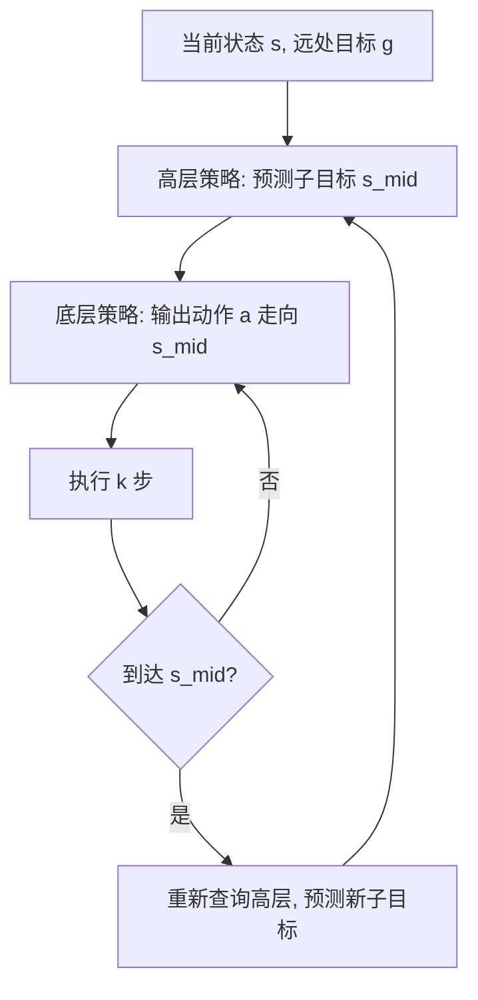

# HIQL：分层离线目标条件 RL 深度精读

> **论文标题**: Offline Goal-Conditioned RL with Latent States as Actions
> **作者**: Seohong Park, Dibya Ghosh, Benjamin Eysenbach, Sergey Levine
> **机构**: UC Berkeley
> **发表**: arXiv:2307.11949, 2023（NeurIPS 2023）
> **代码**: [github.com/seohongpark/HIQL](https://github.com/seohongpark/HIQL)

**标签**: `#强化学习` `#离线RL` `#目标条件RL` `#分层RL` `#子目标` `#IQL` `#长horizon`

---

## 相关阅读

在阅读本文前，建议先了解以下前置知识：

- [Q 函数与 Value 函数](/前置知识/000o_前置知识_Q函数与Value函数) — HIQL 核心用到的 Value Function
- [离线强化学习基础](/前置知识/000s_前置知识_离线强化学习基础) — IQL / expectile regression 的背景
- [行为克隆与 RL 微调范式](/前置知识/000d_前置知识_行为克隆与RL微调范式) — 底层策略用 BC 训练的基础

关联文章：

- [Q-Chunking：用动作分块加速离线到在线 RL](./071_QChunking_RL与动作分块) — 用"分块"解决同一个长 horizon 问题的不同路线
- [Decoupled Q-Chunking](./074_DecoupledQChunking_解耦分块价值与执行) — 在 OGBench 上和 HIQL 直接对比
- [OGBench：离线目标条件 RL 基准](./076_OGBench_离线目标条件RL基准) — HIQL 是 OGBench 的参考算法之一
- [深度强化学习方法综述](/论文综述/S01_深度强化学习方法综述) — RL 算法演化脉络

---

## 贯穿全文的例子

> **场景**：一个四足蚂蚁机器人需要在一个 U 形迷宫中从左上角走到右上角。直线距离只有 5 米，但因为中间有墙，实际路径需要绕一个大 U 字形，总长约 20 米，需要 200+ 步。
>
> 数据集里没有从左上直达右上的完整轨迹，但有大量"在迷宫各处随机游走"的片段。挑战是：怎么把这些片段拼接成一条可行的路径？

---

## 一、背景与动机

### 1.1 长 horizon GCRL 的核心困难：远处目标的价值估计不准

标准的 goal-conditioned Q-learning 训练一个 $Q(s, a, g)$——给定当前状态 $s$、动作 $a$、目标 $g$，估计到达目标需要多少步。

但当目标很远时（如 U 形迷宫中相距 200 步），这个估计极其困难。原因有两个：

1. **Bellman backup 传播太慢**：每次 TD 更新只传播 1 步信息。要让"右上角目标的价值信号"传播到"左上角的起点"，理论上需要 200+ 次完美的 Bellman backup——离线数据有限时这几乎不可能达到
2. **远处目标的 Q 值方差极大**：到达远处目标有无数条可能路径，每条路径的长度差异巨大，这让 Q 值的分布非常分散，单个网络很难拟合

### 1.2 HIQL 的核心洞察：近处容易估，远处靠分解

想象你要从北京去巴黎。如果有人问"从北京出发，下一步该怎么走才能最快到巴黎"——你大概不会试图直接回答这个超长 horizon 的规划问题。你的思路更可能是：

1. **高层**：先去机场（子目标 1），然后飞到巴黎机场（子目标 2）
2. **底层**：从家出发，具体怎么到机场？打车还是坐地铁？

HIQL 做的正是同样的事情：

- **高层策略**：给定远处目标 $g$，预测一个**中间子目标** $s_{\text{mid}}$——一个离当前状态不太远、但方向正确的中间点
- **底层策略**：只需要到达这个近处的子目标 $s_{\text{mid}}$——这是一个短 horizon 问题，标准 GCRL 就能搞定

### 1.3 和 Q-Chunking 的对比：两种解决长 horizon 的哲学

| 思路 | Q-Chunking | HIQL |
|------|-----------|------|
| 核心哲学 | "让每次 backup 跨越更多步" | "把远处目标分解成近处子目标" |
| 解决 TD 慢的方式 | 分块后 1 次 backup = $h$ 步信息 | 分层后近处目标只需少量 backup |
| 策略输出 | $h$ 步动作序列 | 子目标状态（高层）+ 单步动作（底层）|
| 额外组件 | 分块 Critic | 高层策略 + 价值函数 |
| 数据需求 | 需要连续 $h$ 步的轨迹片段 | 只需要状态转移对（action-free data 也可以用！）|

---

## 二、HIQL 的方法

### 2.1 一个 Value Function，两个策略

HIQL 的训练由三个组件构成：

1. **Goal-conditioned Value Function** $V(s, g)$：估计从状态 $s$ 到达目标 $g$ 的期望步数（负数，越接近 0 越好）
2. **高层策略** $\pi_{\text{high}}(s_{\text{mid}} \mid s, g)$：给定当前状态和最终目标，输出一个中间子目标
3. **底层策略** $\pi_{\text{low}}(a \mid s, s_{\text{mid}})$：给定当前状态和子目标，输出执行动作

**关键设计**：$V(s, g)$ 是 **action-free** 的——它只需要知道"从 $s$ 到 $g$ 有多远"，不需要知道具体走了什么动作。这意味着训练 $V$ 可以用**没有动作标注的数据**（只需要状态序列），大大降低了数据要求。

### 2.2 Value Function 的训练：Expectile IQL

$V(s, g)$ 用 IQL 的 expectile regression 方式训练：

$$
L_V(\theta_V) = \mathbb{E}_{(s_t, s_{t+1}) \sim \mathcal{D}}\left[L_\tau^{\text{exp}}\big(r(s_t, g) + \gamma V_{\bar\theta_V}(s_{t+1}, g) - V_{\theta_V}(s_t, g)\big)\right]
$$

**为什么需要这个公式**：这是 IQL 的核心技巧——用 expectile regression 隐式地实现 $\max_a Q(s,a,g)$ 的效果，同时避免了对 OOD 动作的查询（离线 RL 的核心难题）。

> **一句话直觉**：偏向性地让 $V$ 去拟合"从 $s$ 出发到 $g$ 的最好可能结果"，而不是平均结果。

**逐项拆解**：

| 符号 | 含义 | 直觉 |
|------|------|------|
| $V_{\theta_V}(s_t, g)$ | 待训练的价值函数 | "从 $s_t$ 到 $g$ 最快要几步" |
| $r(s_t, g)$ | 奖励，通常 $= -1$（每步惩罚） | "活着就扣分，到了才停" |
| $\gamma V_{\bar\theta_V}(s_{t+1}, g)$ | 下一步的折扣价值（目标网络） | TD target 的后半部分 |
| $L_\tau^{\text{exp}}$ | Expectile loss，$\tau > 0.5$ 时偏向拟合高价值样本 | 近似 max 操作 |

**数值例子**：在 U 形迷宫中，从起点 $s_t$（左上角）到目标 $g$（右上角），真实最短路径需要 200 步。数据集里从 $s_t$ 出发的各种轨迹有长有短（有的走了 300 步才到，有的走了 250 步）。Expectile loss 让 $V$ 去逼近这些样本中**最好的那些**（200-220 步），而不是平均值（250 步）——这给出了对最优路径长度的合理估计。

### 2.3 高层策略：预测子目标

$$
\pi_{\text{high}}(s_{\text{mid}} \mid s, g) = \arg\max_{s' \in \text{future}(s)} \left[\underbrace{V(s', g)}_{\text{子目标到终点的价值}} + \underbrace{V(s, s')}_{\text{当前到子目标的价值}}\right]
$$

**为什么需要这个公式**：高层策略要选一个"好的中间点"——既不能离自己太远（不然底层也到不了），又必须朝着最终目标的方向前进。这个公式说的是：好的子目标 $s'$ 应该让"自己到 $s'$"加上"$s'$ 到终点"的总距离尽可能短。

> **一句话直觉**：选一个"既够得着、又离终点更近"的中间点。

**实现方式**：不是真的搜索所有可能的 $s'$（那是连续空间，不可枷举）。实际做法是在数据里找"从 $s$ 出发 $k$ 步后到达的那些状态"作为候选子目标，然后用 $V(s', g)$ 打分挑选。或者直接训练一个网络来预测子目标。

**数值例子**：蚂蚁在左上角，目标在右上角。候选子目标有：
- $s'_1$：向右 3 步的位置（离终点还是很远，$V(s'_1, g) = -180$）
- $s'_2$：向下走到 U 字底部入口（$V(s'_2, g) = -120$，这个方向对了！）
- $s'_3$：向左走（反方向，$V(s'_3, g) = -210$）

加上"当前到子目标"的代价后，$s'_2$ 总分最优 → 高层选择"先走向 U 字底部"。

### 2.4 底层策略：到达子目标

$$
\pi_{\text{low}}(a \mid s, s_{\text{mid}}) \leftarrow \text{Advantage-Weighted BC}
$$

底层策略的训练很直接：用 goal-conditioned 的优势加权行为克隆（呼应 [AWR](/前置知识/000u_前置知识_AWR_优势加权回归) 的思想）——从数据里找到"成功走向 $s_{\text{mid}}$ 方向的动作"，给这些好动作更高的权重来训练。

因为 $s_{\text{mid}}$ 是一个**近处**子目标（只有 $k$ 步远），底层策略面对的是一个短 horizon 问题——标准的 GCRL 方法足以应对。

### 2.5 整体执行流程

每隔 $k$ 步重新查询高层策略获取新子目标，底层策略负责在这 $k$ 步内到达子目标。这和 MPC 的滚动执行逻辑一样——高层的"规划频率"低于底层的"控制频率"。

---

## 三、为什么 HIQL 在长 horizon 任务上有效

### 3.1 价值传播的加速机制

标准 1 步 GCRL 在 200 步的迷宫中需要 200+ 次 Bellman backup 才能把终点信息传到起点。HIQL 的分层结构天然加速了这个过程：

- 底层：只需要把信息传播 $k$ 步（到子目标）
- 高层：通过 $V(s, g)$ 做"长距离跳跃"——$V$ 的训练利用了数据里所有任意两点之间的距离信息，相当于同时在做所有可能的目标条件 TD backup

### 3.2 轨迹拼接的自然实现

HIQL 的分层结构天然支持轨迹拼接。假设数据里有：
- 轨迹 1：从左上角走到 U 字底部
- 轨迹 2：从 U 字底部走到右上角

HIQL 不需要显式地"拼接"——高层策略发现"U 字底部"是一个好的子目标（因为 $V(\text{底部}, g_{\text{右上}})$ 很高），底层策略在轨迹 1 的数据里学到了"怎么走到底部"，在轨迹 2 的数据里学到了"怎么从底部往上走"。两层结合，自然实现了拼接。

### 3.3 Action-free 数据的利用

HIQL 的一个实用优势是**可以用没有动作标注的数据**。$V(s, g)$ 的训练只需要连续状态对 $(s_t, s_{t+1})$——不需要知道具体执行了什么动作。这在真实场景中很有意义：比如从视频中提取状态序列（手动标注动作成本极高），就可以用来训练 $V$。

底层策略确实需要动作标注的数据，但底层面对的是短 horizon 问题，数据需求量小得多。

---

## 四、实验结果

### 4.1 在 OGBench 上的表现

HIQL 在 [OGBench](./076_OGBench_离线目标条件RL基准) 的评测中：
- **导航任务**（AntMaze、HumanoidMaze）：明显优于非分层方法（GCIQL、CRL）——因为这些任务 horizon 最长
- **操作任务**（Cube、Scene）：和非分层方法相当——这些任务 horizon 相对短，分层的优势不明显
- **被 DQC 超越**：在后续的 [Decoupled Q-Chunking](./074_DecoupledQChunking_解耦分块价值与执行) 工作中，DQC 用"分块+解耦"的方式在同一个 benchmark 上超越了 HIQL——说明"分块"和"分层"这两种加速价值传播的策略可以相互比较

### 4.2 子目标间距 $k$ 的影响

| $k$ 值 | 效果 |
|--------|------|
| $k$ 太小（如 1） | 退化为标准 GCRL，失去分层加速效果 |
| $k$ 适中（如 10-25） | 最优区间：高层规划有意义，底层任务不太难 |
| $k$ 太大（如 100） | 底层面对的子任务太难，底层策略学不好 |

---

## 五、和 Q-Chunking 方法族的深层对比

### 5.1 解决同一问题的不同视角

| 维度 | HIQL（分层路线） | Q-Chunking（分块路线） |
|------|----------------|---------------------|
| 加速 TD 传播的方式 | 分层 $V$ 做长距离跳跃 | 分块 Critic 一次 backup 跨 $h$ 步 |
| 策略的决策空间 | 高层：子目标（状态空间） 底层：单步动作 | 分块策略：$h$ 步动作序列 |
| 对数据的要求 | 可用 action-free 数据训练 $V$ | 需要连续 $h$ 步的完整动作序列 |
| 执行粒度 | 底层每步闭环 | 整段 $h$ 步开环（DQC 解决了这个问题） |
| 探索连贯性 | 依赖子目标质量 | 分块天然连贯 |
| 适合的任务类型 | 长 horizon 导航 | 长 horizon 操作（需要精确动作） |

### 5.2 可以组合吗？

一个自然的问题是：HIQL 的分层思想和 Q-Chunking 的分块思想能不能组合？答案是**理论上可以**——底层策略可以用分块（输出 $h$ 步动作序列到达子目标），高层策略仍然选子目标。这种"分层+分块"的组合是否有额外收益，是一个有趣的开放问题。

---

## 六、核心优势与局限

### 优势

1. **长 horizon 任务上效果好**：通过分层把长距离规划分解成短距离执行
2. **可用 action-free 数据**：Value Function 不需要动作标注
3. **概念简洁直觉清晰**：高层选子目标、底层到子目标，类比人类的规划方式
4. **和 IQL 兼容性好**：底层直接用 IQL 的 expectile 技巧，不需要额外算法

### 局限

1. **子目标间距 $k$ 是超参数**：不同任务的最优 $k$ 不同，需要调参
2. **高层策略的搜索空间是状态空间**：状态空间高维时（如图像），子目标预测变得困难
3. **两层之间的耦合**：底层策略的好坏影响高层的训练反馈，容易互相拖累
4. **在精细操作任务上不如分块方法**：需要精确动作序列的任务（如抓取），分层不如直接"规划一段动作"来得直接

---

## 七、总结

| 维度 | HIQL |
|------|------|
| 核心问题 | 离线 GCRL 中远处目标的价值估计难、TD 传播慢 |
| 核心方案 | 分层：高层预测近处子目标，底层执行到子目标 |
| 关键组件 | Action-free Value Function $V(s,g)$ + 高层子目标策略 + 底层执行策略 |
| 价值估计方式 | IQL 的 expectile regression（隐式 max） |
| 和 Q-Chunking 的关系 | 解决同一问题（长 horizon 稀疏奖励）但用完全不同的路线（分层 vs 分块） |
| 最大优势 | 可以用 action-free 数据、长 horizon 导航效果好 |
| 最大局限 | 精细操作任务上不如分块方法、子目标间距需要调 |

---

## 延伸阅读

- [Q-Chunking：用动作分块加速离线到在线 RL](./071_QChunking_RL与动作分块) — "分块"路线解决同一问题
- [Decoupled Q-Chunking](./074_DecoupledQChunking_解耦分块价值与执行) — 在 OGBench 上超越 HIQL 的分块方法
- [OGBench：离线目标条件 RL 基准](./076_OGBench_离线目标条件RL基准) — HIQL 的主要评测平台
- [离线强化学习基础](/前置知识/000s_前置知识_离线强化学习基础) — IQL / expectile regression 背景
- [AWR 优势加权回归](/前置知识/000u_前置知识_AWR_优势加权回归) — 底层策略训练的相关技巧
- Park et al., "Offline Goal-Conditioned RL with Latent States as Actions", NeurIPS 2023
