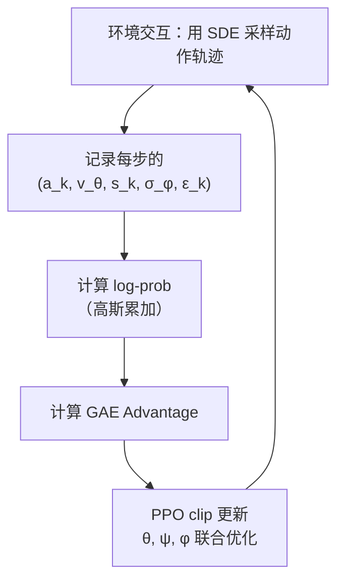
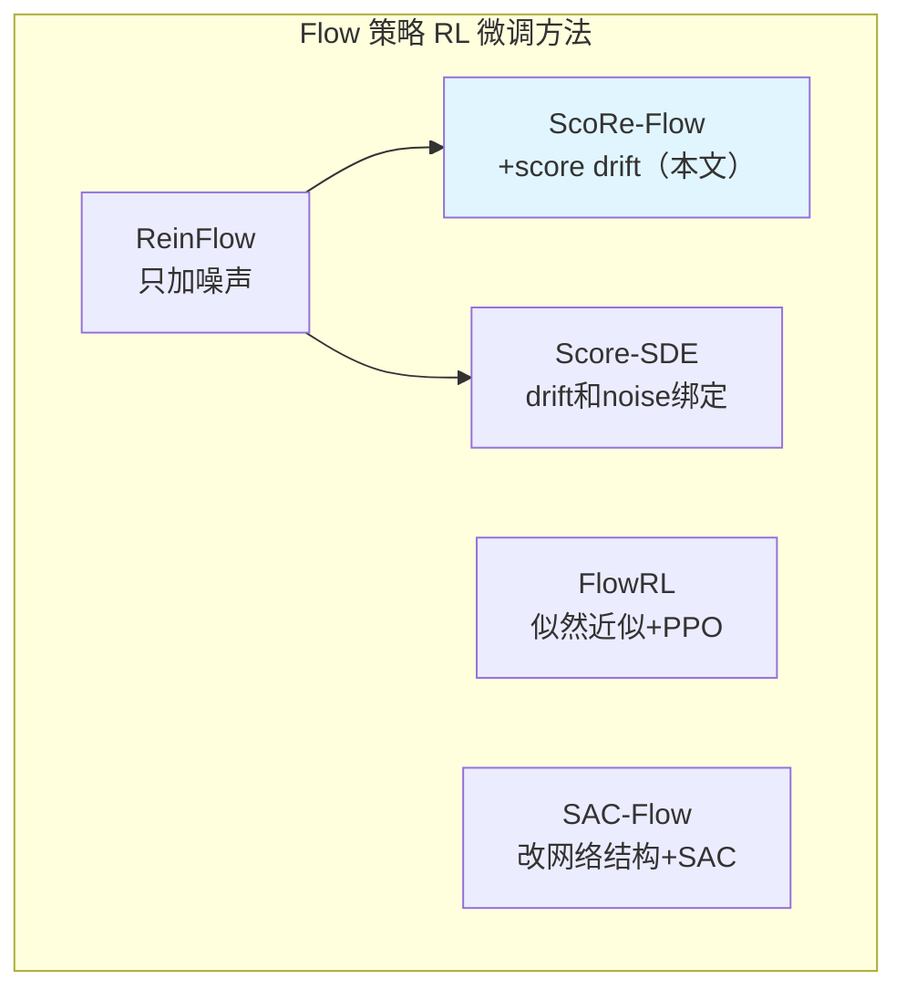

# ScoRe-Flow：Score 引导的 Flow 策略 RL 微调 深度精读

> **论文标题**: ScoRe-Flow: Complete Distributional Control via Score-Based Reinforcement Learning for Flow Matching  
> **作者**: Xiaotian Qiu, Lukai Chen, Jinhao Li, Qi Sun, Cheng Zhuo, Guohao Dai  
> **发表**: arXiv:2604.10962, ICML 2026  

**知识链接**：
- [Flow Matching 与连续归一化流](/前置知识/000g_前置知识_Flow_Matching与连续归一化流) — Flow Matching 的基本原理（ODE 生成、速度场学习）
- [Score Function（密度梯度）与 Score Matching](/前置知识/001t_前置知识_Score_Function密度梯度与Score_Matching) — ⚠️ **必读**：Score function $\nabla_x \log p(x)$ 的定义、直觉和在生成模型中的角色
- [ReinFlow：Flow 策略的噪声注入 RL 微调](/前置知识/001u_前置知识_ReinFlow_Flow策略的噪声注入RL微调) — ⚠️ **必读**：ScoRe-Flow 的 baseline，理解"只加噪声不加引导"的局限性
- [策略梯度与 PPO](/前置知识/000a_前置知识_策略梯度与PPO) — PPO 算法
- [为什么扩散策略难以 RL 微调](/前置知识/000f_前置知识_为什么扩散策略难以RL微调) — Flow/Diffusion 的 log-prob 困难
- [SAC-Flow：用 SAC 直接训练 Flow 策略](./079_SAC_Flow_用SAC直接训练Flow策略) — Off-policy 路线对比
- [FlowRL：Flow VLA 的在线 RL 微调](./018_FlowRL_Flow_VLA的在线RL微调) — 大规模 VLA 的 Flow RL

---

## 相关阅读（开始前必须了解的内容）

本文在三个前置知识之上构建。如果你跳过它们直接读本文，会在第一个公式处卡住：

| 前置知识 | 你需要从中了解什么 |
|----------|------------------|
| [Flow Matching](/前置知识/000g_前置知识_Flow_Matching与连续归一化流) | 速度场 $v_\theta$ 是什么、ODE 推理过程、为什么比 DDPM 快 |
| [Score Function（密度梯度）](/前置知识/001t_前置知识_Score_Function密度梯度与Score_Matching) | $s(x) = \nabla_x \log p(x)$ 的定义和含义——"指向概率高的方向" |
| [ReinFlow](/前置知识/001u_前置知识_ReinFlow_Flow策略的噪声注入RL微调) | 如何给 Flow 加噪声来获得 log-prob、这种方法的局限性（只能控制 variance 不能控制 mean） |

---

## 贯穿全文的例子

> **场景**：一个 7-DOF 机械臂做桌面物体操作（pick-and-place）。动作 $a \in \mathbb{R}^7$ 是关节位移。策略是一个 Flow Matching 模型，用 4 步 ODE 从高斯噪声生成动作。
>
> - **预训练**（Flow Matching）：用示范数据训练，成功率 78%
> - **目标**：用 RL（PPO）把成功率提升到 95%+
> - **baseline（ReinFlow）**：给 ODE 加噪声后用 PPO → 成功率提升到 85%（但收敛慢）
> - **本文方法（ScoRe-Flow）**：在 ReinFlow 基础上加 score drift 引导 → 成功率 95%+，收敛快 2.4 倍
>
> **核心改进的直觉**：ReinFlow 只是在正确路线附近"随机抖动"来探索，而 ScoRe-Flow 不仅抖动，还能主动调整 flow 的行进方向——让粒子朝着"好动作聚集的方向"偏移。

---

## 一、问题定位：ReinFlow 的局限

### 1.1 回顾 ReinFlow 的做法

[ReinFlow](/前置知识/001u_前置知识_ReinFlow_Flow策略的噪声注入RL微调) 的核心是给确定性 ODE 加噪声：

$$
a_{k+1} = a_k + v_\theta(a_k, t_k, s) \cdot \Delta t + \sigma_\phi(t_k) \cdot \epsilon_k
$$

这解决了两个问题：(1) 让策略有了随机性用于探索；(2) 让 log-prob 可以精确计算（高斯累加）。

**但局限在于**：噪声 $\sigma_\phi \cdot \epsilon$ 是**各向同性的**——每个方向等概率地随机抖动，不改变 drift $v_\theta$ 的方向。

### 1.2 类比理解局限性

想象你在一个大型停车场找自己的车：

- **ReinFlow 的策略**：你记得车大概在"东侧某处"（drift 方向），所以你往东走，但每一步都随机偏左或偏右一点（噪声）。如果你的大方向记对了，最终能找到车——但如果大方向偏了（比如车其实在东南角），光靠随机左右抖动很难修正。

- **ScoRe-Flow 的策略**：你不仅随机偏移，还有一个"信号源"（score function）告诉你"车的密集区域在偏南方向"——这个额外的方向信号让你每步都能稍微修正大方向，更快找到车。

**数学上的对应**：

| 停车场类比 | 数学对应 |
|-----------|---------|
| "往东走"（大方向） | Drift $v_\theta$ |
| "每步随机偏移" | 噪声 $\sigma \cdot \epsilon$ |
| "信号源告诉你车在东南" | Score function $s_t(a)$（[定义见前置知识](/前置知识/001t_前置知识_Score_Function密度梯度与Score_Matching)） |
| "修正大方向" | Score drift $\alpha \cdot s_t$ |

### 1.3 形式化问题

用连续时间 SDE 的语言，ReinFlow 控制的是策略分布的**方差**（variance）——通过 $\sigma_\phi$ 调节探索幅度。但它无法控制**均值**（mean）——drift 方向完全由预训练的 $v_\theta$ 决定。

**ScoRe-Flow 的核心目标**：同时控制 mean（通过 score drift）和 variance（通过噪声），实现对策略分布的**完整分布控制**（Complete Distributional Control）。

---

## 二、Score Function 在 Flow 中的闭式表达

### 2.1 什么是这里的 Score Function

本文的 score function 是指**时刻 $t$ 的中间分布 $\rho_t(a)$ 的密度梯度**：

$$
s_t(a) = \nabla_a \log \rho_t(a)
$$

**为什么需要这个定义**：我们想在 flow 的生成过程中加入一个"方向引导"——让粒子不只是沿着 $v_\theta$ 走，还能朝着"中间分布中概率高的区域"偏移。这个方向引导就是 score function。如果你不熟悉 score function 的含义，请先阅读 [Score Function 前置知识](/前置知识/001t_前置知识_Score_Function密度梯度与Score_Matching)。

> 一句话直觉：在 flow 的第 $t$ 步，粒子 $a$ 可能在空间中"偏离了主流"。Score $s_t(a)$ 告诉它"大部分同伴在哪个方向"——朝那个方向偏移一点，就能回到高概率区域。

**关键区分**：这里的 score function 和 RL 中常见的"策略梯度 score function"（$\nabla_\theta \log \pi_\theta$）完全不同——前者是对**数据** $a$ 求梯度，后者是对**参数** $\theta$ 求梯度。详细辨析见 [Score Function 前置知识的辨析表](/前置知识/001t_前置知识_Score_Function密度梯度与Score_Matching#⚠️-两种-score-function-辨析-极其重要)。

### 2.2 关键发现：Score 有闭式解

一般情况下，计算 $\nabla_a \log \rho_t(a)$ 需要知道 $\rho_t$ 的解析形式或额外训练一个 score 网络。但本文证明了——**对于线性 Flow Matching 路径，score 可以直接从速度场 $v_\theta$ 计算出来**：

$$
s_t(a) = \frac{t \cdot v_\theta(t, a, s) - a}{1 - t}
$$

**为什么需要这个公式**：如果 score 需要额外训练一个网络来估计，那 ScoRe-Flow 就会很贵（双网络、双训练）。这个闭式解说明 score 是"免费的"——直接从已有的速度场做一次代数变换就行，零额外参数、零额外前向传播。

> 一句话直觉：Flow 的速度场 $v_\theta$ 的工作是"把噪声推向数据"——它天然"知道"数据在哪。把它做一个简单的数学变换，就能提取出"哪个方向数据更密集"的信息。

**逐项拆解**：

| 符号 | 数学含义 | 物理直觉 | 在本例中对应 |
|------|---------|---------|------------|
| $v_\theta(t, a, s)$ | 时刻 $t$、位置 $a$ 处的速度预测 | "粒子应该往哪走" | 速度场网络的输出 |
| $t \cdot v_\theta$ | 速度被当前时间缩放 | 越接近终点，目标位置越确定 | 时间加权的目标方向 |
| $t \cdot v_\theta - a$ | 分子：目标位置估计和当前位置的差 | "我离主流有多远" | 偏差向量 |
| $1 - t$ | 分母：剩余时间 | 越接近终点分母越小、score 越大 | 离终点还有多少步 |
| $1/(1-t)$ | 时间衰减因子 | 越接近终点，分布越集中，"山坡"越陡 | score 的放大倍数 |

**数值例子**（$d=2$，$t = 0.6$）：

假设机械臂处于中间状态 $a = [0.3, -0.1]$（粒子在 flow 中间某处）

- 速度场预测：$v_\theta = [1.5, 2.0]$（网络认为这个粒子应该往右上方运动）
- 分子：$t \cdot v_\theta - a = 0.6 \times [1.5, 2.0] - [0.3, -0.1] = [0.9, 1.2] - [0.3, -0.1] = [0.6, 1.3]$
- 分母：$1 - t = 0.4$
- Score：$s_{0.6}(a) = [0.6, 1.3] / 0.4 = [1.5, 3.25]$

**含义**：score 指向右上方 $[1.5, 3.25]$，说明"大部分粒子同伴"在当前位置的右上方。如果我们沿 score 方向给粒子一个推力，它就会被"拉"向同伴们聚集的区域——即高概率区域。

**注意 $t \to 1$ 时的发散**：当 $t$ 接近 1 时，$1-t \to 0$，score 趋于无穷大。这是因为 $t=1$ 时分布退化为 delta 函数（粒子们都到达了各自的终点），"山"变成了无限陡的"针尖"。这个发散问题在下面第三节通过 $(1-t)$ 衰减因子解决。

### 2.3 推导直觉（为什么 score 有这个形式）

线性 Flow Matching 的路径是：$a_t = (1-t) \cdot a_0 + t \cdot a_1$，其中 $a_0 \sim \mathcal{N}(0, I)$，$a_1$ 是数据。

在时刻 $t$，给定位置 $a_t$，条件速度场就是 $u_t = a_1 - a_0$。而边际速度场 $v_\theta$ 近似于对所有可能的 $(a_0, a_1)$ 配对做加权平均。

从 $a_t = (1-t)a_0 + t \cdot a_1$ 可以反解 $a_0 = (a_t - t \cdot a_1) / (1-t)$。由于 $a_0 \sim \mathcal{N}(0, I)$，$a_t$ 给定 $a_1$ 的条件分布是：

$$
a_t | a_1 \sim \mathcal{N}(t \cdot a_1, (1-t)^2 I)
$$

其条件 score 是 $\nabla_{a_t} \log p(a_t | a_1) = -(a_t - t \cdot a_1) / (1-t)^2$。做适当的边际化和速度场替换后，得到上面的闭式公式。

---

## 三、方法：ScoRe-Flow 的完整 SDE

### 3.1 在 ReinFlow 基础上加一项

回忆 [ReinFlow](/前置知识/001u_前置知识_ReinFlow_Flow策略的噪声注入RL微调) 的 SDE 只有两项（drift + noise）。ScoRe-Flow 加入第三项——score drift 修正：

$$
\mathrm{d}a_t = \Big[\underbrace{v_\theta(t, a_t, s)}_{\text{① 预训练速度场}} + \underbrace{\alpha_\psi^{\text{scaled}}(t) \cdot s_t(a_t)}_{\text{② Score drift 修正（新增）}}\Big]\mathrm{d}t + \underbrace{\sigma_\phi(t, a_t, s)}_{\text{③ 学习的噪声}}\,\mathrm{d}W_t
$$

**为什么需要这个公式**：这是 ScoRe-Flow 的核心方程。相比 ReinFlow（只有 ① + ③），它多了 ② score drift 修正。这一项让 flow 在运动过程中能**主动偏向高概率区域**，而不只是被动地随机抖动。

> 一句话直觉：Flow 的每步更新变成了"沿原路线走（①）+ 朝着高概率方向拐一拐（②）+ 随机抖动探索（③）"。

**逐项拆解**：

| 编号 | 项 | 数学表达 | 物理含义 | 控制什么 |
|------|---|---------|---------|---------|
| ① | 预训练速度场 | $v_\theta(t, a_t, s)\,\mathrm{d}t$ | "原来的铁轨方向" | 基础运动方向（由预训练决定） |
| ② | Score drift 修正 | $\alpha_\psi^{\text{scaled}}(t) \cdot s_t(a_t)\,\mathrm{d}t$ | "朝高概率区域偏移" | 策略分布的 **mean**（方向） |
| ③ | 学习的噪声 | $\sigma_\phi(t, a_t, s)\,\mathrm{d}W_t$ | "随机探索" | 策略分布的 **variance**（幅度） |

**关键设计洞察**：② 和 ③ 是**解耦的**——可以独立控制"往哪偏"和"探索多少"。之前的方法（如 Score-SDE 消融）把两者绑定为 $\sigma = \sqrt{2\alpha}$，灵活性不够。

**和 ReinFlow 对比**：

| | ReinFlow | ScoRe-Flow |
|---|---|---|
| Drift | $v_\theta$（固定） | $v_\theta + \alpha \cdot s_t$（可修正方向） |
| Noise | $\sigma_\phi$（学习） | $\sigma_\phi$（学习） |
| 能控制 | 只有 variance | mean + variance |
| 类比 | 在固定铁轨上抖动 | 铁轨方向也能调 |

### 3.2 $(1-t)$ Time-decay 稳定性约束

上一节提到 score 在 $t \to 1$ 时会发散：$|s_t| = O((1-t)^{-1})$。如果直接把发散的 score 乘上去，drift 修正会无穷大，训练崩溃。

解决方案——给 $\alpha_\psi$ 乘一个 $(1-t)$ 因子：

$$
\alpha_\psi^{\text{scaled}}(t) = (1-t) \cdot \alpha_\psi(t)
$$

**为什么需要这个公式**：$(1-t)$ 恰好抵消 score 的 $(1-t)^{-1}$ 发散因子，保证乘积 $\alpha_\psi^{\text{scaled}} \cdot s_t$ 在整个 $t \in [0,1]$ 区间内有界。

> 一句话直觉：score 越接近终点越"激动"（发散），我们用一个"镇静剂" $(1-t)$ 来压制它——越接近终点镇静剂越强，刚好让它不会爆掉。

**数值验证**：

| $t$ | $|s_t| \sim \frac{1}{1-t}$ | $(1-t)$ 因子 | 乘积 $\sim 1$ |
|-----|---------------------------|-------------|--------------|
| 0.0 | 1.0 | 1.0 | 1.0 |
| 0.5 | 2.0 | 0.5 | 1.0 |
| 0.9 | 10.0 | 0.1 | 1.0 |
| 0.99 | 100.0 | 0.01 | 1.0 |

→ 无论 $t$ 在哪，实际的 drift 修正幅度始终受控（大约恒定量级）。

**消融实验确认**：如果不加 $(1-t)$ 衰减（即固定 $\alpha = 1$），训练在 $t$ 接近 1 时直接崩溃（loss 爆炸）。这不是可选的——是方法能 work 的必要条件。

---

## 四、两个可学习组件的设计

### 4.1 组件概览

ScoRe-Flow 在预训练的 flow 网络 $v_\theta$ 之外，引入两个轻量级的可学习组件：

| 组件 | 名称 | 输入 | 输出 | 架构 | 参数量 |
|------|------|------|------|------|--------|
| Score scheduler $\alpha_\psi$ | "方向引导强度调节器" | 标量时间 $t$ | 标量 $\alpha > 0$ | 2 层 MLP + Softplus | ~几百 |
| Variance predictor $\sigma_\phi$ | "探索幅度控制器" | $(a_t, t, s)$ | 标量 $\sigma \in [\sigma_{\min}, \sigma_{\max}]$ | MLP + bounded Tanh | ~几千 |

**为什么这样设计**：

- **$\alpha_\psi$ 只依赖时间 $t$**：作者发现 score 引导的最优强度主要和"当前处于 flow 的哪个阶段"有关——开头需要强引导（粒子离目标远），结尾需要弱引导（粒子已接近目标）。状态和位置的影响很小，所以简单的 $t \mapsto \alpha$ 映射就够了。
- **$\sigma_\phi$ 依赖 $(a_t, t, s)$**：噪声强度需要更细粒度的控制——在某些状态下需要更多探索（新情况），在某些位置需要更少探索（已接近好动作区域）。

### 4.2 Score Scheduler $\alpha_\psi$ 的细节

$\alpha_\psi$ 的设计目标是让网络自动学会"在 flow 的不同阶段，score 引导应该多强"。

**实现**：
```python
class ScoreScheduler(nn.Module):
    """学习 score drift 的强度随时间变化的模式"""
    def __init__(self, hidden_dim=64):
        super().__init__()
        self.net = nn.Sequential(
            nn.Linear(1, hidden_dim),   # 输入：标量 t
            nn.ReLU(),
            nn.Linear(hidden_dim, 1),
            nn.Softplus()               # 保证输出 > 0
        )
    
    def forward(self, t):
        alpha = self.net(t.unsqueeze(-1))  # 学习的基础强度
        return (1 - t) * alpha             # 乘以 (1-t) 衰减因子
```

上面这段代码实现了两个功能：(1) 一个小 MLP 学习 $\alpha_\psi(t)$，输出始终为正（Softplus 保证）；(2) 乘以 $(1-t)$ 得到最终的 $\alpha_\psi^{\text{scaled}}(t)$，防止 score 发散。

### 4.3 Variance Predictor $\sigma_\phi$ 的细节

**实现**：
```python
class VariancePredictor(nn.Module):
    """学习每步的噪声强度（探索幅度）"""
    def __init__(self, obs_dim, action_dim, hidden_dim=128,
                 sigma_min=0.01, sigma_max=0.5):
        super().__init__()
        self.sigma_min = sigma_min
        self.sigma_max = sigma_max
        self.net = nn.Sequential(
            nn.Linear(action_dim + obs_dim + 1, hidden_dim),  # 输入: a_t, s, t
            nn.ReLU(),
            nn.Linear(hidden_dim, hidden_dim),
            nn.ReLU(),
            nn.Linear(hidden_dim, 1),
            nn.Tanh()  # 输出在 [-1, 1]
        )
    
    def forward(self, a_t, t, obs):
        x = torch.cat([a_t, obs, t.unsqueeze(-1)], dim=-1)
        raw = self.net(x)  # [-1, 1]
        # 映射到 [sigma_min, sigma_max]
        sigma = self.sigma_min + (self.sigma_max - self.sigma_min) * (raw + 1) / 2
        return sigma
```

**设计要点**：
- **输出有界** $[\sigma_{\min}, \sigma_{\max}]$：Tanh 的输出映射到固定范围。$\sigma_{\min}=0.01$ 防止噪声为零（必须有探索）；$\sigma_{\max}=0.5$ 防止噪声太大（轨迹崩溃）。
- **输入包含 $(a_t, t, s)$**：噪声强度可以根据当前位置、时间和观测自适应调节。比如在安全关键状态下可以自动降低探索。

---

## 五、Log-Probability 计算与 PPO 训练

### 5.1 离散化后每步是高斯转移

和 [ReinFlow](/前置知识/001u_前置知识_ReinFlow_Flow策略的噪声注入RL微调) 的处理方式相同，SDE 离散化后每步转移是一个高斯分布：

$$
p(a_{k+1} | a_k, s) = \mathcal{N}\Big(a_{k+1};\; a_k + \big[v_\theta + \alpha_\psi^{\text{scaled}} \cdot s_k\big] \Delta t,\; \sigma_\phi^2 \Delta t \cdot I\Big)
$$

**为什么需要这个公式**：PPO 需要 log-prob。这个公式说明：加了 score drift 后，每步转移仍然是高斯——只不过均值从 "$a_k + v_\theta \Delta t$"（ReinFlow）变成了 "$a_k + [v_\theta + \alpha \cdot s] \Delta t$"（ScoRe-Flow）。高斯的 log-prob 有解析形式，所以 PPO 仍然可以直接使用。

> 一句话直觉：ScoRe-Flow 的"高斯均值"被 score 项偏移了——对 log-prob 计算来说，只是换了一个中心点，计算流程和 ReinFlow 完全一样。

**逐项拆解**：
- **均值** = $a_k + [v_\theta + \alpha_\psi^{\text{scaled}} \cdot s_k] \Delta t$："如果没有噪声，下一步粒子会到这里"
- **方差** = $\sigma_\phi^2 \Delta t \cdot I$："围绕均值的随机偏移范围"
- $s_k = s_{t_k}(a_k)$：用第二节的闭式公式从 $v_\theta$ 直接算出

### 5.2 轨迹 Log-Prob

和 ReinFlow 一样，整条轨迹的 log-prob 是各步之和：

$$
\log\pi(a_K|s) = \log p_0(a_0) + \sum_{k=0}^{K-1} \log p(a_{k+1}|a_k, s)
$$

每一项是标准的多维高斯 log-density：

$$
\log p(a_{k+1}|a_k, s) = -\frac{d}{2}\log(2\pi\sigma_\phi^2\Delta t) - \frac{\|a_{k+1} - \mu_k\|^2}{2\sigma_\phi^2\Delta t}
$$

其中 $\mu_k = a_k + [v_\theta(t_k, a_k, s) + \alpha_\psi^{\text{scaled}}(t_k) \cdot s_k] \Delta t$。

### 5.3 PPO 训练

有了 log-prob，标准 PPO 直接使用。训练联合优化三组参数：

| 参数 | 网络 | PPO 中的作用 |
|------|------|-------------|
| $\theta$ | 速度场 $v_\theta$ | 基础策略（同时影响 drift 和 score） |
| $\psi$ | Score scheduler $\alpha_\psi$ | 控制方向引导强度 |
| $\phi$ | Variance predictor $\sigma_\phi$ | 控制探索幅度 |

**训练流程**：



**关键细节**：
- $v_\theta$ 同时参与 drift 和 score 的计算（score = $f(v_\theta)$），所以优化 $\theta$ 会同时改善"方向"和"引导"
- 初始化时 $\alpha_\psi$ 较小（接近 ReinFlow），训练过程中逐渐增大
- Critic 网络独立训练（和标准 PPO 一样）

---

## 六、和其他方法的核心对比

### 6.1 方法定位图



### 6.2 详细对比表

| 方法 | 改了 Flow 的什么 | Drift 修正？ | Variance 独立学？ | RL 算法 | 对预训练模型友好？ |
|------|----------------|------------|-----------------|--------|----------------|
| [ReinFlow](/前置知识/001u_前置知识_ReinFlow_Flow策略的噪声注入RL微调) | 只加噪声 $\sigma$ | ❌ | ✅ | PPO | ✅（不改网络） |
| Score-SDE（消融） | Score drift + 绑定噪声 | ✅ | ❌（$\sigma = \sqrt{2\alpha}$） | PPO | ✅ |
| **ScoRe-Flow（本文）** | Score drift + 独立噪声 | ✅ | ✅ | PPO | ✅（不改网络） |
| [SAC-Flow](./079_SAC_Flow_用SAC直接训练Flow策略) | 重新参数化速度网络 | ❌（直接改 $v_\theta$） | N/A | SAC | ❌（需改网络结构） |
| [FlowRL](./018_FlowRL_Flow_VLA的在线RL微调) | 不改 Flow 生成过程 | ❌ | N/A | PPO | ✅（近似 log-prob） |

### 6.3 ScoRe-Flow vs SAC-Flow 的本质区别

这两个方法代表 Flow RL 微调的两条完全不同的路线：

| 维度 | ScoRe-Flow（本文） | [SAC-Flow](./079_SAC_Flow_用SAC直接训练Flow策略) |
|------|-------------------|-----------|
| **哲学** | "在采样时引导方向" | "直接改 flow 内部结构" |
| **修改位置** | 采样过程（加 drift + noise） | 网络结构（GRU/Transformer） |
| **RL 算法** | On-policy PPO | Off-policy SAC |
| **样本效率** | 较低（on-policy 必须丢弃旧数据） | 较高（off-policy 复用旧数据） |
| **对预训练模型兼容性** | ✅ 完全兼容（不改 $v_\theta$ 结构） | ❌ 需要重新设计 $v_\theta$ 结构 |
| **适用场景** | 有大型预训练 flow（如 π₀），不想改结构 | 从头训练或小模型 |

**互补性**：SAC-Flow 样本效率高但需要改网络；ScoRe-Flow 不改网络结构，对已有预训练 flow model（如 π₀）更友好。

### 6.4 ScoRe-Flow vs Score-SDE（为什么解耦很重要）

Score-SDE（论文中的消融实验）把 score 强度和噪声强度绑定为 $\sigma = \sqrt{2\alpha}$：

| | Score-SDE（绑定） | ScoRe-Flow（解耦） |
|---|---|---|
| 关系 | 增大 score 引导 → 噪声自动增大 | 两者独立调节 |
| 问题 | 想加强引导时被迫加大噪声 → 训练不稳定 | 可以强引导 + 小噪声 |
| 初期 | 收敛快（score 引导强） | 收敛快 |
| 后期 | 性能受限（噪声无法单独减小） | 性能更高 |

**消融结论**：解耦后最终性能提升约 3-5%（在操作任务上差距更大）。

---

## 七、实验结果

### 7.1 收敛速度

在 D4RL 运动任务（HalfCheetah, Hopper, Walker2d）上：

| 对比 | ScoRe-Flow 的优势 |
|------|------------------|
| vs ReinFlow（相同步数 $K=4$） | 快 **2.4 倍**到达 90% 最终性能 |
| vs DPPO（扩散策略 + PPO，$K=50$） | 快 **21.9 倍** |

收敛快的原因：score drift 让策略在每个 PPO 更新后更快地"找到"好动作区域，而不是靠随机噪声碰运气。

### 7.2 操作任务

| 任务 | ReinFlow-S | DPPO | **ScoRe-Flow** |
|------|-----------|------|-----------|
| Robomimic PickPlaceCan | 91.7% | 96.5% | **98.3%** |
| Robomimic Square | 77.3% | 78.3% | **84.7%** |
| Robomimic Transport | 88.7% | 53.0% | **94.4%** |
| Kitchen Complete（满分 4） | 3.9 | 3.8 | **4.0** |

**关键观察**：
- 在最难的 Transport 任务上（双臂协作），ScoRe-Flow 超出 ReinFlow **5.7%**——score 引导在高维复杂任务上优势更明显
- ScoRe-Flow 在所有任务上都达到或接近满分

### 7.3 消融：Score 各组件的作用

| 配置 | 效果 |
|------|------|
| 完整 ScoRe-Flow | 最佳 |
| 去掉 score（$\alpha=0$） | 退化为 ReinFlow（只有噪声），收敛变慢 |
| Score 强度固定为 1（$\alpha=1$，不学习） | Score 在 $t\to1$ 爆炸，训练崩溃 |
| 不加 $(1-t)$ 衰减 | 同上：训练崩溃 |
| Score-SDE（drift 和 variance 绑定） | 初期收敛快，但最终性能低于 ScoRe-Flow |
| 只学 $\alpha$，固定 $\sigma$ | 性能中等（不能自适应调节探索） |

**最重要的消融结论**：
1. Score drift 本身贡献了收敛速度的主要提升（vs ReinFlow）
2. $(1-t)$ 衰减是必需的（没有它训练直接崩）
3. $\alpha$ 和 $\sigma$ 解耦贡献了最终性能的额外提升

---

## 八、关键 Takeaway

### 8.1 核心贡献总结

1. **Score = 免费的方向引导**。从 flow 的速度场做一个简单代数变换 $s_t = (tv_\theta - a)/(1-t)$ 就能得到 score——不需要额外网络，不需要额外训练。这让 drift 修正变成了"免费午餐"。

2. **解耦 mean 和 variance 控制**。之前的方法把"往哪走"（drift）和"探索多少"（noise）绑在一起。ScoRe-Flow 解耦了它们——可以独立控制"策略朝哪偏"和"探索幅度多大"。

3. **On-policy PPO，不需要改 flow 网络结构**。和 SAC-Flow 需要重新参数化速度网络不同，ScoRe-Flow 的 flow 网络结构完全不变——只在采样时加了 score drift 和学习噪声。这对已有的大型预训练 flow model（如 π₀）更友好。

4. **$(1-t)$ 衰减是关键**。Score 在 $t \to 1$ 时发散，不加约束会导致训练崩溃。$(1-t)$ 因子的 hard constraint 是这个方法能 work 的必要条件。

### 8.2 适用场景

| 场景 | ScoRe-Flow 是否合适 | 原因 |
|------|-------------------|------|
| 有大型预训练 Flow（如 π₀）+ 想用 RL 提升 | ✅ 最佳选择 | 不改网络结构，直接在采样时加引导 |
| 从头训练 Flow + RL | ⚠️ 可以但不一定最优 | SAC-Flow 可能样本效率更高 |
| 离线 RL 设置 | ❌ 不适用 | On-policy 方法，需要在线交互 |
| Diffusion Policy（DDPM）+ RL | ❌ 不适用 | 本方法专为 Flow Matching 设计 |

---

## 延伸阅读

- [Score Function（密度梯度）与 Score Matching](/前置知识/001t_前置知识_Score_Function密度梯度与Score_Matching) ← Score function 是什么、为什么能从 $v_\theta$ 免费算出来
- [ReinFlow：Flow 策略的噪声注入 RL 微调](/前置知识/001u_前置知识_ReinFlow_Flow策略的噪声注入RL微调) ← ScoRe-Flow 的 baseline
- [SAC-Flow：用 SAC 直接训练 Flow 策略](./079_SAC_Flow_用SAC直接训练Flow策略) ← Off-policy 路线：改网络结构让梯度稳定
- [FlowRL：Flow VLA 的在线 RL 微调](./018_FlowRL_Flow_VLA的在线RL微调) ← 大规模 VLA 上的 Flow RL
- [Flow Matching 与连续归一化流](/前置知识/000g_前置知识_Flow_Matching与连续归一化流) ← Flow Matching 基础
- [策略梯度与 PPO](/前置知识/000a_前置知识_策略梯度与PPO) ← PPO 的完整原理

**原始论文**：Qiu et al., "ScoRe-Flow: Complete Distributional Control via Score-Based Reinforcement Learning for Flow Matching", ICML 2026
