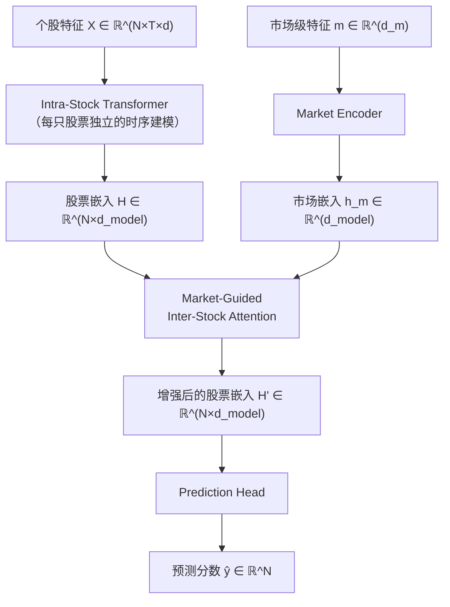

# MASTER：Market-Aware Stock Transformer 深度精读

> **论文标题**: MASTER: Market-Guided Stock Transformer for Stock Price Forecasting  
> **作者**: Tong Li, Zhaoyang Liu, Yanyan Shen, et al.  
> **机构**: Shanghai Jiao Tong University  
> **发表**: AAAI 2024  
> **DOI**: https://ojs.aaai.org/index.php/AAAI/article/view/27767

**知识链接**：
- [截面选股模型与评价指标](/前置知识/001w_前置知识_截面选股模型与评价指标) — IC/ICIR/RankIC 的定义
- [Walk-Forward 滚动回测](/前置知识/001x_前置知识_Walk_Forward滚动回测) — MASTER 的评估框架
- [LightGBM 在量化选股中的应用](/前置知识/001y_前置知识_LightGBM在量化选股中的应用) — 必须超越的基线
- [分布漂移与在线适配](/前置知识/001z_前置知识_分布漂移与在线适配) — MASTER 面临的核心挑战
- [StockMixer 精读](/论文综述/082_StockMixer_轻量截面混合选股) — 更轻量的截面方案（对比）

---

## 贯穿全文的例子

> CSI300（沪深 300）成分股，日频预测。
> - 每只股票有 $d=6$ 维日频特征：(开盘/最高/最低/收盘/成交量/换手率) 的过去 $T=20$ 天
> - 输入：$N=300$ 只股票 × $T=20$ 天 × $d=6$ 维 = $\mathbf{X} \in \mathbb{R}^{300 \times 20 \times 6}$
> - 另外还有一个"市场级"特征：沪深 300 指数本身的收益率、波动率、情绪指标等
> - 目标：预测每只股票未来 1 天的超额收益率排序

---

## 一、MASTER 解决什么问题

### 1.1 现有截面模型的三个缺陷

| 缺陷 | 说明 | MASTER 的解法 |
|------|------|--------------|
| **1. 股票关系是静态的** | GNN 方法用固定图（行业/供应链）建模关系，但关系会随时间变化 | 用 Attention 动态计算股票间关系权重 |
| **2. 忽略市场整体状态** | 现有方法只看个股特征，不知道"当前是牛市还是熊市" | 引入 Market-Guided Attention |
| **3. 时序建模与截面建模分离** | 先用 LSTM 提取时序特征，再用 GNN 建模截面——两步解耦可能丢信息 | Intra-stock Transformer 统一处理 |

### 1.2 核心创新

MASTER 的关键贡献是 **Market-Guided Attention**：

> 不是让股票和股票直接做 attention，而是让"市场状态"来**引导**哪些股票之间应该关注。在牛市中，高 beta 股票之间的关系更重要；在熊市中，防御型股票之间的关系更重要。

---

## 二、模型架构

### 2.1 总体流程


```mermaid
flowchart TD
    A["个股特征 X ∈ ℝ^(N×T×d)"] --> B["Intra-Stock Transformer<br>（每只股票独立的时序建模）"]
    B --> C["股票嵌入 H ∈ ℝ^(N×d_model)"]
    
    M["市场级特征 m ∈ ℝ^(d_m)"] --> D["Market Encoder"]
    D --> E["市场嵌入 h_m ∈ ℝ^(d_model)"]
    
    C --> F["Market-Guided<br>Inter-Stock Attention"]
    E --> F
    F --> G["增强后的股票嵌入 H' ∈ ℝ^(N×d_model)"]
    G --> H["Prediction Head"]
    H --> I["预测分数 ŷ ∈ ℝ^N"]
```

### 2.2 Intra-Stock Transformer（个股时序建模）

对每只股票 $i$，取其过去 $T$ 天的特征 $\mathbf{x}_i \in \mathbb{R}^{T \times d}$，用一个 Transformer Encoder 提取时序模式：

$$
\mathbf{h}_i = \text{TransformerEncoder}(\mathbf{x}_i) \in \mathbb{R}^{d_{\text{model}}}
$$

**这个公式在做什么**：把一只股票过去 $T$ 天的原始特征序列，通过标准 Transformer Encoder 压缩成一个固定长度的向量，代表这只股票"当前的时序状态"。

::: details 📐 公式详解（点击展开）

| 子表达式 | 它是谁 | 它在干嘛 |
|---------|--------|---------|
| $\mathbf{x}_i \in \mathbb{R}^{T\times d}$ | **单只股票的时序特征** | 第 $i$ 只股票过去 $T$ 天、每天 $d$ 维的原始特征序列 |
| $\text{TransformerEncoder}(\cdot)$ | **时序信息提炼器** | 标准多头自注意力 + FFN，让每天的特征关注其他天的特征 |
| $\mathbf{h}_i \in \mathbb{R}^{d_{\text{model}}}$ | **该股票的时序摘要** | 取 [CLS] token 或 average pooling 得到的固定维度表示 |

**用人话读**："把一只股票过去 T 天的原始特征丢进 Transformer，让每天关注其他天，最后压缩成一个代表这只股票当前状态的向量。"

**为什么用 Transformer 而不是 LSTM**：Transformer 能直接关注任意两天的关系（如"第 1 天的放量和第 10 天的突破"），不受"遗忘门"的限制；所有 $N$ 只股票共享同一个 Transformer 参数，保证模型可以泛化到新股票。
:::

> 为什么用 Transformer 而不是 LSTM？ Transformer 能直接关注任意两天的关系（如"第 1 天的放量和第 10 天的突破"），不受"遗忘门"的限制。

所有 $N$ 只股票共享同一个 Transformer 参数——这保证了模型可以泛化到新股票。

### 2.3 Market-Guided Inter-Stock Attention（核心创新）

这是 MASTER 的核心模块。标准 attention 是：

$$
\text{Attention}(Q, K, V) = \text{softmax}\left(\frac{QK^\top}{\sqrt{d_k}}\right) V
$$

**这个公式在做什么**：标准注意力公式，用 Query 和 Key 的相似度算出权重，再对 Value 加权求和——这是 Market-Guided Attention 的基础形式，下面会在此基础上加入市场信息。

::: details 📐 公式详解（点击展开）

| 子表达式 | 它是谁 | 它在干嘛 |
|---------|--------|---------|
| $Q,K,V$ | **标准三件套** | 分别是查询、键、值，由股票嵌入矩阵投影得到 |
| $QK^\top/\sqrt{d_k}$ | **基于特征本身的相似度** | 只看股票特征算出的相关性，不考虑市场状态 |
| $\text{softmax}(\cdot)V$ | **加权聚合** | 归一化权重后对 Value 求和 |

**用人话读**："这就是最普通的注意力机制——只根据股票自身特征算相似度，还没有引入市场状态信息。"

**为什么先写这一行**：作为对照基准，说明 Market-Guided Attention 是在这个标准公式基础上做了什么修改（下面加了一个市场条件偏置项）。
:::

MASTER 的 Market-Guided Attention 在此基础上加了市场信息的调制：

$$
\text{MG-Attention}(H, h_m) = \text{softmax}\left(\frac{(H \cdot W_Q)(H \cdot W_K)^\top}{\sqrt{d_k}} + \mathbf{B}(h_m)\right) \cdot (H \cdot W_V)
$$

**这个公式在做什么**：在标准 QK 相似度上加了一个**市场条件偏置** $\mathbf{B}(h_m)$——它根据当前市场状态告诉 attention"哪些股票对之间的关系此刻更重要"。

::: details 📐 公式详解（点击展开）

| 子表达式 | 它是谁 | 它在干嘛 |
|---------|--------|---------|
| $H \in \mathbb{R}^{N\times d_{\text{model}}}$ | **全体股票的嵌入** | 所有 $N$ 只股票的表示矩阵 |
| $(H\cdot W_Q)(H\cdot W_K)^\top/\sqrt{d_k}$ | **股票自身的相似度** | 和标准 Attention 一样，只基于特征算相关性 |
| $\mathbf{B}(h_m)\in\mathbb{R}^{N\times N}$ | **市场引导偏置** | 由市场状态生成的额外加分/减分矩阵，加强或压制某些股票对的关系 |
| $H\cdot W_V$ | **内容来源** | 提供最终加权聚合的内容 |

**用人话读**："在算股票间相似度时，除了看股票自身特征，还加上一个由当前市场状态决定的额外偏置——市场状态说哪些股票关系更重要，就给那对股票的注意力分数加分。"

**为什么是这个形式**：不同市场状态下（牛市/熊市），股票之间"该互相影响多少"是不一样的（比如牛市中高 beta 股票该更紧密关联），用一个加性偏置项就能让同一套 attention 权重矩阵根据市场状态动态调整，不需要重新设计整个注意力机制。
:::

**逐项拆解**：
- $H \in \mathbb{R}^{N \times d_{\text{model}}}$：所有 $N$ 只股票的嵌入矩阵
- $W_Q, W_K, W_V$：标准的 Query/Key/Value 投影矩阵
- $\frac{QK^\top}{\sqrt{d_k}}$：标准 attention 分数——基于股票特征本身的相似度
- $\mathbf{B}(h_m) \in \mathbb{R}^{N \times N}$：市场引导偏置矩阵，由市场嵌入 $h_m$ 生成
- $h_m$：编码了"当前是什么市场状态"的向量

**$\mathbf{B}(h_m)$ 的生成方式**：

$$
\mathbf{B}(h_m) = \text{MLP}(h_m) \in \mathbb{R}^{N \times N}
$$

**这个公式在做什么**：最直接的想法——用一个 MLP 直接把市场嵌入映射成一个 $N\times N$ 的偏置矩阵。

::: details 📐 公式详解（点击展开）

| 子表达式 | 它是谁 | 它在干嘛 |
|---------|--------|---------|
| $h_m$ | **市场状态摘要** | 编码了"当前是什么市场状态"的向量（如牛市/熊市信号） |
| $\text{MLP}(\cdot)$ | **映射网络** | 把市场向量直接映射成一个 $N\times N$ 的矩阵 |
| $\mathbf{B}(h_m)\in\mathbb{R}^{N\times N}$ | **市场偏置矩阵** | 输出结果，直接加到 attention 分数上 |

**用人话读**："用一个 MLP，把市场状态向量直接变成一个大矩阵，矩阵里每个位置代表'市场状态如何影响这对股票的关系'。"

**为什么这个形式不实用**：当 $N$ 很大（比如全市场 3000+ 只股票）时，直接输出 $N\times N$ 矩阵意味着 MLP 最后一层要有 $N^2$ 个输出单元，参数量和计算量都爆炸，因此实践中改用下面的低秩分解版本。
:::

或者更实际的实现（因为 $N \times N$ 太大）：

$$
\mathbf{B}(h_m) = \mathbf{q}_m \cdot \mathbf{k}_m^\top, \quad \mathbf{q}_m = W_{mq} \cdot h_m \in \mathbb{R}^{N}, \quad \mathbf{k}_m = W_{mk} \cdot h_m \in \mathbb{R}^{N}
$$

**这个公式在做什么**：不直接生成 $N\times N$ 矩阵，而是先把市场向量投影成两个 $N$ 维向量，再做外积得到偏置矩阵——用低秩分解大幅减少参数量。

::: details 📐 公式详解（点击展开）

| 子表达式 | 它是谁 | 它在干嘛 |
|---------|--------|---------|
| $\mathbf{q}_m = W_{mq}\cdot h_m$ | **市场生成的"行向量"** | 把市场向量线性投影成一个 $N$ 维向量 |
| $\mathbf{k}_m = W_{mk}\cdot h_m$ | **市场生成的"列向量"** | 同理，另一个 $N$ 维向量 |
| $\mathbf{q}_m\cdot\mathbf{k}_m^\top$ | **外积还原大矩阵** | 两个 $N$ 维向量做外积，得到一个 $N\times N$ 矩阵，但参数只需要两个 $N$ 维投影 |

**用人话读**："市场状态先生成两个长度为 N 的向量，再让它们做外积撑成一个 N×N 矩阵——参数量只有 O(N) 而不是 O(N²)。"

**为什么是这个形式**：这是标准的低秩分解技巧——用两个 $N$ 维向量的外积代替直接学习完整的 $N\times N$ 矩阵，把参数量从 $O(N^2)$ 降到 $O(N)$，在全市场规模下（$N$ 上千）是必须的近似。
:::

### 2.4 数值例子

假设 $N=3$ 只股票（简化），$d_k = 2$：

标准 attention 分数 $\frac{QK^\top}{\sqrt{d_k}}$：
```
      Stock_A  Stock_B  Stock_C
A  [   0.5      0.8      0.2  ]
B  [   0.8      0.5      0.3  ]  ← A 和 B 相似度高
C  [   0.2      0.3      0.5  ]
```

市场偏置 $\mathbf{B}(h_m)$（假设当前是"成长股行情"，A、B 是成长股）：
```
      Stock_A  Stock_B  Stock_C
A  [   0.0      0.5      -0.3 ]
B  [   0.5      0.0      -0.3 ]  ← 市场状态加强了 A-B 之间的注意力
C  [  -0.3     -0.3       0.0 ]
```

最终 attention 分数 = 标准分数 + 市场偏置：
```
      Stock_A  Stock_B  Stock_C
A  [   0.5      1.3     -0.1  ]
B  [   1.3      0.5      0.0  ]  ← A-B 关系被进一步增强
C  [  -0.1      0.0      0.5  ]  ← C 被"孤立"
```

**直觉**：在成长股行情中，成长股之间互相关注更紧密（它们的命运与共），而价值股被边缘化。这正是"市场引导注意力"的效果。

### 2.5 市场特征编码

市场级特征 $\mathbf{m}$ 通常包括：
- 市场指数的收益率（近 1/5/20 天）
- 市场波动率（VIX 或 realized vol）
- 涨跌比（上涨股数/下跌股数）
- 成交量异动
- 市场情绪指标（融资余额、换手率均值等）

这些被一个 MLP 编码为 $h_m \in \mathbb{R}^{d_{\text{model}}}$。

---

## 三、训练细节

### 3.1 损失函数

MASTER 使用 **IC 最大化 + MSE 回归** 的混合损失：

$$
L = L_{\text{MSE}} - \lambda \cdot \text{IC}(\hat{\mathbf{y}}, \mathbf{y})
$$

**这个公式在做什么**：一边让预测值在数值上逼近真实收益率（MSE），一边直接把"预测和真实的相关系数"（IC）作为奖励项加进损失里——因为最终目标就是让 IC 越大越好。

::: details 📐 公式详解（点击展开）

| 子表达式 | 它是谁 | 它在干嘛 |
|---------|--------|---------|
| $L_{\text{MSE}}$ | **数值精度约束** | 拉近预测值和真实收益率的绝对差距 |
| $\text{IC}(\hat{\mathbf{y}},\mathbf{y})$ | **排序/相关性打分** | 预测值和真实值的 Pearson 相关系数，衡量截面预测的整体一致性 |
| $-\lambda\cdot\text{IC}(\cdot)$ | **直接奖励高相关性** | 取负号是因为要最小化损失，而 IC 越大越好；$\lambda$ 控制这一项的权重 |

**用人话读**："总损失 = 数值预测误差 - 权重 λ 乘以预测和真实收益率的相关系数，相关系数越高损失越小。"

**为什么 IC 可以直接作为损失**：Pearson 相关系数是可微的（对预测值的梯度可以解析计算），所以可以直接用 SGD 优化，不需要像排序损失那样构造 pairwise 比较——这比 StockMixer 用的 [pairwise rank loss](/论文综述/082_StockMixer_轻量截面混合选股#三、损失函数) 更直接地对齐了最终评价指标。
:::

**为什么 IC 可以作为损失？** Pearson 相关系数是可微的（对预测值的梯度可以解析计算），所以可以直接用 SGD 优化。

### 3.2 训练设置

| 设置 | 值 |
|------|-----|
| 数据集 | CSI300 / CSI800 |
| 训练期 | 2007-2019 |
| 验证期 | 2019Q1-2020Q2 |
| 测试期 | 2020Q3-2022Q4 |
| 滚动方式 | 按季度重训 |
| 随机种子 | 5 个 |
| 学习率 | 1e-4 |
| Batch | 1 个截面/batch |
| 优化器 | Adam |

---

## 四、实验结果

### 4.1 CSI300 主实验

| 模型 | IC↑ | ICIR↑ | RankIC↑ | RankICIR↑ | 超额年化↑ | IR↑ |
|------|-----|------|---------|-----------|-----------|------|
| LightGBM | 0.042 | 0.43 | 0.051 | 0.52 | 12.4% | 1.23 |
| LSTM | 0.038 | 0.38 | 0.046 | 0.47 | 9.8% | 0.97 |
| GRU | 0.041 | 0.41 | 0.050 | 0.50 | 11.2% | 1.12 |
| Transformer | 0.035 | 0.33 | 0.042 | 0.40 | 7.5% | 0.72 |
| HIST | 0.052 | 0.53 | 0.062 | 0.64 | 18.3% | 1.87 |
| **MASTER** | **0.064** | **0.67** | **0.076** | **0.79** | **27.1%** | **2.40** |

**关键发现**：
1. MASTER 在所有指标上都显著领先
2. IC 0.064、RankIC 0.076——在 CSI300 上这是极强的数字
3. IR 2.40 意味着超额收益极其稳定（几乎每个月都能跑赢基准）
4. 普通 Transformer 又是最差的——关键不是 attention 架构本身，而是有没有合理的归纳偏置

### 4.2 消融实验

| 变体 | IC | 相对完整版的变化 |
|------|-----|-----------------|
| 完整 MASTER | 0.064 | — |
| 去掉 Market-Guided | 0.055 | -14% |
| 去掉 Inter-Stock Attention | 0.048 | -25% |
| 去掉 Intra-Stock Transformer | 0.051 | -20% |
| 用固定图替代 attention | 0.053 | -17% |

**结论**：
- Inter-Stock Attention（截面关系建模）贡献最大
- Market-Guided 偏置提供了显著增益（IC +0.009）
- 动态 attention 比固定图（行业/供应链）更有效

---

## 五、与 HIST、TRA 的对比

### 5.1 HIST（Hidden Industry Shared Transformer）

HIST 的思路是：用隐式的"概念"（行业、主题）来组织股票关系。

- 预定义概念矩阵（如"新能源"概念包含 30 只相关股票）
- 每只股票对每个概念的关联度通过 attention 计算
- 概念层面做信息聚合，再投射回个股

Qlib Alpha360 上的表现：年化 9.87%，IR 1.37。

### 5.2 TRA（Temporal Routing Adaptor）

TRA 的思路是：不同时期需要不同的"专家模型"。

- 维护多个专家头（如 3 个 MLP head）
- 一个路由网络根据当前时间特征选择哪个专家
- 本质是条件计算（Mixture of Experts 的时间版本）

Qlib Alpha360 上的表现：年化 9.20%，IR 1.28。

### 5.3 对比总结

| 方法 | 核心思想 | Qlib 年化 | IR | 适用场景 |
|------|----------|-----------|-----|----------|
| HIST | 隐式概念组织股票 | 9.87% | 1.37 | 有行业/概念数据 |
| TRA | 时间路由切换专家 | 9.20% | 1.28 | 市场状态频繁切换 |
| MASTER | 市场引导动态注意力 | 27.1%* | 2.40* | 通用截面场景 |

*注：MASTER 使用自己的测试设置（2020Q3-2022Q4），和 Qlib 标准设置不完全可比。

---

## 六、MASTER 的局限与后续方向

| 局限 | 说明 | 可能的改进 |
|------|------|----------|
| 计算复杂度 | $O(N^2)$ attention 在全市场（3000+股）上很贵 | 线性 attention / 分组 attention |
| 无在线适配 | 按季度重训，季度内不更新 | 加入 DoubleAdapt |
| 市场特征人工选择 | 需要手动定义市场级因子 | 可以自动从截面特征聚合 |
| 数据需求大 | Transformer 结构需要更多数据 | 对小市场可能不如 StockMixer |

---

## 七、总结

| 要点 | 内容 |
|------|------|
| 核心创新 | Market-Guided Attention——用市场状态调制股票间注意力 |
| 三模块 | Intra-Stock Transformer + Market Encoder + MG Inter-Stock Attention |
| CSI300 效果 | IC 0.064, RankIC 0.076, 超额年化 27%, IR 2.40（5 种子） |
| vs LightGBM | IC 高 52%、超额年化高 119% |
| 适合 | 中等规模指数（300-800 只）的日频选股 |
| 代价 | 参数量 ~2M，需要 GPU，需要市场级特征 |
| 建议顺序 | StockMixer → MASTER → MASTER + DoubleAdapt |

---

## 延伸阅读

- [StockMixer 精读](/论文综述/082_StockMixer_轻量截面混合选股) — 更轻量的截面方案
- [DoubleAdapt 精读](/论文综述/084_DoubleAdapt_分布漂移双重适配) — 给 MASTER 加上漂移适配
- [InvariantStock 精读](/论文综述/085_InvariantStock_不变特征学习选股) — 另一条路：学习不变特征
- [截面选股模型与评价指标](/前置知识/001w_前置知识_截面选股模型与评价指标) — IC/ICIR 的基础定义
