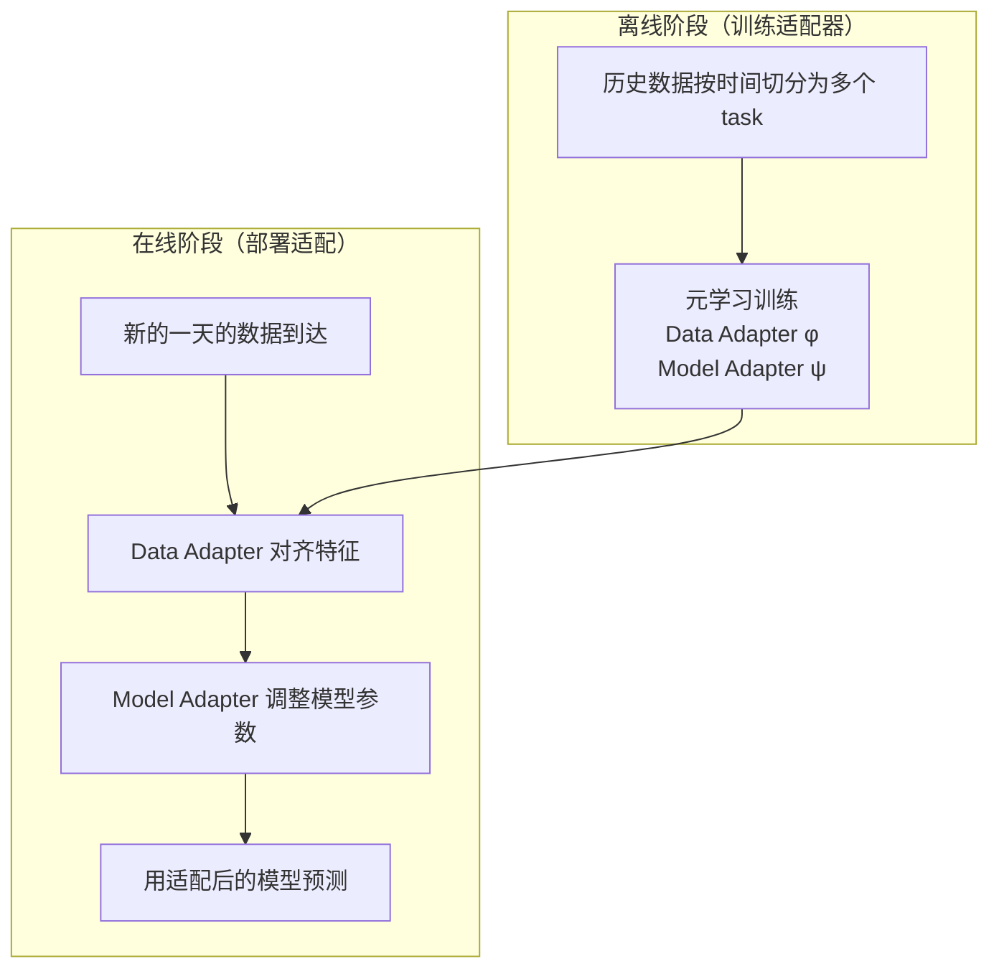

# DoubleAdapt：双重适配框架 深度精读

> **论文标题**: DoubleAdapt: A Meta-learning Approach to Incremental Learning for Stock Trend Forecasting  
> **作者**: Lifan Zhao, Shuming Kong, Yanyan Shen  
> **机构**: Shanghai Jiao Tong University  
> **发表**: KDD 2023  
> **DOI**: https://doi.org/10.1145/3580305.3599315

**知识链接**：
- [分布漂移与在线适配](/前置知识/001z_前置知识_分布漂移与在线适配) — DoubleAdapt 解决的核心问题
- [截面选股模型与评价指标](/前置知识/001w_前置知识_截面选股模型与评价指标) — 评估 DoubleAdapt 效果的指标
- [Walk-Forward 滚动回测](/前置知识/001x_前置知识_Walk_Forward滚动回测) — DoubleAdapt 嵌入的回测框架
- [MASTER 精读](/论文综述/083_MASTER_市场感知截面选股Transformer) — DoubleAdapt 可以给 MASTER 加上适配能力

---

## 贯穿全文的例子

> 一个 GRU 模型在 CSI300 上训练完毕后部署。
> - 训练期：2015-2019 年（以价值蓝筹行情为主）
> - 部署后第一年（2020）：核心资产牛市 → 模型表现还行
> - 部署后第二年（2021 下半年起）：风格切换到小盘成长 → 模型 IC 暴跌
> 
> 传统做法：每季度用最近 3 年数据重新训练整个 GRU。
> DoubleAdapt 做法：保持 GRU 不变，用两个轻量适配器每天微调。

---

## 一、问题：增量学习中的双重挑战

### 1.1 为什么简单微调不行

面对分布漂移，最直觉的方案是"每天用新数据微调模型几步"（SGD fine-tune）。但这有两个问题：

| 问题 | 说明 | 后果 |
|------|------|------|
| **灾难性遗忘** | 微调几步后，模型丢失了在旧数据上学到的稳定模式 | 在没漂移的日子里反而表现更差 |
| **过拟合噪声** | 每天只有一个截面（~300 条样本），数据太少 | 适配到的是噪声而非真正的漂移 |

### 1.2 DoubleAdapt 的核心洞察

漂移来自两个方面，需要**分别处理**：

1. **数据侧漂移**：今天的特征和训练期统计性质不同（均值/方差变了）  
   → 需要一个 **Data Adapter**：把新分布的数据"对齐"到模型训练时的分布

2. **模型侧漂移**：即使特征对齐了，特征→收益的映射关系也变了  
   → 需要一个 **Model Adapter**：根据当前市场状态微调模型参数

两者都用**元学习**来训练——不是直接学"怎么预测股价"，而是学"怎么快速适配"。

---

## 二、算法框架

### 2.1 总体流程



### 2.2 Data Adapter（数据适配器）

Data Adapter 是一个轻量网络 $g_\phi$，输入当前截面的统计信息（均值、方差等），输出特征的仿射变换参数：

$$
\tilde{\mathbf{x}}_{i,t} = \gamma_t \odot \mathbf{x}_{i,t} + \beta_t, \quad (\gamma_t, \beta_t) = g_\phi(\text{stats}_t)
$$

> Data Adapter 根据"今天市场的统计特征"来决定怎样缩放和平移每只股票的输入特征，使其"看起来"像训练期的数据。

**逐项拆解**：
- $\mathbf{x}_{i,t}$：股票 $i$ 在第 $t$ 天的原始特征向量（$d$ 维）
- $\text{stats}_t$：第 $t$ 天截面的统计摘要——如所有股票特征的均值、中位数、标准差、偏度等
- $g_\phi$：参数为 $\phi$ 的小型 MLP（如 2 层，隐层维度 32）
- $\gamma_t \in \mathbb{R}^d$：逐维度的缩放因子
- $\beta_t \in \mathbb{R}^d$：逐维度的偏移量
- $\odot$：逐元素乘法
- $\tilde{\mathbf{x}}_{i,t}$：适配后的特征

**为什么不直接做 BatchNorm？** BatchNorm 只用当前 batch 的均值/方差做标准化，而 Data Adapter 学到了"什么样的统计变化需要什么样的修正"——更灵活。

### 2.3 Model Adapter（模型适配器）

Model Adapter $f_\psi$ 根据最近的数据生成基础模型参数的**增量**：

$$
\tilde{\theta}_t = \theta_{\text{base}} + \Delta\theta_t, \quad \Delta\theta_t = f_\psi(\text{context}_t)
$$

> Model Adapter 看了最近几天的数据后，输出一组参数微调量——告诉模型"当前的特征→收益映射应该怎么修正"。

**逐项拆解**：
- $\theta_{\text{base}}$：在历史数据上训练好的基础模型参数（如 GRU 的所有权重）
- $\text{context}_t$：最近 $k$ 天的数据摘要（如最近 5 个截面的特征均值、IC 等）
- $f_\psi$：参数为 $\psi$ 的超网络（HyperNetwork），输出维度 = 基础模型参数量
- $\Delta\theta_t$：参数增量。通常很小（$|\Delta\theta| \ll |\theta_{\text{base}}|$）
- $\tilde{\theta}_t$：适配后的模型参数

**实际实现**：基础模型通常有 100K+ 参数，直接输出全部增量太贵。DoubleAdapt 只适配最后几层（如 GRU 的输出层），或者用低秩增量 $\Delta\theta = AB$ where $A \in \mathbb{R}^{m \times r}, B \in \mathbb{R}^{r \times n}, r \ll \min(m,n)$。

### 2.4 数值例子

假设基础 GRU 模型的最后一层是 $W \in \mathbb{R}^{64 \times 1}$（从 64 维隐层映射到 1 维预测值）。

**训练期学到的**：$W_{\text{base}} = [0.3, -0.2, 0.1, \ldots]^\top$（64 维权重）

**2022 年风格切换后**，Model Adapter 输出：$\Delta W = [-0.1, +0.15, -0.05, \ldots]^\top$

**适配后**：$\tilde{W} = W_{\text{base}} + \Delta W = [0.2, -0.05, 0.05, \ldots]^\top$

这意味着第 1 个隐单元（可能对应"大盘蓝筹"信号）的权重从 0.3 降到 0.2，第 2 个（可能对应"波动率"信号）从 -0.2 调到 -0.05。模型自动"减弱了蓝筹偏好、减弱了对低波动的偏好"——这正是 2022 年需要的。

---

## 三、元学习训练

### 3.1 为什么用元学习

直接在训练期数据上训练 Data/Model Adapter 会有问题：它们会学到"把训练数据映射到训练数据"的恒等变换，无法泛化到新分布。

元学习的思想是：**模拟漂移**。在训练阶段就人为创造"旧数据→新数据"的切换场景，让适配器学会应对各种漂移模式。

### 3.2 训练算法（MAML 风格）

**外层循环**（meta-train）：

```
for each meta-iteration:
    1. 从训练期中采样一个"任务"：
       - support set: 时间段 [t₁, t₂] 的数据（模拟"最近可见数据"）
       - query set: 时间段 [t₂, t₃] 的数据（模拟"需要适配的新数据"）
    
    2. Inner loop（模拟在线适配）：
       - 用 support set 的统计信息，让 Data Adapter 生成 (γ, β)
       - 用 support set 的 context，让 Model Adapter 生成 Δθ
       - 得到适配后的模型 θ̃ = θ_base + Δθ
    
    3. Outer loop（评估适配质量）：
       - 用适配后的模型在 query set 上预测
       - 计算 query set 上的损失 L_query
       - 反向传播更新 φ, ψ（适配器参数）
```

**数学表达**：

$$
\min_{\phi, \psi} \sum_{\text{task } \tau} L_{\text{query}}^\tau\left(\theta_{\text{base}} + f_\psi(\text{context}^\tau), \; g_\phi(\text{stats}^\tau)\right)
$$

> 优化目标：找到最好的适配器参数 $\phi, \psi$，使得在各种"漂移场景"中，适配后的模型在新数据上表现最好。

### 3.3 关键设计决策

| 决策 | DoubleAdapt 的选择 | 原因 |
|------|-------------------|------|
| 任务采样方式 | 按时间顺序连续切分 | 保持时间依赖结构 |
| Support 长度 | 5-20 天 | 太短则噪声大，太长则反应慢 |
| Query 长度 | 5-10 天 | 评估适配效果需要足够样本 |
| 适配层数 | 只适配最后 1-2 层 | 底层特征提取相对稳定 |
| 学习率 | 外层 1e-4，内层无梯度步 | 适配器直接输出增量，不做梯度下降 |

---

## 四、实验结果

### 4.1 CSI300 主实验

与"定期重训"对比（GRU 作为基础模型）：

| 方法 | 超额年化 | IR | IC | RankIC |
|------|----------|-----|-----|--------|
| GRU（固定，不重训） | 5.21% | 0.67 | 0.032 | 0.038 |
| GRU + 月度重训 | 9.33% | 1.14 | 0.045 | 0.054 |
| GRU + 在线微调（SGD） | 7.85% | 0.92 | 0.039 | 0.047 |
| **GRU + DoubleAdapt** | **12.96%** | **1.51** | **0.056** | **0.067** |

**关键数据**：
- DoubleAdapt vs 月度重训：超额年化 +3.63%，IR +0.37
- DoubleAdapt vs 在线微调：超额年化 +5.11%（证明元学习优于直接 SGD）
- 最重要的是 IR 的提升：1.51 vs 1.14，说明不仅赚得更多，而且更稳

### 4.2 不同基础模型

DoubleAdapt 作为"插件"，可以加在任何基础模型上：

| 基础模型 | 无适配 | + DoubleAdapt | 提升 |
|----------|--------|--------------|------|
| LightGBM | 8.25% | 10.87% | +2.62% |
| GRU | 5.21% | 12.96% | +7.75% |
| LSTM | 4.58% | 11.42% | +6.84% |
| ALSTM | 6.12% | 13.21% | +7.09% |

**深度模型受益更多**：因为深度模型参数多，过拟合训练分布更严重，适配的空间也更大。

### 4.3 消融实验

| 变体 | 超额年化 | 说明 |
|------|----------|------|
| 完整 DoubleAdapt | 12.96% | 两个适配器都有 |
| 只有 Data Adapter | 10.42% | 只对齐特征 |
| 只有 Model Adapter | 11.31% | 只调模型 |
| 两者都去掉（基线） | 9.33% | 普通月度重训 |

**结论**：Model Adapter 贡献更大（概念漂移比协变量漂移影响更严重），但两者结合效果最好。

---

## 五、工程实现要点

### 5.1 部署时的推理流程

```python
class DoubleAdaptInference:
    """DoubleAdapt 在线推理"""
    
    def __init__(self, base_model, data_adapter, model_adapter, context_window=10):
        self.base_model = base_model
        self.data_adapter = data_adapter
        self.model_adapter = model_adapter
        self.context_window = context_window
        self.recent_data = []  # 存储最近 k 天的数据
    
    def predict(self, today_features, today_stats):
        """
        today_features: (N_stocks, d_features) 今天的原始特征
        today_stats: (d_stats,) 今天截面的统计摘要
        """
        # 1. Data Adapter：对齐特征
        gamma, beta = self.data_adapter(today_stats)
        adapted_features = gamma * today_features + beta
        
        # 2. Model Adapter：调整模型参数
        context = self._get_context()
        delta_theta = self.model_adapter(context)
        adapted_model = self._apply_delta(self.base_model, delta_theta)
        
        # 3. 用适配后的模型预测
        predictions = adapted_model(adapted_features)
        
        # 4. 更新 context
        self.recent_data.append((today_features, today_stats))
        if len(self.recent_data) > self.context_window:
            self.recent_data.pop(0)
        
        return predictions
    
    def _get_context(self):
        """汇总最近 k 天的信息作为 context"""
        if not self.recent_data:
            return torch.zeros(self.context_dim)
        stats = torch.stack([s for _, s in self.recent_data])
        return stats.mean(dim=0)  # 简化版：取均值
    
    def _apply_delta(self, model, delta_theta):
        """把增量加到模型最后一层"""
        # 实际实现中可以用 functional API 或参数复制
        adapted = copy.deepcopy(model)
        adapted.output_layer.weight.data += delta_theta
        return adapted
```

**注意事项**：
- `copy.deepcopy` 在生产中太慢，实际应该用 `torch.func.functional_call` 或预分配参数缓冲区
- Context 的聚合方式可以更复杂（如用 attention 或 LSTM）

### 5.2 计算开销

| 组件 | 参数量 | 推理时间 |
|------|--------|----------|
| 基础 GRU | ~100K | 50ms |
| Data Adapter | ~2K | 1ms |
| Model Adapter | ~10K | 5ms |
| **总额外开销** | **~12K (<12%)** | **~6ms (<12%)** |

适配器非常轻量——几乎不增加推理开销。

---

## 六、与其他适配方案的对比

| 方法 | 适配什么 | 适配方式 | 需要回到训练 | 效果 |
|------|----------|----------|-------------|------|
| 定期重训 | 整个模型 | 从头训练 | 是（小时级） | 基线 |
| SGD fine-tune | 最后几层 | 梯度下降 | 否 | 弱（过拟合噪声） |
| **DoubleAdapt** | 数据+模型 | 元学习适配器 | 否（毫秒级） | **强** |
| InvariantStock | 特征空间 | 学不变表示 | 是（训练时） | 很强但难复现 |
| 市场状态路由 | 选择子模型 | 条件计算 | 是 | 中等 |

---

## 七、总结

| 要点 | 内容 |
|------|------|
| 核心问题 | 金融市场分布漂移导致模型失效 |
| 解决方案 | 两个轻量适配器（数据侧 + 模型侧）用元学习训练 |
| 数据适配器 | 根据截面统计信息，对特征做仿射变换 |
| 模型适配器 | 根据最近数据 context，输出参数增量 |
| 训练方式 | MAML 风格元学习，模拟各种漂移场景 |
| 关键数据 | GRU + DoubleAdapt: 年化 12.96%, IR 1.51（vs 重训 9.33%, IR 1.14） |
| 开销 | 额外参数 <12K，推理时间 +6ms |
| 适合 | 任何基础选股模型的"插件式"增强 |

---

## 延伸阅读

- [分布漂移与在线适配](/前置知识/001z_前置知识_分布漂移与在线适配) — 漂移的完整数学框架
- [MASTER 精读](/论文综述/083_MASTER_市场感知截面选股Transformer) — 可以用 DoubleAdapt 增强的强基座
- [InvariantStock 精读](/论文综述/085_InvariantStock_不变特征学习选股) — 另一条解决漂移的路线
- [Walk-Forward 滚动回测](/前置知识/001x_前置知识_Walk_Forward滚动回测) — DoubleAdapt 的正确评估框架
