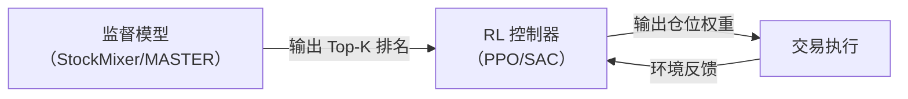

# FinRL：深度强化学习量化交易框架 深度精读

> **论文标题**: FinRL: Deep Reinforcement Learning Framework to Automate Trading in Quantitative Finance  
> **竞赛**: FinRL Contests 2023-2025  
> **代码**: https://github.com/AI4Finance-Foundation/FinRL  
> **竞赛论文**: https://arxiv.org/abs/2504.02281

**知识链接**：
- [策略梯度与 PPO](/前置知识/000a_前置知识_策略梯度与PPO) — FinRL 使用的核心 RL 算法
- [SAC (Soft Actor-Critic)](/前置知识/000k_前置知识_SAC_Soft_Actor_Critic) — FinRL 的另一核心算法
- [截面选股模型与评价指标](/前置知识/001w_前置知识_截面选股模型与评价指标) — 与监督学习选股的对比
- [Walk-Forward 滚动回测](/前置知识/001x_前置知识_Walk_Forward滚动回测) — FinRL 的评估框架

---

## 贯穿全文的例子

> 管理一个 DJ30（道琼斯 30）成分股组合。
> - **状态** $s$：30 只股票的当前持仓量 + 价格 + 技术指标 + 账户余额
> - **动作** $a \in [-1, 1]^{30}$：每只股票的买卖比例（+1=全仓买入，-1=全部卖出）
> - **奖励** $r$：单步组合收益率
> - **约束**：每笔交易扣除 0.1% 手续费；不能做空（$a_i \geq 0$ for long-only）

---

## 一、RL 在量化交易中的定位

### 1.1 监督学习 vs 强化学习

| 维度 | 监督学习选股 | RL 交易 |
|------|-------------|---------|
| **输出** | 股票排名分数 | 具体仓位/交易动作 |
| **目标** | 最大化 IC（预测准确性） | 最大化累计收益/Sharpe |
| **考虑交易成本** | 通常不考虑（后期加） | 天然内嵌在奖励函数中 |
| **考虑持仓约束** | 不考虑 | 天然内嵌在状态/动作空间中 |
| **序列决策** | 每天独立决策 | 今天的交易影响明天的状态 |
| **难度** | 中（有标签） | 高（稀疏奖励、不稳定） |

### 1.2 RL 适合做什么

根据 FinRL 竞赛和学术实验的经验，RL 适合做**低维度控制**，不适合做**高维度选股**：

**适合 RL 的任务**：
- 给定 Top-30 股票（由监督模型选出），RL 决定每只的仓位比例
- 决定何时加仓/减仓（择时）
- 决定组合的整体风险暴露（杠杆/对冲比例）
- 决定换手频率（交易成本控制）

**不适合 RL 的任务**：
- 从 3000 只股票中直接选股（动作空间太大，$3000$ 维连续动作）
- 端到端预测收益率（有标签的监督学习更直接）

### 1.3 推荐的 Pipeline



监督模型负责"选什么"，RL 负责"买多少、什么时候买"。

---

## 二、FinRL 的环境设计

### 2.1 状态空间

$$
s_t = [\underbrace{b_t}_{\text{余额}}, \; \underbrace{\mathbf{p}_t \in \mathbb{R}^N}_{\text{股价}}, \; \underbrace{\mathbf{h}_t \in \mathbb{R}^N}_{\text{持仓}}, \; \underbrace{\mathbf{f}_t \in \mathbb{R}^{N \times d}}_{\text{技术指标}}]
$$

**这个公式在做什么**：把 RL 智能体在某一时刻能看到的所有信息打包成一个向量——账户里有多少钱、每只股票现在多少钱、自己手里持有多少、以及一堆技术指标——这就是策略网络的输入。

::: details 📐 公式详解（点击展开）

| 子表达式 | 它是谁 | 它在干嘛 |
|---------|--------|---------|
| $b_t$ | **钱包余额** | 当前账户里的现金余额（标量） |
| $\mathbf{p}_t\in\mathbb{R}^N$ | **行情牌** | 每只股票（共 $N$ 只）的当前价格 |
| $\mathbf{h}_t\in\mathbb{R}^N$ | **持仓清单** | 每只股票当前持有的股数 |
| $\mathbf{f}_t\in\mathbb{R}^{N\times d}$ | **体检报告** | 每只股票的 $d$ 个技术指标（MACD、RSI、CCI、布林带等） |

**用人话读**："策略在做决策前能看到的东西，就是账户余额、每只股票的价格、自己手里的持仓、再加上一堆技术指标，全部拼成一个向量。"

**为什么是这个形式**：交易决策既要看"市场现状"（价格、指标），也要看"自己现状"（余额、持仓）——缺了任意一部分都无法做出合理的买卖判断，所以状态必须把两者都囊括进来。对于 DJ30（30 只成分股，$d=5$ 个技术指标）：$\dim(s) = 1 + 30 + 30 + 30 \times 5 = 211$。
:::

### 2.2 动作空间

$$
a_t \in [-K, K]^N
$$

**这个公式在做什么**：定义每一步动作的取值范围——一个 $N$ 维向量，每一维对应一只股票要买卖多少股，正负号和大小分别表示交易方向和交易量。

::: details 📐 公式详解（点击展开）

| 子表达式 | 它是谁 | 它在干嘛 |
|---------|--------|---------|
| $a_t$ | **交易指令单** | $N$ 维向量，第 $i$ 维是"对第 $i$ 只股票的操作量" |
| $a_i>0$ | **买入信号** | 第 $i$ 只股票要买入的股数 |
| $a_i<0$ | **卖出信号** | 第 $i$ 只股票要卖出的股数 |
| $[-K,K]$ | **单只股票的力度上限** | $K$ 是每步允许对单只股票交易的最大股数，防止一步就梭哈 |

**用人话读**："每一步的动作就是给每只股票各下一张买卖单，正数买、负数卖，单张单子的量不能超过 $K$。"

**为什么是这个形式**：交易天然是"买/卖/不动"三态加数量的连续量，用有符号区间 $[-K,K]$ 既能表示方向又能表示力度，比拆成"方向+数量"两个变量更紧凑。实际处理时可以离散化为 $a_i\in\{-K,\ldots,-1,0,1,\ldots,K\}$，也可以连续化为 $a_i\in[-1,1]$ 再乘以最大可交易量。
:::

### 2.3 奖励函数

$$
r_t = \frac{V_{t+1} - V_t}{V_t}
$$

**这个公式在做什么**：把"这一步交易做得好不好"量化成一个数字——组合总资产的单步收益率，这就是最朴素版本的奖励信号。

::: details 📐 公式详解（点击展开）

| 子表达式 | 它是谁 | 它在干嘛 |
|---------|--------|---------|
| $V_t = b_t + \sum_i h_{i,t}\cdot p_{i,t}$ | **今天的身家** | 现金余额加上所有持仓按当前价格估值的总和 |
| $V_{t+1}-V_t$ | **一步的盈亏** | 资产价值这一步涨了还是跌了多少 |
| $\frac{V_{t+1}-V_t}{V_t}$ | **相对收益率** | 把绝对盈亏换算成百分比，不同规模的账户可以公平比较 |

**用人话读**："这一步的奖励，就是账户总资产比上一步涨了百分之多少。"

**为什么是这个形式**：用相对收益率而不是绝对盈亏，是因为 RL 的奖励尺度最好和账户规模无关——不然本金越大奖励天然越大，学不出真正的交易能力。
:::

**带交易成本的版本**：
$$
r_t = \frac{V_{t+1} - V_t - \text{cost}_t}{V_t}, \quad \text{cost}_t = c \cdot \sum_{i=1}^N |a_{i,t}| \cdot p_{i,t}
$$

**这个公式在做什么**：在上面的朴素收益率里扣掉这一步交易实际花掉的手续费，让策略意识到"频繁交易是有代价的"。

::: details 📐 公式详解（点击展开）

| 子表达式 | 它是谁 | 它在干嘛 |
|---------|--------|---------|
| $\text{cost}_t$ | **手续费账单** | 这一步所有交易产生的总手续费 |
| $c=0.001$ | **费率** | 单边 0.1% 的手续费比例 |
| $\sum_i |a_{i,t}|\cdot p_{i,t}$ | **总成交额** | 不管买卖方向，把每只股票的交易量乘价格再取绝对值加总 |
| $V_{t+1}-V_t-\text{cost}_t$ | **扣完手续费的真实盈亏** | 从账面盈亏里再减掉这一步花掉的手续费 |

**用人话读**："奖励等于扣掉手续费之后账户实际涨了多少个百分点，手续费按这一步总成交额的 0.1% 计算。"

**为什么要单独扣掉交易成本**：如果奖励里不体现手续费，策略会学出"来回频繁交易"的行为（因为账面上买卖不影响即时奖励），但现实中每笔交易都要花钱——加上这一项才能让策略学到"少动、只在有把握时动"。
:::

### 2.4 数值例子

初始余额 $b_0 = 100000$，持有 10 股苹果（$p=150$），5 股微软（$p=300$）。

$$
V_0 = 100000 + 10 \times 150 + 5 \times 300 = 103000
$$

**这个公式在做什么**：把上面两个奖励公式里抽象的 $V_t$ 用具体数字代一遍——算出这个账户在第 0 天的总资产。

::: details 📐 公式详解（点击展开）

| 子表达式 | 它是谁 | 它在干嘛 |
|---------|--------|---------|
| $100000$ | **现金 $b_0$** | 账户里的现金余额 |
| $10\times150$ | **苹果持仓估值** | 10 股苹果，每股 150 元 |
| $5\times300$ | **微软持仓估值** | 5 股微软，每股 300 元 |
| $103000$ | **总资产 $V_0$** | 现金加两笔持仓估值的总和 |

**用人话读**："账户里有 10 万现金，加上 10 股苹果（1500 元）和 5 股微软（1500 元），总资产是 10.3 万。"

**为什么是这个形式**：这正是前面 $V_t=b_t+\sum_i h_{i,t}p_{i,t}$ 公式的直接代入，用来给后面的收益率计算提供一个具体起点。
:::

RL 决定：买入 5 股苹果，卖出 2 股微软。

交易成本 = $0.001 \times (5 \times 150 + 2 \times 300) = 0.001 \times 1350 = 1.35$

次日苹果涨到 155，微软涨到 305：

$$
V_1 = (100000 - 5 \times 150 + 2 \times 300 - 1.35) + 15 \times 155 + 3 \times 305 = 99848.65 + 2325 + 915 = 103088.65
$$

**这个公式在做什么**：按"先扣现金变化和手续费，再用新价格给新持仓估值"的顺序，算出交易并过完一天之后账户的总资产 $V_1$。

::: details 📐 公式详解（点击展开）

| 子表达式 | 它是谁 | 它在干嘛 |
|---------|--------|---------|
| $100000-5\times150+2\times300-1.35$ | **交易后的现金** | 买苹果花掉的钱、卖微软收到的钱、再扣掉手续费，算出新的现金余额 $99848.65$ |
| $15\times155$ | **苹果新持仓估值** | 买入后共 15 股苹果，按次日新价 155 估值 |
| $3\times305$ | **微软新持仓估值** | 卖出后剩 3 股微软，按次日新价 305 估值 |
| $103088.65$ | **总资产 $V_1$** | 三部分加总，得到第 1 天的总资产 |

**用人话读**："买卖完之后账户里现金变少了一点点（还扣了手续费），但苹果和微软都涨了价，两只股票新的市值加上剩下的现金，总资产比前一天多了 88.65 元。"

**为什么是这个形式**：这一步只是把交易动作（买 5 股苹果、卖 2 股微软）、手续费、次日新价格，全部代入 $V_t=b_t+\sum_i h_{i,t}p_{i,t}$ 这同一个定义式，算出交易后一天的账户总值。对应奖励 $r_0=(103088.65-103000)/103000=0.086\%$。
:::

---

## 三、FinRL 竞赛的滚动设置

### 3.1 短周期滚动

FinRL 2023-2025 竞赛采用极短的滚动周期：

| 设置 | 值 |
|------|-----|
| 训练期 | 30 个交易日 |
| 验证期 | 5 个交易日 |
| 测试期 | 5 个交易日 |
| 滚动步长 | 5 天 |
| 交易成本 | 单边 0.1% |
| 标的 | DJ30 |

### 3.2 FinRL 竞赛结果（DJ30）

PPO 在竞赛的标准设置下：

| 指标 | PPO | DJIA（被动持有） |
|------|-----|----------------|
| 累计收益 | 63.37% | 18.95% |
| 年化收益 | 18.41% | 6.32% |
| Sharpe Ratio | 1.55 | 0.47 |
| 最大回撤 | -9.96% | -21.53% |
| 胜率（月度） | 68% | 54% |

### 3.3 重要警告

**竞赛结果 vs 真实后市表现**：

在 FinRL 竞赛的"赛后评估"（真实未来数据，非历史回测）中，RL 队伍**普遍没有跑赢 DJIA 的收益**。这说明：

1. 历史 Walk-Forward 表现好 ≠ 真实未来表现好
2. 短窗口训练的 RL 对市场状态切换极其脆弱
3. PPO 的 Sharpe 1.55 可能有过拟合成分——在相对平稳的历史期间表现好，但遇到从未见过的市场状态就失效

**结论**：RL 适合做仓位控制的"辅助决策"，不应作为唯一信号源。

---

## 四、PPO vs SAC 在交易中的选择

### 4.1 对比

| 维度 | PPO | SAC |
|------|-----|-----|
| 策略类型 | On-Policy（随机策略） | Off-Policy（最大熵随机策略） |
| 数据效率 | 低（每步数据只用一次） | 高（Replay Buffer 反复使用） |
| 训练稳定性 | 高（clip 保证小步更新） | 中（需要仔细调 alpha） |
| 探索能力 | 中（靠策略噪声） | 高（最大熵鼓励探索） |
| 适合交易场景 | 仓位调整频率低、决策保守 | 需要探索不同策略组合 |
| FinRL 默认 | ✅ 推荐首选 | 备选 |

### 4.2 实操建议

1. **先用 PPO**：更稳定、超参少、不容易崩溃
2. **动作空间设计**：不要让 RL 直接输出 30 维连续动作——维度太高。改为输出 3-5 个"宏观控制变量"：
   - 整体仓位比例（0~1）
   - Top-N 的 N 值（10/20/30/50）
   - 权重方式（等权/市值加权/IC 加权）
   - 止损阈值（-3%/-5%/-8%）
3. **奖励工程**：不要只用收益率。加入 Sharpe 惩罚和回撤惩罚：

$$
r_t = \underbrace{\frac{V_{t+1} - V_t}{V_t}}_{\text{收益}} - \underbrace{\lambda_1 \cdot \text{DD}_t}_{\text{回撤惩罚}} - \underbrace{\lambda_2 \cdot \text{turnover}_t}_{\text{换手惩罚}}
$$

**这个公式在做什么**：不只看单步收益率，还额外惩罚"账户正在经历大幅回撤"和"交易太频繁"这两种不健康的行为，让策略学出更稳健的仓位管理风格。

::: details 📐 公式详解（点击展开）

| 子表达式 | 它是谁 | 它在干嘛 |
|---------|--------|---------|
| $\frac{V_{t+1}-V_t}{V_t}$ | **基础收益项** | 和前面一样的单步收益率，奖励的主体部分 |
| $\lambda_1\cdot\text{DD}_t$ | **回撤惩罚** | 当前相对历史最高点的回撤幅度越大，扣分越多，抑制策略去追求"高波动高回撤"的激进操作 |
| $\lambda_2\cdot\text{turnover}_t$ | **换手惩罚** | 这一步交易的换手率（交易量占总资产的比例）越高，扣分越多，抑制过度交易 |

**用人话读**："奖励 = 这一步赚了多少百分之几，再减去两个惩罚——账户跌得比历史高点多惨就扣多少分、这一步交易得多频繁就扣多少分。"

**为什么要加这两个惩罚项**：只用收益率做奖励，策略会学出"赌大的"行为（因为高收益往往伴随高回撤，但奖励只看收益不看波动）以及"来回频繁交易"（如果手续费没建模够充分）。显式惩罚回撤和换手率，能把"风险控制"和"交易成本意识"直接写进优化目标，而不是指望策略自己隐式学出来。
:::

---

## 五、现有仓库的 RL 设计评估

根据用户提到的代码结构：

### 5.1 `src/train/rl_stock/deep_signal_environment.py:89`

这个环境让 PPO 选择仓位、TopN、权重方式和阈值——**这是正确方向**。RL 不直接选股，而是做低维度控制。

### 5.2 `config/rl_stock.yaml:2` 的风险

如果配置中让 RL 对全市场 4000 只股票直接输出动作权重，问题是：
- 4000 维连续动作空间，PPO 几乎无法有效探索
- 每次决策的组合空间是指数级的
- 奖励信号极其稀疏（一天的组合收益率受太多股票影响）

**建议**：保持低维度控制器设计，不要尝试端到端全市场 RL。

---

## 六、代码示例：低维度 RL 控制器

```python
import gymnasium as gym
import numpy as np

class PortfolioControlEnv(gym.Env):
    """
    低维度 RL 环境：不直接选股，只控制仓位和风险参数
    """
    
    def __init__(self, signal_model, market_data):
        super().__init__()
        self.signal_model = signal_model  # 预训练的截面选股模型
        self.market_data = market_data
        
        # 状态：市场特征 + 当前持仓状态
        self.observation_space = gym.spaces.Box(
            low=-np.inf, high=np.inf, shape=(20,)
        )
        
        # 动作：4 个低维控制变量
        # [仓位比例, TopN选择, 止损阈值, 换仓频率]
        self.action_space = gym.spaces.Box(
            low=np.array([0.0, 0.0, 0.0, 0.0]),
            high=np.array([1.0, 1.0, 1.0, 1.0]),
            dtype=np.float32,
        )
    
    def _decode_action(self, action):
        """把连续动作解码为离散的交易参数"""
        position_pct = action[0]            # 0~100% 仓位
        top_n = int(action[1] * 40) + 10    # Top 10~50
        stop_loss = -0.03 - action[2] * 0.07  # -3% ~ -10%
        hold_days = int(action[3] * 4) + 1   # 持有 1~5 天
        return position_pct, top_n, stop_loss, hold_days
    
    def step(self, action):
        position_pct, top_n, stop_loss, hold_days = self._decode_action(action)
        
        # 1. 用监督模型获取股票排名
        scores = self.signal_model.predict(self.current_features)
        top_stocks = np.argsort(scores)[-top_n:]
        
        # 2. 等权分配仓位
        weight_per_stock = position_pct / top_n
        
        # 3. 模拟交易 hold_days 天
        portfolio_return = self._simulate_trade(
            top_stocks, weight_per_stock, hold_days, stop_loss
        )
        
        # 4. 计算奖励（含交易成本）
        reward = portfolio_return - self.transaction_cost
        
        return self._get_obs(), reward, done, truncated, info
```

---

## 七、总结

| 要点 | 内容 |
|------|------|
| RL 的正确定位 | 做低维仓位/风险控制，不做高维选股 |
| 推荐算法 | PPO 首选（稳定），SAC 备选（高数据效率） |
| 动作空间 | 3-5 维宏观控制变量，不要 N 维股票权重 |
| 奖励设计 | 收益 - 回撤惩罚 - 换手惩罚 |
| FinRL 结果 | DJ30 历史 Sharpe 1.55，但赛后真实期不稳定 |
| 关键警告 | RL 跨市场状态泛化不稳定，不应作为唯一信号源 |
| 正确 Pipeline | 监督模型选股 → RL 控制仓位/风险 |

---

## 延伸阅读

- [策略梯度与 PPO](/前置知识/000a_前置知识_策略梯度与PPO) — PPO 算法的完整推导
- [SAC (Soft Actor-Critic)](/前置知识/000k_前置知识_SAC_Soft_Actor_Critic) — SAC 的最大熵框架
- [MacroHFT 精读](/论文综述/088_MacroHFT_分层市场状态路由RL交易) — 分层 RL + 市场状态路由
- [截面选股模型与评价指标](/前置知识/001w_前置知识_截面选股模型与评价指标) — 监督选股模型基础
