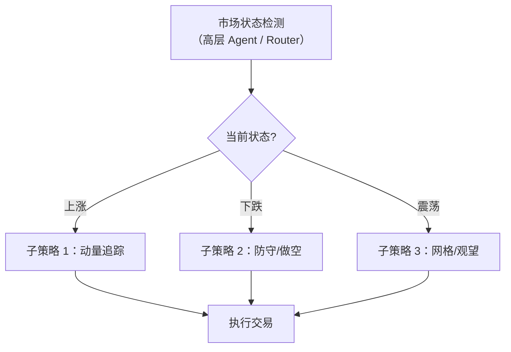

# EarnHFT / MacroHFT：分层市场状态路由 RL 深度精读

> **EarnHFT**: Efficient Hierarchical Reinforcement Learning for High Frequency Trading (AAAI 2024)  
> **MacroHFT**: Memory Augmented Context-aware Reinforcement Learning on High Frequency Trading (KDD 2024)  
> **代码**: https://github.com/finint/MacroHFT

**知识链接**：
- [策略梯度与 PPO](/前置知识/000a_前置知识_策略梯度与PPO) — 底层子策略使用的算法
- [SAC (Soft Actor-Critic)](/前置知识/000k_前置知识_SAC_Soft_Actor_Critic) — 另一种可用的子策略算法
- [FinRL 精读](/论文综述/087_FinRL_PPO_SAC用于组合仓位控制) — 单层 RL 的对比方案
- [分布漂移与在线适配](/前置知识/001z_前置知识_分布漂移与在线适配) — 市场状态路由的动机

---

## 贯穿全文的例子

> 在加密货币市场（BTC/ETH/LTC/DOT）做分钟级交易。
> 
> 市场状态可以分为：
> - **上涨趋势**：连续阳线，成交量温和放大 → 适合追涨策略
> - **下跌趋势**：连续阴线，恐慌抛售 → 适合空仓或做空策略
> - **横盘震荡**：窄幅波动，假突破频繁 → 适合网格策略或不交易
> 
> 一个"万能"策略在所有状态下都表现一般。分层方案：训练 3 个子策略各擅长一种状态，用高层 agent 识别当前状态并路由。

---

## 一、分层 RL 的动机

### 1.1 单一策略的局限

如果训练一个 PPO 同时应对所有市场状态：
- 在牛市中它想追涨（学到的 action 偏正）
- 在熊市中它想空仓（学到的 action 偏零/偏负）
- 这两种模式的梯度**互相对冲**——最终学到一个"平庸的折中策略"

### 1.2 分层方案

每个子策略只在对应状态下训练 → 不存在梯度对冲 → 每个子策略在自己的"专业领域"表现极强。

---

## 二、EarnHFT 的设计

### 2.1 两层架构

**高层 Agent（Router）**：
- 输入：最近 $K$ 分钟的市场 context（价格序列、成交量、波动率、订单簿不平衡等）
- 输出：选择哪个子策略来执行（离散动作空间，$M$ 个选项）
- 决策频率：每 $H$ 分钟做一次路由决策

**底层 Agents（Traders）**：
- 每个子策略是一个独立的 PPO/DQN agent
- 输入：当前 tick/分钟级的市场状态
- 输出：具体的买/卖/持有动作
- 决策频率：每分钟或每个 tick

### 2.2 状态表示

高层 Router 的状态：
$$
s_t^{\text{high}} = [\text{ret}_{5\text{min}}, \text{ret}_{15\text{min}}, \text{ret}_{60\text{min}}, \text{vol}_{5\text{min}}, \text{vol}_{15\text{min}}, \text{orderbook\_imbalance}]
$$

底层 Trader 的状态：
$$
s_t^{\text{low}} = [\text{price}, \text{position}, \text{unrealized\_pnl}, \text{bid/ask}, \text{volume}, \text{technical\_indicators}]
$$

### 2.3 训练方式

**两阶段训练**：
1. 先用聚类算法（K-Means）对历史数据按市场状态分段
2. 在每段数据上独立训练对应的子策略
3. 训练高层 Router（固定子策略参数）——Router 学"什么时候切换到哪个子策略"

**为什么不端到端训练？** 端到端的分层 RL 训练极不稳定（高层/低层梯度互相干扰）。两阶段解耦更可靠。

---

## 三、MacroHFT 的改进

### 3.1 相比 EarnHFT 的三个创新

| 组件 | EarnHFT | MacroHFT |
|------|---------|----------|
| 市场状态表示 | 手工统计特征 | **Memory-augmented context**（用 memory bank 存储历史状态模式） |
| 子策略 | 固定分配 | **动态权重混合**（soft routing） |
| 跨市场泛化 | 每个市场重新训练 | **共享 Router + 市场适配器** |

### 3.2 Memory-Augmented Context

MacroHFT 维护一个 Memory Bank $\mathcal{M} = \{m_1, m_2, \ldots, m_P\}$，存储 $P$ 种典型市场模式。

当新的市场状态 $s_t$ 到达时：
1. 用 attention 从 Memory Bank 中检索最相似的历史模式
2. 将检索到的模式与当前状态拼接，作为 Router 的增强输入

$$
\tilde{s}_t^{\text{high}} = [s_t^{\text{high}}; \; \text{Attention}(s_t^{\text{high}}, \mathcal{M})]
$$

> 这让 Router 能"记住"历史上类似状态下应该怎么做——一种非参数化的经验记忆。

### 3.3 Soft Routing（软路由）

EarnHFT 的 Router 输出是 argmax（硬选择一个子策略）。MacroHFT 改为 softmax 混合：

$$
a_t = \sum_{m=1}^M \text{softmax}_m(\text{Router}(\tilde{s}_t^{\text{high}})) \cdot \pi_m(s_t^{\text{low}})
$$

> 最终动作是所有子策略动作的加权平均——权重由 Router 决定。类似于 Mixture of Experts。

这比硬切换更平滑——避免了"在两个子策略之间来回跳变"导致的高换手率。

---

## 四、实验结果

### 4.1 MacroHFT 在加密货币市场的表现

| 标的 | MacroHFT 年化 | 单一 PPO 年化 | Buy&Hold 年化 |
|------|-------------|-------------|--------------|
| BTC | 28.7% | 15.2% | 12.4% |
| ETH | 35.2% | 18.6% | 8.7% |
| LTC | 22.1% | 11.3% | -5.2% |
| DOT | 19.8% | 9.4% | -12.1% |

交易成本：maker 0.02%/taker 0.05%。
MacroHFT 在所有市场都获得正收益，且显著超越单一策略。

### 4.2 关键警告

| 警告 | 说明 |
|------|------|
| **测试期极短** | EarnHFT 的测试集只有 **9 天**——不具统计意义 |
| **市场差异大** | 加密货币分钟/秒级交易 ≠ A 股日频交易 |
| **手续费差异** | 加密 0.02% vs A 股 0.15%——后者的利润空间小得多 |
| **流动性假设** | 分钟级交易假设市价单能立即成交——A 股可能有滑点 |

**不能直接当作 A 股日频有效的证据。** 但分层路由的思想可以借鉴。

---

## 五、对 A 股日频场景的借鉴

### 5.1 适配方案

| 原始设计 | A 股日频适配 |
|----------|-------------|
| 分钟级决策 | 日频决策（每天收盘后） |
| 3 种市场状态 | 4-5 种：牛市/熊市/结构牛/小盘行情/震荡 |
| 加密 maker 0.02% | A 股 15bps |
| 高频子策略 | 截面选股 + 仓位控制子策略 |
| Memory Bank | 存储 A 股历史典型行情模式 |

### 5.2 具体建议

1. **市场状态定义**：用 CSI300 的 20 日收益率 + 波动率聚类成 4-5 种状态
2. **子策略设计**：
   - 牛市子策略：高仓位、偏动量、选高 beta
   - 熊市子策略：低仓位/空仓、偏防御、选低波动
   - 震荡子策略：中等仓位、偏均值回复、快进快出
3. **Router**：输入最近 20 天市场特征，输出 softmax 权重
4. **评估**：必须用 Walk-Forward 框架，覆盖多种市场状态的测试期

---

## 六、总结

| 要点 | 内容 |
|------|------|
| 核心思想 | 不同市场状态用不同策略，高层路由选择 |
| EarnHFT | 硬路由 + 手工状态特征 |
| MacroHFT | 软路由 + Memory-augmented context |
| 实验市场 | 加密货币分钟/秒级 |
| A 股适用性 | 思想可借鉴，但需完全重新设计频率和成本模型 |
| 关键警告 | 测试期短、市场差异大，不能直接迁移 |
| 建议 | 作为仓位控制层面的设计参考，配合日频截面模型使用 |

---

## 延伸阅读

- [FinRL 精读](/论文综述/087_FinRL_PPO_SAC用于组合仓位控制) — 单层 RL 的框架和竞赛结果
- [分布漂移与在线适配](/前置知识/001z_前置知识_分布漂移与在线适配) — 市场状态切换就是分布漂移
- [策略梯度与 PPO](/前置知识/000a_前置知识_策略梯度与PPO) — 子策略使用的算法
- [HIST/TRA 精读](/论文综述/086_HIST_TRA_概念行业关系建模选股) — TRA 的路由思想与 MacroHFT 相通
