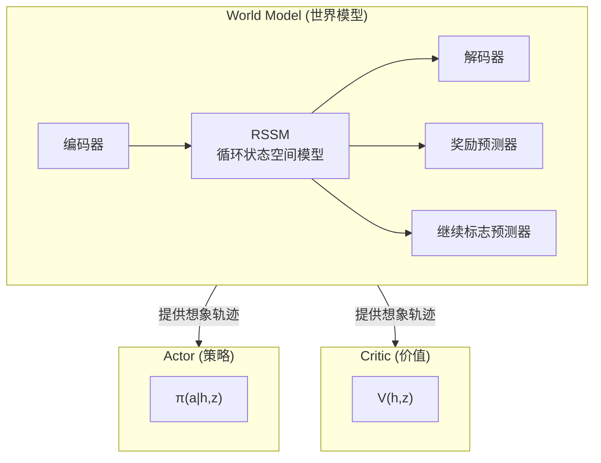

# DreamerV3：Mastering Diverse Domains through World Models 深度精读

> **论文标题**: Mastering Diverse Domains through World Models  
> **作者**: Danijar Hafner, Jurgis Pasukonis, Jimmy Ba, Timothy Lillicrap  
> **机构**: DeepMind, University of Toronto  
> **发表**: Nature 2025 / arXiv:2301.04104 (2023)  
> **代码**: https://github.com/danijar/dreamerv3

**标签**: `#世界模型` `#Model-Based RL` `#RSSM` `#想象训练` `#Actor-Critic` `#Atari` `#Minecraft`

**知识链接**：
- [世界模型基础](/前置知识/000t_前置知识_世界模型基础) — 世界模型概念入门
- [策略梯度与 PPO](/前置知识/000a_前置知识_策略梯度与PPO) — Actor-Critic 基础
- [Q 函数与 Value 函数](/前置知识/000o_前置知识_Q函数与Value函数) — 价值估计
- [KL 散度与策略约束](/前置知识/000j_前置知识_KL散度与策略约束) — KL 正则化
- [对数似然与变分下界](/前置知识/000e_前置知识_对数似然与变分下界) — ELBO 训练目标
- [世界模型强化学习综述](/论文综述/S10_世界模型强化学习综述) — 全景对比

---

## 一、背景与动机

### 1.1 RL 的终极目标：一个算法解所有问题

强化学习的梦想是有一个**通用算法**——不管是 Atari 游戏、机器人控制、还是 Minecraft 探索，都能用同一套方法、同一组超参数解决。

现实是：不同任务差异巨大：

| 维度 | Atari | 连续控制 | Minecraft |
|------|-------|---------|-----------|
| 观测 | 84×84 像素 | 数十维向量 | 64×64 像素 |
| 动作 | 离散 18 个 | 连续 6-22 维 | 离散+连续混合 |
| 奖励 | 密集（每帧可能得分） | 密集 | **极稀疏**（挖到钻石才得分） |
| 回报尺度 | 0~1000+ | -∞~0 | 0~1 |
| Episode 长度 | ~1000 步 | ~1000 步 | ~36000 步 |

之前的 RL 方法都需要针对每个域调参：
- SAC 在连续控制好，但 Atari 不行
- Rainbow DQN 在 Atari 好，但不支持连续动作
- PPO "通用"但哪里都不是最强

### 1.2 DreamerV3 的核心贡献

DreamerV3 解决了一个看似不可能的问题：**一套固定超参数，在 150+ 种差异巨大的任务上超越专门化方法。**

关键突破：
1. 首次从零（无人类数据、无课程学习）在 Minecraft 中收集到钻石
2. 在 Atari、DMControl、DMLab 等 7 个 benchmark 上达到 SOTA 或 competitive
3. 所有实验用**完全相同的超参数**

### 1.3 贯穿全文的例子

> **场景**：Minecraft 收集钻石。agent 需要：
> 1. 砍树获得木头
> 2. 制作工作台
> 3. 制作木镐
> 4. 挖石头，制作石镐
> 5. 挖铁矿，熔炼铁锭，制作铁镐
> 6. 挖到足够深处，找到钻石矿
> 7. 用铁镐挖钻石
>
> 全程约 36000 步，只有最后挖到钻石才有奖励。中间的每一步"正确动作"都没有任何信号。这对 RL 来说是极端困难的。

---

## 二、方法详解

### 2.1 总体架构

DreamerV3 由三个并行训练的组件构成：



**训练循环**：

1. 在真实环境中交互，存数据到 replay buffer
2. 从 buffer 采样序列，训练世界模型（让模型学会预测环境动态）
3. 从 buffer 采初始状态，用世界模型展开想象轨迹
4. 在想象轨迹上训练 Actor 和 Critic

### 2.2 RSSM：循环状态空间模型

RSSM 是 DreamerV3 的核心。它维护一个**混合状态** $(h_t, z_t)$：

- $h_t$：确定性部分（GRU 隐状态，维度 4096）——编码长期历史
- $z_t$：随机性部分（32 个 32-way 分类变量）——捕获环境的不确定性

**组件定义**：

$$
\begin{aligned}
\text{序列模型 (GRU):} \quad & h_t = f_\phi(h_{t-1}, z_{t-1}, a_{t-1}) \\
\text{编码器 (后验):} \quad & z_t \sim q_\phi(z_t \mid h_t, o_t) \\
\text{动态预测 (先验):} \quad & \hat{z}_t \sim p_\phi(\hat{z}_t \mid h_t) \\
\text{观测解码:} \quad & \hat{o}_t \sim p_\phi(o_t \mid h_t, z_t) \\
\text{奖励预测:} \quad & \hat{r}_t \sim p_\phi(r_t \mid h_t, z_t) \\
\text{继续预测:} \quad & \hat{c}_t \sim p_\phi(c_t \mid h_t, z_t)
\end{aligned}
$$

> 一句话：GRU 负责记忆历史，分类潜变量负责表示"当前世界可能的状态"。

**为什么要分确定性和随机性两部分？**

纯确定性模型（只有 $h_t$）无法表达环境的随机性——比如 Minecraft 中"挖矿可能挖到铁也可能挖到石头"。纯随机模型（只有 $z_t$）又容易遗忘历史。两者结合：
- $h_t$ 提供可靠的长期记忆
- $z_t$ 捕获当前时刻的不确定性

**数值例子**（Minecraft）：

假设 agent 正在地下挖矿：
- $h_t$ 编码了"过去 100 步一直在向下挖"的历史信息
- $z_t$ 的 32 个分类变量中，可能有几个编码"当前深度约 y=11"、"前方是石头"、"背包里有铁镐"等信息
- 先验 $p_\phi(\hat{z}_t \mid h_t)$ 预测"根据历史，当前应该在地下深处"
- 后验 $q_\phi(z_t \mid h_t, o_t)$ 看到实际画面后确认"确实在深处，而且前方有钻石矿！"

### 2.3 世界模型训练：ELBO 目标

世界模型通过最大化变分下界 (ELBO) 训练：

$$
\mathcal{L}_{\text{wm}}(\phi) = \sum_{t=1}^{T} \Big[ \underbrace{\ln p_\phi(o_t \mid h_t, z_t)}_{\text{(A) 重建}} + \underbrace{\ln p_\phi(r_t \mid h_t, z_t)}_{\text{(B) 奖励}} + \underbrace{\ln p_\phi(c_t \mid h_t, z_t)}_{\text{(C) 继续}} - \underbrace{\beta \cdot \text{KL}_{\text{balanced}}}_{\text{(D) 正则}} \Big]
$$

> 一句话：让世界模型同时学会"还原看到的画面"、"预测得了多少分"、"预测游戏是否结束"，并让"纯想象的预测"尽量接近"看到画面后的判断"。

**逐项拆解**：

**(A) 重建损失** $\ln p_\phi(o_t \mid h_t, z_t)$：

解码器从潜状态 $(h_t, z_t)$ 重建观测。在 Minecraft 中：潜状态应该能还原出"地下洞穴 + 钻石矿"的画面。如果重建很差，说明潜状态丢失了关键信息。

DreamerV3 使用 **symlog MSE** 而不是普通 MSE：
$$
\text{loss} = \|\text{symlog}(\hat{o}_t) - \text{symlog}(o_t)\|^2
$$

**(B) 奖励预测** $\ln p_\phi(r_t \mid h_t, z_t)$：

用两个 hot 分类分布（twohot discretization）预测奖励。把连续奖励离散化为 255 个 bin，用交叉熵训练。

为什么不用 MSE？因为奖励分布极不均匀——Minecraft 中 99.99% 的时间步奖励是 0，只有极少数时候是 +1（挖到钻石）。分类预测对这种极端分布更鲁棒。

**(C) 继续预测** $\ln p_\phi(c_t \mid h_t, z_t)$：

二分类：$c_t = 1$ 游戏继续，$c_t = 0$ 游戏结束。让世界模型知道什么时候 episode 会终止——这对正确计算回报至关重要。

**(D) KL 正则化（平衡版）**：

$$
\text{KL}_{\text{balanced}} = \alpha \cdot \text{KL}[\text{sg}(q_\phi) \| p_\phi] + (1-\alpha) \cdot \text{KL}[q_\phi \| \text{sg}(p_\phi)]
$$

**为什么需要这个 KL 项？** 

如果没有 KL 正则：
- 编码器可能学到"只看当前帧就给出精确状态"的捷径
- 先验 $p_\phi$（纯想象预测）永远学不准
- 想象 rollout 时（只用先验），轨迹会迅速偏离真实

有了 KL 正则：先验被迫接近后验 → 纯想象预测也比较准确 → 想象中训练有效。

**平衡比例 $\alpha = 0.8$ 的含义**：

- 80% 的梯度推动**先验去学准**（让想象尽量接近看到画面后的判断）
- 20% 的梯度让**后验别太复杂**（防止编码器过拟合噪声）

数值例子：假设后验说"钻石矿在 3 点钟方向，概率 90%"，先验说"可能在任何方向，概率均匀 25%"。KL 项会强迫先验学到"根据历史（一直在向东挖），钻石矿大概率在东边"。

### 2.4 Symlog 变换：统一跨域尺度

DreamerV3 要用一套超参跑所有任务——但不同任务的量级天差地别。Symlog 是核心的归一化技巧：

$$
\text{symlog}(x) = \text{sign}(x) \cdot \ln(|x| + 1)
$$

$$
\text{symexp}(x) = \text{sign}(x) \cdot (\exp(|x|) - 1)
$$

> 一句话：小数近似保持不变，大数取对数压缩。是 sign-preserving 的 log 变换。

**代入数字验证**：

| $x$ | $\text{symlog}(x)$ | 压缩效果 |
|-----|---------------------|----------|
| 0 | 0 | 不变 |
| 0.5 | 0.41 | 几乎线性 |
| 1 | 0.69 | 轻微压缩 |
| 10 | 2.40 | 压缩 4× |
| 100 | 4.62 | 压缩 22× |
| 1000 | 6.91 | 压缩 145× |
| -50 | -3.93 | 保持符号 |

**应用位置**：
- 解码器预测 symlog(观测)
- 奖励/价值预测在 symlog 空间操作
- 所有 loss 在 symlog 空间计算

**效果**：Atari 的奖励范围 [0, 1000+] 和 Minecraft 的奖励范围 [0, 1] 在 symlog 后都变成了 [0, ~7] 的量级——同一个学习率就能处理。

### 2.5 想象中的 Actor-Critic

世界模型训练好之后，策略完全在**想象**中训练：

**Step 1: 生成想象轨迹**

从 replay buffer 中随机取一批真实状态作为起点 $\{(h_0^i, z_0^i)\}_{i=1}^B$，然后：

```python
# 伪代码：想象 rollout
for t in range(H):  # H=15 步想象
    a_t = actor(h_t, z_t)        # 策略输出动作
    h_t = GRU(h_{t-1}, z_{t-1}, a_{t-1})  # 更新确定性状态
    z_t ~ p_phi(z | h_t)         # 从先验采样随机状态（不看观测！）
    r_t = reward_pred(h_t, z_t)  # 预测奖励
    c_t = continue_pred(h_t, z_t)  # 预测是否终止
```

注意：想象 rollout 时**不使用编码器**（因为没有真实观测可看），只用先验 $p_\phi$。这就是为什么 KL 正则如此重要——先验必须足够准确。

**Step 2: 计算 λ-回报**

对想象轨迹中的每个时间步，计算 TD(λ) 目标：

$$
V_t^\lambda = r_t + \gamma c_t \left[ (1-\lambda) v_\psi(h_{t+1}, z_{t+1}) + \lambda V_{t+1}^\lambda \right]
$$

> 一句话：短期用实际奖励，长期用 Critic 估计兜底，λ 控制两者的混合比例。

**逐项拆解**：
- $r_t$：世界模型预测的即时奖励
- $\gamma = 0.997$：折扣因子（接近 1 说明很关注长期回报）
- $c_t \in [0,1]$：继续概率。如果世界模型预测"这步就会死"（$c_t \approx 0$），后续回报自动被截断
- $(1-\lambda) v_\psi + \lambda V_{t+1}^\lambda$：当 λ=0 就是纯 1-step TD；λ=1 就是纯 MC。DreamerV3 用 λ=0.95，偏向 MC 但有 TD 的低方差兜底

**Step 3: 更新 Actor**

$$
\mathcal{L}_{\text{actor}}(\theta) = -\sum_{t=0}^{H-1} \left[ \frac{\text{sg}(V_t^\lambda) - v_\psi(h_t, z_t)}{\max(1, S)} \cdot \ln \pi_\theta(a_t \mid h_t, z_t) + \eta \cdot H[\pi_\theta(\cdot \mid h_t, z_t)] \right]
$$

> 一句话：让 Actor 增加高回报动作的概率（REINFORCE），并保持一定的探索性（熵正则）。

**逐项拆解**：
- $V_t^\lambda - v_\psi(h_t, z_t)$：**优势估计**（advantage）。正值说明这个动作比平均好。
- $S = \text{percentile}_{95-5}(\{V^\lambda\})$：**回报归一化**。用想象轨迹中 λ-回报的 95th-5th 百分位数归一化。这让不同尺度的任务（Atari vs Minecraft）使用相同的梯度量级。
- $\ln \pi_\theta(a_t)$：对数策略概率。REINFORCE 风格的策略梯度。
- $H[\pi_\theta]$：策略的熵。$\eta = 3 \times 10^{-4}$，鼓励探索。

**为什么不直接用 PPO 的 clip？** DreamerV3 的想象数据是"on-policy"的（每次想象都用当前策略），不需要 importance sampling 修正。REINFORCE 在 on-policy 场景下更简单高效。

**Step 4: 更新 Critic**

$$
\mathcal{L}_{\text{critic}}(\psi) = \sum_{t=0}^{H-1} \left[ v_\psi(h_t, z_t) - \text{sg}(V_t^\lambda) \right]^2
$$

Critic 使用 EMA（指数移动平均）目标网络来稳定训练，与 TD3/SAC 中的做法类似。

### 2.6 关键设计总结

DreamerV3 "一套超参打所有" 的 5 个关键设计：

| 技术 | 解决的问题 |
|------|-----------|
| Symlog 预测 | 不同任务奖励/观测尺度差异 |
| KL 平衡 | 先验不准 vs 后验过拟合的平衡 |
| 分类潜变量 | 高表达力、避免模式坍缩 |
| 百分位归一化 | 不同任务回报尺度差异 |
| Twohot 奖励 | 极端稀疏/不均匀奖励分布 |

---

## 三、实验结果

### 3.1 Minecraft 钻石收集

这是论文最引人注目的结果。之前没有任何 RL 方法能从零在 Minecraft 中收集到钻石——因为：
- 需要完成约 7 步子目标的长链
- 只有最后一步有奖励
- 环境是 3D、部分可观测、开放世界

DreamerV3 使用一个简单的"进度奖励"（制作了新物品就 +1），在约 1 亿帧训练后首次达成钻石收集。

### 3.2 Atari 100k

| 方法 | 平均 HNS | 超过人类的游戏数 |
|------|----------|----------------|
| SimPLe (2019) | 0.44 | 3/26 |
| IRIS (2023) | 1.05 | 12/26 |
| **DreamerV3** | **1.21** | 15/26 |
| DIAMOND (2024) | 1.46 | 18/26 |

### 3.3 连续控制 (DMControl)

在 DMControl Suite 的标准任务上，DreamerV3 和 TD-MPC2 基本持平：

| 方法 | 平均得分（100 万步） |
|------|---------------------|
| SAC (Model-Free) | 780 |
| DreamerV3 | 890 |
| TD-MPC2 | 910 |

### 3.4 跨域通用性

DreamerV3 是唯一一个在以下**所有**领域都有竞争力的方法：
- Atari（离散动作、视觉）
- DMControl（连续动作、状态/视觉）
- Minecraft（超长 horizon、极稀疏奖励）
- DMLab（3D 第一人称、导航+记忆）
- BSuite（诊断性任务）
- Crafter（开放世界生存）
- 机器人控制（物理仿真）

---

## 四、和 DreamerV1/V2 的对比

| 改进 | DreamerV1 | DreamerV2 | DreamerV3 |
|------|-----------|-----------|-----------|
| 潜变量类型 | 连续高斯 | 离散分类 | 离散分类 |
| KL 正则 | 固定 β | KL 自由比特 | **KL 平衡** |
| 奖励预测 | MSE | MSE | **Twohot 分类** |
| 价值归一化 | 无 | 无 | **百分位归一化** |
| 解码器目标 | MSE | MSE | **Symlog MSE** |
| 通用性 | 只在 DMControl 验证 | 加了 Atari | **7 个 benchmark** |
| 超参调整 | 每域不同 | 每域不同 | **全部相同** |

---

## 五、局限与未来方向

### 5.1 当前局限

1. **想象 horizon 有限 (H=15)**：对需要几百步规划的任务（如 Minecraft 建造复杂建筑）仍然不够
2. **RNN 瓶颈**：GRU 是顺序模型，不能并行处理长序列。DreamerV4（2025）尝试引入 Transformer
3. **不显式规划**：Actor-Critic 是"反射式"决策，没有 MuZero 那样的树搜索
4. **高分辨率图像**：64×64 是 Atari 标准分辨率。对真实世界的高分辨率相机画面，需要更大的模型

### 5.2 后续工作

- **DreamerV4**（2025）：用 Transformer 替代 GRU 做序列建模
- **DreamerPro**：利用原型表示改善视觉编码
- **SafeDreamer**：在世界模型中加入安全约束
- **DreamerV3 for Robotics**：应用于真实机器人操作

---

## 六、总结

### 6.1 核心 takeaway

| 维度 | DreamerV3 |
|------|-----------|
| 核心问题 | 一个算法如何在所有域上工作 |
| 核心方案 | RSSM 世界模型 + 想象中 AC + 跨域归一化技巧 |
| 关键创新 | symlog + KL 平衡 + 百分位归一化 + twohot 奖励 |
| 最大突破 | 首次从零在 Minecraft 收集钻石 |
| 实际意义 | "不调参 RL"的里程碑 |

### 6.2 对读者的启示

DreamerV3 的设计哲学值得借鉴：**与其设计复杂的算法，不如设计让简单算法在所有场景下都工作的归一化技巧。** 它的 5 个关键技术（symlog、KL 平衡、分类潜变量、百分位归一化、twohot）本质上都在解决同一个问题：让网络的梯度量级在不同任务间保持一致。

---

## 延伸阅读

- [世界模型基础](/前置知识/000t_前置知识_世界模型基础) — 概念入门
- [世界模型强化学习综述](/论文综述/S10_世界模型强化学习综述) — 全景对比 DreamerV3、IRIS、DIAMOND、TD-MPC2、MuZero
- [对数似然与变分下界](/前置知识/000e_前置知识_对数似然与变分下界) — ELBO 训练目标的数学推导
- [KL 散度与策略约束](/前置知识/000j_前置知识_KL散度与策略约束) — KL 正则化的深入理解
- [策略梯度与 PPO](/前置知识/000a_前置知识_策略梯度与PPO) — Actor-Critic 方法对比
