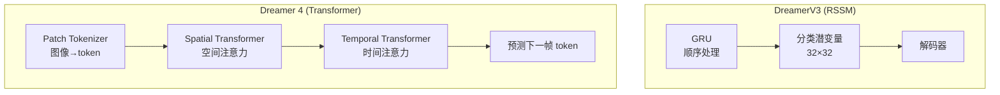

# Dreamer 4：Training Agents Inside of Scalable World Models 深度精读

> **论文标题**: Training Agents Inside of Scalable World Models  
> **作者**: Danijar Hafner, et al.  
> **机构**: DeepMind / Google  
> **发表**: arXiv:2509.24527 (2025)  
> **代码**: 尚未公开（非官方复现 https://github.com/IamCreateAI/Dreamerv4-MC）

**标签**: `#世界模型` `#Transformer` `#Shortcut Forcing` `#Minecraft` `#想象训练` `#视频预测` `#Model-Based RL`

**知识链接**：
- [世界模型基础](/前置知识/000t_前置知识_世界模型基础) — 世界模型概念
- [DreamerV3 精读](/论文综述/089_DreamerV3_通用世界模型RL) — 前代方法，核心对比
- [世界模型强化学习综述](/论文综述/S10_世界模型强化学习综述) — 全景定位
- [策略梯度与 PPO](/前置知识/000a_前置知识_策略梯度与PPO) — Actor-Critic 基础

---

## 一、背景与动机

### 1.1 DreamerV3 的两大瓶颈

DreamerV3 是 2023 年世界模型 RL 的里程碑，但有两个根本性限制：

| 瓶颈 | 原因 | 后果 |
|------|------|------|
| **GRU 的长程记忆不足** | RNN 隐状态只有 4096 维，信息压缩太重 | 复杂场景中（如 Minecraft 的物体交互）预测不准 |
| **推理速度慢于实时** | RSSM 是顺序模型，无法并行 | 想象 rollout 效率低，无法做"可交互的世界模拟器" |

具体来说，DreamerV3 在 Minecraft 中的表现暴露了问题：
- 无法准确预测方块的破坏/放置等离散事件
- 物体交互（如合成台的配方）预测混乱
- 想象 rollout 超过 15 步后画面迅速退化

### 1.2 Dreamer 4 的核心 idea

Dreamer 4 的突破来自两个关键创新：

1. **用 Transformer 完全替代 RSSM 中的 GRU** → 时空建模能力大幅提升
2. **Shortcut Forcing 训练目标** → 让 Transformer 世界模型能**一步前传**生成下一帧（而非自回归多步），实现实时推理

结果：在 Minecraft 中的预测质量远超 V3，且在**单 GPU 上达到 21 FPS 实时交互**。

### 1.3 贯穿全文的例子

> **场景**：Minecraft 中 agent 用铁镐挖掘钻石矿。
>
> - **DreamerV3 的想象**：知道"在地下"但物体交互模糊——挖矿动画不连贯，有时矿块消失时钻石不掉落
> - **Dreamer 4 的想象**：精确预测"铁镐击打钻石矿第 5 次 → 矿块破碎 → 钻石物品掉出 → 进入背包"的完整物理序列

---

## 二、方法详解

### 2.1 架构概览：从 RSSM 到 Transformer

**核心变化**：

| 组件 | DreamerV3 | Dreamer 4 |
|------|-----------|-----------|
| 序列建模 | GRU（顺序） | Transformer（并行注意力） |
| 图像编码 | CNN → 连续潜变量 | Patch → 离散/连续 token |
| 时空建模 | 混合在 GRU 隐状态中 | **分离**：空间 Transformer + 时间 Transformer |
| 训练目标 | ELBO（重建+KL） | **Shortcut Forcing**（flow matching 变体） |
| 推理方式 | 自回归（逐步 GRU） | **一步前传**（shortcut） |

### 2.2 Patch Tokenization：把图像变成 token

Dreamer 4 将每帧图像切分为 patch，类似 ViT（Vision Transformer）：

1. 输入图像 $o_t$（如 128×128×3）
2. 切成 $P \times P$ 的 patch（如 $P=8$，得到 $16 \times 16 = 256$ 个 patch）
3. 每个 patch 经过线性投影得到一个 token 向量

**为什么用 patch 而不是整图 CNN？**
- Transformer 天然处理 token 序列 → patch = 视觉 token
- 可以**选择性注意**——不是每个 patch 都同等重要（比如 Minecraft 中角色面前的方块比天空重要）
- 支持高分辨率：增加 patch 数即可，不需要改架构

### 2.3 Spatial-Temporal Transformer

Dreamer 4 用**两阶段注意力**建模时空动态：

**阶段一：空间 Transformer**

对单帧内的所有 patch token 做 self-attention：

$$
\text{SpatialAttn}(Q_s, K_s, V_s) = \text{softmax}\left(\frac{Q_s K_s^T}{\sqrt{d}}\right) V_s
$$

> 一句话：让每个 patch "看到"同一帧中的其他 patch，理解空间关系（如"这个方块旁边是那个方块"）。

**阶段二：时间 Transformer**

对同一个空间位置的 patch 在不同时间步间做 self-attention：

$$
\text{TemporalAttn}(Q_t, K_t, V_t) = \text{softmax}\left(\frac{Q_t K_t^T}{\sqrt{d}}\right) V_t
$$

> 一句话：让每个 patch 看到过去几帧同一位置的变化，理解时间动态（如"这个方块正在被挖掘，裂纹在增加"）。

**为什么分离时空注意力？**

如果对所有时间步的所有 patch 做 full attention，复杂度是 $O((T \times N)^2)$，其中 $T$ 是帧数，$N$ 是 patch 数。分离后复杂度降为 $O(T \times N^2 + N \times T^2)$——对于 $T=16, N=256$，计算量减少约 16 倍。

### 2.4 Shortcut Forcing：一步推理的核心

这是 Dreamer 4 最关键的创新。传统 Transformer 世界模型在推理时需要**自回归逐 token 生成**（像 GPT 一样一个个出），速度很慢。Shortcut Forcing 让模型**一次性输出下一帧的所有 token**。

**核心思想**（基于 Flow Matching）：

训练时，给模型看一个"从噪声到真实下一帧"的插值状态：

$$
x_\tau = (1 - \tau) \cdot \epsilon + \tau \cdot x_{\text{target}}
$$

其中 $\tau \in [0, 1]$ 是插值比例，$\epsilon$ 是噪声，$x_{\text{target}}$ 是真实下一帧。

模型的任务：**直接预测最终的干净帧** $x_{\text{target}}$（x-prediction），而不是预测"更新方向"（v-prediction）。

$$
\hat{x}_{\text{target}} = f_\theta(x_\tau, \tau, c)
$$

> 一句话：不管噪声加了多少（$\tau$ 是多少），模型都直接猜最终答案。

**为什么这能实现一步推理？**

关键 insight：在推理时设 $\tau = 0$（输入纯噪声），模型一步就输出预测的干净下一帧。不需要像 DDPM 那样迭代 10-1000 步。

**和标准 Flow Matching / Diffusion 的对比**：

| 维度 | 标准 Diffusion/Flow | Shortcut Forcing |
|------|--------------------|-|
| 训练目标 | 预测噪声 $\epsilon$ 或速度 $v$ | 直接预测最终结果 $x_{\text{target}}$ |
| 推理步数 | 10-1000 步迭代 | **1 步** |
| 质量 vs 速度 | 步数越多质量越好 | 一步就能高质量 |
| 训练 trick | — | 在各种 $\tau$ 值上训练，让模型学会"无论多模糊都能猜对答案" |

**数值例子**：

- 训练时：$\tau = 0.3$，输入 = 70% 噪声 + 30% 真实帧 → 模型输出预测的完整干净帧 → 和真实帧算 MSE
- 训练时：$\tau = 0.9$，输入 = 10% 噪声 + 90% 真实帧 → 模型输出预测 → 这种情况比较容易
- 推理时：$\tau = 0$，输入 = 纯噪声 → 模型一步输出下一帧

### 2.5 动作条件化

Dreamer 4 的世界模型是 **action-conditioned** 的：

$$
\hat{o}_{t+1} = f_\theta(o_{t-k:t}, a_{t-k:t})
$$

动作信息的注入方式：
- 动作 $a_t$ 被嵌入为一个向量
- 通过 cross-attention 或 FiLM 调制注入 Transformer 的每一层

**关键设计**：动作条件化是从**少量有标注数据**中学的，而世界模型的大部分知识（视觉动态、物理常识）从**大量无标注视频**中学。这种分离让 Dreamer 4 能利用互联网级别的视频数据做预训练。

### 2.6 想象中的 Actor-Critic 训练

策略训练方式和 DreamerV3 一致：

1. 从 replay buffer 采初始帧作为起点
2. 用世界模型（一步 shortcut）快速展开想象轨迹
3. 在想象轨迹上训练 Actor（最大化回报）和 Critic（预测价值）

**关键区别**：Shortcut Forcing 让每步想象只需一次前传 → 想象 rollout 速度极快。DreamerV3 的 GRU 每步也是一次前传，但 Dreamer 4 的 Transformer 能看到更长的上下文 → 想象更准确。

---

## 三、性能与实验

### 3.1 Minecraft：远超 V3 的预测质量

Dreamer 4 在 Minecraft 中首次展现了对复杂游戏机制的准确预测：
- 方块破坏/放置的精确物理
- 物品合成的正确逻辑
- 生物 AI 行为的合理模拟
- 物品掉落和拾取的完整序列

**世界模型可以连续准确 rollout 高达 60 秒**（DreamerV3 通常 15 步 ≈ 1 秒后就开始退化）。

### 3.2 实时交互

| 方法 | 推理速度 | 能否实时交互 |
|------|---------|------------|
| DreamerV3 (RSSM) | ~30 FPS | 可以（但画质有限） |
| DIAMOND (扩散) | ~2 FPS | 不行 |
| IRIS (Transformer AR) | ~5 FPS | 勉强 |
| **Dreamer 4 (Shortcut)** | **~21 FPS** | **可以，且高画质** |

单 GPU 上 21 FPS 意味着 Dreamer 4 的世界模型可以作为**可交互的游戏引擎**使用——你可以"玩"这个世界模型生成的 Minecraft。

### 3.3 对比 DreamerV3

| 维度 | DreamerV3 | Dreamer 4 | 提升 |
|------|-----------|-----------|------|
| 世界模型架构 | RSSM (GRU) | Transformer | 根本性升级 |
| 想象 horizon | ~15 步 | ~60 秒 | ~100× |
| 预测质量（Minecraft） | 模糊、物理不准 | 精确物体交互 | 质变 |
| 实时推理 | 可以（低画质） | 可以（高画质） | ✅ |
| 预训练数据 | 仅 RL 交互数据 | 大量无标注视频 + 少量有标注 | 数据效率↑ |
| 通用性 | 已在 7 个 benchmark 验证 | 主要在 Minecraft 验证 | V3 更广 |

---

## 四、关键设计洞察

### 4.1 为什么 Shortcut Forcing 比自回归生成好

自回归 Transformer 世界模型（如 IRIS）的问题：
- 每个 token 依赖前一个 → 串行生成很慢
- 一帧有 256 个 token → 生成一帧需要 256 次前传
- 误差在 token 间累积（前面 token 错了，后面全错）

Shortcut Forcing 的优势：
- 一次前传输出所有 token → 256× 加速
- 所有 token 并行预测 → 不存在 token 间的误差累积
- 保持了 Flow Matching 的生成质量

### 4.2 从无标注视频中学物理

Dreamer 4 的另一个关键创新：世界模型的大部分知识来自**无标注视频**。

具体做法：
1. 先在大量 Minecraft 游戏视频（无动作标注）上训练 Transformer → 学会视觉动态
2. 再在少量有动作标注的数据上微调动作条件化模块 → 学会"动作如何影响世界"

这类似于 LLM 的"预训练 + 微调"范式：
- 预训练（无标注视频）= 学习世界的"物理常识"
- 微调（有标注数据）= 学习"我的动作怎么影响世界"

### 4.3 和 Foundation Model 的关系

Dreamer 4 本质上是在说：**世界模型可以像 LLM 一样 scale**。

| 维度 | LLM (GPT) | Dreamer 4 |
|------|-----------|-----------|
| 预训练数据 | 互联网文本 | 互联网视频 |
| 任务 | 预测下一个词 | 预测下一帧 |
| 条件化 | Prompt | 动作 |
| 下游应用 | 聊天、推理 | RL 策略训练 |
| Scaling | 更多参数 = 更聪明 | 更多参数 = 更准确的物理模拟 |

---

## 五、局限与未来

### 5.1 当前局限

1. **主要在 Minecraft 验证**：其他域（连续控制、真实机器人）的验证不如 V3 充分
2. **计算资源需求高**：Transformer 世界模型训练需要大量 GPU
3. **无标注视频的获取**：真实机器人场景中没有大量现成的无标注视频
4. **动作空间适配**：Minecraft 是离散动作；连续动作空间的适配待验证

### 5.2 未来方向

1. **跨域通用化**：像 V3 一样在 150+ 任务上验证
2. **和 Cosmos/Sora 结合**：用视频基础模型初始化 Dreamer 4 的 Transformer
3. **层次化想象**：高层做长期规划（"先去那里"），低层做精细控制
4. **真实机器人部署**：把 Shortcut Forcing 的实时性优势用于真实机器人

---

## 六、总结

| 维度 | Dreamer 4 |
|------|-----------|
| 核心问题 | RSSM 的 GRU 限制了长程预测和推理速度 |
| 核心方案 | Transformer 替代 GRU + Shortcut Forcing 一步推理 |
| 关键创新 | Shortcut Forcing（flow matching 变体实现一步生成） |
| 最大突破 | 单 GPU 实时生成高质量 Minecraft 画面 |
| 对 RL 的意义 | 想象 horizon 从 ~1 秒扩展到 ~60 秒 |
| 和 V3 的关系 | 架构根本性升级；训练理念（想象中 AC）不变 |

**最深刻的 insight**：世界模型正在从"辅助 RL 的工具"变成"通用的环境模拟器"。Dreamer 4 证明了：一个足够好的世界模型，本身就是一个可交互的虚拟世界——RL agent 在这个虚拟世界中训练，效果可以媲美在真实环境中学习。

---

## 延伸阅读

- [DreamerV3 精读](/论文综述/089_DreamerV3_通用世界模型RL) — 前代方法
- [DIAMOND 精读](/论文综述/090_DIAMOND_扩散世界模型RL) — 扩散世界模型的对比
- [世界模型强化学习综述](/论文综述/S10_世界模型强化学习综述) — 全景对比
- [世界模型基础](/前置知识/000t_前置知识_世界模型基础) — 概念入门
- [扩散模型 DDPM](/前置知识/000b_前置知识_扩散模型DDPM) — Shortcut Forcing 的基础（Flow Matching 相关）
