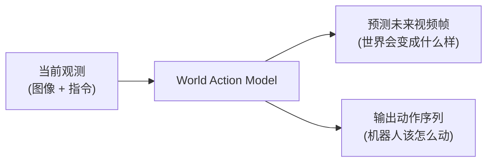
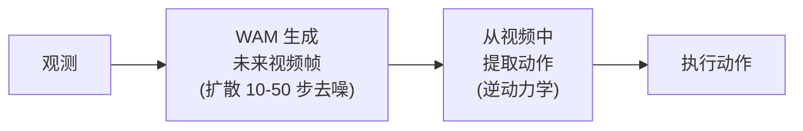
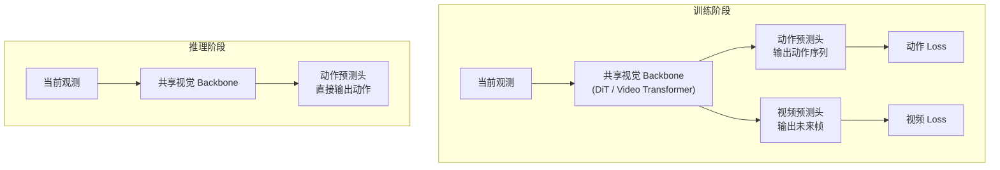
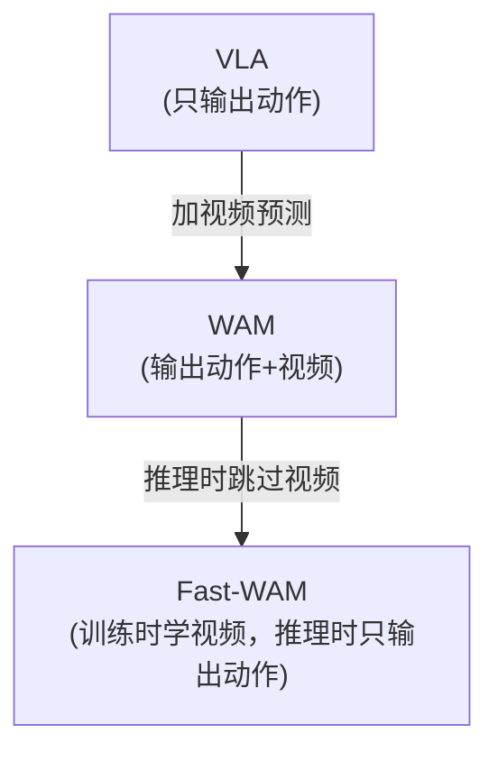

# Fast-WAM：Do World Action Models Need Test-time Future Imagination? 深度精读

> **论文标题**: Do World Action Models Need Test-time Future Imagination?  
> **作者**: (arXiv:2603.16666)  
> **发表**: 2025  
> **代码**: LeRobot v0.6.0 已集成

**标签**: `#世界模型` `#WAM` `#机器人操作` `#视频预测` `#实时控制` `#扩散模型`

**知识链接**：
- [世界模型基础](/前置知识/000t_前置知识_世界模型基础) — 世界模型概念
- [扩散模型 DDPM](/前置知识/000b_前置知识_扩散模型DDPM) — 扩散去噪基础
- [世界模型强化学习综述](/论文综述/S10_世界模型强化学习综述) — 全景定位
- [Dreamer 4 精读](/论文综述/092_Dreamer4_可扩展Transformer世界模型) — 另一条加速路线
- [VLA-RFT 精读](/论文综述/017_VLA_RFT_世界模型验证奖励RL微调) — 想象式 RL 训练的对比

---

## 一、背景与动机

### 1.1 什么是 World Action Model (WAM)

WAM（世界动作模型）是 2024-2025 年机器人学习的一个新兴范式。核心思想：**联合建模"未来会发生什么"（视频预测）和"应该做什么"（动作生成）**。

WAM 和传统 VLA（Vision-Language-Action）的区别：

| 维度 | 传统 VLA | WAM |
|------|---------|-----|
| 输出 | 只输出动作 | **同时输出动作 + 预测未来视频** |
| 是否理解物理 | 隐式（在参数中） | 显式（必须预测物理变化才能得分） |
| 训练信号 | 只有动作监督 | 动作监督 + 视频预测监督 |
| 泛化能力 | 依赖数据覆盖 | 视频预测提供额外的物理理解信号 |

**WAM 的核心假设**：如果模型能准确预测"做了这个动作后世界会怎样变化"，那它一定"理解"了物理——因此输出的动作也更可靠。

### 1.2 现有 WAM 的问题：太慢了

现有 WAM 方法（如 Cosmos Policy、GR-2、UniPi）遵循 **"Imagine-then-Execute"（先想象再执行）** 范式：

问题：**视频生成需要多步扩散去噪**——每次决策都要生成 4-16 帧未来视频，每帧 10-50 步去噪。

| 方法 | 推理延迟 | 能否实时控制 (10Hz) |
|------|---------|-------------------|
| Cosmos Policy | ~800ms | ❌ 太慢 |
| GR-2 | ~600ms | ❌ 太慢 |
| 标准 WAM | ~750ms | ❌ 太慢 |
| **Fast-WAM** | **~190ms** | **✅ 可以** |

190ms 延迟意味着约 5Hz 的控制频率——对大多数机器人操作任务足够。

### 1.3 Fast-WAM 的核心问题

> **"推理时真的需要想象未来吗？"**

Fast-WAM 提出一个大胆假设：**WAM 的性能提升主要来自训练时的视频共训练（学到了好的表示），而不是推理时的未来生成。**

换句话说：
- ✅ 训练时用视频预测作为辅助任务 → 让模型学到物理感知的表示
- ❌ 推理时不需要真的生成未来视频 → 直接输出动作就行

### 1.4 贯穿全文的例子

> **场景**：一个 Franka 机械臂执行"把红色方块放到蓝色碗里"的任务。
>
> - **标准 WAM**：观测当前画面 → 用扩散模型生成"手臂抓起方块→移动到碗上方→放下"的 8 帧未来视频（需要 750ms）→ 从视频中推断动作 → 执行
> - **Fast-WAM**：观测当前画面 → 直接输出动作（190ms）。模型虽然不在推理时生成视频，但它在训练时学过视频预测，所以"脑子里"有物理理解

---

## 二、方法详解

### 2.1 核心设计：训练时共训练，推理时跳过

Fast-WAM 的架构在训练和推理时是**不对称的**：

**关键点**：推理时**视频预测头被完全移除**。模型只执行"观测→动作"的前传，不生成任何视频帧。

### 2.2 为什么视频共训练能提升动作质量

视频预测作为辅助训练目标的好处：

1. **更好的视觉表示**：为了预测未来帧，backbone 必须理解物体的 3D 结构、运动轨迹、物理属性。这些理解也有助于动作预测。
2. **隐式物理模型**：即使推理时不生成视频，backbone 的参数中已经编码了"如果我推这个物体，它会怎么动"的知识。
3. **数据效率**：视频数据比动作标注数据丰富得多。视频共训练让模型从大量无标注视频中学到物理常识。

**类比**：就像一个人学开车——你不需要每时每刻都在脑中"播放"未来的交通画面，但你过去的"想象练习"（驾校模拟）让你的判断更准确。

### 2.3 Fast-WAM 的变体对比

论文通过消融实验对比了几种变体：

| 变体 | 训练时有视频共训练？ | 推理时生成视频？ | 性能 | 延迟 |
|------|-------------------|---------------|------|------|
| Imagine-then-Execute (标准 WAM) | ✅ | ✅ | 高 | 慢 (~750ms) |
| **Fast-WAM（本文）** | **✅** | **❌** | **高（竞争力）** | **快 (~190ms)** |
| 无视频训练的 baseline | ❌ | ❌ | 低 | 快 |
| 推理时想象但训练不共训练 | ❌ | ✅ | 中 | 慢 |

**核心发现**：

1. **去掉推理时想象**（标准 WAM → Fast-WAM）：性能下降很小（~2-3%）
2. **去掉训练时视频共训练**（Fast-WAM → 无视频 baseline）：性能下降显著（~10-15%）

结论：**训练时的视频共训练是性能提升的主要来源，推理时的想象可以省略。**

### 2.4 架构细节

Fast-WAM 的具体实现：

- **Backbone**：基于 Diffusion Transformer (DiT) 架构
- **视觉编码**：当前帧 + 最近 2 帧历史
- **语言条件**：任务指令通过 CLIP text encoder 嵌入，cross-attention 注入
- **动作头**：MLP，直接输出未来 H 步动作序列（chunk）
- **视频头**：条件扩散解码器（训练时用，推理时移除）
- **训练 Loss**：$\mathcal{L} = \mathcal{L}_{\text{action}} + \lambda \cdot \mathcal{L}_{\text{video}}$

**动作 Loss**：
$$
\mathcal{L}_{\text{action}} = \sum_{t=1}^{H} \|a_t^{\text{pred}} - a_t^{\text{gt}}\|^2
$$

**视频 Loss**（训练时的辅助目标）：
$$
\mathcal{L}_{\text{video}} = \mathbb{E}_{n, \epsilon} \left[ \|\epsilon - \epsilon_\theta(o_{t+1}^{(n)}, n, c)\|^2 \right]
$$

> 标准的 DDPM 噪声预测 loss，和 [DIAMOND](/论文综述/090_DIAMOND_扩散世界模型RL) 的训练目标一样。

### 2.5 和其他 WAM 加速方案的对比

除了 Fast-WAM 的"推理时直接跳过想象"路线，2025 年还有其他 WAM 加速方案：

| 方法 | 加速策略 | 延迟 | 思路 |
|------|---------|------|------|
| **Fast-WAM** | 推理时跳过视频生成 | 190ms | "训练时学物理，推理时不想象" |
| Flash-WAM | 模态感知蒸馏 | ~150ms | 把多步去噪蒸馏为少步 |
| Light-WAM | 压缩 backbone + latent space 视频 | 72ms | 更小的模型 + 降分辨率 |
| LaWAM | 潜空间视频预测 | 187ms | 在 latent space 做视频预测而非像素空间 |

Fast-WAM 的独特优势：**最简单、最好理解**——不需要蒸馏、不需要额外架构，只需要"训练时加一个视频 loss，推理时去掉"。

---

## 三、实验结果

### 3.1 LIBERO Benchmark

LIBERO 是机器人操作的标准仿真 benchmark，包含多种桌面操作任务。

| 方法 | LIBERO-Spatial | LIBERO-Object | LIBERO-Goal | LIBERO-Long | 平均 |
|------|---------------|---------------|-------------|-------------|------|
| Diffusion Policy | 78.3% | 84.0% | 68.3% | 48.7% | 69.8% |
| Octo | 78.9% | 81.0% | 71.4% | 50.2% | 70.4% |
| 标准 WAM | 85.2% | 88.5% | 78.1% | 58.3% | 77.5% |
| **Fast-WAM** | **84.1%** | **87.2%** | **76.8%** | **56.9%** | **76.3%** |

**关键观察**：Fast-WAM 只比标准 WAM 低约 1.2%，但速度快 4 倍以上。

### 3.2 RoboTwin Benchmark

| 方法 | 平均成功率 | 推理延迟 |
|------|-----------|---------|
| 标准 WAM | 72.5% | ~750ms |
| **Fast-WAM** | **70.8%** | **190ms** |
| 无视频训练 baseline | 61.2% | 180ms |

### 3.3 真实世界任务

Fast-WAM 在真实 Franka 机械臂上验证了多个任务：
- 抓取放置
- 推物体到目标位置
- 打开抽屉

**无需 embodied pretraining**（不需要在真实机器人上做额外预训练）就能工作——直接从仿真训练迁移。

### 3.4 消融实验：视频共训练的价值

| 配置 | LIBERO 平均成功率 | Δ |
|------|-----------------|---|
| Fast-WAM（有视频共训练） | 76.3% | baseline |
| 去掉视频共训练 | 63.5% | **-12.8%** |
| 推理时也生成视频（标准 WAM） | 77.5% | +1.2% |

**结论**：
- 视频共训练贡献了 12.8% 的提升 → **这是核心价值**
- 推理时生成视频只额外贡献 1.2% → **性价比极低**（为了 1.2% 多花 4× 时间）

---

## 四、核心洞察与讨论

### 4.1 "为什么推理时不需要想象"的直觉解释

想象一个人学骑自行车：
- **训练阶段**（学习时）：你需要在脑中想象"如果我这样转把手，车会往哪倒"——这帮助你建立运动模型
- **执行阶段**（骑行时）：你不再每时每刻都在脑中"播放"未来画面——判断和动作变成了条件反射

Fast-WAM 的模型也是如此：训练时通过视频预测学到了物理理解，推理时这些理解已经编码在 backbone 参数中，不需要显式"想象"就能输出正确动作。

### 4.2 什么时候推理时想象仍然有价值

Fast-WAM 论文诚实地指出，在某些场景下推理时想象仍有价值：

1. **极长 horizon 任务**：需要几十步规划时，显式想象未来能帮助避免短视决策
2. **分布外场景**：面对训练时没见过的物体/布局，显式预测未来能提供"检验机制"
3. **需要验证的场景**：如 [VLA-RFT](/论文综述/017_VLA_RFT_世界模型验证奖励RL微调) 的思路——用想象结果做自我验证

### 4.3 WAM 和 VLA 的关系

Fast-WAM 本质上是 VLA 和 WAM 的折中：
- **训练**像 WAM（多任务学习，含视频预测）
- **推理**像 VLA（直接输出动作，不生成视频）
- **性能**接近 WAM，**速度**接近 VLA

---

## 五、局限与未来方向

### 5.1 当前局限

1. **和最强 WAM 仍有小差距**（~1-2%）：在精度要求极高的任务中可能不够
2. **视频共训练仍需要计算**：训练成本没有降低，只是推理时省了
3. **没有自校验能力**：标准 WAM 可以通过"想象结果不对"来检测错误动作，Fast-WAM 没有这个安全网
4. **依赖视频数据质量**：训练时的视频预测 loss 需要高质量的视频数据

### 5.2 未来方向

1. **自适应想象**：简单任务不想象（Fast-WAM 模式），困难任务才想象（标准 WAM 模式）
2. **蒸馏进一步加速**：Flash-WAM 已经展示了把去噪步数压缩到 1-2 步的可能
3. **和 RL 结合**：训练时用视频预测做辅助 reward（想象成功 → 正奖励）
4. **4D 世界理解**：不只预测 2D 视频，预测 3D 场景变化

---

## 六、总结

| 维度 | Fast-WAM |
|------|----------|
| 核心问题 | WAM 推理时生成视频太慢，无法实时控制机器人 |
| 核心发现 | WAM 的性能提升主要来自训练时的视频共训练，而非推理时的未来生成 |
| 核心方案 | 训练时保留视频预测 loss，推理时跳过视频生成 |
| 关键数字 | 190ms 延迟（4× 加速），性能只降 1-2% |
| 实际意义 | 让 WAM 范式真正可以部署到实时机器人控制中 |

**最深刻的 insight**：视频预测对机器人策略的贡献主要是**表示学习**（让 backbone 理解物理），而不是**显式规划**（推理时真的需要看到未来画面）。这和人类的直觉一致——熟练工人靠"手感"而非每次都在脑中模拟。

---

## 延伸阅读

- [世界模型基础](/前置知识/000t_前置知识_世界模型基础) — 概念入门
- [Dreamer 4 精读](/论文综述/092_Dreamer4_可扩展Transformer世界模型) — 另一条加速世界模型的路线
- [DIAMOND 精读](/论文综述/090_DIAMOND_扩散世界模型RL) — 扩散世界模型基础
- [VLA-RFT 精读](/论文综述/017_VLA_RFT_世界模型验证奖励RL微调) — "想象+验证" 的另一个视角
- [世界模型强化学习综述](/论文综述/S10_世界模型强化学习综述) — 全景对比
- [World-VLA-Loop 精读](/论文综述/044_WorldVLALoop_闭环世界模型与VLA策略学习) — 世界模型与策略闭环优化
