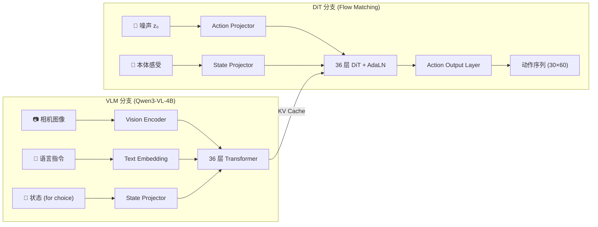

# Xiaomi-Robotics-1：十万小时真实数据 Scaling VLA 深度精读

> **论文标题**: Xiaomi-Robotics-1: Scaling Vision-Language-Action Models with over 100K Hours of Real-World Trajectories  
> **作者**: Xiaomi Robotics Team (Jun Guo, Piaopiao Jin, Jason Li 等)  
> **机构**: 小米机器人  
> **发表**: arXiv:2607.15330, 2026-07  
> **官网**: https://robotics.xiaomi.com/xiaomi-robotics-1.html  
> **代码**: https://github.com/XiaomiRobotics/Xiaomi-Robotics-1

**标签**: `#VLA` `#基础模型` `#Flow Matching` `#Scaling Law` `#UMI` `#DiT` `#MoT`

**知识链接**：
- [Flow Matching 与连续归一化流](/前置知识/000g_前置知识_Flow_Matching与连续归一化流) — XR-1 动作生成的核心机制
- [时域 Loss 与频域 Loss](/前置知识/002u_前置知识_时域Loss与频域Loss) — XR-1 训练 Loss 的双重监督设计
- [视觉-语言-动作模型 VLA 综述](/论文综述/S03_视觉语言动作模型VLA综述) — VLA 路线全景
- [π₀：通用机器人基础模型](./014_Pi0_通用机器人基础模型) — 同类架构对比
- [GR00T N1 人形机器人基础模型](./019_GR00T_N1_人形机器人基础模型) — MoT 架构先驱

---

## 一、背景与动机

### 1.1 机器人领域的数据瓶颈

LLM 的成功公式已经验证：**数据规模 + 模型容量 + 正确架构 = 涌现能力**。

但机器人领域一直被**数据稀缺**卡脖子。原因很直接：

1. **采集成本高**：传统遥操作需要一个人操控一台真机做示教，一小时数据可能要花几千元（设备 + 人工 + 场景搭建）
2. **场景多样性差**：大多数实验室只有一两个固定场景，数据高度同质化
3. **体态绑定**：用 Franka 采集的数据无法直接给 UR5 用

结果是：2024 年底最大的公开机器人数据集（Open X-Embodiment）也不过 ~2000 小时。相比 LLM 训练用的万亿 token 互联网数据，差了好几个数量级。

### 1.2 Xiaomi-Robotics-1 的核心主张

XR-1 的立场非常鲜明：

> **用 embodiment-free 的 UMI 设备大规模采集，加上自动标注 pipeline，可以把机器人数据量推到 100,000 小时。在这个数据规模下，VLA 模型展现出清晰的 scaling behavior——数据越多、模型越大，性能单调上升，且无饱和迹象。**

"Embodiment-free"是关键：UMI 是一种手持夹爪，人直接拿着操作物体，不需要真实机器人在场。这把数据采集成本降低了一个数量级。

### 1.3 与前作 Xiaomi-Robotics-0 的关系

XR-0（2024-02）已经验证了"Qwen3-VL + DiT + Flow Matching"的架构可行性，并开源了代码和权重。XR-1 在此基础上做了三件事：

1. **数据规模从千小时级推到十万小时级**
2. **引入自动标注 pipeline**：用 VLM 给 UMI 轨迹自动生成状态转移描述
3. **设计两阶段训练流程**：预训练学广度 → 后训练做对齐

---

## 二、模型架构

### 2.1 整体结构：VLM + DiT 通过 MoT 耦合

XR-1 的架构由两个主体模块组成，通过 **Mixture-of-Transformers (MoT)** 方式耦合：

| 模块 | 功能 | backbone | 层数 | 隐藏维度 |
|------|------|----------|------|----------|
| VLM 分支 | 理解图像 + 语言指令，生成 KV cache | Qwen3-VL-4B-Instruct | 36 层 | 2560 |
| DiT 分支 | 基于 Flow Matching 生成动作序列 | 自定义 DiT | 36 层 | 1024 |

整个模型约 **5B 参数**（4B VLM + ~1B DiT + 投影层）。



**核心设计决策**：

1. **DiT 层数与 VLM 相同（36 层），但隐藏维度更小（1024 vs 2560）**——这是 MoT 的关键：DiT 不是一个轻量 head，而是一个与 VLM 等深度的独立 Transformer。通过共享 KV cache 做 cross-attention，DiT 的每一层都能访问 VLM 对应层的表征。隐藏维度小是为了推理速度。
2. **DiT 使用 AdaLN（Adaptive Layer Normalization）注入时间步信息**——这是扩散/Flow 模型的标准做法。每一层有 6 个 AdaLN 参数（attention 的 shift/scale/gate + MLP 的 shift/scale/gate）。

### 2.2 VLM 分支细节

VLM 分支基于 Qwen3-VL-4B-Instruct，包含：
- **Vision Encoder**：处理多视角相机图像（ego/左手腕/右手腕）
- **Text Model**：处理语言指令
- **特殊 token 设计**：在标准 Qwen 词表之外添加了专用 token
  - `<state>` (ID=151670)：标记本体感受状态的插入位置
  - `<a_0>` ~ `<a_59>` (ID=151671~151730)：60 个 action token，用于 VLM 内部的动作选择分支
  - `<score>` (ID=151669)：用于预测每个动作候选的质量分数

VLM 的输出是 **KV cache**——即所有 36 层 Transformer 的 key/value 矩阵。这些 KV cache 被直接传给 DiT 分支作为 cross-attention 的 context。

### 2.3 DiT 分支细节

DiT 分支是一个 36 层的 Transformer Decoder，每层包含：

1. **AdaLN 调制的 Self-Attention**：query/key/value 投影 + QK-Norm + GQA（8 个 KV heads）
2. **Cross-Attention with VLM KV cache**：DiT 的每一层读取 VLM 对应层的 KV cache
3. **SwiGLU MLP**：intermediate_size = 4 × hidden_size = 4096

输入序列的构成（从左到右拼接）：

```
[sink_token(1)] [state_embed(1×1024)] [noisy_action(30×1024)]
```

- **Sink token**：一个可学习的 embedding（`nn.Embedding(1, 1024)`），作为序列起始的"锚点"
- **State embed**：本体感受状态经 2 层 MLP 投影到 1024 维。状态维度 = 60（包含左右臂关节角、夹爪位置、末端位姿等）
- **Noisy action**：当前时间步的含噪动作序列，30 步 × 60 维，经投影到 1024 维

总 query 长度 = 1 + 1 + 30 = **32 tokens**。

### 2.4 Flow Matching 生成过程

XR-1 使用 **Rectified Flow**（直线流）做动作生成：

在训练时，从目标动作 $a$ 和随机噪声 $z_0$ 之间做线性插值，让网络学习预测速度场（即 $a - z_0$）。推理时从纯噪声 $z_0$ 出发，通过 5 步 Euler 积分生成动作。

**训练时的 Flow Matching 目标**：

$$
\mathcal{L}_{\text{flow}} = \mathbb{E}_{t \sim p(t),\, z_0 \sim \mathcal{N}(0, I)} \left\| v_\theta\bigl((1-t) z_0 + t \cdot a,\; t\bigr) - (a - z_0) \right\|^2
$$

**这个公式在做什么**：让网络 $v_\theta$ 学习从噪声指向真实动作的"速度方向"。给定一个中间插值点 $(1-t)z_0 + ta$，网络需要预测从该点到终点的向量 $a - z_0$。

::: details 📐 逐符号拆解 + 数值代入（点击展开）
**逐符号拆解**：

| 符号 | 含义 | 具体是什么 |
|------|------|-----------|
| $v_\theta$ | DiT 网络的输出 | 预测的速度向量，维度 30×60 |
| $t$ | 流时间步 | 从 Beta(1.5, 1.0) 采样后映射到 [0, 0.999] |
| $z_0$ | 标准高斯噪声 | 起点，维度 30×60 |
| $a$ | 真实动作序列 | 训练数据中的 ground truth，30 步×60 维 |
| $(1-t)z_0 + ta$ | 线性插值 | $t=0$ 时为纯噪声，$t=1$ 时为真实动作 |
| $a - z_0$ | 目标速度 | 从噪声直线指向目标的方向向量 |

**为什么时间步从 Beta(1.5, 1.0) 采样？** Beta(1.5, 1.0) 的分布偏右——更多样本集中在 $t$ 接近 1 的区域。这意味着网络花更多精力学习"接近真实动作时的精细修正"，而不是"从纯噪声出发的粗糙方向"。直觉：最后几步的精度对控制质量影响最大。

**数值代入**：假设 $t=0.7$，某一维动作 $a=0.5$，噪声 $z_0=-0.3$：
- 插值点：$(1-0.7) \times (-0.3) + 0.7 \times 0.5 = -0.09 + 0.35 = 0.26$
- 目标速度：$0.5 - (-0.3) = 0.8$
- 如果网络输出 0.75，MSE loss = $(0.75 - 0.8)^2 = 0.0025$
- 梯度方向：推动网络输出从 0.75 往 0.8 调整

**推理时**：固定 5 步 Euler 积分，步长 $\Delta t = 0.2$：
$$
z_{k+1} = z_k + v_\theta(z_k, t_k) \times 0.2, \quad t_k = k/5
$$
:::

### 2.5 动作空间设计

动作序列的形状是 **30 步 × 60 维**：

- **30 步**：action chunk 长度。模型一次预测未来 30 个时间步的动作
- **60 维**：包含双臂机器人的完整控制信号
  - 左臂 7 关节角 + 右臂 7 关节角 = 14
  - 左夹爪位置 + 右夹爪位置 = 2
  - 左末端位姿 (pos+rotmat) + 右末端位姿 = 24
  - 腰部 + 底盘运动 + 其他 = 剩余维度

状态维度同样是 60 维（`state_shape = (1, 60)`），与动作维度对齐，包含当前时刻的本体感受。

### 2.6 异步执行（Async Training）

XR-1 支持**异步推理**：在机器人执行前面预测的动作块时，模型同时预测下一个动作块。这通过 **action prefix** 机制实现：

训练时，以 50% 概率随机选择一个 prefix 长度（1~6 步），把已执行的动作作为前缀拼接到输入中。DiT 生成时，前缀部分的输出被置零（不做梯度更新），只学习预测前缀之后的动作。

推理时，客户端可以传入一个 `(N, 60)` 的 action prefix，模型基于此前缀续写剩余动作，实现无缝衔接。

### 2.7 动作选择分支（Choice Head）

除了 Flow Matching 生成主通道外，VLM 分支还有一个 **action choice head**，这是 XR-1 的一个独特设计：

1. VLM 内部有 60 个 action token（`<a_0>` ~ `<a_59>`），经过 VLM 36 层 Transformer 后，提取这些位置的 hidden state
2. 通过 4 层 MLP + 1 层线性层投影到 $60 \times 5$ 维——即 **5 个候选动作**
3. 同时 `<score>` token 的 hidden state 通过另一个 head 预测 5 个分数

训练时，5 个候选中 L1 误差最小的那个被选为"最佳"，其 loss 回传；score head 学习预测每个候选的误差大小。这相当于一个 **best-of-N** 机制，增加了模型对多模态动作分布的覆盖能力。

---

## 三、数据：100K 小时从何而来

### 3.1 UMI 数据采集

[UMI (Universal Manipulation Interface)](https://umi-gripper.github.io/) 是 Stanford 提出的一种免机器人数据采集方案。核心思路：

- 一个手持夹爪 + 手腕相机
- 人直接拿着夹爪操作物体
- 通过 SLAM 恢复 6DoF 末端位姿，再通过逆运动学转换为关节角
- **不需要真实机器人在场**——所以叫"embodiment-free"

Xiaomi 大规模部署 UMI，在 **1700+ 场景**（家庭、商铺、工业场所、户外）采集了：
- **100,000+ 小时**的操作轨迹
- **2,400,000+ episodes**
- **260+ 任务类型**

这是截至 2026 年 7 月机器人领域最大的真实操作数据集。

### 3.2 自动标注 Pipeline

100K 小时数据不可能人工标注。XR-1 的解法：

1. **分段**：把长轨迹切成固定长度的 clip（每段对应一个 action chunk）
2. **VLM 标注**：用一个强视觉-语言模型（可能是 Qwen3-VL 家族的更大模型）看每段 clip 的首帧和末帧，生成一段自然语言描述——**描述的是场景状态转移**

举例：
- "夹爪从打开状态变为闭合状态，夹住了红色杯子的把手"
- "杯子从桌面左侧移动到了托盘中央"
- "抽屉从关闭状态被拉开了约 15cm"

**关键区别**：这些标注描述的不是"命令"（如"把杯子放到托盘上"），而是"发生了什么状态变化"。这一区别在两阶段训练中很重要——预训练学"给定状态转移描述，生成对应动作"，后训练才学"给定人类命令，理解并执行"。

据报道，整个 100K 小时数据集的自动标注在云计算集群上约 **2 周完成**。

### 3.3 后训练数据

后训练阶段使用更小但更高质量的数据混合：

| 数据来源 | 规模 | 说明 |
|----------|------|------|
| 小米自采真机数据 | 7,200+ 小时 | 移动操作机器人 + 双臂机器人在真实家庭中操作 |
| 人工标注 UMI 数据 | ~1,000 小时 | 对 UMI 数据做人工时间分段 + 指令标注 |
| 开源数据集 | ~2,000+ 小时 | BridgeData V2、RT-1、DROID 等，经质量筛选 |
| **总计** | **~10,000+ 小时** | |

后训练数据的标注格式与预训练不同：不再是"状态转移描述"，而是**人类自然语言指令**（如"打开抽屉取出杯子"）。

---

## 四、两阶段训练

### 4.1 Stage 1：预训练——学广度

**目标**：让模型看尽可能多的真实操作场景，学会"给定视觉观测 + 状态转移文本描述 → 生成对应动作序列"的通用映射。

**训练数据**：100K 小时 UMI 轨迹 + 自动生成的状态转移描述

**训练信号**：
- 主 loss：Flow Matching MSE loss（让 DiT 学习速度场）
- 辅助 loss：频域 loss（FFT 后的频率误差）+ Choice loss（VLM 分支的动作选择 + 分数预测）

**总 loss 公式**：

$$
\mathcal{L}_{\text{total}} = 0.5 \cdot \mathcal{L}_{\text{MSE}} + \lambda_{\text{freq}} \cdot \mathcal{L}_{\text{freq}} + 0.5 \cdot \mathcal{L}_{\text{choice}} + 0.5 \cdot \mathcal{L}_{\text{score}}
$$

**这个公式在做什么**：把四个训练目标加权组合。MSE 学习动作生成精度，频域 loss 学习动作的平滑性/频率特征，choice loss 和 score loss 让 VLM 分支也参与动作理解。

::: details 📐 逐符号拆解 + 数值代入（点击展开）
**逐符号拆解**：

| 符号 | 含义 | 具体作用 |
|------|------|----------|
| $\mathcal{L}_{\text{MSE}}$ | 时域 MSE loss | 预测速度场 $v_\theta$ 与真实速度 $a - z_0$ 的均方误差 |
| $\mathcal{L}_{\text{freq}}$ | 频域 loss | 对预测和目标做 FFT，比较频率分量的差异。排除第 17/18/19 维（夹爪等离散维度）|
| $\lambda_{\text{freq}}$ | 频域 loss 权重 | 默认 = 1.0 |
| $\mathcal{L}_{\text{choice}}$ | 动作选择 L1 loss | 5 个候选动作中误差最小的那个的 L1 距离 |
| $\mathcal{L}_{\text{score}}$ | 分数预测 MSE | score head 预测每个候选的误差，与实际误差做 MSE |

**各项的梯度方向**：
- $\mathcal{L}_{\text{MSE}}$：推动 DiT 输出更准确的速度方向
- $\mathcal{L}_{\text{freq}}$：推动预测动作在频域上与目标一致，防止高频抖动或低频漂移
- $\mathcal{L}_{\text{choice}}$：推动 VLM 的 action token 至少有一个候选接近真实动作
- $\mathcal{L}_{\text{score}}$：推动 score head 准确评估每个候选的好坏

**数值代入**：假设某 batch 中：
- $\mathcal{L}_{\text{MSE}} = 0.12$，$\mathcal{L}_{\text{freq}} = 0.08$
- $\mathcal{L}_{\text{choice}} = 0.15$，$\mathcal{L}_{\text{score}} = 0.03$
- $\lambda_{\text{freq}} = 1.0$

$$
\mathcal{L}_{\text{total}} = 0.5 \times 0.12 + 1.0 \times 0.08 + 0.5 \times 0.15 + 0.5 \times 0.03 = 0.06 + 0.08 + 0.075 + 0.015 = 0.23
$$
:::

**关键发现——预训练 scaling behavior**：

验证集的 Action Error (MSE) 随数据量和模型参数量**单调下降**：
- 数据从 12.5% → 100%（即 12.5K → 100K 小时）：误差持续下降，无饱和
- 模型从 2B → 5B → 10B 参数：误差也持续下降
- 但 **数据量的贡献 > 模型大小的贡献**——增加数据带来的收益更大

这意味着机器人 VLA 还远没到"数据够了只需要更大模型"的阶段。当前的主要瓶颈仍然是数据。

### 4.2 Stage 2：后训练——做对齐

后训练解决两个 gap：

#### Gap 1：Embodiment Alignment（体态对齐）

预训练用的是 UMI 数据——UMI 夹爪的运动学和真实机器人不同。后训练使用真实机器人数据（7200+ 小时），让模型学会把"通用操作知识"映射到具体机器人的关节空间。

#### Gap 2：Instruction Alignment（指令对齐）

预训练时的语言条件是"状态转移描述"（如"杯子从 A 移到了 B"），但用户给机器人的是**祈使句指令**（如"把杯子放到 B"）。后训练用指令标注数据做对齐，让模型理解人类命令并执行。

#### 后训练的 Scaling 传递性

XR-1 最重要的发现之一：**预训练越强，后训练的 zero-shot 性能越好**。

具体来说，在未见过的真实家庭环境中测试（整理沙发、收拾鞋柜、厨房操作等）：
- 使用 12.5% 预训练数据的模型：后训练后 zero-shot 成功率 ~25%
- 使用 100% 预训练数据的模型：后训练后 zero-shot 成功率 ~75%

模型越大效果也越好，但数据量的提升带来的收益更显著。

---

## 五、实验结果

### 5.1 Simulation Benchmarks

XR-1 在四个标准仿真基准上全部达到 SOTA：

| 基准 | XR-1 成功率 | 此前 SOTA | 相对提升 |
|------|------------|-----------|----------|
| RoboCasa (50 task) | 74.5% | 72.6% | +2.6% |
| RoboCasa365 (365 task) | 57.4% | 46.6% | +23.2% |
| VLABench (100 task) | 59.1% | 53.2% | +11.1% |
| RoboDojo | 13.93% | 8.80% | +58.3% |

**RoboCasa365** 是一个覆盖 50 类厨房任务的大规模基准，包含 atomic（单步）和 composite（多步）两种难度，以及 seen/unseen 的环境划分。XR-1 在最难的 composite-unseen 子集上达到 32.1% 成功率，说明其泛化能力确实来自预训练而非记忆。

**RoboDojo** 是一个统一操作评分基准，XR-1 以 20.07 分（13.93% 成功率）大幅领先第二名（13.07 分，8.80% 成功率），提升接近 60%。

### 5.2 真机 Fine-tuning 效率

XR-1 作为基础模型，在少量数据微调后即可适配全新复杂任务：

| 任务 | XR-1 (≤10h 数据) | π0.5 (≤10h 数据) | XR-1 (≤40h 数据) | π0.5 (≤40h 数据) |
|------|-------------------|-------------------|-------------------|-------------------|
| Phone Packing | 70% | 30% | 80% | 40% |
| Printer Refilling | 70% | 20% | 60% | 20% |
| Laundry Loading | 80% | 40% | 100% | 50% |
| Box Packing | 80% | 70% | 100% | 100% |
| **Overall** | **75%** | **40%** | **85%** | **53%** |

几个值得注意的点：
- 用 **不到 10 小时/任务** 的数据，XR-1 已经达到 75% 平均成功率，几乎是 π0.5 的 2 倍
- 洗衣机装载和箱子打包在 40 小时数据下达到 100% 成功率
- XR-1 在涉及**柔性物体**（衣物、纸张）和**全身移动**的任务上优势特别明显

### 5.3 Scaling Law 验证

XR-1 论文最有说服力的结果是完整的 scaling 曲线：

1. **预训练阶段**：validation action error 随 training steps 下降，且数据量越大下降越快、越稳定。用 12.5% 数据训到后期会出现 error 上升（过拟合），而 100% 数据始终单调下降。
2. **后训练阶段**：真机 zero-shot 成功率与预训练数据量/模型大小正相关，无饱和趋势。

这与 LLM 领域的 Chinchilla scaling law 类似，但有一个关键差异：**在机器人 VLA 中，数据比参数量更重要**。这可能是因为视觉运动策略需要见过足够多样的物理交互场景，才能学到 robust 的操作 prior。

---

## 六、代码解读：关键实现细节

### 6.1 模型初始化

从代码中可以看到 XR-1 的构建过程。VLM 部分直接加载 `Qwen/Qwen3-VL-4B-Instruct` 配置（但训练时重新初始化权重），DiT 部分为全新自定义模块：

```python
# DiT 默认配置
self.dit = DiT(layer_num=36, hidden_size=1024)

# 动作空间
self.state_shape = (1, 60)   # 状态：1步 × 60维
self.action_shape = (30, 60)  # 动作：30步 × 60维

# Flow Matching 推理步数
self.num_steps = 5  # 5步 Euler 积分
```

隐藏维度 1024 对于一个 36 层 Transformer 来说非常"瘦"——参数量约 1B，远小于 VLM 的 4B。这是有意为之：DiT 的计算瓶颈在于 cross-attention 对 VLM KV cache 的访问，而不是自身参数量。更小的 hidden size 让推理时 DiT 的 5 次前向传播更快。

### 6.2 AdaLN 调制机制

时间步 $t$ 的注入方式是 DiT 的标准做法——AdaLN（Adaptive Layer Normalization）：

```python
# 时间步 → 频率编码 → MLP → 6倍隐藏维度
timestep_embed = self.t_embedder(timestep * 1000)  # (B, 1, 1024)
adaln_params = self.t_projector(timestep_embed)     # (B, 6, 1024)
```

每一层的 `DecoderLayer` 内部用这 6 个参数做调制——相当于告诉每一层"当前去噪进度到哪了"。这让同一个网络能处理不同噪声水平的输入。

### 6.3 频域 Loss

XR-1 除了标准 MSE loss 之外，还加了一个 **频域 loss**：对预测和目标动作做 FFT，比较频率分量的差异。

```python
freq = (torch.fft.rfft(pred, dim=1) - torch.fft.rfft(target, dim=1)).abs()
```

这个设计的动机是：动作序列的**平滑性**很重要。纯 MSE loss 可能让模型在每个时间步都预测准，但步与步之间的过渡可能不平滑（高频抖动）。频域 loss 直接惩罚高频偏差，鼓励预测动作在时间维度上的连贯性。

注意排除了第 17/18/19 维——这些维度对应夹爪开合等离散信号，本身就是"阶跃"形的，不应该被频域 loss 约束为平滑。

### 6.4 MoT 耦合：DiT 如何读取 VLM 的 KV cache

核心耦合代码在 `DiT.forward()` 中：

```python
def forward(self, hidden_states, past_key_values, attn_mask, position_embeds, timestep):
    start = len(past_key_values) - self.layer_num  # VLM 36层 → start=0
    for index, layer in enumerate(self.layers):
        hidden_states = layer(
            hidden_states,
            past_key_values[start + index],  # 第 i 层 DiT 读第 i 层 VLM 的 KV
            position_embeds,
            timestep,
            attn_mask,
        )
    return hidden_states
```

**关键点**：DiT 的第 $i$ 层 cross-attend 到 VLM 的第 $i$ 层。这不是随机的——深层 VLM 表征更加抽象/语义化，浅层更加底层/视觉化。DiT 的每一层都能访问 VLM 对应抽象级别的表征。

在 `Attention.forward()` 中，VLM 的 KV cache 被拼接到 DiT 自身的 K/V 前面：

```python
cache_key, cache_value = past_key_values  # 来自 VLM
key = torch.cat([cache_key, key], dim=-2)   # 先放 VLM 的 K，再放 DiT 自己的 K
value = torch.cat([cache_value, value], dim=-2)
output = F.scaled_dot_product_attention(query, key, value, attn_mask=attn_mask)
```

这样 DiT 的每个 query 都能同时 attend 到 VLM 的视觉-语言上下文和 DiT 自己的动作序列上下文。

---

## 七、关键设计决策分析

### 7.1 为什么用 MoT 而不是统一 Transformer？

传统做法（如 OpenVLA）是把动作 token 直接放进 VLM 的词表里，让同一个 Transformer 既处理视觉-语言又生成动作。XR-1 的做法——独立 DiT + KV cache 共享——有三个优势：

1. **推理效率**：VLM 只需跑一次（编码图像+指令），生成 KV cache。之后 DiT 做 5 步去噪，每次只跑 32 个 token 的前向，而不是重新跑整个长序列。
2. **避免灾难性遗忘**：VLM 的主干可以部分冻结（如 embedding 层），不会被动作训练信号"冲坏"视觉-语言能力。
3. **灵活性**：DiT 的推理步数（5步）可以运行时调整，不改架构。

### 7.2 为什么是 Flow Matching 而不是扩散？

Flow Matching 相比 DDPM/DDIM 的优势：
- **直线传输路径**：不需要学习复杂的噪声 schedule，训练更稳定
- **少步推理**：5 步 Euler 即可生成高质量动作（DDPM 通常需要 20-100 步）
- **精确的速度场目标**：$v = a - z_0$ 是解析目标，不是从 $\epsilon$-prediction 转换来的

对于机器人实时控制来说，5 步推理 = ~50ms 延迟（在 consumer GPU 上），完全满足 20Hz 控制频率。

### 7.3 为什么 UMI 数据有效？

UMI 数据面临一个 domain gap：手持夹爪的运动学与真实机器人差异很大（没有关节限位、没有碰撞约束、手腕灵活度不同）。为什么这种数据仍然能大幅提升真机性能？

关键在于 UMI 数据提供的不是精确的关节轨迹，而是**操作语义**：
- 什么时候该闭合夹爪
- 物体该从哪个方向接近
- 放置时怎样的姿态才稳定
- 如何绕过障碍物

这些高层操作知识是 embodiment-agnostic 的。后训练的 embodiment alignment 负责把这些知识"翻译"到具体机器人的关节空间。

---

## 八、与相关工作对比

| 维度 | XR-1 | π₀ / π0.5 | GR00T N1 | OpenVLA |
|------|------|-----------|----------|---------|
| VLM backbone | Qwen3-VL-4B | PaliGemma 3B | Eagle-2 | Llama 2 7B |
| 动作生成 | Flow Matching DiT | Flow Matching MLP | Flow Matching DiT (MoT) | 自回归 token |
| 预训练数据量 | 100K 小时 | ~10K 小时 | 未公开 | Open X (2K 小时) |
| 数据来源 | UMI + 真机 | 真机 teleoperation | 真机 + 仿真 | 开源混合 |
| 动作维度 | 连续 60D | 连续 7-24D | 连续 | 离散 256 bin |
| action chunk | 30 步 | 50 步 | 16 步 | 1 步 |
| 推理步数 | 5 步 Euler | 10-50 步 | 未公开 | 自回归 |
| 总参数 | ~5B | ~3B | ~2B | ~7B |
| 异步执行 | ✅ | ✅ | ✅ | ❌ |
| RoboCasa365 | 57.4% | - | - | - |
| 开源 | ✅ 代码+权重 | 部分 | ❌ | ✅ |

**与 π0.5 的关键差异**：
1. π0.5 依赖真机 teleoperation 数据，采集成本高、规模受限。XR-1 用 UMI 突破了这个限制。
2. π0.5 的 action head 是较轻量的 MLP，XR-1 用 36 层 DiT——容量大得多。
3. 在相同数据预算下（≤10h/task 微调），XR-1 成功率 75% vs π0.5 的 40%。

**与 GR00T N1 的关系**：
N1 是 NVIDIA 在 2024 年底提出的人形机器人基础模型，也使用 MoT (VLM + DiT 通过 KV cache 耦合) 架构。XR-1 可以看作是这一架构在更大数据规模下的验证。XR-1 的关键新增贡献是 **UMI 预训练 + 自动标注** 这套数据 pipeline。

---

## 九、局限性与未来方向

1. **真机 zero-shot 成功率仍有提升空间**：在最难的 composite-unseen 任务上只有 ~32%，说明泛化能力还不够。更多数据或更大模型可能进一步改善。
2. **UMI → 真机的 domain gap 仍需后训练弥合**：不能完全跳过真机数据。如何减少后训练所需的真机数据量是一个开放问题。
3. **推理延迟**：5 步 DiT 前向 + VLM 编码 ≈ 100-200ms。对于需要 >50Hz 控制频率的灵巧操作（如穿针）可能仍嫌慢。
4. **长 horizon 任务**：30 步 action chunk ≈ 1.5 秒。对于 10 分钟级别的复杂任务（如收拾行李箱），需要稳定的 chunk 衔接和高层规划。
5. **没有 RL 后训练**：当前 XR-1 纯靠模仿学习（IL），没有 online RL 微调。结合 [VLA RL 后训练](/论文综述/S06_VLA模型的RL后训练综述) 可能进一步提升性能。

---

## 十、总结

Xiaomi-Robotics-1 的核心贡献可以用一句话概括：

> **用 embodiment-free 的 UMI 采集方案 + 自动标注 pipeline 打破了机器人数据瓶颈，在 100K 小时规模下验证了 VLA 模型的 scaling behavior。**

具体的技术贡献：
1. **数据侧**：100K 小时 UMI 数据 + VLM 自动标注状态转移描述
2. **架构侧**：Qwen3-VL (4B) + DiT (1B) 通过 MoT 耦合，DiT 与 VLM 等深（36 层）但更窄（1024 vs 2560）
3. **训练侧**：两阶段（预训练学广度 → 后训练做对齐），scaling behavior 从预训练传递到后训练
4. **结果侧**：四个基准 SOTA，zero-shot 真机部署可用，少样本微调碾压 π0.5

对于领域的启示：**机器人 AI 的主要瓶颈是数据，不是模型容量**。在数据充足的情况下，即使是"相对温和"的 5B 模型也能展现强大的泛化能力。未来的竞争将围绕"谁能更高效地采集、标注、利用操作数据"展开。

---

## 延伸阅读

- [Xiaomi-Robotics-0](https://arxiv.org/abs/2602.12684) — XR-1 的前作，同架构但小数据
- [UMI: Universal Manipulation Interface](https://arxiv.org/abs/2402.10329) — XR-1 数据采集的核心工具
- [π₀：通用机器人基础模型](./014_Pi0_通用机器人基础模型) — Physical Intelligence 的竞品
- [GR00T N1 人形机器人基础模型](./019_GR00T_N1_人形机器人基础模型) — MoT 架构先驱
- [VLA 模型的 RL 后训练综述](/论文综述/S06_VLA模型的RL后训练综述) — XR-1 未来可能的改进方向
