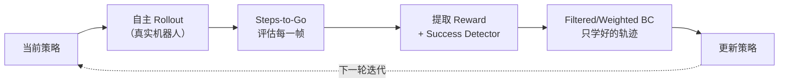
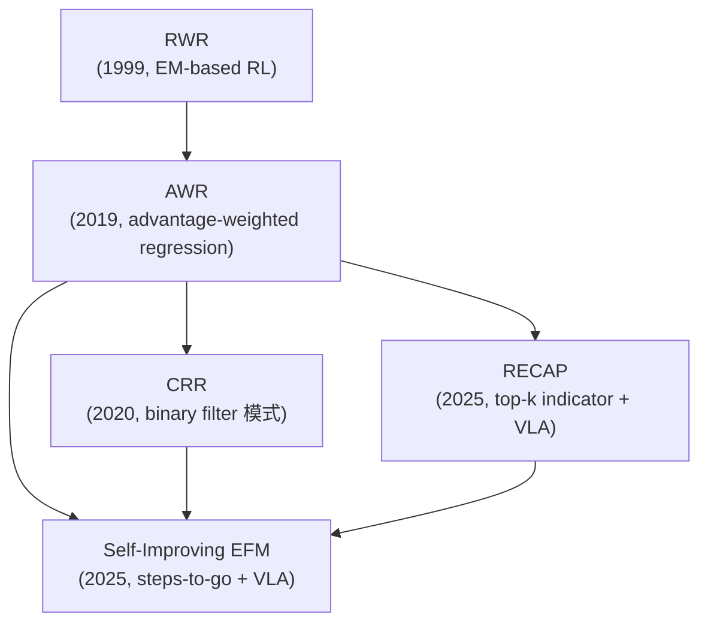

# Self-Improving EFM：自我提升具身基础模型深度精读

> **论文标题**: Self-Improving Embodied Foundation Models  
> **作者**: Google DeepMind 团队（Ayzaan Wahid 等）  
> **发表**: NeurIPS 2025, arXiv:2509.15155  

**标签**: `#VLA` `#强化学习` `#自我提升` `#离线RL` `#reward-free` `#真实机器人` `#迭代训练`

**知识链接**：
- [RECAP：从真实部署经验中 RL 学习](./016_RECAP_从真实部署经验中RL学习) — 最直接的竞品对比
- [AWR：优势加权回归](/前置知识/000u_前置知识_AWR_优势加权回归) — Self-Improvement 阶段用的加权回归理论基础
- [离线强化学习基础](/前置知识/000s_前置知识_离线强化学习基础) — filtered BC 和 advantage-weighted BC 的基本框架
- [VLA 模型的 RL 后训练综述](/论文综述/S06_VLA模型的RL后训练综述) — 方法定位

---

## 一句话概括

**不需要任何人工设计的 reward function，通过"steps-to-go 预测 → 自动提取 reward + success detector → 自主采集 → 过滤式 BC"的迭代闭环，让机器人基础模型自主练习并获取远超训练数据覆盖范围的新技能。**

---

## 一、为什么需要这篇论文

### 1.1 现有 VLA 后训练的瓶颈

当前 VLA 模型的训练范式几乎都依赖人类示教数据做监督学习（SFT）。这意味着：

1. **性能天花板 = 数据质量**：模型最多和示教者一样好，无法超越
2. **数据收集成本线性增长**：想要更好的性能就得花更多人力收集更多数据
3. **泛化受限**：模型只会做训练数据中出现过的行为，遇到新场景就失败

理想的解法是让机器人自己练习、自己发现什么有效什么无效、自己变强——即**自我提升（Self-Improvement）**。

### 1.2 自我提升的核心难点

1. **Reward 从哪来？** 传统 RL 需要 reward function，但为真实世界中的每个任务设计 reward 极其困难
2. **怎么知道成功了？** 需要一个 success detector 来判断采集到的轨迹是否达成了目标
3. **数据质量参差不齐**：自主采集的轨迹大部分是失败的，直接全部学只会学到失败行为

### 1.3 本文的解决方案：Steps-to-Go 一石三鸟

本文的核心洞察是：**训练一个"从当前状态到任务完成还需要多少步"的预测器（steps-to-go predictor），就能同时解决上面三个问题**：

- 把 steps-to-go 预测的负值作为 **shaped reward**（越接近完成，reward 越高）
- 用 steps-to-go 是否降到 0 作为 **success detector**
- 用 reward 做 advantage 估计来 **过滤/加权** 自主采集的数据

---

## 二、方法架构：两阶段框架

### 2.1 第一阶段：监督预训练（SFT）

用少量人类示教数据（50-100 条轨迹/任务）做标准 SFT，得到一个能完成部分任务的初始策略。

这一阶段**同时**训练一个 **steps-to-go predictor**：对于示教数据中的每一帧 $(s_t, g)$（状态 + 语言目标），标签是"从 $t$ 到 episode 结束还剩几步" $T - t$。这是一个纯监督回归任务，不需要任何额外标注。

### 2.2 第二阶段：自我提升循环

**每轮迭代的具体步骤：**

1. **自主采集**：用当前策略在真实机器人上跑 rollout，收集大量轨迹（大部分可能失败）
2. **Steps-to-Go 评估**：对每条轨迹的每一帧，用训好的 steps-to-go predictor 估计"离完成还有多远"
3. **Success Detection**：如果一条轨迹最后几帧的 steps-to-go 降到了接近 0，就判定为成功
4. **Reward 提取**：$r_t = -(s2g_{t+1} - s2g_t)$，即 steps-to-go 的负差分——如果这一步让"剩余步数"减少了，就是正 reward
5. **数据过滤**：只保留成功轨迹（或按 advantage 加权）做 BC 训练
6. **策略更新**：在过滤后的数据上做 SFT，更新策略和 steps-to-go predictor

### 2.3 Steps-to-Go 的数学形式

**Step 1：这个公式在做什么**

$$
\hat{s2g}(s_t, g) \approx T - t
$$

**这个公式在做什么**：这是一个回归目标——给定当前状态 $s_t$ 和语言目标 $g$，预测从现在到任务完成还需要多少步。

::: details 📐 逐符号拆解 + 数值代入（点击展开）
**逐符号拆解**：

| 符号 | 含义 | 具体是什么 |
|------|------|-----------|
| $\hat{s2g}$ | steps-to-go predictor 的输出 | 一个回归网络，输入 (状态, 目标)，输出标量 |
| $s_t$ | 当前状态 | 机器人当前的图像观测 + 关节状态 |
| $g$ | 目标 | 语言指令，如 "put the red block in the bowl" |
| $T$ | episode 总长 | 整条轨迹从开始到成功的步数 |
| $T - t$ | steps-to-go 标签 | 距离完成还剩几步，是训练时的回归目标 |

**数值代入**：假设一条成功轨迹长 $T=80$ 步：
- 第 10 帧：$s2g = 80 - 10 = 70$（刚开始，还有很远）
- 第 60 帧：$s2g = 80 - 60 = 20$（快完成了）
- 第 79 帧：$s2g = 80 - 79 = 1$（下一步就成功）

**为什么是这个形式**：直接用"剩余步数"做标签，简单且易于从成功轨迹中提取（只需要知道轨迹总长和当前帧编号）。不用 discount、不用 Bellman 递归，训练就是普通的 MSE 回归。
:::

### 2.4 从 Steps-to-Go 提取 Reward

**Step 1：这个公式在做什么**

$$
r_t = -(\hat{s2g}(s_{t+1}, g) - \hat{s2g}(s_t, g))
$$

**这个公式在做什么**：用 steps-to-go 的差分构造 reward——动作让"剩余步数"减少就给正奖励，增加就给负奖励。

::: details 📐 逐符号拆解 + 数值代入（点击展开）
**逐符号拆解**：

| 符号 | 含义 | 直觉 |
|------|------|------|
| $\hat{s2g}(s_{t+1}, g)$ | 执行动作后的 steps-to-go | "做完这一步后还剩多远" |
| $\hat{s2g}(s_t, g)$ | 执行动作前的 steps-to-go | "做这一步前还剩多远" |
| $-(\cdot)$ | 取负号 | 让"剩余步数减少"对应正 reward |
| $r_t$ | 这一步的 reward | 正 = 这一步有进展；负 = 这一步走了弯路 |

**数值代入**：
- 好动作：$s2g_t = 30$，$s2g_{t+1} = 29$ → $r_t = -(29-30) = +1$（有进展！）
- 坏动作：$s2g_t = 30$，$s2g_{t+1} = 32$ → $r_t = -(32-30) = -2$（倒退了）
- 一般动作：$s2g_t = 30$，$s2g_{t+1} = 30$ → $r_t = 0$（原地踏步）

**为什么是这个形式**：加负号是为了把"距离减少"映射为正 reward。这等价于 potential-based reward shaping（$r = \Phi(s_t) - \Phi(s_{t+1})$ 其中 $\Phi = -s2g$），理论上保证不改变最优策略。
:::

### 2.5 Success Detection

判断一条轨迹是否成功：

$$
\text{success} = \mathbb{1}[\hat{s2g}(s_T, g) < \tau]
$$

**这个公式在做什么**：用 steps-to-go predictor 自动判断一条轨迹是否成功——如果最后一帧的预测"剩余步数"足够小（低于阈值），就判定为成功。

::: details 📐 逐符号拆解 + 数值代入（点击展开）
**逐符号拆解**：

| 符号 | 含义 | 具体是什么 |
|------|------|-----------|
| $\mathbb{1}[\cdot]$ | 指示函数 | 条件成立返回 1（成功），否则返回 0（失败） |
| $s_T$ | 轨迹最后一帧的状态 | episode 结束时机器人的观测 |
| $g$ | 目标 | 语言指令 |
| $\hat{s2g}(s_T, g)$ | 最后一帧的 steps-to-go 预测 | predictor 认为"还需要多少步才能完成" |
| $\tau$ | 成功阈值 | 超参数，典型值如 3-5 步 |

**数值代入**：假设 $\tau = 3$：
- 轨迹 A 最后帧：$\hat{s2g}(s_T, g) = 1.2 < 3$ → $\text{success} = 1$（predictor 认为几乎完成了）
- 轨迹 B 最后帧：$\hat{s2g}(s_T, g) = 15.7 > 3$ → $\text{success} = 0$（还差很远，判定失败）

**为什么是这个形式**：用 predictor 代替人工标注或环境信号来判断成功，实现完全自主的数据过滤。阈值 $\tau$ 越小越严格（只保留高置信度成功轨迹），越大越宽松（召回更多但可能引入噪声）。
:::

---

## 三、和 RECAP 的详细对比

Self-Improving EFM 和 [RECAP](./016_RECAP_从真实部署经验中RL学习) 是解决同一个问题（VLA 自我提升）的两种方案。核心区别在于 **return/reward 的构造方式** 和 **数据利用策略**：

| 维度 | RECAP (π*0.6) | Self-Improving EFM (Google) |
|------|-------------|---------------------------|
| Return 构造 | 用 episode length + 成功标签做"剩余步数归一化" | 训练 steps-to-go predictor，差分得 reward |
| 成功判断 | 依赖环境提供的 success 标签 | 用 steps-to-go predictor 自动检测（不需要外部标签） |
| Value Model | 独立训练 distributional value network | Steps-to-go predictor 本身就兼任 value function |
| 数据过滤 | Top-k advantage 二值化 indicator | 按成功/失败过滤 + reward-weighted BC |
| 自主度 | 需要环境返回 success/fail 标签 | **完全自主**，不需要任何外部判断 |
| 迭代机制 | 六阶段固定流程 | 两阶段循环（采集→过滤训练） |
| Base Model | π0（3B flow-based VLA） | RT-2 / Octo 系（Google 内部模型） |
| 验证规模 | 7 类真机任务 | 多类真机任务 + 自主习得新技能验证 |

**最关键的区别**：RECAP 需要环境告诉它"这条轨迹成功了还是失败了"（因为它用 $\mathbb{1}[\text{fail}]$ 来加失败惩罚）。Self-Improving EFM 完全不需要——它用 steps-to-go predictor 自己判断成功与否。这使得 Self-Improving EFM 理论上可以在完全没有人类监督的情况下持续自我提升。

---

## 四、核心实验结果

### 4.1 SFT + Self-Improvement vs 纯 SFT 数据扩展

论文最重要的发现：**相同的数据预算下，SFT + Self-Improvement 远比单纯增加 SFT 数据更高效**。

例如：用 50 条示教 + 3 轮自我提升的效果，超过了 200 条纯示教的 SFT 效果。这说明自主练习产生的数据虽然质量参差不齐，但经过 steps-to-go 过滤后，对策略提升的贡献远大于等量的人类示教。

### 4.2 自主习得新技能

最令人印象深刻的结果：**机器人通过自我提升获得了训练数据中从未出现过的新技能**。

这在纯 SFT 和纯离线 RL 方法中是不可能的——它们的性能天花板就是数据中最好的行为。Self-Improvement 之所以能突破这个天花板，是因为自主 rollout 过程中会偶然探索到新的成功路径，而 steps-to-go success detector 能识别出这些路径，filtered BC 则把它们纳入训练。

### 4.3 消融实验核心发现

1. **Web-scale pretraining + Self-Improvement 是关键组合**：只有大规模预训练的 foundation model 才能在自主 rollout 中有足够高的成功概率启动正反馈循环
2. **Steps-to-go 比 binary success label 好**：steps-to-go 提供的是 shaped reward（每一步都有信号），远比"整条轨迹成功/失败"信息量大
3. **过滤比不过滤关键**：直接对所有自主数据做 BC（包括失败的）反而会让性能下降

---

## 五、方法优势与局限

### 5.1 优势

1. **完全 reward-free**：不需要为每个任务设计 reward function
2. **自主 success detection**：不需要外部 oracle 告诉机器人是否成功
3. **能获取全新技能**：突破了 SFT 数据覆盖范围的限制
4. **采样效率高**：少量示教 + 自主练习 > 大量示教

### 5.2 局限

1. **冷启动问题**：如果初始策略太差（自主 rollout 成功率接近 0），正反馈循环无法启动——steps-to-go predictor 没有成功数据可以学习
2. **Steps-to-go predictor 的泛化**：如果任务的最优路径和示教中的路径差异太大，predictor 可能无法正确估计 steps-to-go
3. **需要大量真机 rollout 时间**：虽然不需要人类参与，但机器人物理执行仍然很慢

---

## 六、在离线 RL 方法谱系中的位置

Self-Improving EFM 处于以下方法的交叉点：

它的独特贡献是把 **steps-to-go prediction**（一个纯监督学习的子任务）作为获取 reward/value/success signal 的统一接口，避免了传统 RL 中需要独立训练 critic 或设计 reward 的额外开销。

---

## 七、总结与对比表

| 维度 | 要点 |
|------|------|
| 核心创新 | Steps-to-go predictor 统一提供 reward、value、success detection |
| 训练范式 | 两阶段：SFT（含 s2g 训练）→ 自我提升循环（采集→过滤→训练） |
| Reward 来源 | Steps-to-go 的差分（完全无需 reward engineering） |
| 数据利用 | Filtered BC：只学习成功轨迹 + reward-weighted 加权 |
| 对比 RECAP | 更自主（不需要 success label），但可能冷启动更难 |
| 实验验证 | 真机多任务 + 自主习得新技能（数据中没出现过） |
| 适用场景 | Base model 足够强（初始成功率 > ~20%）的真机持续学习 |

---

## 延伸阅读

- [RECAP 精读](./016_RECAP_从真实部署经验中RL学习) ← 最直接的对比方法
- [AWR：优势加权回归](/前置知识/000u_前置知识_AWR_优势加权回归) ← Self-Improvement 阶段的理论基础
- [离线强化学习基础](/前置知识/000s_前置知识_离线强化学习基础) ← Filtered BC 的理论定位
- [RLPD：高效在线 RL 利用离线数据](./075_RLPD_高效在线RL利用离线数据) ← Offline→Online 的另一条路线
- [VLA 模型的 RL 后训练综述](/论文综述/S06_VLA模型的RL后训练综述) ← 完整方法对比
