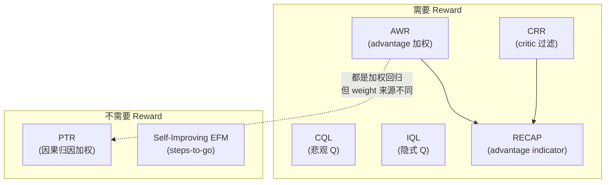

# PTR：后验转移重加权的离线机器人策略学习深度精读

> **论文标题**: Conservative Offline Robot Policy Learning via Posterior-Transition Reweighting  
> **作者**: Wanpeng Zhang 等  
> **发表**: arXiv:2603.16542, 2025 年 3 月  

**标签**: `#离线RL` `#VLA` `#reward-free` `#重加权` `#保守策略` `#后训练` `#FlowMatching`

**知识链接**：
- [RECAP：从真实部署经验中 RL 学习](./016_RECAP_从真实部署经验中RL学习) — 同为 reward-free 离线后训练，但用 advantage indicator 而非 posterior score
- [AWR：优势加权回归](/前置知识/000u_前置知识_AWR_优势加权回归) — PTR 也是加权回归范式，但 weight 来源完全不同
- [离线强化学习基础](/前置知识/000s_前置知识_离线强化学习基础) — 离线 RL 的基本问题定义
- [ARFM：自适应离线 RL 后训练 Flow VLA](./027_ARFM_自适应离线RL后训练Flow_VLA) — 另一种离线 RL + Flow VLA 后训练

---

## 一句话概括

**不需要 reward function、不需要 success label，纯粹通过"观察一个动作之后发生了什么"来判断这个动作值不值得学——如果 transition scorer 能把"这个动作导致的后果"从一堆随机后果中辨认出来，说明这个动作的因果效应强，就应该被放大学习；反之就降权。**

---

## 一、问题定义

### 1.1 Uniform SFT 的问题

标准的 VLA 后训练（SFT）对所有数据样本一视同仁——每条轨迹、每个动作都用相同的 loss 权重训练策略。问题是：

- **异质数据**：实际采集的数据来自多个人、多种策略、多种成功程度，质量参差不齐
- **冲突样本**：同一个状态下可能有多个不同动作的样本（有的好有的差），uniform 训练会让策略学到"平均"行为——往往两边不靠
- **低归因样本**：有些动作的结果几乎是随机的（不管做什么后果都差不多），这些样本对策略没有信息量但消耗了训练资源

### 1.2 为什么不直接用 RECAP/CRR 那套？

RECAP 和 CRR 需要一个 **显式的 reward/success 信号** 来计算 advantage。但很多真实场景：
- 没有稀疏 reward（环境不告诉你成功了没有）
- 没有成功判据（比如"整理桌面"到底什么算完成？）
- 有的数据是完全无标签的自主采集数据

PTR 的目标是：**在完全没有 reward/success label 的情况下，仅从"动作→后果"的因果关系中提取有用信号**。

---

## 二、核心方法

### 2.1 核心直觉

考虑一个具体场景：机器人在桌面上执行了动作 $a$，之后到达了状态 $s'$。

**好动作的特征**：$a$ 和 $s'$ 之间有**强因果关系**——换一个动作就会到达完全不同的 $s'$。这意味着：如果你把 $s'$ 的某些 latent encoding 混进一堆"其他随机状态编码"中，一个好的 transition model 应该能**轻松辨认出哪个是真正的后继状态**。

**差动作/无效动作的特征**：$a$ 和 $s'$ 之间因果关系弱——不管做什么动作后果都差不多。这时候 transition model 无法辨认真正的后继状态，因为所有候选看起来都差不多。

### 2.2 PTR Score 的定义

**Step 1：这个公式在做什么**

$$
\text{PTR}(s, a, s') = \frac{p_\phi(s' \mid s, a)}{\frac{1}{K}\sum_{k=1}^{K} p_\phi(s'_k \mid s, a)}
$$

这个公式计算的是"transition scorer 把真正的后继状态 $s'$ 从 $K$ 个候选中辨认出来的置信度"。如果辨认得很确定，PTR score 高（这个 transition 信息量大，动作值得学）；如果辨认不出来，PTR score 低。

> **一句话直觉**：PTR score 衡量的是"这个动作导致的结果有多'特别'"。结果越特别（和随机选一个状态差异越大），说明这个动作的因果效应越强、越值得学。

**逐符号拆解**：

| 符号 | 含义 | 具体是什么 | 典型值 |
|------|------|-----------|--------|
| $s$ | 当前状态 | 机器人当前观测（图像 + proprioception） | 高维 |
| $a$ | 执行的动作 | 关节命令 / end-effector delta | 连续向量 |
| $s'$ | 真正的后继状态 | 执行 $a$ 后环境实际到达的下一帧 | 高维 |
| $s'_k$ | 第 $k$ 个"干扰"候选 | 从同一 batch 的其他样本中随机抽取的后继状态 | 高维 |
| $K$ | 候选池大小 | 包含 1 个真正目标 + $K-1$ 个干扰 | 典型 16-64 |
| $p_\phi$ | transition scorer | 一个训练好的网络，预测"给定 $(s, a)$ 到达 $s'$ 的可能性" | softmax 概率 |

**代入数字**：假设 $K=16$，transition scorer 对真正的 $s'$ 给了概率 0.4，对其他 15 个候选平均给了 $(1-0.4)/15 = 0.04$：
- 分子：$p_\phi(s' \mid s, a) = 0.4$
- 分母（uniform 基线）：$1/16 = 0.0625$
- PTR score = $0.4 / 0.0625 = 6.4$（远大于 1，说明这个 transition 非常"可辨认"）

对比：如果 scorer 对 $s'$ 只给了 $1/16 = 0.0625$（和随机猜一样）：
- PTR score = $0.0625 / 0.0625 = 1.0$（无信息量，不确定这个动作有什么效果）

### 2.3 加权训练

拿到 PTR score 之后，做 **clipped-and-mixed weighted regression**：

$$
L_{\text{PTR}} = \frac{1}{N}\sum_{i=1}^{N} w_i \cdot L_{\text{action}}(s_i, a_i)
$$

其中权重 $w_i$ 是 PTR score 经过 clip 和归一化后的结果，$L_{\text{action}}$ 是原始的动作预测 loss（MSE for flow matching，或交叉熵 for 离散 token）。

**关键设计**：
- **Clip**：PTR score 上限 clip 防止极端 outlier 主导训练
- **Mixed**：保留一个最低权重 $w_{\min}$（不完全丢弃低 PTR score 的样本），保持训练稳定
- **Self-normalized**：权重归一化让有效 batch size 可控

---

## 三、和 RECAP 的详细对比

| 维度 | RECAP | PTR |
|------|-------|-----|
| 需要的外部信号 | Episode 长度 + 成功/失败标签 | **完全不需要**（纯从 transition 结构推导） |
| Weight 含义 | "这一步比平均好多少"（advantage） | "这一步的因果效应有多强"（归因强度） |
| 可能给高权重的情况 | 接近成功的步骤 | 因果效应明确的步骤（不一定接近成功） |
| Value Model | 需要独立训练 distributional value network | 不需要 value model，只需要 transition scorer |
| 适配的动作头 | 通用 | **明确兼容 diffusion 和 flow-matching**（不需要 log-prob） |
| 数据假设 | 需要完整 episode（有终止） | 可以处理**碎片化数据**（片段、无终止标记） |
| 保守性 | 乐观（只学最好的） | **保守**（通过 clip+mix 不完全丢弃任何数据） |

**PTR 最大的优势**：能处理 RECAP 无法处理的数据——比如 DAgger 采集的碎片化纠正片段（没有完整 episode、没有 success 标签）。

---

## 四、实验结果

PTR 在以下场景中验证了有效性：

1. **异质数据混合**：当训练数据来自多个不同水平的操作者时，PTR 能自动降权低质量操作者的样本，性能优于 uniform SFT
2. **兼容 diffusion 和 flow-matching 动作头**：不依赖 log-prob，因此可以直接用于当前主流的 VLA 架构
3. **和 reward-based 方法可比**：在有 reward label 可用的场景下，PTR（不用 reward）的表现接近使用 reward 信息的方法

### 局限

- 论文验证规模相对较小（和 RECAP 的大规模真机实验相比）
- Transition scorer 本身需要训练，增加了 pipeline 复杂度
- 在因果效应天然弱的任务上（如长等待任务），PTR score 可能全都接近 1，退化为 uniform

---

## 五、在离线 RL 方法谱系中的位置

PTR 和 Self-Improving EFM 都属于 **reward-free** 阵营，但思路完全不同：
- Self-Improving EFM 通过 steps-to-go 构造了一个**隐式 reward**，然后走标准的 filtered BC
- PTR 完全不构造 reward，而是从**因果归因强度**出发做加权

---

## 六、总结

| 维度 | 要点 |
|------|------|
| 核心创新 | 用 posterior identification 思路衡量 transition 的信息量/因果强度 |
| 不需要 | Reward function、success label、完整 episode |
| 兼容 | Diffusion / Flow Matching / 离散 token 动作头 |
| 权重含义 | "这个动作的后果有多'可辨认'" = 因果效应强度 |
| 对比 RECAP | 更自主（不需要任何外部标签），但信号可能更弱（因果 ≠ 好坏） |
| 适用场景 | 异质数据、碎片化数据、完全无标签的离线后训练 |

---

## 延伸阅读

- [RECAP 精读](./016_RECAP_从真实部署经验中RL学习) ← 需要 success label 但信号更强的对比方法
- [ARFM 精读](./027_ARFM_自适应离线RL后训练Flow_VLA) ← 另一种离线 RL + Flow VLA 方法
- [Self-Improving EFM 精读](./095_SelfImproving_EFM_自我提升具身基础模型) ← 同为 reward-free 但用 steps-to-go 的方法
- [AWR：优势加权回归](/前置知识/000u_前置知识_AWR_优势加权回归) ← 加权回归的理论基础
- [离线强化学习基础](/前置知识/000s_前置知识_离线强化学习基础) ← 离线 RL 总览
