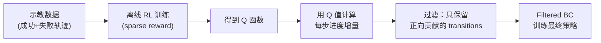

# GR-RL：灵巧精确的长 Horizon 机器人操作深度精读

> **论文标题**: Going Dexterous and Precise for Long-Horizon Robotic Manipulation  
> **作者**: Anonymous  
> **发表**: arXiv:2512.01801, 2024  

**标签**: `#强化学习` `#VLA` `#长horizon` `#离线RL` `#Q值进度函数` `#轨迹过滤` `#灵巧操作`

**知识链接**：
- [RECAP：从真实部署经验中 RL 学习](./016_RECAP_从真实部署经验中RL学习) — 同样用"内部构造的 return/Q 值"做数据过滤
- [CRR：Critic 正则化回归](./098_CRR_Critic正则化回归离线RL) — 过滤式 BC 的理论基础
- [离线强化学习基础](/前置知识/000s_前置知识_离线强化学习基础) — 离线 RL 基本框架
- [ARM：优势奖励建模](./097_ARM_优势奖励建模长horizon操作) — 同为 long-horizon 的 advantage/progress 建模方法
- [Q 函数与 Value 函数](/前置知识/000o_前置知识_Q函数与Value函数) — Q 值基础

---

## 一句话概括

**先用 sparse reward（只在最终成功时 +1）做标准离线 RL 训练一个 Q 函数，然后把学出来的 Q 值直接当作"任务进度函数"——Q 值越高说明这一步越接近成功。用这个进度函数过滤轨迹：只保留对进度有正向贡献的 transitions，再用过滤后的数据训练策略。**

---

## 一、核心洞察

### 1.1 Q 值天然就是进度指标

这篇论文的关键洞察极其简洁：

**在 sparse reward（只有终点 +1）设定下，经过离线 RL 训练的 Q 函数 $Q(s, a)$ 本身就是一个 robust 的"任务进度函数"**：
- $Q$ 高 = 从当前状态出发执行这个动作，最终成功的概率（折扣后）高 = 接近任务完成
- $Q$ 低 = 距离成功还很远，或者这个动作方向不对

这意味着不需要像 RECAP 那样人工设计 return（用 episode length 构造），也不需要像 ARM 那样专门训一个 advantage model——**标准离线 RL 的 Q 函数本身就够了**。

### 1.2 和 RECAP 的核心区别

| 维度 | RECAP | GR-RL |
|------|-------|-------|
| 进度信号来源 | 手工构造：$-(L-i-1)/L_{\max}$ | 直接用离线 RL 学出的 Q 值 |
| 需要成功标签？ | 是（用于加 fail penalty） | 是（sparse reward = 成功时 +1） |
| 信号精度 | 受 episode length 分辨率限制 | Q 函数可以学到更精细的状态-动作价值区分 |
| 额外训练 | 需要独立训 distributional value model | Q 函数训练就是标准离线 RL |
| 迭代？ | 多轮迭代 | 单轮（Q 训练 → 过滤 → BC） |

---

## 二、方法流程

### 2.1 两阶段 Pipeline

### 2.2 阶段 1：离线 Q 函数训练

用标准的离线 RL 算法（如 IQL 或 CQL）在收集的示教数据上训练 Q 函数。Reward 设定极其简单：

$$
r_t = \begin{cases} 1 & \text{if episode succeeds at step } t \\ 0 & \text{otherwise} \end{cases}
$$

**为什么 sparse reward 够用**：论文的核心论点是——虽然 sparse reward 下训 Q 函数对策略梯度几乎没用（信号太稀疏），但**Q 函数本身作为一个打分器是足够准确的**。它不需要在所有 $(s,a)$ 上都准确，只需要能区分"好 transition"和"差 transition"的**相对排序**——这比精确的绝对 Q 值要求低得多。

### 2.3 阶段 2：Q 值做进度函数 + 过滤

**Step 1：计算每步进度增量**

$$
\Delta_t = Q(s_{t+1}, a_{t+1}) - Q(s_t, a_t)
$$

> **一句话直觉**：如果执行了动作 $a_t$ 后，下一步的 Q 值比这一步高了，说明这一步让任务往前推进了；如果降低了，说明这一步走错了方向。

**Step 2：过滤准则**

$$
\text{keep}(s_t, a_t) = \mathbb{1}[\Delta_t > 0]
$$

只保留 $\Delta_t > 0$ 的 transitions（对进度有正向贡献的动作）。

**代入数字**：

某条长 horizon 轨迹（折叠衣服，共 200 步）：
- $t=50$：$Q(s_{50}, a_{50}) = 0.12$，$Q(s_{51}, a_{51}) = 0.15$ → $\Delta = +0.03$ → 保留（正在靠近成功）
- $t=80$：$Q(s_{80}, a_{80}) = 0.35$，$Q(s_{81}, a_{81}) = 0.31$ → $\Delta = -0.04$ → 丢弃（这步走错了）
- $t=190$：$Q(s_{190}, a_{190}) = 0.85$，$Q(s_{191}, a_{191}) = 0.92$ → $\Delta = +0.07$ → 保留（快完成了）

### 2.4 阶段 3：Filtered BC

在过滤后的数据集上做标准 BC 训练策略——只学那些"让任务进度前进"的动作。

---

## 三、为什么这样做有效

### 3.1 为什么 Q 值比 episode length 更好

RECAP 用 $-(L-i-1)/L_{\max}$ 作为 return。这个设计有两个问题：

1. **线性假设**：假设任务进度和步数呈线性关系。但真实任务往往不是——可能前 100 步都在"准备"（进度缓慢），最后 20 步才是关键动作（进度飞速）
2. **无法区分同一步不同动作**：return 只取决于位置 $i$，同一帧不管做什么动作 return 都一样

GR-RL 的 Q 函数没有这两个问题：
- Q 值是通过 Bellman 方程从数据中学出来的，自动反映任务的非线性进度结构
- Q 值是 $(s, a)$ 的函数，同一状态下不同动作可以有不同的 Q 值

### 3.2 为什么进度增量比绝对 Q 值更鲁棒

直接用 $Q(s, a)$ 做过滤（如 $Q > \text{threshold}$）有问题：Q 函数在离线训练下的绝对数值不一定准确（可能系统性高估或低估）。但**相邻两步的差分 $\Delta_t$** 是相对量——即使 Q 函数整体有偏移，差分的正负号仍然正确。这和 RECAP 用 "return 差分近似 reward" 是同一个数学原理。

---

## 四、实验结果

### 4.1 VLA + 灵巧操作任务

GR-RL 在多个 long-horizon 灵巧操作任务上验证了有效性。论文报告的核心发现：

1. **Q 值做进度函数 > 手工设计的 reward shaping**：说明 Q 函数确实学到了任务的内在结构
2. **过滤后 BC > 不过滤的 BC**：大幅度提升（典型 2-3x 成功率）
3. **单轮就足够有效**：不需要 RECAP 那样的多轮迭代

### 4.2 和 RECAP 的定位差异

GR-RL 的实验场景偏"仿真中的灵巧操作"（需要精确的手指协调），而 RECAP 偏"真机上的 VLA 整体策略提升"。两者互补：
- **简单 pipeline + 强假设**：GR-RL（需要标准离线 RL 训练能训出合理的 Q 函数）
- **复杂 pipeline + 弱假设**：RECAP（Q 函数不需要精确，用 distributional value + 多轮迭代来补偿）

---

## 五、局限性

1. **依赖 Q 函数质量**：如果离线 RL 训不出合理的 Q 函数（数据太少、状态空间太大），整个方法失效
2. **仍需要成功标签**：sparse reward 需要知道哪些 episode 成功了
3. **无迭代机制**：单轮过滤可能不够——被错误过滤掉的好样本无法通过后续迭代"救回来"
4. **过滤可能太激进**：long-horizon 中 Q 值噪声大，$\Delta_t$ 可能频繁正负交替，导致保留的数据碎片化

---

## 六、在方法谱系中的位置

| 方法 | 进度信号来源 | 过滤方式 | 迭代 | 适用 horizon |
|------|------------|---------|------|------------|
| FBC | 轨迹总 return 排名 | 整条轨迹过滤 | ❌ | 短 |
| CRR | TD 学出的 advantage | per-step binary/exponential | ❌ | 中 |
| RECAP | 手工构造 return + distributional value | per-task top-k | ✅ | 中 |
| ARM | 训练 advantage model | sigmoid 加权 | ❌ | 长 |
| **GR-RL** | **离线 RL 的 Q 值差分** | **per-step binary** | **❌** | **长** |

GR-RL 可以看作 **"CRR 的简化版 + long-horizon 适配"**：用 Q 值差分替代标准 advantage（避免需要独立训 V 函数），然后做 binary filter。

---

## 七、总结

| 维度 | 要点 |
|------|------|
| 核心创新 | 离线 RL 的 Q 值 → 进度函数 → 正向增量过滤 → filtered BC |
| 训练信号 | Sparse reward（只需成功标签） |
| 关键洞察 | Q 函数不需要绝对精确，只需相对排序正确；差分比绝对值更鲁棒 |
| Pipeline | 两阶段：离线 Q 训练 → Q 差分过滤 BC |
| 对比 RECAP | 不需要手工构造 return，但需要 Q 函数训练质量靠谱 |
| 适用场景 | 有大量 long-horizon 演示数据 + 成功标签 |

---

## 延伸阅读

- [RECAP 精读](./016_RECAP_从真实部署经验中RL学习) ← 多轮迭代 + 手工构造 return 的对比方法
- [CRR 精读](./098_CRR_Critic正则化回归离线RL) ← 过滤式 BC 的理论基础
- [ARM 精读](./097_ARM_优势奖励建模长horizon操作) ← 同为 long-horizon 的 advantage 建模方法
- [离线强化学习基础](/前置知识/000s_前置知识_离线强化学习基础) ← 离线 RL 全景
- [CO-RFT：离线分块 RL 微调 VLA](./021_CO_RFT_离线分块RL微调VLA) ← 离线 AWR + chunk-level 的 VLA 方法
- [RLPD：高效在线 RL 利用离线数据](./075_RLPD_高效在线RL利用离线数据) ← Q 函数在 offline-to-online 中的使用
