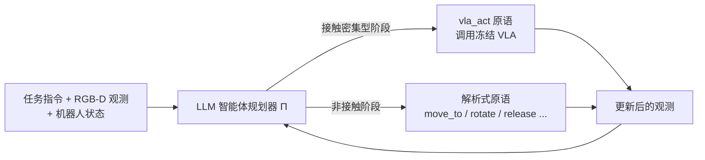
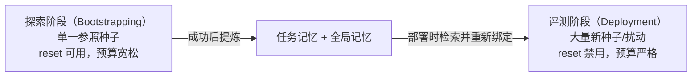
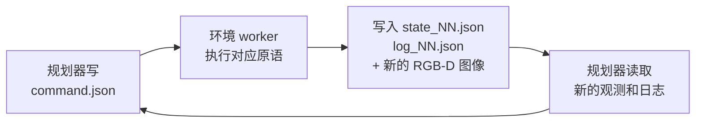

# Harness VLA：用记忆引导的智能体把冻结 VLA 变成可靠的接触原语

> **论文标题**: Harness VLA: Steering Frozen VLAs into Reliable Manipulation Primitives via Memory-Guided Agents
> **作者**: Yixian Zhang, Huanming Zhang, et al.
> **机构**: 清华大学、Striding AI、Purdue University、中科院自动化所、无问芯穹（Infinigence AI）、中关村学院、香港科技大学
> **发表**: arXiv:2607.08448, 2026
> **项目页**: https://harnessvla.github.io/
> **代码**: https://github.com/RLinf/RPent（作为开源框架 RPent 的第一个应用发布）

**标签**: `#VLA` `#LLM_Agent` `#分层控制` `#记忆机制` `#Code_as_Policies` `#LIBERO_Pro` `#RoboCasa365` `#RoboTwin`

**知识链接**：
- [LLM 智能体的执行循环与记忆机制](/前置知识/004a_前置知识_LLM智能体的执行循环与记忆机制) — 本文大量复用的"感知-决策-执行循环 + 任务记忆/全局记忆"框架，建议先读这篇
- [策略梯度与 PPO](/前置知识/000a_前置知识_策略梯度与PPO) — Harness VLA 里作为 `vla_act` 原语后端的 π0.5 本身是用 RL 微调得到的
- [Flow Matching 与连续归一化流](/前置知识/000g_前置知识_Flow_Matching与连续归一化流) — `vla_act` 后端模型（RLinf/π0.5、RLDX-1、LingBot-VLA）都用 Flow Matching 生成连续动作
- [雅可比矩阵与微分运动学](/前置知识/003b_前置知识_雅可比矩阵与微分运动学) — `move_to` 等解析原语背后的运动学求解器
- [视觉-语言-动作模型 VLA 综述](/论文综述/S03_视觉语言动作模型VLA综述) — 理解"什么是 VLA、它的优势和局限"的全景图
- [VLA 模型的 RL 后训练综述](/论文综述/S06_VLA模型的RL后训练综述) — 对比：用 RL 直接改 VLA 权重的一整条路线
- [BootRL：冻结 VLA 加轻量 RL Head](/论文综述/013_BootRL_冻结VLA加RL_Head) — 对比：另一种"不改 VLA 权重"的增强方案
- [Object-Centric Residual RL](/论文综述/023_ObjectCentric_ResidualRL_零迁移VLA) — 对比：用小型 RL 网络在动作空间做残差修正

---

## 贯穿全文的例子

> **场景**：桌面机械臂任务"把牛奶盒放进篮子里"（LIBERO-Pro 的 Object 任务）。第一次遇到这个任务时，桌上的牛奶盒在左边、篮子在右边；后来场景被"扰动"了——牛奶盒和篮子的位置被交换，或者指令被改成了"把番茄酱放进篮子"。
>
> 一个端到端训练好的 VLA（视觉-语言-动作模型，Vision-Language-Action Model——一种直接把摄像头图像和语言指令映射为机器人动作的大模型）在原始布局下能顺利完成任务，但当布局或指令被扰动后，它往往会**对着记忆里"标准位置"伸手**，而不是根据新的场景重新判断该往哪伸手。Harness VLA 要解决的就是这个问题：**不改动 VLA 的一个参数**，只靠外部的智能体编排，让它在场景变化后依然能完成任务。

---

## 一、背景：VLA 的强项和硬伤

### 1.1 VLA 已经足够擅长"手上的活"

如果你读过 [VLA 综述](/论文综述/S03_视觉语言动作模型VLA综述)，会知道 VLA 这几年在"看图像 + 听指令 + 直接生成动作"这条链路上进步很快——像 π0、π0.5 这样的模型，靠在大规模机器人轨迹上预训练，已经能相当熟练地完成抓取不规则物体、把东西放进狭窄空间、拧动一个旋钮之类的**接触密集型**（contact-rich，指机械臂末端需要和物体持续物理接触、对力和位置精度要求高的操作，比如抓取、插入、拧螺丝）任务。这些任务恰恰是传统的解析式控制器（靠数学公式硬算轨迹，不依赖学习）最难处理的——你很难用一个公式描述"怎么用力刚好夹住一个形状不规则的番茄酱瓶子"。

### 1.2 但 VLA 在"训练分布之外"很脆弱

问题出现在**部署扰动**（deployment perturbation，指测试时遇到的场景和训练时的场景系统性不同，比如物体换了位置、指令换了说法）上。论文把常见的扰动扰动归纳成四类：

| 扰动类型 | 具体含义 | 举例 |
|---------|---------|------|
| 语义重定向（semantic retargeting） | 指令里的目标对象变了 | 训练时是"拿黄油"，测试时是"拿番茄酱" |
| 目标重新绑定（goal re-binding） | 完成条件变了，但场景看起来差不多 | 训练时"放到左边盘子"，测试时"放到右边盘子" |
| 空间布局变化（spatial-layout shift） | 物体的初始位置被打乱 | 牛奶盒和篮子的位置被交换 |
| 局部接触不稳定（unstable local contact） | 单次抓取/放置失败，没有重试机制 | 夹爪没夹稳，物体滑落 |

一个端到端 VLA 在这些扰动下经常表现出一种典型失败模式：**它仍然执行"标准情况下学到的动作"，而不是根据当前真实观测重新判断**。论文的实验里给出了直观例子——指令让它去拿一个新的目标物体，但视觉场景看起来和训练时相似，模型就照搬了训练时的动作轨迹，伸向了原来那个物体的位置。这不是 VLA "不聪明"，而是**单一策略网络被同时要求做三件事：理解语言语义、处理长程任务组合、执行精细接触控制**——三件事绑在一起训练，任何一件事出问题都会拖累整体。

### 1.3 另一条路：LLM 智能体编程式控制

与端到端 VLA 相对的另一条路是 **LLM 智能体 + 显式控制 API**（如 Code as Policies、ProgPrompt 等工作）：让大语言模型（LLM）写代码/生成结构化指令去调用一组预先写好的感知和运动控制函数。如果你对"LLM 智能体怎么一步步执行一个多步任务、怎么积累和复用经验"还不熟悉，建议先读 [LLM 智能体的执行循环与记忆机制](/前置知识/004a_前置知识_LLM智能体的执行循环与记忆机制)——本文接下来的很多设计都是这套通用机制在机器人操作场景下的具体实现。

这条路的语言理解和任务组合能力很强（LLM 天生擅长这两件事），但**纯解析式的控制原语很难处理接触密集型操作**——不规则抓取、受限空间放置、带铰链的物体交互，这些恰恰是端到端 VLA 的强项。而且如果为了应付新任务不断扩充"技能库"，智能体就要不断判断"这个新写的技能靠不靠谱、会不会和旧场景冲突"，工程复杂度会越滚越大。

### 1.4 Harness VLA 的立场：两条路各取所长，谁的活谁干

Harness VLA 的核心设计哲学一句话概括：**语义理解、空间重新绑定、长程任务组合交给 LLM 智能体；局部接触密集型操作，原封不动地交给冻结的 VLA。**



**智能体规划器 $\Pi$ 从不直接输出底层动作（关节角度、力矩）**，它只做一件事：在每一轮观察当前场景后，从一个固定的、预先定义好的"原语库"里选一个原语调用。原语库里既有解析式的运动控制原语（比如"把末端移动到某个笛卡尔坐标"），也有唯一一个"学习型"原语 `vla_act`——调用冻结的 VLA 执行一小段接触密集型动作。**智能体从不新增原语，也从不修改 VLA 的权重**——它学习的只是"什么时候该用哪个原语、怎么用"。

---

## 二、原语库：智能体唯一能碰的接口

### 2.1 为什么原语库要"固定且小"

如果给智能体一个可以无限扩展的技能库（每次遇到新场景就允许它自己写一个新技能），系统会面临两个问题：新技能要花时间验证靠不靠谱，还要判断它会不会和旧场景冲突，整个系统的可预测性和可审计性都会下降。Harness VLA 反其道而行——**原语库从一开始就固定死**，智能体唯一能学习的是"怎么组合、怎么调用时机、怎么在失败后重试"这几件事,而不是"发明新的操作方式"。

### 2.2 六个解析式原语 + 一个 VLA 原语

论文给出的共享原语表（不同 benchmark 会视机器人形态增减，如移动底座场景多两个原语）：

| 原语 | 类型 | 作用 |
|------|------|------|
| `move_to` | 解析式（复合） | 用环境内置的运动学求解器，把末端移动到一个笛卡尔坐标目标 |
| `move_pose` | 解析式（复合） | 移动的同时协调调整姿态（如俯仰角），用于伸展受限的构型 |
| `rotate_wrist` | 解析式（原子） | 保持空间位置不变，只调整手腕的偏航角 |
| `rotate_pitch` | 解析式（原子） | 保持空间位置不变，只调整手腕的俯仰角 |
| `set_gripper` | 解析式（原子） | 把夹爪驱动到开/合的设定状态 |
| `release` | 解析式（原子） | 在满足"释放"后置条件下打开夹爪 |
| `vla_act` | **VLA 原语** | 调用冻结的 VLA，短促执行一段接触密集型交互 |

RoboCasa365（厨房家务基准）因为需要移动底座去到更大范围的场景，额外加了两个原语：`navigate_to`（把底座开到某个平面坐标）和 `move_base`（局部速度微调）。RoboTwin（双臂基准）没有新增原语，而是给每个原语加一个 `arm` 参数（左臂/右臂/双臂），用同一套原语覆盖双臂协作。

**解析式原语背后的数学**：`move_to` 这类复合原语内部依赖的正是 [雅可比矩阵与微分运动学](/前置知识/003b_前置知识_雅可比矩阵与微分运动学) 里讲的逆运动学求解——给定笛卡尔空间目标，反解出关节角度指令。这部分完全是传统机器人学的确定性算法，不涉及任何学习。

### 2.3 `vla_act`：把整个 VLA 压缩成一个函数调用

`vla_act` 的调用形式大致是：

```json
{"action": "vla_act", "prompt": "grasp the black bowl", "max_chunks": 30, "stop": "object_lifted"}
```

**这个调用在做什么**：智能体给冻结的 VLA 一句具体的自然语言子指令（不一定是完整任务描述，可以是当前这一步具体要做什么），VLA 就在当前摄像头画面下自主生成一串动作 chunk（时间上连续的一段动作序列）并执行，直到满足停止条件（`stop`，比如"物体已被举起"）或者用完了分配的动作 chunk 预算（`max_chunks`）。

这里的关键设计是：**`vla_act` 不是"让 VLA 跑完整个任务"，而是"让 VLA 只负责当前这一个局部的接触阶段"**。智能体规划器负责在合适的时机调用它、给它合适的提示词、判断它有没有成功、失败了要不要重新摆位再调用一次。VLA 的角色从"端到端控制器"降级成了"一个可重试的、局部的接触专家函数"。

### 2.4 跨基准的统一抽象：不同 VLA，同一个接口

论文在三个基准上用了三个完全不同的 VLA 后端，但都统一抽象成同一个 `vla_act` 接口：

| 基准 | `vla_act` 后端 | 后端架构 |
|------|--------------|---------|
| LIBERO / LIBERO-Pro | RLinf 的 π0.5-SFT checkpoint | VLM 主干 + [Flow Matching](/前置知识/000g_前置知识_Flow_Matching与连续归一化流) 连续动作头 |
| RoboCasa365 | RLDX-1（冻结官方 checkpoint） | Qwen3-VL 8B 视觉语言主干 + 多流动作 Transformer（区分认知流/动作流），Flow Matching 生成动作 |
| RoboTwin C2R | LingBot-VLA（作者自己后训练的双臂 checkpoint） | Qwen2.5-VL 主干 + Mixture-of-Transformers（视觉语言推理流和动作生成流分开但共享自注意力），Flow Matching 生成动作，chunk 长度 50 |

**这一点很值得注意**：Harness VLA 本身不关心 VLA 内部具体是什么架构、用什么方法训练出来的——它把 VLA 完全当成一个黑箱函数，输入提示词和摄像头画面，输出一段动作。这意味着这套编排框架理论上可以套用在任何一个训练好的 VLA 上，不需要重新设计。

---

## 三、两阶段的记忆构建：怎么让智能体"学会用"这套原语

### 3.1 为什么不能指望智能体第一次就编排对

如果你直接让一个 LLM 智能体，面对一个从没见过的任务，凭空决定"什么时候该用 `vla_act`、什么时候该用解析式原语、姿态该摆成什么样"，结果通常不稳定——LLM 对物理接触细节（夹爪该在什么角度接近、该在物体举起多高时判定"抓稳了"）没有先验知识，纯靠猜测容易反复试错甚至完全卡死。

Harness VLA 的解法是**把探索和评测彻底分成两个阶段**，这正是 [LLM 智能体的执行循环与记忆机制](/前置知识/004a_前置知识_LLM智能体的执行循环与记忆机制) 里"任务记忆"思路的直接应用：先让智能体在一个宽松、可以随时重置的环境里慢慢摸索出一套可行方案，把这套方案总结成可复用的记忆；再在严格的评测环境里（禁止重置、步数预算大幅收紧）复用这套记忆。



### 3.2 探索阶段：在一个参照场景上反复试

探索阶段只在**一个固定的参照种子**（种子 0）上进行，智能体被授予一个特殊权限——可以随时调用 `reset` 把环境重置回初始状态。这个阶段的目的不是"跑出一次成功的执行轨迹然后录像重放"，而是**摸清楚这套固定原语库在这个任务上的操作边界**：具体来说，智能体会反复试验不同的摆位顺序、不同的接触前预备姿态、`vla_act` 该在哪个时机调用、该给它什么样的提示词、`stop` 条件该设成什么、失败后该怎么重新摆位再试一次。

一旦某次尝试成功，智能体不是简单地把这次的动作序列存下来，而是主动做两件事：

1. **序列化一条任务记忆的 JSONL 轨迹**——按执行顺序记录每一步调用了什么原语、传了什么参数。关键细节是：这条轨迹里所有和空间坐标相关的参数（比如某个笛卡尔坐标目标），都会用**符号化的感知查询**（比如"抓取黑色碗的中心，用中位数取多个稳定像素点索引深度图得到坐标"）来替代具体数字，这样这条轨迹才能在物体位置变化之后依然复用。
2. **提炼一条任务记忆的 JSON 审计摘要**——用自然语言总结"这次为什么成功"以及"要避免什么"。比如摘要里会写"用 VLA 抓取，之后用解析式原语完成运输和释放"以及"不要重用参照场景里的具体坐标数值""要用 benchmark 提供的成功信号验证放置结果，不要只看视觉像是放好了"。

与此同时，智能体还会把从探索过程中总结出的**跨任务通用规律**写进全局记忆，比如"夹爪合上了但物体没有跟着末端一起动，应视为空抓，需要重新定位物体并重新摆位再试"，或者"不要只凭视觉上的接近就判断任务完成，要检查 benchmark 提供的成功信号和最新的执行日志"。

### 3.3 评测阶段：禁止重置，靠记忆重新绑定完成陌生场景

评测阶段是论文最终报告成绩的地方，规则完全不同：`reset` 原语被彻底禁用，允许的执行步数预算大幅收紧，而且场景已经变成了各种扰动版本（位置交换、指令重定向、全新的随机种子）。

在这个阶段，智能体的做法是：先检索出**任务匹配**的那条参照记忆（JSON 摘要 + JSONL 轨迹），从摘要里理解"这类任务通常怎么做才成功、要避开哪些坑"，从 JSONL 轨迹里理解"具体的操作顺序和原语组合"，然后**用当前这一刻的真实观测重新确定所有空间坐标**——绝不直接照抄参照场景里存下的具体数值。这正是 [LLM 智能体的执行循环与记忆机制](/前置知识/004a_前置知识_LLM智能体的执行循环与记忆机制) 里讲过的**重新绑定（re-grounding）**：记忆提供的是"操作骨架"，具体的数值细节永远要从当前的 RGB-D 观测（彩色图 + 对齐的深度图）里重新定位。

回到贯穿全文的例子：如果参照记忆里记录的操作骨架是"① 用 `vla_act` 抓取牛奶盒 → ② 用 `move_to` 把它运到篮子上方 → ③ 用 `release` 松开"，评测时即便牛奶盒和篮子的位置被交换了，智能体依然沿用这套骨架，只是每一步的具体坐标都重新从当前画面里识别出来，而不是照抄参照场景里的旧坐标。

### 3.4 感知隔离：不许作弊看仿真器内部状态

一个容易被忽略但很重要的设计细节是**感知隔离**（perception isolation）：智能体从始至终不能查询仿真器内部的物体真实位姿或者其他"作弊"信息。它唯一能获取空间信息的方式是：在 RGB 图像上选定像素点，再用这些像素坐标去索引一张预先计算好的深度/世界坐标映射图（world map，把每个像素反投影成三维空间坐标的映射表），并且建议取多个稳定像素点的中位数，避开物体边缘、反光、孔洞等不可靠区域。这个约束保证了整套系统在真实机器人上部署时不需要任何改动——因为它本来就没有依赖仿真器专属的特权信息。

---

## 四、文件驱动的 REPL：智能体和仿真器怎么真正对话

### 4.1 为什么用文件而不是直接函数调用

Harness VLA 的智能体规划器和仿真器之间不是通过内存里的函数调用直接通信的，而是通过一套**文件中转的读取-求值-输出循环**（File-Mediated REPL，REPL 全称 Read-Eval-Print Loop，即"读取-求值-输出循环"，是交互式编程环境的经典结构）。这个设计选择有它的现实考量：智能体规划器往往是一个独立进程调用的 Claude Code 或 Codex 这类代码智能体产品，而仿真器/机器人控制是另一个长期运行的进程——用文件做中转层，能让两个完全独立、甚至完全不同技术栈的进程稳定协作，而且天然留下了完整的可审计日志。

具体流程：



规划器每一轮只做一件事：往 `command.json` 里写一个 JSON 格式的原语调用（原语名放在 `action` 字段），然后**等待**环境 worker 执行完毕（通常靠一个 `done_NN.flag` 完成文件来同步），再读取新生成的 `state_NN.json`（任务语言、机器人本体状态、benchmark 成功信号）、`log_NN.json`（诊断记录，包含接受的指令、原语执行状态、失败信息）、以及新的图像和深度/世界坐标映射文件，才决定下一步。**索引号 `NN` 单调递增**，这意味着整个执行历史留下了一份完整的、可以事后复盘的审计轨迹。

### 4.2 每一步都要"诊断"，不是走完就算

这套循环严格遵守 [LLM 智能体的执行循环与记忆机制](/前置知识/004a_前置知识_LLM智能体的执行循环与记忆机制) 里讲过的**闭环验证**原则：智能体每执行完一个原语，必须检查状态文件、日志、RGB 图像、世界坐标映射，把结果归类成"进展""可恢复失败""不可恢复失败"三种之一，才能决定下一步该继续、该重试还是该终止。论文的提示词里明确列出了几种典型的"可恢复失败"信号需要重点检查：抓错了物体、姿态没摆好导致 `vla_act` 大概率会失手、`vla_act` 明显没抓稳、放置位置差一点没到位、benchmark 隐藏的完成条件其实还没满足、机器人已经进入了一个无法挽回的位移状态。

---

## 五、关键实验发现：为什么这套编排真的有用

### 5.1 整体数字：三个基准都是大幅超越冻结基线

论文在四类基准上验证：标准 LIBERO（无扰动的基础桌面操作）、LIBERO-Pro（带指令重定向和位置交换扰动的桌面操作）、RoboCasa365（厨房家务，长程复合任务）、RoboTwin C2R（双臂操作，评测"干净场景学到的经验能不能迁移到随机化场景"）。


> 图中"最强基线"分别是：LIBERO-Pro 对比论文 RATS（此前报告的最强 agentic 基线）；RoboCasa365 对比 RLDX-1（冻结 VLA 直接跑）；RoboTwin C2R 对比 LingBot-VLA（同一个冻结后端直接跑，无智能体编排）。可以看到无论是"和更强的 agentic 基线比"还是"和同一个冻结 VLA 直接跑比"，Harness VLA 都有 8-40 个百分点的提升。

具体数字：在 LIBERO-Pro 上（8 个扰动单元格共 800 次评测），Harness VLA（用 Claude Code 做规划器）达到 82.4% 的整体成功率，比之前报告的最强基线 RATS（43.8%）高出 38.6 个百分点；直接把同一个冻结的 π0.5-SFT 后端拿来跑（不经过任何智能体编排），只有 50.0%——这说明这个巨大的提升**不是简单地换了个更强的 VLA 权重带来的，而是编排本身的贡献**。在 RoboCasa365（家务厨房任务，340 次评测）上，Harness VLA 达到 55.4%（用 Codex 做规划器），比冻结的 RLDX-1 基线（30.0%）高出 25.4 个百分点。在 RoboTwin C2R（干净场景到随机化场景的零样本迁移，250 次评测）上，Harness VLA 达到 58.4%，比同一个冻结的 LingBot-VLA 后端直接跑（50.4%）高出 8 个百分点。

在标准无扰动的 LIBERO 上（400 次评测），Harness VLA 仍能保持 96.0% 的成功率，跟直接跑冻结 VLA（95.3%）基本持平——**这说明编排框架没有以牺牲标准场景性能为代价来换取扰动鲁棒性**，两者可以兼得。

### 5.2 发现一：语义重新绑定确实是关键

论文用具体案例展示了"为什么编排能带来这么大的提升"。在一个指令被重定向的任务里（视觉场景看起来和训练时相似，但语言指令换成了要求抓取不同的目标物体），直接跑冻结 VLA 的话，模型会重复它在标准场景下学到的标准动作，而不是跟随新的语言指令；而在一个物体位置被交换的任务里，冻结 VLA 会盲目地把物体移向训练时记住的那个区域，完全不理会场景已经变化的事实。

Harness VLA 的智能体规划器把语义理解和空间重新绑定这两件事都从 VLA 身上剥离出来，放到规划器这一层显式处理：规划器负责解析当前的任务描述、从当前 RGB-D 观测里重新确定接触目标、用解析式原语完成摆位和重新定位，只有到了真正需要执行接触密集型操作的那一刻，才调用（或重新调用）`vla_act`，而且调用时给的 prompt 是规划器根据当前指令和场景重新生成的，不是照搬训练时的固定提示词。

### 5.3 发现二：`vla_act` 越"敢重试"，成功率涨得越快，但涨幅很快就饱和


> 该图是根据论文正文对 Figure 4 趋势的文字描述做的定性示意（非论文原始逐点数据），用于展示三个基准共同的模式：横轴是"单次任务里允许 `vla_act` 被调用的最大次数"，纵轴是累计成功率。三条曲线都在前几次调用内快速爬升，很快逼近论文报告的完整 Harness VLA 成绩，说明重复调用是有用的，但"有用的重试次数"很有限——多数收益来自前几次重新摆位后的重试。

这个发现背后的机制是：`vla_act` 在 Harness VLA 里从来不是"一次性黑箱赌一把"，而是一次**可以重新摆位、可以重试的局部尝试**。规划器先用解析式原语把机器人摆到一个它判断合理的接触前姿态，调用 `vla_act`，观察接触结果有没有满足预期（比如物体真的被举起来了没有），如果没有，规划器会诊断出问题所在（姿态不对、观察角度不对、还是纯粹运气不好），重新摆位后再调用一次。这种"分阶段试错"能修复两类常见问题：一是部署扰动导致原来训练时惯用的视角/姿态已经不再能让目标物体处于 VLA 熟悉的局部观测区域内——重新摆位就是把目标"搬回"VLA 熟悉的操作范围内；二是 VLA 本身的随机性和接触物理的脆弱性导致单次尝试失手是正常现象，把错误局限在当前这个局部子任务里重试，而不让它拖垮整条长程任务的执行。

### 5.4 发现三：解析式原语和 VLA 原语分工明确，且分工比例随任务类型变化

论文统计了三个基准里各类原语被调用的次数占比，以及"哪个原语最终触发了 benchmark 的成功判定条件"：

| 基准 | 解析式原语占比 | `vla_act` 占比 | 谁更常触发最终成功判定 |
|------|--------------|---------------|---------------------|
| LIBERO / LIBERO-Pro | 更高（`move_to` 单项就占大头） | 较低 | 多数由解析式原语触发（接触建立后由运输/释放收尾） |
| RoboCasa365 | 中等（含移动底座原语） | 中等偏高 | 更多由 `vla_act` 触发（家具、开关等接触密集操作往往是任务终点） |
| RoboTwin C2R | 略过半数 | 接近半数（双臂抓取/交接场景占比最高） | 两者接近，视具体任务而定 |

这张表说明了一个重要事实：**`vla_act` 从来不是被当作"端到端跑完全程"的控制器来用**，它在任何一个基准里都只占调用次数的一小部分到接近一半，剩下的绝大多数时间由解析式原语负责运输、摆位、退让、收尾这些"可以用公式精确算出来"的动作。厨房任务（RoboCasa365）里 `vla_act` 的占比明显更高，因为家务任务本身就更多是接触密集型的（开关抽屉、拧开水龙头、把碗放进微波炉），这符合直觉。

### 5.5 消融式的思考：如果去掉记忆会怎样

论文还专门评测了一种**严格零样本**设置——在 LIBERO-Pro 的 Goal 任务上，完全不给智能体检索任务专属记忆的机会，只靠当前场景和任务描述现场推理。结果显示，即使没有任务记忆，Harness VLA（用 Claude Code 做规划器）依然能在位置交换扰动下达到 31.0%（对比另一个纯 agentic 基线 Cap-X 的 25.6%），在指令重定向扰动下达到 79.0%（对比 Cap-X 的 16.8%）。**这说明智能体规划器本身的即时推理能力（不依赖记忆）已经能带来相当可观的鲁棒性提升**，任务记忆是在这个基础上进一步的加成，而不是整个方法唯一的收益来源。

---

## 六、和相关工作的定位对比

### 6.1 和纯 RL 改 VLA 权重的路线对比

[VLA 模型的 RL 后训练综述](/论文综述/S06_VLA模型的RL后训练综述) 里覆盖的一整条路线（VLA-RL、SimpleVLA-RL、TGRPO 等）都是**直接改动 VLA 的权重**来提升性能——需要收集奖励信号、跑 RL 训练循环、承担灾难性遗忘的风险。Harness VLA 完全不改 VLA 的一个参数，把"怎么更鲁棒地用好这个 VLA"这个问题挪到了外部的智能体编排层。两条路线不是互斥的——你完全可以先用 RL 后训练把 `vla_act` 背后的那个 VLA 训得更强，再用 Harness VLA 的编排框架进一步扩展它的有效使用范围。

### 6.2 和"冻结 VLA + 小型学习网络"路线的对比

[BootRL](/论文综述/013_BootRL_冻结VLA加RL_Head) 和 [Object-Centric Residual RL](/论文综述/023_ObjectCentric_ResidualRL_零迁移VLA) 都属于另一种"不改 VLA 权重"的思路：在 VLA 的输出上接一个小型的、需要额外训练的网络（RL Head 或 Residual Policy）来做精细修正。这条路线仍然需要一轮针对性的训练（哪怕只训练一个 100K 到 100M 参数的小网络），产出的是一个新的、绑定在特定 VLA 上的小模型权重。

Harness VLA 更进一步：**它不需要训练任何新的神经网络**，"学习"完全体现在 LLM 智能体积累的记忆文件（JSON/JSONL 文本）上，而不是任何梯度更新过的权重。这带来一个直接的好处——同一套原语库和记忆机制理论上可以套用在不同的 VLA 后端上（论文在三个基准上分别用了三个完全不同的 VLA），而不需要为每个 VLA 重新训练一个专属的修正网络。代价是它依赖一个足够强的 LLM 做规划器（论文用的是 Claude Code / Codex 这类前沿代码智能体），推理时的计算成本和延迟主要来自 LLM 的多轮推理，而不是额外神经网络的前向传播。

### 6.3 和纯 LLM 编程式控制（Code-as-Policies 一脈）的对比

论文明确把自己定位成"给纯解析式编程控制补上接触密集型操作能力"——如果只用解析式原语（没有 `vla_act`），智能体规划器再聪明也写不出一段公式来精确控制"怎么用力刚好夹住一个不规则形状的物体"。Harness VLA 相当于给这类"LLM 智能体 + 固定 API"的框架，塞进去了唯一一个"学习型 API"，把接触密集型这一类天生难以用解析公式描述的操作，交还给一个专门为此训练过的 VLA。

---

## 七、局限性

论文自己指出的几点局限，值得留意：

1. **规划器和 VLA 之间是开环反馈**——规划器诊断 `vla_act` 有没有成功，靠的是读取执行完之后的观测和日志，而不是在 `vla_act` 执行过程中实时干预。如果 VLA 在执行中途就已经开始走向一个不可挽回的失败状态，规划器要等它跑完才能发现。
2. **没有用环境奖励或人类偏好做联合微调**——整套系统完全依赖冻结的 VLA 和固定的原语库，没有引入样本高效的强化学习去进一步优化编排策略本身（论文提到未来可以考虑用 GRPO 之类的方法）。
3. **缺少细粒度的图像描述能力**——在物体密集、任务链条很长的场景里，规划器对场景的结构化理解还有提升空间。
4. **原语库固定这件事本身是一个双刃剑**——它保证了系统的可审计性和稳定性，但如果真的遇到一类"六个解析式原语 + 一个 VLA 原语"组合不出来的全新操作模式，系统就无能为力。论文提到一个可能的未来方向：结合 ASPIRE 这类"自动技能发现"系统，在编排过程中发现确实缺失的能力时，允许提出并验证一个新技能，同时保留 Harness VLA 现在这种可审计的固定接口设计。

---

## 八、总结

| 维度 | Harness VLA |
|------|-------------|
| 核心思路 | 冻结 VLA 权重不动，用 LLM 智能体编排一个固定的小型原语库来扩展它的有效使用范围 |
| VLA 的新角色 | 从"端到端控制器"降级为"可重试的局部接触密集型专家原语" `vla_act` |
| 学习发生在哪 | 不发生在任何神经网络权重上，发生在 LLM 智能体积累的任务记忆（JSONL 轨迹 + JSON 摘要）和全局记忆（跨任务成功规律/失败模式）里 |
| 两阶段流程 | 探索阶段（单一参照种子，可重置，摸清原语操作边界）→ 部署阶段（禁止重置，新场景/扰动，检索记忆并重新绑定坐标） |
| 关键机制 | 语义/空间重新绑定交给规划器；接触密集型操作交给 `vla_act`；失败后可重新摆位重试；文件驱动 REPL 保证可审计 |
| 实测提升 | LIBERO-Pro +38.6pp（vs RATS）、RoboCasa365 +25.4pp（vs RLDX-1）、RoboTwin C2R +8.0pp（vs 同后端直接跑），标准 LIBERO 性能不下降 |
| 开源情况 | 代码已开源在 github.com/RLinf/RPent（框架名 RPent，Harness VLA 是其首个发布的应用） |

Harness VLA 给出的一个务实结论是：**在通往可靠机器人操作的路上，不是所有的鲁棒性提升都需要靠改动策略网络的权重来获得**——很多时候，给一个已经训练得足够好的冻结策略配一套懂得"什么时候用它、怎么用它、失败了怎么重试"的外部编排逻辑，收益可能比继续在权重上做文章更立竿见影。

---

## 延伸阅读

- [LLM 智能体的执行循环与记忆机制](/前置知识/004a_前置知识_LLM智能体的执行循环与记忆机制) ← 本文方法论的通用基础
- [视觉-语言-动作模型 VLA 综述](/论文综述/S03_视觉语言动作模型VLA综述) ← 理解 VLA 本身的强项与局限
- [VLA 模型的 RL 后训练综述](/论文综述/S06_VLA模型的RL后训练综述) ← 对比：直接改动 VLA 权重的路线
- [BootRL：冻结 VLA 加轻量 RL Head](/论文综述/013_BootRL_冻结VLA加RL_Head) ← 对比：另一种不改 VLA 权重但需要训练小网络的方案
- [Object-Centric Residual RL：零迁移 Sim-to-Real VLA 增强](/论文综述/023_ObjectCentric_ResidualRL_零迁移VLA) ← 对比：动作空间上的残差修正
