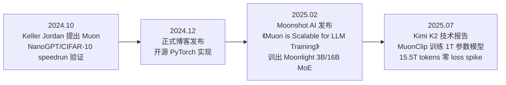

# Muon：正交化动量优化器 深度精读

> **来源**：
> - Keller Jordan et al., *Muon: An optimizer for hidden layers in neural networks*, 博客 + 开源代码, 2024年12月8日发布，https://kellerjordan.github.io/posts/muon/
> - Kimi Team (Moonshot AI), *Muon is Scalable for LLM Training*, arXiv:2502.16982, 2025年2月
> - Kimi Team (Moonshot AI), *Kimi K2: Open Agentic Intelligence*, arXiv:2507.20534, 2025年7月

**标签**: `#优化器` `#Muon` `#Newton-Schulz` `#Kimi_K2` `#MuonClip` `#Moonshot_AI`

**知识链接**：
- [Muon：正交化动量优化器（前置知识）](/前置知识/005f_前置知识_Muon正交化动量优化器) —— 本文假设读者已理解 Muon 的核心数学原理（正交化、Newton-Schulz 迭代），此处不再重复推导
- [Adam 与 AdamW：自适应学习率优化器](/前置知识/005e_前置知识_Adam与AdamW自适应学习率优化器) —— Muon 要挑战的基线优化器
- [深度学习优化器全景综述](/论文综述/S25_深度学习优化器全景综述) —— Muon 在整个优化器演化图谱中的位置

---

## 一、背景：一个优化器如何从个人博客走到万亿参数模型

### 1.1 时间线

Muon 的发展轨迹是深度学习研究里少见的"个人博客 → 开源验证 → 工业级大模型"的完整闭环，三个阶段分别对应三篇不同的公开材料：

**第一阶段（2024 年 10 月）**：Keller Jordan（独立研究者，此前活跃于 NanoGPT speedrunning 社区）在"NanoGPT speedrunning"这个竞速式基准测试（比赛用最少的时间把一个 GPT-2 规模模型训练到某个固定验证损失）中，用 Muon 替换 AdamW，把训练速度记录提升了 35%。同一时期，Muon 也刷新了 CIFAR-10 图像分类的训练速度记录，把 94% 准确率的训练时间从 3.3 个 A100-秒降到 2.6 个 A100-秒。

**第二阶段（2024 年 12 月）**：Keller Jordan 正式发布博客《Muon: An optimizer for hidden layers in neural networks》，公开完整的算法设计动机、与 Shampoo 等已有优化器的理论联系，并开源了 PyTorch 实现。这个阶段的验证规模仍然局限在小模型（1.5B 参数左右）。

**第三阶段（2025 年 2 月）**：Moonshot AI（月之暗面，Kimi 系列大模型的研发公司）发布技术报告《Muon is Scalable for LLM Training》，系统解决了把 Muon 从小模型扩展到大模型时暴露出的问题（后文第三章详述），并用改进后的 Muon 训练出了 Moonlight——一个 3B 激活参数/16B 总参数的混合专家（Mixture-of-Experts, MoE——一种只激活一部分"专家"子网络处理每个 token、从而用较少计算量获得较大模型容量的架构）模型，训练数据量达 5.7 万亿 token。

**第四阶段（2025 年 7 月）**：Kimi K2 技术报告发布，把 Muon 进一步和一种叫 QK-Clip 的稳定性机制结合成 MuonClip 优化器，成功训练出 1.04 万亿参数（320 亿激活参数）的 MoE 模型 Kimi K2，训练 token 量达到 15.5 万亿，且全程**零 loss spike**（训练损失曲线没有出现任何突然的剧烈跳变）。

### 1.2 为什么这个时间线值得关注

这个"个人博客到万亿模型"的路径本身就是一个值得注意的现象：Keller Jordan 在博客结尾明确提出了三个悬而未决的问题——Muon 能否扩展到更大规模、能否在分布式集群上高效实现、是否只对预训练有效——这三个问题恰好被后续 Moonshot AI 的两篇技术报告逐一正面回答。这也解释了为什么本文要把这三份材料放在一起精读：它们构成一个证据链条完整的技术演进故事，而不是三个孤立的技术点。

## 二、Muon 的核心设计回顾（简述，详细推导见前置知识）

在深入 Moonshot AI 的扩展工作之前，先用一句话回顾核心机制——完整推导请见 [Muon 前置知识](/前置知识/005f_前置知识_Muon正交化动量优化器)：

Muon 对神经网络的**二维矩阵参数**（如 Transformer 中的注意力投影矩阵、MLP 权重矩阵）执行"SGD 动量累积 + Newton-Schulz 迭代近似正交化"，把更新矩阵的所有奇异值方向拉平到同等力度，避免更新方向被少数几个主导方向长期垄断。原始实现的完整更新规则：

$$
M_t = \mu M_{t-1} + G_t, \qquad O_t = \text{Newton-Schulz}(M_t), \qquad W_t = W_{t-1} - \eta_t O_t
$$

**这个公式在做什么**：与前置知识中的推导完全一致——动量累积平滑梯度噪声，Newton-Schulz 近似正交化拉平各方向力度，再用拉平后的结果更新参数。

::: details 📐 公式详解（点击展开）

| 子表达式 | 它是谁 | 它在干嘛 |
|---------|--------|---------|
| $M_t = \mu M_{t-1} + G_t$ | **动量累积**（原始 Keller Jordan 版本不做 $(1-\mu)$ 缩放，直接累加） | 融合当前梯度矩阵和历史动量，$\mu$ 通常取 0.95 |
| $\text{Newton-Schulz}(M_t)$ | **正交化近似** | 用 5 步矩阵乘法迭代（详见前置知识）逼近 $M_t$ 的最近半正交矩阵 |
| $\eta_t$ | **学习率** | 控制这一步走多远 |

**用人话读**："和前置知识里推导的完全一样——把动量矩阵通过几次矩阵乘法拉平成正交矩阵，再拿去更新权重。"

**为什么这里再放一遍公式**：为了让本篇精读的记号和后续 Moonshot AI 扩展工作的记号（下一节的 $O_t$）保持一致，方便对照两个版本的差异，具体的"为什么这样设计"请参考前置知识文章，此处不重复展开。
:::

Keller Jordan 报告的关键实证结果（NanoGPT speedrunning 基准）：

| 指标 | 数值 |
|------|------|
| NanoGPT speedrun 训练速度提升 | 相对 AdamW 提升 35%（首次刷新记录，2024.10.15） |
| CIFAR-10 94% 准确率训练时间 | 从 3.3 A100-秒降到 2.6 A100-秒 |
| 1.5B 参数模型训练到 GPT-2 XL 水平 | Muon 用 10 个 8×H100-小时，AdamW 用 13.3 小时 |
| Muon 引入的额外 FLOP 开销 | NanoGPT 规模约 0.7%，Llama 405B 规模估算约 0.5% |

值得注意的是，截至 Keller Jordan 撰写博客时，NanoGPT speedrunning 记录已经连续 12 次被采用 Muon 的方案刷新，由 7 位不同的研究者独立完成——这是一种他称之为"竞速式基准测试"（competitive task）的证据标准：由于赛道的历史最优记录本身就是一个持续被社区打磨到位的强基线，新方法若能持续刷新记录，说明改进是真实的，而不是"没调好基线导致的虚假提升"。

## 三、从小模型到大模型：Moonshot AI 解决的两个扩展性问题

Keller Jordan 的原始实验规模止步于 1.5B 参数左右。Moonshot AI 的《Muon is Scalable for LLM Training》系统研究了把 Muon 扩展到数十亿甚至千亿参数规模时暴露出的两个此前未被注意到的问题。

### 3.1 问题一：权重和层输出的 RMS 值持续增长

在更大规模、更长训练时间（对 800M 参数模型训练 1000 亿 token，约为常规最优训练量的 5 倍）的实验中，Moonshot AI 观察到：不加权重衰减的原始 Muon 虽然初期收敛比 AdamW 更快，但模型权重和每层输出的均方根（Root Mean Square, RMS）会持续增长，甚至超出 bfloat16（一种 16 位浮点数格式，数值范围小于标准 32 位浮点数）能稳定表示的精度范围，长期训练下反而损害模型性能。

解决方案是把标准的 AdamW 式权重衰减机制直接引入 Muon 的更新规则：

$$
W_t = W_{t-1} - \eta_t (O_t + \lambda W_{t-1})
$$

**这个公式在做什么**：在正交化后的更新量之外，再单独叠加一个"把权重往 0 拉"的衰减项——这个思路与 [AdamW 解耦权重衰减](/前置知识/005e_前置知识_Adam与AdamW自适应学习率优化器) 的动机完全一致，只是这里叠加在 Muon 的正交化更新之上。

::: details 📐 公式详解（点击展开）

| 子表达式 | 它是谁 | 它在干嘛 |
|---------|--------|---------|
| $O_t$ | **正交化后的更新方向**（对应前置知识中的 $\text{Ortho}(M_t)$） | Muon 的核心贡献，决定"往哪个方向、多均匀地更新" |
| $\lambda W_{t-1}$ | **权重衰减项**（与 AdamW 解耦权重衰减的角色完全相同） | 独立于梯度信息，只根据参数当前值本身施加一个往 0 收缩的力，抑制权重无限增长 |
| $\eta_t(\cdot)$ | **学习率统一缩放两部分** | 学习率同时控制"走多远"和"衰减多快" |

**用人话读**："在 Muon 原本的正交化更新之外，额外加一个和 AdamW 一样的权重衰减力，防止权重和层输出的数值一直往上飘，避免撞到 bfloat16 的精度天花板。"

**为什么是这个形式**：这不是全新设计，而是直接照搬了 AdamW 中已经被验证有效的解耦权重衰减机制，说明"权重衰减独立于自适应/正交化更新之外"这个原则具有普适性，不管优化器主体机制是什么，都需要一个独立的收缩力来控制参数尺度。Moonshot AI 的实验对比显示：加权重衰减的 Muon 在超训练（over-train，训练 token 远超计算最优点）场景下的验证损失明显低于不加权重衰减的原始版本，也低于 AdamW 基线。
:::

### 3.2 问题二：不同形状的矩阵，更新幅度天生不一致

Moonshot AI 从理论上证明了一个此前未被注意的性质（Lemma 1）：对一个形状为 $[A, B]$ 的满秩矩阵参数，Muon 更新矩阵的理论 RMS 恰好等于 $1/\max(A,B)$。这意味着：矩阵越"细长"（$\max(A,B)$ 越大，比如 MLP 里的升维矩阵），Muon 给它的实际更新幅度就越小；矩阵越接近正方形，更新幅度相对越大。

这与 AdamW 形成了鲜明对比——AdamW 的更新 RMS 理论上稳定在 1 附近（不随矩阵形状变化）。不一致的更新幅度会带来两个具体问题：当 $\max(A,B)$ 过大（如密集 MLP 矩阵）时，更新过小，限制模型的有效学习能力；当 $\max(A,B)$ 过小（如把分组查询注意力中每个 KV 头当作独立小矩阵）时，更新过大，容易造成训练不稳定。

解决方案是引入一个形状相关的缩放因子，把 Muon 的更新 RMS 主动调整到与 AdamW 相近的量级（约 0.2–0.4）：

$$
W_t = W_{t-1} - \eta_t\left(0.2 \cdot O_t \cdot \max(A,B) + \lambda W_{t-1}\right)
$$

**这个公式在做什么**：用矩阵形状 $\max(A,B)$ 主动补偿 Muon 天生"矩阵越大更新越小"的缺陷，让不同形状、不同层的矩阵获得彼此可比、且与 AdamW 量级一致的实际更新幅度。

::: details 📐 公式详解（点击展开）

| 子表达式 | 它是谁 | 它在干嘛 |
|---------|--------|---------|
| $\max(A,B)$ | **矩阵"细长"程度的度量** | 矩阵较长的那一维——正好是抵消 Lemma 1 里 $1/\max(A,B)$ 这个理论 RMS 缩放的关键量 |
| $0.2 \cdot O_t \cdot \max(A,B)$ | **形状补偿后的更新** | 把原本 $O_t$ 的 RMS（$\approx 1/\max(A,B)$）乘回 $\max(A,B)$ 后，RMS 变回 $\approx 1$，再乘 0.2 把量级对齐到 AdamW 的典型更新 RMS（经验值 0.2–0.4） |
| $0.2$ | **匹配 AdamW 更新量级的系数** | 让调整后的 Muon 更新幅度与 AdamW 处于同一量级，这样调好的 AdamW 学习率、权重衰减系数可以**直接复用**给 Muon，不需要重新调参 |

**用人话读**："矩阵越大，原本 Muon 给它的更新天生越小——干脆按矩阵大小把更新幅度补偿回来，再统一缩放到和 AdamW 差不多的量级，这样原来给 AdamW 调好的学习率可以直接照搬给 Muon 用。"

**为什么是这个形式**：Moonshot AI 在论文里对比了三种候选方案（固定缩放 Baseline、直接对更新做归一化 Update Norm、按形状调整学习率 Adjusted LR），实验发现后两者效果相近且都优于 Baseline，最终选择 Adjusted LR 是因为它计算成本更低（只需要在学习率上乘一个标量，不需要对整个更新矩阵做额外的归一化运算）。这一设计的直接效果是让 Muon 变成一个"开箱即用、不需要为每个新模型重新网格搜索超参数"的优化器——这是 Moonshot AI 报告标题里"Scalable"的核心含义之一。
:::

### 3.3 Scaling Law 实验结果：约 52% 的训练算力

Moonshot AI 用 Llama 架构的一系列稠密模型（399M 到 1.5B 参数）分别对 AdamW 和 Muon（复用同一套调好的 AdamW 超参数）拟合了 scaling law（描述"模型规模、训练数据量、算力预算、最终损失"之间关系的经验公式）曲线。核心结论：在算力最优（compute-optimal）训练设定下，**Muon 只需要约 52% 的训练 FLOPs 就能达到与 AdamW 相同的验证损失**——这也是社区中常引用的"Muon 比 AdamW 快 2 倍"说法的来源（约 $1/0.52\approx1.92\times$）。

在 Moonlight 模型（3B/16B 参数 MoE，5.7 万亿 token 训练）上的下游任务对比同样支持这一结论：与同架构、同训练量、只是换成 AdamW 的对照模型 Moonlight-A 相比，Muon 训练的 Moonlight 在几乎所有基准上都更优，尤其在数学和代码类任务上优势明显（如 HumanEval 从 29.3 提升到 37.2，GSM8K 从 43.8 提升到 45.0，训练到 1.2T token 时的对比）。

Moonshot AI 还做了一个有意思的谱分析：用 SVD 熵（衡量一个矩阵奇异值分布的"均匀程度"，熵越高说明各方向能量越平均）比较 Muon 和 AdamW 训练出的权重矩阵，发现 Muon 训练的权重在几乎所有分组（注意力矩阵、MLP 矩阵、路由矩阵等）上 SVD 熵都更高——这为"Muon 让更新方向在更多方向上都得到有效利用"这一设计动机提供了直接的实证支持，尤其是在 MoE 模型的路由权重矩阵上，这个差异格外显著，说明稀疏专家模型可能是 Muon 收益格外明显的场景。

## 四、MuonClip：解决 Muon 在千亿级模型上的训练不稳定性

### 4.1 Muon 比 AdamW 更容易发生注意力 logit 爆炸

当 Moonshot AI 把 Muon 用到更大规模（K2 是 1 万亿总参数、320 亿激活参数的 MoE 模型）时，暴露出一个新问题：**注意力 logit 爆炸**（attention logit explosion）——也就是 softmax 之前的 query-key 点积 $q_i \cdot k_j$ 数值变得异常大，这会导致数值不稳定甚至训练发散。

Kimi K2 团队通过一次中等规模（90 亿激活/530 亿总参数 MoE）的实验直接验证了这个现象：用原始 Muon 训练时，注意力最大 logit 值很快超过 1000，而同等条件下 AdamW 训练的模型这个指标控制得更健康。他们给出的理论解释是：Muon 产生的更新矩阵，由于正交化操作强制让所有奇异值相等（有效秩接近满秩），比 Adam 产生的天然低秩、少数方向主导的更新矩阵，更容易让权重矩阵的某个奇异值在训练过程中"叠加式增长"——而注意力机制里 query 和 key 投影矩阵的谱范数（矩阵最大奇异值）增长会通过 $q\cdot k$ 的点积被平方级放大，进一步加剧了这个问题。

### 4.2 QK-Clip：直接约束注意力 logit 而不干扰优化器本身

已有的缓解手段——logit 软上限（soft-cap，对 logit 做平滑截断）和 Query-Key 归一化（QK-Norm）——都不能很好解决这个问题：软上限只是"事后补救"，query 和 key 的点积在被截断前仍可能已经涨得很大；QK-Norm 又与 Kimi K2 使用的多头潜在注意力（Multi-head Latent Attention, MLA——DeepSeek-V3 提出的一种通过共享潜在空间压缩 KV 缓存的注意力变体）不兼容，因为 MLA 的 Key 矩阵在推理时不会被完整具体化出来。

Kimi K2 团队提出的 QK-Clip 思路是：不去改动前向/反向传播的计算过程，而是在**每一步优化器更新之后**，检测每个注意力头的最大 logit 值 $S_{\max}^h$，一旦超过阈值 $\tau$，就直接对该头的 query/key 投影权重矩阵做一次缩放：

$$
\gamma^h = \min\left(1, \frac{\tau}{S_{\max}^h}\right), \qquad W_{qc}^h \leftarrow \gamma^h W_{qc}^h, \quad W_{kc}^h \leftarrow \gamma^h W_{kc}^h
$$

**这个公式在做什么**：如果某个注意力头这一步的最大 logit 超过了安全阈值 $\tau$，就把这个头对应的 query/key 权重矩阵按比例缩小，直接把"权重矩阵的尺度"这个爆炸的根源压下去——而不是去限制 logit 计算本身或修改梯度。

::: details 📐 公式详解（点击展开）

| 子表达式 | 它是谁 | 它在干嘛 |
|---------|--------|---------|
| $S_{\max}^h = \frac{1}{\sqrt{d}}\max_{i,j} Q_i^h \cdot (K_j^h)^T$ | **这个头本批数据里观测到的最大注意力 logit** | 监控信号，训练时前向传播本来就会算出这个量，不需要额外计算 |
| $\tau$（Kimi K2 中取 100） | **安全阈值** | 只要 logit 没超过这个值，QK-Clip 完全不生效，不干扰正常的 Muon 更新 |
| $\gamma^h = \min(1, \tau/S_{\max}^h)$ | **按需触发的缩放系数** | 没超过阈值时 $\gamma^h=1$（不做任何事）；超过阈值时 $\gamma^h<1$，缩放力度正好把 logit 压回 $\tau$ |
| 只缩放 $W_{qc}^h, W_{kc}^h$（每头独立，而不是全局统一缩放） | **精准打击** | 实测只有少数头会出现 logit 爆炸，逐头独立缩放能把对其他正常头的干扰降到最低 |

**用人话读**："每一步更新完权重之后，检查每个注意力头这一步的最高得分有没有超标；超标了就把这个头对应的权重矩阵按比例缩小一点，只压这个头，不影响别的头，也不改变优化器本身怎么算更新量。"

**为什么是这个形式**：Kimi K2 的实验（附录 D）显示，即便用很激进的阈值（$\tau=30$）对一个小规模模型施加 QK-Clip，loss 曲线也几乎没有变化——说明这种"事后微调权重尺度"的干预对模型正常学习的影响可以忽略不计，代价很低但换来了训练稳定性。更重要的是，QK-Clip 会随着训练推进"自动退出"：在 K2 的实际训练中，前 7 万步内约 12.7% 的头触发过 QK-Clip，7 万步之后，所有头的最大 logit 都稳定降到了阈值以下，QK-Clip 之后再也没有被触发过——这说明它只是训练早期的一个"安全带"，而不是一个永久生效、会持续影响模型行为的约束。
:::

把 Muon（权重衰减 + 一致更新 RMS）与 QK-Clip 组合起来，就构成了 Kimi K2 使用的 MuonClip 优化器。用 MuonClip，Kimi K2 在 15.5 万亿 token 的预训练全程实现了零 loss spike——这是万亿参数规模模型训练里一个不容易达到的稳定性指标。

## 五、Kimi K2 中 Muon 的具体使用方式：哪些参数用 Muon，哪些不用

延续 [Muon 前置知识第 4 节](/前置知识/005f_前置知识_Muon正交化动量优化器) 中"Muon 只适用于二维矩阵参数"的原则，Kimi K2 的实际训练配置遵循了同样的划分（这也是社区里所有基于官方 Muon 实现的项目的标准做法）：

| 参数类型 | 使用的优化器 | 原因 |
|---------|-------------|------|
| Transformer 隐藏层的二维权重矩阵（注意力 Q/K/V/O 投影、MLP 升降维矩阵、MoE 专家权重、路由权重） | **Muon**（K2 中为 MuonClip） | 这些矩阵的"整体旋转结构"是模型学习能力的核心承载者，Muon 让更新在所有方向上更均衡 |
| 输入嵌入层（token embedding） | **AdamW** | 每一行对应一个独立 token，不存在值得保留的"整体旋转对称性" |
| 输出分类头（LM head） | **AdamW** | 与嵌入层类似，输出层的角色和隐藏层不同，经验上 AdamW 表现更好 |
| RMSNorm 的 gain 参数、bias 等标量/向量参数 | **AdamW** | 一维参数没有奇异值分布的概念，谈不上正交化 |

Kimi K2 报告中还有一个容易被忽略但很实用的结论：**Muon 预训练的模型，微调阶段继续用 Muon 效果最好**；反过来，如果预训练用 AdamW，微调时换成 Muon 也不会带来明显收益。这说明 Muon 和 AdamW 训练出的权重矩阵在某种统计意义上是"不匹配"的——两者不能简单地在训练流程的不同阶段自由切换，这也是 Moonshot AI 论文里明确列为未来研究方向的一个开放问题。

## 六、Muon 的适用场景与局限

### 6.1 什么场景下 Muon 的收益更明显

综合以上材料，Muon 收益最明显的场景包括：

1. **预训练阶段而非微调阶段**：Kimi K2 团队的消融实验（7.5.1 节）显示，Muon 预训练+Muon 微调的组合效果最好，但如果预训练用的是别的优化器，微调阶段单独换成 Muon 的收益并不显著——说明 Muon 的优势更多来自"从零开始塑造权重矩阵的谱结构"，而不是在已经用其他优化器训练好的权重上做局部修正。
2. **矩阵参数占主导的架构**，尤其是 MoE 模型的路由和专家权重——SVD 熵分析显示这类矩阵从 Muon 中获益格外明显。
3. **数据受限、token 效率至关重要的场景**：Muon 的核心卖点是"用更少的训练 FLOPs 达到同等效果"，这对高质量训练数据稀缺、需要精打细算每个 token 的场景（如 Kimi K2 强调的"token efficiency"）价值更大。

### 6.2 局限与开放问题

Moonshot AI 论文明确列出的未来研究方向，也是 Muon 目前公认的局限：

- **仍需要搭配 AdamW 处理非矩阵参数**：目前没有一个统一的框架把所有参数类型纳入 Muon 框架内处理。
- **理论上只是"谱范数下的最速下降"的一种特例**：Muon 可以被理解为在谱范数（矩阵的最大奇异值构成的范数）约束下做最速下降，而更一般的 Schatten 范数（一族由所有奇异值的某种组合定义的范数）框架仍是未被充分探索的方向。
- **预训练-微调优化器不匹配问题**：如前所述，切换优化器可能带来性能损失，具体机制尚未被完全理解。
- **大规模场景下的稳定性问题需要额外机制补救**（即 QK-Clip 的必要性）：这说明 Muon 并非"即插即用毫无代价"，在千亿参数以上规模，仍需要针对具体架构（如 MLA）设计定制化的稳定性方案。

## 七、总结

Muon 从一个人的 NanoGPT speedrun 实验，走到支撑万亿参数 Kimi K2 的完整训练，核心脉络始于一个具体的观察——梯度更新矩阵的奇异值分布往往不均匀，逐元素处理（如 Adam）看不到这个结构。Muon 用 Newton-Schulz 迭代高效近似正交化，把这种不均匀"拉平"，在 NanoGPT 规模上换来了显著的训练加速。Moonshot AI 的两篇技术报告则展示了把这个想法从"能在小模型上验证"扩展到"能在生产级万亿参数模型上稳定使用"需要解决的具体工程问题——权重衰减、跨形状一致更新、以及注意力 logit 爆炸的针对性修复（QK-Clip）。这个完整的故事也印证了 [深度学习优化器全景综述](/论文综述/S25_深度学习优化器全景综述) 中的一个核心观点：优化器研究要真正被工业界采纳，光有算法创新不够，还需要经过大规模、长周期训练的严格检验。

## 延伸阅读

- [Muon：正交化动量优化器（前置知识）](/前置知识/005f_前置知识_Muon正交化动量优化器) —— Newton-Schulz 迭代的完整数学推导
- [Adam 与 AdamW：自适应学习率优化器](/前置知识/005e_前置知识_Adam与AdamW自适应学习率优化器) —— Muon 挑战的基线优化器
- [深度学习优化器全景综述](/论文综述/S25_深度学习优化器全景综述) —— SGD 到 Adam 到 Muon 的完整演化图谱
- Keller Jordan (2024), *Muon: An optimizer for hidden layers in neural networks*, https://kellerjordan.github.io/posts/muon/
- Liu et al. (2025), *Muon is Scalable for LLM Training*, arXiv:2502.16982
- Kimi Team (2025), *Kimi K2: Open Agentic Intelligence*, arXiv:2507.20534
