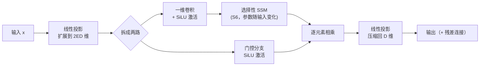

# Mamba：线性时间序列建模与选择性状态空间 深度精读

> **论文标题**: Mamba: Linear-Time Sequence Modeling with Selective State Spaces
> **作者**: Albert Gu, Tri Dao
> **机构**: CMU, Princeton University
> **发表**: arXiv:2312.00752, 2023年12月（v2 2024年5月）
> **代码**: https://github.com/state-spaces/mamba

**标签**: `#Mamba` `#SSM` `#状态空间模型` `#选择性扫描` `#序列建模` `#大模型架构`

**知识链接**：
- [状态空间模型 SSM 与选择性扫描：从控制论到 Mamba](/前置知识/005h_前置知识_状态空间模型SSM与选择性扫描) — 本文数学基础的完整推导：SSM 递推、卷积等价性、S4 的长程记忆、选择性机制、并行扫描的三个工程技巧。**本文不重复这些推导，只讲论文本身的动机、实验和结论**
- [序列建模架构全景综述](/论文综述/S27_序列建模架构全景综述) — RNN、Transformer、SSM、Mamba、RWKV 的横向对比全景

---

## 一、这篇论文要解决什么问题

### 1.1 贯穿全文的例子

> 想象你要构建一个能处理超长文档（比如一整本书、一段完整的 DNA 基因组、一小时的音频波形）的序列模型。用 Transformer，序列长度翻倍，计算量变成四倍——处理 10 万 token 的文档，显存和推理时间都会迅速变得不可承受。用传统 RNN/LSTM，计算量随长度线性增长，但训练时必须一步步展开、无法并行，几万步的训练时间长到不可接受。Mamba 要回答的问题是：**能不能同时拥有"线性计算量"和"可并行训练"这两个好处，同时还不像早期线性模型那样在语言这种离散、信息密集的数据上效果打折扣？**

这个例子会在全文反复出现——每引入一个新机制，都回来看它对这个"处理超长序列"场景带来了什么改变。

### 1.2 背景：为什么 Transformer 之外的架构一直没成功

论文开篇指出，几乎所有现代基础模型（Foundation Model，在海量数据上预训练、再适配到下游任务的大模型）都基于 Transformer 和它核心的自注意力（Self-Attention）模块。自注意力的有效性来自于它能在上下文窗口内"密集地"路由信息——每个位置都能直接看到其他所有位置。但这个优点直接导致了两个根本缺陷：**无法建模超出固定窗口之外的内容，以及计算量随窗口长度呈平方增长**。

在 Mamba 之前，已经有大量工作尝试用线性注意力（Linear Attention）、门控卷积（Gated Convolution）、循环模型和结构化状态空间模型（Structured SSM，见 [SSM 前置知识](/前置知识/005h_前置知识_状态空间模型SSM与选择性扫描) 第二节的 S4）去解决这个问题——这些模型在音频、图像等**连续型信号**上表现不错，甚至在长序列基准测试 Long Range Arena 上超过了注意力机制。但论文指出一个关键事实：**这些次平方复杂度的架构，在文本这种离散、信息密集的数据上，效果一直明显不如注意力**。

### 1.3 论文的核心论断：问题出在"内容感知"能力上

Mamba 论文identifies 出的关键弱点是：**这些次平方复杂度的模型（包括 S4）都无法进行基于内容的推理（content-based reasoning）**。用 [SSM 前置知识](/前置知识/005h_前置知识_状态空间模型SSM与选择性扫描) 第三节的语言来说：S4 的参数 $A, B, C$ 对所有时刻、所有输入内容都完全一样（线性时不变，LTI），它能感知"现在是第几步"，但感知不了"现在这一步输入的内容是什么"。这个弱点在连续信号（音频波形前后关联比较均匀）上不明显，但在语言这种"关键信息稀疏分布、需要精确记住某几个 token 忽略中间大量填充词"的数据上就是致命的。

论文用两个合成任务（详见第三节）具体验证了这个论断，然后提出了解法：**让 SSM 的参数变成输入的函数**——这正是 [SSM 前置知识第三节](/前置知识/005h_前置知识_状态空间模型SSM与选择性扫描#三-mamba-的核心创新让参数依赖输入本身选择性) 详细推导过的选择性机制（$\Delta_t, B_t, C_t$ 随每一步输入 $x_t$ 重新计算）。本文接下来聚焦论文原文如何论证这件事、如何解决因此产生的效率问题，以及论文报告的具体实验数字。

---

## 二、用两个合成任务验证"内容感知"缺陷

论文没有直接跳到语言建模的大规模实验，而是先设计了两个诊断性的合成任务，把"LTI 模型到底卡在哪里"这件事讲清楚。这是论文方法论上值得学习的一点：**先用最小的合成任务隔离问题、再上真实数据验证**，比一上来就堆大模型实验更有说服力。

### 2.1 选择性复制任务（Selective Copying）

标准的"复制任务"（Copying Task）是序列建模里最经典的合成测试——模型看到一段输入，要求原样输出。传统的复制任务里，需要记住的 token 和输出位置之间的间隔是**固定**的，这种任务只需要"感知时间"（知道隔了几步）就能解决，卷积核构造成固定长度就行，不需要理解内容。

论文把这个任务改造成**选择性复制**：需要记住的 token 在输入序列中的位置是**随机**的，中间夹杂大量无关的填充符号。这时候模型必须"看懂内容"才能知道该记住哪些 token、忽略哪些——纯粹依赖"隔了几步"的固定卷积核做不到这件事，因为间隔本身是不确定的。

论文报告的结果（见论文 Figure 4）：把 S4 换成加了选择性机制的 S6（论文对"选择性 SSM"的简写，代表"S4 + Selection = S6"），准确率从 S4 的 18.3% 跃升到 97.0%；即便是引入了乘法门控但没有选择性机制的架构（如 H3、Hyena），准确率也只能到 30-57%——这证实了论文的核心论断：**架构层面的门控（gating）不足以解决这个问题，真正起作用的是让参数依赖内容的选择性机制本身**。

### 2.2 归纳头任务（Induction Heads）

归纳头是从大语言模型可解释性研究中借来的一个诊断任务——它被认为能预测大模型的上下文学习（In-Context Learning）能力。任务要求：如果序列中出现过某个二元组（比如"Harry Potter"），下次再看到"Harry"时，模型要能通过"联想"预测出下一个词是"Potter"，而不是死记硬背。

论文在长度 256 的序列上训练 2 层小模型，然后在测试时把序列长度一路推到 $2^{20} \approx 1048576$（约 105 万）——**比训练时长了 4000 倍**。结果显示：Mamba 的选择性 SSM 层能完美泛化到百万级长度，而其他方法（包括各种位置编码变体的注意力）在超过训练长度 2 倍时就开始失效。这个结果直接支撑了论文摘要里"Mamba 在真实数据上的表现能持续提升到百万级长度序列"这一论断的合理性。

---

## 三、硬件感知并行扫描算法：论文原文怎么讲这件事

[SSM 前置知识第四节](/前置知识/005h_前置知识_状态空间模型SSM与选择性扫描#四-代价与解法选择性破坏了卷积用并行扫描补回来) 已经用直觉讲清楚了"并行扫描、核融合、重计算"这三个工程技巧在做什么。这里补充论文原文对"为什么必须这样做"的具体论证逻辑，以及它带来的量化收益。

### 3.1 效率困境：状态维度扩张 vs 显存搬运

选择性 SSM 每个通道独立维护一个状态维度为 $N$ 的隐藏状态——如果老实按最朴素的方式实现，需要在 GPU 显存里实际"物化"（materialize）一个形状为 $(\text{Batch}, \text{Length}, D, N)$ 的四维张量，这比输入 $x$（形状只有 $(\text{Batch}, \text{Length}, D)$）大了整整 $N$ 倍。$N$ 通常取 16 左右，这意味着中间状态的显存占用比输入本身大一个数量级。

$$
\text{朴素递推：} O(B \cdot L \cdot D \cdot N) \text{ FLOPs}, \qquad \text{卷积模式：} O(B \cdot L \cdot D \cdot \log L) \text{ FLOPs}
$$

**这个公式在做什么**：对比两种计算模式的理论浮点运算量——递推模式的计算量不含 $\log$ 项但常数因子更低,卷积模式虽然多了一个 $\log L$ 因子但可以用 FFT 加速。这告诉我们：只要状态维度 $N$ 不是特别大，对长序列而言递推模式反而可能用更少的浮点运算,问题不在"算得多"，而在别处。

::: details 📐 公式详解（点击展开）

| 子表达式 | 它是谁 | 它在干嘛 |
|---------|--------|---------|
| $B$（Batch） | **批大小** | 一次并行处理的样本数 |
| $L$（Length） | **序列长度** | 处理的 token/时间步数量 |
| $D$ | **通道数（模型维度）** | SSM 对每个通道独立处理 |
| $N$ | **每个通道的状态维度** | 决定了每个通道用多"宽"的隐藏状态记忆历史 |
| $O(B L D N)$ | **递推模式的理论代价** | 每个时间步、每个通道、每个状态维度都要做一次乘加运算 |
| $O(B L D \log L)$ | **卷积模式的理论代价** | 借助 FFT 把卷积化成频域乘法，换来 $\log L$ 而不是线性的 $N$ 因子 |

**用人话读**："把整条序列的计算量掰开算一遍——按状态维度 $N$ 展开的递推、和借助 FFT 加速的卷积，两者的浮点运算总量在数量级上其实差不了太多，谁更快取决于 $N$ 相对 $\log L$ 有多大。"

**为什么这解释了效率困境的关键**：既然两种模式的算力开销（FLOPs）差距不大，那么真正拖慢速度的瓶颈**不是算力，而是显存带宽**——把 $(B,L,D,N)$ 这么大的中间状态在 GPU 显存的不同层级之间来回搬运，才是实际瓶颈所在。这正是论文选择"核融合"这个技巧的直接动机。
:::

### 3.2 三个技巧的组合效果：论文报告的具体加速比

把 [SSM 前置知识第四节](/前置知识/005h_前置知识_状态空间模型SSM与选择性扫描#四-代价与解法选择性破坏了卷积用并行扫描补回来) 讲的并行扫描、核融合（把参数从慢速的 GPU 主显存 HBM 直接读进高速缓存 SRAM 里做完整个离散化+递推计算，只把最终结果写回主显存）、重计算（反向传播时重新计算中间状态而不是存储它们）这三个技巧组合起来，论文报告的实测效果（Section 4.5, Figure 12）是：

- 论文自己实现的融合式选择性扫描算子（selective scan），比标准的 PyTorch 逐步实现快 **20-40 倍**
- 在序列长度超过 2K 之后，这个扫描算子比当时最优的注意力实现 FlashAttention-2 还要快
- 端到端推理吞吐量方面，Mamba 达到同等规模 Transformer 的 **5 倍**——因为 Mamba 作为一个真正的循环模型，推理时不需要像 Transformer 那样维护一份越来越大的 KV 缓存（Key-Value Cache，Transformer 自回归生成时缓存所有历史 token 的 Key、Value 向量以避免重复计算），可以用远大得多的批大小做推理

这组数字直接回应了论文摘要里"5 倍推理吞吐提升"这个具体论断——本文核实过原始论文和 arXiv HTML 版本，确认这个数字准确无误，并非营销夸大。

---

## 四、极简的端到端架构：Mamba Block

### 4.1 从"H3 + MLP 交替"到"单一同构模块"

在 Mamba 之前，最有代表性的 SSM 架构是 H3——它把一个 SSM 层夹在两个门控连接之间，然后和标准的 MLP 块交替堆叠，这和 Transformer 里"Attention 层 + MLP 层交替"的结构如出一辙。

Mamba 的架构简化在于：**把 SSM 层和门控 MLP 直接融合成一个模块，然后把这个模块同构地堆叠起来**，不再需要两种不同模块交替。灵感来自门控注意力单元（Gated Attention Unit）——对注意力做过的简化，Mamba 对 SSM 也做了一遍。

> 这张图对应论文 Figure 3 的架构：输入先被一个线性层扩展到 $2ED$ 维（$E$ 是扩展系数，论文固定取 $E=2$），拆成两路——一路过一维卷积和选择性 SSM（负责序列维度上的信息交互），另一路只做一个门控激活（不参与序列交互，纯粹逐元素调制），两路输出相乘后再线性投影回原始维度。整个模块内部既承担了"序列建模"（原本 SSM 层的职责）又承担了"逐通道特征变换"（原本 MLP 层的职责），因此堆叠这一个模块就够了，不需要再交替接一个独立的 MLP 层。

### 4.2 具体设计选择：SiLU 激活与可选归一化

论文使用 SiLU/Swish 激活函数（$\text{SiLU}(x) = x \cdot \sigma(x)$，其中 $\sigma$ 是 Sigmoid），这个选择使得门控 MLP 部分自然退化成流行的 SwiGLU 变体（现代大模型 MLP 层的事实标准之一）。此外论文额外加了一个可选的归一化层（选用 LayerNorm，可参考 [归一化方法全景综述](/论文综述/S21_深度学习归一化方法全景综述) 了解 LayerNorm 的具体计算方式），这个设计借鉴自 RetNet 在类似位置使用归一化层的做法。

参数规模上，论文固定 $E=2$，并堆叠两层 Mamba block 来对齐一个标准 Transformer block（Attention + MLP）的参数量 $12D^2$——这样在做规模对比实验时，Mamba 和 Transformer 在同样的参数预算下是公平对比的。

---

## 五、语言建模实验：真实数据上的具体数字

### 5.1 Scaling Law：Mamba 是第一个匹配强 Transformer 配方的无注意力模型

论文在 Pile 数据集（一个大规模英文语料库）上，用 Chinchilla 协议训练了从约 1.25 亿到约 13 亿参数的一系列模型，对比对象包括标准 GPT-3 架构的 Transformer，以及论文称为"Transformer++"的强化版本（融合了 PaLM/LLaMA 的多项改进：旋转位置编码、SwiGLU MLP、[RMSNorm](/论文综述/S21_深度学习归一化方法全景综述#六-rmsnorm-layernorm-的简化版现代大模型的事实标准) 替代 LayerNorm、去掉线性层偏置、更高的学习率）。

论文报告的核心结论（Section 4.2.1）：**Mamba 是第一个匹配上 Transformer++ 这个强配方的无注意力模型**，且这个优势随序列长度增长而更明显。此前所有的 SSM、线性注意力、RWKV、RetNet 等次平方复杂度架构，都没能在预训练困惑度上追平精心调优过的 Transformer。

### 5.2 下游零样本评测：Mamba-3B 的具体表现

论文在多个零样本下游任务上（LAMBADA 语言建模、HellaSwag 常识推理、PIQA 物理常识、ARC-Easy/Challenge 科学问答、WinoGrande 代词消解）对比 Mamba 和同规模的 Pythia、RWKV、GPT-Neo、OPT 等开源模型（本文核实的具体数字来自论文原文 Table 1）：

| 模型 | 参数量 | Pile 困惑度 ↓ | LAMBADA 准确率 | HellaSwag 准确率 | 平均准确率 |
|------|-------|--------------|----------------|------------------|-----------|
| Pythia-160M | 1.6亿 | 29.64 | 33.0% | 30.2% | 40.6% |
| **Mamba-130M** | 1.3亿 | 10.56 | 44.3% | 35.3% | **44.7%** |
| Pythia-1.4B | 14亿 | 7.51 | 61.7% | 52.1% | 55.2% |
| RWKV-1.5B | 15亿 | 7.70 | 56.4% | 52.5% | 54.3% |
| **Mamba-1.4B** | 14亿 | 6.80 | 64.9% | 59.1% | **59.7%** |
| Pythia-2.8B | 28亿 | 6.73 | 64.7% | 59.3% | 59.1% |
| RWKV-3B | 30亿 | 7.00 | 63.9% | 59.6% | 59.6% |
| **Mamba-2.8B** | 28亿 | 6.22 | 69.2% | 66.1% | **63.3%** |

> 表中数字直接摘自论文 Table 1（Pile 验证集困惑度只对比使用相同分词器 GPT-NeoX-20B 训练的模型）。规律非常一致：**在每一个参数规模档位上，Mamba 的平均准确率都是同档位里最高的，并且普遍能匹配甚至超过参数量两倍的 Transformer 基线**（论文摘要提到 Mamba-3B 在常识推理平均分上比 Pythia-3B 高 4 个百分点，甚至超过 Pythia-7B）。这一点在机器人和多模态大模型社区尤其值得关注——用更小的模型达到相近效果，直接意味着推理成本下降。

### 5.3 DNA 和音频：连续/超长序列模态上的验证

除了语言，论文还在 DNA 基因组序列（HG38 人类基因组数据集）和音频波形（YouTubeMix 钢琴音乐、SC09 语音生成）两个模态上做了验证：

- **DNA 建模**：固定模型规模、把训练序列长度从 1024 一路推到 100 万（$2^{20}$），Mamba 的预训练困惑度随序列长度增加持续下降；而作为对照的 HyenaDNA（另一个次平方复杂度架构）在序列变长后困惑度反而变差。论文将此归因于选择性机制——LTI 模型的固定卷积核会不加区分地聚合超长序列里的所有信息（包括大量噪声），而选择性 SSM 能主动过滤掉不相关的历史。
- **音频生成**：在 SC09 语音生成基准上，一个仅 610 万参数的小 Mamba 模型，在 FID（Fréchet Inception Distance，生成质量的常用量化指标，数值越低越好）指标上就超过了参数量数倍于它的、基于 GAN 和扩散模型的方案；把 Mamba 换成参数量 2430 万的版本后，FID 从 0.94 进一步降到 0.67，全面优于原有的最优方法 SaShiMi + DiffWave 组合（FID 1.42）。

这些跨模态的结果支撑了论文标题里"通用序列建模骨干"的定位——选择性 SSM 不是一个专为语言设计的技巧，而是在离散（语言、DNA）和连续（音频）数据上都成立的通用架构改进。

---

## 六、消融实验：验证选择性机制本身的贡献

论文在约 3.5 亿参数规模上做了一组细致的消融实验（Section 4.6），直接回答"提升到底是选择性机制带来的，还是仅仅换了个新架构带来的"这个问题：

- **架构本身（Mamba block）vs 内部 SSM 层的种类**：把 Mamba 架构里的核心层从非选择性的 S4 换成选择性的 S6，困惑度从约 9.1 明显改善。同样把 H3 架构里的内部层从 S4 换成 S6 也有类似提升——这说明提升主要来自"选择性"这个数学机制本身，而不是 Mamba 这个特定的外部架构包装。
- **$\Delta, B, C$ 三个参数分别贡献多少选择性**：论文的消融（论文 Figure 13）显示，单独让 $\Delta$ 依赖输入，困惑度从全不选择的 10.93 降到 9.81；三者都做成选择性时进一步降到 8.71。这验证了 [SSM 前置知识](/前置知识/005h_前置知识_状态空间模型SSM与选择性扫描#32-选择性机制把-deltabc-变成输入的函数) 提到的论断：**$\Delta$ 是贡献最大的单一因素**（因为它直接决定了"记住还是遗忘"这个最核心的开关），但三者组合能进一步协同增益。
- **状态维度 $N$ 的影响**：只有当 $B, C$ 也是选择性的前提下，增大状态维度 $N$ 才能带来明显的困惑度改善（从 9.88 降到 8.71，参数量只增加约 1%）；如果 $B, C$ 保持固定不变，增大 $N$ 几乎没有帮助。这说明选择性机制和"更大的有效状态容量"是相辅相成的——选择性让模型有能力更充分地利用扩大的状态维度。

---

## 七、论文自己承认的局限

论文在 Discussion 部分坦诚列出了几点局限，值得读者了解：

1. **规模验证的上限**：论文的实验只做到约 10 亿到 30 亿参数规模，没有验证在 70 亿参数以上（当时 RWKV、RetNet 等模型已经验证过的规模）Mamba 是否依然保持优势。
2. **连续-离散的权衡**：选择性机制解决了离散、信息密集数据（文本、DNA）上的弱点，但这个"内容感知"能力对某些连续信号任务（LTI 模型本来擅长的领域）反而可能是一种性能上的取舍，论文在音频波形实验的消融中对这一点做了具体探讨。
3. **下游生态未知**：Transformer 基础模型积累了丰富的下游适配生态（微调、提示、指令微调、RLHF、量化等），论文明确表示"Mamba 类模型是否有同样丰富的下游适配能力"还是一个开放问题——这也是为什么后续几年出现了大量"Mamba + 现有生态工具适配"的跟进研究。

---

## 八、总结：Mamba 在整条技术脉络中的位置

| 维度 | Mamba 相对 S4 的改变 | 带来的效果 |
|------|---------------------|-----------|
| 参数 $\Delta, B, C$ | 从固定不变改为随每步输入重新计算 | 获得"内容感知"能力，选择性复制任务准确率从 18.3% 跃升到 97%+ |
| 计算方式 | 从固定卷积核改为硬件感知并行扫描 | 训练速度接近卷积模式，同时保留选择性 |
| 架构 | H3 式"SSM+门控"和 MLP 交替，简化为单一同构模块 | 更简洁，参数效率更高 |
| 语言建模效果 | 首次匹敌强 Transformer++ 配方 | Mamba-3B 效果匹配 2 倍参数量的 Transformer |
| 推理效率 | 无需 KV 缓存，恒定时间/步 | 5 倍于同规模 Transformer 的推理吞吐 |

Mamba 的核心贡献可以用一句话概括：**它证明了"选择性"这一个改动，足以让线性复杂度的状态空间模型第一次在真实的语言建模任务上追平精心调优的 Transformer，同时保留了 SSM 家族在长序列上的天然效率优势**。这个结果直接激发了后续大量工作——从改进选择性 SSM 内部结构的 Mamba-2，到把 Mamba 层和注意力层混合的 Jamba/Zamba 等混合架构。[序列建模架构全景综述](/论文综述/S27_序列建模架构全景综述) 会把 Mamba 放进 RNN → Transformer → SSM 这条更长的技术演进线里，和 S4、RWKV 等架构做横向对比。

---

## 延伸阅读

- [状态空间模型 SSM 与选择性扫描：从控制论到 Mamba](/前置知识/005h_前置知识_状态空间模型SSM与选择性扫描) — 本文所有数学推导的完整前置基础
- [序列建模架构全景综述](/论文综述/S27_序列建模架构全景综述) — RNN、Transformer、SSM、Mamba、RWKV 的横向对比与选型指南
- [深度学习归一化方法全景综述](/论文综述/S21_深度学习归一化方法全景综述) — 理解 Mamba block 里可选归一化层与 RMSNorm 的设计动机
- [常微分方程 ODE——直觉与数值求解](/前置知识/001b_前置知识_常微分方程ODE直觉与数值求解) — 理解连续时间状态空间模型离散化的数学背景
