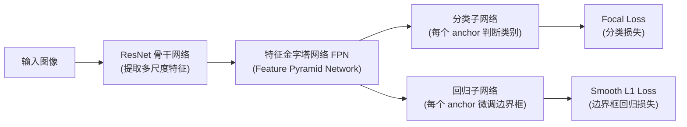

# Focal Loss for Dense Object Detection：RetinaNet 精读

> **论文标题**: Focal Loss for Dense Object Detection
> **作者**: Tsung-Yi Lin, Priya Goyal, Ross Girshick, Kaiming He, Piotr Dollár
> **机构**: Facebook AI Research (FAIR)
> **发表**: ICCV 2017（最佳学生论文），arXiv:1708.02002
> **代码**: https://github.com/facebookresearch/Detectron

**标签**: `#目标检测` `#Focal_Loss` `#RetinaNet` `#类别不平衡` `#损失函数`

**知识链接**：
- [Focal Loss 与类别不平衡前置知识](/前置知识/005j_前置知识_Focal_Loss与类别不平衡) — 本文假设读者已读过这篇，Focal Loss 公式本身、$\gamma$ 的作用、调制因子的推导都不在本文重复，本文聚焦"论文这次精读特有的内容"：$\alpha$-balanced 变体、RetinaNet 架构、实验数据
- [交叉熵损失与 Softmax](/前置知识/003f_前置知识_交叉熵损失与Softmax) — 交叉熵的完整数学基础
- [深度学习损失函数全景综述](/论文综述/S29_深度学习损失函数全景综述) — 把 Focal Loss 放进更大的损失函数图谱里对比

---

## 一、背景与动机：一阶段检测器为什么打不过两阶段检测器

### 1.1 贯穿全文的例子：一张街景图像里的检测任务

> **场景**：给定一张 $800\times600$ 的街景图像，任务是找出图中所有的车辆、行人、交通标志。密集目标检测器（这篇论文关注的对象）的做法是：在图像的每个空间位置、每个尺度、每种长宽比上都预先铺好一个候选框（叫 anchor，锚框），然后让神经网络对每一个 anchor 判断"这个框里有没有目标、是什么目标、边界该往哪调"。
>
> 一张图像铺出来的 anchor 数量大约是 **10 万个**，但一张典型的街景图里可能只有 **10-20 个**真实目标。这意味着 99.98% 以上的 anchor 都对应"背景"——这就是全文要解决的类别不平衡问题的具体来源。

### 1.2 两阶段检测器：用候选框数量的锐减来规避不平衡

在 Focal Loss 出现之前，精度最高的检测器都是**两阶段**（two-stage）的，代表是 Faster R-CNN。它的工作方式：

1. **第一阶段**（Region Proposal Network，区域候选网络）：从 10 万级别的候选位置里，快速筛出 1-2 千个"看起来像目标"的候选框，把绝大多数背景直接过滤掉。
2. **第二阶段**：只对这 1-2 千个候选框做精细分类和边界框回归，此时正负样本比例已经被拉到大致可控的范围（比如强制 1:3）。

这套"先粗筛、再精判"的两阶段流程，本质上是用**候选框数量的锐减**来规避类别不平衡问题——第二阶段面对的已经不是 10 万个候选，而是筛过一遍、大概率包含目标的千级候选。

### 1.3 一阶段检测器：直接暴露在全部候选框之下

一阶段（one-stage）检测器，如 YOLO、SSD，没有这个筛选步骤——它们直接在全部 10 万级 anchor 上做分类和回归，网络结构更简单、推理更快，但训练时要直面全部的类别不平衡问题：数万个"一眼就能看出是背景"的 easy negative，会在标准交叉熵下把训练信号淹没（具体的数学机制见 [Focal Loss 前置知识第一节](/前置知识/005j_前置知识_Focal_Loss与类别不平衡#1-问题的根源标准交叉熵被多数票淹没)）。这也是为什么在 Focal Loss 之前，一阶段检测器的精度一直落后于两阶段检测器 10-40%。

论文的核心问题就是：**能不能不靠"锐减候选框数量"这种结构性手段，而是靠改造损失函数本身，让一阶段检测器也能直面全部候选框、同时不被类别不平衡拖垮？**

---

## 二、核心方法：从标准交叉熵到 Focal Loss

### 2.1 标准交叉熵在这个场景下的表现

论文首先验证了一件事：如果就用标准的二分类交叉熵训练一阶段检测器，训练直接**发散**（loss 爆炸，模型学不出东西）。原因是：训练刚开始时，模型对"是否为目标"的输出是随机的（大约 50% 置信度），面对 10 万个 anchor 里 99.98% 都是背景的极端失衡，背景类贡献的总损失一开始就占绝对优势，把整个优化过程"带偏"到无法收敛的状态。

论文用了一个初始化技巧缓解这个问题（把分类子网络最后一层的偏置初始化成让模型一开始就倾向于认为"大部分 anchor 是背景"，具体见第四节架构部分），这样训练不再发散，能拿到 30.2 AP（AP，Average Precision，平均精度，目标检测最常用的评价指标，综合考量不同置信度阈值下的精确率和召回率）。但这只是让训练"能跑起来"，并没有解决类别不平衡本身导致的精度损失。

### 2.2 Focal Loss 回顾：本文只用一句话总结

Focal Loss 的核心公式、调制因子 $(1-p_t)^\gamma$ 的推导逻辑、$\gamma$ 取不同值的效果对比，已经在 [Focal Loss 前置知识](/前置知识/005j_前置知识_Focal_Loss与类别不平衡#2-focal-loss-的解法给损失加一个随置信度衰减的调制因子) 里详细讲过，这里不重复推导，只放最终形式方便和下面的变体对比：

$$
\text{FL}(p_t) = -(1-p_t)^\gamma\log(p_t)
$$

**这个公式在做什么**：不管样本是正类还是负类，只看模型对它的置信度 $p_t$——置信度高（说明这是个"容易"样本）就把损失压得几乎归零，置信度低（说明这是个"困难"样本）就基本不打折。

::: details 📐 公式详解（点击展开）

这个公式的完整推导（$p_t$ 的定义、调制因子 $(1-p_t)^\gamma$ 的设计逻辑、$\gamma$ 取不同值的数值对比）已经在 [Focal Loss 前置知识第 2-3 节](/前置知识/005j_前置知识_Focal_Loss与类别不平衡#2-focal-loss-的解法给损失加一个随置信度衰减的调制因子) 详细讲过，这里不重复展开，只列出角色速查：

| 子表达式 | 它是谁 | 它在干嘛 |
|---------|--------|---------|
| $p_t$ | 模型对真实类别的置信度 | 正类用 $p$，负类用 $1-p$，统一记号 |
| $(1-p_t)^\gamma$ | 难度调制因子 | 置信度越高，折扣越猛，把容易样本的损失压低 |
| $\gamma$ | 聚焦参数 | 控制折扣衰减速度，$\gamma=0$ 退化为标准交叉熵 |

**用人话读**："模型对这道题越有把握，这道题的扣分就被打折得越狠；没把握的题基本不打折。"

**为什么是这个形式**：详见前置知识文章，这里只强调本文用到的结论——这是后面 $\alpha$-balanced 变体的基础形式。
:::

### 2.3 论文实际使用的版本：$\alpha$-balanced Focal Loss

这是本文要重点讲的、前置知识里只作为"引子"提到的内容。论文在正式实验中，实际使用的不是"纯"Focal Loss，而是在调制因子之外，又叠加了一层传统的类别权重 $\alpha_t$：

$$
\text{FL}(p_t) = -\alpha_t(1-p_t)^\gamma\log(p_t)
$$

**这个公式在做什么**：在"难度补偿"（$(1-p_t)^\gamma$，只看这道题答得自信不自信）之外，再叠加一层"数量补偿"（$\alpha_t$，只看这个样本属于哪个类别）——两种补偿各自解决不同的失衡侧面，同时生效。

::: details 📐 公式详解（点击展开）

| 子表达式 | 它是谁 | 它在干嘛 |
|---------|--------|---------|
| $\alpha_t$ | **类别权重（数量补偿）** | 和 $p_t$ 的定义方式类似——正类用 $\alpha$，负类用 $1-\alpha$。$\alpha\in[0,1]$ 是一个需要手动设置或交叉验证的超参数 |
| $(1-p_t)^\gamma$ | **难度补偿（调制因子）** | 和前置知识里讲的完全一样，只看置信度、不看类别 |
| $-\log(p_t)$ | **原始交叉熵账单** | 未经任何补偿的基础惩罚值 |
| $\alpha_t(1-p_t)^\gamma$ | **联合折扣系数** | 两种补偿相乘，同时生效：既按类别调权重，又按难度动态折扣 |

**用人话读**："每道题的最终扣分，先按标准交叉熵算一遍，再乘上两个折扣：一个折扣看这个样本是哪个类别（类别权重 $\alpha_t$），另一个折扣看模型对这道题有多自信（难度调制因子）——两个折扣独立生效，谁都不替代谁。"

**为什么两者要叠加而不是只用一个**：$\alpha$-balanced 交叉熵（只有 $\alpha_t$，没有调制因子）在论文的对比实验中最多只能拿到 31.1 AP（见下方表 1a 数据）——它能调整"正类整体该占多大比重"，但不能区分"这个正类样本是难是易"；反过来，纯 Focal Loss（只有调制因子，没有 $\alpha_t$）已经能大幅提升精度，但论文发现如果再加上适当的 $\alpha_t$，还能再挤出一点性能（作者报告约 0.4 AP 的额外提升），说明两种补偿并非完全冗余，叠加使用有小幅增益。
:::

论文的实验（原文 Table 1b）显示：$\gamma$ 和 $\alpha$ 需要联合调参，且两者存在耦合关系——$\gamma$ 越大时，最优的 $\alpha$ 反而应该越小。直觉上,这是因为 $\gamma$ 变大之后，容易的负样本已经被压得很低了,这时不需要再用很大的 $\alpha_t$（比如给正类样本很大的权重)去人为再拉高正类的重要性——两种补偿有一定的"此消彼长"关系。论文最终选定的默认配置是 $\gamma=2.0, \alpha=0.25$。

### 2.4 类别不平衡与模型初始化：一个容易被忽略但关键的工程细节

论文特别强调了一点：**Focal Loss 只是改变了损失函数的计算方式，不改变模型的初始化**。但在类别极度失衡的场景下（背景:目标 $\approx$ 1000:1），如果分类子网络的最后一层像常规做法一样"随机初始化、让模型一开始对每个 anchor 输出 50% 置信度"，训练一开始，海量背景 anchor 产生的损失总量依然会远超正常范围，容易导致训练不稳定甚至发散——即使使用了 Focal Loss，这个初始化层面的问题依然存在，因为它发生在"损失函数生效之前"的更早一步。

论文的解法是引入一个"先验"（prior）$\pi$：让分类子网络最后一层的偏置初始化为 $b=-\log((1-\pi)/\pi)$，其中 $\pi=0.01$，意思是**训练刚开始时，让模型对每一个 anchor 输出的默认置信度就是"只有 1% 概率是前景"**，而不是随机的 50%。这是一个**初始化层面**的改动，不是损失函数的改动，但论文验证了这个改动对训练稳定性至关重要——去掉它，即使用了 Focal Loss，训练依然可能失败。这个细节体现了一个更普遍的原则：**损失函数设计和参数初始化必须协同考虑**，尤其是在极端失衡的场景下。

---

## 三、RetinaNet：为验证 Focal Loss 设计的检测器

论文强调一个关键点：RetinaNet 本身在网络结构设计上没有任何新颖之处，它刻意做得很简单，目的是让实验结果能够"归因"到损失函数的改进,而不是被架构上的花样干扰。

### 3.1 整体架构

- **骨干网络**：标准 ResNet（Residual Network，残差网络，通过跳跃连接缓解深层网络训练难题的经典 CNN 架构），负责从原始图像提取逐层抽象的特征。
- **特征金字塔网络（FPN, Feature Pyramid Network）**：在 ResNet 各层特征之上加一条"自顶向下"的路径，把深层（语义丰富但分辨率低）的特征和浅层（分辨率高但语义弱）的特征融合，构造出一套多尺度的特征金字塔（$P_3$ 到 $P_7$ 共 5 层），让不同大小的目标可以分别在合适的金字塔层级被检测到——小目标用高分辨率的浅层特征，大目标用语义更强的深层特征。
- **Anchor 设置**：金字塔每一层的每个空间位置铺 9 个 anchor（3 种尺度 $\times$ 3 种长宽比 $1{:}2, 1{:}1, 2{:}1$），覆盖 32 到 813 像素的尺度范围。
- **分类子网络**：一个轻量的全卷积网络（4 层 $3\times3$ 卷积 + ReLU，再接一层输出 $K\times A$ 个通道，$K$ 是类别数、$A=9$ 是每个位置的 anchor 数），参数在所有金字塔层级之间共享，最后接 sigmoid 输出每个 anchor 对每个类别的独立二分类概率。
- **回归子网络**：结构和分类子网络几乎相同，只是输出 $4\times A$ 个通道（每个 anchor 4 个边界框偏移量），且是类别无关的（所有类别共享同一套边界框回归参数）。

分类和回归两个子网络结构相似但参数完全独立，各自专注自己的任务。

### 3.2 训练目标：Focal Loss 应用在全部约 10 万个 anchor 上

这是本文最值得强调的一个实现细节：**Focal Loss 被应用在一张图像的全部约 10 万个 anchor 上，不做任何采样或筛选**，这和 RPN、OHEM（Online Hard Example Mining，在线难例挖掘，一种传统的通过挑选高损失样本构造 minibatch 的类别平衡手段）等此前的常见做法（只挑一小部分比如 256 个 anchor 参与损失计算）形成直接对比。一张图像的总 Focal Loss 是全部 anchor 的 Focal Loss 之和，**除以被分配给某个真实目标框的 anchor 数量**（而不是除以全部 anchor 总数）做归一化——因为绝大多数 anchor 是易分类的背景，它们经过调制因子折扣后损失值已经很小,如果除以全部 anchor 数（10 万）会让归一化后的损失进一步被拉低到不合理的量级。

---

## 四、实验结果：$\gamma$、$\alpha$ 的敏感性分析与和 OHEM 的对比

### 4.1 $\alpha$-balanced 交叉熵 vs Focal Loss：直接对比（$\gamma=0$ vs 调整 $\gamma$）

论文的消融实验（基于 ResNet-50-FPN、600 像素输入，在 COCO minival 上评估）给出了非常直接的对比数据：

| 方法 | 最优超参数 | AP |
|---|---|---|
| 标准交叉熵（无任何补偿） | — | 30.2 |
| $\alpha$-balanced 交叉熵 | $\alpha=0.75$ | 31.1 |
| Focal Loss（纯调制因子） | $\gamma=2.0,\ \alpha=0.25$ | 34.0 |

在完全相同的网络结构下，$\alpha$-balanced 交叉熵相比标准交叉熵只提升了 0.9 AP；换成 Focal Loss 后额外再提升 2.9 AP——这组数据直接证明了"难度补偿"相比"纯数量补偿"带来的增益是主要的、更本质的改进,而不是 $\alpha$ 这个数量补偿项本身的功劳。

### 4.2 和 OHEM 的对比

OHEM（在线难例挖掘）是 Focal Loss 之前处理类别不平衡最主流的替代方案——它的做法是对每个样本按当前损失值排序，只挑损失最高的一批（比如 256 个）构成 minibatch 参与梯度更新，直接丢弃剩下的易分类样本。论文在同样使用 ResNet-101-FPN 的设置下做了对比：

| 方法 | AP |
|---|---|
| OHEM（最优配置：batch size 128, nms 阈值 0.5） | 32.8 |
| Focal Loss | 36.0 |

Focal Loss 相比调到最优的 OHEM 依然领先 **3.2 AP**。两者的本质区别是：OHEM 完全**丢弃**易分类样本（丢失了这些样本里可能包含的有效信息，且需要额外的排序、nms 计算开销）；Focal Loss 保留全部样本参与训练，只是**动态降低**易分类样本的权重，信息没有被浪费,计算上也更简单（不需要额外的排序和采样步骤）。

### 4.3 与 Faster R-CNN、SSD 的最终对比（COCO test-dev）

论文的旗舰结果——RetinaNet-101-800（ResNet-101-FPN 骨干，800 像素输入，配合 scale jitter 数据增强训练更长时间）在 COCO test-dev 上取得的成绩，我经过 web 搜索核实与论文原文完全一致：

| 方法 | 类型 | Backbone | AP | AP50 | AP75 |
|---|---|---|---|---|---|
| YOLOv2 | 一阶段 | DarkNet-19 | 21.6 | 44.0 | 19.2 |
| SSD513 | 一阶段 | ResNet-101 | 31.2 | 50.4 | 33.3 |
| DSSD513 | 一阶段 | ResNet-101 | 33.2 | 53.3 | 35.2 |
| Faster R-CNN++ | 两阶段 | ResNet-101-C4 | 34.9 | 55.7 | 37.4 |
| Faster R-CNN w/ FPN | 两阶段 | ResNet-101-FPN | 36.2 | 59.1 | 39.0 |
| Faster R-CNN w/ TDM | 两阶段 | Inception-ResNet-v2-TDM | 36.8 | 57.7 | 39.2 |
| **RetinaNet（本文）** | **一阶段** | **ResNet-101-FPN** | **39.1** | **59.1** | **42.3** |
| **RetinaNet（本文）** | **一阶段** | **ResNeXt-101-FPN** | **40.8** | **61.1** | **44.1** |

几个关键数字：
- RetinaNet 相比此前最强的一阶段检测器 DSSD513（33.2 AP），领先 **5.9 个百分点**（39.1 vs 33.2），同时速度更快。
- RetinaNet 相比此前最强的两阶段检测器（Faster R-CNN w/ TDM，36.8 AP），领先 **2.3 个百分点**——这是论文标题里"一阶段检测器首次超越两阶段检测器精度"这一核心贡献的直接证据。
- 换用更强的 ResNeXt-101-FPN 骨干网络后，AP 进一步提升到 **40.8**，首次让单一模型突破 COCO 40 AP。

速度上，RetinaNet-101-600（600 像素输入）达到和 Faster R-CNN+FPN 相当的精度，推理时间是 122ms，比后者的 172ms 更快（两者都在 Nvidia M40 GPU 上测量）——这验证了论文的核心主张：**Focal Loss 让一阶段检测器在不牺牲速度优势的前提下，第一次追平甚至超越了两阶段检测器的精度**。

---

## 五、Focal Loss 形式的鲁棒性：附录中的替代方案

论文附录里还验证了一件事：Focal Loss 的具体函数形式并非唯一解。作者定义了另一种记号 $x_t=yx$（$x$ 是分类子网络输出的原始 logit，$y\in\{\pm1\}$ 是真实标签），构造了一个替代版本：

$$
p_t^* = \sigma(\gamma x_t + \beta), \qquad \text{FL}^*=-\log(p_t^*)/\gamma
$$

**这个公式在做什么**：用另一套参数化方式（直接对原始 logit $x_t$ 做线性变换再过 sigmoid）构造出一个形状和 Focal Loss 相似的替代损失，验证"压低容易样本损失"这个设计思想不依赖某一个特定的数学形式。

::: details 📐 公式详解（点击展开）

| 子表达式 | 它是谁 | 它在干嘛 |
|---------|--------|---------|
| $x_t=yx$ | **带符号的原始 logit** | $x$ 是分类子网络输出的原始分数，$y\in\{\pm1\}$ 是真实标签，$x_t>0$ 表示分对了 |
| $\gamma x_t+\beta$ | **线性拉伸和平移** | $\gamma$ 控制曲线陡峭程度（类似标准 Focal Loss 里的聚焦参数），$\beta$ 整体平移曲线位置 |
| $\sigma(\cdot)$ | **压缩成概率** | Sigmoid 函数，把线性变换后的值压到 $(0,1)$，得到替代版本的置信度 $p_t^*$ |
| $-\log(p_t^*)/\gamma$ | **替代损失** | 和标准交叉熵形式相同，只是多除了一个 $\gamma$ 做归一化，保证和标准 FL 的量级可比 |

**用人话读**："换一种方式把原始分数压缩成置信度，再套标准的负对数惩罚——用不同的参数化方式，同样能做出'越自信越少罚'的效果。"

**为什么是这个形式**：这不是唯一最优的形式，论文用它来证明"具体函数形式不关键，衰减性质才关键"——只要能让容易样本的损失自动衰减，用什么具体公式都能奏效，$\gamma,\beta$ 两个超参数只是控制衰减快慢和偏移的旋钮。
:::

论文实验显示，调好参数的 $\text{FL}^*$ 能取得和标准 Focal Loss（33.8 AP vs 34.0 AP）几乎相同的效果。这个附录实验支撑了论文一个重要的论点：**"下调容易样本损失、聚焦困难样本"这个设计思想是本质的，具体用哪个数学形式实现它，只是工程选择**——这和 [Focal Loss 前置知识第 2.2 节](/前置知识/005j_前置知识_Focal_Loss与类别不平衡#2-2-focal-loss-公式) 里提到的"函数形式不是关键，衰减性质才是关键"的结论完全一致。

---

## 六、总结

Focal Loss / RetinaNet 这篇论文的核心贡献可以归纳为：

1. **精确诊断了一阶段检测器落后的根本原因**——不是网络结构不够好，而是训练时的极端类别不平衡（约 1000:1 的背景:目标比例）让标准交叉熵的梯度被海量易分类负样本主导。
2. **提出了一种"难度补偿"而非"数量补偿"的解法**——调制因子 $(1-p_t)^\gamma$ 只看模型对每个样本的置信度，自动降权已经学会的样本,不需要预先统计类别比例。完整推导见 [Focal Loss 前置知识](/前置知识/005j_前置知识_Focal_Loss与类别不平衡)。
3. **叠加了传统数量补偿 $\alpha_t$ 作为锦上添花**——两种补偿机制正交、可叠加，共同贡献了最终的最优配置 $\gamma=2, \alpha=0.25$。
4. **用最简单的网络结构（ResNet + FPN + 两个卷积子网络）验证了损失函数本身的威力**——RetinaNet 架构上没有任何新奇设计，所有的性能提升可以直接归因到损失函数的改进。
5. **首次让一阶段检测器在精度上超越两阶段检测器**——RetinaNet-101-800 达到 39.1 AP，超过当时最强的 Faster R-CNN 变体 2.3 AP，换 ResNeXt-101 骨干后达到 40.8 AP，同时保持一阶段检测器的速度优势。

Focal Loss 的影响远超目标检测领域本身——它提出的"根据样本难度动态调整损失权重"这个思路，后续被广泛应用在语义分割、异常检测、长尾分类等一切存在类别不平衡问题的场景。更宏观的损失函数设计图谱和 Focal Loss 在其中的位置，见 [深度学习损失函数全景综述](/论文综述/S29_深度学习损失函数全景综述)。

---

## 延伸阅读

- [Focal Loss 与类别不平衡前置知识](/前置知识/005j_前置知识_Focal_Loss与类别不平衡) — 公式推导、$\gamma$ 的作用、数值例子的完整讲解
- [交叉熵损失与 Softmax](/前置知识/003f_前置知识_交叉熵损失与Softmax) — 交叉熵的数学基础
- [深度学习损失函数全景综述](/论文综述/S29_深度学习损失函数全景综述) — Focal Loss 在整个损失函数技术图谱中的位置，以及和回归损失、对比损失的横向对比
