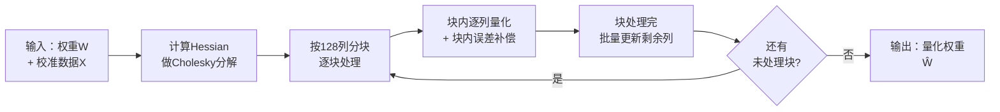

# GPTQ：生成式预训练模型的精确后训练量化 深度精读

> **论文标题**: GPTQ: Accurate Post-Training Quantization for Generative Pre-trained Transformers
> **作者**: Elias Frantar, Saleh Ashkboos, Torsten Hoefler, Dan Alistarh
> **机构**: IST Austria, ETH Zurich, Neural Magic
> **发表**: arXiv:2210.17323, 2022（ICLR 2023）
> **代码**: https://github.com/IST-DASLab/gptq

**标签**: `#模型量化` `#PTQ` `#INT4` `#INT3` `#Hessian` `#GPTQ` `#大模型推理`

**知识链接**：
- [模型权重量化基础：INT8、PTQ/QAT、GPTQ 与 AWQ](/前置知识/005k_前置知识_模型权重量化INT8_GPTQ_AWQ基础) — 本文的量化基础数学（scale/zero-point）、PTQ vs QAT 的区别，以及 GPTQ 直觉的先导讲解，本文不再重复
- [数值精度：FP32、FP16、BF16、TF32](/前置知识/003d_前置知识_数值精度FP32_FP16_BF16_TF32) — GPTQ 的量化对象是 FP16 存储的权重
- [数值优化基础：梯度下降与牛顿法](/前置知识/003c_前置知识_数值优化基础_梯度下降与牛顿法) — 理解 Hessian 矩阵（二阶导数）在优化中的角色
- [神经网络量化技术全景综述](/论文综述/S30_神经网络量化技术全景综述) — 把 GPTQ 放进 PTQ/QAT/AWQ/GGUF 的完整技术图谱中系统对比

---

## 一、背景与动机

### 1.1 大模型推理的显存墙

2022 年前后，GPT-3（1750 亿参数）、OPT-175B、BLOOM-176B 等模型陆续开源或发布。这些模型光是存储权重就是天文数字——OPT-175B 用 FP16（每参数 2 字节，参见[数值精度前置知识](/前置知识/003d_前置知识_数值精度FP32_FP16_BF16_TF32)）存储需要 326 GB 显存，远超单张 GPU（当时最高端的 A100 也只有 80GB）。这意味着仅仅是把模型跑起来做推理（不涉及训练），就必须用多卡分布式部署，门槛极高。

一个自然的想法是压缩模型——用[模型权重量化](/前置知识/005k_前置知识_模型权重量化INT8_GPTQ_AWQ基础)把权重从 FP16 压到更低比特的整数。但在 GPTQ 出现之前，业界对超大模型的量化方法非常有限：像 ZeroQuant、LLM.int8()、nuQmm 这些方法本质上都只是 **RTN**（Round-To-Nearest，把每个权重独立地就近取整，参见[前置知识](/前置知识/005k_前置知识_模型权重量化INT8_GPTQ_AWQ基础#41-朴素-ptq-rtn-的问题)），原因很直接：更精确的 PTQ 方法（如 AdaRound、BRECQ、OBQ）虽然在几千万参数的小模型上效果很好，但它们的计算复杂度太高，根本无法扩展到百亿甚至千亿参数的模型上。

### 1.2 GPTQ 要解决的核心矛盾

GPTQ 论文一句话点出了当时的核心矛盾：

> **精确的 PTQ 方法（如 OBQ）复杂度太高、跑不动大模型；能跑动大模型的方法（RTN）在低比特下精度损失太大。**

以 OBQ（Optimal Brain Quantization，GPTQ 直接基于它改进而来）为例，量化一个 $d_{\text{row}}\times d_{\text{col}}$ 的权重矩阵，时间复杂度是 $O(d_{\text{row}}\cdot d_{\text{col}}^3)$——立方级依赖矩阵的列数。OBQ 量化 ResNet-50（2500 万参数）需要约 1 小时；如果直接把这个方法套用到 1750 亿参数的模型上，复杂度的立方增长会让运行时间膨胀到不可接受的程度（数量级上是几百到几千倍的模型规模差异，而复杂度是三次方关系）。

GPTQ 的目标非常明确：**设计一种一次性（one-shot，即不需要重新训练）的权重量化方法，既要足够精确（把模型压缩到 3-4 bit 而精度几乎不掉），又要足够高效（能在几个 GPU-小时内量化千亿参数模型）**。论文摘要给出的核心成果：**GPTQ 能在约 4 个 GPU-小时内把 1750 亿参数的模型量化到 3-4 bit，相对未压缩基线的精度损失几乎可以忽略**。

---

## 二、准备知识：逐层量化与 OBQ

### 2.1 逐层量化的目标函数

GPTQ 沿用了此前一系列 PTQ 方法（AdaRound、BRECQ、OBQ 等）共同的框架：**逐层**（layer-by-layer）量化，每一层单独求解一个"重构问题"。设某个线性层的权重矩阵是 $\mathbf{W}$，用一小批（通常几百条）校准数据跑过网络后，记录下这一层实际接收到的输入 $\mathbf{X}$。目标是找到一个量化后的权重矩阵 $\hat{\mathbf{W}}$，使它和原始权重在**同样输入下产生的输出**尽量接近：

$$
\arg\min_{\hat{\mathbf{W}}} \|\mathbf{W}\mathbf{X} - \hat{\mathbf{W}}\mathbf{X}\|_2^2
$$

**这个公式在做什么**：不直接要求"量化后的权重数值和原权重数值接近"，而是要求"量化后这一层算出来的输出结果和原来的输出结果接近"——这是一个更贴近实际效果的优化目标。

::: details 📐 公式详解（点击展开）

| 子表达式 | 它是谁 | 它在干嘛 |
|---------|--------|---------|
| $\mathbf{W}$ | **原始的浮点权重矩阵** | 这一层量化之前的完整权重,FP16 精度 |
| $\mathbf{X}$ | **少量校准数据流过网络后,这一层实际收到的输入** | 不是随便造的数据,是真实网络在处理校准样本时,这一层看到的输入分布 |
| $\mathbf{W}\mathbf{X}$ | **量化前的真实输出** | 这一层原本应该算出来的结果,是我们要逼近的"标准答案" |
| $\hat{\mathbf{W}}\mathbf{X}$ | **量化后的输出** | 用压缩过的权重 $\hat{\mathbf{W}}$、同样的输入,算出来的结果 |
| $\|\cdot\|_2^2$ | **误差打分尺** | 用平方误差衡量两个输出矩阵差多远,差得越多分数越高 |
| $\arg\min_{\hat{\mathbf{W}}}$ | **在所有满足量化网格约束的 $\hat{\mathbf{W}}$ 里找最优解** | 不是任意浮点矩阵都行,$\hat{\mathbf{W}}$ 的每个元素必须落在提前定好的量化网格上 |

**用人话读**："在所有满足整数网格约束的量化权重里,找一个使得'量化后这层的输出'和'量化前这层的输出'差距最小的方案。"

**为什么是这个形式**：直接最小化权重数值本身的误差（$\|\mathbf{W}-\hat{\mathbf{W}}\|$）看起来更直观，但实际决定模型质量好坏的是**输出**，不是权重数值本身——某些权重数值差一点，如果它对应的输入激活值很小，对最终输出几乎没有影响；反过来数值差得不多，如果对应输入激活值很大，输出误差可能很显著。把 $\mathbf{X}$ 也放进目标函数里，能让优化过程"知道"每个权重的重要性要结合它实际参与计算时的贡献来看，而不是孤立地看权重数值。
:::

### 2.2 OBQ：GPTQ 的直接前身

GPTQ 建立在 **OBQ**（Optimal Brain Quantization，一种把经典的"最优脑手术"剪枝方法推广到量化场景的方法）之上。OBQ 求解上面这个逐层重构问题的思路是：**把权重矩阵的每一行（对应输出神经元的一个维度）当作独立的子问题**，逐个权重地量化——每次都在当前这一行里，挑一个"现在量化代价最小"的权重先量化，量化完之后，立刻调整这一行里**还没被量化**的其他权重，去补偿刚才这次量化引入的误差。

这个"挑一个权重量化 + 调整剩余权重补偿误差"的具体计算，依赖这个重构问题的二阶信息——Hessian 矩阵 $\mathbf{H}_F = 2\mathbf{X}_F\mathbf{X}_F^\top$（$F$ 表示当前还未被量化的权重集合）。OBQ 给出的贪心最优解：

$$
w_q = \arg\min_{w_q} \frac{(\text{quant}(w_q)-w_q)^2}{[\mathbf{H}_F^{-1}]_{qq}}, \qquad \boldsymbol{\delta}_F = -\frac{w_q - \text{quant}(w_q)}{[\mathbf{H}_F^{-1}]_{qq}}\cdot(\mathbf{H}_F^{-1})_{:,q}
$$

**这个公式在做什么**：先找出"现在量化哪个权重造成的额外误差最小"，然后精确算出——为了抵消这次量化造成的误差，其余还没量化的权重应该各自调整多少。

::: details 📐 公式详解（点击展开）

| 子表达式 | 它是谁 | 它在干嘛 |
|---------|--------|---------|
| $\text{quant}(w_q)$ | **权重 $w_q$ 就近取整后的量化结果** | 把浮点值 round 到最近的量化网格点(参见[前置知识](/前置知识/005k_前置知识_模型权重量化INT8_GPTQ_AWQ基础#22-量化公式)的 $q=\text{round}(x/s)+z$) |
| $(\text{quant}(w_q)-w_q)^2$ | **这次量化造成的原始误差** | 量化前后数值差的平方,越大说明这次取整损失越大 |
| $[\mathbf{H}_F^{-1}]_{qq}$ | **这个权重在当前 loss 曲面上的"敏感度倒数"** | Hessian 逆矩阵在 $q$ 位置的对角元素,数值越大说明这个方向的曲面越平坦——量化误差在这个方向造成的实际 loss 影响越小(可以"容忍"更大的原始误差) |
| $\arg\min_{w_q}$ 整个式子 | **"选谁先量化"的裁判** | 在所有还没量化的权重里,挑一个使得"误差/敏感度倒数"最小的——也就是挑一个量化代价最小、对整体 loss 影响最轻的权重先处理 |
| $w_q-\text{quant}(w_q)$ | **量化引入的带符号误差** | 和上面的平方误差是同一个量,但保留符号,用来确定补偿的方向 |
| $(\mathbf{H}_F^{-1})_{:,q}$ | **误差传播的方向盘** | Hessian 逆矩阵的第 $q$ 列,描述"如果 $q$ 这个位置出现误差,该往哪个方向调整其余权重来抵消它" |
| $\boldsymbol{\delta}_F$ | **给剩余未量化权重的调整量** | 用上面几项算出的具体数值,加到每个还未量化的权重上,让它们主动分担、抵消刚量化的这个权重带来的误差 |

**用人话读**："每一步都挑一个'现在量化代价最小'的权重先处理，然后精确计算出该给剩下的权重加多少补偿，让整体误差保持最低。"

**为什么是这个形式**：这套公式来自把"最优脑手术"（Optimal Brain Surgeon，一种利用二阶信息做参数剪枝的经典方法）的数学框架从"删掉一个权重"替换成"把一个权重挪到最近的量化网格点"——两者本质上都是"对参数做一个不可逆的小改动，然后用二阶信息计算怎么调整剩余参数把这次改动的负面影响降到最低"，是同一套数学工具的两种应用。
:::

**OBQ 的问题**：这套方法效果很好，但代价高昂——上面公式里的 $\mathbf{H}_F^{-1}$ 需要在每量化完一个权重后重新计算（因为集合 $F$ 变小了一个元素），OBQ 用高斯消元每次更新这个逆矩阵：

$$
\mathbf{H}_{-q}^{-1} = \left(\mathbf{H}^{-1} - \frac{1}{[\mathbf{H}^{-1}]_{qq}}\mathbf{H}^{-1}_{:,q}\mathbf{H}^{-1}_{q,:}\right)_{-p}
$$

**这个公式在做什么**：从当前的 Hessian 逆矩阵里,"移除"刚刚被量化的那个权重对应的行和列,得到下一步该用的、规模缩小了一点的新逆矩阵。

::: details 📐 公式详解（点击展开）

| 子表达式 | 它是谁 | 它在干嘛 |
|---------|--------|---------|
| $\mathbf{H}^{-1}$ | **当前(还包含 $q$ 这一维)的 Hessian 逆矩阵** | 描述所有还未量化权重之间的二阶关系 |
| $\mathbf{H}^{-1}_{:,q}\mathbf{H}^{-1}_{q,:}$ | **$q$ 这一维对其他维度的关联模式** | 第 $q$ 列和第 $q$ 行的外积,捕捉"$q$ 这一维和其余维度是怎么耦合的" |
| $\frac{1}{[\mathbf{H}^{-1}]_{qq}}$ | **归一化系数** | 用 $q$ 自身的对角元素归一化,这是矩阵求逆更新公式(舒尔补/高斯消元)里标准的缩放项 |
| 减法整体 | **去除耦合影响** | 从原矩阵里减掉"$q$ 这一维带来的贡献",相当于把 $q$ 这一维的信息完全剔除干净 |
| $(\cdot)_{-p}$ | **物理移除对应行列** | 计算完之后,真正把第 $q$ 行第 $q$ 列从矩阵里删掉,得到一个维度小了 1 的新逆矩阵,供下一步使用 |

**用人话读**："每量化完一个权重，就把它从整个二阶关系网络里精确剔除，得到一个稍微小一点的新逆矩阵，供下一轮使用。"

**为什么是这个形式**：直接对缩小后的子矩阵重新求逆,复杂度是矩阵求逆本身的复杂度(通常是维度的三次方),重复做几万次是不可接受的;而用这种"增量更新"的公式,每一步只需要一次矩阵乘法（外积）,复杂度大幅降低。但即便如此,OBQ 对每一行都要独立走一遍这个流程,总复杂度对矩阵列数仍然是三次方级别——这正是 GPTQ 要解决的性能瓶颈。
:::

OBQ 对一个 $d_{\text{row}}\times d_{\text{col}}$ 矩阵的总运行时间复杂度是 $O(d_{\text{row}}\cdot d_{\text{col}}^3)$——因为每一行都要独立走一遍"逐权重量化+更新逆矩阵"的完整流程。这个复杂度在小模型（几千万参数）上是几十分钟到 1 小时，但线性放大到百亿参数模型上，运行时间会膨胀到不可接受的程度。

---

## 三、GPTQ 的三个关键改进

GPTQ 相对 OBQ 做了三处关键改动，每一处都直指"让这套方法能跑在百亿甚至千亿参数模型上"这个目标。

### 3.1 改进一：任意顺序量化（Arbitrary Order Insight）

OBQ 每次都贪心地挑"当前量化代价最小"的权重先处理（2.2 节公式里的 $\arg\min$）。GPTQ 的作者发现一个关键现象：**这种精心挑选顺序带来的收益，在大模型的大矩阵上其实很小**——按照贪心顺序量化和按照任意固定顺序（比如简单地从第一列到最后一列）量化，最终的总误差差别不大。

这个现象背后的直觉是：贪心策略确实能让"个别权重的量化误差"更小，但这些权重通常会被排到量化顺序的**后面**（因为它们一开始被判定为"量化代价大"，需要更多轮的误差补偿垫底才轮到它们）；而排到后面意味着能用来补偿误差的"剩余未量化权重"数量已经很少了，好处和坏处相互抵消，最终对大矩阵、大模型来说，效果和固定顺序相差无几。

这个发现的价值在于：**如果所有输出行都按照同一个固定顺序（比如都从第一列到最后一列）量化，那么"当前还未量化的权重集合" $F$ 对所有行都是一样的**——因为 $\mathbf{H}_F$ 只依赖于输入 $\mathbf{X}$（对所有输出行是共享的），不依赖具体的权重取值。这意味着 Hessian 逆矩阵的更新，只需要按列（$d_{\text{col}}$ 次）做一次，而不需要像 OBQ 那样按每个权重（$d_{\text{row}}\times d_{\text{col}}$ 次）都做一次：

$$
O(d_{\text{row}}\cdot d_{\text{col}}^3) \ \longrightarrow\ O(\max\{d_{\text{row}}\cdot d_{\text{col}}^2,\ d_{\text{col}}^3\})
$$

**这个公式在做什么**：展示"固定量化顺序"这一个改动，把总运行时间从对列数的三次方（还要再乘一遍行数）降到了一个量级低得多的上界——这是 GPTQ 相对 OBQ 的核心效率突破。

::: details 📐 公式详解（点击展开）

| 子表达式 | 它是谁 | 它在干嘛 |
|---------|--------|---------|
| $O(d_{\text{row}}\cdot d_{\text{col}}^3)$ | **OBQ 的原始代价** | 每一行都要独立跑一遍"逐权重量化+更新逆矩阵"，逆矩阵更新本身对列数是三次方级别，再乘上行数 |
| $O(\max\{d_{\text{row}}\cdot d_{\text{col}}^2,\ d_{\text{col}}^3\})$ | **GPTQ 的新代价** | 因为所有行共享同一个量化顺序，Hessian 逆矩阵只需按列更新一次（而不是按每个权重更新一次），代价降为两项中较大的那个 |
| $\min\{d_{\text{row}}, d_{\text{col}}\}$ 倍 | **加速比** | 新旧复杂度之比，矩阵越大（行列数越多）加速越明显 |

**用人话读**："只要所有输出行都按同一个固定顺序量化，更新 Hessian 逆矩阵的工作就能从'每个权重都做一次'降到'每一列只做一次'，省下了几个数量级的计算量。"

**为什么可以这样简化**：因为固定顺序量化后，"当前还未量化的权重集合"这个信息对所有行都完全一样（它只依赖共享的输入 $\mathbf{X}$，不依赖某一行具体的权重取值），所以逆矩阵的更新可以只算一份、所有行共用，而不必对每一行都各算一遍。
:::

复杂度降低了 $\min\{d_{\text{row}}, d_{\text{col}}\}$ 倍——对于动辄几千甚至上万维的大模型权重矩阵，这是几个数量级的加速。这是 GPTQ 相对 OBQ 最核心的效率突破，后面两个改进是为了让这个思路在实际硬件上真正跑得快、跑得稳。

### 3.2 改进二：懒惰批量更新（Lazy Batch-Updates）

改进一降低了理论复杂度，但直接照搬公式实现在真实 GPU 上仍然很慢。原因是：Hessian 逆矩阵更新公式（2.2 节最后一个公式）对一个可能非常大的矩阵，每个位置只做几次浮点运算就要更新一遍——这种"计算量小、但要访问的内存量大"的模式，会被显存带宽而不是算力卡住，无法充分利用 GPU 的并行计算能力。

GPTQ 的解决办法基于一个观察：**某一列的最终量化结果，只取决于这一列之前收到的更新，后面列的更新对它毫无影响**。这意味着可以把更新"攒起来一批做"：GPTQ 每次处理 $B=128$ 列作为一个块，块内的更新只影响这个块自己和 Hessian 逆矩阵对应的 $B\times B$ 子块；只有整个块量化完毕后，才把这批更新一次性同步应用到后面所有列和完整的逆矩阵上。这种"懒惰"（延迟同步）策略没有改变理论计算量，但让每次真正的矩阵运算规模更大、更适合 GPU 并行，实测能带来一个数量级的实际速度提升。

### 3.3 改进三：Cholesky 分解提升数值稳定性

第三个问题是数值稳定性。GPTQ 观察到：随着模型规模变大，2.2 节 Hessian 逆矩阵更新公式的反复应用会累积浮点误差，导致 $\mathbf{H}_F^{-1}$ 在某些层上变得**不定**（数学上应该是正定矩阵，但数值误差导致它偏离这个性质）。一旦出现这种情况，量化过程会朝着错误的方向"疯狂补偿"，导致某一层被完全量化错误。论文观察到：**这个问题的发生概率随模型规模增大而增大**——对几十亿参数以上的模型，几乎必然会在某些层遇到这个问题。

解决办法：GPTQ 发现，量化第 $q$ 个权重时唯一需要用到的信息，其实只是 $\mathbf{H}_F^{-1}$ 中第 $q$ 行从对角线开始的部分——而这恰好正是对 Hessian 做 **Cholesky 分解**（一种专门针对正定矩阵、数值稳定性远好于反复求逆的分解方法）之后自然得到的信息。所以 GPTQ 改用一次性、数值稳定的 Cholesky 分解，提前算出所有量化步骤需要的信息，避免了反复矩阵求逆导致的数值误差累积。配合对 Hessian 对角线加一个小的阻尼项（论文取平均对角值的 1%），GPTQ 能稳定地在千亿参数模型上运行，不再出现某层量化崩溃的情况。

### 3.4 完整算法流程

把三个改进组合起来，GPTQ 的完整流程可以概括为：

逐层运行这个流程（先量化第一层，用量化后的层重新过一遍校准数据算出下一层的真实输入，再量化下一层，以此类推——这样的"链式"量化能让每一层的量化过程建立在前面层已经量化过的实际输入上，而不是理想化的原始输入），就得到了整个模型的量化结果。

---

## 四、实验结果：真实数字说话

### 4.1 运行时间：GPTQ 到底有多快

论文实测（单张 NVIDIA A100，80GB 显存）的完整模型量化耗时：

| 模型 | 参数量 | GPTQ 量化耗时 |
|------|--------|--------------|
| BLOOM | 1.7B | 2.9 分钟 |
| BLOOM | 3B | 5.2 分钟 |
| BLOOM | 7.1B | 10.0 分钟 |
| BLOOM | 176B | 3.8 小时 |
| OPT | 175B | 约 4 小时 |

作为对比，论文提到此前基于直通估计的方法 ZeroQuant-LKD 量化一个 13 亿参数模型就需要约 3 小时——如果线性外推到 175B 规模，需要几百小时（数周）。GPTQ 量化规模大 100 多倍的模型，只需要约 4 小时，这正是"三个改进"带来的复杂度和效率突破的直接体现。

### 4.2 精度：4-bit 几乎无损，3-bit 明显优于 RTN

论文在 OPT 和 BLOOM 全系列模型上，用 WikiText2 数据集的困惑度（perplexity，越低越好，是衡量语言模型生成质量的标准指标）评估量化前后的效果差异。摘取 OPT-175B 和 BLOOM-176B（两个当时最大的公开可用模型）的结果：

| 方法 | 位宽 | OPT-175B (WikiText2) | BLOOM-176B (WikiText2) |
|------|------|----------------------|--------------------------|
| FP16 基线 | 16 | 8.34 | 8.11 |
| RTN | 4 | 10.54 | 8.37 |
| **GPTQ** | 4 | **8.37** | **8.21** |
| RTN | 3 | 7.3×10³（完全崩溃） | 571（严重退化） |
| **GPTQ** | 3 | **8.68** | **8.64** |

在 4-bit 下，GPTQ 相对 FP16 基线只损失 0.03（OPT-175B）到 0.10（BLOOM-176B）的困惑度，几乎可以忽略；RTN 在同样的 4-bit 下已经出现明显损失（OPT-175B 从 8.34 掉到 10.54）。到了 3-bit，两者的差距变得极其悬殊：**RTN 直接失效**（OPT-175B 困惑度从 8.34 飙升到 7300，模型基本失去正常生成文本的能力），而 **GPTQ 依然保持在 8.68**，只比 FP16 基线高 0.34。

这个结果和本文[前置知识](/前置知识/005k_前置知识_模型权重量化INT8_GPTQ_AWQ基础#六二量化误差随位宽的变化rtn-会崩gptq-不会)中展示的图完全对应——朴素 RTN 在极低比特下会彻底失效，而 GPTQ 精心设计的误差补偿机制能把同样的比特预算用出好得多的效果。

论文还发现一个有趣的规律：**总体上更大的模型更容易被量化**（困惑度损失更小），这对实际应用是个好消息——恰恰是最需要压缩（因为最大）的模型，压缩起来也相对最"安全"。

### 4.3 分组量化（Grouping）进一步提升精度

GPTQ 兼容一种叫**分组量化**（grouping）的技巧：不是给整个权重矩阵统一算一套 scale/zero-point，而是把每连续 $g$ 个权重（比如 $g=128$）分成一组，每组独立算自己的 scale/zero-point。分组粒度更细，量化网格能更好地适配局部的数值分布，代价是需要额外存储更多组的 scale/zero-point 参数（每组多出约 0.15-0.02 额外 bit，取决于组大小）。论文实测：在 3-bit 量化下，分组大小 1024 能把困惑度平均改善约 0.2，分组大小 128 能再改善约 0.1，几乎追平未压缩基线。

### 4.4 极限压缩：2-bit 和三值量化

结合分组量化，GPTQ 甚至能把权重压到平均 2-bit 左右仍保持可用的精度。论文报告，OPT-175B 在约 2.2-bit（分组大小 128）下困惑度增加不到 1.5；在约 2.6-bit（分组大小 32）下困惑度只增加 0.6-0.7，接近普通 3-bit 的水平。如果进一步把分组缩小到 8，甚至可以做三值量化（权重只能取 $-1, 0, +1$ 三个值），在 OPT-175B 上困惑度达到 9.20，相对基线只损失不到 1 点——这样极端的压缩率虽然实用性有限（需要专用硬件如 FPGA 才能充分发挥），但证明了 GPTQ 这套误差补偿框架的鲁棒性远超预期。

### 4.5 实际部署收益：更少的 GPU，更低的延迟

GPTQ 论文最有说服力的部分是把理论压缩转化为真实的部署收益。把 OPT-175B 量化到 3-bit 后，模型权重只占约 63GB 显存——**第一次能把这个 1750 亿参数模型塞进单张 80GB 的 A100**（原本 FP16 需要 5 张 80GB 显卡，业界此前最好的 8-bit 方法 LLM.int8() 也需要 3 张显卡）。

在生成任务的推理延迟上（batch size 为 1，逐 token 生成，这种场景通常受限于显存带宽而不是算力），论文实现了专门的量化矩阵-全精度向量乘法内核，动态反量化权重：

| 硬件 | FP16 baseline（多卡） | GPTQ 3-bit（单/双卡） | 加速比 |
|------|------------------------|--------------------------|--------|
| NVIDIA A100 (80GB) | 230 ms/token | 71 ms/token | 约 3.25× |
| NVIDIA A6000 (48GB) | 589 ms/token | 130 ms/token | 约 4.5× |

有意思的是，更便宜、显存带宽更低的 A6000 反而获得了更大的加速比——因为这类内核针对的正是"内存带宽瓶颈"，带宽本来就低的硬件，从"少读点数据"这件事上获益更明显。这也解释了为什么量化技术对边缘部署、消费级显卡格外有价值。

### 4.6 GPTQ 的局限性（论文自己承认的）

论文在总结部分坦诚地列出了几个局限：

1. **只加速了内存搬运，没有加速实际的乘法计算**——因为当时主流硬件不支持混合精度（如 FP16 乘 INT4）的原生矩阵乘法运算，GPTQ 的内核策略是"动态反量化再计算"，节省的是读取权重的时间，不是乘法本身的时间。
2. **没有涉及激活值量化**——GPTQ 只量化权重，激活值仍以 FP16 参与计算。这对内存受限（memory-bound）场景足够了，但如果要进一步压榨算力受限场景的性能，需要配合激活量化的方法（属于另一条技术路线,即 W8A8 全量化）。

---

## 五、GPTQ 与前置知识、AWQ 的关系回顾

回到[模型权重量化前置知识](/前置知识/005k_前置知识_模型权重量化INT8_GPTQ_AWQ基础#四gptq-的核心直觉用二阶信息做误差补偿)里给出的直觉——"逐列量化 + 用未量化列补偿已量化列的误差"——本文第三节完整展开了这个直觉背后的数学机制：Hessian 逆矩阵告诉我们"往哪个方向调整剩余权重能最大程度抵消误差"，任意顺序量化的洞察让这套机制的计算复杂度从三次方降到接近二次方，懒惰批量更新和 Cholesky 分解则是让这一切能在真实 GPU 上稳定、高效地跑起来的工程手段。

与之相对的 AWQ（[前置知识第五节](/前置知识/005k_前置知识_模型权重量化INT8_GPTQ_AWQ基础#五awq-的核心直觉不是所有权重都一样重要)），走的是完全不同的路线——不依赖二阶信息和逐列误差补偿，而是通过观察激活值分布找出"重要权重通道"，用简单的逐通道缩放来保护它们。AWQ 论文的实验（在 LLaMA/OPT 系列上）显示，AWQ 在多数设置下困惑度略优于 GPTQ，且因为不依赖反向传播式的重构过程，AWQ 对校准数据的分布更鲁棒、需要的校准数据量更小（AWQ 论文报告只需 16 条校准序列即可达到 GPTQ 需要 192 条才能达到的效果）。两种方法并不互斥，GPTQ 论文之后的实践中，也出现了两者结合使用的方案。这些对比的完整图景，参见[神经网络量化技术全景综述](/论文综述/S30_神经网络量化技术全景综述)。

---

## 六、总结

| 维度 | 核心内容 |
|------|---------|
| 问题 | 千亿参数模型的 PTQ：精确方法（OBQ）跑不动，能跑动的方法（RTN）精度损失大 |
| 核心思路 | 逐列量化 + 用 Hessian 二阶信息让未量化列补偿已量化列的误差（继承自 OBQ） |
| 改进一 | 任意顺序量化：放弃贪心排序，让 Hessian 逆矩阵更新对所有行共享，复杂度从 $O(d_{\text{row}}d_{\text{col}}^3)$ 降到 $O(\max\{d_{\text{row}}d_{\text{col}}^2, d_{\text{col}}^3\})$ |
| 改进二 | 懒惰批量更新：128 列为一批，减少内存访问瓶颈，实测提速一个数量级 |
| 改进三 | Cholesky 分解：一次性稳定地算出所有量化步骤需要的二阶信息，避免数值误差累积导致的量化崩溃 |
| 关键结果 | OPT-175B/BLOOM-176B 量化到 4-bit 仅需约 4 GPU 小时，困惑度损失 ≤0.25；3-bit 时 RTN 完全崩溃而 GPTQ 依然可用 |
| 部署收益 | OPT-175B 3-bit 量化后可塞进单张 A100（原需 5 张），推理延迟降低 3.25×（A100）到 4.5×（A6000） |
| 局限 | 只加速内存搬运不加速矩阵乘法本身；不涉及激活值量化 |

## 延伸阅读

- [模型权重量化基础：INT8、PTQ/QAT、GPTQ 与 AWQ](/前置知识/005k_前置知识_模型权重量化INT8_GPTQ_AWQ基础) — 本文的直觉先导
- [神经网络量化技术全景综述](/论文综述/S30_神经网络量化技术全景综述) — GPTQ 在整个量化技术图谱中的位置，及与 AWQ、GGUF 生态的系统对比
- [数值优化基础：梯度下降与牛顿法](/前置知识/003c_前置知识_数值优化基础_梯度下降与牛顿法) — Hessian 矩阵在二阶优化方法中的通用角色
- Frantar et al., "GPTQ: Accurate Post-Training Quantization for Generative Pre-trained Transformers", arXiv:2210.17323, 2022
- Frantar et al., "Optimal Brain Compression: A Framework for Accurate Post-Training Quantization and Pruning" (OBQ 原始论文), NeurIPS 2022
- Lin et al., "AWQ: Activation-aware Weight Quantization for LLM Compression and Acceleration", arXiv:2306.00978, 2023
