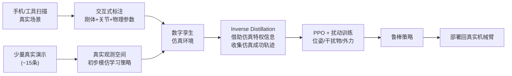

# RialTo：Real-to-Sim-to-Real 数字孪生强化学习 深度精读

> **论文标题**: Reconciling Reality through Simulation: A Real-to-Sim-to-Real Approach for Robust Manipulation
> **作者**: Marcel Torne, Anthony Simeonov, Zechu Li, April Chan, Tao Chen, Abhishek Gupta, Pulkit Agrawal
> **机构**: MIT CSAIL (Improbable AI Lab), University of Washington
> **发表**: RSS 2024，arXiv:2403.03949
> **项目页**: [real-to-sim-to-real.github.io/RialTo](https://real-to-sim-to-real.github.io/RialTo/)

**知识链接**：
- [Sim-to-Real 迁移综述](/论文综述/S04_Sim_to_Real迁移综述) — 域随机化、系统辨识、Teacher-Student 等基础方法全景
- [机器人模仿学习综述](/论文综述/S02_机器人模仿学习综述) — 行为克隆的能力上限，本文要解决的起点问题
- [行为克隆与 RL 微调范式](/前置知识/000d_前置知识_行为克隆与RL微调范式) — 先模仿再强化的通用范式
- [策略梯度与 PPO](/前置知识/000a_前置知识_策略梯度与PPO) — RialTo 在仿真中用的 RL 算法
- [知识蒸馏基础](/前置知识/000v_前置知识_知识蒸馏基础) — "inverse distillation" 的对比参照

---

## 贯穿全文的例子

> **场景**：你家里有一台机械臂，想让它学会一件很具体的家务——从架子上把一本书放到指定位置。你只演示了 15 次（用手柄遥操作机械臂完成这个动作），但你希望这台机械臂在你随手换了书的摆放位置、旁边多了个水杯、有人不小心碰了它一下的情况下，依然能稳定完成任务。
>
> 直接用这 15 条演示做行为克隆，策略会在"演示时的那种摆放"下表现不错，但换个位置就可能直接失败——因为它没见过足够多样的情况。而如果想用强化学习让它见多识广，又不可能让机械臂在你家里反复试错几万次（会撞坏书架、打翻水杯）。RialTo 要解决的就是这个矛盾。

---

## 一、这篇论文解决什么问题

### 1.1 模仿学习和强化学习各自卡在哪

先把两条现成的路摆出来，看看它们分别卡在哪一步：

**路线一：模仿学习（[行为克隆](/前置知识/000d_前置知识_行为克隆与RL微调范式)）**。人演示几十次，策略直接学"看到这个画面就输出这个动作"。问题是：演示者不可能穷举所有物体摆放方式、所有光照条件、所有可能被碰到的角度——策略只在演示分布附近可靠，稍微偏离就容易失败。想让它更鲁棒，唯一办法是让人**收集更多样的演示**，但这是纯人力活，成本随鲁棒性要求线性甚至超线性增长。

**路线二：强化学习**。让策略自己在环境里试错，探索出对各种扰动都管用的行为。问题是：真实世界里做 RL 意味着机械臂要经历大量随机初始化、大量失败尝试——磨损硬件、可能损坏周围物体，而且慢（真实世界一步就是几百毫秒，仿真里可以并行几千倍速度跑）。

一句话总结这个矛盾：**模仿学习安全但不够鲁棒，强化学习能鲁棒但在真实世界里不安全、不高效。**

### 1.2 RialTo 的解法：把 RL 挪到"和真实场景一模一样"的仿真里做

RialTo 的核心思路只有一句话：**用手机把你家里的具体场景扫描重建成一个仿真环境（数字孪生），在这个数字孪生里用 RL 训练出鲁棒策略，再把策略部署回真实机械臂。**

这解决了什么？

- **安全性**：RL 探索、试错、随机初始化全部发生在仿真里，不会撞坏你家里的东西。
- **效率**：仿真可以 GPU 并行跑几千个环境副本，几个小时的仿真训练相当于真实世界几十天到上百天的试错经验。
- **鲁棒性来源**：因为数字孪生场景可以在仿真里随意扰动（物体位置、光照、施加外力），RL 探索到的策略天然对这些扰动鲁棒——这一步恰好补上了模仿学习缺的那块。

这个思路属于 [Sim-to-Real 迁移综述](/论文综述/S04_Sim_to_Real迁移综述) 里没有单独展开的一条技术路线：**不是靠域随机化"猜"出一个能覆盖真实世界的仿真参数范围，而是先把真实场景本身重建进仿真，让仿真"长得就是"你的真实环境**——这就是 Real-to-Sim-to-Real（先从真实世界出发建仿真，再把仿真里学到的策略送回真实世界）的核心含义，区别于传统 Sim-to-Real 从"通用仿真器 + 域随机化"出发的路线。

### 1.3 三个环节各自解决什么问题

RialTo 的整个 pipeline 拆成三段，每一段单独解决一个具体障碍：

| 环节 | 要解决的具体障碍 | 解法 |
|------|-----------------|------|
| ① 数字孪生构建 | 建一个仿真场景通常需要 3D 建模师手工搭建几天 | 用手机扫描 + 现成重建工具，几分钟到几十分钟出一个可交互仿真场景 |
| ② Inverse Distillation | 只有几条真实演示，RL 从零探索这个具体任务效率太低 | 把真实演示"倒灌"进仿真，先用它们里的特权信息学出一个仿真里的强策略 |
| ③ RL 鲁棒化训练 | 直接部署仿真里学到的策略，遇到扰动依然会失败 | 在仿真里对场景做扰动（随机位置、干扰物、外力），用 PPO 继续训练到鲁棒 |

后面三节逐一展开。

---

## 二、环节一：数字孪生构建——把真实场景搬进仿真

### 2.1 具体流程

用户拿手机（或用 NeRFStudio、ARCode、Polycam 这类现成的 3D 重建工具）对着要操作的场景扫一遍，比如书架、桌面、抽屉柜。重建出的是一个静态的几何+外观模型（网格 + 纹理）。

这个静态模型本身不能直接用来做机器人仿真——因为它没有"物理"：抽屉不能拉开、书不能被抓起来、机械臂碰到桌子不知道该弹开还是穿模。所以 RialTo 提供了一个交互式界面，让用户在重建出的场景上做二次标注：

- 给可移动的部件（书、杯子、抽屉面板）打上刚体标签和质量/摩擦系数的大致范围
- 给铰接部件（抽屉、柜门）加上关节（joint），指定旋转/滑动轴和限位
- 把机械臂的 URDF 模型放进这个重建场景里，对齐坐标系

**回到我们的例子**：书架和书都被扫描重建成了仿真里的刚体模型，书架的位置、大小、书本的初始摆放位置都和你真实家里的场景高度吻合——机械臂在仿真里"看到"的书架，几何上和它在真实世界里要面对的书架是同一个。

### 2.2 为什么这一步能大幅缩小 Reality Gap

对比传统"通用仿真器 + 域随机化"的路线：那种路线是搭一个**泛化的**厨房/客厅场景，然后用大范围的域随机化去覆盖"所有可能的真实场景"。RialTo 反过来——**先精确匹配你的具体场景，再在这个精确匹配的基础上做小范围随机化**，这样几何/外观层面的 Reality Gap 从一开始就被大幅压缩了，剩下需要域随机化去覆盖的只是物理参数（摩擦、质量）和任务层面的扰动（物体摆放位置、干扰物）。

---

## 三、环节二：Inverse Distillation——把真实演示"倒灌"进仿真

### 3.1 要解决的问题

数字孪生搭好了，但一个新问题出现：**直接在这个仿真场景里从零跑 RL，探索效率依然很低**——书架任务的成功轨迹在整个状态空间里是稀疏的，纯随机探索可能要跑很久才能碰到几次成功。

标准的解法是模仿学习：拿几条演示做初始化。但这里有个错位——你手头的演示是在**真实世界**里录的（遥操作机械臂的关节轨迹 + 相机图像），而策略要在**仿真**里训练。直接把真实演示的图像观测喂给仿真策略是不对的（图像域不匹配），直接把真实的关节轨迹在仿真里重放也不一定精确对齐（初始状态、物体位置有细微差异）。

### 3.2 RialTo 的解法："反向"蒸馏

常规的 [Teacher-Student 蒸馏](/论文综述/S04_Sim_to_Real迁移综述#5.3-teacher-student-蒸馏-重点) 方向是：教师用特权信息在仿真里学会任务，再把知识蒸馏给一个只能用真实可部署观测的学生。RialTo 的 Inverse Distillation 方向反过来——

1. 先用真实演示（少量，如 15 条）在真实世界的观测空间里训练出一个初步的模仿学习策略。
2. 把这个初步策略放到仿真里跑，但给它**特权信息**（仿真里可以直接读取的物体精确位姿、关节角度等，真实世界中无法直接获得）辅助纠正，让它在仿真里稳定地把任务完成的轨迹跑出来，收集一批"仿真里的成功演示"。
3. 用这批仿真成功演示作为 RL 训练的起点（[行为克隆](/前置知识/000d_前置知识_行为克隆与RL微调范式)初始化 + 后续 RL 微调），而不是从零随机探索。

**用一句话理解"反向"在哪**：常规蒸馏（详见 [Teacher-Student 蒸馏](/论文综述/S04_Sim_to_Real迁移综述#5.3-teacher-student-蒸馏-重点)）是"仿真教真实"（教师在仿真里学得好，教真实世界里的学生），这里是"真实教仿真"（先用真实世界的少量演示提供任务先验，反过来帮仿真里的策略更快学会）——方向刚好倒过来，所以叫 inverse distillation。

**回到我们的例子**：你遥操作录的 15 条"从书架取书"轨迹，先在真实观测空间里训出一个勉强能用的初始策略；这个策略被放进书架的数字孪生里，借助仿真中"上帝视角"的书本精确位置信息小幅修正，稳定地跑出一批高质量的仿真轨迹——这些轨迹比原始的 15 条真实演示丰富得多（因为仿真里可以低成本地多跑很多遍），构成了后续 RL 训练的良好起点。

---

## 四、环节三：RL 鲁棒化训练——在扰动下打磨策略

### 4.1 要解决的问题

有了仿真里的初始策略（继承自真实演示），如果直接部署到真实机械臂，遇到"物体位置和演示时不完全一样""旁边多了个没见过的东西""机械臂运行中被轻推了一下"这类扰动，初始策略大概率还是会失败——因为它本质上还是在模仿一小段演示轨迹，没有被逼着学会应对变化。

### 4.2 RialTo 的解法：在数字孪生里主动施加扰动，用 PPO 继续训练

在这个和真实场景高度吻合的仿真里，RialTo 系统性地引入三类递增的扰动强度，用 [PPO](/前置知识/000a_前置知识_策略梯度与PPO) 继续优化初始策略：

1. **物体位姿随机化**：书本、抽屉里的物体初始位置在合理范围内随机撒开，而不是固定在演示时的那个点。
2. **视觉干扰物**：往场景里加入训练时没见过的额外物体（干扰机器人的视觉判断，但不影响任务本身）。
3. **物理扰动**：在任务执行过程中对机械臂或物体施加随机外力（模拟"被人不小心碰了一下"）。

因为这一切都发生在**几何上精确匹配真实场景**的仿真里，GPU 并行仿真可以让机械臂在几个小时内经历几万次这类扰动下的尝试——这个规模的试错在真实世界是不可能安全完成的。PPO 在这个过程中持续优化策略，让它学会在扰动下依然完成任务的行为（比如：抓取前先用视觉重新确认物体精确位置，而不是死记硬背一个固定的抓取点）。

### 4.3 完整流程图

---

## 五、实验结果与关键发现

### 5.1 任务与评测设置

论文在 8 个真实机器人操作任务上评测，包括：把盘子稳定摆上架子、把书放上书架、把杯子放上架子、开抽屉、开柜子等。每个任务在三档递增难度下测试：

1. 仅随机化物体位姿
2. 加入视觉干扰物
3. 加入执行过程中的物理扰动

### 5.2 核心数据

**相比同样数据量的模仿学习，RialTo 在策略鲁棒性上提升超过 67%**——这个数字来自论文摘要，衡量口径是在三档扰动测试下的平均成功率提升幅度。关键对比：

| 方法 | 数据来源 | 鲁棒性来源 | 相对提升 |
|------|---------|-----------|---------|
| 纯模仿学习（同等演示数量） | 真实世界 15 条演示 | 无（依赖演示覆盖度） | 基线 |
| RialTo | 真实 15 条演示 + 仿真数字孪生 RL | 仿真中大规模扰动训练 | **+67% 以上** |

这个结果验证了论文的核心论点：**如果你只关心某一个具体环境下的鲁棒性，构建这个环境的数字孪生比试图靠海量真实数据"硬扛"出鲁棒性要高效得多。**

### 5.3 局限性（论文明确指出）

1. **训练耗时**：完整走完一遍 pipeline（扫描到最终部署）目前需要约 3 天，主要瓶胫在仿真 RL 训练阶段。
2. **变形体/流体建模困难**：当前的物理仿真器对布料、液体等非刚体的建模仍然粗糙，这类任务的数字孪生精度有限。
3. **每个新场景需要重新构建数字孪生**：这是 RialTo 方法论上的代价——它换来的是"对这一个具体场景极度鲁棒"，而不是"对任意场景都通用"。想扩展到新场景仍需要重复扫描+标注的流程（虽然论文中已经比手工建模快得多）。

---

## 六、和 Sim-to-Real 综述里已有方法的关系

### 6.1 RialTo 补上了综述里"域随机化范围怎么选"的一个答案

[Sim-to-Real 迁移综述](/论文综述/S04_Sim_to_Real迁移综述#2.5-自动域随机化-adr) 里提到，域随机化最大的痛点是"范围选窄了覆盖不到真实世界，选宽了训练不动"。RialTo 提供了另一种绕开这个痛点的方式：**不是去猜一个通用范围，而是先把仿真几何精确对齐到你的具体真实场景，这样几何层面根本不存在"要不要随机化"的问题——你随机化的只是任务相关的、你确实关心的那部分变化（物体摆放、光照、干扰物）**。

### 6.2 和 Teacher-Student / 系统辨识的位置关系

| 维度 | 系统辨识 | Teacher-Student | RialTo |
|------|---------|-----------------|--------|
| 校准对象 | 仿真的**物理参数**（摩擦、质量等标量） | 不校准仿真，而是让学生学会用受限观测模仿教师 | 校准仿真的**几何与场景布局**（整个场景的 3D 结构） |
| 数据需求 | 真实世界的状态转移数据 | 仿真里的特权信息 | 手机扫描 + 少量真实演示 |
| 解决的 gap | 动力学参数偏差 | 观测信息不对称 | 场景几何/外观偏差 + 动力学参数偏差（标注环节里带的物理参数范围） |

三者其实互补：RialTo 解决"仿真长得像不像真实场景"，系统辨识可以进一步校准 RialTo 数字孪生里的物理参数，Teacher-Student 的思路也可以叠加在 RialTo 的 pipeline 里（比如让仿真里的策略用特权信息训练，再蒸馏给只用真实可部署观测的学生）。

---

## 七、总结

RialTo 用一句话可以概括：**把手机扫描 + 3D 重建这件事，接到强化学习 pipeline 的最前端，把"给这一个具体真实场景造一个仿真"这件事从几天的人工建模缩短到分钟级，然后利用仿真的安全性和并行速度去补上模仿学习缺的鲁棒性。**

它的价值不在于提出了一个全新的 RL 算法（用的还是标准 PPO），而在于**重新组织了 Real-to-Sim-to-Real 这条 pipeline 的工程实现**：数字孪生构建解决"怎么快速建仿真"，Inverse Distillation 解决"怎么把宝贵的真实演示用上"，扰动训练解决"怎么在仿真里换来鲁棒性"。这三步组合起来，代表了 Sim-to-Real 领域一条与传统域随机化平行、以具体场景重建为核心的新路线。

---

## 延伸阅读

- [Sim-to-Real 迁移综述](/论文综述/S04_Sim_to_Real迁移综述) — 域随机化、系统辨识、Teacher-Student、RMA 等基础方法全景
- [DrEureka：LLM 引导的域随机化与奖励设计](./115_DrEureka_LLM引导域随机化与奖励设计) — 另一条自动化 Sim-to-Real 的路线，聚焦奖励和随机化参数的自动设计
- [ASAP：对齐仿真与真实物理的 Delta 动作模型](./116_ASAP_对齐仿真与真实物理的Delta动作模型) — 人形机器人场景下用真实数据直接校正仿真动力学的另一种思路
- Torne et al., *"Reconciling Reality through Simulation: A Real-to-Sim-to-Real Approach for Robust Manipulation"* (RSS, 2024)
- MIT News, *"Precision home robots learn with real-to-sim-to-real"* (2024)
