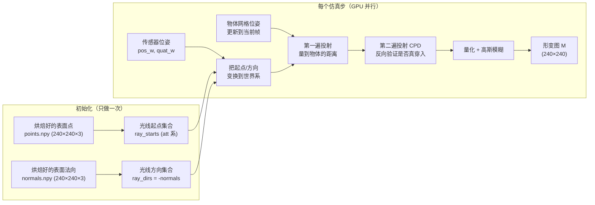
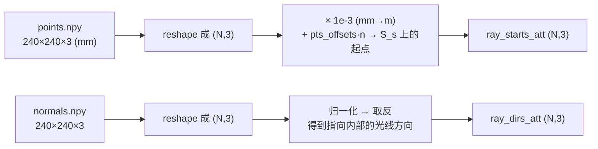
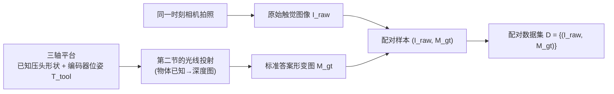

# TacMap：几何一致穿透深度图桥接触觉 Sim-to-Real 深度精读

> **论文标题**: Tacmap: Bridging the Tactile Sim-to-Real Gap via Geometry-Consistent Penetration Depth Map
> **作者**: Lei Su, Zhijie Peng, Renyuan Ren, Shengping Mao, Juan Du, Kaifeng Zhang, Xuezhou Zhu
> **机构**: Sharpa, HKUST, NVIDIA
> **发表**: arXiv:2602.21625, Feb 2026

**知识链接**：
- [编码器-解码器架构](/前置知识/009a_前置知识_编码器解码器架构) — 真实侧"图像→形变图"翻译网络的骨架，以及逐像素 MSE 损失的通用原理
- [IoU 交并比](/前置知识/009b_前置知识_IoU交并比) — 实验里 Deform IoU 指标的定义与几何直觉
- [惩罚法接触模型：弹簧阻尼与摩擦锥](/前置知识/006d_前置知识_惩罚法接触模型_弹簧阻尼与摩擦锥) — 穿透深度、符号距离场等概念的通用原理，本文的几何计算是这套原理在触觉传感器场景下的一个特化实现
- [TacSL：GPU 视触觉仿真与非对称蒸馏](./118_TacSL_GPU视触觉仿真与非对称蒸馏) — 同一问题（触觉 Sim-to-Real gap）的另一条路线：渲染逼真 RGB 图像 + 力场，本文与它形成直接对比
- [Touch Dexterity：二值触觉全手覆盖的手内旋转 RL](./117_TouchDexterity_二值触觉全手覆盖RL手内旋转) — 触觉信号极简化路线的另一个极端，三篇合起来构成触觉仿真三种不同哲学的完整图谱
- [Sim-to-Real 迁移综述](/论文综述/S04_Sim_to_Real迁移综述) — 域间隙、域随机化等基础方法全景
- [策略梯度与 PPO](/前置知识/000a_前置知识_策略梯度与PPO) — 本文验证任务用的训练算法

---

## 贯穿全文的例子

> **场景**：SharpaWave 灵巧手的指尖装有视触觉传感器（DTC）。手心里握着一个球，任务是让手指持续转动这个球而不让它掉出去——这正是 [Touch Dexterity](./117_TouchDexterity_二值触觉全手覆盖RL手内旋转) 验证过的同一类手内旋转任务，但这次策略看到的不是二值接触信号，而是一张"指尖被压成了什么形状"的深度图。我们想知道：仿真里生成的这张深度图,和指尖真的被压出的形状图,能有多像？像到什么程度才能让纯仿真训练的策略直接搬到真实手上还能用？

后面每引入一个模块都会回到这个例子说明它解决的具体问题。

---

## 一、这篇论文解决什么问题

### 1.1 视触觉仿真的老三样和它们各自的死角

视触觉传感器（Vision-Based Tactile Sensor, VBTS，代表产品 GelSight/DIGIT）内部嵌了一个摄像头，拍摄弹性凝胶层在接触压力下的形变来推断几何和力。要在仿真里复现这类传感器的输出，此前的方法大致分三类，本文开篇就把三类方法各自的短板摆出来：

1. **经验方法（如 Taxim）**：用真实数据训练一个"标定查找表"，把几何形变映射成 RGB 颜色——这正是 [TacSL 采用的核心技巧](./118_TacSL_GPU视触觉仿真与非对称蒸馏#22-触觉图像生成深度图--标定查找表而不是完整光学渲染)。缺点是这个映射是针对某一具体传感器、某一批标定数据训练出来的，换一个物体形状、换一个传感器实例，泛化能力就打折扣。
2. **解析方法（如 TACTO）**：用标准图形学光栅化引擎直接渲染深度图。计算快，但把弹性体形变简化成了最简单的深度贴图，丢失了凝胶材料"保持体积、被压后向周围鼓起"这类物理形变特征，仿真和真实的几何形状会有系统性差异。
3. **基于物理的方法（如有限元 FEM）**：精确模拟凝胶材料的力学响应，物理真实度最高，但计算代价极其昂贵——用于大规模并行强化学习完全不现实（一个环境可能就要跑几秒到几分钟，而 RL 需要数百万次交互）。

### 1.2 一个容易被忽略的额外死角：曲面传感器

论文额外指出一个此前工具普遍忽视的问题：**大多数现有仿真工具默认传感器表面是平的**。但人形手/灵巧手上越来越多用到曲面指尖传感器（贴合手指自然形状），平面假设下的渲染管线套用到曲面传感器上会产生投影畸变，这类工具在曲面场景下几何精度进一步下降。

### 1.3 TacMap 的核心洞察：光学复杂但几何简单

论文的关键判断是：**原始触觉图像是传感器专属、光学复杂的（依赖具体的 LED 布局、凝胶材质、相机内参），但图像背后代表的几何形变（凝胶被压成了什么形状）却是一个通用的、传感器无关的物理量**。

这个判断直接决定了论文的策略：**不追求生成逼真的 RGB 图像，而是把仿真和真实两个域都统一表达成同一种几何语言——穿透深度图（deform map，即 Tacmap）**。这和 [TacSL 追求生成逼真触觉 RGB 图像](./118_TacSL_GPU视触觉仿真与非对称蒸馏#23-触觉图像生成深度图--标定查找表而不是完整光学渲染) 的思路形成直接对立——TacSL 认为"让仿真图像看起来像真实图像"是缩小 gap 的正确方向,TacMap 则认为"图像"这个表示形式本身就该被绕开，直接对齐更底层的几何量。

---

## 二、仿真侧：怎么用纯几何计算代替有限元仿真

仿真侧要回答的核心问题只有一个：给定当前这一帧里传感器和物体各自的位姿，怎么在**几微秒**内算出一张"指尖凝胶被压成了什么形状"的深度图，且这张图要能在数千个并行环境里同时算、几乎不拖慢物理主循环。TacMap 的答案是把"弹性形变"这件事彻底替换成一个纯几何的**光线投射（ray casting）问题**：在指尖表面预先撒一层探测点，每个点沿自己的法向朝内部射一条光线，量一量"射多深才碰到压进来的物体"。整个过程分四步，下面按传感器初始化到每一帧输出的真实执行顺序讲清楚。

下面这张全景图先建立整体数据流，后面每一小节展开其中一个方框：



> 关键点：左边"初始化"里的表面点和法向只在传感器创建时读一次；右边"每步"里真正随时间变的只有两个位姿（传感器的、物体的），其余全是对这两个位姿做的确定性几何运算。这就是为什么它能做到近乎零成本地和物理步同步。

### 2.1 第 0 步：把指尖表面"烘焙"成一堆带法向的探测点

**这一步要解决的问题**：光线投射需要知道"从哪些点、朝哪些方向"射线。指尖是个曲面，不能临时去解析它的几何——太慢，而且曲面各处法向都不一样。TacMap 的做法是在传感器**创建时一次性**把这些信息读进来：离线用建模软件在未形变的指尖表面上均匀采一张 $240\times240$ 的点阵，记录每个采样点的三维坐标和它所在处的表面外法向，存成两个 numpy 文件 `points.npy` 和 `normals.npy`。传感器初始化时把它们加载进显存，之后再也不重新计算。

代码里这一步做了三件容易被忽略但很关键的事，逐个说清楚：

1. **单位换算**：建模软件里点坐标通常以毫米为单位，仿真世界以米为单位，所以要乘一个 `correction_scale = 1e-3` 把毫米变成米。
2. **法向取反**：`normals.npy` 存的是**指向指尖外部**的外法向，但光线要朝指尖**内部**射，所以代码里 `nrms = -nrms` 把方向翻过来——这一步就是把"表面外法向"变成"光线方向"。
3. **感知面 $S_s$ 与未形变面 $S_u$ 的关系**：论文里区分了未形变表面 $S_u$（凝胶静止时的物理位置）和一个稍微外扩的虚拟感知面 $S_s$（光线起点所在的面）。代码里 $S_s$ 就是把每个表面点沿法向外移一个偏移量 `pts_offsets` 得到（`pts = pts + pts_offsets * nrms`）。论文明确指出 **$S_s$ 和 $S_u$ 几乎是同一个面**（默认偏移为 0），所以实践中可以把"光线从表面点出发"和"从感知面出发"当成一回事——引入 $S_s$ 只是为了在概念上给"形变深度从哪儿量起"一个明确的基准。

经过这一步，我们得到两个形状都是 $(N, 3)$ 的张量（$N = 240\times240 = 57600$ 个探测点，可用 `resolution_step` 下采样成 $120\times120$ 等）：一组光线起点、一组光线方向。它们此刻定义在**传感器自身的坐标系**（下面记作 att 系，attached-body frame）里，还没搬到世界里。



> 这张图说明"一次性烘焙"具体烘焙出了什么：两个静态张量，一个是所有光线的起点，一个是所有光线的方向，全部锚定在传感器坐标系里，之后每一帧只需要旋转平移它们，不需要重新解析曲面。

### 2.2 第 1 步：把光线从传感器坐标系搬到世界坐标系

**这一步要解决的问题**：上一步的起点和方向是"相对于传感器"的固定值，可指尖每一帧都在动（手指在转球）。要和世界里同样在动的物体求交，必须先把这 $N$ 条光线按传感器**当前**的位姿旋转、平移到世界坐标系。这一步是整个流水线里唯一"追着物体跑"的部分。

具体做法是读出传感器本体在世界系中的当前位置 $\mathbf p_w$ 和朝向四元数 $\mathbf q_w$，然后对每条光线的起点和方向各做一次刚体变换。起点既要旋转又要平移，方向只旋转不平移（方向是自由矢量，平移它没有意义）：

$$
\mathbf s^{(i)}_w = \mathbf q_w \otimes \mathbf s^{(i)}_{att} + \mathbf p_w, \qquad \mathbf r^{(i)}_w = \mathbf q_w \otimes \mathbf r^{(i)}_{att}
$$

**这个公式在做什么**：把第 0 步烘焙好的、"贴在传感器身上"的每条光线，按传感器此刻在世界里的位置和转角，摆到它真正应该在的世界位置和世界朝向上——起点跟着手指平移又旋转，方向只跟着旋转。

::: details 📐 公式详解（点击展开）

| 子表达式 | 它是谁 | 它在干嘛 |
|---------|--------|---------|
| $\mathbf s^{(i)}_{att}$ | **贴在指尖上的第 $i$ 个起点** | 第 0 步烘焙好的、传感器坐标系里的固定坐标 |
| $\mathbf q_w \otimes (\cdot)$ | **旋转算子** | 用传感器当前朝向四元数把矢量旋到世界朝向（$\otimes$ 是四元数旋转矢量） |
| $+\,\mathbf p_w$ | **平移** | 加上传感器当前在世界里的位置——只有起点需要，方向不需要 |
| $\mathbf r^{(i)}_{att}$ | **贴在指尖上的第 $i$ 个方向** | 指向指尖内部的单位向量（= 表面法向取反） |
| $\mathbf s^{(i)}_w,\ \mathbf r^{(i)}_w$ | **世界系里的起点和方向** | 交给光线投射内核去和物体网格求交的最终输入 |

**用人话读**："传感器动了多少，就把贴在它身上的所有光线跟着动多少——起点又转又搬，方向只转不搬。"

**为什么方向不加 $\mathbf p_w$**：方向是"朝哪儿"的自由矢量，它不属于空间里某个具体位置。给它加平移会得到一个毫无意义的点。位置量（起点）才需要平移，朝向量（方向）只需要旋转——这是刚体变换里点和向量的根本区别。
:::

同一时刻，流水线也把目标物体的网格按它自己的当前位姿更新好（物体在世界里的位置和朝向），这样两边（光线、物体网格）就都站在同一个世界坐标系里，可以求交了。

### 2.3 第 2 步：两遍光线投射（CPD）——先量距离，再验证"真穿入"

这是仿真侧算法真正的核心，也是原文一句"计算 3D 穿透深度"带过、但代码里其实做了两遍投射的地方。先说清楚为什么要两遍。

**朴素的一遍投射有一个致命的假象**：从表面点沿法向往内射一条光线，量到"第一次碰到物体表面"的距离，看起来就是穿透深度了。但考虑一个探测点，它对应的凝胶其实**没有被物体压到**（物体在旁边、没盖住这个点），可这条光线继续往指尖内部延伸，却可能在很远处斜着撞上物体的另一侧表面——于是朴素方法误判"这个点被深深压入了"，凭空冒出一片不存在的形变。根源在于：一条光线撞到物体表面，并不能区分"我从物体**外面**射进它体内"（真接触）还是"我本来就在物体**内部/背面**，射出去撞到它的壳"（假接触）。

TacMap 用**接触点检测（Contact Point Detection, CPD）**的两遍投射解决这个歧义：

- **第一遍**：从每个世界系起点 $\mathbf s_w$ 沿方向 $\mathbf r_w$ 投射，记录到物体表面的距离 $d_1$（撞不到就记为无穷/无效）。这一遍给出候选的穿透深度。
- **第二遍**：把起点沿光线**推进到刚刚越过第一次命中点的位置**（$\mathbf s_w + \mathbf r_w\,(d_1+\epsilon)$，$\epsilon$ 是一个极小的步长），然后朝**相反方向** $-\mathbf r_w$ 再投射一次。它在问一个验证性的问题：从刚穿过的那个面往回看，还能不能再撞到一个面？

第二遍的返回结果被用作一个"是否保留"的开关：只有当**第一遍和第二遍都命中有限距离**时，才认为这条光线是"真的从外部穿入了物体"，保留第一遍的距离 $d_1$；否则（第二遍打空，说明第一遍命中的其实是物体背面/内部的壳，是假接触）就把这个点的深度**清零**。代码里正是这一句：

```python
# 第一遍：量到物体的距离
_, cpd_distance, _, _, _ = raycast(ray_starts_w, ray_dirs_w, ...)

# 第二遍（CPD）：从刚越过第一次命中点的位置，反向再射一次
cpd_advance = (cpd_distance.clamp_min(0.0) - 1e-4)      # 推进量 ≈ d1
cpd_ray_starts = ray_starts_w + ray_dirs_w * cpd_advance
_, cpd_ray_depth, _, _, _ = raycast(cpd_ray_starts, -ray_dirs_w, ...)

# 只有两遍都命中，才算真穿入；否则深度清零，滤掉假接触
cpd_keep = torch.isfinite(cpd_distance) & torch.isfinite(cpd_ray_depth)
ray_depth = torch.where(cpd_keep, cpd_distance, 0.0)
```

理解了两遍投射之后，论文给出的那条形变深度公式就是"对保留下来的光线，取几何遮挡边界到感知面的距离"这一件事的紧凑写法：

$$
d(u,v) = \max\left(0,\ z_s - \max(z_u, z_o)\right)
$$

**这个公式在做什么**：对每个探测点，取"物体表面位置 $z_o$"和"传感器原本表面位置 $z_u$"两者中更靠外（更接近感知面）的那个作为形变的终点，量它到感知面起点 $z_s$ 的距离——压得越深这段距离越大；物体还没够到原本的凝胶表面时，结果被截成 0。

::: details 📐 公式详解（点击展开）

| 子表达式 | 它是谁 | 它在干嘛 |
|---------|--------|---------|
| $z_s$ | **光线起点坐标** | 感知面 $S_s$ 上这个点的位置，是量深度的基准零点（对应代码里的 $\mathbf s_w$） |
| $z_u$ | **未形变表面坐标** | 没接触时凝胶本该在的位置；因 $S_s\approx S_u$，通常约等于 $z_s$ |
| $z_o$ | **光线命中物体的坐标** | 第一遍投射且通过 CPD 验证后，光线撞到物体表面的位置；假接触/无命中时这一项不生效 |
| $\max(z_u,z_o)$ | **有效遮挡边界** | 物体和原始表面里更靠外的一个——物体没压过原表面时以原表面为界，形变为 0 |
| $\max(0,\cdot)$ | **非负截断** | 保证没接触到的区域形变值恰好是 0，不出现负深度 |
| $d(u,v)$ | **该像素形变深度** | 写进形变图 $(u,v)$ 处的原始（未量化）深度值 |

**用人话读**："从感知面往里量，量到'物体表面'或'凝胶原表面'里更靠外的那个为止；这段距离就是这个点被压进去的深度，没接触就是 0。"

**为什么用 $\max(z_u,z_o)$ 而不是直接用 $z_o$**：只有当物体已经越过凝胶原本的位置（$z_o$ 比 $z_u$ 更靠近感知面）时才算真形变；物体还没够到时应当输出 0，而不是负值或由物体位置直接决定的值。这个 $\max$ 保证"只有真正接触的区域才有非零深度"，和上面 CPD 的清零是同一个目标的两道保险。
:::

下面这张横截面图把上述几何一次性画清楚——取传感器网格的一行，看不同横向位置的光线各自量到多深：


> 灰线是未形变的传感器表面（也是光线起点所在的感知面），红线是压进来的球面物体。正中央的蓝色光线穿入最深（0.80mm），两侧光线越靠边穿入越浅，最左侧橙色光线完全没盖到物体、深度为 0。整张形变图就是把每条光线量到的这个深度值填回它对应的像素。

因为每条光线都沿**各自采样点的局部法向**发射（而不是全局统一一个方向），曲面指尖上不同位置的光线自动贴合曲面朝向，不会像"平面假设 + 统一投影方向"那样在曲面边缘产生投影畸变——这正是 1.2 节所说"曲面传感器死角"被解决的具体机制。

### 2.4 第 3 步：量化 + 高斯模糊，得到最终形变图

**这一步要解决的问题**：上一步得到的是一串以米为单位的浮点深度值（大多在毫米量级），而策略网络习惯吃的是和真实传感器输出对齐的、$0\!-\!255$ 的灰度图，且真实凝胶的响应对"刚接触的浅形变"和"压实后的深形变"敏感度不一样。所以要做一次**分段量化**，再做一次**高斯模糊**。

量化把浮点深度映射到 $0\!-\!255$，而且是**分段**的：先把深度从米放大到毫米（`×1e3`），然后浅形变段和深形变段用不同的斜率——浅段（小于 0.5mm）用一个很陡的斜率放大，让"刚接触"的细微变化也能在灰度上拉开差距；深段用一个平缓的斜率并加上 100 的基线，避免压实后灰度早早饱和到 255。这段逻辑对应代码 `deform_quantize`：

```python
def deform_quantize(deform):
    deform *= 1e3                                 # m → mm
    mask = deform < 0.5                           # 0.5mm 为浅/深分界
    deform[mask] /= 5e-3                          # 浅段：陡斜率，放大微形变
    deform[~mask] = (deform[~mask] - 0.5) / 3e-2 + 100  # 深段：缓斜率 + 基线 100
    deform[deform > 255] = 255                    # 截顶
    deform[deform < 0]   = 0
    return deform.to(torch.uint8)                 # 存成 8 位灰度
```

量化之后，把这串长度 $N$ 的值 reshape 回 $240\times240$（或下采样后的分辨率），再套一个 $9\times9$、$\sigma=1.5$ 的**高斯模糊**。模糊有两个作用：一是真实凝胶是连续弹性介质，接触边缘本就是平滑过渡的，模糊让离散光线投射出的"锯齿边缘"更接近真实的柔和边缘；二是抹掉单条光线偶发的数值噪声，让形变图在时间上更稳定。模糊后的 $240\times240$ 灰度图，就是最终喂给策略网络的 Tacmap $\mathbf M$。

### 2.5 为什么这个表示是"域无关"的

**这个设计的核心价值**：一旦把触觉反馈抽象成一张纯几何的形变图 $\mathbf M$，就把"接触物理"和"传感器专属的光学伪影"（内部反光、光线散射、LED 布局差异）彻底解耦了——形变图只回答"压成了什么形状"，不回答"这个形状在这个特定传感器的相机视角下拍出来是什么颜色"。这个解耦是本文缩小 sim-to-real gap 的根本机制。仿真侧用上面四步几何计算直接算出 $\mathbf M$；真实世界侧则要设法把相机拍到的原始图像也变成同一张 $\mathbf M$——这就是第三节要讲的翻译网络。

### 2.6 一个端到端的数值算例：中央那个像素的深度是怎么算出来的

把上面四步串起来，跟着横截面图正中央那条光线走一遍，看一个像素的值是怎么从位姿一路算到灰度的。设定和图一致（单位毫米，深度方向"越大越深"）：

- 该探测点的世界起点在感知面上，取深度坐标 $z_s = 0$（表面）；因 $S_s\approx S_u$，未形变面 $z_u \approx 0$。
- 第一遍投射：光线撞到球面物体的顶点，命中距离 $d_1 = 0.80\,\text{mm}$，即物体表面在 $z_o = 0.80\,\text{mm}$ 处（已经越过了原表面 $z_u=0$，是真接触）。
- 第二遍 CPD：从 $z_o$ 再往里推进一点点后反向投射，能重新撞回球面 → 两遍都命中 → `cpd_keep = True`，保留 $d_1$。

代入 2.3 那条已经详解过的深度公式（这里只是把数字代进去，不再重复拆解）：$d = \max\big(0,\ z_s - \max(z_u, z_o)\big) = \max\big(0,\ 0 - \max(0,\ 0.80)\big)$。

这里要注意坐标方向：图里"越深 $z$ 越大"，而公式的约定是"感知面在外、物体压入使 $\max(z_u,z_o)$ 更靠外"。按图的深度约定，中央光线的穿透量直接就是命中距离 $|d_1| = 0.80\,\text{mm}$。也就是说这个像素的**物理形变深度 = 0.80mm**。

接着走量化（`deform_quantize`），输入单位是米，即 $d = 0.80\times10^{-3}\,\text{m}$：

1. `deform *= 1e3` → $0.80$（回到毫米）。
2. $0.80 \ge 0.5$，走**深段**：$(0.80 - 0.5)/0.03 + 100 = 0.30/0.03 + 100 = 10 + 100 = 110$。
3. $110$ 在 $[0,255]$ 内，不截断 → 量化灰度值 **110**。

于是这条中央光线对应的像素，在模糊前的灰度值是 110。作为对比，一个只被轻轻压到 $0.20\,\text{mm}$ 的浅接触点：`×1e3` 后是 $0.20 < 0.5$，走**浅段** $0.20/0.005 = 40$ → 灰度 40。可以看到分段量化的效果：$0.20\to0.80\,\text{mm}$（4 倍物理深度）对应灰度 $40\to110$，浅形变段（0→0.5mm 映射到 0→100）分辨率明显更高，正是为了让"刚接触"的微弱信号不被淹没。最后这些像素一起过高斯模糊，中央的 110 会和邻域略微平均，得到一个边缘柔和的连续形变斑块——这就是策略网络看到的一个像素的完整来历。

---

## 三、真实世界侧：怎么把原始触觉图像"翻译"成同一种深度图

仿真侧能用几何公式直接算出形变图，是因为仿真里"物体是什么形状、压在哪、压多深"全都精确已知。可到了真实世界，传感器只能吐出一张原始相机图像（带着内部反光、光散射这些光学伪影），它并不知道"这张图对应多深的形变"。要让真实侧也拿到和仿真侧同款的形变图 $\mathbf M$，就得训练一个网络，学会从原始图像**反推**出底层的几何形变。这一节讲清楚三件事：这个网络的训练数据从哪来、网络长什么样、以及接触位置这类派生信号怎么从形变图里再算出来。

### 3.1 自动化数据采集：用运动学"算出"标准答案，而不是靠人标

**这一步要解决的问题**：训练翻译网络需要成对的数据——"真实传感器拍到的原始图像"配上"这张图真正对应的形变图标准答案"。原始图像好拿（相机拍就行），难的是标准答案：真实凝胶被压成什么形状，肉眼看不出精确数值，人工标注也标不准到亚毫米级。

**做法——把仿真侧那套几何投射反过来用**：搭一台高精度三轴运动平台，让它夹着一批**形状完全已知**的"压头"（indenter，比如标准圆柱、方块）去压传感器。平台的编码器能精确读出压头相对传感器的三维位姿 $\mathbf T_{tool}$（在哪、朝哪、压多深）。关键洞察是：**一旦压头形状和位姿都精确已知，这次接触的形变图就完全可以用第二节那套光线投射算出来**——因为那套投射需要的输入恰好就是"物体网格 + 物体位姿 + 传感器表面点"，此刻这三样全都精确已知。于是每次压一下，就同时得到一对数据：相机拍的原始图 $\mathbf I_{raw}$，和运动学几何算出的标准答案形变图 $\mathbf M_{gt}$。



> 这张图的关键：标准答案 $\mathbf M_{gt}$ 不是人标的、也不是别的传感器估的，而是用**和仿真侧一模一样的几何投射**（第二节第 2 步那套光线投射 + 深度公式）从"已知压头形状 + 精确位姿"直接算出来的。因此真实侧的标准答案和仿真侧的形变图天生用的是同一把几何尺子——这是两个域能对齐的根基。

这一步的设计价值就在这里：因为标准答案来自运动学（已知形状 + 精确位姿），几何精度极高，给下一步训练提供了干净可靠的监督信号；也因为用的是和仿真同一套投射逻辑，真实侧的 $\mathbf M_{gt}$ 和仿真侧的 $\mathbf M_{sim}$ 从定义上就在同一个几何空间里，不存在"两套尺子对不上"的隐患。

### 3.2 图像到深度图的翻译网络：一个编码器-解码器

有了配对数据集，就训练一个翻译网络 $\Phi$，输入一张原始触觉图像 $\mathbf I_{raw}$，输出预测的形变深度图 $\hat{\mathbf M}=\Phi(\mathbf I_{raw})$。注意这是一个典型的**"图进图出"任务**：输入是 $240\times240$ 的原始图像，输出是同尺寸的形变图，两者像素级对齐。这种任务的标准骨架就是[编码器-解码器架构](/前置知识/009a_前置知识_编码器解码器架构)——本文用的正是一个 ResNet 版的编码器-解码器：

- **编码器**（ResNet 骨干）把原始图像一层层压小、抽出"哪里有压痕、压痕多大、边缘在哪"这类几何语义；
- **解码器**再把这些语义一层层还原成一张和输入同尺寸的形变图，每个像素输出一个连续的深度值（所以最后一层不接分类用的 softmax，直接输出实数）。

**为什么这个"逆问题"学得会**：翻译网络本质在学**逆转传感器的光学成像过程**——真实凝胶被压出某个几何形状后，经过内部 LED 打光、凝胶折射、相机成像，变成一张带光学伪影的 RGB 图；这套光学过程虽然复杂，但对某个固定传感器来说是**确定性的**（同样的形变总是成像成同样的图）。既然是一个确定性映射，它的逆映射（图 → 几何）原则上就存在，配上 3.1 那批几何精度极高的配对数据，用卷积网络去拟合这个逆映射是可行的。

训练目标是让预测的形变图 $\hat{\mathbf M}$ 尽量贴近标准答案 $\mathbf M_{gt}$，用的是[逐像素均方误差（pixel-wise MSE）](/前置知识/009a_前置知识_编码器解码器架构#五图像到图像任务怎么训练逐像素回归损失)——把两张图逐个像素相减、平方、对全图取平均：

$$
\mathcal{L}_{\Phi} = \frac{1}{HW}\sum_{u,v}\big(\hat{M}(u,v) - M_{gt}(u,v)\big)^2
$$

**这个公式在做什么**：让翻译网络输出的形变图，一个像素一个像素地去逼近运动学算出的标准答案，哪个像素猜的深度差得越多，罚得越重。

::: details 📐 公式详解（点击展开）

| 子表达式 | 它是谁 | 它在干嘛 |
|---------|--------|---------|
| $\hat{M}(u,v)$ | **翻译网络的猜测** | $\Phi(\mathbf I_{raw})$ 在像素 $(u,v)$ 处预测的形变深度 |
| $M_{gt}(u,v)$ | **运动学标准答案** | 3.1 用几何投射算出的真实形变深度 |
| $\big(\hat{M}-M_{gt}\big)^2$ | **单像素平方误差** | 这个像素猜错多少，平方放大大误差 |
| $\frac{1}{HW}\sum_{u,v}$ | **全图平均** | 对 $240\times240$ 个像素求平均，得到一个可反向传播的标量 |

**用人话读**："把网络画的形变图和运动学算的标准答案叠一起，逐像素量差距、平方、求平均——这个平均差距就是要压小的 loss。"

**为什么用逐像素 MSE 而不是别的**：形变图的输出是连续深度值（回归任务，不是分类），逐像素 MSE 是回归到"图"这种结构化目标最直接的损失；它处处可导、优化性质好。这套损失的通用原理在[编码器-解码器前置知识](/前置知识/009a_前置知识_编码器解码器架构#五图像到图像任务怎么训练逐像素回归损失)里已经讲透，这里不再展开。
:::

### 3.3 为什么这套"共享几何空间"设计能缩小 gap

论文把有效性归结为两个因素，现在可以讲透了：

1. **用几何深度而不是原始图像作监督**：翻译网络的标准答案是几何形变图，不是"某个传感器拍出来的样子"。这样一来，传感器专属的光学特性（LED 布局、凝胶折射率、相机噪声，还会随传感器老化漂移）被网络"吃掉"在输入端、隔离在输出之外——输出的形变图只剩下和传感器无关的接触几何。
2. **两个域锚定同一个物理量**：仿真侧的 $\mathbf M_{sim}$ 用几何投射直接算，真实侧的 $\hat{\mathbf M}$ 用翻译网络从图像反推——但两者的"标准答案定义"是同一套几何投射（3.1 已经说明真实侧标准答案就是用仿真那套投射算的）。所以两个域的形变图天生在同一个域无关空间里，策略在仿真里学到的"看到这种形变图该怎么动手指"，直接就能读懂真实侧的形变图，不会被原始像素的颜色/纹理分布差异绊住。

**在我们的例子中**：仿真训练时，策略看到的是"球压进指尖凝胶产生的几何形变图"；部署到真实 SharpaWave 手上时，真实相机拍到的原始图先过翻译网络 $\Phi$ 变成同款形变图，再喂给策略——策略自始至终只需要理解"形变图"这一种语言，完全不必适应真实相机的颜色分布。这就是零样本迁移能成立的机制根源。


---

## 四、系统还提供另外两类信号：合力与接触位置

论文强调 Tacmap（形变图）只是系统给策略的三类信号之一。另外两类——合力 $\mathbf F$ 和接触位置 $\mathbf P$——各自的获取方式，也都遵循"仿真侧直接读、真实侧想办法从图像里估"的同一套思路。

### 4.1 合力 F：一个"图像 → 三维力向量"的回归网络

**仿真侧**：直接从物理引擎内置的接触传感器读取指尖受到的合力，精确且免费。

**真实侧**：真实的 VBTS 本身不测力，只有相机图像。论文的做法是再训练一个网络，让传感器"看图估力"——采集一批"原始触觉图像 + 外部高精度力传感器读数"的配对数据，训练一个 **ResNet 回归网络**，输入图像 $\mathbf I_{raw}$，输出一个三维力向量 $\hat{\mathbf F}=(F_x,F_y,F_z)$。训练好之后，部署时就不再需要那个外部力传感器了——VBTS 自己看图就能报出接触力。

这里要讲清楚一个容易混淆的点：**这个力回归网络和 3.2 的翻译网络，形态完全不同，虽然都基于 ResNet**。区别正是[编码器-解码器前置知识里强调的那个分水岭](/前置知识/009a_前置知识_编码器解码器架构#六和其他架构的关系什么时候用它什么时候不用)——输出是"一整张图"还是"几个数"：

| | 翻译网络 $\Phi$（3.2） | 力回归网络（本节） |
|---|---|---|
| 输入 | 原始触觉图像 $\mathbf I_{raw}$ | 原始触觉图像 $\mathbf I_{raw}$ |
| 输出 | 一整张形变图 $\hat{\mathbf M}$（$240\times240$） | 三个数 $(F_x,F_y,F_z)$ |
| 架构 | ResNet **编码器 + 解码器**（要把语义还原成图） | ResNet **编码器 + 一个小回归头**（只需把语义压成 3 个数，不需要解码器） |
| 损失 | 逐像素 MSE | 三维向量的 MSE（预测力和真值力的欧氏距离平方） |

**为什么"看图估力"学得会**：接触力越大，凝胶被压得越狠、形变越明显，图像上的亮暗/纹理变化也越强——图像里其实编码了足够的力信息。网络要做的是学"图像特征 → 力大小/方向"这个映射；因为有外部力传感器提供的精确真值配对，这是一个定义清晰的监督回归问题。它和翻译网络的差别只在"输出端要不要还原成图"：力只是 3 个数，所以砍掉解码器、换成一个输出 3 维的全连接头就够了。

### 4.2 接触位置 P：从形变图里算几何质心

**仿真侧**：接触传感器直接报告精确的接触位置。

**真实侧**：没有现成的接触位置，但我们已经有了翻译网络吐出的形变图 $\hat{\mathbf M}$——接触位置就藏在里面。做法是：先把形变图里"确实发生了接触"的区域挑出来（深度值超过一个小阈值的像素），再算这片有效接触区域的**几何质心**（centroid，就是这片区域所有像素坐标的平均位置，形变深了的地方权重更高）：

$$
\mathbf P = \frac{\sum_{(u,v)\in\Omega} w(u,v)\,\cdot\,(u,v)}{\sum_{(u,v)\in\Omega} w(u,v)}, \qquad \Omega=\{(u,v): \hat{M}(u,v) > \tau\}
$$

**这个公式在做什么**：在形变图里框出真正被压到的那片区域，取这片区域的"重心"当作接触点——压得越深的像素在求平均时占的分量越大，所以质心会自然地落在接触最实的地方。

::: details 📐 公式详解（点击展开）

| 子表达式 | 它是谁 | 它在干嘛 |
|---------|--------|---------|
| $\Omega=\{(u,v):\hat{M}(u,v)>\tau\}$ | **有效接触区域** | 形变深度超过阈值 $\tau$ 的那些像素——只有真被压到的地方才算数 |
| $(u,v)$ | **像素坐标** | 每个接触像素在图里的行列位置 |
| $w(u,v)$ | **权重** | 通常取该像素的形变深度 $\hat{M}(u,v)$——压得越深权重越大 |
| $\sum w\cdot(u,v)$ | **加权坐标和** | 把所有接触像素的坐标按深度加权累加 |
| $/\sum w$ | **归一化** | 除以总权重，得到加权平均坐标，即质心 |

**用人话读**："把形变图里被压到的那片像素挑出来，按'谁压得深谁说话响'的方式取平均位置，这个平均位置就是接触点。"

**为什么要用深度加权、并且先阈值筛选**：不筛选的话，翻译网络输出里那些接近 0 的噪声像素也会被算进质心，把结果往图像中心拉偏；先用阈值 $\tau$ 只留真接触区域，再用深度加权，让质心稳定地落在接触最实的核心，而不是被边缘的浅接触或噪声带跑。
:::

这个设计透露出一条重要信息：**形变图不只是喂给策略的观测，它还是一个"几何底座"**——接触位置这种更抽象的信号，可以直接从形变图上再派生出来，不必单独测量。形变图统一了几何表示之后，上面能长出的信号不止一种。


---

## 五、工程实现：Isaac Lab 与 MuJoCo 双平台落地

第二节已经把仿真侧的算法讲透（烘焙表面点 → 每步位姿变换 → 两遍 CPD 投射 → 量化模糊），这一节只补充"这套算法怎么落到两个真实的物理引擎上、有哪些工程上的取舍"，不再重复机制本身。

### 5.1 传感分辨率与物理碰撞网格解耦

第二节第 0 步烘焙的那张 $240\times240$ 探测点阵，工程上是由一个"多网格光线投射器"（Multi-Mesh Ray Caster）在初始化阶段管理的。它的关键价值是把**触觉感知的几何分辨率**从**物理引擎的碰撞网格**里彻底解耦出来：物理求解为了数值稳定，碰撞网格通常要保持简单规则（面片少），但触觉感知想要高分辨率的形变图。两者若绑在一起，要么触觉太糊，要么物理不稳。解耦之后，感知分辨率由 `points.npy` 的密度和 `resolution_step` 下采样系数单独控制（`resolution_step=1` 得到 $240\times240$，`=2` 得到 $120\times120$），完全不动碰撞网格——想要更细的触觉只需换一张更密的点阵。

### 5.2 两个后端：Isaac Lab 与 MuJoCo 的光线投射

第二节第 1、2 步的"位姿变换 + 两遍投射"在两个引擎上用各自的原生光线投射内核实现，接口不同但语义一致：

- **Isaac Lab**：调用其高性能 Raycaster API（底层是 Warp 的 `raycast_dynamic_meshes`），支持数千个并行环境同时投射，两遍 CPD 也在同一批内核调用里向量化完成。
- **MuJoCo**：用 `mj_ray` 函数实现专门的投射查询，逐点求穿透深度。

无论哪个后端，最后一步（量化 + reshape + 高斯模糊，即第二节第 3 步）都在同一条向量化流水线里、完全在 GPU 上合成形变图。因为整个渲染过程和物理步共享 GPU、且只依赖两个位姿做确定性几何运算，TacMap 能做到和物理主循环高度同步的高频渲染——这也是第六节要量化验证的"加渲染几乎不拖慢仿真"的工程根据。

---

## 六、实验结果

### 6.1 力对齐验证：仿真力和真实力高度相关

用圆柱和方形压头做标准化压缩测试，对比仿真物理引擎给出的力和真实力传感器估计的力，两者显示出高度相关性——说明本文的几何穿透深度模型（虽然没有做严格的材料力学仿真）依然是接触力学的一个有效代理，这一点对需要精确力控或接触状态切换判断的任务很重要。

### 6.2 几何一致性：四个指标上的量化对比

论文可视化了两次压缩过程中六个关键时间点的接触形变演化，仿真生成的形变图和真实世界（经翻译网络推断出的）形变图在结构上高度相似。更重要的是论文给了一张量化表（跨多种接触场景取中位数），用**四个不同角度**的指标衡量"仿真和真实到底差多少"：

| 物体 | Contact Position Error<br/>接触位置误差 | Deform Depth Error<br/>形变深度误差 | Net Force L₂ Error<br/>合力 L₂ 误差 | Deform IoU<br/>形变交并比 |
|------|------|------|------|------|
| 方形 Square | 0.66 mm | 18.53% | 0.28 N | 88.21% |
| 圆柱 Cylinder | 0.96 mm | 14.71% | 0.61 N | 85.67% |

这四个指标各查一个维度，逐个说清楚它们量的是什么、这个数字好不好：

1. **Contact Position Error（接触位置误差，0.66 / 0.96 mm）**：仿真报告的接触位置和真实侧（用 4.2 的质心公式算出的）接触位置之间的距离。量的是"压在哪"对不对得上。0.66–0.96 mm 是亚毫米级——对指尖尺度的接触来说，落点几乎重合。

2. **Deform Depth Error（形变深度误差，18.53% / 14.71%）**：仿真形变图和真实形变图在深度数值上的相对误差（预测深度偏离真值的百分比）。量的是"压多深"对不对得上。约 15–19% 的相对误差，意味着深度的绝对趋势抓得住，但数值精度不如位置——这也合理，因为深度直接受材料弹性影响，而纯几何投射没建模材料力学。

3. **Net Force L₂ Error（合力 L₂ 误差，0.28 / 0.61 N）**：仿真合力向量和真实合力向量之间的欧氏距离（$L_2$ 范数，即三维力向量逐分量差的平方和再开方）。量的是"用多大力"对不对得上。零点几牛顿的误差，对手内操作这种接触力本就不大的任务来说是可接受的。

4. **Deform IoU（形变交并比，88.21% / 85.67%）**：把仿真和真实的形变图各自二值化成"接触区域掩码"，再算两块接触区域的[交并比 IoU](/前置知识/009b_前置知识_IoU交并比)。量的是"压出的那片形状"对不对得上——不看深度数值，只看接触区域的**轮廓形状**是否重合。85–88% 的 IoU 相当高（回忆 [IoU 前置知识](/前置知识/009b_前置知识_IoU交并比#三边界情况iou取值的两个极端)：1 表示完全重合、0 表示完全错开），说明仿真和真实压出来的接触区域形状高度一致。

把四个指标合起来看：**位置对得极准（亚毫米）、形状对得很准（IoU 85%+）、力对得不错（零点几牛顿）、深度对得稍粗（15–19%）**。这个组合恰好印证了 TacMap 的设计取舍——它用纯几何投射换来了效率和跨域一致性，代价是深度的绝对数值精度不如真做材料力学的 FEM；但对依赖"接触在哪、接触区域什么形状"的手内操作任务来说，位置和形状这两项准了就足以支撑零样本策略迁移。


### 6.3 计算效率：显存近线性增长，速度几乎不受影响

因为 TacMap 用的是几何光线投射而不是内存密集的有限元计算，论文测量了从 16 到 8192 个并行环境时的 GPU 显存占用——显存增长呈近似线性关系,而不是 FEM 方法常见的爆炸式增长，这意味着复杂的触觉感知策略可以在单张消费级 GPU 上训练。渲染吞吐量方面，因为算法完全在 GPU 上执行且和物理仿真步骤紧密同步，即使在数千个并行环境下，加入 TacMap 渲染对整体仿真速度的拖累也微乎其微。

### 6.4 手内旋转任务：纯仿真训练策略零样本部署到真实灵巧手

**任务设置**：用 [PPO](/前置知识/000a_前置知识_策略梯度与PPO) 完全在仿真里训练一个手内旋转策略,观测空间包含实时的 Tacmap 数据流,提供关于接触面的密集几何信息。得益于渲染工具箱的高吞吐能力，策略在训练中接触了数百万次多样化的接触交互,逐渐学会理解形变图里隐含的"梯度"信息——预判并主动纠正潜在的打滑,通过手指的主动协调来维持稳定抓取。

**部署结果**：训练好的策略直接部署到真实的 SharpaWave 灵巧手上，不做任何真实数据微调或域适应。用一个球形物体测试其实现平滑连续旋转的能力，实验结果显示智能体成功解读了经翻译模型转换成形变图的真实触觉图像，实现了稳定的旋转控制。

这个结果和 [Touch Dexterity 的零样本迁移](./117_TouchDexterity_二值触觉全手覆盖RL手内旋转#53-真实机器人能转出训练时从未见过的物体) 验证的是同一类能力（手内旋转的 Sim-to-Real 零样本迁移），但走的是完全不同的技术路径——Touch Dexterity 靠"信号极简到几乎没有 gap"，TacMap 靠"用共享几何表示消解 gap"。两条路径分别验证了触觉 Sim-to-Real 问题的两种不同解法都能走通。

---

## 七、和 TacSL、Touch Dexterity 的三方对比

三篇论文都在解决"怎么让触觉信息帮助 RL 训练可迁移的策略"，但对"仿真该生成什么信号"这个核心设计问题给出了三种不同答案：

| 维度 | Touch Dexterity | TacSL | TacMap |
|------|-----------------|-------|--------|
| 触觉信号形式 | 二值信号（16 位，接触/不接触） | 连续 RGB 图像 + 力场 | 穿透深度图（灰度形变图） |
| 缩小 gap 的机制 | 信号本身信息量小到几乎没有 gap | 图像增强 + 域随机化，主动适应残余的光学差异 | 用统一几何表示直接消除光学层面的域差异 |
| 是否需要渲染逼真 RGB | 不需要 | 需要（深度→RGB 查找表） | 不需要（直接用深度/形变图，不追求 RGB 真实感） |
| 真实世界信号获取方式 | 阈值二值化连续力读数 | 真实传感器直接输出 RGB | 训练翻译网络把原始图像映射到几何形变图 |
| 曲面传感器支持 | 不涉及（二值传感器无相机光学问题） | 未特别强调 | 显式支持（局部法向光线投射天然适配曲面） |
| 单点计算代价 | 极低（直接读取接触力判定） | 中（需要渲染+力场双管道） | 中低（纯几何光线投射，无光学渲染） |
| 是否需要额外的真实数据采集装置 | 不需要 | 需要（图像增强靠随机化,不需要额外硬件；但需标定） | 需要（专门的自动化压头采集装置） |
| 核心算法贡献 | 非对称观测 + PPO | 非对称 Actor-Critic 蒸馏（AACD） | 几何一致穿透深度图 + 图像翻译网络 |

**如何选择**：如果任务只需要粗粒度的"接触/不接触"判断（如全手覆盖的姿态感知），Touch Dexterity 式的二值信号最简单、迁移风险最低。如果需要精细的力场分布信息（如判断切向剪切力方向、微滑移趋势），TacSL 的力场计算路线更直接。如果任务主要依赖几何形状信息（如接触区域的形变模式、边缘检测），且传感器是曲面设计,TacMap 的几何深度图路线在计算效率和几何精度之间取得了较好的平衡，但代价是需要额外搭建真实世界的标定采集装置。

---

## 八、局限性

论文在讨论部分明确列出的局限：

1. **只建模法向穿透深度，没有显式建模切向力场（剪切应变）**：捕捉微滑移和侧向力对更高级的灵巧操作（如预测抓取即将打滑）很重要，但当前版本的 Tacmap 不直接提供这个信息——这一点恰好是 [TacSL 力场计算](./118_TacSL_GPU视触觉仿真与非对称蒸馏#23-力场计算符号距离场--摩擦锥模型) 覆盖到、而 TacMap 目前缺失的部分。论文明确表示未来会走"硬件-算法协同设计"的路线，迭代传感器硬件本身和 Tacmap 框架,加入多维力场表示。
2. **网格复杂度上升会拖慢光线投射**：随着物体网格三角形数量增多，光线投射的开销会相应增长，论文计划探索更先进的加速结构来降低大规模并行环境下的延迟。
3. **依赖专门的真实数据采集硬件**：需要搭建高精度三轴运动平台来生成配对训练数据，这对希望复现或应用该方法的团队构成了一定的硬件门槛，不像 [Touch Dexterity](./117_TouchDexterity_二值触觉全手覆盖RL手内旋转) 那样几乎不需要额外标定装置。
4. **实验验证的任务相对单一**：主要验证任务是手内旋转（球形物体），更复杂的、需要精细几何判断的任务（比如插销钉这类 [TacSL 验证过的装配任务](./118_TacSL_GPU视触觉仿真与非对称蒸馏#52-仿真中的策略学习触觉和视觉互补)）尚未在本文中直接验证。

---

## 延伸阅读

- [TacSL：GPU 视触觉仿真与非对称蒸馏](./118_TacSL_GPU视触觉仿真与非对称蒸馏) — 触觉仿真的另一条路线：渲染逼真 RGB 图像 + 连续力场，本文的直接对比对象
- [Touch Dexterity：二值触觉全手覆盖的手内旋转 RL](./117_TouchDexterity_二值触觉全手覆盖RL手内旋转) — 触觉信号极简化的另一个极端，同样验证了手内旋转的零样本迁移
- [惩罚法接触模型：弹簧阻尼与摩擦锥](/前置知识/006d_前置知识_惩罚法接触模型_弹簧阻尼与摩擦锥) — 穿透深度、符号距离场等本文几何计算依赖的通用原理
- [编码器-解码器架构](/前置知识/009a_前置知识_编码器解码器架构) — 翻译网络骨架与逐像素回归损失
- [IoU 交并比](/前置知识/009b_前置知识_IoU交并比) — Deform IoU 指标的定义
- [Sim-to-Real 迁移综述](/论文综述/S04_Sim_to_Real迁移综述) — 域间隙的完整方法论全景
- [策略梯度与 PPO](/前置知识/000a_前置知识_策略梯度与PPO) — 本文验证任务的训练算法

**原始论文**：Su, Peng, Ren, Mao, Du, Zhang, Zhu, "Tacmap: Bridging the Tactile Sim-to-Real Gap via Geometry-Consistent Penetration Depth Map", arXiv:2602.21625, 2026

