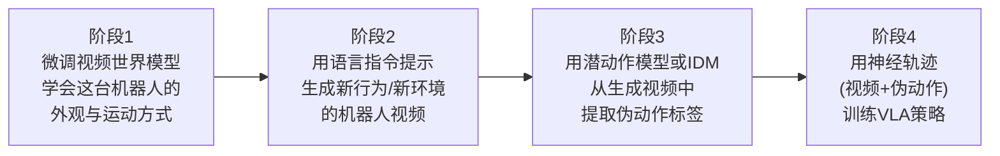

# DreamGen：视频世界模型生成机器人训练数据 深度精读

> **论文标题**: DreamGen: Unlocking Generalization in Robot Learning through Video World Models（原标题曾用 Neural Trajectories）
> **作者**: Joel Jang, Seonghyeon Ye, Zongyu Lin, Johan Bjorck, Ajay Mandlekar, et al.
> **机构**: NVIDIA GEAR Lab
> **发表**: arXiv:2505.12705, 2025（CoRL 2025）
> **代码**: [github.com/NVIDIA/GR00T-Dreams](https://github.com/NVIDIA/GR00T-Dreams)
> **项目页**: [research.nvidia.com/labs/gear/dreamgen](https://research.nvidia.com/labs/gear/dreamgen/)

**知识链接**：
- [世界模型基础](/前置知识/000t_前置知识_世界模型基础) — 视频预测世界模型是本文的核心工具
- [逆动力学模型与潜动作学习](/前置知识/007b_前置知识_逆动力学模型与潜动作学习) — 本文"把生成视频变成可训练数据"这一步的核心技术
- [GR00T N1：人形机器人基础模型](./019_GR00T_N1_人形机器人基础模型) — DreamGen 生成的数据主要用于训练这个模型
- [MimicGen：少量示教自动合成大规模数据](/工程项目/MimicGen_少量示教合成大规模数据) — 另一条数据合成路线（物理仿真 + SE(3) 变换），对比参照

---

## 贯穿全文的例子

> **场景**：你有一台人形机器人（对标 NVIDIA GR1），只教它做过一件事——在厨房台面上把一个东西从左边拿到右边放（pick-and-place）。你只在这**一个**厨房环境里遥操作采集了这一个任务的数据。现在你希望这台机器人能在**没见过的新环境**（比如卧室、办公室）里执行**没教过的新动作**（比如"熨衣服""开台灯""倒水"）。传统做法是老老实实地去这些新环境、新任务上再采集遥操作数据——每加一个新环境或新动作，都要重新找机器人、重新排期遥操作员。DreamGen 想验证的是：能不能只靠"造"出来的视频数据,不用再碰真实机器人和新环境,就让机器人学会这些从未直接示教过的新行为？

---

## 一、这篇论文解决什么问题

### 1.1 机器人数据的"组合爆炸"困境

一个 VLA 策略要能干活，通常需要在很多"环境 × 行为"的组合上都见过数据。假设有 10 种环境（厨房、卧室、办公室……）和 20 种行为（拿取、倾倒、折叠……），理论上需要覆盖 200 种组合才能让策略对任意环境和行为都表现良好。而遥操作采集是**逐条**积累的——每新增一个环境或一个行为，都要重新排期采集，成本随组合数近乎线性甚至更快增长。

以往的数据合成路线（如本项目已经讲过的 [MimicGen](/工程项目/MimicGen_少量示教合成大规模数据)）通过物理仿真器里的 SE(3) 几何变换来批量生成变体——但这条路线依赖有一个像素级精确、带物理引擎的仿真环境，本质上还是在"同一个环境的几何变体"上做扩展，很难凭空"造"出一个全新的、此前完全没建模过的场景（比如厨房 → 卧室）。

### 1.2 DreamGen 的洞察：视频生成模型已经"见过"整个世界

DreamGen 的出发点是一个观察：现在最先进的图像到视频生成模型（如 [Wan 2.1](https://arxiv.org/abs/2503.20314)、Cosmos 等，本质是在海量互联网视频上预训练的[视频扩散模型](/前置知识/000t_前置知识_世界模型基础#2.2-潜空间世界模型-rssm--dreamer-系列)），已经隐式地学到了大量关于"世界如何运转、物体如何被操作、不同场景长什么样"的知识——这些模型没见过这台具体的机器人，但见过无数人类在各种场景里操作各种物体的视频。

**核心想法**：如果能把这类通用视频生成模型"教会"扮演这一台具体机器人（学会它的外观、运动方式），再让它凭着自己已有的世界知识去"想象"这台机器人在全新环境、执行全新任务时会是什么样子——就相当于把视频生成模型当成一台**几乎无限的、免费的数据工厂**,用来生成训练数据，而不需要真的把机器人搬到那些新环境里、真的让人去演示那些新动作。

**回到我们的例子**：只用那一条"厨房里拿取"的遥操作数据，教会视频生成模型这台 GR1 机器人的外观和基本动作方式之后，再提示它"生成一段这台机器人在卧室里熨衣服的视频"——生成模型凭着自己从海量互联网视频里学到的"熨衣服长什么样""卧室长什么样"的知识，"想象"出一段这样的视频，即使真实世界里这台机器人从未真的进过卧室、从未真的熨过衣服。

### 1.3 关键障碍：视频生成模型只会"画画"，不会"控制"

这个想法有一个显而易见的障碍：视频生成模型的输出**只是一段画面**（一系列像素帧），它不知道、也从来没有被训练去输出"关节应该转到多少度"这类机器人能直接执行的动作指令。要把这些"想象"出来的视频真正变成可以训练策略的数据，还缺一个关键环节：**从画面变化里反推出对应的动作**——这正是本系列前置知识[逆动力学模型与潜动作学习](/前置知识/007b_前置知识_逆动力学模型与潜动作学习)要解决的问题，DreamGen 把这个技术直接用作管线里的一个核心组件。

---

## 二、DreamGen 的四阶段管线

DreamGen 把整个想法拆解成四个清晰的、依次执行的阶段：

### 2.1 阶段一：把通用视频生成模型"改造"成这台机器人的专属模拟器

起点是一个在海量互联网视频上预训练好的通用图像到视频扩散模型（论文中主要用 [Wan 2.1](https://arxiv.org/abs/2503.20314)，也在 DreamGen Bench 里对比测试了 Hunyuan、CogVideoX、Cosmos）。这个模型本身不知道任何关于目标机器人（比如人形机器人 GR1）具体长什么样、关节怎么动。

DreamGen 用这一个环境里、这一个任务（pick-and-place）的少量真实遥操作数据（论文中提到的规模是**单一任务、单一环境**的数据），对这个通用视频生成模型做**微调**（fine-tuning）——微调的目标不是让模型学会新任务的语义，而是单纯让它"认识"这台机器人：学会这台机器人的外观、关节运动的物理规律、末端执行器的样子，让它此后生成的视频里出现的"机器人"看起来、动起来都符合这台真实机器人的物理特征。

**为什么只用一个任务的数据就够**：这一步的学习目标很聚焦——不是教会模型"怎么完成任务"（这部分知识模型已经从海量互联网视频的预训练里学到了，比如"熨衣服"这个动作长什么样，模型早就见过人类做这件事的视频），而只是教会模型"这台特定机器人的样子和运动方式"。这是一个相对简单、只需要少量数据就能学会的适配任务，本质上类似于给一个已经很有绘画能力的画家,只是简单介绍一下"这次要画的这个角色长什么样"。

### 2.2 阶段二：用语言指令提示模型"想象"新行为、新环境

微调好之后，这个视频生成模型就变成了一个"专属于这台机器人的模拟器"——给它一张初始帧（机器人在某个场景里的样子）加上一句语言指令（比如"熨衣服"或者"把这个物体放到蓝色的碗里"），它会生成一段这台机器人执行这个指令的视频。

关键在于：这句语言指令描述的行为、初始帧所在的环境，都可以是**训练数据里从未出现过的**——因为模型的"世界知识"（怎么熨衣服、卧室长什么样）来自海量互联网视频预训练,而不是来自阶段一那一小批遥操作数据。论文测试了三种泛化场景：

| 泛化类型 | 具体含义 | 论文中的具体验证 |
|---------|---------|-----------------|
| 行为泛化 (Behavior Generalization) | 同一个环境，让机器人做训练时没做过的新动作 | 在训练用的那个实验室环境里，生成"关闭微波炉""熨衣服""开台灯"等 7+ 种全新行为 |
| 环境泛化 (Environment Generalization) | 训练时见过的动作类型，换到全新环境里执行 | 让"拿取"这类基础动作出现在从未采集过数据的新场景中 |
| 行为+环境双重泛化 | 全新动作 + 全新环境同时组合 | 论文展示的最难场景，如"给花浇水""抬起篮子"等在新环境里的新动作 |

**回到我们的例子**：厨房里那一条"拿取"数据训出的机器人专属视频模型，被提示生成"在卧室里熨衣服"——这同时触发了行为泛化（熨衣服，训练时没做过）和环境泛化（卧室，训练时没见过）。

### 2.3 阶段三：从生成视频里提取伪动作——把"画面"变成"数据"

阶段二生成的视频只是一系列画面帧，不包含任何动作标签。DreamGen 用[前置知识里讲过的两种技术](/前置知识/007b_前置知识_逆动力学模型与潜动作学习)之一，把这些画面转换成可训练的"观测+动作"数据对：

- **潜动作模型（Latent Action Model, 如 LAPA）**：不需要额外的有标签数据，直接从大量视频帧对里自监督学出一套抽象的离散动作符号。
- **逆动力学模型（Inverse Dynamics Model, IDM）**：用阶段一用到的那批真实遥操作数据（有明确的动作标签）训练一个"看两帧、猜动作"的模型，再用它给生成视频打伪动作标签。

DreamGen 论文对两种方式都做了实验（分别称为 LAPA-actions 和 IDM-actions），发现两者都能带来显著的下游性能提升，IDM 方式在有真实动作标签数据可用时通常精度更高一些，两者结合使用效果最好。

由此产生的"生成视频 + 伪动作标签"数据对，论文给它起了一个专门的名字——**神经轨迹**（Neural Trajectory）：区别于真实遥操作产生的轨迹，这是完全由神经网络"想象"和"标注"出来的轨迹。

### 2.4 阶段四：用神经轨迹训练/共同训练 VLA 策略

最后一步是把这批神经轨迹（数量可以远超真实遥操作数据，论文实验中生成了数万条规模的神经轨迹）和少量真实数据一起，用来训练下游的 VLA 策略（论文主要使用 [GR00T N1](./019_GR00T_N1_人形机器人基础模型) 系列模型）。论文验证了几种数据配比方案（纯神经轨迹训练、纯真实数据训练、两者混合共训），发现**混合共训（co-training）效果通常最好**——神经轨迹提供了大范围的行为/环境覆盖度，少量真实数据则提供了"锚点"，帮助策略学会真实世界的精确物理反馈和执行细节。

---

## 三、DreamGen Bench：怎么系统评估"视频生成模型是否适合拿来生成机器人数据"

DreamGen 的成功高度依赖于阶段一微调出的视频生成模型质量——如果生成的视频里机器人动作违反物理规律（穿模、瞬移）或者根本没有执行指令描述的行为，后面的伪动作标注和策略训练都无从谈起。为了系统地衡量"一个视频生成模型是否适合用在这套管线里"，论文提出了 **DreamGen Bench**。

### 3.1 两个核心评估维度

DreamGen Bench 用两个指标评估生成的机器人视频：

1. **指令遵循度（Instruction Following, IF）**：生成的视频画面内容是否确实执行了给定的语言指令描述的行为——比如指令是"打开微波炉"，视频里机器人是否真的做出了打开微波炉的动作。
2. **物理合理性（Physics Following/Alignment, PA）**：生成的视频画面是否符合基本物理规律——物体不能穿模、不能悬空、机器人的运动轨迹要连续合理，不能出现违反常识的瞬间跳变。

### 3.2 为什么这两个指标有意义：和下游策略表现强相关

论文在多个视频生成模型（Wan 2.1、Hunyuan、CogVideoX、Cosmos）上分别跑通整条 DreamGen 管线，测量各自的 DreamGen Bench 分数,再对比这些视频最终训出的下游策略在真实/仿真环境中的成功率。论文发现两者存在**明确的正相关**——DreamGen Bench 分数更高的视频生成模型，训出的策略下游表现也更好。这个相关性的意义在于：不需要每次都跑一遍完整的"生成视频→提取动作→训练策略→部署测试"这个昂贵的全流程，就可以用 DreamGen Bench 快速筛选、比较不同视频生成模型是否适合这条数据合成管线。

---

## 四、实验结果与关键发现

### 4.1 核心成果：单任务单环境数据解锁 22 种新行为

论文最核心的实验结果是：**只用一个厨房环境里的一个 pick-and-place 任务的遥操作数据，就能让人形机器人在训练时见过或未见过的环境中，执行 22 种全新的行为**（包括熨衣服、开关微波炉、点蜡烛等）。这个数字直接体现了这条数据合成管线相比传统"每加一个新任务/环境就要重新采集数据"路线的效率提升。

### 4.2 跨机器人平台的通用性

论文验证了这套管线不局限于人形机器人，同样适用于单臂机械臂（Franka）和低成本机械臂（[SO-100](/硬件基础)，约 100 美元级别），以及配合多个相机视角（包括腕部相机）。这说明 DreamGen 的核心思路——"微调视频生成模型 + 提取伪动作"——是一个和具体机器人形态无关的通用框架。

### 4.3 接触密集型任务的额外价值

除了行为/环境泛化，论文还发现 DreamGen 能帮助解决传统物理仿真难以覆盖的**接触密集型任务**（如折叠布料、锤击这类需要精确建模柔性体或高频撞击力的任务）——因为 DreamGen 完全绕开了物理仿真环节，直接在像素空间"想象"出这些动作的画面,不需要仿真器精确建模摩擦、形变、碰撞这些计算上昂贵且容易出错的物理细节。

### 4.4 数据规模的 Scaling 行为

论文在仿真环境（RoboCasa）中系统测试了神经轨迹数量从 0 到约 24 万条的 scaling 曲线，观察到策略表现和神经轨迹数量之间存在明显的**对数线性（log-linear）**关系——神经轨迹数量指数增长时，策略表现近似线性提升，且在真实数据稀缺（low-data regime）、中等、充足三种情况下都观察到这个规律,说明神经轨迹提供了一个和真实数据规模正交的、可以独立扩展的新数据维度。

---

## 五、和综述/相关方法的关系

### 5.1 和 MimicGen 数据合成路线的本质区别

| 维度 | [MimicGen](/工程项目/MimicGen_少量示教合成大规模数据) | DreamGen |
|------|--------------------------------------------------------|----------|
| 核心机制 | 物理仿真器中的 SE(3) 几何变换，把示教动作"搬"到新的物体布局 | 视频生成模型在像素空间"想象"新的画面 |
| 是否需要物理仿真器 | 需要（依赖仿真器的碰撞检测和物理验证） | 不需要 |
| 能否生成全新场景 | 难（局限于同一仿真环境的几何变体） | 能（生成模型的世界知识可以覆盖完全不同的场景） |
| 能否覆盖接触密集型任务 | 受仿真精度限制（柔性体、高频接触建模粗糙） | 相对更容易（不需要精确物理建模，只需要画面看起来合理） |
| 生成数据的物理精确性保证 | 强（经过物理仿真验证，不会有穿模等错误） | 弱（依赖生成模型本身的物理合理性，需要 DreamGen Bench 这类工具筛选质量） |
| 动作标签来源 | 精确的仿真器状态（SE(3) 变换直接给出） | 需要额外的 IDM/潜动作模型"猜"出来，存在噪声 |

两条路线本质上是数据合成领域两种不同的"世界模型"来源——MimicGen 依赖精确的物理仿真器作为世界模型，DreamGen 依赖视频生成模型隐式学到的"世界知识"作为世界模型，各有取舍，实践中可以互补使用（比如仿真环境里做几何变体的批量生成，视频生成模型负责覆盖仿真环境本身难以建模的场景和任务类型）。

### 5.2 在 real2sim2real 工作流中的位置

DreamGen 严格来说不是一个"从真实场景重建仿真"的 real2sim 方法（这类工作请参见 [RialTo](./114_RialTo_数字孪生RL策略学习)、本系列后续要讲的 [SimFoundry](./132_SimFoundry_单视频重建可交互仿真场景)），而是一条完全不依赖显式重建场景的**并行**数据合成路线——它不需要先把真实场景"搬进"某个物理仿真器,而是直接在生成模型的像素空间里创造新数据。在 NVIDIA 官方的 GR00T-Mimic/GR00T-Gen blueprint 里，DreamGen（及其对应的 [GR00T-Dreams](https://github.com/NVIDIA/GR00T-Dreams) 开源实现）是"数据生成"这个大模块下与"仿真几何重建 + 域随机化"并行的另一个技术分支。

### 5.3 和世界模型用作"训练环境"的区别

需要区分 DreamGen 和[世界模型基础](/前置知识/000t_前置知识_世界模型基础#五、世界模型在-vla-后训练中的应用)里讲过的"用视频世界模型替代物理仿真器"这个用法的不同：那种用法是让策略在训练**过程中**、每一步都实时查询世界模型来获得反馈（在线闭环交互，常用于 RL 训练），而 DreamGen 是**离线**地一次性生成大批视频、提取伪动作，产出一份静态数据集，再用标准的监督学习/行为克隆方式训练策略——两者都利用视频生成模型的世界知识，但使用方式（在线交互 vs 离线数据生成）完全不同，对生成速度、生成视频长度的要求也不同。

---

## 六、局限性

1. **伪动作标签的精确性有限**：无论用 IDM 还是潜动作模型，从生成视频里反推出的动作都是"猜"出来的近似值，不如真实遥操作记录的动作精确，这也是论文强调"混合真实数据共训"效果最好的原因。
2. **依赖视频生成模型本身的质量和物理合理性**：如果生成模型本身在某些场景下产生违反物理规律的画面（穿模、瞬移），这些错误会直接污染下游训练数据,这也是为什么论文专门开发 DreamGen Bench 来筛选/评估生成模型质量。
3. **微调阶段仍然需要一定量的真实遥操作数据**：虽然只需要单一任务单一环境的数据，但这批"种子数据"的质量直接决定了微调出的视频生成模型是否能准确模拟这台机器人的外观和运动方式。
4. **长时序、多阶段任务的生成质量尚不明确**：论文展示的主要是相对简短的单一动作片段，对于需要长时间连续执行多个子步骤的复杂任务，视频生成模型能否保持连贯一致的物理逻辑，还有待更多验证。

---

## 七、总结

DreamGen 的核心贡献可以用一句话概括：**把预训练的视频生成模型变成一台"专属于某台机器人"的数据工厂——只需要教会它这台机器人长什么样，它就能凭着自己从互联网视频里学到的世界知识，"想象"出这台机器人在全新环境、执行全新任务时的样子，再通过逆动力学模型或潜动作模型把这些想象出的画面转换成可训练的数据**。

这项工作最重要的意义不在于提出了一个全新的算法组件（视频扩散模型、IDM、潜动作模型都是已有技术），而在于**验证了一条新的数据规模化维度**——传统机器人数据规模化靠"多雇人采集更多真实数据"，DreamGen 提供了"多花 GPU 算力生成更多神经轨迹"这条平行的路径，且论文的 scaling 实验显示这条路径遵循清晰的对数线性增长规律,为机器人学习数据获取打开了一个不完全依赖人力采集的新方向。

---

## 延伸阅读

- [逆动力学模型与潜动作学习](/前置知识/007b_前置知识_逆动力学模型与潜动作学习) — 本文阶段三的核心技术详解
- [世界模型基础](/前置知识/000t_前置知识_世界模型基础) — 视频预测世界模型的通用原理
- [GR00T N1：人形机器人基础模型](./019_GR00T_N1_人形机器人基础模型) — DreamGen 生成数据的主要下游消费者
- [MimicGen：少量示教自动合成大规模数据](/工程项目/MimicGen_少量示教合成大规模数据) — 物理仿真路线的数据合成对比
- [Sim-to-Real 迁移综述](/论文综述/S04_Sim_to_Real迁移综述) — Real2Sim2Real 整体技术图景
- Jang et al., *"DreamGen: Unlocking Generalization in Robot Learning through Video World Models"*, arXiv:2505.12705, 2025 (CoRL 2025)
