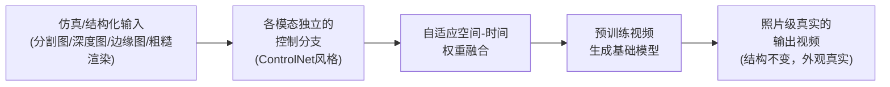

# Cosmos-Transfer：多模态可控世界生成 深度精读

> **论文标题**: Cosmos-Transfer1: Conditional World Generation with Adaptive Multimodal Control
> **作者**: NVIDIA (Hassan Abu Alhaija, Jose Alvarez, Ting-Chun Wang, Ming-Yu Liu, et al.)
> **机构**: NVIDIA
> **发表**: arXiv:2503.14492, 2025
> **代码**: [github.com/nvidia-cosmos/cosmos-transfer1](https://github.com/nvidia-cosmos/cosmos-transfer1)

**知识链接**：
- [世界模型基础](/前置知识/000t_前置知识_世界模型基础) — 视频预测世界模型的通用原理，Cosmos-Transfer 是这类模型的一个"条件控制"变体
- [Sim-to-Real 迁移综述](/论文综述/S04_Sim_to_Real迁移综述#2.-域随机化-domain-randomization) — 域随机化的基础方法论，本文提供了域随机化的一种生成式新实现
- [DreamGen：视频世界模型生成机器人训练数据](./131_DreamGen_视频世界模型生成机器人训练数据) — 同为 NVIDIA GEAR/Cosmos 生态的数据生成技术，两者可以组合使用
- [SimFoundry：单视频重建可交互仿真场景](./132_SimFoundry_单视频重建可交互仿真场景) — Cosmos-Transfer 常被用来给这类仿真渲染结果做"照片级美化"

---

## 贯穿全文的例子

> **场景**：你在物理仿真器（比如 Isaac Sim）里训练一个机械臂抓取策略。仿真渲染出的画面虽然物理行为是对的（碰撞、抓取力都符合物理规律），但视觉上"看起来像游戏画面"——材质简单、光照生硬、没有真实世界的噪声和细节。策略只在这种简化视觉下训练，部署到真实相机拍摄的画面时，会因为视觉分布差异太大而表现下滑（这正是[Sim-to-Real 迁移综述](/论文综述/S04_Sim_to_Real迁移综述)里讲过的视觉层面的 reality gap）。传统域随机化的做法是给仿真渲染贴各种随机材质、随机光照来"硬扛"这个差异。Cosmos-Transfer 提供了另一种做法：把仿真渲染出的分割图、深度图这些**结构信息**喂给一个生成模型，让它在**保持物体形状、位置、运动轨迹完全不变**的前提下，把画面"重新画"成照片级真实的样子——material、光照、纹理全部替换成逼真的版本,但机械臂和物体该在哪里就在哪里，一点不会挪位置。

---

## 一、这篇论文解决什么问题

### 1.1 传统域随机化的两个代价

[域随机化](/论文综述/S04_Sim_to_Real迁移综述#2.-域随机化-domain-randomization)（Domain Randomization）是缩小视觉层面 sim-to-real gap 最经典的方法——训练时把物体的材质、颜色、场景光照都随机化，让策略在足够宽的视觉分布上都练习过，希望真实世界的具体视觉表现恰好落在这个训练分布内。这个方法简单有效，但有两个明显的代价：

1. **随机化出来的视觉效果通常还是"假的"**：传统随机化通常是在渲染引擎里随机贴不同的材质纹理、随机调整颜色和光照参数，这类随机化产生的画面虽然多样,但每一种依然带着明显的"仿真感"（渲染引擎本身的材质库、光照模型天生和真实摄像头拍出来的画面有系统性差异），不是真正意义上的"照片级真实"。
2. **随机化范围怎么选是个老问题**：随机化范围选窄了覆盖不到真实世界，选宽了训练不稳定或者训练出的策略过度保守——这正是本项目[DrEureka 精读](./115_DrEureka_LLM引导域随机化与奖励设计)专门讨论过的核心痛点。

### 1.2 Cosmos-Transfer 的思路：用生成模型直接"翻译"成照片级真实，而不是拼凑材质库

Cosmos-Transfer 的核心想法是：**不再依赖渲染引擎自带的材质/光照随机化能力，而是用一个在海量真实视频上预训练过的大型视频生成模型,把仿真渲染出来的"结构信息"（物体在哪里、边缘轮廓是什么、大致深度关系是什么）重新"画"成照片级真实的画面**。因为这个生成模型的视觉知识来自真实世界的视频，它画出来的材质、光照、纹理天然就带着"真实相机拍出来的样子"，不需要人工去猜"应该随机化成什么样"——只需要告诉它"结构长这样，帮我画得像真的一样"就够了。

**回到我们的例子**：仿真渲染出的机械臂抓取画面里,物体的分割掩码（哪块像素是物体）、深度图（每个像素离摄像头多远）,这些结构信息本身是精确的、来自物理仿真的真值。Cosmos-Transfer 把这些结构信息作为约束条件,让生成模型"照着这个结构画一幅照片级真实的画"——画出来的桌面材质、金属反光、环境光照都是真实世界摄像头会拍出来的样子,但物体轮廓、位置、深度关系严格遵循仿真给出的结构约束,不会画走样。

---

## 二、Cosmos-Transfer 的核心设计：自适应多模态控制

### 2.1 基础架构：类似 ControlNet 的多分支控制

Cosmos-Transfer 建立在预训练好的 [Cosmos](https://arxiv.org/abs/2501.03575) 视频生成基础模型之上，采用类似图像生成领域 ControlNet 的思路——在一个已经训练好、能生成高质量视频的基础扩散模型旁边，接入若干个独立的**控制分支**（control branch），每个分支负责接收一种特定模态的结构化输入（比如分割图、深度图、边缘图、粗糙的可见光渲染帧），并把这种模态携带的结构信息，注入到基础生成模型的生成过程中，引导它生成的画面在结构上和输入约束保持一致，同时在纹理、材质、光照这些细节上发挥生成模型自己的"照片级真实"能力。

### 2.2 关键创新：自适应的空间加权，而不是全局固定权重

如果同时给生成模型提供多种模态的控制信号（比如同时给分割图和深度图），一个直接的做法是给每种模态一个固定的全局权重，混合它们的控制强度。Cosmos-Transfer 的关键创新在于：**允许在画面的不同空间位置、不同时间帧上，动态调整每种模态控制信号的权重**——而不是对整张画面、整段视频统一用同一套权重。

**为什么需要空间自适应权重**：不同模态的控制信号在画面不同区域的可靠程度并不均匀。比如深度图在物体边缘附近的精度往往不如分割图可靠（深度估计在边缘容易出现模糊过渡），而分割图对纹理细节（比如物体表面的花纹）完全没有约束能力。允许权重按空间位置自适应调整，意味着可以在"这一片区域深度信息更可靠"的地方多信赖深度图，在"这一片区域需要精确的物体边界"的地方多信赖分割图——而不是被迫在全图统一使用某种"各退一步"的折中权重,损失掉每种模态各自的优势区域。

**时间维度的自适应同理**：视频里不同帧的物体运动速度、遮挡程度不同,某一帧可能某个模态的控制信号质量突然下降（比如快速运动导致的运动模糊影响边缘检测），自适应权重允许在这一帧临时调低对应模态的权重，避免把这一帧质量不佳的控制信号"生搬硬套"进最终生成结果。

### 2.3 支持的模态类型

论文展示的控制模态包括分割图（Segmentation，标出画面里每个像素属于哪个物体类别）、深度图（Depth，标出每个像素离摄像头的距离）、边缘图（Edge，标出画面中物体的轮廓线）、以及粗糙的可见光渲染帧（Vis，比如仿真引擎直接渲染出的、材质简化的画面本身）。这些模态可以单独使用,也可以任意组合同时输入,系统会根据自适应权重机制自动决定在每个空间-时间位置上如何融合它们的贡献。

---

## 三、在机器人 Sim2Real 中的具体用法

### 3.1 把仿真渲染"翻译"成照片级真实,同时保持结构不变

Cosmos-Transfer 在机器人 sim-to-real 场景里最直接的用法是：训练策略所用的仿真渲染帧,连同它自带的分割图、深度图这些精确的结构化真值一起，输入给 Cosmos-Transfer,输出一段外观照片级真实、但物体位置/运动轨迹和原始仿真严格保持一致的视频。因为结构约束保证了"物体在哪、动作是什么"这些和任务相关的核心信息没有被改变,只是画面的"皮肤"（材质、光照、纹理）被替换成了照片级真实的版本——这份新生成的、外观真实的视频，理论上比原始仿真渲染更接近真实世界摄像头会拍到的画面，可以直接用来训练或增强策略的视觉输入。

**和传统域随机化的本质区别**：传统域随机化是在渲染引擎内部随机采样材质参数,生成的画面依然受限于渲染引擎自身的材质库和光照模型的表达能力；Cosmos-Transfer 是把生成任务完全交给一个在真实视频上预训练过的生成模型,画出来的纹理、光照本身就是"学习自真实世界"的,不受渲染引擎材质库表达能力的限制,理论上能覆盖的视觉真实度上限更高。

### 3.2 和 NVIDIA 官方 GR00T-Gen 工作流的关系

在 NVIDIA 官方的 GR00T Blueprint 里，Cosmos-Transfer 承担的正是 **GR00T-Gen** 这一环节的核心技术——GR00T-Mimic 先把少量人类示教扩展成大规模的仿真轨迹（几何/动作层面的扩展，[MimicGen](/工程项目/MimicGen_少量示教合成大规模数据) 这类技术负责），GR00T-Gen 再用 Cosmos-Transfer 这类工具，对这批仿真轨迹的渲染画面做照片级真实化和视觉多样性增强（视觉层面的扩展）。两个环节分别解决"动作/几何多样性够不够"和"视觉真实感够不够"两个不同的问题，组合起来构成完整的数据规模化管线。

### 3.3 支持真实场景数据增强，不仅限于纯仿真数据

除了给纯仿真渲染做"真实化"，Cosmos-Transfer 同样可以用于给**已经采集好的真实视频**做进一步的视觉增强——比如把一段真实场景的采集视频，在保持结构（物体位置、运动轨迹）不变的前提下，替换成不同的光照条件、不同的背景风格，从而在不需要重新采集数据的情况下,扩充训练数据在视觉条件上的覆盖范围。这一点在 NVIDIA 官方文档中被称为"Sim2Real 和 Real2Real 双向的世界间转换"能力。

---

## 四、实验结果与工程验证

### 4.1 大规模推理的工程验证

论文额外展示了一个工程侧的验证——在 NVIDIA GB200 NVL72 机架上，通过推理扩展策略（inference scaling），Cosmos-Transfer 可以实现接近实时的世界生成速度。这一点对于真正把这套技术用在大规模、持续运行的数据生成管线里（而不只是离线跑一批小规模实验）具有直接的工程意义——数据生成管线的吞吐量直接影响整套 real2sim2real 工作流能规模化到多大。

### 4.2 机器人 Sim2Real 与自动驾驶数据增强的应用验证

论文分别在机器人操作的 Sim2Real 场景和自动驾驶数据增强场景中验证了这套方法的有效性，证明了 Cosmos-Transfer 提供的多模态自适应控制机制，是一个跨领域通用的"世界间转换"（world-to-world transfer）工具，不局限于某一类具体的机器人任务。

---

## 五、和综述里已有方法的关系

### 5.1 在 Sim-to-Real 方法体系中的定位

Cosmos-Transfer 本质上提供了[Sim-to-Real 迁移综述](/论文综述/S04_Sim_to_Real迁移综述#2.-域随机化-domain-randomization)里"域随机化"这条主线的一种**生成式实现**——它替换的不是"要不要随机化视觉外观"这个思路本身，而是替换了"怎么随机化"的具体手段：从渲染引擎材质库的参数采样，变成了大型视频生成模型的条件生成。

| 维度 | 传统域随机化 | Cosmos-Transfer |
|------|-------------|------------------|
| 随机化的实现方式 | 渲染引擎内材质/光照参数采样 | 预训练视频生成模型的条件生成 |
| 视觉真实度上限 | 受限于渲染引擎材质库和光照模型 | 受限于生成模型的预训练视频质量（通常更高） |
| 是否需要精确的结构化真值输入 | 不需要（渲染引擎自己知道结构） | 需要（分割图/深度图等作为控制输入） |
| 多种控制信号的融合方式 | 一般不涉及多模态融合概念 | 自适应空间-时间权重融合多种模态 |
| 计算成本 | 低（渲染引擎实时输出） | 较高（视频生成模型的推理开销），需专门的推理加速 |

### 5.2 和 DreamGen 的对比与互补

[DreamGen](./131_DreamGen_视频世界模型生成机器人训练数据) 和 Cosmos-Transfer 都属于"用视频生成模型辅助机器人数据规模化"这个大方向，但触发生成的**条件输入**完全不同：DreamGen 用语言指令 + 初始帧驱动生成（生成全新的行为和场景内容），Cosmos-Transfer 用精确的结构化信息（分割/深度/边缘）驱动生成（保持结构不变、只替换外观）。前者回答"让机器人做一件新的事"，后者回答"让已有的画面看起来更真实"。两者可以组合：先用 DreamGen 生成新行为的视频，再用 Cosmos-Transfer 对这些生成视频做进一步的视觉真实感增强。

### 5.3 和 SimFoundry 的组合使用

[SimFoundry](./132_SimFoundry_单视频重建可交互仿真场景) 重建出的数字孪生/数字表亲场景，在物理仿真器里渲染出的画面同样面临"结构精确但视觉不够真实"的问题——这正是 Cosmos-Transfer 可以介入的环节：把 SimFoundry 生成的场景变体渲染结果，连同它自带的精确分割/深度信息一起，输入 Cosmos-Transfer 做照片级真实化处理，进一步缩小视觉层面的 sim-to-real gap，这也是 NVIDIA real2sim2real 技术栈里几个组件经常被组合使用的典型模式。

---

## 六、局限性

1. **依赖精确的结构化控制输入**：生成质量高度依赖输入的分割图、深度图等结构信息的精度——如果上游（比如仿真渲染或者深度估计模型）给出的结构信息本身有误差,这个误差会直接传递到最终生成结果里。
2. **推理成本较高**：作为一个大型视频生成模型，逐帧甚至逐视频的推理开销远高于传统渲染引擎的实时渲染，论文专门讨论推理加速策略正是为了解决这一现实约束。
3. **生成内容的物理合理性不是显式保证的**：控制信号约束的是几何结构（物体在哪、边界在哪），但生成模型"画"出来的材质反光、阴影等细节是否严格符合真实物理光学规律，没有像结构约束那样的显式保证机制。

---

## 七、总结

Cosmos-Transfer 把域随机化这个 sim-to-real 领域的经典技术,从"在渲染引擎里调材质参数"升级成了"用大型视频生成模型的世界知识,把结构精确的仿真/真实画面重新画成照片级真实的样子"。它的核心技术贡献——**自适应的空间-时间多模态权重融合**——让系统能够灵活地综合利用分割、深度、边缘等多种结构信息各自的优势区域，而不是被迫在多种模态间做全局的折中。

在整个 NVIDIA real2sim2real 技术栈里，Cosmos-Transfer 承担的是"让生成的/仿真的数据在视觉上更接近真实世界摄像头拍摄效果"这一关键但此前长期依赖传统渲染技术的环节，与 DreamGen（生成全新行为内容）、SimFoundry（重建精确物理结构）等组件一起，共同构成了从"真实场景/示教"到"大规模、高视觉真实感训练数据"的完整数据生成链路。

---

## 延伸阅读

- [Sim-to-Real 迁移综述](/论文综述/S04_Sim_to_Real迁移综述) — 域随机化等基础方法全景
- [DreamGen：视频世界模型生成机器人训练数据](./131_DreamGen_视频世界模型生成机器人训练数据) — 语言驱动的新行为/新场景生成，与本文互补
- [SimFoundry：单视频重建可交互仿真场景](./132_SimFoundry_单视频重建可交互仿真场景) — 结构精确的场景重建，可作为本文的上游结构输入来源
- [DrEureka：LLM 引导域随机化与奖励设计](./115_DrEureka_LLM引导域随机化与奖励设计) — 传统域随机化参数选择的另一种自动化思路，对比参照
- NVIDIA, *"Cosmos World Foundation Model Platform for Physical AI"*, arXiv:2501.03575, 2025 — Cosmos 基础模型平台
- NVIDIA, *"Cosmos-Transfer1: Conditional World Generation with Adaptive Multimodal Control"*, arXiv:2503.14492, 2025
