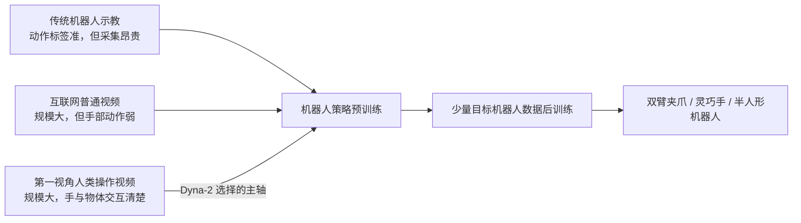
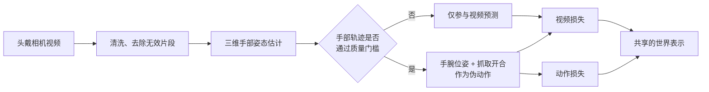
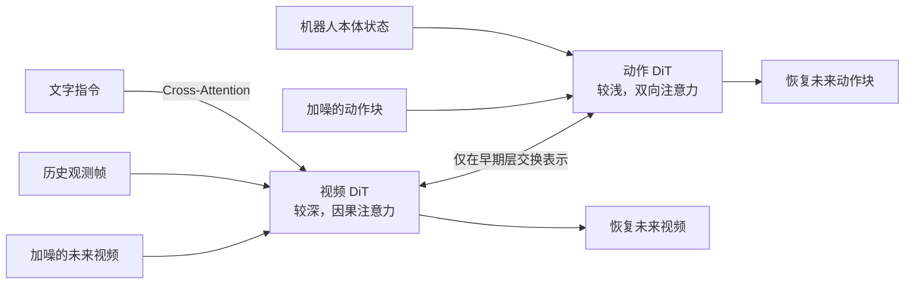
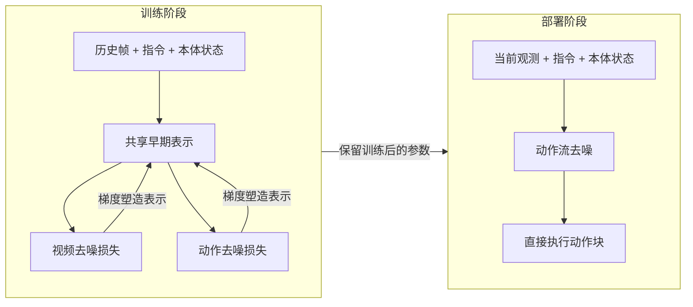
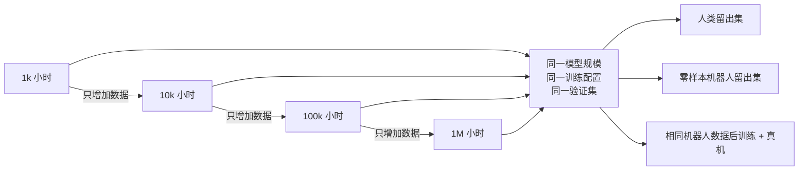
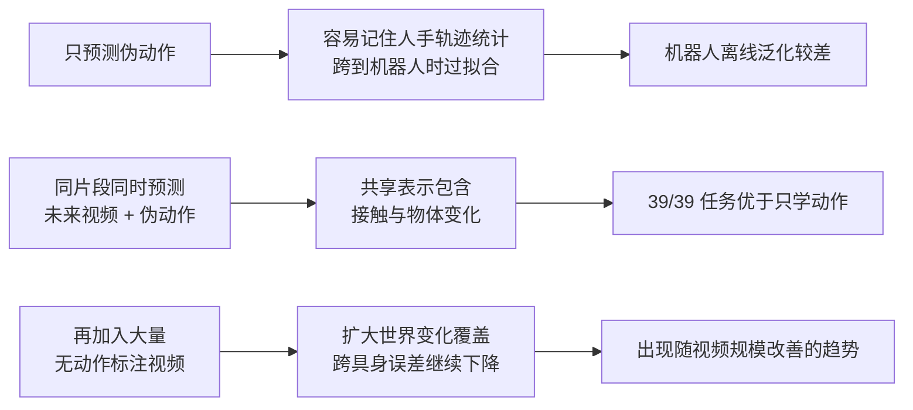
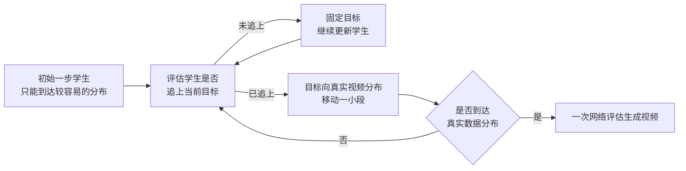

# Dyna-2：百万小时人类视频如何迁移成机器人策略

> **原文标题**：Dyna-2: A 1-Million-Hour Scaling Law for World-Action Models  
> **作者/机构**：Dyna Robotics  
> **发布时间**：2026 年 8 月 15 日  
> **原文形态**：公司研究报告，不是已公开的会议论文或 arXiv PDF  
> **官方页面**：[dyna.co/dyna-2](https://www.dyna.co/dyna-2)  
> **代码与权重**：截至本文写作时未公开  
> **一句话概括**：Dyna-2 用同一个视频扩散模型共同学习“未来画面会怎样变化”和“手应该怎样运动”，并用 1,000 到 1,000,000 小时的人类第一视角视频证明：人类视频越多，未见过的机器人数据预测和少量机器人数据微调后的真机表现总体越好。

**知识链接**：
- [世界模型基础](/前置知识/000t_前置知识_世界模型基础) — 先区分“预测世界”与“直接输出动作”
- [扩散模型 DDPM](/前置知识/000b_前置知识_扩散模型DDPM) — 理解从噪声逐步恢复视频与动作的基本思路
- [Flow Matching 与连续归一化流](/前置知识/000g_前置知识_Flow_Matching与连续归一化流) — Dyna-2 的视频和动作训练目标
- [Cross-Attention 与交替注意力](/前置知识/001e_前置知识_Cross_Attention与交替注意力机制) — 理解视频、动作、文字怎样交换信息
- [视觉语言动作模型综述](/论文综述/S03_视觉语言动作模型VLA综述) — Dyna-2 所对比的 VLA 路线
- [Fast-WAM 精读](/论文综述/093_FastWAM_世界动作模型无需推理时想象) — 同样采用“训练时预测视频、推理时直接输出动作”的 WAM 路线
- [fast-WAM 人类数据预训练实验系列](/系列/fastwam_human_pretrain/) — 仓库中最接近 Dyna-2 的可复现实验路线，可对照其过拟合与动作空间问题

---

## 一 先说结论 Dyna-2 到底是什么工作

Dyna-2 首先是一项**机器人预训练数据规模化实验**，其次才是一个新模型。它要回答的不是“某个机械臂任务能不能做到”，而是三个更基础的问题：人类第一视角视频能否成为机器人策略的主要预训练数据；扩大人类数据是否会稳定改善机器人预测；这种离线改善能否延续到真机执行。

它的核心判断可以压缩成四句：

1. **人类视频可以提供动作监督。** 研究者从视频中估计三维手部轨迹，用手腕位姿近似末端执行器轨迹，用拇指与食指开合距离近似连续抓取信号。
2. **视频预测和动作预测必须共同训练。** 只学手部伪动作会严重过拟合；加入未来视频预测后，模型被迫学习物体接触、运动和场景变化，跨具身泛化明显改善。
3. **百万小时的价值主要体现在迁移，不只是拟合人手。** 人类验证集指标随数据量平滑改善；更关键的是，从未用于预训练的机器人数据上的动作误差也随人类视频规模下降。
4. **它不是“先想象视频，再照着视频行动”。** 视频损失只在训练时塑造共享表示；部署策略时，动作分支不接收模型预测的未来视频，仍根据当前观测直接生成动作块。

下面这张图先把 Dyna-2 放回机器人学习的数据版图中：



> 重点不是“人类视频取代所有机器人数据”。Dyna-2 的方案是：昂贵的机器人数据负责最后的具身适配，大规模人类视频负责预先学习广泛的操作规律。

### 1.1 贯穿全文的例子 开瓶盖

设想要训练两只五指机器人手拧开瓶盖。只采机器人示教，会遇到两个问题：双手遥操作成本高；十分钟数据很难覆盖不同瓶子位置、抓握姿态和视觉背景。

Dyna-2 的做法分两段。预训练阶段先看大量人类第一视角操作视频，从中学习“左手固定瓶身、右手接近瓶盖、建立接触、旋转、瓶盖脱离”这类跨物体规律；后训练阶段再用约十分钟该机器人本体的示教，把“人手轨迹”翻译成这套五指机械手真正可执行的关节动作。官方报告中，这项任务随人类预训练数据从小规模扩大到 100,000 和 1,000,000 小时时，成功率从 10% 上升到 40% 和 50%。

这并不证明模型只看人类视频就会控制机器人。它证明的是：**相同的十分钟机器人数据，在更强的人类视频预训练底座上能发挥更大作用。**

---

## 二 数据怎样从视频变成动作

### 2.1 一百万小时里有什么

官方称语料超过 1,000,000 小时，主要是头戴相机拍摄的第一视角日常操作，包括烹饪、整理、折叠和装配，来源同时包含数据合作方和内部采集。报告没有公开视频总条数、任务数、物体数、地区与人群分布，也没有给出数据许可和去重细节；因此“一百万小时”是可核对的官方声明，却不是外部可审计的数据集统计。

不是每段视频都能训练动作头。数据流水线先做清洗、手部姿态提取、验证与过滤；通过质量门槛的片段才具有三维手部轨迹，并进一步派生两类伪动作：

| 视频标注 | 转成什么控制量 | 能表达什么 | 主要误差来源 |
|---|---|---|---|
| 三维手腕位姿 | 末端执行器轨迹 | 手往哪里移动、如何转动 | 遮挡、相机自运动、尺度估计 |
| 拇指与食指间距 | 连续抓取信号 | 张开、闭合与夹持程度 | 非拇指食指抓握、物体遮挡 |
| 原始视频帧 | 未来视频监督 | 接触后物体与场景怎样变化 | 视角移动、无关背景变化 |
| 文字任务描述 | 条件指令 | 要操作哪个物体、做什么动作 | 描述粒度和动作边界不一致 |

完整数据流如下。注意“动作标签”不是人类佩戴机器人遥操作设备得到的真实控制量，而是视觉估计产生的代理监督。



> 这里最值得注意的是未标动作的视频并没有被丢弃。Dyna-2 的消融恰恰表明，只让它们参与视频预测，也能继续改善机器人域上的动作泛化。

### 2.2 为什么第一视角比普通网页视频更合适

第一视角视频提供了三种普通第三视角视频较弱的信息：手通常位于画面中心，接触过程更清楚；相机跟随操作者，近距离细节更多；操作意图与手部运动在时间上紧密对应。但它也带来新的混淆：头部转动会造成整幅画面移动，而动作标签只描述手腕和抓取；同一个画面可能对应多个合理后续动作；人手与机器人夹爪的运动学结构不同。

Dyna-2 没有通过外观变换或运动学对齐主动缩小这些差距。官方刻意保留这道“具身鸿沟”，用来观察纯粹增加数据规模是否已经足以产生迁移。这个实验设计有利于隔离变量，但不能推出显式对齐没有价值；报告自己也承认，加入人机对齐或共同训练很可能进一步提高性能。

---

## 三 模型架构 两条扩散流如何协作

### 3.1 先看全图

Dyna-2 属于世界动作模型（World-Action Model, WAM）——一个同时建模未来世界状态和未来动作的生成模型。它以视频扩散 Transformer（Diffusion Transformer, DiT）为骨干，为视频和动作分别设置 token 化方式与 Transformer 层，再通过注意力在早期层交换信息。视觉流较深，动作流较浅，以降低实时控制延迟。



> 文字只直接控制视频 token；动作 token 通过所观察的视频上下文间接获得语言信息。动作块内部使用双向注意力，因为整段动作是一起去噪，而不是逐动作自回归生成。

### 3.2 Flow Matching 如何同时训练视频和动作

Flow Matching（流匹配）把真实样本和高斯噪声之间连成一条直线路径。Dyna-2 对未来视频潜变量和动作块分别加噪：

$$
z_t = t z + (1-t)\varepsilon_z, \qquad
a_t = t a + (1-t)\varepsilon_a,
\qquad \varepsilon_z,\varepsilon_a \sim \mathcal{N}(0,I)
$$

**这个公式在做什么**：分别把真实未来视频和真实动作与随机噪声混合，制造任意噪声程度的训练样本，让网络练习把两类样本带回真实数据。

::: details 📐 公式详解（点击展开）

| 子表达式 | 它是谁 | 它在干嘛 |
|---|---|---|
| $z_t=t z+(1-t)\varepsilon_z$ | **视频训练路标** | 在真实未来视频潜变量与视频噪声之间取一个中间点 |
| $a_t=t a+(1-t)\varepsilon_a$ | **动作训练路标** | 在真实动作块与动作噪声之间取一个中间点 |
| $t$ | **噪声刻度** | 越接近 1 越像真实数据，越接近 0 越像纯噪声 |
| $\mathcal{N}(0,I)$ | **噪声来源** | 为视频和动作独立抽取标准高斯噪声 |

**用人话读**：随机选一个难度，把未来画面和动作分别弄乱，再让模型学习各自恢复它们的方向。

**为什么是这个形式**：直线插值给出了固定且易监督的速度方向；视频和动作使用独立噪声，使两条流既能联合训练，也能单独调用。
:::

设条件 $c$ 包含历史帧、本体状态和文字指令。缩放实验使用的共同训练目标如下：

$$
\mathcal{L}_{\mathrm{co}}(\theta)=
\mathbb{E}\left\|u^{\mathrm{vid}}_\theta(z_t;t,c)-(z-\varepsilon_z)\right\|^2
+\lambda\,\mathbb{E}\left\|u^{\mathrm{act}}_\theta(a_t;t,c)-(a-\varepsilon_a)\right\|^2
$$

**这个公式在做什么**：视频头和动作头分别学习自己的去噪速度，两个误差共同更新共享网络；$\lambda$ 决定动作任务在总训练中的权重。

::: details 📐 公式详解（点击展开）

| 子表达式 | 它是谁 | 它在干嘛 |
|---|---|---|
| $u^{\mathrm{vid}}_\theta(z_t;t,c)$ | **视频方向预测器** | 根据加噪视频与上下文，猜未来视频应该朝哪里恢复 |
| $z-\varepsilon_z$ | **视频正确方向** | 直线路径上从噪声指向真实视频的监督目标 |
| $u^{\mathrm{act}}_\theta(a_t;t,c)$ | **动作方向预测器** | 根据加噪动作与上下文，猜动作块应该朝哪里恢复 |
| $a-\varepsilon_a$ | **动作正确方向** | 从动作噪声指向真实动作的监督目标 |
| $\lambda$ | **任务配平器** | 控制动作误差相对视频误差的影响强度 |
| 两个 $\mathbb{E}$ | **批次平均** | 实际训练用 mini-batch 中随机抽取的样本和噪声近似总体期望 |

**用人话读**：同一次训练既检查“未来画面恢复得对不对”，也检查“动作恢复得对不对”，两份反馈一起塑造共享表示。

**为什么分成两个边缘速度场**：动作头不把加噪未来视频作为输入，因而推理时可以只运行动作流；视频学习提供表示监督，却不成为实时控制的必经计算。
:::

### 3.3 最容易误读的地方 训练时联合不等于推理时先预测视频

许多“世界模型控制”方法会先生成候选未来，再依据未来选择动作。Dyna-2 的缩放实验版本不是这条路线。动作速度场没有把加噪未来视频 $z_t$ 作为输入，所以部署时不需要先生成未来帧，也不读取生成结果。



> 视频预测是训练期的辅助任务，不是部署期的显式规划器。因此把 Dyna-2 描述为“机器人先在脑中播放未来，再行动”并不准确；更准确的说法是“视频预测把物理变化规律压进了动作策略使用的表示”。

---

## 四 缩放实验是怎样设计的

### 4.1 四档嵌套数据 控制了什么变量

研究者从同一语料构造 1,000、10,000、100,000 和 1,000,000 小时四个嵌套子集。各来源在每档中的比例相同，大数据档只增加样本，不替换小数据档已有样本。人类验证集固定为与训练集不重叠的 100 小时；各档使用相同模型、训练和评估配置。每个档位取训练后期 10 个 checkpoint 的平均值，降低偶然挑中最佳 checkpoint 的偏差。



> 这个设计较好地隔离了“数据小时数”，但它只研究 data scaling。模型参数规模、训练计算量、训练 token 数和最优算力分配都没有被系统缩放。

### 4.2 “缩放定律”具体拟合什么

报告用幂律把数据小时数 $D$ 与误差或准确率联系起来：

$$
y(D)=A D^{\alpha}
$$

**这个公式在做什么**：用系数 $A$ 和指数 $\alpha$ 概括“数据扩大十倍，指标通常改善多少”；误差的指数为负，准确率的指数为正。

::: details 📐 公式详解（点击展开）

| 子表达式 | 它是谁 | 它在干嘛 |
|---|---|---|
| $D$ | **数据规模轴** | 预训练人类视频的总小时数 |
| $y(D)$ | **被观察指标** | 可以是动作均方误差，也可以是阈值准确率 |
| $A$ | **整体尺度** | 决定曲线在纵轴上的基本位置 |
| $\alpha$ | **缩放速度** | 决定每增加一个数量级的数据，指标变化多快 |

**用人话读**：不逐点死记四个结果，而是用一条平滑曲线描述数据变多时性能改善的平均速度。

**为什么用幂律**：取对数后它变成直线，便于比较不同数量级的数据；但只有四个档位时，高拟合度并不能独立证明未来仍按同一规律延伸。
:::

报告同时使用两类连续误差：均方误差（Mean Squared Error, MSE）和平均绝对误差（L1）；以及 accuracy@0.5、accuracy@0.1 两个阈值准确率，即预测动作各维与真值相差不超过阈值的比例。0.5 更接近粗粒度运动意图，0.1 更强调精确动作。

---

## 五 三层证据 从人类验证集到真机

### 5.1 第一层 人类留出集确实持续改善

在人类留出集上，四项指标都随 1k→10k→100k→1M 小时单调改善。MSE 从 0.062 降至 0.054，约下降 12.9%；accuracy@0.1 从 0.017 升至 0.026，约提升 52.9%；accuracy@0.5 从 0.40 升至 0.47，约提升 17.5%。官方幂律拟合的决定系数 $R^2$ 位于 0.865 到 0.926。

这说明模型仍能吸收更多同类数据，没有在百万小时之前明显饱和。但它只证明了“人类视频到人类动作”的同具身泛化，不足以说明机器人会受益。

### 5.2 第二层 未见机器人数据的离线预测也改善

机器人离线评估包含 39 个任务、两套固定双臂 YAM 平台，其中 12 个来自 Dyna 内部，27 个来自外部 xdof ABC 数据。任务覆盖布料、打结、包装、清洁、餐饮和装配。四档模型在预训练时都没见过这些机器人轨迹，也没有针对机器人做适配。

零样本机器人动作 MSE 随规模从 0.180、0.174、0.124 降至 0.117；accuracy@0.5 从 0.067、0.074、0.136 升至 0.159。改善主要发生在 10k 到 100k 之间，呈现阈值迹象。


> 左图是完全没有机器人预训练的离线动作预测，右图是使用相同机器人数据后训练后的 14 项真机平均分。两条曲线都随人类视频规模总体上升，但只有四个数据点，不能据此可靠外推 10M 或 100M 小时。

这才是报告最有价值的证据：**增加人类数据，能改善另一种外观和运动学结构上的机器人动作预测。** 不过，“zero-shot”在这里指零样本离线评估，不等于把模型直接放到机器人上执行任务；真机仍需要后训练。

### 5.3 第三层 少量机器人后训练后的总体真机表现上升

研究者把四档预训练 checkpoint 分别用相同机器人数据和相同步数后训练，再盲测 14 个任务。每项任务最多使用 10 小时机器人数据，覆盖 11 个双臂平行夹爪任务、2 个双五指灵巧手任务和 1 个半人形机器人语言任务。每项通常测试 10 次，语言任务测试 12 次。

由于任务原始指标不同，报告先把每项成绩除以该任务可达到的最大值，再对 14 项取平均。综合归一化得分为 **20%→28%→45%→53%**；1M 模型在 14 项中的 9 项最好。

但逐任务不是全部单调。例如绳结任务为 0%→40%→90%→40%，食物舀取为 10%→30%→80%→50%，Pick & Place 为 1.8→2.1→4.2→3.9 个。也就是说，缩放规律在**跨任务平均值**上清楚，在单任务上仍受小样本评估、训练随机性和任务差异影响。

| 真机任务例子 | 1k | 10k | 100k | 1M | 应怎样解读 |
|---|---:|---:|---:|---:|---|
| 锁箱钥匙旋转 | 0% | 0% | 0% | 90% | 可能存在能力阈值，也可能受 10 次试验方差放大 |
| 双手拧瓶盖 | 10% | 10% | 40% | 50% | 约 10 分钟机器人数据也能受益于更大预训练 |
| 指定饮料取回 | 58% | 75% | 83% | 83% | 语言跟随较早提升，后两档趋于平台 |
| 绳结 | 0% | 40% | 90% | 40% | 单任务不服从单调缩放，不能只展示综合均值 |

---

## 六 最关键的消融 为什么不是只学动作

### 6.1 三种训练配方

研究者固定带手部动作标注的数据量，比较三种配方：

| 配方 | 动作损失 | 同一数据的视频损失 | 额外无动作视频 | 结果 |
|---|---:|---:|---:|---|
| Action-only | 是 | 否 | 否 | 严重且不可预测地过拟合 |
| Joint | 是 | 是 | 否 | 39/39 任务均优于 Action-only，但扩大动作数据时仍未稳定缩放 |
| Video co-train | 是 | 是 | 是 | 大规模时最好，也是唯一随动作数据量稳定改善的配方 |



> 这组消融排除了一个简单解释：“只要人类伪动作更多就够了”。在 Dyna-2 的设置中，未来视频预测不是装饰性任务，而是跨具身迁移的主要驱动因素。

### 6.2 单独扩大无标签视频也有效

第一组实验固定 50,000 小时有动作标签的人类视频，把额外只做视频预测的数据从 0 扩到 1k、10k、50k 小时，零样本机器人动作 MSE 从约 0.34 降到约 0.12。第二组固定 250k 小时有动作数据，再加入 0、250k、750k 小时视频，机器人 MSE 从约 0.10 降至 0.084。

更有意思的是，人类域动作指标没有同步改善，甚至略有变差；相对于无额外视频的基线，人类指标约为 104%，机器人误差约为 34%。这说明额外视频的主要收益不是让模型更会模仿人手，而是让共享表示更能跨越外观与具身变化。

这与仓库里的 [fast-WAM 人类数据预训练实验](/系列/fastwam_human_pretrain/12_人类数据Pretrain与过拟合)形成了很有价值的对照：小规模工程实验观察到动作头过拟合、视频头不过拟合；Dyna-2 的大规模消融进一步显示，扩大视频监督可以把这种“视频更能泛化”的特性转化成机器人动作迁移收益。

---

## 七 WAM 与 VLA 比较 能得出什么 不能得出什么

报告用早期 Dyna-2 与 Dyna-1 做了控制变量比较。Dyna-1 是基于 Qwen3-VL-4B 的视觉语言动作模型（Vision-Language-Action Model, VLA）；两者使用相同预训练与后训练数据、相同超参数，并各从 3 个预训练 checkpoint 后训练 7 个任务。汇总 21 个“任务×checkpoint”单元后，WAM 的成功率是 VLA 的 1.55 倍，质量评分为 1.12 倍；逐单元比较中，WAM 胜 65%，VLA 胜 29%，其余 6% 持平。

| 维度 | Dyna-1 VLA | 早期 Dyna-2 WAM |
|---|---|---|
| 比较中的训练目标 | 视觉语言表示到动作 | 整个 WAM 架构由 action-only loss 监督 |
| 动作生成 | 机器人动作策略头 | Flow Matching 动作块 |
| 该比较是否直接用了未来视频损失 | 否 | 否；这是早期配方，不是百万小时缩放配方 |
| 匹配实验成功率 | 1.00× | 1.55× |
| 匹配实验质量评分 | 1.00× | 1.12× |

这个比较支持“Dyna-2 的 DiT/WAM 架构与初始化管线在这组匹配任务上优于内部 VLA”，**不能把优势直接归因于未来视频预测**，因为比较中的早期 Dyna-2 也是 action-only；视频预测目标的证据来自第六节的三配方消融。它也不能证明 WAM 普遍优于 VLA：基线只有公司内部 Dyna-1，没有与 OpenVLA、π0 等强公开实现进行统一复现；报告没有披露参数量、训练算力和推理频率，无法判断是否真正等计算量；缩放实验与生产实验还使用了不同配方，几个结论不能无条件拼成一个统一模型结论。

---

## 八 额外能力 语言跟随 零样本部署 一步视频

### 8.1 语言跟随

研究者在推拉积木、物体分拣、积木空间堆叠和餐巾操作四类任务中固定场景、改变指令，专门测试反事实语言理解。只做动作预训练的早期模型综合分为 0.35；同规模视频共同训练升至 0.67；完整 Dyna-2 数据规模达到 0.96。分任务试验数仅 8 到 10 次，分数还允许“动作意图正确但没完成”记 0.5，因此结果很亮眼，但统计样本并不大。

### 8.2 客户现场零样本部署

Dyna-1 和 Dyna-2 用相同任务数据后训练，在内部环境都达到约 100% 生产通过率；到了训练未见的客户现场，Dyna-1 为 46%，Dyna-2 为 87%。这里的“零样本”仍不是零机器人数据，而是**没有目标客户现场数据**：模型已经看过对应任务的机器人后训练数据，只是没看过部署地点。

### 8.3 一步视频生成

Dyna-2 还把原本约 100 次网络评估的视频扩散教师蒸馏成一次网络评估的学生。在单张 H100 上，三秒、三视角视频的潜变量生成时间从 10,203 ms 降到 110 ms，约 93 倍加速；Fréchet Video Distance（FVD，衡量生成视频分布与真实视频分布差异的指标，越低越好）从教师的 80 变成 121，仍明显好于直接把教师截断为一步的 1039。

蒸馏过程不是简单回归最终视频，而是让学生追逐一条逐渐从“初始可达到分布”移动到“真实数据分布”的目标路径：学生追上当前目标后，目标才继续前移。它解决的是一次大步生成容易离开教师有效分布、产生模糊或静止视频的问题。



> 一步视频能力目前主要证明生成效率，并未在报告中展示“用一步视频显式规划动作”相对反应式动作头的控制消融，不能把两项贡献自动等同起来。

---

## 九 一个可运行的小程序 复现幂律拟合

官方没有公开训练代码、模型权重或完整数据，因此无法写出真正可复现 Dyna-2 的小程序。下面程序只做一件可诚实复现的事：把官方披露的四个机器人离线 accuracy@0.5 数据取对数，用最小二乘拟合 $y=A D^\alpha$，再计算 $R^2$。核心思路是幂律取对数后变成 `log(y) = log(A) + alpha * log(D)`，因此只需实现一元线性回归。

```python
import math

# 官方图 2/图 7 披露的四档人类预训练小时数。
hours = [1_000, 10_000, 100_000, 1_000_000]

# 在未见过的机器人数据上测得的 accuracy@0.5，数值越大越好。
robot_accuracy = [0.067, 0.074, 0.136, 0.159]


def fit_power_law(x_values, y_values):
    """拟合 y = coefficient * x ** exponent，并返回拟合质量 R^2。"""

    # 幂律两边取自然对数后，会变成一元线性关系。
    log_x = [math.log(x) for x in x_values]
    log_y = [math.log(y) for y in y_values]

    # 计算横纵坐标均值，供最小二乘斜率公式使用。
    mean_x = sum(log_x) / len(log_x)
    mean_y = sum(log_y) / len(log_y)

    # 斜率就是幂律指数 alpha：衡量数据规模增长带来的改善速度。
    numerator = sum((x - mean_x) * (y - mean_y) for x, y in zip(log_x, log_y))
    denominator = sum((x - mean_x) ** 2 for x in log_x)
    exponent = numerator / denominator

    # 线性回归截距等于 log(A)，取指数后还原幂律系数 A。
    log_coefficient = mean_y - exponent * mean_x
    coefficient = math.exp(log_coefficient)

    # 用拟合出的幂律计算四个已知档位的预测值。
    predictions = [coefficient * x ** exponent for x in x_values]

    # R^2 = 1 - 残差平方和 / 总平方和；越接近 1，四点越贴近拟合曲线。
    residual_sum = sum((actual - predicted) ** 2
                       for actual, predicted in zip(y_values, predictions))
    total_sum = sum((actual - sum(y_values) / len(y_values)) ** 2
                    for actual in y_values)
    r_squared = 1.0 - residual_sum / total_sum

    return coefficient, exponent, r_squared, predictions


# 执行拟合，并把每个返回值拆开，便于逐项检查。
coefficient, exponent, r_squared, fitted = fit_power_law(hours, robot_accuracy)

# 输出拟合公式；结果应接近官方给出的 0.0241 * D^0.139。
print(f"accuracy@0.5 = {coefficient:.4f} * D^{exponent:.3f}")
print(f"R^2 = {r_squared:.3f}")

# 逐档对照真实值和拟合值，避免只看一个汇总指标。
for data_hours, actual, predicted in zip(hours, robot_accuracy, fitted):
    print(f"{data_hours:>7,d} h: actual={actual:.3f}, fitted={predicted:.3f}")
```

运行后，系数和指数会接近官方报告的 `0.0241` 与 `0.139`。由于官方公式可能使用更高精度的原始数值，而网页只展示三位小数，自己从展示值拟合出的结果会有轻微差异。更重要的是，四个点得到高 $R^2$ 并不代表可以放心预测 10M 小时：点数少、相邻档位跨度大，且未来数据分布与算力配置都可能变化。

---

## 十 这项工作的局限与仍待回答的问题

### 10.1 它是一份强实验报告 但还不是完整可复现论文

报告提供了架构图、训练目标、数据阶梯、多个消融和逐任务结果，信息量远高于普通产品博客；但没有署名作者列表、参数规模、训练步数、batch size、总计算量、动作维度、动作块长度、控制频率、归一化方法和模型选择规则。代码、权重、数据及完整评估集也未公开。外部研究者目前只能复核网页内部数字的一致性，不能独立复现实验。

### 10.2 百万“小时”不等于百万小时独立经验

视频小时数容易包含相邻帧冗余、重复任务、重复场景和低动作密度片段。报告做了嵌套抽样和来源比例控制，这是好的实验设计；但没有披露有效动作时长、独立操作者数、任务长尾分布与去重率。对机器人学习而言，“看了多久”与“看到了多少不同的接触事件”并不等价。

### 10.3 跨具身指标仍以离线动作回归为主

离线 MSE 和 accuracy@阈值容易计算，却不完全对应闭环控制：一个小的早期方向误差可能导致抓空，一个数值更大的修正动作反而可能挽救任务。Dyna-2 用 14 项真机实验补上了这道缺口，这是其证据链的优点；但每项约 10 次试验仍不足以稳定判断逐任务差异，报告也没有给出置信区间。

### 10.4 “首次跨具身缩放定律”取决于定义

报告把“只在人类数据上预训练，直接在未见机器人数据上测动作指标，并随人类数据规模形成单调趋势”定义为跨具身缩放。按这个严格定义，它的证据确实新颖；但相关工作已经研究过人类到机器人迁移、跨具身零样本策略和人类数据规模化，只是常包含对齐、中期训练或机器人形态数据。阅读“首次”时应保留这个限定条件。

### 10.5 没有证明无限扩展仍有效

四个档位覆盖三个数量级，足以显示趋势，却不足以确定百万小时之后的曲线。尤其是人类 MSE 的幂律指数只有约 -0.0184，增长 1000 倍数据只换来约 13% 的 MSE 下降。真正决定下一阶段是否值得继续堆数据的，还包括数据质量、动作标注成本、模型容量和训练算力；这些都被留给未来工作。

---

## 十一 总结 Dyna-2 真正改变了什么

| 问题 | Dyna-2 给出的答案 | 证据强度 | 保留意见 |
|---|---|---|---|
| 大规模人类第一视角视频能训练机器人底座吗 | 能提供有用预训练，并减少后训练所需的机器人经验 | 较强 | 数据和模型未公开 |
| 人类数据增多会改善人类动作预测吗 | 1k 到 1M 小时四档单调改善 | 强 | 只缩放数据，未缩放模型与算力 |
| 人类数据增多会改善未见机器人数据吗 | 39 任务离线 MSE 降低、阈值准确率升高 | 较强 | 离线指标不等于闭环成功率 |
| 离线趋势会到达真机吗 | 14 任务平均分 20%→28%→45%→53% | 中等偏强 | 单任务并非都单调，试验次数较少 |
| 视频预测是否必要 | Joint 在 39/39 任务胜 Action-only；额外视频单独缩放也有效 | 强 | 结论仍依赖 Dyna-2 架构和数据管线 |
| WAM 是否普遍优于 VLA | 内部匹配实验中早期 WAM 更好 | 中等 | 基线单一，计算量与参数未披露 |
| 是否能完全零样本控制新机器人 | 不能这样理解 | 明确 | 真机任务仍需少量机器人后训练 |

Dyna-2 最重要的贡献不是“一百万小时”这个容易传播的数字，而是把证据链做成了三层：人类留出集改善、未见机器人离线数据改善、相同少量机器人数据后训练后的真机平均表现改善；再用训练目标消融指出，**未来视频预测是跨具身迁移出现的关键，而动作伪标签本身并不够。**

它也给出一个很实际的研究方向：未来机器人基础模型的数据瓶颈，未必只能靠更多遥操作设备解决。可以把大量较便宜的无动作视频用于学习世界变化，把较少但准确的机器人数据留给最后的控制对齐。至于这条路线能否成为通用机器人预训练范式，还要等公开模型、第三方复现、更大规模真机评估和严格的计算量对比。

---

## 延伸阅读

- [Dyna-2 官方研究报告](https://www.dyna.co/dyna-2) — 本文所有 Dyna-2 架构、数据与实验数字的主要来源
- [Training Dyna-2 at million-hour scale, repeatably](https://www.dyna.co/research/dyna-2-infrastructure) — 官方配套的数据基础设施文章
- [fast-WAM 人类数据 World Model 实验全记录](/系列/fastwam_human_pretrain/) — 从视频骨干、动作头、统一动作空间到过拟合诊断的工程链路
- [Fast-WAM：世界动作模型无需推理时想象](/论文综述/093_FastWAM_世界动作模型无需推理时想象) — Dyna-2 反应式动作头最直接的方法对照
- [视觉语言动作模型 VLA 综述](/论文综述/S03_视觉语言动作模型VLA综述) — 对照 Dyna-2 所挑战的主流策略范式
- [世界模型强化学习综述](/论文综述/S10_世界模型强化学习综述) — 区分“用世界模型想象 rollout 做强化学习”和 Dyna-2 的训练期视频辅助目标
- [Flow Matching 强化学习方法综述](/论文综述/S22_Flow_Matching强化学习方法综述) — 继续理解连续动作生成与后训练方法

## 参考资料

1. Dyna Robotics. *Dyna-2: A 1-Million-Hour Scaling Law for World-Action Models*. August 2026.
2. Dyna Robotics. *Training Dyna-2 at million-hour scale, repeatably*. August 2026.
3. Ye et al. *World Action Models are Zero-shot Policies (DreamZero)*. arXiv:2602.15922, 2026.
4. Zhu et al. *Unified World Models: Coupling Video and Action Diffusion for Pretraining on Large Robotic Datasets*. arXiv:2504.02792, 2025.
5. Zheng et al. *EgoScale: Scaling Dexterous Manipulation with Diverse Egocentric Human Data*. arXiv:2602.16710, 2026.
6. Kareer et al. *EgoMimic: Scaling Imitation Learning via Egocentric Video*. arXiv:2410.24221, 2024.
7. Black et al. *π0: A Vision-Language-Action Flow Model for General Robot Control*. arXiv:2410.24164, 2024.
