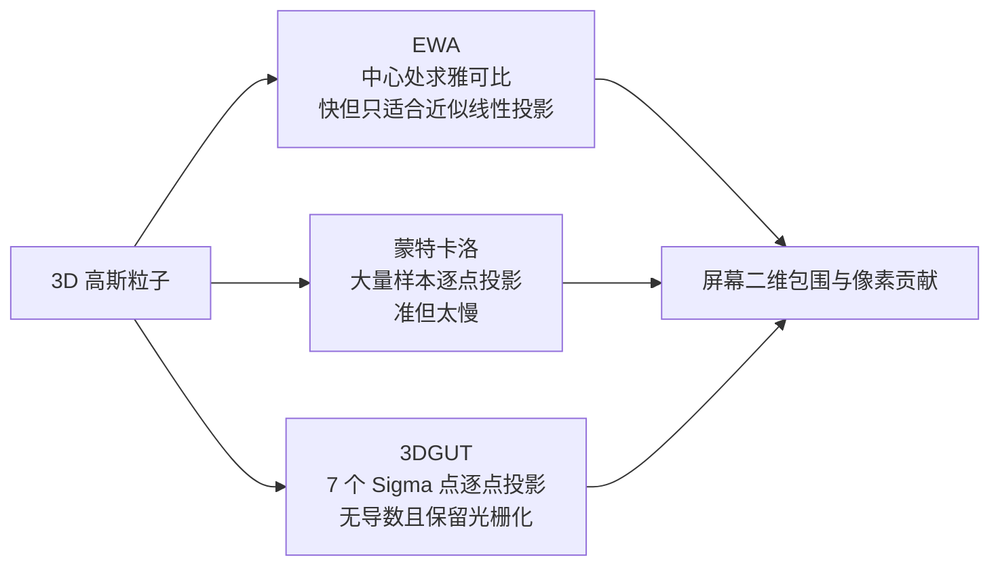
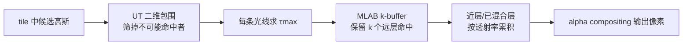
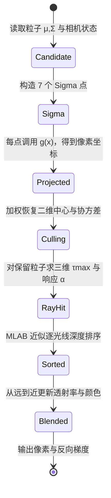
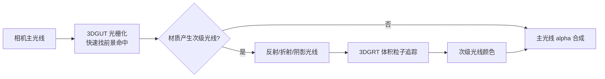

# 3DGUT：任意畸变相机与次级光线的高斯光栅化

> **原文标题**：3DGUT: Enabling Distorted Cameras and Secondary Rays in Gaussian Splatting
>
> **作者**：Qi Wu、Janick Martinez Esturo、Ashkan Mirzaei、Nicolas Moenne-Loccoz、Zan Gojcic（NVIDIA、University of Toronto）
>
> **会议**：CVPR 2025 Oral
>
> **论文与代码**：[论文 PDF](https://research.nvidia.com/labs/toronto-ai/3DGUT/res/3DGUT_ready_main.pdf)、[项目页](https://research.nvidia.com/labs/toronto-ai/3DGUT/)、[3dgrut 官方仓库](https://github.com/nv-tlabs/3dgrut)

**一句话概括**：3DGUT 保留 3DGS 的 tile 光栅化速度，把“用雅可比线性化投影高斯”换成“用七个 Sigma 点真实通过相机模型”，再用三维最大响应点和近似逐射线排序把表示对齐到 3DGRT。于是同一组高斯既能处理鱼眼、径向畸变、滚动快门，也能用光栅化主光线加光线追踪次级光线表现反射和折射。

> 如果还不熟悉标准 3DGS 的完整原理（协方差矩阵、EWA splatting、tile 光栅化等），可以先读 [3D 高斯溅射从零精通：3DGS 完整原理与工程实现](/系列/3dgs_from_scratch/index) 系列，那里第 14 章也提到了本文是“相机模型局限”这一类问题的代表性改进。

## 阅读地图与前置知识

这篇文章假设读者知道向量、矩阵乘法和基本概率，但不假设知道 Gaussian Splatting 或 Kalman Filter：

- [3D Gaussian Splatting：用一堆椭球把真实场景搬进电脑](/前置知识/007a_前置知识_3D_Gaussian_Splatting三维场景重建) — 高斯粒子参数、alpha 合成和训练循环
- [无迹变换与 Sigma 点](/前置知识/008h_前置知识_无迹变换与Sigma点) — 本文最关键的统计工具，包含平方函数的数值例子
- [概率密度函数与高斯分布](/前置知识/002b_前置知识_概率密度函数与高斯分布) — 均值、协方差和高斯形状
- [鱼眼相机方案：大视场角与畸变模型](/硬件基础/H09_鱼眼相机方案) — 等距投影、畸变多项式和滚动快门的硬件背景
- [雅可比矩阵与微分运动学](/前置知识/003b_前置知识_雅可比矩阵与微分运动学) — 理解“局部线性化”到底在近似什么

贯穿全文使用一个例子：机器人头部装着一颗 180° 鱼眼相机，在移动中拍摄桌面上的杯子。杯子表面用很多 3D 高斯表示；相机每一行在不同时间曝光，所以同一帧既有镜头畸变，又有滚动快门。

## 一 3DGS 的边界到底在哪里

### 1.1 3DGS 的输入和输出

一个 3DGS 粒子是三维高斯：中心 $\boldsymbol\mu\in\mathbb R^3$、协方差 $\boldsymbol\Sigma\in\mathbb R^{3\times3}$、颜色 $\mathbf c$ 和不透明度 $\sigma$。协方差通常写成旋转与缩放的乘积，保证它在训练中始终是合法椭球。给定相机，渲染器要做三件事：找到可能覆盖某个像素的粒子、按深度排序、沿像素把颜色做 alpha 合成。

### 1.2 EWA splatting 的线性化假设

传统 3DGS 使用 EWA splatting。设世界坐标到屏幕的相机投影为非线性函数 $\mathbf v=\mathbf g(\mathbf x)$；它在高斯中心附近用切平面近似，得到二维协方差：

$$
\boldsymbol\Sigma' = \mathbf J_{[:2,:3]}\,\mathbf W\boldsymbol\Sigma\mathbf W^T\,\mathbf J_{[:2,:3]}^T
$$

**这个公式在做什么**：把三维椭球先变到相机坐标，再用投影函数在中心处的雅可比 $\mathbf J$ 把它压成屏幕上的二维椭圆；这个椭圆随后只负责快速判断“哪些 tile 可能被该粒子影响”。

::: details 📐 公式详解（点击展开）

| 子表达式 | 它是谁 | 它在干嘛 |
|---|---|---|
| $\mathbf W\boldsymbol\Sigma\mathbf W^T$ | **相机坐标中的三维椭球** | 把世界坐标下的粒子形状旋到相机坐标系，平移不影响协方差 |
| $\mathbf J$ | **中心处的局部尺子** | 测量三维点在极小位移下如何改变像素坐标；它只描述一阶变化 |
| $\mathbf J_{[:2,:3]}$ | **取屏幕两个方向** | 从三维到二维时丢掉深度输出，只保留横向和纵向像素变化 |
| $\boldsymbol\Sigma'$ | **tile culling 的椭圆包围** | 用二维高斯的尺度和方向筛掉不可能影响该像素的粒子 |

**用人话读**：“把椭球搬到相机前，在中心点架一把直尺，用直尺的局部线性读数估计整个椭球在屏幕上的影子。”

**为什么会失效**：针孔投影在视场边缘已经有明显曲率；鱼眼的角度到像素距离关系更弯；滚动快门甚至让同一图像行对应不同的外参。一个固定的 $\mathbf J$ 无法同时表达这些变化。论文指出，即便是理想针孔，EWA 也会因忽略二阶项产生误差，畸变越强误差越大。
:::

对杯子中心附近的一小块表面，切线近似可能够用；但杯子靠近鱼眼边缘时，椭球的一侧被压缩、另一侧被拉伸，真实投影不再是一个标准二维高斯。更麻烦的是，若相机在曝光期间横向移动，图像顶部和底部的投影函数根本不是同一个函数。

### 1.3 三条路线的计算取舍



> 三种方法都在估计“投影后粒子覆盖哪里”，区别是如何在精度和计算量之间取舍。3DGUT 的关键设计是只用七个有结构的点，而不是把整条光线变成数百次采样。

## 二 3DGUT 的核心替换：投影高斯，而不是线性化相机

### 2.1 三维高斯的七个 Sigma 点

3DGUT 把三维粒子看成一个带协方差的随机变量。三维输入 $n=3$，因此使用中心点加三条主轴的正负点，共七个：

$$
\mathbf x_i=\begin{cases}
\boldsymbol\mu,&i=0\\
\boldsymbol\mu+\left[\sqrt{(3+\lambda)\boldsymbol\Sigma}\right]_i,&i=1,2,3\\
\boldsymbol\mu-\left[\sqrt{(3+\lambda)\boldsymbol\Sigma}\right]_{i-3},&i=4,5,6
\end{cases}
$$

**这个公式在做什么**：用七个确定性探针代表整个三维椭球的中心、三个主轴方向和三个主轴尺度。每个探针随后独立通过真实相机投影，而不是让一个雅可比代表整个椭球。

::: details 📐 公式详解（点击展开）

| 子表达式 | 它是谁 | 它在干嘛 |
|---|---|---|
| $\mathbf x_0=\boldsymbol\mu$ | **中心探针** | 记录粒子中心的投影位置 |
| $\sqrt{(3+\lambda)\boldsymbol\Sigma}$ | **椭球骨架** | 矩阵平方根的每一列给出一条带方向和长度的主轴位移 |
| $\boldsymbol\mu\pm[\cdot]_i$ | **正负探针** | 分别探查主轴两侧的非线性变化；成对摆放可抵消一阶偏移 |
| $\lambda=\alpha^2(3+\kappa)-3$ | **点距控制量** | 由超参数 $\alpha,\kappa$ 决定探针离中心多远；3DGUT 使用 $\alpha=1,\kappa=0$ |

**用人话读**：“在椭球中心和三条轴的两端各放一个探针，让七个点替整团高斯去试探相机的弯曲程度。”

**为什么是七个而不是随机点**：随机点需要很多样本才能稳定估计均值和协方差；七个结构化点直接匹配输入的一阶和二阶统计量。三维问题的点数固定，不随图像分辨率或粒子数量爆炸。
:::

矩阵平方根可以从 3DGS 已有的旋转 $\mathbf R$ 和缩放 $\mathbf S$ 直接得到：$\boldsymbol\Sigma=\mathbf R\mathbf S\mathbf S^T\mathbf R^T$，所以实现不必额外做昂贵的特征分解。

### 2.2 每个点使用完整相机模型

将七个点送入相机函数：

$$
\mathbf v_{\mathbf x_i}=\mathbf g(\mathbf x_i),\qquad
\mathbf v_{\boldsymbol\mu}=\sum_{i=0}^{6}w_i^\mu\mathbf v_{\mathbf x_i},\qquad
\boldsymbol\Sigma'=\sum_{i=0}^{6}w_i^\Sigma(\mathbf v_{\mathbf x_i}-\mathbf v_{\boldsymbol\mu})(\mathbf v_{\mathbf x_i}-\mathbf v_{\boldsymbol\mu})^T
$$

**这个公式在做什么**：先让每个 Sigma 点真实通过同一个投影 API，再从七个二维结果恢复投影中心和二维协方差。相机函数可以是针孔、等距鱼眼、径向畸变，也可以把“行号对应的曝光时间”带入滚动快门外参。

::: details 📐 公式详解（点击展开）

| 子表达式 | 它是谁 | 它在干嘛 |
|---|---|---|
| $\mathbf g(\mathbf x_i)$ | **真实投影器** | 对第 $i$ 个三维点执行完整畸变、裁剪和时间相关外参，不需要写雅可比 |
| $w_i^\mu$ | **重心账本** | 将七个像素点加权平均，得到投影高斯的中心 |
| $\mathbf v_{\mathbf x_i}-\mathbf v_{\boldsymbol\mu}$ | **相对新中心的偏移** | 先减去变换后的中心，避免把整体平移误当成粒子变宽 |
| $w_i^\Sigma(\cdot)(\cdot)^T$ | **形状账本** | 累加每个点的方向扩散，得到二维椭圆的协方差 |

**用人话读**：“七个探针各自走完整的相机函数，走完后重新量它们的中心和散布。”

**为什么这能支持任意模型**：3DGUT 的近似对象从“相机函数”换成“输入高斯”。开发者只需提供逐点投影 $\mathbf g$；不论函数里有多少畸变项或时间变量，UT 层都不需要重新推导导数。
:::

3DGUT 设置 $\alpha=1,\beta=2,\kappa=0$。此时中心点的均值权重为 0，但中心点仍参加协方差计算；这不是遗漏，而是缩放无迹变换的标准权重分工。更完整的权重解释和一维数值例子见[无迹变换前置知识](/前置知识/008h_前置知识_无迹变换与Sigma点)。

### 2.3 UT 只负责“找得快”，不负责最终响应

一个容易误读的细节是：论文并没有把二维协方差当作最终的高斯响应。$\boldsymbol\Sigma'$ 只用于沿用 3DGS 的 tile 划分和 culling，快速找出“可能影响这个像素”的粒子。真正评估粒子对一条光线的贡献时，3DGUT 回到三维高斯空间。

这一区分解决了一个反向传播问题：如果直接在二维畸变坐标里算粒子响应，梯度还要穿过非线性投影；在三维中评估，则可以绕开这条不稳定的路径。

## 三 从二维椭圆响应改成三维最大响应

### 3.1 沿光线寻找最可能命中的位置

像素对应一条光线 $\mathbf r(\tau)=\mathbf o+\tau\mathbf d$，其中 $\mathbf o$ 是光线原点，$\mathbf d$ 是方向。对三维高斯而言，最合适的单点采样位置是让高斯响应最大的 $\tau$：

$$
\tau_{\max}=\frac{(\boldsymbol\mu-\mathbf o)^T\boldsymbol\Sigma^{-1}\mathbf d}{\mathbf d^T\boldsymbol\Sigma^{-1}\mathbf d}
$$

**这个公式在做什么**：在整条像素光线上选出离椭球中心最近的“椭球度量距离”位置，用该点的高斯响应代表粒子对这条光线的贡献。

::: details 📐 公式详解（点击展开）

| 子表达式 | 它是谁 | 它在干嘛 |
|---|---|---|
| $\boldsymbol\Sigma^{-1}$ | **椭球距离尺** | 把不同轴向的尺度纳入距离；沿长轴偏移和沿短轴偏移的代价不同 |
| $(\boldsymbol\mu-\mathbf o)^T\boldsymbol\Sigma^{-1}\mathbf d$ | **朝中心的投影量** | 计算从光线原点朝粒子中心方向，在椭球度量下沿光线方向有多少对齐 |
| $\mathbf d^T\boldsymbol\Sigma^{-1}\mathbf d$ | **光线尺度归一化** | 修正光线方向在椭球度量下的长度，使结果成为可用的光线参数 |
| $\tau_{\max}$ | **最大响应深度** | 把光线放到该位置时，高斯指数中的距离平方最小，响应最大 |

**用人话读**：“沿像素光线滑动，找到穿过椭球最厚处的那一点，用它代表这颗粒子。”

**为什么不继续使用二维 $(\Delta x,\Delta y)$**：二维响应把投影误差和粒子响应绑在一起，畸变越强，反向传播越依赖近似雅可比。三维最大响应只使用高斯自身的中心、协方差和光线几何，投影函数不会出现在这一步。
:::

工程实现会把光线和粒子变换到 canonical Gaussian space：$\mathbf o_g=\mathbf S^{-1}\mathbf R^T(\mathbf o-\boldsymbol\mu)$、$\mathbf d_g=\mathbf S^{-1}\mathbf R^T\mathbf d$。在这个坐标系里高斯是单位球，求最大响应退化为点到直线的投影，数值更稳定，也避免显式求逆病态协方差。

### 3.2 代价：单点评估不是完整体积分

3DGUT 与 3DGRT 一样，用一个最大响应点近似一颗粒子沿光线的积分。它速度快，但当多个高斯在深度方向严重重叠时，单点可能无法准确表达每层粒子的体积贡献。论文把“重叠高斯的精确渲染”列为限制，并指出未来可借鉴多样本方法（如 EVER）。

## 四 排序：从 tile 全局深度到 per-ray 近似

### 4.1 为什么全局排序不够

标准 3DGS 把一个 tile 内的粒子按某个全局深度排序。可是两个椭球在同一个 tile 中，沿不同像素光线的 $\tau_{\max}$ 可能不同：A 在左侧像素比 B 近，在右侧像素却比 B 远。全局顺序不可能同时正确。

### 4.2 MLAB 的 k-buffer 近似

3DGUT 的 sorted 版本采用 MLAB（Multi-Layer Alpha Blending）思路：每条光线保留最远的 $k$ 个命中粒子（论文典型取 $k=16$），其余较近命中在遍历中逐步混合；当已混合部分的透射率接近零，就不必继续保留后层。这样得到的顺序更接近逐射线的 $\tau_{\max}$，但不需要像 3DGRT 那样建立完整的光线追踪加速结构。



> UT 提供空间上的候选集合，$\tau_{\max}$ 提供光线上的局部深度，MLAB 在两者之间补上逐射线顺序；三步各自解决不同问题。

### 4.3 与 Hybrid Transparency 的取舍

另一种 HT（Hybrid Transparency）保留最靠近的 $k$ 个命中，再从远到近累积其余粒子。它能更准确恢复近处遮挡，但必须遍历全部候选粒子；没有专用优化时，代价可能比 MLAB 更高。论文因此把 MLAB 作为默认的 sorted 方案，而不是声称它恢复了严格的光线追踪顺序。

## 五 一个像素从输入到输出的完整生命周期

下面把 3DGUT 的状态转换按真实执行顺序写全。这里没有“训练时突然新增”的隐藏步骤：



对每个候选粒子，响应使用高斯核在最大响应点处的值，再与颜色和当前透射率相乘。论文沿用 3DGS 的颜色合成思想，但把粒子响应从二维 conic 评估换成三维点评估，因此反向传播主要经过三维位置、旋转和缩放参数。

## 六 训练实现：改了哪些代码，保留了哪些代码

论文基于 3DGS/3DGRT，用 PyTorch 加自定义 CUDA kernel。为了公平比较，大部分 3DGS 超参数保留不变：训练 30k iterations，损失是 $L_2+0.2L_{SSIM}$；UT 使用 $\alpha=1,\beta=2,\kappa=0$；密度化和裁剪每 300 次迭代执行一次。

实现 3DGUT 时，最小的模块边界可以概括为三处：

| 模块 | 3DGS 原实现 | 3DGUT 替换 |
|---|---|---|
| 投影 | 相机中心处的 EWA 雅可比 | 七点 UT 投影与二维矩估计 |
| 粒子响应 | 屏幕二维 conic | 三维 $\tau_{\max}$ 处的高斯响应 |
| 排序 | tile 全局深度 | 可选 MLAB per-ray 近似 |
| 合成 | alpha blending | 保持体积粒子合成形式，便于对齐 3DGRT |

下面这段伪代码只展示模块关系，不是论文官方 API。它读取 3DGS 粒子已有的 $R,S,\mu$，再把投影函数作为回调传入，因此滚动快门只需在回调内部根据行坐标计算时间外参。

```python
def project_particle(mu, rotation, scale, camera_project):
    # Sigma = R S S^T R^T; columns are the three principal-axis offsets.
    sigma_root = rotation @ diag(scale)
    offsets = sqrt(3.0) * sigma_root
    sigma_points = [mu]
    sigma_points += [mu + offsets[:, j] for j in range(3)]
    sigma_points += [mu - offsets[:, j] for j in range(3)]

    # The callback may be pinhole, fisheye, or rolling-shutter aware.
    image_points = [camera_project(point) for point in sigma_points]
    mean_2d = weighted_mean(image_points, mean_weights)
    cov_2d = weighted_covariance(image_points, mean_2d, covariance_weights)
    return mean_2d, cov_2d
```

代码中的 `cov_2d` 只进入 tile culling；光线真正命中后还要调用三维最大响应求解器。把这两个用途混在一个函数里，会错误地让畸变投影梯度进入粒子响应路径，也会失去 3DGUT 与 3DGRT 对齐的好处。

## 七 实验：速度没有免费，优势集中在复杂相机

### 7.1 标准针孔数据集

在 MipNeRF360 上，论文报告的单张图 FPS 为：原始 3DGS 347，3DGUT（不排序）265，3DGUT sorted 200，3DGRT 52。也就是说，UT 和三维响应有额外开销，但仍比光线追踪快约 4 倍；在完美针孔输入上，PSNR/SSIM/LPIPS 与 3DGS 接近，说明泛化能力没有以明显画质损失换来。

在 Tanks & Temples 上，3DGS 为 476 FPS，3DGUT 为 277 FPS，sorted 版本为 272 FPS。这里 sorted 的质量略有波动，原因是近似逐射线排序和单点响应都可能改变半透明粒子的组合顺序。

### 7.2 鱼眼 Scannet++

这是 3DGUT 真正有区分度的实验。数据由 1752×1168 鱼眼相机采集，结果为：3DGS（先去畸变）PSNR 22.76、SSIM 0.798；FisheyeGS 28.15、0.901；3DGUT sorted 29.11、0.910。粒子数量也从 FisheyeGS 的 1.07M 降到 0.38M。

这里不能只看分数：去畸变会裁掉鱼眼边缘的大块像素，因此普通 3DGS 训练时根本没有看到那些区域；FisheyeGS 虽为特定等距鱼眼推导了雅可比，仍只能覆盖那个模型。3DGUT 直接在原始畸变图像上训练，保留了全部观测，并且不用为每种鱼眼变体重新推导公式。

### 7.3 Waymo 滚动快门

Waymo 场景由带畸变、带滚动快门的车载相机采集。论文在 9 个静态场景上报告：3DGS（先校正滚动快门）PSNR 29.83、SSIM 0.917；3DGRT 29.99、0.897；3DGUT sorted 30.16、0.900。3DGUT 的优势不是“所有指标都大幅领先”，而是它直接使用原始时间相关相机模型，不需要先把图像变成一个丢失边缘信息的静态针孔版本。

### 7.4 投影近似的消融

论文用每个高斯 500 个蒙特卡洛样本作为参考，计算 EWA/UT 投影分布的 KL 散度。等距鱼眼视场从 60° 增加到 260°、径向畸变系数增大、滚动快门横向位移增大时，UT 的中位 KL 基本保持稳定；不带这些效应的 EWA 误差出现长尾。这个实验隔离的是“投影是否正确”，不是最终训练 PSNR，因此它直接支持论文的核心机制判断。

## 八 次级光线：为什么还能做反射和折射

### 8.1 光栅化本来只能处理主光线

普通 splatting 对每个像素只构造一条从相机发出的主光线，并把沿途高斯合成到像素。反射需要在命中表面后沿反射方向再发一条光线，折射需要根据法线和折射率改变方向；阴影也需要从命中点向光源发射遮挡查询。这些都是次级光线，超出了固定屏幕像素覆盖的范围。

### 8.2 3DGUT 与 3DGRT 的混合流程

3DGUT 通过三维响应和近似排序，使同一组粒子也能被 3DGRT 的追踪器理解。混合渲染流程是：先用 3DGUT 光栅化主光线，找到每条光线最前面的高斯命中并丢弃其后的命中；再从命中位置生成反射/折射次级光线，用 3DGRT 追踪这些光线。



> 3DGUT 并没有把光栅化变成完整光线追踪；它只把主光线阶段和 3DGRT 的粒子定义对齐，从而可以在需要时把昂贵的追踪限制在次级光线上。

论文图 8 的对比显示，直接用 3DGRT 渲染不同训练方法得到的表示时，3DGUT sorted 训练出的表示与追踪结果最一致。StopThePop 或原始 3DGS 虽然屏幕画面可能不错，但粒子顺序和三维响应定义不同，换成追踪器后会出现更大差异。

## 九 3DGUT 没有解决的问题

### 9.1 大畸变下二维包围仍是高斯近似

七个 Sigma 点可以精确通过投影函数，但七个点恢复出的 $\boldsymbol\Sigma'$ 仍是一个二维高斯。若鱼眼视场极大，真实投影形状可能弯成香蕉状或被裁剪成非凸区域；一个椭圆包围会漏掉像素，或包进大量无效 tile。论文明确指出：UT 让“点的投影”精确，却不保证“投影后的形状仍是高斯”。

### 9.2 单点响应无法处理严重重叠

三维 $\tau_{\max}$ 只取一处响应。多个高斯沿同一光线高度重叠时，真实体积分布可能有多个峰，单点会把它们压成一个峰，造成颜色和深度偏差。

### 9.3 速度仍略慢于原始 3DGS

在 MipNeRF360 的详细计时中，原始 3DGS 总耗时约 2.88 ms，3DGUT 约 3.77 ms，sorted 约 4.98 ms。额外时间来自七点投影、三维响应和 per-ray buffer；因此“实时”不能理解为“与原始 3DGS 零开销相同”。

### 9.4 训练数据仍决定重建上限

3DGUT 能忠实建模相机，但不能修复 COLMAP 位姿错误、曝光变化、动态物体或错误的时间同步。对滚动快门数据，必须提供可靠的相机运动和每行曝光时间；否则 UT 只会精确执行一个错误的投影模型。

## 十 把论文放回工程决策

| 场景 | 推荐表示 | 关键理由 |
|---|---|---|
| 静态针孔相机、只要主光线 | 原始 3DGS 或 StopThePop | 速度最快，EWA 误差通常可接受 |
| 鱼眼/大视场、希望用原始畸变图训练 | 3DGUT | 不需为每种畸变重新推导雅可比，保留边缘像素 |
| 车载/机器人移动相机、滚动快门 | 3DGUT 或 3DGRT | 可把时间相关外参直接放入投影函数 |
| 反射、折射、阴影且主光线很多 | 3DGUT + 3DGRT 混合 | 光栅化承担大多数主光线，追踪只处理次级光线 |
| 需要精确多层体积积分 | 3DGRT/EVER 类方法 | 3DGUT 的单点响应在高重叠区域有上限 |

对 NVIDIA NuRec/Real2Sim 工作流，3DGUT 的价值也应准确定位：它是视觉重建和渲染层，不会自动生成碰撞网格、刚体质量、关节约束或摩擦参数。现有[COLMAP + 3DGUT 工程流程](/系列/nvidia_real2sim2real_deep_dive/02_场景重建_COLMAP与3DGUT)负责把照片变成高斯/USDZ；后续 Asset Harvester、Proxy Mesh 和物理标注才让场景可交互。

## 十一 最终记忆点

1. **问题**：EWA 把非线性相机在高斯中心处线性化，遇到畸变和滚动快门会失真。
2. **投影改动**：3DGUT 用七个 Sigma 点通过完整相机函数，再恢复二维中心和协方差；UT 只做候选筛选。
3. **响应改动**：候选粒子沿每条光线在三维中求 $\tau_{\max}$，避免把畸变投影梯度带进粒子响应。
4. **排序改动**：MLAB 用 k-buffer 近似逐射线顺序，让光栅化表示更接近 3DGRT。
5. **能力边界**：它支持任意投影和混合次级光线，但不保证强畸变下的二维高斯形状，也不解决高斯严重重叠的多峰积分。

真正理解 3DGUT 的标志，不是记住“用了 Unscented Transform”，而是能指出这套工具在管线中的位置：**UT 负责把高斯投影到屏幕并建立 culling 结构；三维最大响应负责评估粒子；MLAB 负责把 tile 候选变成近似逐光线顺序；3DGRT 只在需要次级光线时接管追踪。**

## 参考资料

- Wu et al., “3DGUT: Enabling Distorted Cameras and Secondary Rays in Gaussian Splatting”, CVPR 2025.
- Kerbl et al., “3D Gaussian Splatting for Real-Time Radiance Field Rendering”, SIGGRAPH 2023.
- Moenne-Loccoz et al., “3D Gaussian Ray Tracing: Fast Tracing of Particle Scenes”, SIGGRAPH Asia 2024.
- Julier and Uhlmann, “A New Extension of the Kalman Filter to Nonlinear Systems”, 1997（Unscented Transform 基础）。
- [nv-tlabs/3dgrut](https://github.com/nv-tlabs/3dgrut) 官方实现与配置。
