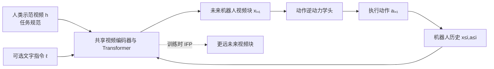
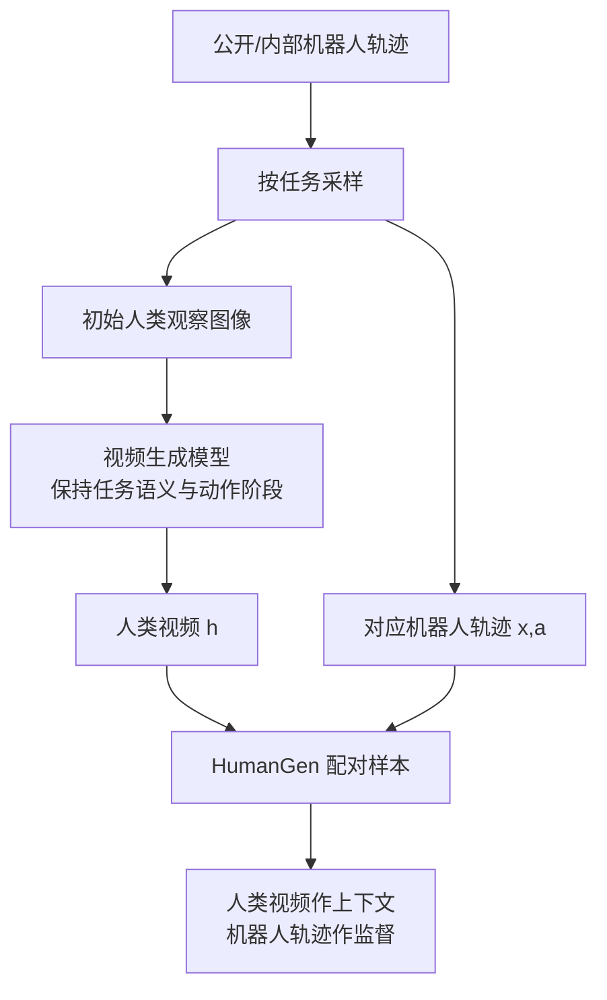

# Zero-WAM：人类视频引导的零样本世界动作模型

> **原文标题**：Zero-WAM: In-Context World-Action Modeling from Human Videos for Open-Ended Task Generalization  
> **作者**：Jiaming Zhou、Qihang Zhang、Gangwei Xu 等  
> **论文链接**：[arXiv:2608.26103](https://arxiv.org/abs/2608.26103)  
> **项目页**：[robbyant-research.github.io/Zero-WAM](https://robbyant-research.github.io/Zero-WAM/)  
> **一句话概括**：Zero-WAM 把一段“人类如何完成任务”的视频当成上下文指令，让机器人在没有见过该任务机器人示范、也不更新参数的情况下，先预测未来机器人画面，再由逆动力学动作头输出可执行动作；HumanGen 数据管线和 IFP 辅助目标分别解决“配对数据不够”和“模型懒得看视频”两个瓶颈。

## 阅读地图

- [世界模型基础](/前置知识/000t_前置知识_世界模型基础) —— 区分预测未来状态与直接回归动作。
- [Flow Matching 与连续归一化流](/前置知识/000g_前置知识_Flow_Matching与连续归一化流) —— 本文视频和动作去噪目标的数学底座。
- [RoPE 旋转位置编码](/前置知识/002k_前置知识_RoPE旋转位置编码) —— 理解人类视频与机器人视频如何共存于一个序列。
- [逆动力学模型与潜动作学习](/前置知识/007b_前置知识_逆动力学模型与潜动作学习) —— 理解“未来画面 → 动作”的分解。
- [Fast-WAM 精读](/论文综述/093_FastWAM_世界动作模型无需推理时想象) —— Zero-WAM 沿用的世界动作模型范式及其训练/部署边界。

## 贯穿全文的例子：给机器人看“拧瓶盖”视频

假设一台双臂机器人从未被示教过“拧开蓝色瓶子的盖子”。部署时，人拿手机拍一段视频：左手固定瓶身，右手捏住瓶盖并逆时针旋转。机器人看到这段视频和当前桌面画面后，需要自己推断：应该先靠近瓶身、哪只手抓瓶身、瓶盖何时建立接触、旋转方向是什么。它不能把人手的像素轨迹直接复制到机器人关节，因为两者的视角、尺寸、自由度和手形都不同。

Zero-WAM 的核心承诺是：**视频不是要复制的动作标签，而是要读取的任务规范**。模型从视频中提取“任务演化”，再把这个演化迁移到机器人自己的视觉和动作空间。

> 图中要看的是信息边界：人类视频只在“任务规范”入口进入主视频分支，动作头通过预测的机器人未来画面间接得到语义；IFP 只在训练时施加额外约束，部署时被移除。

## 一 论文要解决的不是“看视频做动作”这么简单

### 1.1 语言指令为什么不够

语言可以说“拧开瓶盖”，却没有规定瓶子在多物体场景中的身份、双手分工、接触顺序和旋转幅度。对训练集中出现过的任务，策略可以靠记忆物体外观或固定轨迹完成；对未见任务，真正需要的是从示范中抽取**可迁移的因果顺序**。人类视频同时提供目标物体、相对运动和接触后结果，比一句短指令更接近任务的完整 specification。

### 1.2 直接复制人手轨迹为什么不成立

人手视频没有机器人动作标签。即使估计出腕部位姿，人的手腕坐标系、相机尺度、手指自由度也和 Franka 或双臂平台不一致。因此 Zero-WAM 选择“视频预测 + 逆动力学”分解：视频分支先回答“机器人下一段画面应该变成什么样”，动作分支再回答“从当前画面到该未来画面需要怎样的动作”。这让跨具身差异由状态预测承担，而不是强迫一个动作回归器比较不可比的坐标。

## 二 数据贡献：HumanGen 如何自动制造配对上下文

### 2.1 任务级重采样先解决数据分布偏斜

公开机器人视频数据常被少数高频任务占据，例如同一个物体被重复遥操作数千次。论文把每条轨迹按“操作动作 + 物体”重新分成任务，再在任务层面均衡采样。每个训练 epoch 约抽取 6,000 多个任务、约 400K 条机器人轨迹；这样模型看到的是任务多样性，而不是某几个任务的重复次数。

### 2.2 HumanGen 的生成闭环

论文从一条机器人轨迹出发，用视觉语言模型生成初始人类第一视角图像，再用视频生成模型合成与机器人轨迹语义匹配的人类操作视频。生成的人类视频与原机器人轨迹组成一个 ICL pair：前者是任务提示，后者提供可执行的机器人未来视频和动作监督。

> 这条管线的关键不是“生成得像真人”，而是人类视频和机器人轨迹必须语义对齐：机器人可以换形态、视角或背景，但两段视频表达的是同一个任务。

HumanGen 最终包含 74.2K 个跨 8.6K 任务的机器人-人类 ICL pair，数据源覆盖公开数据、内部采集和 RoboTwin 仿真。它把昂贵的“人类与机器人同步采集”变成可扩展的自动配对，但也带来一个必须正视的风险：生成视频中的动作物理若不可靠，模型可能学到视觉上合理、动力学上错误的任务演化。因此论文仍用机器人轨迹提供最终可执行监督，而不是把生成视频当作动作真值。

## 三 Zero-WAM 的模型分解

### 3.1 因果视频动作建模

机器人轨迹被切成视频块 $x_i$ 与对齐动作块 $a_i$。在第 $i$ 个控制步，模型根据历史和任务条件预测下一视频块与动作块的联合分布：

$$
p_\theta(x_{i+1},a_{i+1}\mid x_{\le i},a_{\le i},c)
=p^{\mathrm{vid}}_\theta(x_{i+1}\mid x_{\le i},a_{\le i},c)\,p^{\mathrm{act}}_\theta(a_{i+1}\mid x_{\le i},a_{\le i},x_{i+1},c).
$$

**这个公式在做什么**：把“下一步发生什么”和“为了让它发生需要怎么动”拆成先视频、后动作两个条件问题；动作头不必直接理解人类手势，而是从机器人域的未来视觉状态反推动作。

::: details 📐 公式详解（点击展开）

| 子表达式 | 它是谁 | 它在干嘛 |
|---|---|---|
| $p^{\mathrm{vid}}_\theta$ | **世界预测器** | 将历史和任务规范变成机器人下一段视觉状态 |
| $p^{\mathrm{act}}_\theta$ | **逆动力学执行器** | 根据当前历史和目标未来画面解码动作 |
| $x_{\le i},a_{\le i}$ | **机器人记忆** | 提供真实本体已经走到哪里、做过什么 |
| $c$ | **任务规范入口** | 可以是文字，也可以是人类视频加文字 |

**用人话读**：先想象机器人下一刻应看到的画面，再计算把当前状态变成那幅画面的动作。

**为什么是这个形式**：直接从人类视频回归机器人动作会遭遇具身坐标不一致；把中间目标放在机器人视觉空间，能让同一任务规范适配不同机器人。训练时用真实下一视频块 teacher forcing，推理时再换成模型生成的块，因此部署会面对视频预测误差累积。
:::

Zero-WAM 用 Mixture-of-Transformers（MoT）实现这两个分支：视频流和动作流有各自的 QKV、FFN 和输出头，但 token 放在同一序列中，通过共享注意力交换信息。动作 token 排在未来视频 token 之后，保证动作可以读取预测的未来机器人画面。

### 3.2 人类视频如何进入上下文

训练时，人类视频 $h$ 被放在机器人历史之前，视频分支使用的上下文可写成 $[h,x_{\le i}],a_{\le i},\ell$。动作分支不直接看 $h$，因为人类视频的语义已经被主视频分支压进了预测的 $x_{i+1}$；这一步是一个明确的数据流约束，而不是实现遗漏。

人类视频和机器人多视角视频使用同一个 Wan-2.2 VAE 映射到共享 latent 空间。为防止两个视频的 token 在 RoPE 中占用相同位置，论文沿高度坐标给人类 token 加偏移：机器人坐标保持原值，人类坐标整体移到机器人布局之外。这样模型既能通过注意力交互，又能知道“这是任务提示，不是当前机器人观测”。

## 四 IFP：让模型不能只靠最近几帧猜答案

### 4.1 shortcut 从哪里来

在训练集已见任务上，下一视频块通常和最近机器人历史非常相似。模型只做局部外推就能降低 next-chunk loss，根本不需要读取人类视频。到了未见任务，历史没有提供任务顺序和目标选择，模型才突然需要视频提示，因而出现“训练指标很好、零样本执行很差”。

### 4.2 让当前表示同时负责多个未来

IFP（In-context Future Chunk Prediction）从主视频分支当前表示出发，额外预测带时间步长的多个未来块。若当前块索引为 $i$、步长为 $s$，第 $k$ 个目标索引是：

$$
j_k=(i+1)+1+(k-1)s,\qquad k=1,\ldots,K.
$$

**这个公式在做什么**：把监督从“紧挨着的下一块”向时间轴上更远的位置推开，使模型必须理解任务正在往哪个方向发展。

::: details 📐 公式详解（点击展开）

| 子表达式 | 它是谁 | 它在干嘛 |
|---|---|---|
| $i+1$ | **主分支目标** | 当前控制步要生成的下一视频块 |
| $(k-1)s$ | **未来跨度** | 每增加一个 IFP 头，目标再向未来跳 $s$ 个块 |
| $j_k$ | **第 k 个考试题** | 要求同一份当前表示回答的更远未来 |
| $K$ | **预测深度** | 一次训练中施加多少个未来约束 |

**用人话读**：不要只问“下一小段长什么样”，还要问“再过几段会走到哪里”。

**为什么是这个形式**：步长让目标与当前块拉开视觉差异，避免复制近邻外观；多个头并行计算，增加预测难度但不在训练中引入额外的时间依赖。模型实例中取 $K=4,s=2$，损失权重为 $(0.5,0.25,0.15,0.15)$，越近的未来权重越大但更远的未来仍提供梯度。
:::

IFP 头只接收主分支与人类视频交互后的融合表示，不直接接收 $h$。这是最重要的设计细节：若 IFP 自己读取人类视频，它可以独立完成未来预测，主干就不会被迫编码任务提示；而 IFP 推理时会被删除，训练出来的“视频理解能力”也就无法迁移到部署模型。

IFP 的视频损失沿用 Flow Matching。对每个目标块单独采样噪声和时间步，训练网络预测从噪声回到干净视频的速度。Zero-WAM 的完整训练由任务均衡机器人数据的语言条件损失，与 HumanGen 的人类视频条件损失加上 IFP 组成；动作损失始终在机器人域中计算。

## 五 训练、推理与复现实验

训练配置以 Wan-2.2-TI2V-5B 为骨干，视频 Transformer 30 层、隐藏维度 3072；IFP 取 4 个未来块、步长 2。预训练时 Task-diverse VA 与 HumanGen 按 1:5 采样，约消耗 15,360 GPU 小时；RoboTwin 后训练把已见的 43 个任务用于适配机器人本体，7 个任务完全留作未见测试。

推理有两个边界：

1. **语言模式**：只输入文字，适合任务已被语言充分描述的场景。
2. **ICL 模式**：人类视频编码一次并缓存为 prefix memory，语言可选；每一步先生成机器人视频块，再解码动作块。

IFP 头在两种模式下都删除，因此不会增加部署延迟。这个“训练有、推理无”的分工也意味着 IFP 的收益必须体现在主干表示，而不能只体现在辅助头的预测质量。

## 六 结果：提升来自哪里

### 6.1 RoboTwin 零样本跨任务

七个未见任务的宏平均成功率如下，三种方法都只用 43 个已见任务做后训练：

| 方法 | 平均成功率 |
|---|---:|
| WAN-Action（Wan-2.2 初始化） | 10.98% |
| LingBot-VA | 17.45% |
| Zero-WAM | **46.95% ± 0.72** |

Zero-WAM 在七个任务上全部超过两个基线：open microwave 59.0%、move stapler to pad 69.14%、place empty cup 84.87%。最难的三块堆叠只有 9%，但两个基线都是 0%，说明 ICL 提示至少打破了长时程任务的零成功屏障。消融进一步显示：去掉 IFP 后平均成功率降到 28.55%，加入 IFP 带来 18.40 个百分点；只使用任务均衡机器人预训练、屏蔽人类视频的 text-only 变体也达到 39.44%，说明数据重采样和 ICL 是两项相互独立的贡献。

### 6.2 真机结果与边界

在双臂 Franka 上，Zero-WAM 使用人类视频指定未见配置：物体到容器放置 53.3%（LingBot-VA 43.3%）、三物体顺序操作 33.3%（10.0%）、双桌腿精细插入 16.7%（0%）。这些结果说明视频提示能传达顺序、目标孔位和多物体关系，但绝不是“零数据、零适配”：仍需要少量真机示范适配 Franka 的运动学，插入任务的绝对成功率也明显受接触精度限制。

## 七 精读结论：Zero-WAM 真正改变了什么

Zero-WAM 的贡献可以拆成三层：

- **接口层**：把人类视频变成跨任务的 in-context task specification，补上语言难以表达的时空细节。
- **数据层**：用任务级重采样和 HumanGen 自动配对，解决“有机器人动作、没有人类任务视频”的规模瓶颈。
- **目标层**：用 IFP 迫使主干从人类提示中读取更远期任务演化，避免在已见任务上走局部外推捷径。

它的适用边界同样清晰：人类视频必须与目标任务语义匹配；生成视频的物理错误会污染上下文；视频预测仍可能累积误差；真机部署仍需要本体适配数据。最值得复用的工程原则是：**把跨域示范当作状态目标，把可执行动作留在机器人域学习；任何训练期辅助分支都必须通过共享表示影响部署主干，而不能绕过主干独立完成任务。**

