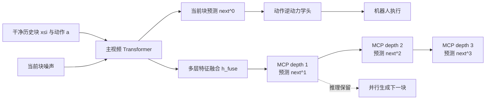
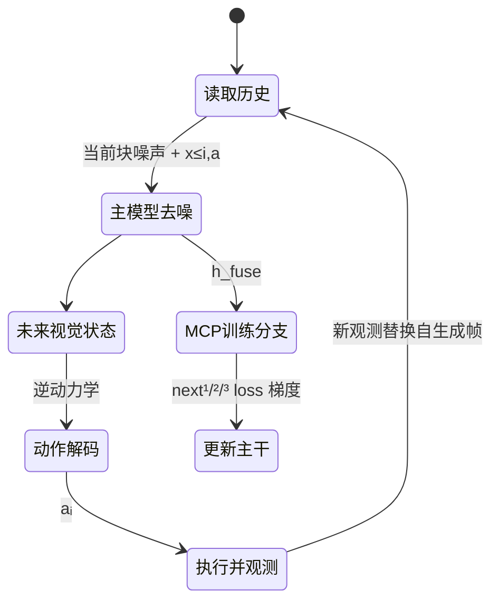

# Next Forcing：用多块预测训练因果世界模型

> **原文标题**：Next Forcing: Causal World Modeling with Multi-Chunk Prediction  
> **作者**：Gangwei Xu、Qihang Zhang、Jiaming Zhou 等  
> **论文链接**：[arXiv:2606.11187](https://arxiv.org/abs/2606.11187)  
> **项目页**：[gangweix.github.io/next-forcing](https://gangweix.github.io/next-forcing/)  
> **一句话概括**：Next Forcing 在 LingBot-VA 的当前视频块 teacher forcing 旁边增加轻量 MCP 辅助模块，同时预测 next¹、next²、next³ 多个未来块；多尺度监督让主干学到真实动力学而不是复制近邻外观，并可把 next¹ 头保留到推理时实现约 2 倍视频块生成加速。

## 阅读地图

- [世界模型基础](/前置知识/000t_前置知识_世界模型基础) —— 理解“预测世界状态”与策略控制的关系。
- [Flow Matching 与连续归一化流](/前置知识/000g_前置知识_Flow_Matching与连续归一化流) —— 本文所有视频/动作去噪损失的共同形式。
- [Causal Attention 因果注意力掩码](/前置知识/001g_前置知识_Causal_Attention因果注意力掩码) —— 理解历史可见、未来不可见的训练约束。
- [Fast-WAM 精读](/论文综述/093_FastWAM_世界动作模型无需推理时想象) —— Next Forcing 所在的因果 WAM 基线谱系。
- [Zero-WAM 精读](./137_ZeroWAM_人类视频引导的零样本世界动作模型) —— 同一研究脉络中用 IFP 解决人类视频 shortcut 的工作。

## 贯穿全文的例子：50 fps 下预测双臂搬盒子

机器人相机以 50 fps 记录“双臂把盒子从左侧搬到右侧”。如果每个视频块只有 1 到 4 帧，相邻块几乎一模一样。标准模型只要把上一块的纹理复制过来，就能在训练初期得到很低的去噪误差，却没有学会盒子下一步的速度、碰撞和最终位置。部署时一旦历史由模型自己生成，复制策略会逐步漂移。

Next Forcing 的做法是：主模型负责当前块，同时让三个轻量头预测再往后 1、2、3 个块。第 3 个未来块已经和当前块有明显差异，单靠像素相似性无法完成，主模型因此被迫编码“盒子正在向右移动、双臂保持怎样的相对关系”这类轨迹级信息。

> 需要注意两条不同的箭头：训练时 MCP 的梯度沿融合特征回到主干；推理时只需保留 depth-1，就能把当前块和下一块并行生成，depth-2/3 不参与部署。

## 一 标准 teacher forcing 的“近视”问题

LingBot-VA 类因果 WAM 把视频 latent 切成块。第 $i$ 步用干净历史块预测当前噪声块，训练稳定、与闭环控制的“执行后重新观察”相容，但监督只覆盖一个局部时间点。高帧率下相邻块的外观差异更小，模型很容易学到 appearance shortcut：把干净历史复制或做微小修正，而不是推断物理状态如何演化。

这和 exposure bias 是不同问题。exposure bias 讨论训练时使用干净历史、推理时使用自生成历史的分布差；Next Forcing 关注的是**即使给定干净历史，当前块监督本身也太局部**。因此它可以与 noisy-history augmentation、Diffusion Forcing 或 Self Forcing 互补，而不是替代它们。

## 二 MCP 的目标构造

### 2.1 时间平移目标

设视频 latent 的块索引为 $i$，MCP 深度 $k$ 对应向未来跳 $k$ 个块。论文将越过序列尾部的目标复制最后一块，以保持张量形状；这些 padding 位置不计入损失。

$$
x^{[k]}_0[i]=x_0[\min(i+k,F)],\qquad k\in\{1,2,3\}.
$$

**这个公式在做什么**：从同一段训练视频中构造三个“更远未来”的监督目标，而不需要额外标注或额外轨迹。

::: details 📐 公式详解（点击展开）

| 子表达式 | 它是谁 | 它在干嘛 |
|---|---|---|
| $x_0[i]$ | **当前真实视频块** | 主模型正在处理的时间位置 |
| $x^{[k]}_0[i]$ | **第 k 层未来答案** | 把当前索引向前移动 $k$ 个块后的真实内容 |
| $\min(i+k,F)$ | **边界钳位器** | 越过末尾时重复最后块，避免读越界 |
| $k$ | **时间视野** | 深度越大，监督越远，外观复制越难 |

**用人话读**：把同一条视频向前错开几格，让不同辅助头分别学习近、中、远三个未来。

**为什么是这个形式**：时间平移只重排已有 latent，开销远小于重新采集数据；边界复制保证批处理形状统一，但尾部 padding 必须从 loss 中排除，否则模型会被奖励去预测人为重复的画面。
:::

每个未来目标独立采样噪声和 flow 时间步：

$$
x^{[k]}_{t_k}=(1-t_k)x^{[k]}_0+t_k\epsilon_k,\qquad \epsilon_k\sim\mathcal N(0,I).
$$

**这个公式在做什么**：给每个未来块制造独立的去噪任务，防止三个 MCP 头共享同一噪声而只学习相关的表面修正。

::: details 📐 公式详解（点击展开）

| 子表达式 | 它是谁 | 它在干嘛 |
|---|---|---|
| $x^{[k]}_0$ | **干净未来块** | 需要恢复的真实目标 |
| $\epsilon_k$ | **独立扰动** | 让每个深度面对不同去噪实例 |
| $t_k$ | **噪声比例旋钮** | 决定输入更像目标还是更像纯噪声 |
| $x^{[k]}_{t_k}$ | **考试输入** | MCP 头实际看到的带噪未来块 |

**用人话读**：每个未来答案都单独加噪，再要求对应的头把它还原。

**为什么 MCP 用更大的时间步偏移**：论文设 $s_{mcp}=10>s_{main}=5$，使 MCP 输入更嘈杂、不能依赖自身带噪目标，只能更多依靠主干融合表示；若两者噪声水平相同，轻量头可能自己吸收监督，主干得到的时序梯度变弱。
:::

### 2.2 多层融合和因果链

主 Wan2.2 Transformer 共 30 层，论文收集第 4、12、20、30 层的隐藏状态，并沿特征维拼接后用两层 MLP 压回隐藏维度：

$$
h_{\mathrm{fuse}}=\mathrm{MLP}([h_4;h_{12};h_{20};h_{30}])\in\mathbb R^{B\times N\times d}.
$$

**这个公式在做什么**：把早期层的粗结构、后期层的细节和当前去噪状态汇成一个共享“轨迹表示”，供所有 MCP 深度使用。

::: details 📐 公式详解（点击展开）

| 子表达式 | 它是谁 | 它在干嘛 |
|---|---|---|
| $h_4,h_{12}$ | **结构观察员** | 保留物体布局与较粗的时序形状 |
| $h_{20},h_{30}$ | **细节观察员** | 提供局部运动和去噪后的精细信息 |
| $[\cdot;\cdot]$ | **信息拼接台** | 沿特征维合并不同深度的证据 |
| MLP | **压缩与对齐器** | 把拼接后的大向量变回主干隐藏维度 |

**用人话读**：不要只听最后一层的结论，把网络中途形成的粗到细证据一起交给未来预测头。

**为什么要多层**：只接最终层时，MCP 梯度主要影响靠近输出的少数参数；多层融合让时间监督直接回到早期表示，消融中去掉该设计，RoboTwin 成功率从 85.8% 降到 83.6%。
:::

随后三个 MCP 模块组成因果链。第 $k$ 层把上一层输出与当前带噪未来块的 patch embedding 拼接，再经投影矩阵和 3 个轻量 Transformer block 预测速度；该输出同时作为下一深度的输入。这样 next² 可以利用 next¹ 的中间判断，next³ 再利用更远的上下文，而不是三个互相独立的头。

## 三 联合视频动作架构与完整状态转移

Next Forcing 沿用 MoT：视频流预测未来视觉状态，动作流以当前历史和未来视觉状态为条件做逆动力学解码。一个闭环控制步的状态转移是：

> 这个循环解释了为什么视频预测质量会影响控制：动作头看到的是未来视觉状态，未来状态的物理一致性提升会通过跨模态注意力传到动作解码。

训练总目标只保留一条真正新增的组合式公式：

$$
\mathcal L=\mathcal L_{video}+\mathcal L_{action}+\sum_{k=1}^{3}w_k\mathcal L^{MCP}_k.
$$

**这个公式在做什么**：同时要求模型预测当前视觉、输出可执行动作、并对多个未来视野负责；MCP 是辅助监督，不取代原有视频和动作任务。

::: details 📐 公式详解（点击展开）

| 子表达式 | 它是谁 | 它在干嘛 |
|---|---|---|
| $\mathcal L_{video}$ | **当前世界预测分** | 约束主模型把当前块从噪声还原为正确视觉状态 |
| $\mathcal L_{action}$ | **执行可行性分** | 约束动作流能把视觉目标转成机器人动作 |
| $\mathcal L^{MCP}_k$ | **第 k 个未来考试分** | 让融合表示携带不同时间尺度的动力学信息 |
| $w_k$ | **监督配比** | 控制近未来与远未来的影响，论文取 $0.5,0.2,0.1$ |

**用人话读**：当前要做对，动作要能执行，再用几个更远的未来检查模型是不是理解了运动规律。

**为什么是加和**：三类目标共享主干但各自对应不同失败模式；只保留当前视频会回到近视 shortcut，只保留 MCP 又会失去精确当前重建和动作控制。权重从近到远递减，避免较难的远期预测压过当前控制稳定性。
:::

## 四 两种推理模式：质量收益与速度收益分开

### 4.1 零额外开销模式

部署时可以删除融合 MLP、投影层和所有 MCP Transformer block。主模型完全按基线逐块去噪，延迟、显存和架构不变；此时得到的全部质量提升来自训练期间传回主干的多尺度梯度。这是最稳妥的上线方式，适合对输出一致性要求高的控制系统。

### 4.2 并行块生成模式

保留 depth-1 MCP 后，一次主模型前向同时得到当前块和下一块。MCP 只有 3 个轻量 Transformer block，远小于 30 层主干，因此额外计算接近免费；下一控制步可直接使用这块预测，视频生成吞吐约提升 2 倍。depth-2/3 不用于部署，因为下一次主模型会重新计算它们的时间位置，强行串起来会累积漂移。

## 五 实验读法

### 5.1 RoboTwin

在 50 个双臂任务上，Next Forcing 达到 Clean 94.1%、Random 93.5%，超过 LingBot-VA 的 92.9%/91.5% 以及 Fast-WAM 的 91.9%/91.8%。更有解释力的是收敛速度：50 fps、5k 步时 Clean/Random 为 70.2%/61.6%，基线只有 45.5%/31.9%；论文报告达到相近基线精度所需步数减少约 2.3 倍。

高帧率优势不是偶然。12 fps 时相邻块已有可见变化，基线还能从局部监督学到部分动力学；50 fps 时相邻块几乎相同，MCP 的 next²/next³ 才真正打破“复制外观”的捷径。

### 5.2 消融告诉我们的工程取舍

| 配置 | Clean 成功率 |
|---|---:|
| 基线（$s_{main}=5$ + noisy history） | 75.6% |
| 基线 + MCP | **85.8%** |
| MCP，$s_{mcp}=5$ | 83.2% |
| 去掉多层融合 | 83.6% |
| MCP Transformer 1 层 | 86.5% |
| MCP Transformer 5 层 | 85.0% |

一个反直觉结果是 1 层头的分数略高于 3 层，但论文默认 3 层，因为它在并行推理中产生更少的视频伪影。也就是说，最优训练成功率不等于最优部署配置；辅助头过强会削弱“主干必须学会”的压力，过弱又会生成不稳定未来。

### 5.3 物理规律与通用视频

在 PhyWorld 上，Next Forcing 将 out-of-template FVD 从 5.3 降至 4.7，异常率从 12% 降至 8%；在约 350 万段通用视频预训练上，50k 步时两个测试集 FVD 分别降低 58%（225→94）和 52%（204→97）。这说明 MCP 的收益不是 RoboTwin 动作标签特有，而是对视频中的速度、碰撞、抛物线等时间规律也有效。

## 六 精读结论与局限

Next Forcing 不是一个更大的 WAM，也不是新的 VAE 或动作空间；它改变的是**监督的时间范围**。当前块目标提供局部精度，多块目标提供轨迹级约束，多层融合和更高 MCP 噪声把梯度牢牢送回主干。训练与推理还可以解耦：删除 MCP 得到零开销质量版，保留 depth-1 得到约 2 倍吞吐版。

代价也很明确：训练阶段要额外计算多个未来去噪头和显存；远期目标依赖同一段视频，不能替代真正多样的长时程数据；并行推理会把 MCP 的预测误差带进下一块，任务越长，漂移风险越大。实践中应先用零额外开销模式验证质量，再在短 chunk、强闭环重观测的控制周期里启用 2 倍加速，并监控视频预测误差而不是只看动作成功率。
