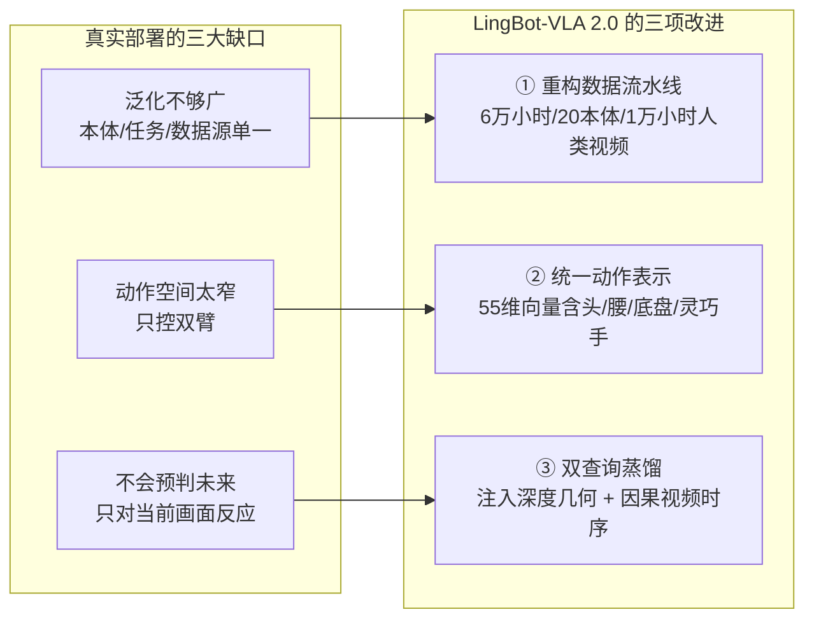
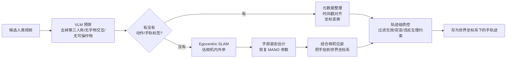
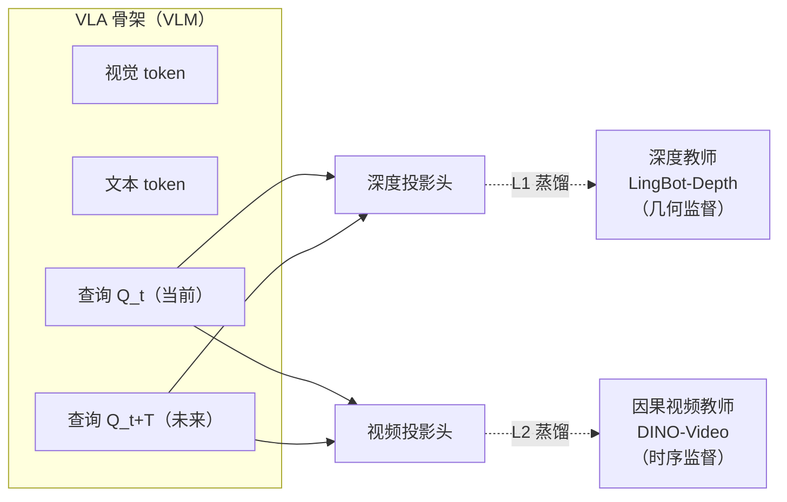

# LingBot-VLA 2.0：从基础到应用，把 VLA 基础模型推向真实机器人部署

> **一句话概括**：LingBot-VLA 2.0 是 Robbyant 开源的 6B 参数视觉-语言-动作（VLA）基础模型，它不追求单点新奇，而是从"数据、动作空间、时序预测"三条实用维度同时发力——用 6 万小时数据（含 1 万小时第一人称人类视频）覆盖 20 种机器人本体，把动作空间从双臂扩到头/腰/移动底盘/灵巧手的全身自由度，并用"双查询蒸馏"给模型注入几何与时序预测能力——目标是缩小实验室 benchmark 与真实部署之间的差距。

**知识链接**：

- [稀疏专家混合（MoE）](/前置知识/005n_前置知识_MoE稀疏专家混合) — 本文动作专家采用的 loss-free MoE 架构在此讲透
- [知识蒸馏基础](/前置知识/000v_前置知识_知识蒸馏基础) — 双查询蒸馏的 teacher-student 机制底座
- [FFN 前馈网络](/前置知识/005m_前置知识_FFN前馈网络与Transformer的两阶段设计) — MoE 替换的模块
- [视觉-语言-动作模型（VLA）综述](/论文综述/S03_视觉语言动作模型VLA综述) — VLA 范式全景
- [3D 空间感知 VLA 模型综述](/论文综述/S18_3D空间感知VLA模型综述) — 本文的深度蒸馏属于"给 VLA 注入几何"这条路线
- [DeepSeek-V2：MLA 深度精读](/论文综述/104_DeepSeekV2_MLA多头潜在注意力) — 同源的 loss-free 负载均衡设计出处

---

## 一、这篇工作要解决什么：从"实验室能跑"到"真实能用"

VLA 模型这几年进展很快：把预训练好的视觉-语言模型（VLM）当骨架，再接一个动作头，就能让机器人"看图 + 听指令 → 出动作"。但论文里漂亮的 benchmark 数字，落到真实机器人上往往打折扣。LingBot-VLA 2.0 这篇报告把这种落差归结为三个具体缺口，并针对每个缺口给出改进——理解全文的最好方式，就是始终盯着"这一步在补哪个缺口"。

第一个缺口是**泛化不够广**。很多 VLA 只在少数几种机器人、少数任务上训练，换个本体、换个场景就崩。真实世界里本体五花八门（单臂、双臂、带底盘的、带灵巧手的），数据来源也五花八门（机器人遥操、开源数据集、人类视频）。要泛化，就得让预训练数据同时覆盖"本体的多样性"和"交互场景的多样性"。

第二个缺口是**动作空间太窄**。绝大多数 VLA 只控制双臂的关节，但真实任务经常需要"全身协同"——比如要打开高处的冰箱门得抬头看、要够到远处得移动底盘、要拧瓶盖得动灵巧手指。只会控双臂的模型根本表达不了这些动作。

第三个缺口是**只会对当前画面做反应，不会预判未来**。真实操作往往需要"想一步"——预判物体接下来会怎么动、我这个动作会带来什么后果。只盯着当前观测做回归的模型缺乏这种时序推理能力。

下面这张图把三个缺口和 LingBot-VLA 2.0 的三项改进对应起来，是理解全文的地图。

> 三项改进是一一对应地补三个缺口，而不是堆叠新奇模块。这也是标题"从基础到应用"的含义：把已有 VLA 能力打磨到能真正落地。

除了这三项面向数据/动作/时序的改进，模型骨架层面还有一个关键设计——**把动作专家的 FFN 换成了稀疏 MoE**。这属于"怎么把模型容量做大又不炸算力"的问题，我们放在第四节单独讲。

贯穿全文，我们用一个具体任务来体会这些设计：**让一个带移动底盘的双臂机器人把桌上的水果和饮料收进冰箱**（这正是论文里 Astribot S1 的长程移动操作任务）。这个任务需要移动底盘（走到冰箱前）、需要双臂协同（拎起篮子）、需要预判（开门到什么角度才够放东西）——三个缺口它全占了。

---

## 二、数据：6 万小时怎么来的，脏数据怎么滤掉

LingBot-VLA 2.0 的第一项改进是重构了整条数据处理流水线，最终得到约 6 万小时的预训练语料，由两大来源构成：

- **机器人轨迹 5 万小时**：来自 20 种本体，涵盖单臂、双臂、半人形、人形，末端有的是夹爪、有的是灵巧手；
- **第一人称人类视频 1 万小时**：戴着相机的人做各种手部操作的录像。

为什么要掺人类视频？因为机器人数据采集贵、慢，而人类"用手操作物体"的视频海量且免费，其中蕴含的"怎么抓、怎么放、手往哪伸"的操作先验，对机器人是可迁移的。难点在于：人类视频里没有"动作标签"（没人记录关节角），得靠算法把手的运动轨迹重建出来。

### 2.1 机器人数据：怎么判断一条轨迹是"脏"的

原始采了约 9 万小时机器人数据，过滤后只留下 5 万小时高质量的。过滤靠两类信号。

第一类是**轨迹平滑度**。人类遥操或采集时难免有抖动、卡顿，这些会污染训练。判断抖动的办法是看动作/状态信号的高阶变化率：一阶导是速度、二阶导是加速度、三阶导是**加加速度（jerk，即加速度的变化率，物理上对应"顿挫感"）**。正常操作这些量都在合理范围，一旦某段的 jerk 或速度/加速度的 Z-score（偏离均值多少个标准差）超过阈值，就说明这段动作不自然，整条轨迹丢弃。阈值按每种本体分别设定，因为不同机器人的正常动作幅度不一样。

第二类是**是否"发呆"**。如果一条轨迹里超过 95% 的时间所有信号都几乎不变（机器人杵在那没动），这条轨迹没有操作信息，也丢弃。

除了信号层面的过滤，还有一道**视频-状态一致性核对**：用机器人的 URDF（描述关节/连杆几何的机器人模型文件）把记录的状态"投影"回图像平面，看投影出来的机器人姿态和视频里真实看到的机器人对不对得上。对不上说明状态记录或时间戳错了，由人工标注员剔除。模糊、严重遮挡、丢帧、多视角不对齐的视频也在这一步被人工滤掉。

### 2.2 人类视频：没有动作标签，就把手的轨迹重建出来

1 万小时人类视频是从约 2 万小时里筛出来的。流程分几步，核心难点是"从纯视频恢复出手在三维空间里的运动轨迹"。

> 关键分岔在"有没有现成标签"：有标签的走标准化整理，没标签的必须先跑 SLAM（同步定位与建图，估出相机怎么动）再估手部姿态，最后把手的运动统一抬到世界坐标系存起来。VLM 预筛放在最前面，是为了把明显不合格的视频先剔掉，省下后面昂贵的 SLAM 和手部估计成本。

这里有两个术语值得点明。**SLAM（Simultaneous Localization and Mapping，同步定位与建图）**在这里的作用是：视频里相机自己在动（戴相机的人在走动），要知道手相对世界的位置，就得先知道相机相对世界怎么动——SLAM 估出每一帧的相机内参和外参。**MANO** 是一个参数化的人手模型，手部姿态估计的输出就是一组 MANO 参数，等价于"这只手此刻是什么姿势"。

最后一步很关键：所有手轨迹统一存在**世界坐标系**下，但训练时喂给模型的却是**当前相机坐标系**下的轨迹。为什么要转一道？因为模型看到的画面是"当前这一帧相机拍到的"，动作也应该表达成"相对当前相机"的，这样手的运动才和画面对齐、且不受相机自身晃动的干扰。这个变换就是一个坐标系变换：

$$
\mathbf{p}_{\tau}^{C_t} = \mathbf{T}_{C_t \leftarrow W}\, \mathbf{p}_{\tau}^{W}
$$

**这个公式在做什么**：把存在世界坐标系里的未来手部位置，换算成"以当前这一帧相机为原点"的坐标，让动作和当前画面对齐。

::: details 📐 公式详解（点击展开）

| 子表达式 | 它是谁 | 它在干嘛 |
|---------|--------|---------|
| $\mathbf{p}_{\tau}^{W}$ | **世界坐标系下的手位置** | 未来某个时刻 $\tau$ 手在世界里的三维位置（存储用的统一格式） |
| $\mathbf{T}_{C_t \leftarrow W}$ | **世界→相机的变换矩阵** | 由当前帧 $t$ 的相机外参给出，把世界坐标换算到当前相机坐标 |
| $\mathbf{p}_{\tau}^{C_t}$ | **当前相机坐标系下的手位置** | 训练时真正用的动作表示，和当前画面同一个参照系 |

**用人话读**："把手将来要去的位置，从'世界地图上的坐标'翻译成'从我现在这台相机看出去的坐标'。"

**为什么要做这个变换**：世界坐标系当"仓库"统一存所有视频的轨迹，格式一致好管理；但训练时模型的输入是当前相机画面，动作必须和这个画面同参照系才学得会，且用相机坐标系天然把"手的运动"和"相机自己的晃动"解耦了。
:::

### 2.3 统一动作表示：把千奇百怪的本体塞进一个 55 维向量

20 种本体，自由度从 8（单臂夹爪）到 32（人形+灵巧手）不等，动作维度各不相同。要用一个模型同时学，就得有一套**统一的动作/状态表示**。LingBot-VLA 2.0 的做法是设计一个 55 维的"标准槽位"向量，把所有本体的控制信号都往这些固定槽位里填，用不到的槽位补零（padding）。

> 这套布局按"最大化的双臂本体"设计上限：手臂关节和末端位姿都留足双臂的量。遇到只有单臂、或没有腰/头/底盘的本体，对应槽位直接补零。这样无论什么本体，喂进模型的都是同一个 55 维向量，模型内部只需学一套"槽位语义"，就能跨本体共享知识。

这个统一表示是"扩展动作空间"这项改进的载体：正因为向量里专门留了头（2 维）、腰（4 维）、底盘（3 维）、灵巧手（12 维）的槽位，模型才第一次具备了表达全身协同动作的能力——回到我们的例子，"走到冰箱前"用的是底盘那 3 维，"抬头看冰箱上层"用的是头部那 2 维。

### 2.4 数据标注：给每段视频配上分层语言指令

VLA 预训练需要"视频 + 时间对齐的语言监督"。LingBot 用 Qwen3.6-27B 这个 VLM 搭了条全自动标注流水线：把每段操作视频切成一串时间上连续的子任务，为每个子任务生成一句指令，并从一个 **18 类的封闭动作词表**里给它分配一个原子动作（如 move/pour/push/open/close/wipe 等 15 个操作动作，外加 transit=空手移动、idle=静止、other=词表外三个辅助标签），同时整段视频再配一句总指令。为保持切分粒度一致，"抓-搬-放"这一次完整交互被归为一个子任务，只有当操作对象变了、动作类型变了、或出现明显停顿时才切一刀。

---

## 三、双查询蒸馏：给 VLA 同时注入"几何眼"和"时序脑"

这是本文方法上最有特色的部分，对应第三个缺口——**让模型会预判未来**。先说清楚它在系统里的位置、什么时候用、为什么需要它，再看机制。

**它在系统里的位置**：在 VLA 的 VLM 骨架里，除了正常的视觉 token 和文本 token，额外**插入两个可学习的"查询 token"**：$\mathbf{Q}_t$ 和 $\mathbf{Q}_{t+T}$。$\mathbf{Q}_t$ 负责"当前这一帧"，$\mathbf{Q}_{t+T}$ 负责"未来第 $T$ 帧"（$T$ 就是动作块的长度，即模型一次要预测的动作跨度）。这两个查询和普通 token 一起过 Transformer，输出各自的表示。

**什么时候用**：主要在**训练时**用。训练时用两个"教师模型"去监督这两个查询，逼它们学会预测未来的几何和时序特征——这是一个**辅助代理任务（proxy task）**，本身不直接产出动作，但通过反向传播把"预判能力"灌进整个 VLA 骨架。推理时这两个查询甚至可以顺带输出感知结果（深度图、视频特征）用于可视化验证。

**为什么需要它**：只对当前画面做动作回归的模型没有"未来观念"。让 $\mathbf{Q}_{t+T}$ 去预测未来帧的表示，等于强迫模型在决策时就得想清楚"我这一串动作会把场景变成什么样"——这正是长程、接触丰富任务所需要的时序推理。

**为什么要两个教师而不是一个**：因为"预判未来"需要两种互补的信息。一种是**几何**（未来物体在哪、离得多远），另一种是**时序动态**（东西怎么动、动作的因果）。单一教师给不全，于是用两个：

> 两个查询各自被投影到两个教师的特征空间，向教师对齐。深度教师给"几何眼"（当前和未来的空间结构），因果视频教师给"时序脑"（运动感知的、只依赖当前和过去的因果表示）。两条监督互补，共同训练同一对查询。

### 3.1 深度蒸馏：让查询学会"预测未来的几何"

深度教师叫 LingBot-Depth，能从一张图估出深度表示（每个像素离相机多远）。蒸馏目标是让当前查询 $\mathbf{Q}_t$ 预测当前帧的深度 $\mathbf{D}_t$、未来查询 $\mathbf{Q}_{t+T}$ 预测未来帧的深度 $\mathbf{D}_{t+T}$：

$$
\mathcal{L}_{depth} = \mathbb{E}\Big[\big\|\mathrm{Proj}_{depth}(\mathbf{Q}_t) - \mathbf{D}_t\big\|_1 + \big\|\mathrm{Proj}_{depth}(\mathbf{Q}_{t+T}) - \mathbf{D}_{t+T}\big\|_1\Big]
$$

**这个公式在做什么**：让两个查询分别"猜"出当前和未来画面的深度，猜得离教师给的真值越近，loss 越小——从而把几何感知灌进查询。

::: details 📐 公式详解（点击展开）

| 子表达式 | 它是谁 | 它在干嘛 |
|---------|--------|---------|
| $\mathrm{Proj}_{depth}(\mathbf{Q}_t)$ | **当前几何的猜测** | 把当前查询经过一个带交叉注意力的投影头，映到深度特征空间 |
| $\mathbf{D}_t$ | **当前几何的真值** | 深度教师 LingBot-Depth 从当前帧提取的深度表示 |
| $\mathrm{Proj}_{depth}(\mathbf{Q}_{t+T})$ | **未来几何的猜测** | 未来查询映到深度空间，代表"我预判未来的空间结构" |
| $\mathbf{D}_{t+T}$ | **未来几何的真值** | 教师从未来帧提取的深度 |
| $\|\cdot\|_1$ | **L1 偏差** | 逐元素绝对差，对异常值稳健 |
| $\mathbb{E}[\cdot]$ | **对一个 batch 求平均** | 实际训练中在 mini-batch 的样本上取平均 |

**用人话读**："让当前查询猜准当前深度、让未来查询猜准未来深度，两份偏差加起来当 loss。"

**为什么当前和未来都要蒸**：只蒸当前，模型只会"看懂此刻的空间"；加上未来那一项，才逼着模型学会"预判未来物体会移到哪、离得多远"，这正是几何层面的时序预判。用 L1 是因为深度图里常有边缘处的大误差，L1 比 L2 更不易被这些异常值带偏。
:::

### 3.2 视频蒸馏：让查询学会"预测未来的运动"

深度只给几何，不给"东西怎么动"的因果动态。于是引入第二个教师 **DINO-Video**——一个"机器人感知版"的视频表示模型，建立在 DINOv3 图像骨架上，额外加了**分块因果时序注意力**（每一帧的特征只能看当前和过去的帧，不能偷看未来）和 3D 旋转位置编码。让两个查询分别对齐 DINO-Video 提取的当前/未来特征：

$$
\mathcal{L}_{video} = \mathbb{E}\Big[\big\|\mathrm{Proj}_{video}(\mathbf{Q}_t) - \mathbf{Z}_t\big\|_F^2 + \big\|\mathrm{Proj}_{video}(\mathbf{Q}_{t+T}) - \mathbf{Z}_{t+T}\big\|_F^2\Big]
$$

**这个公式在做什么**：让两个查询分别对齐视频教师给出的当前和未来运动特征，从而学到"运动感知"和它的未来演化。

::: details 📐 公式详解（点击展开）

| 子表达式 | 它是谁 | 它在干嘛 |
|---------|--------|---------|
| $\mathrm{Proj}_{video}(\mathbf{Q}_t)$ | **当前运动特征的猜测** | 当前查询映到 DINO-Video 的 patch 特征空间 |
| $\mathbf{Z}_t$ | **当前运动特征真值** | DINO-Video 对当前帧的因果特征 |
| $\mathbf{Z}_{t+T}$ | **未来运动特征真值** | DINO-Video 对未来帧的特征，代表"运动会怎么演化" |
| $\|\cdot\|_F^2$ | **Frobenius 范数平方** | 特征矩阵的逐元素平方差之和，即高维特征上的 L2 |
| $\mathbb{E}[\cdot]$ | **batch 平均** | mini-batch 上取平均 |

**用人话读**："让当前查询和未来查询分别对齐视频教师给的当前、未来运动特征，差多少就是 loss。"

**为什么这里用 L2（Frobenius）而深度用 L1**：深度图有硬边缘异常值，L1 稳健；而 DINO-Video 特征是连续稠密的语义向量，L2 更适合拟合这种高密度特征。教师用"因果"注意力是关键——机器人控制必须遵守因果（决策只能依赖已发生的观测），如果教师能偷看未来，蒸出来的特征就会泄露未来信息、在真实部署时不可用。
:::

DINO-Video 本身在 500 万视频片段上用 DINO/iBOT 自蒸馏目标训练，在 LARYBench 上四个子任务里三个拿到最好成绩，证明它确实是个合格的"机器人时序教师"。

---

## 四、动作专家用稀疏 MoE：容量做大，算力不炸

VLA 要在跨本体数据上预训练，面对的是"动作空间不对齐、本体动力学各异、任务分布五花八门"的异构轨迹。想扩容量最省事的想法是把动作专家的 FFN 做宽，但那样算力线性上涨。LingBot-VLA 2.0 的选择是把动作专家里的 FFN 换成**稀疏 MoE**——用稀疏激活把有效参数做大，单次计算量却只跟被激活的少数专家有关。MoE 的完整机制（稀疏路由、Top-K、共享/路由专家、sigmoid 打分、无辅助损失负载均衡）我们已经在 [MoE 前置知识](/前置知识/005n_前置知识_MoE稀疏专家混合) 里讲透，这里只点出 LingBot 的具体用法和它特有的动机。

LingBot 的配置要点：

- **放在动作专家里**：把动作专家的每个 Transformer block 的 FFN 都换成 MoE FFN，视觉-语言骨架不动。
- **1 个共享专家 + $N_r$ 个路由专家**：共享专家承载所有本体共通的通用控制先验，路由专家承载分本体/分任务的专精能力；每个 token 只激活 $K$ 个路由专家。
- **sigmoid 逐专家打分**：避免 softmax 的零和竞争导致路由坍塌（见前置知识第二节的对比图）。
- **无辅助损失负载均衡**：只调"选拔偏置"来拉平专家负载，绝不往主损失里塞均衡项——这一点对 VLA 尤其重要，因为主目标"把动作学准"很脆弱，一旦被辅助损失干扰就容易学坏。

**为什么 MoE 对 VLA 特别合适**：跨本体动作数据里，"通用运动规律"和"某本体特有的动力学"是天然纠缠的。与其人为规定"专家 A 管人形、专家 B 管双臂"，LingBot 让每个动作 token 根据自身特征自适应地选专家——token 级稀疏路由把这种分工交给模型自己学。论文的缩放实验也证实：在**激活参数量严格对齐**的前提下，MoE 的训练 loss 和 GM-100 验证误差都低于稠密模型，说明收益来自"稀疏激活更高效地分配了容量"，而不是单纯堆参数。

---

## 五、实验：它到底比前代和 π₀.₅ 强在哪

### 5.1 双臂操作（GM-100 通用设定）

在 GM-100 双臂 benchmark 的 9 个任务上，采用"一个策略联合训练所有任务"的通用设定（比逐任务训练更难，要求模型共享操作原语）。评估用两个指标：**进度分（Progress，任务分步完成度）**和**成功率（Success）**。对比对象是 GR00T N1.7、π₀.₅、以及自家的 LingBot-VLA 1.0。

| 平台 | 指标 | GR00T N1.7 | π₀.₅ | LingBot 1.0 | LingBot 2.0 |
|------|------|-----------|------|------------|------------|
| Agilex Cobot Magic | 平均进度/成功 | 36.3 / 17.8 | 59.1 / 32.2 | 58.2 / 30.0 | **66.2 / 34.4** |
| Galaxea R1 Pro | 平均进度/成功 | 16.4 / 5.6 | 27.4 / 8.9 | 32.7 / 15.6 | **34.6 / 15.6** |

在 Agilex 上，2.0 比自家 1.0 的进度/成功高 8.0 / 4.4 分，比 π₀.₅ 高 7.1 / 2.2 分。提升最明显的是**需要精确物体定位和目标导向执行**的任务：比如"取钥匙串"从 1.0 的 67.5 / 60.0 提到 100 / 100，"从盘里挑玩具骨头"从 77.5 / 70.0 提到 95 / 90。这和设计吻合——更强的 VLM 骨架带来更好的物体 grounding，加上以未来信息为条件的动作预测，让操作更"对准目标物"。

但提升不均匀。不少任务的进度分明显高于成功率，说明模型常常"做到一半"但**卡在最后的精确放置/释放**那一步。而且 Agilex 和 Galaxea 两个平台差距很大，说明本体特有的运动学、相机视角、动作空间对齐仍是难点。

### 5.2 长程移动操作

这才是 2.0 相对前代的核心增量——只有它支持全身自由度，能做"移动 + 操作 + 与铰接物交互"的长程任务。对比 π₀.₅，在两个本体的两个代表任务上，分别测**域内（ID）**和**分布外（OOD，扰动初始位姿 ±10cm、并换成没见过的物体）**：

| 本体 / 任务 | 设定 | LingBot 2.0 | π₀.₅ |
|------------|------|------------|------|
| Astribot S1 / 收物进冰箱 | 域内 | **77.1 / 60.0** | 65.3 / 46.7 |
| Astribot S1 / 收物进冰箱 | OOD | **37.0 / 13.3** | 30.3 / 6.7 |
| Cobot Magic-ARX X5 / 清理灶台 | 域内 | **84.3 / 66.7** | 79.9 / 60.0 |
| Cobot Magic-ARX X5 / 清理灶台 | OOD | **67.5 / 40.0** | 62.5 / 33.3 |

回到我们贯穿全文的"收物进冰箱"例子：这个任务要走到冰箱前、拎起篮子、开门到足够角度、逐个放进去、关门——全身协同 + 长程 + 铰接物交互，样样都占。LingBot-VLA 2.0 在域内拿到 77.1 / 60.0，OOD 下虽然掉到 37.0 / 13.3（换了没见过的物体又扰动了位姿，双重难度），但仍稳定优于 π₀.₅。成功率上的领先尤其有意义——说明它更能"从头到尾走完整条轨迹"，而不只是做出局部进展。

### 5.3 消融：动作空间的工程细节

论文还做了一组很实在的动作空间消融，结论对做工程很有参考价值：

- **相对关节动作 vs 绝对关节动作**：相对动作把平均成功率从 33.7 提到 55.0。原因是相对动作的标准差只有绝对动作的 31%–37%（0.28 vs 0.80），把"全局关节配置回归"变成了"局部运动回归"，目标更集中、方差更低、更好学。
- **关节空间 vs 末端（EEF）空间**：平均成功率接近（55.0 vs 56.0），但任务偏好不同——接触丰富的"挤番茄酱"用 EEF 更好（笛卡尔端点运动表达更自然），而"扫码"这种依赖姿态/可达性约束的用关节空间更好。没有universally最优，取决于任务的物理结构。
- **归一化方式**：MeanStd 最好（平均 55.0），因为它保留了最大的有效动态范围；MinMax 把动作压得太窄（标准差仅 0.15）损失分辨率，成功率只有 47.5。
- **损失函数**：L2 整体最好（55.0 vs L1 的 46.4），因为相对动作大多是零附近的小幅修正，L2 更贴合高密度区；只有接触丰富的"挤番茄酱"L1 更稳。

---

## 六、总结与定位

| 维度 | LingBot-VLA 2.0 的做法 | 补的缺口 |
|------|----------------------|---------|
| 数据 | 6 万小时、20 本体、含 1 万小时人类视频；jerk/一致性/发呆多重过滤 | 泛化不够广 |
| 动作空间 | 55 维统一表示，含头/腰/底盘/灵巧手全身自由度 | 动作空间太窄 |
| 时序 | 双查询蒸馏，深度教师给几何、因果视频教师给时序，预测当前+未来 | 不会预判未来 |
| 骨架 | 动作专家用 loss-free 稀疏 MoE，容量大而算力省 | 跨本体容量分配 |
| 效果 | GM-100 双臂通用设定超前代与 π₀.₅；长程移动操作 ID/OOD 双双领先 | — |

LingBot-VLA 2.0 的价值不在某个石破天惊的新模块，而在**把 VLA 落地所需的多个短板一起补齐**：数据要广、动作要全、时序要能预判、容量要高效分配。它给出的是一条务实路线——foundation model 光靠堆模型和数据规模不够，还得在"贴合真实机器人需求"上下功夫：更广的本体支持、更丰富的可控动作、更强的动态场景预判。

---

## 延伸阅读

- [LingBot-VLA 2.0 代码深度解析系列](/系列/lingbot_vla2_deep_dive/) — 从代码视角逐行拆解本文的每一个组件（双塔架构、MoE、双查询蒸馏、Flow Matching、训练循环），与本精读（论文视角）互补
- [稀疏专家混合（MoE）](/前置知识/005n_前置知识_MoE稀疏专家混合) — 本文动作专家的完整机制
- [知识蒸馏基础](/前置知识/000v_前置知识_知识蒸馏基础) — 双查询蒸馏的底座
- [视觉-语言-动作模型（VLA）综述](/论文综述/S03_视觉语言动作模型VLA综述)
- [3D 空间感知 VLA 模型综述](/论文综述/S18_3D空间感知VLA模型综述) — 给 VLA 注入几何这条路线
- [Harness VLA：冻结 VLA 的记忆引导智能体编排](/论文综述/103_HarnessVLA_冻结VLA的记忆引导智能体编排) — 另一篇涉及 LingBot 生态的工作
