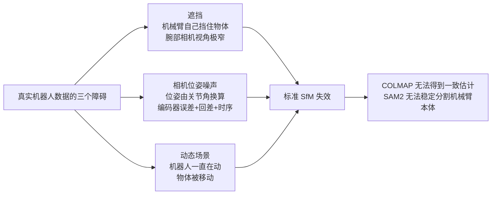
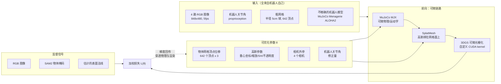
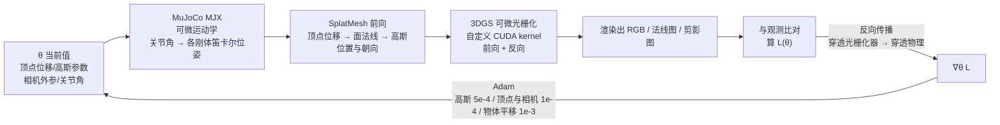
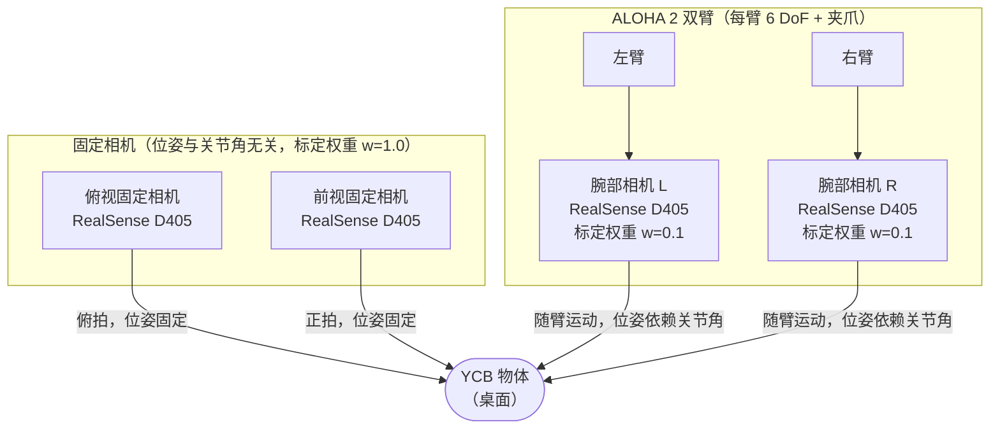
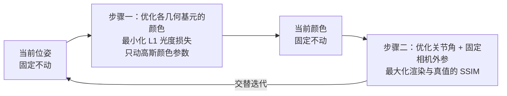
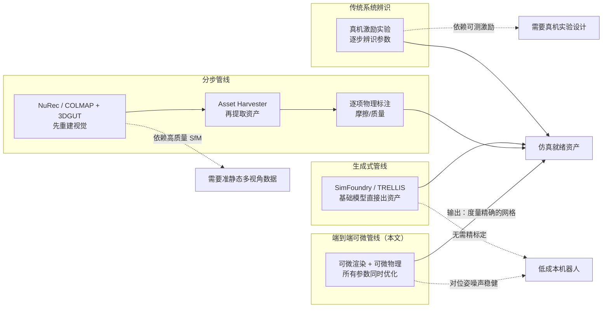

# Splatting Physical Scenes：端到端可微 Real2Sim 深度精读

> **论文标题**: Splatting Physical Scenes: End-to-End Real-to-Sim from Imperfect Robot Data
> **作者**: Ben Moran\*, Mauro Comi\*, Arunkumar Byravan, Steven Bohez, Tom Erez, Zhibin Li, Leonard Hasenclever（\* 为共同一作）
> **机构**: Google DeepMind, University College London, University of Bristol
> **发表**: arXiv:2506.04120 [cs.RO], v1 2025-06-04 / v2 2025-06-09（v2 仅修正作者列表遗漏）
> **联系作者**: benmoran@google.com

**知识链接**：
- [3D Gaussian Splatting：用一堆椭球把真实场景搬进电脑](/前置知识/007a_前置知识_3D_Gaussian_Splatting三维场景重建) — 本文的外观表示基础，也是可微渲染的载体
- [3DGS 为什么使用协方差矩阵](/前置知识/009c_前置知识_3DGS为什么使用协方差矩阵) — 理解"把协方差沿法线捏扁"这个操作的必要前提
- [3D 高斯溅射从零精通（系列）](/系列/3dgs_from_scratch/) — 高斯渲染、可微光栅化的完整推导；其中[第 14 章 局限与前沿变体](/系列/3dgs_from_scratch/14_局限与前沿变体)讲的 2DGS 与本文的 surfel 约束是同一条思路
- [可微仿真：梯度怎么从仿真结果传回控制输入](/系列/newton_engine_deep_dive/08_可微仿真_梯度怎么传回控制输入) — 本文用 MuJoCo MJX 实现可微物理，这篇讲清楚"可微物理"到底是什么
- [Newton 引擎深度解析（系列）](/系列/newton_engine_deep_dive/) — 对比另一个物理引擎对可微仿真的处理方式
- [系统辨识深度解析（系列）](/系列/system_identification_deep_dive/) — 传统的"分步辨识"路线，本文的端到端优化是对它的替代方案
- [NVIDIA Real2Sim2Real 工作流深度解析（系列）](/系列/nvidia_real2sim2real_deep_dive/) — 工业级分步 real2sim 管线（NuRec），与本文形成"分步 vs 端到端"的对照
- [SimFoundry：单视频重建可交互仿真场景](./132_SimFoundry_单视频重建可交互仿真场景) — 另一条自动重建可交互场景的路线，依赖生成式模型而非可微优化
- [重心坐标：三角形面内任意位置的参数化](/前置知识/011e_前置知识_重心坐标_三角形面内位置参数化) — §2.2 中高斯位置参数化的数学基础；理解"为什么用重心坐标而不是自由三维坐标"必读
- [Chamfer 距离：衡量两个点云的形状有多接近](/前置知识/011b_前置知识_Chamfer距离_点云形状相似性度量) — §3.2 几何精度实验用的评估指标，含双向设计的必要性和 mm² vs mm 的版本区别
- [图像质量指标：PSNR、SSIM、LPIPS 的原理与互补性](/前置知识/011c_前置知识_图像质量指标_PSNR_SSIM_LPIPS) — §3.3 渲染质量实验的三个评估指标，解释为什么三个要同时看
- [欧氏距离变换（EDT）：让二值掩码变成全局可微的距离场](/前置知识/011d_前置知识_欧氏距离变换EDT与掩码梯度传播) — §2.3.2 软掩码损失 $\mathcal{L}_{\text{smask}}$ 中 EDT 的作用：把硬掩码的稀疏梯度变成全图可微

---

## 贯穿全文的例子

> **场景**：你有一台低成本的 ALOHA 2 双臂遥操作机器人，摆在桌上。桌上放着一根香蕉和一个蓝色金枪鱼罐头（都是 YCB 物体集里的标准测试物体）。你**没有**做任何相机标定——四个 RealSense 相机（两个固定在桌面正上方和前方，两个装在左右两个手腕上）的位姿是从机器人关节角"换算"出来的，而关节角本身有编码器误差、齿轮回差和时序问题，换算出来的相机位姿偏了几毫米到几厘米不等。你手里只有一个**"大致正确但不精确"的 MuJoCo 机器人模型**（几何和运动学基本对，但没有做过系统辨识）。
>
> 你遥控机器人绕着香蕉动了两分钟，把四个相机拍到的画面和记录下来的关节角存下来。现在你想让电脑**自动**做三件事：
>
> 1. 把香蕉和罐头的**三维网格**建出来，而且要**带真实物理尺度**——不是"看起来像个香蕉"，而是"在机器人工作空间里处于正确的 6D 位姿、尺寸以毫米计准确"；
> 2. 把四个相机的位姿和机器人的关节角**修正**到准确；
> 3. 得到的网格直接能拖进 MuJoCo 当刚体用，不用任何手工后处理。
>
> 本文要做的事就是：**只用这四个相机的 RGB 图像和机器人自己记录的关节角，同时完成上面三件事**。

---

## 一、这篇论文解决什么问题

### 1.1 三层信息，只有第一层被解决了

[Real2Sim](/系列/nvidia_real2sim2real_deep_dive/)（真实世界到仿真世界）要往仿真里填三层信息，这三层的成熟度是递增的：

| 层次 | 内容 | 主流手段 | 现状 |
|---|---|---|---|
| L1 几何与外观 | 场景看起来像不像 | NeRF / [3DGS](/前置知识/007a_前置知识_3D_Gaussian_Splatting三维场景重建) | 已经相当成熟，能出照片级画面 |
| L2 运动学结构 | 相机在哪、机器人关节角是多少 | [系统辨识](/系列/system_identification_deep_dive/)、手眼标定 | 工程上可做，但流程繁琐 |
| L3 动力学与可仿真资产 | 能拖进物理引擎的几何体 + 物理参数 | 参数辨识、可微仿真 | 最薄弱 |

L1 和 L3 之间有一个**断裂**，这是本文的出发点：一张"看起来完美"的高斯溅射场景，**在 MuJoCo 里完全无法使用**。原因很直接：

- 高斯溅射的几何表示是几十万个**椭球**，每个椭球有自己的位置、3D 协方差、球谐系数和不透明度。物理引擎需要的是**三角网格**——它要做凸包、要算碰撞对、要积分接触力，这些都建立在"面"的概念上，而不是"体积椭球"上。
- 常见的补救办法是"先训高斯，再想办法从高斯里提取网格"（泊松重建、SuGaR、2DGS 那条路）。但这会引入一个**两阶段误差**：第一阶段高斯的几何本身就可能不准（尤其高斯训练时对几何并不敏感，只关心渲染出来的像素对不对），第二阶段从不准的高斯里做等值面提取，误差继续放大。

更麻烦的是，**高斯的几何不准本身是可以被"骗过去"的**。3DGS 的原论文里，高斯会被自适应密度控制反复克隆和拆分，它们可以任意膨胀、变得极其扁平或接近全透明，只要最终渲染出来的颜色对得上，loss 就下降了。这意味着一个训练得"视觉很好"的高斯场，它的椭球可能根本不贴着真实表面——它们只是"刚好把正确的颜色投到了正确的像素上"。本文的消融实验（去掉 surfel 约束后 CD 从 0.073 恶化到 0.122）就是这个现象的量化证据。

### 1.2 真实机器人数据比"数据集"脏得多

第二个障碍是数据质量。学术界的 real2sim 工作通常在"准静态、多视角、相机位姿已知"的数据上做——本质上还是在处理数据集。而真实机器人场景同时存在三个问题：

> 这张图是整个方法论的必要前提：**如果标准流水线能用，就不需要本文这套复杂框架**。三个障碍共同导致 COLMAP 和 SAM 这类现成组件失效，作者实测过——在遮挡后的物体图像上和完整图像轨迹上都跑了 COLMAP，都无法在四个相机间得到一致的位姿估计（论文 3.2 节明确说明）。

这里有一个值得单独注意的判断：**本文作者主动放弃了"分割出机器人本体"这条路**。附录 C.2.2 详细解释了这个决定——ALOHA 2 的机械臂大量部件颜色单一均匀，和背景、和其他物体难以靠外观区分；它是**铰接物体**，形状随姿态剧变；夹爪又小又复杂，开合时外观变化剧烈。所以他们改用「一个已知但可能不准的机器人模型 + 通过整个场景的视觉反馈去修正它的位姿」，而不是「把机器人从图像里分割出来再重建」。这个取舍很关键：**它把"机器人本体的重建"这个难题，转化成了"机器人模型参数的标定"这个简单得多的问题**。

### 1.3 核心主张：三件事必须联合求解，不能分步做

传统流水线的顺序是：**先标定相机 → 再重建几何 → 最后估物理参数**。每一级的输出误差会喂给下一级，误差单调累积。而且更糟的是，这里有一个**循环依赖**：

- 要重建物体几何，你需要知道相机位姿（否则三角化出来的形状是错的）；
- 要标定相机位姿，你需要场景里有可用的几何参照物（否则你不知道像素该对应三维空间里的哪个点）。

分步做就等于在这个循环里硬切断一刀。本文的主张是：**把它们放进同一个可微框架里，让像素误差的梯度同时流向几何、外观、相机位姿和机器人关节角**。这就是"端到端"（end-to-end）在这个语境下的具体含义——不是指网络的端到端，而是指**优化变量之间的耦合不被切断**。

---

## 二、宏观方法：SplatMesh 与端到端优化

### 2.1 系统全景

先看整条链路，再逐层展开。注意这张图里**只有一条前向路径和一条反向路径**，没有"阶段一输出喂给阶段二"的中间产物：

> 看这张图时注意两件事：第一，**输入里没有任何"相机位姿"**——相机位姿是待优化量，初始值由关节角换算而来，噪声很大；第二，损失函数的梯度虚线同时指向四组参数，这是本文与所有分步方案的本质区别。

### 2.2 SplatMesh：不是"从高斯转网格"，而是"网格和高斯一开始就共存"

这是本文最核心的设计，也是最容易被误解的地方。**SplatMesh 不是一种"把高斯转成网格"的方法，它是一种让三角网格和高斯在同一套表示里共同存在的数据结构。** 网格从来没被"提取"过，它从第一步就存在，并且从头到尾都在被优化。

这个区分很重要，因为它直接决定了误差结构：

| 路线 | 几何从哪来 | 误差结构 |
|---|---|---|
| 两阶段（泊松/SuGaR/2DGS 提取） | 先训高斯，再从高斯场提取等值面 | 高斯几何误差 + 提取误差，**误差累积** |
| 本文（SplatMesh） | 三角网格，与高斯**同时**被同一个像素损失驱动 | 只有一层几何误差，**无提取环节** |

SplatMesh 的具体构成：

**几何部分**：一个三角网格，有顶点集合和面集合。本文实验里每个物体**初始化为一个离散化球体网格——642 个顶点，半径 5 厘米**。优化过程是**在保持原有连接关系的前提下形变顶点**，也就是**只改顶点的位置，不改顶点之间的连接关系**（论文附录 B.2 明确："网格连接关系在整个优化过程中保持固定"）。论文 4.2.1 节列出这个选择带来两个直接好处，它们都指向"仿真可用性"：

1. **显式几何允许直接写入网格正则项** → 可以把"光滑"（拉普拉斯）和"均匀"（平均边长）这类纯几何性质的先验写成损失的一部分。这类正则在隐式表示（比如 NeRF 的密度场）里无处安放，因为那里根本没有"顶点"和"边"这些对象。
2. **顶点数和面数固定且可控** → 仿真算力可预测地受控，不会像 3DGS 的自适应密度控制那样让基元数量在训练中自由变化。

这两个好处是**为下游物理仿真服务的**，不是为渲染服务的——这一点是理解 SplatMesh 的钥匙：它优化的不只是"看起来对"，而是"能进求解器"。

固定拓扑的另一面是一个**限制**，论文把它放在第 7 节而不是这里讨论：因为连接关系不变，学到的网格在拓扑上被锁死为与初始化同胚（见 8.1 节）。两个好处和一个限制来自同一个设计决策，读者需要把这两处对照着读。

论文还额外加了一个**全局 3D 平移向量**。这个量逻辑上冗余（网格顶点自己就能平移），为什么还要加？论文给的理由很实在：**在优化早期，让优化器把整个网格"搬"到物体掩码附近，比让它通过 642 个顶点各自位移来等效实现同一个平移容易得多**。这是 Adam 这类逐参数自适应优化器的特性导致的——全局平移是一个"低维、方向明确"的自由度，单独给它一个参数通道，比把它摊薄到 642 个高维噪声参数里收敛快得多。

**外观部分**：一堆 3D 高斯，每个高斯由四类量参数化：

| 参数 | 数学形式 | 含义 |
|---|---|---|
| 位置 $\boldsymbol{\mu}$ | 重心坐标的对数（logits） | **它贴在哪个三角面上、贴在面的什么位置**——注意不是自由的三维坐标 |
| 缩放 | 三个方向的对数尺度，按面的局部坐标系对齐 | 椭球的三个半轴长度；其中沿法线方向的半轴被强行钉死（见 2.4） |
| 颜色 | 球谐（Spherical Harmonics, SH）系数，阶数 0–3 | **视角相关**的颜色，这是 3DGS 能表现高光的来源 |
| 不透明度 | $\alpha \in [0,1]$ | 该高斯的透明度；真实物体重建里被**钉死为 $\alpha=1.0$**（见下） |

论文附录 B.2.2 披露了一个值得注意的细节：**在真实形状恢复任务里，不透明度没有被当作可优化量，而是钳到全不透明 $\alpha=1.0$**。论文给的理由是"这样能把几何与 RGB 外观更强地耦合起来"。这个决定有清晰的作用链条：如果允许高斯变透明，优化器就可以让一片位置错误的薄饼"几乎不可见"，从而在不修正几何的情况下消除它对渲染的影响——几何与外观之间的张力被松弛掉了。把 $\alpha$ 钉成 1，等于**取消了这条逃避路径**：每个高斯都必须贡献颜色，那么它必须待在正确的位置上才能让渲染正确。这是本文反复出现的同一种手法的又一例——**用一个参数化上的硬限制，替代一个需要调权重的软正则**。

**耦合关系**：高斯被约束在网格表面上。初始化时，在网格的每个三角面上按重心坐标采样高斯中心：

$$
\boldsymbol{\mu} = w_1 \cdot \mathbf{v}_1 + w_2 \cdot \mathbf{v}_2 + w_3 \cdot \mathbf{v}_3
$$

**这个公式在做什么**：它决定每个高斯"钉"在三角面的哪个位置——用三个顶点的加权平均来定位，权重之和为 1，这样无论三个顶点怎么移动，高斯都自动保持在三角面**内部**，不会跑出去。

::: details 📐 公式详解（点击展开）

| 子表达式 | 它是谁 | 它在干嘛 |
|---------|--------|---------|
| $\mathbf{v}_1, \mathbf{v}_2, \mathbf{v}_3$ | **三个支点** | 当前三角面的三个顶点位置，它们是可优化的 |
| $w_1, w_2, w_3$ | **配方比例** | 三个权重，隐式满足 $w_1+w_2+w_3=1$，决定高斯偏向哪个顶点 |
| $\boldsymbol{\mu}$ | **高斯的落脚点** | 最终算出的高斯中心三维坐标 |

**用人话读**："把每个高斯看成贴在三角形薄片上的一颗珠子，用三个顶点按比例调配出它的位置；顶点一动，珠子跟着动。"

**为什么用重心坐标而不是自由三维坐标**：如果让高斯的中心是自由的三个实数，它会在优化中漂离网格表面（因为渲染损失并不直接惩罚"漂离表面"），网格和高斯就解耦了，SplatMesh 也就不成立。用重心坐标把位置参数化在面内，**"贴在表面上"这个约束就从"靠损失项软惩罚"变成了"坐标参数化本身保证"**——这是一个用参数化代替惩罚项的设计。论文实测每个面采样 6–20 个高斯（真实物体实验用平均 12 个）效果最好，并且按面面积比例分配数量、用随机取整（stochastic rounding）处理零头，避免大面和小面用同样多高斯造成密度不均。

:::

**关键收益**：由于位置参数化在面内、"贴面朝向"由面的法线决定，所以**网格一动，它上面的高斯的位置和朝向就自动跟着动**。这就是为什么梯度可以穿过渲染损失一路流回顶点位置——不需要任何额外的"投影到表面"步骤。

### 2.3 优化目标：三族损失

论文没有给出一个固定的损失函数，而是按任务组合。真实物体重建任务用的是下面这一组（附录 B.2.1）：

$$
L(\theta) = \lambda_{\text{photo}} \mathcal{L}_{\text{photo}} + \lambda_{\text{mask}} \mathcal{L}_{\text{mask}} + \lambda_{\text{smask}} \mathcal{L}_{\text{smask}} + \lambda_{\text{normal}} \mathcal{L}_{\text{normal}} + \lambda_{\text{laplacian}} \mathcal{L}_{\text{laplacian}}
$$

**这个公式在做什么**：把五路互不相同的监督信号加权求和成一个标量，让优化器能同时照顾"颜色对不对、轮廓对不对、表面朝向对不对、网格光不光滑"这四个诉求。

::: details 📐 公式详解（点击展开）

| 子表达式 | 它是谁 | 它在干嘛 | 实际权重 |
|---------|--------|---------|---------|
| $\mathcal{L}_{\text{photo}}$ | **像素裁判** | 渲染出的 RGB 和真实图像的逐像素绝对差 | 1 |
| $\mathcal{L}_{\text{mask}}$ | **轮廓裁判（硬）** | 渲染出的剪影和真实物体掩码的平方差 | 10 |
| $\mathcal{L}_{\text{smask}}$ | **轮廓裁判（软化版）** | 同上，但真实掩码先做了距离变换平滑 | $10^{-2}$ |
| $\mathcal{L}_{\text{normal}}$ | **朝向裁判** | 网格面的朝向 vs 从 RGB 估计出来的表面法线 | 3 |
| $\mathcal{L}_{\text{laplacian}}$ | **光滑度裁判** | 惩罚某个顶点偏离它邻居顶点的重心 | 3 |

**用人话读**："同时问五个问题——颜色像不像、轮廓像不像、表面朝向对不对、网格光不光滑、掩码对不对。五个答案加权加起来，就是总损失。"

**为什么权重差这么多（10 vs 0.01）**：$\mathcal{L}_{\text{mask}}$ 的权重是 $\mathcal{L}_{\text{smask}}$ 的 1000 倍，这不是随手设的。**硬掩码损失只在"预测轮廓和真实轮廓不重合的环带"上有非零值**，那个环带很窄，一旦预测轮廓完全落在真实掩码内部，梯度立刻变成零——物体"卡"在掩码里就不再被推出去。软化版把真实掩码做了距离变换，**让整个图像范围都有梯度**，专门负责把物体从掩码内部"撑开"到正确尺寸。两者一个负责"大致对上"，一个负责"精细贴合"，权重差就是分工差。论文 4.3 节专门解释了为什么要做这个软化——这是一个典型的"作者踩过坑才加上的项"。

:::

下面按五项各自的精确形式展开，每一项都能看出一个具体的工程设计。

#### 2.3.1 光度损失

$$
\mathcal{L}_{\text{photo}}(\theta) = \|\hat{x}(\theta) - x \otimes m\|_{1}
$$

**这个公式在做什么**：比"渲染出来的图"和"真实图"的逐像素差异；但只比**物体掩码覆盖的那块区域**，背景像素不参与。

::: details 📐 公式详解（点击展开）

| 子表达式 | 它是谁 | 它在干嘛 |
|---------|--------|---------|
| $\hat{x}(\theta)$ | **当前渲染结果** | 用高斯光栅化器渲染出的 RGB 图像，$H\times W\times C$；附录 B.2.1 给出的真实物体重建配置是 $480\times 848\times 3$（仿真 YCB 数据集另用 $512\times512$） |
| $x$ | **真实照片** | 机器人相机拍到的原始图像 |
| $m$ | **物体掩码** | 二值掩码（这里 $m$ 取 0/1）；$\otimes$ 是逐像素乘 |
| $\|\cdot\|_1$ | **L1 范数** | 取绝对差之和（不是平方），对离群像素更鲁棒 |

**用人话读**："把渲染图和真实图在物体区域内的像素逐个相减取绝对值，加起来就是光度损失。"

**为什么用 L1 而不是 L2**：真实机器人图像里必然有遮挡边缘、运动模糊、高光过曝这类"部分像素完全对不上"的区域。L2 对这些离群像素的惩罚是平方增长，会把大量梯度资源浪费在几个无论如何都拟合不了的像素上；L1 的惩罚是线性增长，更宽容。同时论文用 $x \otimes m$ 做了掩码裁剪，**主动把背景排除在监督之外**——因为背景（桌面、地板）不是要重建的对象，而且背景在不同相机视角下差异巨大，纳入监督只会干扰。

:::

#### 2.3.2 掩码损失（硬版与软版）

$$
\mathcal{L}_{\text{mask}}(\theta) = \|\hat{m}(\theta) - m\|_{2}^{2}
\qquad
\mathcal{L}_{\text{smask}}(\theta) = \|\hat{m}(\theta) - [\mathrm{EDT}(m)]^{2}\|_{2}^{2}
$$

**这个公式在做什么**：两个都要求"渲染出的物体剪影"和"真实物体掩码"吻合，区别在于怎么定义"不吻合"——硬版只看有没有错位，软版还告诉物体"该往哪个方向长"。

::: details 📐 公式详解（点击展开）

| 子表达式 | 它是谁 | 它在干嘛 |
|---------|--------|---------|
| $\hat{m}(\theta)$ | **渲染出的剪影** | 把每个高斯的颜色强行设为 $(1,1,1)$、背景设为 $(0,0,0)$，再跑一遍同一个光栅化器得到的"影子图" |
| $m$ | **真实掩码** | SAM2（Segment Anything Model 2，Meta 开发的视频物体分割基础模型，可以用一个点或框作为提示词，在整段视频中跟踪分割任意物体）流水线产出的二值分割（0/1）|
| $\mathrm{EDT}(m)$ | **距离变换场** | 对真实掩码做二维欧氏距离变换后平方：掩码内部离边界越远值越大，外部离目标越近值越大 |
| $\|\cdot\|_2^2$ | **平方 L2** | 逐像素平方差之和 |

**用人话读**："硬版问'你俩的轮廓重合了吗'，重合以外的地方一律是零梯度；软版给出一张'离目标多远'的地图，让物体知道自己该往哪个方向扩。"

**为什么必须两个都要**：这是本文一个很具体的工程细节，值得展开。二值掩码有一个致命问题——**当预测轮廓和真实掩码完全不重叠时，硬版损失的梯度是零，优化卡死**。想象初始网格是一个半径 5 厘米的球，而香蕉偏在旁边：渲染出的剪影和真实掩码没有交集，$\hat{m}-m$ 在两边都是"白 vs 黑"，导数看起来有值，但实际上像素级的剪影损失在完全不重叠时会给出**指向错误方向的梯度**（因为它只看到"我这里有白、你那里要白"，无法表达"整体应该平移过去"）。平方距离变换（Squared EDT）把二值掩码变成一张**从掩码边界向外递增的距离场**，于是即使完全错开，距离场也提供了明确的"往哪边走"的方向信息。这就是论文 4.3 节说的"确保梯度可以在整个图像中传播，即使在预测和真实剪影初始完全不重叠的区域"。

顺带一提：$\mathcal{L}_{\text{smask}}$ 里的 $[\mathrm{EDT}(m)]^2$ 是**把掩码先平方再做 L2**，而不是"对 L2 结果再平方"——这个写法在附录 B.2.1 的公式 (3) 里是明确的。它把距离场本身当作回归目标，让 $\hat{m}$ 去拟合"距离场"而不是拟合"0/1"。

:::

#### 2.3.3 法线一致性损失

$$
\mathcal{L}_{\text{normal}}(\theta) = \|\hat{n}(\theta) - n\|_{2}^{2}
$$

**这个公式在做什么**：要求"网格的朝向"和"从照片估计出来的表面朝向"一致——这是把网格几何**锚定到真实表面**的关键一项，单靠掩码和颜色是锚不住的。

::: details 📐 公式详解（点击展开）

| 子表达式 | 它是谁 | 它在干嘛 |
|---------|--------|---------|
| $\hat{n}(\theta)$ | **网格给出的法线** | 把每个高斯的 RGB 颜色重定义成它的 X/Y/Z 法线单位向量（缩放到 $(0,1)$、从世界系旋到相机系）后渲染 |
| $n$ | **照片估计出的法线** | 用预训练模型从 RGB 逐帧估计（论文引 [27]：Garcia et al., *Fine-tuning image-conditional diffusion models is easier than you think*, arXiv:2409.11355） |
| $\|\cdot\|_2^2$ | **平方 L2** | 逐像素平方差 |

**用人话读**："让网格面朝的方向，和从照片里看出来的表面朝向一致。"

**为什么需要它——这是整篇文章最值得琢磨的一个设计**：光度损失和掩码损失合起来，只能约束"渲染出的像素对"，而这个约束**不足以确定表面朝向**。原因是渲染是沿视线积分的：一串沿视线排列的椭球，和一片贴在表面上、朝向稍有偏差的椭球，只要最终颜色和水印对得上，光度损失无法区分它们。$\mathcal{L}_{\text{photo}}$ 是一个**投影后的二维量**，它天然丢失了三维朝向信息。

法线损失补的就是这一维：它把"朝向"这个三维量作为独立监督信号引入，让网格学到**朝外**的表面，而不是学到一堆"刚好把正确颜色投到正确像素上"的退化几何。这和 2.4 节讲的"高斯可以作弊"是同一个问题的两面解法——**surfel 约束从参数化上禁止高斯沿法线膨胀，法线损失从监督上要求表面朝向正确**。

注意一个实现细节（论文附录 B.2.1 明确说明）：论文**不是**让网格直接渲染出法线图再去比对，而是**把高斯的颜色通道重定义为法线通道**，用同一个光栅化器渲染。这样做的好处是完全复用 3DGS 的渲染管线（包括 tile 并行和 alpha 混合），不需要为法线单独写一套渲染器；代价是渲染出的法线图经过了 alpha 混合，在边缘处会有"混了背景"的误差。

:::

#### 2.3.4 拉普拉斯平滑

**"拉普拉斯"的直觉**：在连续数学里，一个函数在某点的拉普拉斯值衡量"这个点的值与它周围邻域平均值的差"——平坦的地方差为零，凸起或凹陷的地方差为正。把这个直觉搬到三角网格上：把顶点当图的节点、边当图的连接，**离散图拉普拉斯算子**对顶点 $i$ 给出的"凸起程度"，就是 $i$ 与所有直连邻居平均位置之间的偏差——正是下面这个损失项量化的量。

从信号处理的角度看，网格上的**"高频成分"**对应相邻顶点之间落差大，即表面上的尖刺和锯齿；**"低频成分"**是大范围平缓变化的整体形状。光度损失只关心像素正确，可以容忍细小尖刺——它们在图像里几乎看不出来。但物理仿真不能容忍尖刺：碰撞检测时尖刺造成穿模，摩擦模型也会给尖刺计算出虚假的法向接触力。**拉普拉斯正则是专门针对这些视觉上不可见、仿真上致命的高频成分的过滤器**。

$$
\mathcal{L}_{\text{laplacian}}(\theta) = \sum_{i}\left\| v_i(\theta) - \frac{1}{\lvert\mathcal{N}(i)\rvert}\sum_{j\in\mathcal{N}(i)} v_j(\theta) \right\|^{2}
$$

**这个公式在做什么**：让每个顶点尽量待在它邻居顶点的重心位置——这是从**纯几何拓扑**出发的一条正则，和图像无关，用来压制高频尖刺。

> 两图的"真实物体表面"（灰虚线）相同——差别完全来自正则。左图中优化器用少数顶点的剧烈跳动去拟合图像噪点，产生高频尖刺（红色标注处）；右图加入拉普拉斯约束后，顶点保持在邻居重心附近，几何光滑且可以安全送入碰撞检测。

::: details 📐 公式详解（点击展开）

| 子表达式 | 它是谁 | 它在干嘛 |
|---------|--------|---------|
| $v_i(\theta)$ | **第 i 个顶点** | 它当前的三维位置，受 $\theta$ 里顶点位移参数控制 |
| $\mathcal{N}(i)$ | **它的邻居集合** | 与顶点 $i$ 通过一条边直接相连的所有顶点 |
| $\frac{1}{\lvert\mathcal{N}(i)\rvert}\sum_{j\in\mathcal{N}(i)} v_j$ | **邻居的重心** | 邻居顶点位置的平均值 |
| 整体求和 | **全场不平滑度** | 所有顶点"偏离邻居重心"的量的平方和 |

**用人话读**："如果某个顶点凸出来或者凹进去，它和邻居重心的距离就大，这一项就大；把这项压小，整个网格就变光滑。"

**为什么必须有它——这是消融实验里最大的单项**：论文 5.1.1 节的消融显示，去掉拉普拉斯正则后 Chamfer 距离从 **0.073 mm² 恶化到 0.237 mm²（恶化 3.2 倍）**，论文明确归因于"高频伪影"（high-frequency artifacts）。原因是光度损失只关心像素，而 642 个顶点的自由度远多于像素能约束的维度，优化器会**用少数顶点的剧烈跳动去拟合图像里的噪声**（照片噪点、压缩伪影、SAM2 掩码的边缘毛刺）。这些跳动在渲染图上几乎看不出来，但会让网格出现尖刺——**而网格是要拿去做碰撞检测的，尖刺会直接导致物理仿真里的穿模和抖动**。

拉普拉斯项是一条"与视觉无关的几何先验"，它把"网格应该是一个光滑的物体表面"这个常识写成可微的约束。注意一个重要细节：论文在真实物体实验里把它也用上了（权重 3，和法线损失同量级）。

:::

#### 2.3.5 一个被省略的项：为什么不要"边长均匀"

论文在 5.1.2 节提到另一条候选正则 **average edge length loss**（平均边长损失，$\lambda_E \in [0.01, 0.1]$），用于让网格的三角形大小均匀，避免出现极瘦长的三角形。但在真实物体重建（5.2 节）的最终配置里，这项**没有出现**——真实物体用的是"L1 RGB + 平滑后的 L2 掩码 + L2 法线 + 拉普拉斯"四项。

这个省略值得注意，因为它反映了"仿真/合成数据"和"真实数据"的任务差异：平均边长损失在仿真 YCB 数据集上能提升效果（那里每类物体都有 50 张均匀覆盖的位姿图像，几何约束充足，可以把力气花在网格质量上）；而在真实机器人数据上，视角被严重限制（只有 4 个相机、腕部相机视角极窄），把优化预算分给"网格均匀度"这种与图像无关的美学目标不划算。**同一套框架在两个数据集上用不同的损失组合，这本身就是"预测误差框架"的设计意图——损失项按任务定制**。

### 2.4 surfel 约束：把高斯沿法线捏扁到机器精度

这是 SplatMesh 里第二个关键设计，也是理解本文与 SuGaR / 2DGS 关系的地方。

**Surfel 是什么**："Surfel" 是 **surface element（面元）**的缩写，指贴附在表面上的一小片二维元素——可以理解成一枚薄硬币：有位置、有朝向（法线方向），有半径，但厚度几乎为零。和"体素"（体元，volume element）是体积的最小单元对应，面元是表面的最小单元。本文用高斯来实现面元：把三维高斯的法线方向尺度强制压到接近零，高斯就退化成一片贴在表面上的薄饼。

> 两图均为截面（侧视图）。左图中三维高斯的 $s_3$（法线方向）与 $s_1, s_2$（切向）同样可以优化，高斯可以膨胀成穿透表面的"长条"；右图的 surfel 把 $s_3$ 钉死为 $\varepsilon \approx 0$，高斯退化成紧贴表面的"硬币"，只有切向尺度 $s_1, s_2$ 还可以自由调整。

**问题**：3DGS 的高斯是三维的，它有完整的 $3\times 3$ 协方差矩阵 $\Sigma$，可以在空间任意拉伸。在表面重建任务里这是一个缺陷——高斯可以沿法线方向膨胀成"长条"，用体积遮挡的方式凑出正确的颜色，而不真正贴合表面。

**本文的做法**：把高斯的协方差约束成**与网格面的法线轴对齐**，然后把**沿法线方向的尺度钉死为一个极小常数——float32 的机器精度 $\epsilon \approx 1.2\times 10^{-7}$**。

$$
\Sigma_{\text{surfel}} = R_{\text{face}}\,\mathrm{diag}(s_1^2,\, s_2^2,\, \epsilon^2)\,R_{\text{face}}^{\top}, \qquad \epsilon = 1.2\times 10^{-7}
$$

**这个公式在做什么**：把高斯的椭球压成一片"薄饼"——两个方向可以自由缩放（决定这片高斯在表面上铺多大），第三个方向（法线方向）的厚度被强行设为几乎为零，让每个高斯退化成一片贴着表面的**面元**（surface element, surfel）。

::: details 📐 公式详解（点击展开）

| 子表达式 | 它是谁 | 它在干嘛 |
|---------|--------|---------|
| $R_{\text{face}}$ | **面的朝向** | 由当前三角面的法线和切线张成的旋转矩阵；它把局部坐标系对齐到网格面 |
| $s_1, s_2$ | **面内的两个尺度** | 可优化量——控制这片面元在表面切线方向上铺多宽，以对数形式参数化 |
| $\epsilon$ | **法线方向的厚度** | 固定值，$1.2\times10^{-7}$，相当于 float32 能表示的最小台阶，等于"不许有厚度" |
| $\mathrm{diag}(\cdot)$ | **对角阵** | 把三个尺度拼成一个在局部坐标系下的协方差 |

**用人话读**："把每个高斯压成一片几乎零厚度的薄片，薄片的朝向由它所在的三角面决定，薄片在面内可以自由变大变小。"

**为什么是"钉死"而不是"学出来"——这是与 SuGaR / 2DGS 的真正区别**：SuGaR 用**正则项**鼓励高斯对齐表面（软约束，训练完再提取网格），2DGS 把基本单元**换成**二维圆盘（表示本身改了，训练完用 TSDF 提取网格）。本文的做法介于两者之间但更彻底：**表示仍然是三维高斯（复用原版 CUDA 光栅化器和 alpha 混合公式，不用重写渲染器），但通过把法线方向尺度钉到机器精度，让它"事实上"就是二维面元**。论文 4.3 节自己写得很清楚：我们与 [25, 26] 的不同在于"我们始终维护一个网格，而不是先学无约束的高斯/面元、再在后处理里推断网格"。

**代价**：$\epsilon = 1.2\times10^{-7}$ 这个值把协方差矩阵的条件数推到了 $\sim 10^{14}$ 量级，数值上极其病态。这要求光栅化器在把 3D 协方差投影到 2D 时（[3DGS 的 EWA splatting](/前置知识/009c_前置知识_3DGS为什么使用协方差矩阵) 那一步）使用足够稳定的数值实现，否则会出现 NaN。这是一个典型的"用数值脆弱性换取几何正确性"的工程取舍——**而且消融实验证明这个取舍值得**：去掉 surfel 约束后，Chamfer 从 0.073 恶化到 0.122（几何精度掉了 67%），PSNR 从 30.91 掉到 25.82。

论文对"去掉约束会怎样"给了清晰的机理解释（5.1.2 节末）：**不受约束的高斯可以任意膨胀，通过采纳背景的颜色或变得近乎全透明，人为地凑出想要的渲染颜色**。这种行为在训练视角上可能是有效拟合，但对未见视角泛化极差——**因为它是靠"作弊"拟合了训练视角，而不是学到了真实的表面**。这正好解释了为什么 PSNR 掉得这么厉害（25.82）：训练视角上可能还行，泛化视角上立刻崩。

:::

### 2.5 前向与反向：梯度是怎么穿过物理和渲染的

框架的运转方式可以概括成一个循环。注意这里**没有"阶段一/阶段二"**，只有一个被反复执行的循环：

> 这张图要点：**反向传播的路径长度是整个框架的技术含金量所在**。梯度必须从"像素误差"出发，穿过高斯光栅化器（回到高斯参数和面法线）、穿过 SplatMesh 的耦合关系（回到顶点位移）、再穿过 MuJoCo MJX 的运动学（回到关节角和相机外参）。任何一环不可微，整条链就断了——这正是本文必须同时依赖"可微渲染"和"可微物理"的原因。
>
> 三个学习率值得留意：**物体平移的两个数量级之差（1e-3 vs 1e-4）不是随手设的**。"物体该在哪"是一个低维、方向明确的自由度，可以承受大步长；"表面该怎么起伏"是一个 642 维的高频自由度，步长大了会在图像噪声上震荡。**同一套参数里按自由度性质分组、给不同步长，是这类高维几何优化能收敛的关键工程细节**。

**可微物理这一环**用的是 **MuJoCo MJX**——MuJoCo 物理引擎的 JAX 原生版本（论文引 [5]，即 MuJoCo 的 JAX 版引擎）。论文用的是 MuJoCo 3.3.2 + JAX 0.6.0。物理状态用 `mjx.Data` 结构表示，包含广义坐标、速度、刚体和相机的笛卡尔位姿、接触力等。这里有一个诚实且重要的说明：**本文实际只用了其中的运动学部分**（把关节角映射到笛卡尔位姿），接触力等其他物理状态目前没有参与优化。论文 4.3 节和附录 B.2 都明确写了这一点——当前工作聚焦物体重建和运动学。这解释了为什么它叫"可微物理"却还没有做真正的接触参数辨识（见第六节局限）。

**可微渲染这一环**直接复用 3DGS 原版的可微光栅化器和自定义 CUDA kernel，作者写了一个到 JAX 的接口。梯度可以从像素级损失流回高斯的位置、协方差、SH 系数、不透明度，以及**最关键的——底层网格顶点位置**。

### 2.6 一个容易忽略的实现细节：多模态渲染复用同一个光栅化器

本文需要同时监督三种图像：RGB、表面法线、物体掩码。**三个都不是单独的渲染器**，而是同一个高斯光栅化器换了"颜色语义"跑三遍（附录 B.2.1）：

| 渲染模态 | 把高斯的"颜色"定义成什么 | 监督信号来源 | 图像尺寸 |
|---|---|---|---|
| RGB $\hat{x}(\theta)$ | 正常的 SH 颜色 | 真实照片 $x$ | $480\times 848\times 3$（真实数据） |
| 法线 $\hat{n}(\theta)$ | X/Y/Z 法线单位向量缩放到 $(0,1)$，并从世界系旋到相机系 | 单目法线估计模型 $n$ | 同上 |
| 掩码 $\hat{m}(\theta)$ | 所有高斯 $(1,1,1)$，背景 $(0,0,0)$ | SAM2 掩码 $m$ | 同上 |

这个设计的工程价值很实在：**要写三套渲染器（还要写三套反向传播）是巨大的工作量，复用一套则只需改一个颜色回调**。而法线图"从世界系旋到相机系"这一步保证了法线监督与视角无关——如果留在世界系，同一个表面在不同相机下会给出不同的"颜色"，监督就自相矛盾了。

---

## 三、实验一：仿真数据集上验证几何与渲染

### 3.1 数据集与协议

**仿真数据集**（附录 C.1）：用 **YCB 物体集**（Yale-Columbia-Berkeley Benchmarks，一套含 77 类常见家庭和工业物体的标准化数据集，每个物体附带精确三维扫描模型和真值尺寸，是机器人操作与抓取研究里最常用的基准物体库）中的 **64 个物体，每个物体生成 50 张带位姿的图像**，按 80%/20% 划分训练/测试。相机位姿在物体上方的半球面上均匀采样，距离固定为**物体空间尺度的 2.5 倍**（自动计算）。图像用 MuJoCo 原生 EGL 渲染器在 $512\times 512$ 分辨率下渲染，同时生成真值分割掩码。

这个数据集是"干净"的：位姿精确已知、光照固定、无遮挡、视角覆盖完整。它的作用是**隔离验证方法本身**——如果在这上面都做不好，就不用谈真实数据了。

### 3.2 几何重建：拉普拉斯正则与 surfel 约束各值多少

几何质量用 **Chamfer 距离（CD，倒角距离）** 评估。CD 的算法：从重建网格随机采样一批点，对每个点找到真值网格上的最近点，取平均距离；再反过来从真值网格采样、找重建网格上的最近点，再取平均；两个方向的均值之和就是 CD——值越小两个形状越接近。本文单位是 mm²（先算距离再取平方，和取平方再开根的 $\sqrt{\mathrm{CD}}$ 是同一批数据的不同表示，第四节换为后者是因为毫米更直观）。本文在真值网格和重建网格上各均匀采样 10000 个点计算（附录 D 提到用 trimesh 库）。

| 配置 | Chamfer 距离 (mm²) ↓ | 相对完整版 |
|---|---|---|
| **完整框架** | **0.073** | — |
| 去掉拉普拉斯网格正则 | 0.237 | **恶化 3.2 倍** |
| 去掉面元（surfel）约束 | 0.122 | **恶化 1.7 倍** |

这张表是全文最有信息量的消融之一，它量化了两个设计各自的价值：

- **拉普拉斯正则的影响最大**（3.2 倍）。这符合直觉——642 个顶点的几何自由度太高，没有拓扑正则就会被图像噪声带跑，产生高频尖刺。论文的措辞是"高频伪影"。
- **surfel 约束是第二重要的**（1.7 倍）。它的作用机理在 5.1.2 节解释得很透彻：无约束的高斯可以靠"膨胀 + 采背景色 + 近乎透明"来凑颜色，这在训练视角上可行，但几何上完全错误。所以这一个约束同时影响几何精度和视图泛化。

论文还做了一个值得注意的**对照实验失败**：他们尝试用 NeRFacto（nerfstudio 里的 NeRF 实现，论文引 [31]）加上泊松表面重建来对比几何。结果是**无法比较**——泊松重建出来的网格充满漂浮物（floaters）并且把背景也重建成了几何。论文把这个现象归因于 NeRF 的密度场不受约束（"unconstrained volumetric density"）。这正好从反面印证了本文的核心论点：**从隐式辐射场里提取几何是不可靠的**，因为辐射场本身对"表面在哪里"没有约束——它只保证"沿视线的积分结果对"，中间密度怎么分布是自由的，等值面提取于是只能把训练中留下的密度残渣一起提取出来。注意这里的失效机理和 2.4 节讲的高斯"膨胀作弊"**不是同一件事**：NeRF 是密度场处处弥散，提取等值面时无处下手；高斯是基元可以靠形状和透明度逐条凑合。但两者根源于同一个缺失——**表示里没有任何东西强制几何与真实表面绑定**。本文用 SplatMesh 补的正是这个缺失。

### 3.3 新视角合成：为什么"限制了高斯形状"反而渲染更好

渲染质量用三个互补的指标评估：**PSNR（峰值信噪比）**衡量逐像素误差，单位 dB，每高 3 dB 代表均方误差减半，大致以 30 dB 为"良好"的直觉门槛；**SSIM（结构相似性指数）**从亮度、对比度、结构三个维度衡量图像相似性，值域 [0, 1]，1 表示完全相同，它对人眼感知的局部结构比 PSNR 更敏感；**LPIPS（感知相似性指数）**用预训练深度神经网络（VGG 或 AlexNet）的特征空间距离衡量感知相似性，值越小越好，它对模糊、色块等感知失真比 SSIM 更敏感。三个指标看不同层面：PSNR 抓像素级精度，SSIM 抓局部结构，LPIPS 抓感知质量，一个方法要综合表现好需要在三个上都不差。

| 方法 | PSNR ↑ | SSIM ↑ | LPIPS ↓ |
|---|---|---|---|
| NeRFacto | 30.29 | 0.961 | 0.057 |
| 3DGS（原版） | 26.97 | **0.972** | 0.083 |
| **本文（完整）** | **30.91** | 0.970 | **0.044** |
| 本文（去掉网格正则） | 30.70 | 0.970 | 0.045 |
| 本文（去掉 surfel 约束） | 25.82 | 0.954 | 0.071 |

全部方法训练 15000 次迭代。几个值得解读的点：

**第一，一个反直觉的结果：加了约束反而比无约束的 3DGS 渲染得更好。** 原版 3DGS 的 PSNR 只有 26.97，本文 30.91，高了近 4 dB。原因是原版 3DGS 依赖一整套**启发式的密度自适应控制**（克隆、拆分、剪枝），需要仔细调参并且往往要跑很多迭代才能收敛到好的结果；而本文因为把高斯钉在了显式表面上，"几何从哪来"这个问题被参数化结构解决了，**不需要靠启发式搜索去猜几何**，在固定的 15000 次迭代预算内就能达到高质量。论文的表述是"受益于一个更简洁的优化过程"。

这里有一个更深层的道理：**约束不是"减少能力"，而是"减少搜索空间"**。把高斯限制在表面上，看起来是限制了它的表达能力，但实际上把优化问题从"在几十万维空间里找最优椭球分布"变成了"在一个物理上合理的子空间里找最优表面"——后者更容易优化，所以收敛更快更好。

**第二，SSIM 上 3DGS 反而最高（0.972 vs 0.970）。** 差距极小，但方向上值得注意：原版 3DGS 在结构相似性上略好，可能是它的自由椭球在局部纹理结构上拟合得更细。但综合 PSNR（像素级）和 LPIPS（感知级）都是本文领先，而且 SSIM 的 0.002 差距在噪声范围内。

**第三，surfel 约束的影响是断崖式的**：去掉后 PSNR 从 30.91 掉到 25.82（跌 5.09 dB），比去掉网格正则（掉 0.21 dB）严重得多。这验证了 2.4 节的机理分析——不受约束的高斯会靠膨胀和透明作弊，严重损害未见视角的泛化。

**第四，正则项的权重是逐物体调的**：论文说明无正则时用统一的 $\lambda_{L1}=0.1$；加入正则后使用**物体特定权重** $\lambda_{LL}\in[0.1, 1.0]$、$\lambda_{E}\in[0.01, 0.1]$。换句话说，"不同物体需要不同程度的几何引导"——形状简单规则的物体（球、罐头）不需要太强的平滑先验，形状复杂有细长结构的物体（香蕉柄、草莓蒂）则需要。这是一个诚实的工程披露：**这套框架不是"设一个权重就通用"的**。

---

## 四、实验二：真实 ALOHA 2 数据上的物体重建

### 4.1 真实数据集

| 项 | 配置 |
|---|---|
| 平台 | ALOHA 2 低成本双臂遥操作机器人，每臂 6 自由度 + 夹爪 1 自由度（共 14 DoF） |
| 传感器 | 4 台 RealSense D405：2 台固定（桌面正上方 + 前方），2 台装在左右手腕 |
| 分辨率与帧率 | $848\times 480$ 像素，降采样到 5 fps |
| 特殊设置 | **关闭了自动白平衡和自动增益**（保证多相机之间一致） |
| 数据量 | 6 条观测轨迹，每条约 40 秒，器械绕 YCB 物体运动，滤波前共 1168 帧 |
| 测试数据 | 每条轨迹从移动的腕部相机中留出 8 帧做新视角合成评估 |
| **未使用深度** | 论文明确说明"本工作中我们不用深度图，只用 RGB 数据" |

两个细节值得注意：**关闭自动白平衡**——这是一个很实用的工程细节，因为多相机的自动白平衡会让"同一块表面"在不同相机里颜色不同，直接破坏光度损失的一致性假设。**不用深度**——这一点让本文的难度显著高于很多 real2sim 工作：深度相机会直接给出几何尺度信息，而纯粹靠 RGB 恢复**度量尺度**要困难得多（这也是后面 TRELLIS 对比的关键点）。

> 腕部相机（蓝色路径）的位姿由关节角推算，而关节角正是被优化的量——用待优化量去标定它自己容易形成循环，所以标定时权重只有固定相机的十分之一。固定相机位姿与关节角无关，是可靠的标定参照。

### 4.2 对比对象一：只用本体感受（Proprio-only）

这是一个消融，把相机外参**冻结在名义值**（就是由关节角直接换算出来的值，不做任何优化），其他都一样。

| 物体 | 几何 $\sqrt{\mathrm{CD}}$ (mm) ↓ | PSNR (dB) ↑ |
|---|---|---|
| | Proprio-only / 对齐后 TRELLIS / **本文** | Proprio-only / **本文** |
| Banana | 11.67 / 10.43 / **7.35** | 16.96 / **24.49** |
| Blue tuna can | 13.92 / 16.17 / **3.31** | 20.17 / **25.45** |
| Lemon | 17.55 / 17.89 / **5.03** | 14.18 / **21.62** |
| Peach | 17.37 / 2.70 / **4.42** | 14.00 / **21.81** |
| Red Apple | 17.16 / 21.40 / **5.09** | 18.22 / **24.94** |
| Strawberry | 18.92 / 1.93 / **3.07** | 16.77 / **22.73** |

**Proprio-only 的结果是本文最重要的一个负面证据**：几何"无法有效收敛"（论文原文：fails to converge effectively），$\sqrt{\mathrm{CD}}$ 全部在 11–19 mm 量级，PSNR 全部在 14–20 dB。论文的结论是：**这个低成本机器人平台在位姿上的精度，不足以支撑重建任务**。

这个数字的意义要用尺度去感受：一个蓝罐头的直径大约 6–7 厘米。11.67 mm 的 Chamfer 距离意味着重建出的形状在尺度上错了将近五分之一——这不是"精度不够好"，而是"根本不可用"。而本文在同一份数据、同一个模型上，把它压到了 3.31 mm。

**这张表就是"联合优化"这四个字的全部价值**。它证明了：在真实低成本机器人上，相机位姿的不确定性是重建的主要误差源，而不是几何模型或损失函数的问题。

### 4.3 对比对象二：TRELLIS（生成式 3D 基础模型）

第二个对比对象是 **TRELLIS**——一个从单张或少量图像直接生成三维形状与外观的预训练 3D 基础模型。论文给 TRELLIS 提供了"手工挑选的最佳掩码图像"（每个数据集里最清晰、遮挡最少的那个视角），并且尝试了多视角功能但没有改善。

这里有一个**方法论上的关键点必须说清楚**：TRELLIS **不预测度量尺度，也不预测物体的位姿**——它只给你一个"形状"，不告诉你这个形状有多大、该放在哪里。为了让它能和本文比较，论文用**特权信息（privileged information）**——即真值资产网格的 Chamfer 距离——去优化 TRELLIS 网格的 SE(3) 位姿和缩放。表中的 "Aligned TRELLIS" 就是这个结果。

也就是说，**本文的对比对象拿到了本文没有的东西（真值尺度信息）**，这让对比对本文是不利的，但也让结论更有说服力。

结果很有意思，分成三类：

| 类型 | 物体 | 表现 |
|---|---|---|
| **TRELLIS 表现不错，本文更好** | Peach (2.70), Strawberry (1.93) | 但在 PSNR 上本文仍大幅领先（21.81 vs 14.00，22.73 vs 16.77） |
| **本文压倒性领先** | Blue tuna can (3.31 vs 16.17), Red Apple (5.09 vs 21.40), Lemon (5.03 vs 17.89) | TRELLIS 在罐头这种简单几何上"没能捕捉基础的三维结构" |
| **两者接近** | Banana (7.35 vs 10.43) | 香蕉的细长形状对两者都难 |

**TRELLIS 的失效模式**（附录 D.4 有专门说明，而且作者很诚实地列了出来）：

1. **各向异性尺度畸变**：重建出的网格在某个轴向上被不成比例地缩放，和真实物体形状不符；
2. **生成多余的几何**：例如柠檬的例子中额外生成了一块**地面平面**——这是生成式模型从训练数据里学到的先验（"物体通常放在某个平面上"），在这个任务里变成了纯粹的污染；
3. **简单形状失败**：金枪鱼罐头这种"简单几何"，模型反而没能从给定视角正确捕捉三维结构。

论文的总结是："这些失败凸显了在低成本机器人采集的有限、可能有噪声的视角下，直接获得准确、度量尺度的几何有多困难。"

**这个对比的深层含义值得单独强调**：生成式 3D 基础模型（TRELLIS、以及很多类似的单图生 3D 方法）的**输出是一个物体形状的"先验样本"，而不是一个"数字孪生"**。它擅长在你没看到的角度上"猜"一个合理的形状（因为它在训练集里见过很多类似物体），但它不保证你手上这个具体物体的尺寸、位姿和具体细节。而 real2sim 需要的恰恰是后者。这也是为什么本文即使面对"表现不错"的 Peach/Strawberry，在 PSNR 上依然遥遥领先——**TRELLIS 产出的形状对不上这台机器人这个视角看到的东西**。

### 4.4 一个必须注意的评估细节

论文附录 D.4 的最后一段披露了一个容易被忽略的评估细节，作者主动说明，值得记录：

> 由于未标定相机位姿存在不可忽略的误差，正文中报告的新视角合成 PSNR**是在额外做了一步相机位姿对齐优化之后计算的**。这一步发生在训练之后，不影响学到的纹理或几何；它的目的是在"我们对真值相机位姿的最佳估计"上评估未见视角的重建质量。

换句话说：**评估时用的相机位姿，是经过后处理对齐的，不是优化过程中学到的那个位姿**。这是一个合理的做法（因为要评估的是"几何和外观重建得对不对"，而不是"位姿估得准不准"——后者由附录 D.1 的标定实验单独评估），但读者在读 PSNR 数字时必须知道这一点。这也说明了一件事：**这篇论文的相机位姿优化结果虽然能显著改善重建（Proprio-only 对比），但并没有精确到可以用作评估基准的程度**。

---

## 五、验证标定能力：仿真到仿真的对照实验

物体重建的改进里面混杂了"相机位姿修正"和"几何优化"两种效应，很难单独归因。所以论文附录 D.1 单独设计了一个**仿真到仿真（sim-to-sim）**的标定实验，把这两件事拆开。

### 5.1 实验设计

这个实验的设计很干净，值得学习：**因为真值已知，所以可以精确测量误差减少了多少**。

1. 用 MuJoCo 的 ALOHA2 模型（[MuJoCo Menagerie](https://github.com/google-deepmind/mujoco_menagerie)）配合标准 OpenGL 渲染器渲染合成观测，**把图像和关节角当作真值**；
2. 给真值关节角加上**零均值高斯噪声**，标准差 $\sigma \in \{0.005, 0.01, 0.02, 0.03\}$ 弧度，制造"位姿不精确的数据集"——这模拟的正是真实系统里编码器误差、齿轮回差等造成的位姿偏差；
3. 用本文框架去恢复真实位姿：优化关节角和固定相机的外参扰动。可微渲染用 SplatMesh，运动学用 MJX；
4. **评估指标**：两个夹爪**工具中心点（Tool Center Point, TCP）**的估计值与真值之间的平均欧氏距离，单位毫米。

### 5.2 交替优化的细节

这个实验里有一个设计细节值得单独讲，因为它和主实验不同：

> 注意这里有两点不寻常：**第一，两个步骤轮流做、每次只动一组参数**（块坐标下降），而不是像主实验那样联合优化所有参数。**第二，第二步的优化目标是最大化 SSIM 而不是最小化光度 L1**。这种"分块 + 换目标"的做法在标定任务里是有道理的——标定关心的是"整体结构对齐"，SSIM 正是衡量结构相似性的指标，比逐像素的 L1 更贴合"位姿对不对"这件事。

还有一个值得注意的权重设置：多视角图像按**加权平均**汇总，两台固定相机的权重 $w_{\text{fixed}}=1.0$，两台腕部相机的权重 $w_{\text{wrist}}=0.1$。**腕部相机权重只有十分之一**——原因很清楚：腕部相机装在机械臂末端，它自己的位姿**依赖于关节角**（也就是待优化量本身）。如果给腕部相机高权重，就会出现"用待优化的量去监督它自己"的循环，容易收敛到退化解。固定相机的位姿与关节角无关，是可靠的标定参照。

### 5.3 结果

| 关节角噪声 $\sigma$ (rad) | 初始平均工具位姿误差 (mm) | 优化后平均工具位姿误差 (mm) | 降低比例 |
|---|---|---|---|
| 0.005 | 5.43 | 2.90 | 46.6% |
| 0.01 | 10.9 | 3.79 | 65.2% |
| 0.02 | 21.7 | 12.6 | 41.9% |
| 0.03 | 32.6 | 18.5 | 43.2% |

**怎么读这张表**：

**第一，修正确实有效但幅度有限。** 最好情况（$\sigma=0.01$）从 10.9 mm 降到 3.79 mm（降 65%），最差情况（$\sigma=0.03$）从 32.6 mm 只降到 18.5 mm（降 43%）。**噪声越大，残余误差越大**——这不是一个能"完全消除"噪声的方法，而是"显著衰减"。

**第二，$\sigma=0.02$ 和 $\sigma=0.03$ 的残余误差（12.6 mm 和 18.5 mm）相当大**。这意味着本文的标定能力有明确的适用边界：它能把"位姿不太准"修到"位姿比较准"，但不能把"位姿很糟"救回来。这也解释了为什么真实物体实验里需要做后处理的位姿对齐（4.4 节）——真实 ALOHA 2 的位姿误差可能就在这个方法的困难区间。

**第三，这个实验的诚实之处在于它是一个 sim-to-sim 实验**。作者没有声称"在真机上标定精度达到了 X mm"，而是说"在可控的噪声注入实验中，我们的方法能把误差降低 40%–65%"。这是一个可以在真值下严格测量的说法，比真机上的间接指标可信得多。同时论文也明确说明：这验证的是"框架的标定能力"，而真机上的**真值工具位姿是未知的**，所以无法在真机上做同样的定量评估。

---

## 六、3D 资产生成：一条独立于重建的支线

本文还用同一套 SplatMesh 表示做了一件和 real2sim 不完全相同、但很实用的事：**从文字或单张图片生成仿真就绪的三维资产**。这条支线值得单独看，因为它揭示了 SplatMesh 作为一个"通用几何+外观表示"的潜力。

### 6.1 为什么仿真器需要这一步

这里有一个很实际的工程约束，论文 5.3 节明确点出：**传统仿真器和渲染引擎无法直接渲染 3DGS 表示**。MuJoCo 用 OpenGL 渲染，它要的是带纹理贴图的三角网格。所以即使你拿到了一个漂亮的高斯资产，**仿真器根本画不出来**。

这暴露了一个通用约束：**高斯表示和物理仿真器之间存在一层表示鸿沟**。以常见的闭源 3DGS 桌面工具为例（如 divshot），其导出格式全部是高斯的点属性格式——PLY 里存的是位置、协方差、不透明度和球谐系数，SPZ、`.splats`、SOG 同理，官方文档把网格导出（GLTF/GLB、OBJ、FBX）列为"未来功能"。也就是说，**任何走高斯路线的 real2sim 工作都必须自己跨过这道鸿沟**。本文给出的答案就是它一直在用的那个：让网格从一开始就存在。

### 6.2 完整流程

> 这条流程的关键在最后两步：**SplatMesh 本身就已经给了网格**，所以"高斯怎么办"这个问题不需要用等值面提取来回答；剩下的唯一问题是怎么把"高斯的颜色"变成"网格的纹理贴图"，这一步用逆渲染解决。

**为什么多视角生成这一步不能省**：单张图片只给出一个视角的信息，从这个视角无法唯一确定三维形状（深度歧义）。CAT3D 这类多视角扩散模型的作用是"补出从其他角度看应该是什么样"，把单视图问题变成一个多视图问题，这样后面的 SplatMesh 优化才有充分的多视角约束。论文用 CAT3D 从一个预定义轨迹（绕物体一圈）生成 **40 张图像**。

**逆渲染烘焙纹理这一步的原理**：SplatMesh 优化完成后，你有了网格几何和一个能渲染照片级画面的高斯场，但仿真器只能画网格。所以需要把"高斯渲染出的颜色"转移到网格的纹理上。做法是把网格展开成二维 UV 坐标（就像把地球仪摊平成一幅地图），然后从多个视角渲染高斯场，把渲染出的颜色"贴"回 UV 空间的对应位置，优化出一张纹理贴图。这就是论文说的"用逆渲染优化一张纹理贴图，以我们的 3DGS 可微渲染器产生的图像为监督"。

输出的资产在附录 D.2 里有额外的展示（Figure 9），每个物体给出三栏：输入的文本/图片、最终带纹理的网格（已导入 MuJoCo）、用 trimesh 渲染的网格法线。

### 6.3 这条支线的定位

需要明确一点：**资产生成不是 real2sim，它不追求"复刻真实世界的某个具体物体"，而是"凭空造出物理仿真就绪的新物体"**。它的用途是在仿真环境里做数据增强（换一个不同形状的杯子会不会让策略更鲁棒）——这正是[数字"表亲"（digital cousin）](./132_SimFoundry_单视频重建可交互仿真场景)这条思路的动机：不追求复刻那一个具体实例，而是产出一个"家族相似但细节不同"的资产分布来扩大策略见过的形状空间。论文自己也这么说："这个能力对通过增强数据集、丰富合成环境来训练鲁棒机器人策略特别有价值"。

所以本文其实覆盖了两个不同的任务，共用一套表示：

| 任务 | 输入 | 输出 | 用于 |
|---|---|---|---|
| **物体重建**（第 4、5 节） | 真实机器人轨迹数据 | 该物体的度量精确网格 | digital twin（复刻） |
| **资产生成**（6 节） | 文本或单张图片 | 新的带纹理网格 | digital cousin（增强） |

---

## 七、和其他 3DGS 机器人仿真器的对比

论文表 1 给出了一个很有信息量的横向对比，包含 6 个同类工作和本文自己：

| 能力 | DRRobot | RL-GSBridge | RoboGSim | RoboStudio | 1SR2S | SplatSim | **本文** |
|---|---|---|---|---|---|---|---|
| 渲染机器人运动学 | ✓ | ✓ | ✓ | ✓ | ✓ | ✓ | ✓ |
| **学习新物体的网格** | ✗ | ✗ | ✗ | ✗ | ✓ | ✗ | **✓** |
| 物理仿真 | ✗ | ✗ | ✗ | ✗ | ✓ | ✓ | ✓ |
| **可微物理** | ✗ | ✗ | ✗ | ✗ | ✓ | ✗ | **✓** |
| **从动态场景学习** | ✗ | ✗ | ✗ | ✗ | ✗ | ✗ | **✓** |
| **3D 资产生成** | ✗ | ✗ | ✗ | ✗ | ✗ | ✗ | **✓** |

**怎么读这张表**：本文加粗的三项（学习新物体网格、可微物理、从动态场景学习、3D 资产生成——实际上是四项）是它的差异化位置。特别值得注意的是**"从动态场景学习"这一列，只有本文是 ✓**。

原因在于上面提到的所有同类工作都属于同一个范式：**它们都是"先建好场景，再在里面训练策略"**。具体做法是——用高斯表示机器人（从 CAD 模型或手工拍摄的带位姿照片学出来），把高斯按机器人部件分割，学一个"关节角 → 部件位姿"的映射，然后用这个表示在**任意**关节配置下渲染机器人。这类方法的假设是**场景是静态的、已知的**，机器人是那个会动的东西。

而本文的假设正好相反：**场景是动态的（机器人一直在动、物体在移动）、相机位姿是未知的且不准的，而你要从这个混乱的数据里同时恢复几何、外观、位姿**。这解释了为什么 COLMAP 在他的场景里失效，却没在这些同类工作里成为问题——那些工作的数据采集阶段通常会用静态场景、精确标定的相机。

论文还专门点出了另一个差异化点："我们另外关注**在没有单独数据采集步骤的情况下、把模型拟合到不精确的低成本机器人上**的能力"。这句话针对的是那些需要"手工采集带位姿照片"或"依赖精确 CAD"的方法——本文的输入从头到尾只有机器人自己记录的图像和关节角。

---

## 八、局限性

论文第 7 节主动列出的局限，加上我在阅读中注意到的隐含限制：

### 8.1 论文明确承认的

**① 梯度下降只能处理光滑参数，且只提供局部信息。**

论文的原话是：用梯度下降拟合参数"只能应用于光滑参数、只能提供局部信息"。这句话有两层，第二层更严重。

*局部最优*：梯度下降在非凸问题里只找局部极小，对初始化敏感。论文给出的缓解思路有三条：(a) 真实机器人场景里通常可以把参数限制在一个小的感兴趣区域做初始化；(b) 用更通用的、能表达不确定性的推断方法（而不是单纯优化）——例如贝叶斯推断类方法；(c) 用数据驱动的学习方法提供初始化，再让梯度优化做高精度局部精修。

**② 拓扑被初始化的拓扑锁死。**

这是我认为最本质的限制。因为优化方式**只移动顶点、不改变连接关系**，所以"学习出的网格拓扑与初始化时固定的拓扑同胚"。论文举的例子很直白：**如果初始几何在拓扑上等价于一个球面，那么精修出来的网格在拓扑上也等价于一个球面**。

这意味着：**带孔的物体（杯子、甜甜圈）无法从球体初始化学出来**——要让杯子出现中空和把手之间的孔洞，拓扑必须改变，而框架做不到。论文说可以通过"选择初始化的网格结构"来缓解（也就是你事先知道大概形状，就选一个拓扑对得上的初始网格），并把更鲁棒的方案列为未来工作。

实际影响：本文所有的实验（YCB 的香蕉、罐头、柠檬、桃子、苹果、草莓）**都是拓扑上等价于球面的物体**。这不是巧合，这是方法的边界。如果你想重建一个马克杯，这套框架需要你提供一个拓扑上已经是"带手柄的杯子"的初始网格。

**③ 3DGS 渲染模型不支持重光照。**

3DGS 把光照"烘焙"进了球谐系数里，所以它**无法重新打光**——如果动态场景元素被移动（比如机器人把物体从阴影里拿出来），阴影和反射就不会相应变化，渲染立刻失真。论文指出后续工作（Relightable Gaussian Codec Avatars、3D Gaussian Ray Tracing 等）已经解决了这个问题，但在真实机器人的数据采集约束下（成本、时间、可搬运性）这些方法的数据需求可能是个挑战。

**④ 受限于 MJX 支持的物理特性——只能用刚体。**

这是本文最本质的限制：它划定了"端到端可微 real2sim"这条路线的**物体类别边界**。论文的原话：

> 因为我们的可微物理仿真建立在 MuJoCo 之上，我们受限于它的 JAX 版本 MJX 所支持的仿真特性。目前这把我们限制在**刚体**上，尽管框架是开源的并且在持续开发，原则上可以扩展以支持可变形物体，就像 C++ 版本的 MuJoCo 那样。

这句话的信息量比它看起来大。它意味着本文这套"可微渲染 + 可微物理联合优化"的范式，**在刚体上已经跑通，但在柔性体和布料上还没有落脚点**——而且瓶颈不在本文的设计，而在整个领域的基础设施：**要对柔性体做端到端 real2sim，你需要一个可微的、数值稳定的柔性体求解器，而目前 MJX 不提供**。MuJoCo 的 C++ 版本支持可变形物体，但那份实现不是可微的，梯度传不进去。

这也就解释了一个看起来奇怪的现象：柔性体 real2sim 的代表性工作（比如基于弹簧质点模型的逆建模方法）走的都是**"物理先验 + 逆问题求解"**，而不是本文这种**"可微物理 + 梯度下降"**。前者不需要求解器可微，代价是模型的物理保真度受限于所选先验（弹簧质点比有限元粗糙）；后者物理保真度直接继承自成熟求解器，代价是求解器必须可微。**两条路线的选择，本质上是被"有没有可微求解器"这个基础设施条件决定的**，而不是被算法偏好决定的。

### 8.2 我在阅读中注意到的额外限制

**⑤ 只重建"物体"，不重建"场景"。**

本文所有实验都是单个物体（YCB 物体集里的东西）的重建。论文通篇说 "object reconstruction"、"object meshes"，没有声称做了场景级重建。附录 C.2.1 的分割流水线也是围绕"每个目标物体一个文本提示"组织的。所以本文与 [NuRec](/系列/nvidia_real2sim2real_deep_dive/)、[SimFoundry](./132_SimFoundry_单视频重建可交互仿真场景) 那类**场景级**工作的定位不同——它解决的是"桌上那个东西"，不是"整个房间"。

**⑥ 依赖上游分割和法线估计模型，且这些模型在机器人数据上会失效。**

掩码来自 SAM2，法线来自单目估计模型。论文 3.2 节和附录 C.2.2 都很诚实地记录了这些模型在这类数据上的困难：**SAM2 对"语义物体"（香蕉、罐头）效果不错，但对机器人本体完全失效**（纹理少、没有清晰语义描述、容易和背景中相似的干扰物混淆）。附录 Figure 6 展示了用 OWL-ViT2 + SAM2 对机械臂做分割的失败案例：掩码经常漏掉部件（尤其是夹爪）、包含背景元素、在不同视角和姿态下不一致。

论文对这个问题的处理方式是**绕过**（不分割机器人，改用已知模型 + 位姿修正），而不是**解决**。这是一个聪明的工程取舍，但也意味着：**如果你的场景里有多个互相遮挡的物体，或者物体本身难以用文本提示描述，这个框架的输入质量会受影响**。

**⑦ 依赖"给定一个粗网格"作为初始化。**

框架需要一个初始网格（实验里统一用半径 5 cm 的 642 顶点球体）。这意味着你需要知道物体大概在哪、大概多大。论文说这在真实机器人场景里"通常可以把参数限制在小的感兴趣区域做初始化"，但这仍是一个人工输入。

**⑧ 计算成本。**

论文提供了具体的时间数据：单个真实物体重建（40000 步）在这台机器上耗时约 **157 秒**，另有 **60 秒的 JAX JIT 编译时间**，整个实验（含评估步骤）3–4 分钟。仿真 YCB 物体重建（15000 步）的优化循环不到一分钟。全部实验在**单张 NVIDIA H100（80GB VRAM）**上完成。

需要注意 JIT 编译那 60 秒——它对单物体重建来说占了总时间的近三分之一。如果要做批量重建（比如几十个物体），**编译时间可以摊薄**（JIT 缓存复用），这对规模化是有利的；但反过来说，**如果每个物体的网格规模不同，可能就无法复用缓存**。

**⑨ 无公开代码。**

论文没有出现在 dblp 的会议条目里，也没有提供代码仓库或项目页。arXiv 上的 Comments 字段只写了一句话："修正作者列表的意外遗漏"——这意味着 v2 除了补作者没有任何其他修改，也**没有"已接收于 XX 会议"的说明**。所以引用时只能按 arXiv 预印本引。

复现门槛很高：需要自己搭建"MuJoCo MJX 可微运动学 + 3DGS 可微光栅化器（含 JAX 接口）+ SplatMesh 的网格-高斯耦合层 + 三模态渲染复用"这整套管线，其中很多部分（尤其是 3DGS 光栅化器的 JAX 接口）是论文没有公开的实现细节。

---

## 九、总结与定位

### 9.1 这篇论文的核心贡献

用一句话概括：**它证明了"从噪声大、遮挡多、只有单目 RGB 的真实机器人数据里同时恢复几何、外观、相机位姿和关节角"这件事，可以在一个统一的端到端可微框架里做出来，而且做出来的是直接能进物理引擎的网格。**

三个具体贡献对应三个"之前做不到"：

| 贡献 | 之前的状态 | 本文的做法 |
|---|---|---|
| **端到端可微 real2sim 管线** | 分步做：先标定 → 再重建 → 再估参数，误差累积，还有循环依赖 | 一个损失、一次反向传播，梯度同时流向所有参数 |
| **从不完美数据中重建动态机器人场景** | 标准流水线（COLMAP + SAM）在这里失效 | 用可微渲染提供的视觉反馈替代 SfM，用已知机器人模型替代机器人本体分割 |
| **仿真就绪的资产生成** | 高斯资产无法被 MuJoCo 渲染；从高斯提取网格是两阶段的 | SplatMesh 让网格从第一步就存在；资产生成靠逆渲染烘焙纹理 |

### 9.2 最值得记住的三个设计决策

如果只能从这篇论文带走三件事，我建议是这三个。它们都不是"数学上的新发现"，而是**用结构代替优化**的工程智慧：

**第一，用参数化代替惩罚项。** 想让高斯贴在表面上？不要写一个"偏离表面就惩罚"的损失，而要把高斯的位置**参数化**成重心坐标（公式 1），让"贴面"成为表示本身的性质。想让高斯只有切线方向的自由度？不要写正则项，而是把法线方向的尺度**钉死**为机器精度（surfel 约束）。这两处的共同逻辑是：**软约束要靠调权重，硬参数化不需要调权重**。

**第二，用"共存"代替"转换"。** 高斯和网格之间不需要"转换"关系——它们从第一步就同时存在，被同一个损失函数共同驱动。这消除了两阶段方法的误差累积，也顺带解决了"仿真器渲染不了高斯"的问题（因为有网格）。

**第三，联合优化的价值可以用一个消融实验来量化。** Proprio-only 那组数据（$\sqrt{\text{CD}}$ 11.67→7.35 mm、PSNR 16.96→24.49 dB）是全文最有说服力的一段。它证明在真实低成本机器人上，**位姿不确定性而非几何模型是主要瓶颈**——这个结论对所有做 real2sim 的人都有参考价值：**先确认你的误差主要来自哪里，再决定把优化预算花在哪**。

### 9.3 与项目内其他工作的关系

把本文放进本项目已有的知识网络里，它的位置是这样的：

> 这张图的要点：**四条路线解决的是同一个问题（得到仿真就绪资产），但各自要求不同的输入条件**。本文的差异化在于它对"输入质量差"的容忍度最高（不需要好视角、不需要已知位姿、不需要深度、不需要真值激励），代价是它需要可微的基础设施、且目前只能处理刚体。

- 与 [NVIDIA Real2Sim2Real 系列](/系列/nvidia_real2sim2real_deep_dive/) 的关系：那是**工业化的分步管线**（COLMAP → 3DGUT → Asset Harvester → 逐项标注，每一步都有明确的输入输出和官方命令），本文是**学术界的端到端反面**。前者可靠、可控、可调试，后者对脏数据更鲁棒但更难复现。实践中两者不互斥——如果数据质量好，分步管线更省事；如果只有低成本机器人的脏数据，本文这类方法才用得上。
- 与 [系统辨识系列](/系列/system_identification_deep_dive/) 的关系：那是**传统路线**（设计激励实验 → 采集数据 → 用最小二乘/极大似然辨识参数 → 写回仿真 → 闭环验证）。本文可以看作把"辨识"和"重建"合并了，但代价是它只能做局部精修（需要好的初始化），而传统系统辨识在参数可辨识性分析上更严谨（见 [估计器与可辨识性](/系列/system_identification_deep_dive/06_估计器与可辨识性)）。
- 与 [SimFoundry](./132_SimFoundry_单视频重建可交互仿真场景) 的关系：**都是自动 real2sim，但机制完全不同**。SimFoundry 用**生成式 AI**（开放词汇分割 + 2D-to-3D 生成）替代人工标注，输出的是场景级的数字表亲分布；本文用**可微优化**替代分步流水线，输出的是单个物体的度量精确网格。SimFoundry 更强的是场景级自动化和变体生成，本文更强的是度量精度和对脏数据的鲁棒性。
- 与 [可微仿真](/系列/newton_engine_deep_dive/08_可微仿真_梯度怎么传回控制输入) 的关系：本文是"可微物理在 real2sim 里的一个具体应用案例"。值得注意的是本文只用到了**运动学**部分的可微性，接触力等动态量还没有进入优化——这也指向了一个明确的未来方向：**当可微物理能支持接触和柔性体时，这套框架的适用范围会大幅扩展**。

### 9.4 这份工作在整个 object real2sim 图景里的位置

**物体类别覆盖度**是评估一份 real2sim 工作的关键维度——不同类别的可仿真化难度差距极大，取决于可微物理基础设施支持到哪一步。本文在这个图景里的位置可以这样定位：

| 物体类别 | 是否有成熟的可微物理支持 | 本文是否覆盖 | 主流替代路线 |
|---|---|---|---|
| 刚体（本文的目标） | ✓（MuJoCo MJX） | **✓ 本文覆盖** | 系统辨识、语义先验、生成式 |
| 关节物体 | 部分（运动学可微） | ✗（只做单物体） | 交互式感知（Ditto）、部件泛化（GAPartNet） |
| 柔性体 | ✗（MJX 不支持） | ✗（论文明确列为未来工作） | 可微仿真（其他实现）、贝叶斯推断、物理先验 + 逆建模 |
| 布料 | ✗ | ✗ | 参数辨识 + 域随机化覆盖 |
| 绳索 / 线缆 | ✗ | ✗ | 后验分布 + 域随机化 |
| 颗粒 / 流体 | ✗ | ✗ | 表示学习（GNN 动态模型） |

所以本文的定位很清晰：**它是"端到端可微 real2sim"这条路线在刚体上的一个完整验证**。它把"可微渲染 + 可微物理"的联合优化从概念做到了能跑通真实机器人数据、能出度量精确网格、能打进 MuJoCo 的程度。

而它留下的最大空白，恰恰是上面那张表里后四行对应的类别：**柔性体、布料、绳索、颗粒**。这些类别的 real2sim 目前没有可微物理基础设施支撑——不是没有人做，而是做法绕开了"可微物理"这条路，改用"物理先验 + 逆问题求解"或"表示学习 + 域随机化"。反过来说——**如果将来 MJX（或者其他可微物理引擎）支持了柔性体，本文这套框架可以几乎不加改动地扩展过去**，因为它对硬件的假设（RGB + 本体感受）与物体是刚体还是柔性无关。这是一个值得跟踪的技术节点。

---

## 延伸阅读

- [3D Gaussian Splatting：用一堆椭球把真实场景搬进电脑](/前置知识/007a_前置知识_3D_Gaussian_Splatting三维场景重建) — 本文外观表示和可微渲染的基础
- [3DGS 为什么使用协方差矩阵](/前置知识/009c_前置知识_3DGS为什么使用协方差矩阵) — 理解 surfel 约束的必备前提
- [3D 高斯溅射从零精通（系列）](/系列/3dgs_from_scratch/) — 其中[第 14 章](/系列/3dgs_from_scratch/14_局限与前沿变体)讨论的 2DGS 与本文 surfel 约束的差异，是理解本文创新点的关键对照
- [可微仿真：梯度怎么从仿真结果传回控制输入](/系列/newton_engine_deep_dive/08_可微仿真_梯度怎么传回控制输入) — 可微物理的原理
- [系统辨识深度解析（系列）](/系列/system_identification_deep_dive/) — 传统分步辨识路线，与本文形成对照
- [NVIDIA Real2Sim2Real 工作流深度解析（系列）](/系列/nvidia_real2sim2real_deep_dive/) — 工业级分步 real2sim 管线
- [SimFoundry：单视频重建可交互仿真场景](./132_SimFoundry_单视频重建可交互仿真场景) — 生成式自动 real2sim，与本文机制互补
- [3DGUT：任意畸变相机与次级光线的高斯光栅化](./136_3DGUT_任意畸变相机的高斯光栅化) — 同样解决"真实相机不理想"的问题，但从相机模型入手
- Moran, Comi et al., *"Splatting Physical Scenes: End-to-End Real-to-Sim from Imperfect Robot Data"*, arXiv:2506.04120, 2025（[abs](https://arxiv.org/abs/2506.04120) / [html](https://arxiv.org/html/2506.04120v2)）
- Kerbl et al., *"3D Gaussian Splatting for Real-Time Radiance Field Rendering"*, ACM TOG 42(4), 2023（论文引 [2]）— 本文可微光栅化器的来源，重用了其公开实现并加了一层 JAX 接口
- Dai et al., *"High-quality Surface Reconstruction using Gaussian Surfels"*, ACM SIGGRAPH 2024（论文引 [25]）— surfel 约束的思路来源之一；[26] 是同一思路的 SuGaR
- Guédon & Lepetit, *"SuGaR: Surface-Aligned Gaussian Splatting for Efficient 3D Mesh Reconstruction and High-Quality Mesh Rendering"*, CVPR 2024（论文引 [26] / [36]）— 另一条"让高斯对齐表面"的路线（**用正则项**而非参数化），与本文的硬约束形成正面对照
- Gao et al., *"CAT3D: Create Anything in 3D with Multi-View Diffusion Models"*, arXiv:2405.10314, 2024（论文引 [33]）— 本文资产生成支线里负责"补多视角"的组件
- Xiang et al., *"Structured 3D Latents for Scalable and Versatile 3D Generation"*（TRELLIS）, arXiv:2412.01506, 2025（论文引 [32]）— 第 4.3 节的生成式对比对象
- Tancik et al., *"Nerfstudio: A Modular Framework for Neural Radiance Field Development"*, SIGGRAPH 2023（论文引 [31]）— NeRFacto 与 3DGS 基线都来自这里
- Wang et al., *"Image Quality Assessment: From Error Visibility to Structural Similarity"*, IEEE TIP 13(4), 2004（论文引 [39]）— 标定实验里作为优化目标的 SSIM 的原始文献
- Todorov, Erez & Tassa, *"MuJoCo: A Physics Engine for Model-Based Control"*, IROS 2012（论文引 [3]）— 底层物理引擎
- Zakka, Tassa et al., *"MuJoCo Menagerie"*, 2022（论文引 [24]）— 本文所用 ALOHA2 模型的来源；论文在附录明确"我们使用了 Menagerie 里的 ALOHA2 模型"
- Calli et al., *"Benchmarking in Manipulation Research: The YCB Object and Model Set"*, arXiv:1502.03143, 2015（论文引 [29]）— 两个数据集里所有被测物体的来源

> **一个引用上的注意点**：第 7 节那张对比表里，`SplatSim` 与 `RoboStudio` 两列在论文正文里**只出现了名称、没有对应的参考文献编号**（表格里其余方法都带 [8]–[13] 的编号）。也就是说这两行是论文文本里的自述对比，读者无法从该论文的参考文献表追到原始出处；`1SR2S` 对应的是 [12]（Zhu et al., *One-shot real-to-sim via end-to-end differentiable simulation and rendering*，arXiv:2412.00259），`RoboGSim` 对应 [10]。如果你要在这张表的基础上做进一步引用，前两者需要自己另行查证。
