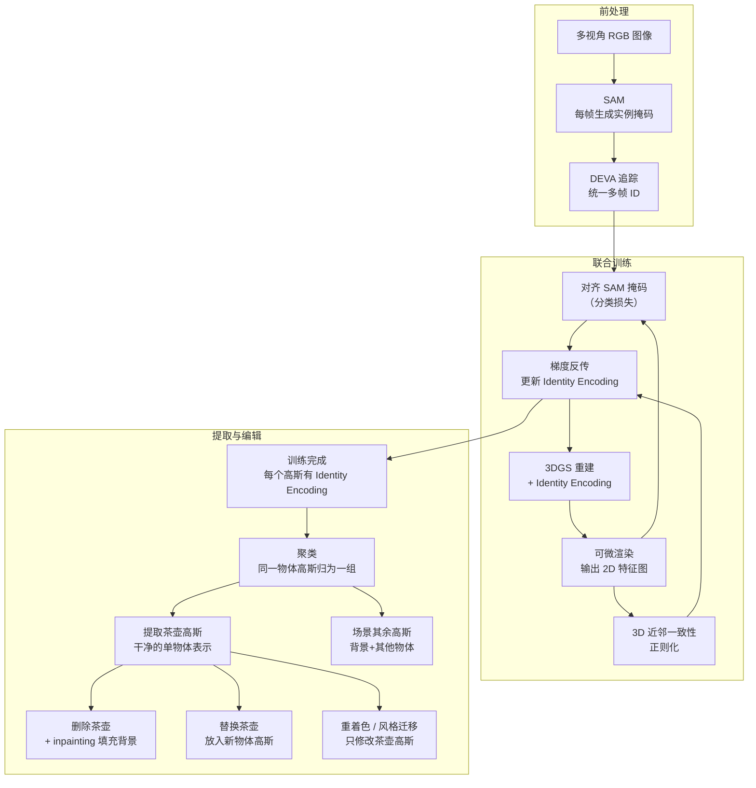

# Gaussian Grouping：给每个高斯贴上身份证，分割并编辑 3D 场景中的任何物体

> **论文标题**：Gaussian Grouping: Segment and Edit Anything in 3D Scenes
> **作者**：Mingqiao Ye, Martin Danelljan, Fisher Yu, Lei Ke
> **机构**：ETH Zürich
> **发表**：ECCV 2024（arXiv:2312.00732）
> **代码**：[github.com/lkeab/gaussian-grouping](https://github.com/lkeab/gaussian-grouping)

**知识链接**：
- [3D Gaussian Splatting：用一堆椭球把真实场景搬进电脑](/前置知识/007a_前置知识_3D_Gaussian_Splatting三维场景重建) — Gaussian Grouping 直接在标准 3DGS 上扩展，理解高斯的渲染机制是前提

---

## 贯穿全文的例子

桌面上放着一把茶壶、一个苹果、一个骰子。你用手机绕桌子拍了一圈，用标准 3DGS 重建出了这个场景。

现在你想做两件事：① **把茶壶单独提取出来**，得到一个干净的茶壶高斯集合；② **把桌面上的茶壶替换成一个杯子**。

标准 3DGS 训练完之后，你手里只有几十万个椭球，没有任何物体概念——完全不知道哪些高斯属于茶壶。这就是 Gaussian Grouping 要解决的问题。

---

## 一、为什么训练后聚类是治标不治本：结构性缺陷

**结论先行：3DGS 训练后直接做聚类，物体边界处的高斯天生就是为了渲染两个物体之间的混合区域而存在的，聚类时无论把它们分给哪个物体都是错的。**

这个问题不是聚类算法不够好，而是 3DGS 训练的目标本身造成的。3DGS 训练时，物体边界处的高斯会扩展自己的影响范围，覆盖过渡区域，让渲染出来的图像颜色混合自然。这些高斯的语义归属是模糊的——它们同时"服务"于茶壶和桌面。

在茶壶的例子里：茶壶底部和桌面接触区域的高斯，其颜色是茶壶釉面和木纹桌面的混合。让它属于茶壶？那提取出的茶壶底部会带一块桌面颜色。让它属于桌面？茶壶底部就漏空了。聚类算法面对这种先天歧义无能为力。

这就是为什么 Gaussian Grouping 选择另一条路：**不在训练后聚类，而是在训练时就让每个高斯学会自己属于哪个物体**，用 2D 分割信号直接约束物体边界处的高斯归属。

---

## 二、Identity Encoding：每个高斯的物体身份证

**Identity Encoding 的核心思路一句话：给每个高斯额外存一个低维向量（类似 embedding），同一物体的高斯在这个向量空间里聚在一起，不同物体的分开。**

这个向量不是颜色、不是不透明度，是一个专门用来表达"我属于谁"的特征向量。Gaussian Grouping 把它附加在每个高斯上，和颜色、位置一起参与训练和渲染。

### 如何让 Identity Encoding 有意义：SAM 监督

训练这个 Identity Encoding 的监督信号来自 SAM（Segment Anything Model，分割任意物体模型）。流程如下：

1. 对训练集里的每帧图像，用 SAM 生成实例分割掩码
2. 通过可微渲染，把每个高斯的 Identity Encoding 渲染成一张 2D 特征图（就像渲染颜色一样）
3. 让渲染出来的 2D 特征图和 SAM 掩码对齐：同一掩码内的像素对应的高斯 Identity Encoding 要靠近，不同掩码的要远离

通过这个循环，高斯慢慢"学会"了哪些像素属于同一个物体，进而哪些高斯属于同一个物体。

### 关键难题：SAM 在不同视角下的 ID 不一致

SAM 每次独立推理，不知道"上一帧的茶壶是 id=3"。从正面拍茶壶，SAM 给它 id=3；从侧面拍，SAM 可能给它 id=7。如果直接用这些不一致的 id 做监督，同一个茶壶的高斯会被训练成截然不同的 Identity Encoding。

解决方案是用**视频对象追踪模型**（DEVA 或类似工具）在多帧之间建立 id 对应关系，确保"第 1 帧的 id=3 和第 20 帧的 id=7 其实是同一个茶壶"。追踪对齐之后，SAM 掩码才能用作一致的监督信号。

---

## 三、3D 空间一致性正则化：让近邻高斯归属一致

**只靠 2D 掩码监督还不够——两个高斯在空间里紧挨着，但如果从某个视角投影时恰好落在不同掩码里，它们的 Identity Encoding 就会被训练成不同的。**

Gaussian Grouping 加了一个 3D 空间一致性正则化：对空间上近邻的高斯对，惩罚它们 Identity Encoding 差异过大。直觉上，紧挨着的两个高斯大概率属于同一个物体，如果被训练成不同归属，多半是 2D 监督信号的噪声导致的，应该用 3D 空间先验来纠正。

$$
\mathcal{L}_{\text{3d}} = \sum_{(i,j) \in \mathcal{N}} \exp\left(-\frac{\| p_i - p_j \|^2}{\sigma^2}\right) \cdot \| e_i - e_j \|^2
$$

**这个正则项在做什么**：对所有近邻高斯对，按距离加权地惩罚 Identity Encoding 的差异——越近的高斯对归属越接近，距离远了权重自然衰减。

::: details 📐 正则项详解（点击展开）

| 子表达式 | 它是谁 | 它在干嘛 |
|---|---|---|
| $(i,j) \in \mathcal{N}$ | **近邻对** | 在 3D 空间里距离近的高斯对集合 |
| $\| p_i - p_j \|^2$ | **空间距离** | 两个高斯中心的欧氏距离平方 |
| $\exp(-\cdot / \sigma^2)$ | **距离权重** | 距离越近权重越大，距离远了自动忽略 |
| $\| e_i - e_j \|^2$ | **归属差异** | 两个高斯 Identity Encoding 的距离，越大说明归属越不一致 |

**用人话读**："对每对空间上靠近的高斯，距离越近就越严厉地要求它们归属一致。"

**为什么需要这项**：2D 监督信号有噪声，同一物体的高斯偶尔会被错误地分配不同 id，空间先验用来纠正这种局部不一致。
:::

---

## 四、完整训练与提取流程

> 训练阶段，Identity Encoding 通过 2D 掩码监督和 3D 空间正则同时优化；训练完成后，按 Identity Encoding 聚类就能拿到任意物体的高斯集合，后续编辑操作直接在高斯子集上进行。

---

## 五、显式高斯的编辑优势：NeRF 做不到的事

**一旦知道哪些高斯属于茶壶，编辑变成直接操作高斯子集的问题，NeRF 的隐式表示根本没有这种能力。**

NeRF 把场景编码进 MLP 的权重里，"茶壶"不是一个可以单独取出的对象，而是分散在整个网络参数空间里的隐式分布。想删除茶壶？你需要重新训练一个没有茶壶的 NeRF，或者设计复杂的条件生成机制。

Gaussian Grouping 之后，茶壶就是茶壶高斯集合，是一堆显式的椭球。支持的编辑操作包括：

- **删除**：移除茶壶高斯，用 2D inpainting 填补背景空洞
- **重着色**：只修改茶壶高斯的球谐系数（控制颜色的参数），其他高斯不动
- **风格迁移**：对茶壶高斯的外观做风格化，而不影响苹果和骰子
- **场景重组**：把茶壶高斯集合当作一个刚体，平移、旋转到新位置，重新渲染

---

## 六、干净度的极限：结构性问题没有完全消除

Gaussian Grouping 比训练后聚类（SAGA 等）干净，但并没有从根本上解决边界高斯的歧义。用 Identity Encoding 约束训练过程，可以让边界高斯的归属更稳定，但那些处于两个物体混合区域的高斯仍然会有一些分类噪声。

实际使用中的典型问题：
- 茶壶底部和桌面接触处有几个高斯归属不明确，提取出来的茶壶底部边缘会有轻微锯齿
- 遮挡关系复杂的场景（茶壶把手被壶嘴遮挡的角度）里，遮挡区域的高斯 Identity Encoding 监督信号来自视角有限，精度下降

这些局限促生了后续工作：Lifting by Gaussians 用不同的策略（直接 lifting 而非训练时学习）来改善干净度；Segment-then-Splat 则彻底在重建阶段就分开各物体，从根源上避免边界模糊。

---

## 小结

Gaussian Grouping 的贡献可以概括为：**把物体实例分割这件事从"训练后处理"变成了"训练时学习"，用 SAM 掩码 + 视频追踪统一 id + 3D 空间正则，让每个高斯在重建结束时就知道自己属于哪个物体，进而让 3DGS 场景变成可以直接操作单个物体的显式数据结构。**

它奠定了"语义高斯"和"可编辑高斯"这两个研究方向的基础实现范式，后续 LangSplat、GLS、SAGA 等工作都在不同维度上延伸这个思路。
