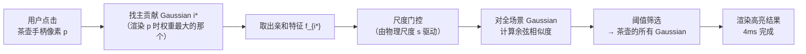
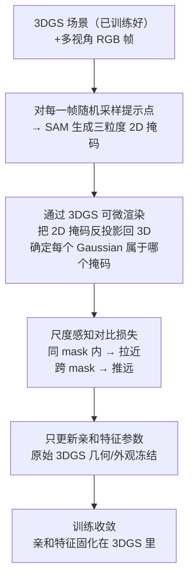

# SAGA：4 毫秒响应的提示驱动三维高斯分割

> **论文标题**：Segment Any 3D Gaussians
> **作者**：Jiazhong Cen, Jiemin Fang, Chen Yang, Lingxi Xie, Xiaopeng Zhang, Wei Shen, Qi Tian
> **发表**：arXiv:2312.00860，AAAI 2025

**知识链接**：
- [3D Gaussian Splatting：用一堆椭球把真实场景搬进电脑](/前置知识/007a_前置知识_3D_Gaussian_Splatting三维场景重建) — SAGA 在 3DGS 的基础上附加亲和特征，必须先理解 3DGS 的渲染流程

---

## 贯穿全文的例子

> **场景**：桌面上放着一把茶壶、一个苹果和一颗骰子，已经用 3DGS 重建成了一个高质量的 3D 场景（几十万个高斯椭球）。用户打开渲染视角，用鼠标在茶壶的手柄处**点了一下**。
>
> 目标：这一次点击应该在 4ms 内返回"茶壶的所有高斯"，而不是苹果的、骰子的，也不是茶壶嘴的一小部分。

---

## 一、2D 提示如何找到 3D 里的正确物体：亲和特征的作用

**结论先行**：SAGA 的核心思路是给每个 Gaussian 附加一个"亲和特征向量"（affinity feature），同一物体的 Gaussian 特征相近、不同物体的 Gaussian 特征相距远，然后用 2D 点击作为查询键，在 3D 里做最近邻检索。

在 SAGA 之前，Gaussian Grouping 也能做 3D 分割，但它的路线是：训练时赋予每个 Gaussian 一个 instance id，推理时把同 id 的 Gaussian 聚类在一起。这一步**聚类本身**就是误差来源：物体边界处的 Gaussian 可能同时对两个物体的渲染有贡献，id 的分配容易模糊；加上训练时的 mask 跨帧不一致，最终提取出来的物体往往带着一些"漂浮"在空中的孤立 Gaussian（floater）。

SAGA 绕过了显式聚类。它的想法更直接：

1. 给场景里每个 Gaussian 学一个特征向量 $\mathbf{f}_i \in \mathbb{R}^d$
2. 训练时让同一物体内的 Gaussian 特征相近（正样本对），不同物体的 Gaussian 特征远离（负样本对）——这是**对比学习**的标准套路
3. 推理时，用户点击像素 $p$，找到对该像素贡献最大的 Gaussian $i^*$，把 $\mathbf{f}_{i^*}$ 作为查询向量，对全场景做相似度检索，返回所有相似 Gaussian

对茶壶手柄的点击：渲染手柄那个像素的"主力 Gaussian"是手柄附近的某个椭球，取出它的亲和特征后，全场景里和它特征相近的——都是茶壶上的 Gaussian；苹果和骰子的 Gaussian 特征相距很远，自然不会被选中。

> 整条查询链路没有任何迭代优化步骤——从点击到结果，全是一次前向查询，这是 4ms 速度的来源。

---

## 二、尺度门控：解决"要整壶还是要壶嘴"的粒度歧义

**结论先行**：不加尺度控制，同一个点击可能匹配到局部（茶壶嘴）或整体（整个茶壶），亲和特征无法区分这两种粒度。尺度门控用一个物理尺度参数 $s$ 来切换"细粒度模式"和"粗粒度模式"。

单纯的亲和特征存在一个根本性的模糊：点击茶壶手柄的像素，究竟该返回"整个茶壶"还是"手柄这一小块"？这取决于用户的意图，而意图无法从一个像素点里读出来。SAGA 的解决方案是把"粒度"变成一个**用户可以指定的参数 $s$**，再用 $s$ 来调制特征的哪些维度被激活。

尺度门控亲和特征的形式如下：

$$
\tilde{\mathbf{f}}_i(s) = \sigma\!\left(\mathbf{W}_g \cdot s\right) \odot \mathbf{f}_i
$$

**这个公式在做什么**：用物理尺度 $s$ 生成一个通道级"开关"，选择性地保留亲和特征里负责"当前粒度"的那些维度，压制其他维度。

::: details 📐 公式详解

| 子表达式 | 它是谁 | 它在干嘛 |
|---|---|---|
| $\mathbf{f}_i$ | **原始亲和特征** | Gaussian $i$ 学到的 $d$ 维身份向量，同一物体的 Gaussian 这里相近 |
| $s$ | **物理尺度参数** | 用户指定的"我想要多大的物体"，可以是 cm/m 量级的实际尺寸，也可以是归一化的粒度值 |
| $\mathbf{W}_g \cdot s$ | **门控激活值** | 把标量 $s$ 通过可学习矩阵 $\mathbf{W}_g$ 映射到 $d$ 维向量，每个维度对 $s$ 的敏感度不同 |
| $\sigma(\cdot)$ | **Sigmoid 软门** | 把每个维度的激活值压到 (0,1)，值越接近 1 该维度越"打开"，越接近 0 越"关闭" |
| $\odot$ | **逐元素乘法** | 用门控向量遮住原始特征——打开的维度保留，关闭的维度接近零 |

**用人话读**："给每个 Gaussian 的特征向量套上一个由尺度 $s$ 控制的调光板，小 $s$ 打开精细通道、关掉粗粒度通道，大 $s$ 反过来——查询时用调光后的特征做匹配，自然只能匹配到同粒度的 Gaussian。"

**为什么不直接训练两套特征**：用门控是因为同一个 Gaussian 在不同粒度下都有合法身份（茶壶手柄的 Gaussian 既属于"手柄"也属于"茶壶"），硬分两套特征会让训练目标冲突；门控让同一特征空间里不同方向负责不同粒度，通过 $s$ 切换，两套语义共存于同一向量。

:::

回到茶壶例子：
- $s$ 小（用户想要局部细节）→ 门控打开"精细通道"，点击茶壶嘴只返回茶壶嘴的 Gaussian
- $s$ 大（用户想要整个物体）→ 门控打开"粗粒度通道"，点击茶壶嘴能返回整个茶壶的所有 Gaussian

---

## 三、训练：用 SAM 的多粒度掩码做尺度感知对比学习

**结论先行**：训练时不需要任何人工 3D 标注，直接用 SAM 在 2D 帧上生成的多级掩码作为监督信号，让同 mask 内的 Gaussian 特征相近、跨 mask 的 Gaussian 特征相远。

SAM（Segment Anything Model）有一个很方便的特性：给定一个点提示，它会同时返回三个粒度的掩码——"局部细节"、"单个物体"、"整体语义区域"。这三个粒度天然对应了 SAGA 里 $s$ 的三档。

训练流程：

> 注意第三步：把 2D 掩码反投影回 3D，用的是 3DGS 渲染时记录的"哪个 Gaussian 对哪个像素贡献了多少权重"。这个信息在前向渲染时就计算好了，不需要额外的深度估计或点云配准。

对比损失的设计有一个关键细节：**尺度一致性约束**。在相同尺度 $s$ 下，同一 mask 内 Gaussian 对的对比损失更强（拉力更大）；在不同尺度 $s$ 下，约束放宽——因为同一个 Gaussian 本来就该在不同粒度的 mask 里都出现，强行拉近只会造成混乱。

训练完成后，亲和特征固化在 3DGS 文件里，推理时无需任何额外计算——直接取特征、做点积、阈值筛选，4ms 返回结果。

---

## 四、局限与适用边界

SAGA 的速度和交互体验无可挑剔，但有三个结构性约束值得清楚认识：

**1. floater 问题没有从根本上消除。** 亲和特征让同物体的 Gaussian 聚合，但物体边界处的"夹缝 Gaussian"（同时对两个物体渲染有贡献的）在训练时会收到矛盾的监督信号，最终特征位置不稳定，分割边界依然会有少量漂浮点。这是所有"特征蒸馏 + 检索"方案共有的问题，根源在于 3DGS 本身的 Gaussian placement 不受物体边界约束。

**2. 尺度 $s$ 的自动推断不稳定。** 用户如果不手动指定 $s$，系统可以从点击区域的大小（例如点击时鼠标停留的像素邻域）粗略估计，但这个估计对视角变化很敏感——同一个茶壶，近景拍摄和远景拍摄时手动点击同一位置，$s$ 的估计会差很多。实际使用时往往还是要用户手动选择粒度档位。

**3. 亲和特征需要集成进 3DGS 训练流程。** 这不是对任意已有 3DGS 场景的零代价后处理——需要在 3DGS 训练完成后，额外跑一个"亲和特征微调"阶段（冻结几何/外观，只训练特征头）。对于已经存好的场景，仍然需要重新跑这个阶段，工程成本比 Lifting by Gaussians 这类完全无训练的方案要高。

---

## 小结

SAGA 的贡献集中在**将 2D 的提示交互能力移植到 3D Gaussian 场景**这件事上，核心是用尺度门控的亲和特征把"属于同一物体"这个概念编码进每个 Gaussian，再借助 SAM 的多粒度掩码作为免标注的训练信号。4ms 的推理速度让它具备真正的实时交互能力，尺度门控解决了多粒度歧义这个 3D 分割里长期悬而未决的问题。它的边界在于：几何干净度依赖训练质量，尺度参数仍需用户参与，不是开箱即用的零成本工具。
