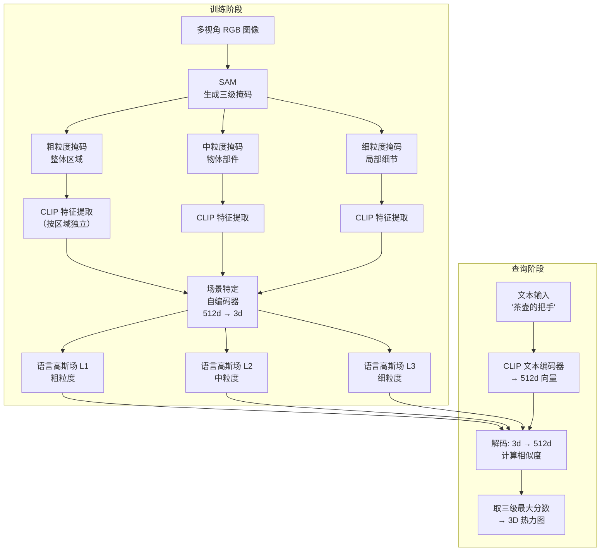

# LangSplat：让每个高斯都懂语言，开放词汇查询 3D 场景

> **论文标题**：LangSplat: 3D Language Gaussian Splatting
> **作者**：Minghan Qin, Wanhua Li, Jiawei Zhou, Haoqian Wang, Hanspeter Pfister
> **机构**：Tsinghua University, Harvard University
> **发表**：CVPR 2024（arXiv:2312.16084）

**知识链接**：
- [3D Gaussian Splatting：用一堆椭球把真实场景搬进电脑](/前置知识/007a_前置知识_3D_Gaussian_Splatting三维场景重建) — LangSplat 直接建立在标准 3DGS 之上，理解其渲染原理是读本文的前提

---

## 贯穿全文的例子

桌面上放着一把茶壶、一个苹果、一个骰子。你拿手机绕桌子拍了一圈视频，用标准 3DGS 重建出了这个场景的三维高斯表示。

现在你想问："**茶壶的把手在哪里？**"——不是告诉系统"那个棕色弯曲物体"，而是直接用自然语言。你期望系统能在三维场景里高亮出把手对应的那些高斯。

这就是 LangSplat 要解决的问题。

---

## 一、语言场：给三维空间的每个角落赋予语义

**语言场的核心想法一句话说清楚：场景中每个位置都存一个向量，这个向量和 CLIP 文本编码器输出的文本向量做点积，就能得到"这个位置有多像[茶壶把手]"的分数。** 分数高的地方就是查询结果。

CLIP（Contrastive Language-Image Pretraining）是一个把图像和文本映射到同一个向量空间的模型。你把"茶壶把手"送进 CLIP 的文本编码器，得到一个 512 维向量；你把茶壶把手的图片送进 CLIP 的图像编码器，得到另一个 512 维向量。这两个向量在空间里非常接近——这就是 CLIP 的"语言-视觉对齐"。

语言场的意义在于：**不需要预定义类别，不需要训练分类器，只需要存好每个位置的 CLIP 视觉特征，查询时拿文本特征来比对，就能找到任何东西。** 这就是"开放词汇"的含义。

### 为什么 NeRF-based 的 LERF 慢到无法使用

在 LangSplat 之前，LERF（Language Embedded Radiance Fields）已经验证了"把 CLIP 特征塞进三维场景"这个方向是可行的。LERF 用 NeRF 做场景表示，语义查询时的渲染需要对每个像素发出一条射线，沿射线采样几百个点，每个点过一次 MLP……一帧渲染要花几秒钟。

在茶壶例子里，你想旋转视角交互式地查看"茶壶把手"的定位结果，LERF 每转一下就要等几秒，完全无法实时使用。

LangSplat 把场景表示换成 3DGS，利用 GPU tile-based 光栅化，一帧渲染在 30ms 以内，相比 LERF 加速了 **199 倍**。加速不是来自算法改进，而是来自表示方式的根本替换：从隐式 MLP 到显式高斯。

---

## 二、不能直接把 CLIP 特征存进每个高斯

换成 3DGS 之后，最朴素的想法是：既然每个高斯已经存了颜色（RGB）和不透明度，那就再给它多存一个 512 维的 CLIP 特征向量就好了。

这个做法有两个致命问题。

**问题一：内存爆炸。** 一个典型 3DGS 场景有 30 万到 100 万个高斯。每个高斯存 512 个 float32，仅特征部分就需要 30 万 × 512 × 4 字节 ≈ 600MB，更多高斯的场景直接超过显存上限。

**问题二：有效维度极少。** 512 维 CLIP 特征是为了表示互联网上几乎所有概念而训练的通用空间。一个桌面茶壶场景实际用到的语义概念可能不超过 20 种，512 维里大量维度对当前场景是冗余噪声。

LangSplat 的解决方案是给每个场景训练一个**场景特定的自编码器**。训练完成后，每个高斯只需要存 **3 维潜变量**——和颜色 RGB 维度完全相同，可以直接复用 3DGS 的渲染 pipeline，无需修改光栅化代码。

查询时，先用自编码器的解码器把 3 维潜变量重建回 512 维 CLIP 特征，再和文本特征做相似度计算。

$$
\mathcal{L}_{\text{ae}} = \| \text{dec}(\text{enc}(\mathbf{f}_{\text{CLIP}})) - \mathbf{f}_{\text{CLIP}} \|^2
$$

**这个损失函数在做什么**：逼迫自编码器学会用 3 维瓶颈重建 512 维 CLIP 特征，使得信息压缩到极致但场景语义得以保留。

::: details 📐 自编码器损失详解（点击展开）

| 子表达式 | 它是谁 | 它在干嘛 |
|---|---|---|
| $\mathbf{f}_{\text{CLIP}}$ | **原始 CLIP 特征** | 从图像区域提取的 512 维语义向量，是"真相" |
| $\text{enc}(\cdot)$ | **压缩器** | 把 512 维塞进 3 维瓶颈，扔掉对本场景无用的维度 |
| $\text{dec}(\cdot)$ | **重建器** | 从 3 维还原 512 维，希望语义信息没有损失 |
| $\| \cdot \|^2$ | **重建误差** | 还原结果和原始之间的距离，越小越好 |

**用人话读**："把 CLIP 特征压成 3 个数，再展开回 512 维，和原始特征差多少就罚多少。"

**为什么瓶颈选 3 维**：3 维 = 3DGS 的 RGB 通道数，可以直接复用已有的光栅化代码，工程上零改动。实验表明 3 维对于单场景语义已经足够。
:::

---

## 三、SAM 层次化掩码：解决边界模糊问题

压缩方案解决了内存问题，但语义边界模糊的问题还没有解决。

**边界模糊的根源**：CLIP 最初是对整张图打标签训练的。如果你把茶壶+桌面的完整图像送进 CLIP，它输出的特征是整个场景的混合语义。把手边缘的像素"既像茶壶又像背景"，这种模糊特征存进高斯后，查询时把手区域的分数会不够突出。

LangSplat 用 SAM（Segment Anything Model，分割任意物体模型）在 CLIP 特征提取之前先做分割。SAM 能把图像切成若干区域，每个区域内的像素属于同一个物体或部件。然后对**每个区域单独**提取 CLIP 特征——茶壶区域的特征就只代表茶壶，没有桌面的污染。

SAM 还能生成三个粒度级别的掩码：
- **粗粒度**（整体）：茶壶作为一个整体
- **中粒度**（中等）：茶壶分成壶身、壶嘴、把手等部分
- **细粒度**（精细）：更小的局部结构

LangSplat 对应训练三个独立的语言高斯场，查询时对三个场的相似度取最大值，兼顾粗粒度定位（"茶壶在哪里"）和细粒度定位（"茶壶的把手在哪里"）。

> 训练时三条路并行，各自蒸馏一个粒度的语义进高斯；查询时三个场同时响应，取最高分避免粒度歧义。茶壶例：查"茶壶把手"时，L2（中粒度）场里把手对应高斯的分数最高，最终高亮正确区域。

---

## 四、和 LERF 的具体对比

| 对比维度 | LERF（NeRF-based）| LangSplat（3DGS-based）|
|---|---|---|
| 单帧渲染时间 | 约几秒 | &lt;30ms |
| 相对速度 | 基准 | **199× 更快** |
| 特征存储方式 | 隐式（MLP 权重） | 显式（per-Gaussian 3 维向量）|
| 语义边界质量 | 模糊，受 CLIP patch 混合影响 | 清晰，SAM 分区后独立提取 |
| 内存开销 | MLP 参数（少但固定精度） | per-Gaussian，压缩到 3 维后可控 |
| 多粒度查询 | 依赖多尺度采样，慢 | 三个独立场，并行渲染 |

在茶壶例子里，LangSplat 查询"茶壶的把手"能在 30ms 内返回热力图，LERF 同样操作需要等候数秒——这意味着 LangSplat 实际可以用于实时交互场景（比如机器人操作时的目标定位），而 LERF 不行。

---

## 五、局限：语义和几何的解耦是双刃剑

LangSplat 有三个值得关注的局限。

**语义场和几何场完全解耦。** 语言高斯和几何高斯是独立的两套数据，语言场好坏不影响几何重建，反之亦然。好处是可以在任何已有 3DGS 场景上直接叠加语义；坏处是语义边界和几何边界可能不对齐——即使物体表面重建得很准，语义热力图的边界也可能比物体轮廓模糊几个像素。

**场景特定的自编码器不可共享。** 每换一个新场景，自编码器就要重新训练，无法迁移。这不是大问题（自编码器很小，训练很快），但确实增加了部署每个新场景的流程步骤。

**三倍训练开销。** 三个粒度的语言高斯场需要三次独立训练。实践中可以只训练一个粒度（牺牲多粒度查询能力），视应用需求取舍。

---

## 小结

LangSplat 的核心贡献可以用一句话概括：**把 CLIP 特征蒸馏进 3DGS，用场景自编码器压缩维度，用 SAM 分区提取保证边界清晰，换来了比 LERF 快 199 倍的开放词汇 3D 查询能力。**

它的思路直接影响了后续一系列工作：GLS 在此基础上引入几何约束，GAGS 解决多视角特征不一致，Segment-then-Splat 把语义引入更早的重建阶段——这些都是 LangSplat 提出的"语义高斯"框架的延伸。
