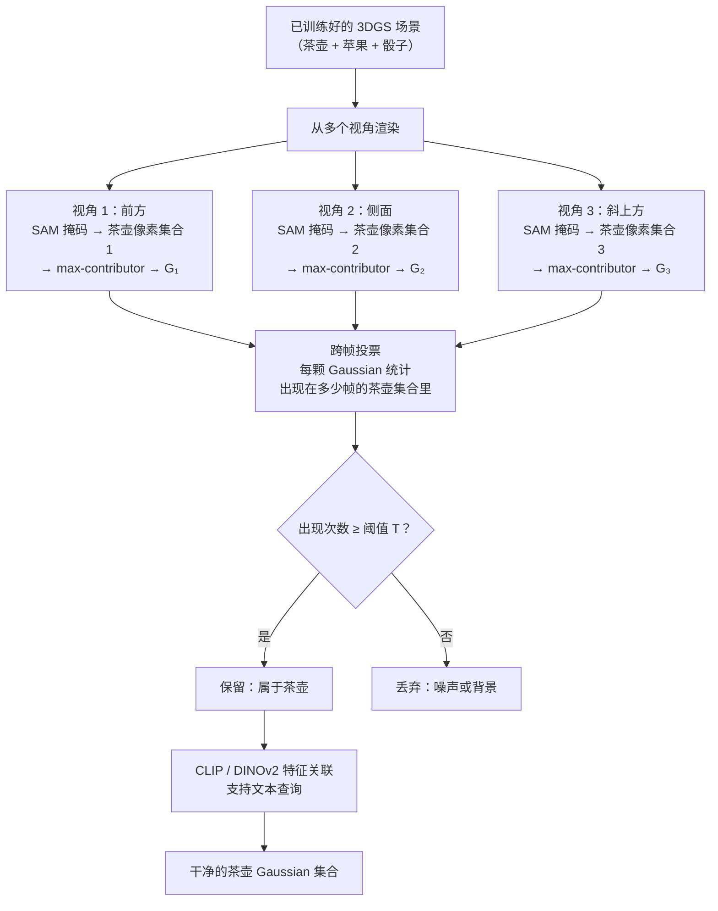

# Lifting by Gaussians：无需训练，把 SAM 掩码直接映射到 3D 高斯

> **论文标题**: Lifting by Gaussians: A Simple, Fast and Flexible Method for 3D Instance Segmentation
> **arXiv**: 2502.00173
> **会议**: WACV 2025

**知识链接**：
- [3D Gaussian Splatting：用一堆椭球把真实场景搬进电脑](/前置知识/007a_前置知识_3D_Gaussian_Splatting三维场景重建) — LBG 工作在已经训练好的 3DGS 场景上，理解 Gaussian 的渲染机制是必要前提

---

## 贯穿全文的例子

> 桌面上有茶壶、苹果和骰子，已经用 3DGS 完整训练好了一个场景——大约 30 万个 Gaussian 散布在整个桌面空间里。现在你想把茶壶单独提取出来：只保留属于茶壶的那些 Gaussian，得到一个干净的茶壶高斯对象，可以单独渲染、移动或放入别的场景。
>
> 要求：**不重新训练场景，不给 Gaussian 加任何新的特征维度，不跑任何优化过程**。

LBG 的答案是：3DGS 的渲染机制本身就已经告诉你哪些 Gaussian 属于茶壶，只需要读取这个信息就够了。

---

## 一、核心洞察：渲染过程本身就是一个像素到 Gaussian 的映射

先给结论：**每个像素背后，总有一颗对它贡献最大的 Gaussian**。找到这颗 Gaussian，就找到了"在这个视角下，这个像素处的三维结构由谁负责"。

### 最大贡献 Gaussian：每个像素背后最主要的那颗高斯

3DGS 的渲染过程是这样的：对于屏幕上的每一个像素，渲染器把落在这个像素附近的所有 Gaussian 按深度从前到后排列，然后逐个累积它们的 alpha（不透明度）贡献，最终得到这个像素的颜色。

在这个累积过程中，每颗 Gaussian 对该像素的实际贡献比例是可以计算的——它取决于这颗 Gaussian 的 alpha 值以及它前面所有 Gaussian 已经累积的透过率。**在所有对该像素有贡献的 Gaussian 里，贡献比例最大的那颗，就叫做这个像素的 max-contributor（最大贡献者）**。

这个 max-contributor 在物理上有直接含义：它是"站在相机方向看过去，这个像素位置最前面的那个不透明表面"——通俗地说，就是你眼睛从相机方向射出一条光线，最先打到的那个高斯椭球。

### 从 SAM 掩码到 Gaussian 子集，一步到位

有了 max-contributor 的概念，提取茶壶就变得极其直接：

1. 对这一帧渲染图，用 SAM（Segment Anything Model）生成茶壶的 2D 像素掩码："这些像素属于茶壶"
2. 对掩码内的每一个像素，查找它的 max-contributor Gaussian
3. 收集所有这些 Gaussian，它们就是"属于茶壶"的 Gaussian 集合

整个过程不需要任何训练，也不需要修改 3DGS 场景，只需要一次前向渲染来获取每个像素的 max-contributor 信息。

---

## 二、跨帧合并：从一个视角扩展到完整物体

单帧映射有一个明显的问题：茶壶的背面在这个视角下是看不到的，背面对应的 Gaussian 自然不会出现在任何像素的 max-contributor 里，所以提取出来的"茶壶"会缺少背面。

解决方法是**多视角投票**。

> 图中每条路径都是独立的"视角证据"。一颗 Gaussian 在越多视角里被 SAM 判定为茶壶，它属于茶壶的置信度就越高。投票机制天然过滤掉偶发的 SAM 误分割。

从不同方向看茶壶，能看到茶壶的不同部分：前方视角看到壶嘴，侧面视角看到把手，斜上方看到壶盖。把所有视角的 Gaussian 集合取并集，再通过投票剔除只在少数视角被错误纳入的背景 Gaussian，最终得到的集合就覆盖了茶壶的各个表面。

**投票阈值 T 的作用**：T 越大，保留的 Gaussian 越保守（精度高但可能漏掉一些边缘区域）；T 越小，覆盖越完整但可能混入一些背景噪声。这是唯一一个需要手动调节的参数。

---

## 三、CLIP/DINOv2 特征：让 Gaussian 能被语言查询

只靠上面的映射机制，LBG 已经能完成"我指定一个 2D 框，提取对应 3D 物体"的任务。但如果你想问"把所有红色物体提取出来"或者"找出茶壶"，还需要给每颗 Gaussian 附上语义信息。

LBG 的做法是**零训练的特征聚合**：对于每颗 Gaussian，找出所有视角中它是某个像素的 max-contributor 的那些像素位置，把这些像素对应的图像 patch 分别输入 CLIP 和 DINOv2，取所有特征的平均值作为这颗 Gaussian 的语义向量。

这和 LangSplat 的路线形成鲜明对比：

| 方法 | 给 Gaussian 关联语义的方式 | 是否需要训练 |
|------|--------------------------|------------|
| LangSplat | 训练一个 scene-specific 语言自编码器，每个 Gaussian 学一个可优化的潜变量 | 需要（约数小时） |
| LBG | 把各视角下该 Gaussian 可见区域的 CLIP/DINO 特征直接平均 | 不需要 |

平均特征的质量比优化出来的特征稍差，但换来的是无需任何训练时间，可以直接应用到任何已有的 3DGS 场景。

---

## 四、为什么提取出的物体比 SAGA 和 Gaussian Grouping 更干净

SAGA 和 Gaussian Grouping 都使用了"亲和特征聚类"的思路：先给每颗 Gaussian 蒸馏一个特征向量，然后把特征相似的 Gaussian 聚为一组。聚类在物体边界处天然是模糊的——边界附近的 Gaussian 和两侧的物体特征都有一定相似度，分配结果不确定。

LBG 的映射是**确定性的**：每个像素的 max-contributor 唯一，投票后的 Gaussian 集合也是唯一的，没有"这颗 Gaussian 该归入哪组"的歧义。边界的精度上限由 SAM 的 2D 分割精度决定，而 SAM 在 2D 图像边界上已经做得相当好。

这意味着 LBG 的质量瓶颈从"3D 聚类的边界模糊"转移到了"2D 分割的精度"——而后者是 SAM 这个大模型的强项。

---

## 五、适用场景与局限

LBG 最适合的场景是：**手边已经有一个训练好的 3DGS 场景，需要快速提取某个或某些物体，不想重新训练**。

- 物体的多视角图像已经在 3DGS 训练数据里——这保证了各面的 Gaussian 都存在
- 需要场景编辑（移动茶壶、替换苹果）或资产提取
- 对速度有要求，SAGA 级别的几秒延迟可以接受，但不能接受重新训练场景的数小时

有两个结构性局限值得注意：

**遮挡面的缺失**。如果茶壶底部在所有拍摄视角里都被桌面遮挡，那么茶壶底部对应的 Gaussian 不会出现在任何 max-contributor 集合里，最终提取出来的茶壶没有底部。这不是 LBG 的 bug，而是 3DGS 本身的特性——你训练时从没看到底部，对应的 Gaussian 就不存在或者没被正确优化。

**依赖 SAM 的一致性**。如果某个视角下 SAM 把茶壶和苹果的部分区域都归入同一个掩码（例如茶壶的红色把手和苹果颜色相近），这一帧的错误就会混入投票结果。多视角投票能减弱单帧错误的影响，但无法完全消除系统性的 SAM 分割错误。

---

## 总结

LBG 把一个看起来需要训练的任务——"给任意 3DGS 场景里的物体做分割"——变成了一个纯粹的信息读取问题：3DGS 的渲染过程已经隐含了"哪颗 Gaussian 负责哪个像素"的信息，LBG 只是把这个信息提取出来，配合 SAM 的 2D 掩码和跨帧投票，就得到了干净的 3D 物体。无需训练、无需修改场景、无需新的特征场，是目前对已有 3DGS 场景做物体提取最轻量的方案。
