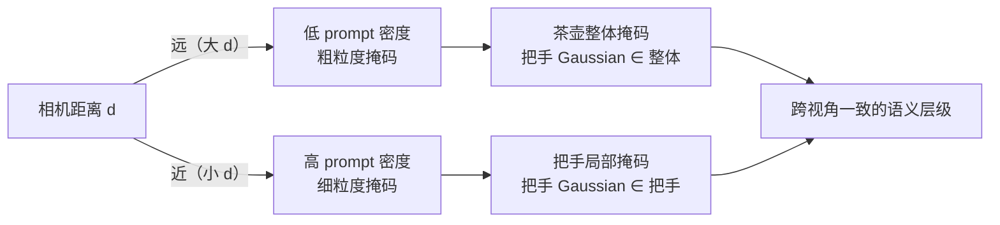
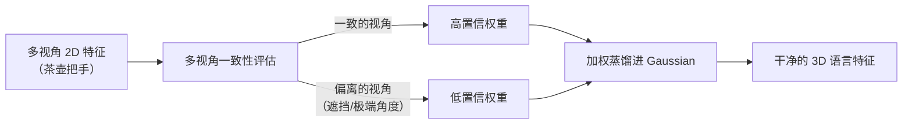

# GAGS：粒度感知特征蒸馏，解决 CLIP→3DGS 的多视角不一致问题

> **论文标题**：GAGS: Granularity-Aware Feature Distillation for Language Gaussian Splatting
> **作者**：Yuning Peng, Haiping Wang, Yuan Liu, Chenglu Wen, Zhen Dong, Bisheng Yang
> **发表**：arXiv:2412.13654，2024 年 12 月
> **项目页**：https://pz0826.github.io/GAGS-Webpage/

**知识链接**：
- [3D Gaussian Splatting：用一堆椭球把真实场景搬进电脑](/前置知识/007a_前置知识_3D_Gaussian_Splatting三维场景重建) — GAGS 在此基础上添加语言特征场
- [LangSplat：让每个高斯都懂语言，开放词汇查询 3D 场景](/论文综述/143_LangSplat_三维语言高斯场景) — GAGS 的直接 baseline，本文的两个贡献都是针对 LangSplat 的遗留问题

---

## 贯穿全文的例子

> 桌上放着一把茶壶。三台相机分别在 0.5m、1m、2m 处拍摄同一把茶壶。现在要训练一个 3D 语言场——给场景里每个 Gaussian 附上 CLIP 语义向量——使得用户输入"茶壶把手"就能在 3D 中精确定位。
>
> 问题：从 2m 外看，整把茶壶是一个小物体，SAM 把它当成一个整体分割；从 0.5m 近看，茶壶的壶嘴、把手、壶身各自成为独立的分割区域。同一个"茶壶把手位置的 Gaussian"，在 2m 视角被标记为"茶壶整体"，在 0.5m 视角被标记为"把手局部"——两种监督信号相互矛盾。蒸馏出来的语言场在这里就会产生噪声边界。

---

## LangSplat 蒸馏进 3DGS 的流程与遗留问题

[LangSplat](/论文综述/143_LangSplat_三维语言高斯场景) 的训练流程是：对每一帧图像，用 SAM 生成若干分割掩码，对每个掩码区域单独提取 CLIP 特征，再用这些 2D 特征监督每个 Gaussian 学一个语言潜变量。逻辑上很清晰，但实践中有一个系统性缺陷：SAM 在不同距离、不同视角下，对同一物体生成的掩码粒度完全不同。

**多视角不一致在这个例子里产生两个矛盾：**

第一个矛盾是**分割粒度矛盾**。茶壶把手位置的那批 Gaussian，被 2m 视角标记为"整体茶壶"，被 0.5m 视角标记为"把手局部"。这两个标签语义层级不同，不是同一个概念，直接混合蒸馏的结果是特征向量两边都不像。

第二个矛盾是**特征内容矛盾**。即使两个视角下的掩码恰好都覆盖了"把手"，2m 处拍到的把手图像 patch 和 0.5m 处拍到的有本质差异——前者包含茶壶整体上下文，CLIP 特征里有茶壶整体的语义；后者是极近景细节，CLIP 特征里更多是把手纹理和形状。同样标记为"把手"，两次提取出的 CLIP 向量都不一样。

LangSplat 用三个独立的粒度场（对应 SAM 的三个分割级别）来缓解这个问题，但三个场并行训练，本质上是把矛盾分散到三个独立空间，而不是从源头消除矛盾。GAGS 的两个贡献直接从根源解决这两个矛盾。

---

## 修复一：让 SAM 的分割粒度随相机距离缩放

**结论**：通过动态调整 SAM 的 prompt 点密度，使得不同距离下生成的掩码粒度趋于一致——2m 处和 0.5m 处对同一物体产生"等效粒度"的掩码。

SAM 的分割行为由 prompt 点的密度控制。prompt 点越密，SAM 倾向于在每个点附近切割出更小的局部区域（细粒度）；prompt 点越稀疏，SAM 倾向于生成覆盖更大区域的掩码（粗粒度）。

GAGS 把这个密度参数和相机到场景中心的距离挂钩：**相机距离越远，prompt 密度越低（粗粒度）；相机越近，prompt 密度越高（细粒度）**。

对茶壶例子：2m 远处，相机已经在远距了，SAM prompt 密度调低，生成的掩码是茶壶整体；0.5m 处，SAM prompt 密度调高，生成的掩码是把手、壶嘴等局部。——这看起来正好相反，但关键是：系统不是要求两个距离下产生相同的掩码形状，而是要求同一 Gaussian 在所有视角里都被分进"同一语义层级"的掩码里。远处用粗粒度、近处用细粒度，恰好使得被覆盖的 Gaussian 集合在各视角间保持语义层级一致。

> 这张图说明粒度匹配的核心思路：不是"所有视角产生相同掩码"，而是"相机视角和 prompt 密度同步变化，使得被监督的语义层级保持稳定"。

---

## 修复二：无监督粒度因子过滤不可靠特征

**结论**：即使分割粒度对齐了，遮挡、极端视角、光照变化仍会让某些视角的 CLIP 特征不可信。粒度因子是一个自动学习的权重，给可信视角高权重、不可信视角低权重，蒸馏时按权重加权，不需要任何人工标注。

设计很直接：对每个训练样本（一帧图像 + 一个掩码 + 一个 CLIP 特征向量），学一个标量置信权重。学习信号来自多视角一致性：如果同一组 Gaussian 在多个视角下提取出的 CLIP 特征互相接近，那么这些视角的权重就高；如果某个视角的特征明显偏离其他视角，该视角的权重就低。整个过程无监督——"什么是异常视角"不需要人来标注，系统自己从多视角一致性中发现。

对茶壶例子：茶壶背面有一小块被碗挡住，从某个视角拍到的 CLIP 特征包含了大量碗的语义。粒度因子发现这个视角的特征和其他视角偏差大，自动给它低权重，蒸馏时这个视角的贡献被压制。

> 这张图的要点：粒度因子不挑选"好视角"，而是对所有视角按可信度加权，遮挡或极端视角的贡献被自然稀释。

---

## 推理速度：2× 加速是精度提升的副产品

LangSplat 维护三个独立的语言 Gaussian 场（对应 SAM 的三个分割粒度），查询时对三个场各查一遍再取最大相似度，等于三倍查询开销。

GAGS 因为训练时粒度已经统一，不再需要三个并行场来"覆盖"不同粒度——单个更紧凑的场就能稳定响应不同粒度的查询，省掉了额外的两次查询，推理速度自然提升约 2 倍。

这个加速不是刻意的工程优化，是"把矛盾从源头解决后"结构简化的自然结果。

---

## 和 LangSplat 的对比

| 问题 | LangSplat 的处理 | GAGS 的改进 |
|---|---|---|
| 多视角分割粒度不一致 | 三个粒度场各自蒸馏 | SAM prompt 密度随相机距离调整 |
| 特征多视角不可信 | 直接平均或随机取 | 无监督粒度因子加权过滤 |
| 推理速度 | 三倍查询开销 | 单场查询，约 2× 加速 |
| 边界质量 | 跨视角矛盾导致边界噪声 | 一致蒸馏，边界更清晰 |

---

## 局限

GAGS 的两个修复都依赖"多视角覆盖"：prompt 密度调整需要知道相机到场景的距离，粒度因子需要同一 Gaussian 被足够多视角观测到才能可靠评估一致性。对于只有少量视角覆盖的稀疏采集场景，这两个机制的效果会打折扣。

此外，GAGS 仍然基于 CLIP 特征蒸馏的范式，场景重建和语言场训练是分开的两个阶段，语义边界和几何边界之间的本质耦合问题（ [Gaussian Grouping](/论文综述/141_GaussianGrouping_3DGS场景实例分割与编辑) 和 [GLS](/论文综述/145_GLS_几何感知三维语言高斯) 在尝试解决）GAGS 没有处理。
