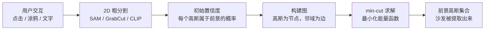

# GaussianCut：用图割在 3D 高斯场景里做交互式精确分割

> **论文标题**：GaussianCut: Interactive Segmentation via Graph Cuts for 3D Gaussian Splatting
> **作者**：Umangi Jain, Ashkan Mirzaei, Igor Gilitschenski
> **机构**：University of Toronto
> **发表**：arXiv:2411.07555，2024 年 11 月

**知识链接**：
- [3D Gaussian Splatting：用一堆椭球把真实场景搬进电脑](/前置知识/007a_前置知识_3D_Gaussian_Splatting三维场景重建) — 本文操作的场景表示基础

---

## 贯穿全文的例子

> 你有一个已经训练好的客厅 3DGS 场景，里面有沙发、茶几和地毯。你想把沙发单独提取出来——拿到属于沙发的高斯子集，方便后续替换材质或挪到另一个场景。你不想重新训练整个场景，也不想手动挑选高斯。GaussianCut 让你只需在渲染图上随手圈一圈沙发，就能自动完成这件事。

---

## 一、分割问题的本质：在无标签椭球里找出"沙发"

3DGS 训练完成后，你得到的是几十万颗无标签的高斯椭球。它们知道如何一起渲染出好看的画面，但根本不知道哪些属于沙发、哪些属于地毯。

现有方法（SAGA、Gaussian Grouping）的做法是：给每个高斯附加语义特征向量，训练时用 SAM 的 2D 掩码做监督，训练完再用聚类分组。这条路有两个代价：需要重新训练，且聚类在物体边界处本质上是个软决策——沙发扶手和地毯之间那圈高斯归属模糊。

GaussianCut 完全绕开了这条路。它不学任何特征，而是把分割问题转化成一个组合优化问题：给定用户的粗略输入，找到代价最小的方式把高斯切成前景和背景两组。这个问题有成熟的精确求解算法——图割（graph cut）。

---

## 二、整体流程

> 图割是管线的核心，但它依赖 2D 粗分割给出的初始置信度。粗分割负责定位物体，图割负责在 3D 层面把边界对齐到高斯自然分布的间隙处。

---

## 三、图的构建：高斯如何变成一张图

**节点**：场景里的每个高斯都是一个节点，外加两个超节点：源节点（source，代表前景）和汇节点（sink，代表背景）。

**普通边**（高斯之间）：在 3D 空间中位置相邻的高斯对之间连一条无向边。边的权重由两个高斯的外观相似度决定——颜色越接近，边权越高，代表切断这条边的代价越大。直觉上：沙发内部高斯颜色相近，边权高；沙发和地毯接触处颜色突变，边权低——图割自然会在那里切断。

**终端边**（高斯到超节点）：每个高斯和 source、sink 各连一条有向边。权重来自 2D 粗分割给该高斯打的置信度分：粗分割认为它是前景，连向 source 的边便宜；认为它是背景，连向 sink 的边便宜。

---

## 四、能量函数：用一个数字衡量每种分割方案的代价

有了图，分割问题变成：找到给每个高斯打标签（前景 $f_i=1$ 或背景 $f_i=0$）的方案，使下面这个能量最小：

$$E(f) = \sum_i D_i(f_i) + \sum_{(i,j) \in \mathcal{N}} V_{ij}(f_i, f_j)$$

**两项分别是什么**：$D_i(f_i)$ 是数据项——把高斯 $i$ 标记为 $f_i$ 时和粗分割"唱反调"的代价；$V_{ij}(f_i, f_j)$ 是平滑项——把外观相似的相邻高斯 $i$ 和 $j$ 强行分开的代价。两者的张力迫使算法找到"既尊重用户意图又沿着外观边界切割"的最优分割。

这个最小割问题用 max-flow 算法精确求解，不是近似，单次求解通常在毫秒到秒级完成。

::: details 📐 符号说明（点击展开）

| 符号 | 含义 |
|---|---|
| $D_i(f_i)$ | 数据项：高斯 $i$ 的标签与粗分割置信度不一致时的代价 |
| $V_{ij}(f_i, f_j)$ | 平滑项：相邻高斯 $i$、$j$ 被分到不同组时的代价，正比于颜色相似度 |
| $\mathcal{N}$ | 所有相邻高斯对的集合 |

:::

---

## 五、三种用户输入，统一接口

**点击或框选**：在渲染图上点击或框出沙发，SAM 生成初始 2D 掩码。掩码内的高斯前景置信度高，掩码外的背景置信度高。

**涂鸦（scribble）**：用户在前景和背景各涂一笔。涂鸦覆盖的高斯直接被锁定为强约束，只有未被涂鸦的高斯才由图割决定归属。

**文字查询**：输入"沙发"，CLIP 计算文本向量与各区域图像特征的余弦相似度，作为一元项的初始化。

三种输入都归结为同一个接口："给出每个高斯的初始前景/背景概率"，然后交给图割精化。

---

## 六、和特征聚类方法的对比

| 对比维度 | SAGA / Gaussian Grouping | GaussianCut |
|---|---|---|
| 是否需要重训场景 | 是，需联合训练 identity 向量 | 否，适用任意已有 3DGS 场景 |
| 结果确定性 | 聚类有随机性 | max-flow 是精确确定性算法 |
| 边界精度 | 聚类在边界处模糊 | 图割自然沿外观变化最大处切割 |
| 用户能否迭代精修 | 难（需要重训） | 可以，加涂鸦后重新求解 min-cut |

核心差异在于**何时引入语义信息**：特征聚类方法在训练时把语义"烧进"每个高斯；图割方法在用户交互时才引入语义，通过优化把语义和几何对齐。

---

## 七、局限

**上游质量上限**：图割的边界精度不能超过 2D 粗分割。如果 SAM 把沙发腿和地毯归入同一掩码，图割拿到的置信度本身就混了，难以在 3D 里把它们分开。

**稀疏区域效果有限**：玻璃、透明薄片的高斯分布极稀疏且散乱，邻域关系无法反映真实物体结构，边权估计偏差大。

**单视角输入的遮挡盲区**：被沙发背面遮挡的高斯在 2D 掩码里看不见，其置信度完全依赖平滑项传播，可能不准确。对复杂形状物体，需要从多个视角给输入。

**不支持全自动场景分解**：图割必须有用户输入才能运行，无法无提示地批量分解场景中的所有物体。
