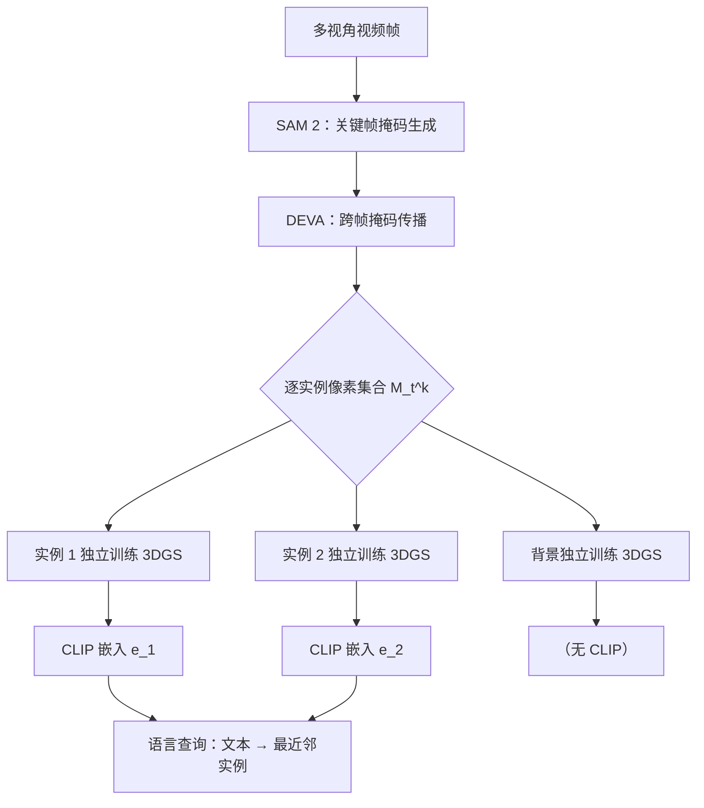

## 结论

**先用 2D 视频分割在帧序列上得到逐帧一致的实例掩码，再对每个物体独立训练一组 3DGS——这样得到的高斯天然干净，不存在跨物体污染**。Segment-then-Splat（arXiv 2503.22204，NeurIPS 2025）把管线顺序从"先重建再分割"翻转为"先分割再重建"，从根本上消除了 Gaussian Grouping / LangSplat 等后处理方案在对象边界处的浮点（floater）问题，同时天然支持动态场景中物体独立运动。

---

## 贯穿例子

桌面场景：茶壶、苹果、骰子放在桌面上，摄像机绕桌一圈拍摄 120 帧。传统方案先把整个场景训成一组 3DGS，再试图从高斯中"剪出"茶壶——边界处的高斯同时被茶壶和背景桌面监督，最终形成浮点杂散高斯。Segment-then-Splat 先在 120 帧上用 SAM 2 + DEVA 追踪出茶壶的逐帧掩码，然后只用掩码内的像素训练茶壶的高斯；苹果和骰子同理各自独立训练，桌面背景单独训练。结果：茶壶的高斯只见过茶壶像素，绝不含桌面信息。

---

## 问题：后处理分割的结构性局限

```mermaid
flowchart LR
    subgraph 传统方案["后处理方案（先重建再分割）"]
        A[多视角图像] --> B[训练场景级 3DGS]
        B --> C[每个高斯学到"混合"颜色/特征]
        C --> D[聚类 / 图割分割]
        D --> E["边界高斯归属模糊<br/>浮点无法消除"]
    end
    subgraph STS["Segment-then-Splat（先分割再重建）"]
        F[多视角图像] --> G["SAM 2 + DEVA<br/>逐帧实例掩码"]
        G --> H["逐物体独立训练<br/>各自的 3DGS"]
        H --> I["每组高斯只见物体像素<br/>天然干净"]
    end
```

> 上图的核心观察：左路的混合发生在训练期——高斯的梯度来自多个物体的像素，边界处的高斯同时被拉向两侧，这是一个无法靠后处理完全修复的训练时缺陷。右路把物体隔离提到训练之前，高斯从未接触其他物体的监督信号。

传统方案的浮点问题不是优化不够，而是**监督信号本身有歧义**：边界高斯的渲染像素同时属于两个物体，梯度在两者之间妥协，最终高斯停在两者之间的空间位置。

---

## 方法：两阶段管线

### 阶段一：视频分割得到逐帧一致掩码

给定 $T$ 帧图像 $\{I_t\}_{t=1}^T$，用 **SAM 2**（Segment Anything Model 2）在关键帧上生成初始掩码，再用 **DEVA**（Tracking-Anything with Decoupled Video Segmentation）跨帧传播，得到每个实例 $k$ 的掩码序列 $\{M_t^k\}_{t=1}^T$。

DEVA 的跨帧传播保证了同一实例在不同帧中具有一致的像素集合——这是后续每个物体独立训练 3DGS 的先决条件：只有当多视角掩码对应同一真实物体时，独立训练才能收敛到正确形状。

### 阶段二：逐物体独立训练 3DGS

对实例 $k$，只使用掩码内的像素计算光度损失：

$$
\mathcal{L}_k = \sum_{t=1}^T \sum_{p \in M_t^k} \left\| C_k(p, t) - I_t(p) \right\|_1
$$

$$
\boxed{\text{每个实例 } k \text{ 独立拥有一组高斯参数 } \Theta_k = \{\mu_i, \Sigma_i, \alpha_i, \mathbf{sh}_i\}}
$$

<details>
<summary>符号说明</summary>

| 符号 | 类型 | 含义 |
|------|------|------|
| $C_k(p, t)$ | 输出 | 实例 $k$ 在像素 $p$、帧 $t$ 的渲染颜色 |
| $I_t(p)$ | 输入 | 真实图像像素颜色 |
| $M_t^k$ | 输入 | 实例 $k$ 在帧 $t$ 的掩码像素集合 |
| $\mu_i \in \mathbb{R}^3$ | 状态 | 高斯中心位置 |
| $\Sigma_i$ | 状态 | 3×3 协方差矩阵（控制形状和朝向） |
| $\alpha_i \in [0,1]$ | 状态 | 不透明度 |
| $\mathbf{sh}_i$ | 状态 | 球谐系数（视角相关颜色） |

</details>

**设计意图**：损失只在掩码内的像素上累计，意味着高斯的梯度来源纯粹属于该实例，不会被背景或邻近物体的像素"污染"。与此同时，背景高斯在同一套框架下单独训练，处理掩码之外的像素。

### CLIP 嵌入：让物体可被语言查询

每个实例 $k$ 的高斯训练完成后，对其渲染的多视角图像 patch 提取 CLIP 特征并平均：

$$
\mathbf{e}_k = \frac{1}{|V_k|} \sum_{v \in V_k} \text{CLIP}_{\text{img}}\!\left(\text{crop}(I_v, M_v^k)\right)
$$

查询时，对文本 prompt $q$ 计算 $\mathbf{e}_k \cdot \text{CLIP}_{\text{text}}(q)$，排名最高的实例即为目标。这一步不修改高斯参数，是纯推理期操作。



> 注意独立训练与 CLIP 嵌入是解耦的两步：先得到干净的几何/外观，再附加语义。几何质量不依赖于 CLIP 特征的准确性。

---

## 动态场景支持

逐物体独立训练的副产品是天然支持物体独立运动：物体 $k$ 在帧 $t$ 的位置由其自身的运动参数 $\mathbf{T}_k(t)$（刚体变换或可变形场）控制，与其他物体完全解耦。对静态场景，$\mathbf{T}_k(t) = \mathbf{I}$；对运动物体，可以为每帧学一个变换矩阵。

这一能力在"先重建再分割"的方案中很难获得：整个场景共享一组高斯，物体运动会导致该高斯在多帧上出现位置矛盾，标准的静态 3DGS 训练无法处理。

---

## 与后处理方案的对比

| 维度 | 特征蒸馏方案（Gaussian Grouping / LangSplat） | Segment-then-Splat |
|------|----------------------------------------------|-------------------|
| 边界浮点 | 结构性存在，训练时歧义 | 无，掩码隔离在训练之前 |
| 动态场景 | 不支持（静态假设） | 天然支持（逐物体运动参数） |
| 新物体添加 | 需要重训整个场景 | 单独训练新实例即可 |
| 计算成本 | 训练一次，推理快 | $K$ 个实例各训一次，可并行 |
| 上游掩码质量依赖 | 仅影响特征标签 | 直接影响几何重建质量 |
| 开放词汇查询 | 通过 3D CLIP 特征场 | 通过实例级 CLIP 嵌入 |

---

## 局限

**掩码质量是硬约束**：SAM 2 + DEVA 的追踪失败会直接导致该实例的高斯训练在错误的像素集合上优化，几何重建发散。后处理方案的掩码只影响语义标签，几何不受影响；这里掩码质量直接决定重建质量。

**遮挡处理有限**：当物体被严重遮挡时，掩码序列不连续，DEVA 可能丢失追踪，导致该帧对应训练数据缺失，产生视角缺口。

**训练时间随实例数线性增长**：$K$ 个实例需要 $K$ 次独立训练。尽管可以并行，显存需求也随 $K$ 线性增加。

---

## 知识链接

- [[gaussian-splatting-basics]] — 3DGS 基础：高斯参数、可微光栅化
- [[sam2-video-segmentation]] — SAM 2 视频分割原理
- [[deva-video-tracking]] — DEVA 跨帧掩码传播机制
- [[clip-image-text-embedding]] — CLIP 图文对齐嵌入
- [[gaussian-grouping]] — 对比：后处理特征蒸馏方案
