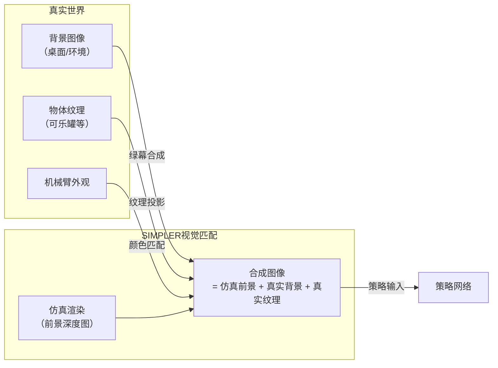
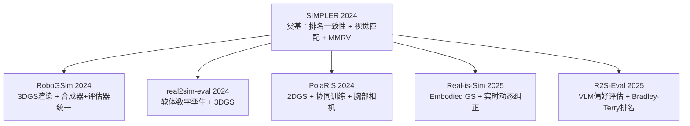

# SIMPLER：用仿真评估真实机器人操作策略 深度精读

> **论文标题**: Evaluating Real-World Robot Manipulation Policies in Simulation
> **作者**: Xuanlin Li, Kyle Hsu, Jiayuan Gu, Karl Pertsch, Oier Mees, Homer Rich Walke, Chuyuan Fu, Ishikaa Lunawat, Isabel Sieh, Sean Kirmani, Sergey Levine, Jiajun Wu, Chelsea Finn, Hao Su, Quan Vuong, Ted Xiao
> **机构**: UC San Diego、Stanford University、UC Berkeley、Google DeepMind
> **发表**: CoRL 2024（arXiv:2405.05941）
> **代码**: https://github.com/simpler-env/SimplerEnv
> **引用量**: ~598（Google Scholar，2026年9月）

**标签**: `#Real2Sim` `#策略评估` `#视觉匹配` `#系统辨识` `#仿真` `#机器人操作` `#域随机化` `#MMRV`

**知识链接**：
- [RoboGSim：Real2Sim2Real 高斯泼溅仿真器](./150_RoboGSim_Real2Sim2Real高斯泼溅仿真器) — 同方向的 3DGS 路线，引用 SIMPLER 作为基准
- [real2sim-eval：高斯泼溅软体仿真评估](./151_real2sim_eval_高斯泼溅软体仿真评估) — 在 SIMPLER 基础上扩展了软体物体
- [PolaRiS：可扩展的真实到仿真评估](./152_PolaRiS_可扩展的真实到仿真评估) — 改进了 SIMPLER 的绿幕方案，支持动态相机
- [SimOpt：闭环仿真参数自适应](./130_SimOpt_闭环仿真参数自适应) — 从贝叶斯角度校准仿真参数分布

---

## 贯穿全文的例子

> **场景**：一个 Google Robot 要学会从桌面上拿起一罐可乐（Pick Coke Can）。你训练了五个不同的 VLA 策略，想知道哪个最好。传统方式是让机器人在真实桌面上跑 500 次，耗时两周、需要人全程监督。SIMPLER 的目标是：在仿真里跑这 500 次，5 分钟搞定，且仿真里的策略排名和真实排名一致。关键不是"仿真分数 = 真实分数"，而是"仿真里 A > B > C，真实里也是 A > B > C"——只要排名对，你就知道该部署哪个策略。

---

## 一、问题：为什么策略评估是瓶颈

### 1.1 真实评估的成本

2024 年机器人策略评估面临一个尴尬的现实：训练一个 VLA 需要数百 GPU 小时，但评估它需要真实机器人在真实场景中跑数百次试验。而且：

- 每次试验需要人工重置场景（把可乐罐放回原位、清理桌面）
- 需要专人盯着判断"成功"还是"失败"
- 真实环境不可重复——光线、物体初始位置、机器人状态都有微小变化
- 部署到不同实验室的同类机器人，需要从头评估

结果是：一篇论文往往只评估 2–3 个策略，每个策略跑 50–100 次，已经是实验室的极限。这严重制约了快速迭代和可靠的消融实验。

### 1.2 直接用仿真评估有什么问题

直觉上的解法是：把策略搬到仿真里评估。但这立刻引出两个差距：

**控制差距（Control Gap）**：同一个动作指令，在真实机器人和仿真机器人上产生不同的轨迹。仿真的 PD 控制器参数和真实硬件不对齐，导致仿真里"能抓到"的动作在真实机械臂上根本到不了那个位置。

**视觉差距（Visual Gap）**：仿真的渲染和真实图像差异显著。用真实数据训出来的视觉策略，看到仿真渲染图像时可能完全失效——这不是策略本身能力的差距，而是域差导致的假失败。

这两个差距共同导致一个结论：**直接在原始仿真里跑真实策略，得到的分数毫无意义。**

### 1.3 SIMPLER 的核心主张

论文的核心命题是：

> 评估目标不是"仿真分数等于真实分数"，而是"仿真里的策略排名和真实里的策略排名一致"。

这是一个更弱、更可实现的目标。只要相关性足够强，仿真就可以作为可靠的代理评估器，用于筛选策略、做消融实验、验证设计决策。

---

## 二、方法：控制差距和视觉差距的双重弥合

### 2.1 控制差距：系统辨识

目标是找到一组仿真 PD 控制参数 $\phi^*$，使得给定相同动作序列时，仿真末端执行器轨迹与真实机械臂轨迹之间的差距最小。

$$
\phi^* = \arg\min_\phi \sum_{\tau \in \mathcal{D}_{\text{real}}} \mathcal{L}_{\text{traj}}(\tau_{\text{sim}}(\phi),\; \tau_{\text{real}})
$$

**这个公式在做什么**：在真实轨迹数据集 $\mathcal{D}_{\text{real}}$ 上搜索最优控制参数 $\phi^*$，使仿真轨迹和真实轨迹之间的轨迹损失最小。

::: details 📐 公式详解

| 子表达式 | 它是谁 | 它在干嘛 |
|---------|--------|---------|
| $\phi$ | **仿真控制参数** | 包括各关节的 PD 增益（$K_p, K_d$）和摩擦系数等；这是要优化的变量 |
| $\mathcal{D}_{\text{real}}$ | **真实轨迹数据集** | 在真实机器人上采集的一组动作-状态轨迹，用作校准参考 |
| $\tau_{\text{sim}}(\phi)$ | **仿真轨迹** | 给定参数 $\phi$ 时，用同样的动作序列在仿真中产生的末端执行器轨迹 |
| $\tau_{\text{real}}$ | **真实轨迹** | 同样动作序列在真实机器人上的实际末端执行器路径 |
| $\mathcal{L}_{\text{traj}}$ | **轨迹损失** | 同时考虑平移误差和旋转误差；论文用平移距离加旋转角度的加权和 |

**为什么不能用梯度下降**：$\tau_{\text{sim}}(\phi)$ 是一个仿真过程，不可微，所以论文用**模拟退火**（simulated annealing）做黑盒搜索，迭代三轮，每轮逐步缩小搜索范围。

**物理直觉**：如果仿真的 $K_p$ 比真实偏大，末端执行器会"超调"——动作指令说往右 2 cm，仿真里跑了 2.5 cm，而真实机器人只跑了 2 cm。这类系统性偏差会让所有策略在仿真里都表现失真。系统辨识就是把这个偏差校回去。
:::

实践上，论文收集了约 500 条真实遥操作轨迹，在每条轨迹的末端执行器位置序列上计算损失，模拟退火三轮得到最终参数。

### 2.2 视觉差距：视觉匹配

这是论文最有创意的部分。核心思路不是让仿真渲染变得"逼真"（那需要 NeRF 或 3DGS，代价很高），而是把**真实场景的背景图像直接贴进仿真**，让策略看到的视觉输入尽量接近真实。

具体分三步：

**第一步：绿幕合成（背景替换）**：在仿真渲染图中，把机械臂和物体以外的背景区域替换成真实场景的背景图像（桌面、墙壁等）。技术上是把仿真中的前景（机械臂 + 物体）用深度图分割出来，叠加到真实背景上。

**第二步：纹理投影（前景匹配）**：把真实物体（如可乐罐、抽屉）的纹理拍照后投影到仿真网格上。这样仿真里的可乐罐和真实可乐罐有相同的外观。

**第三步：机械臂外观匹配**：手动调整仿真中机械臂的颜色/纹理，和真实硬件保持一致。

**为什么不用"变体聚合"（Variant Aggregation）**：一个自然的替代方案是随机化仿真的视觉参数（光照、纹理、颜色），跑很多变体取平均分。论文的消融实验直接否定了这个方案——视觉匹配的 Pearson r = 0.924，变体聚合只有 r = 0.778。

原因是：随机化让策略面对"没见过的随机视觉"，而真实评估对应一个特定的视觉分布。不对准这个特定分布，用随机化结果的均值来估计，会引入系统性偏差。

### 2.3 新评估指标：MMRV

Pearson 相关系数是衡量仿真-真实一致性的常用指标，但它有一个问题：一次排序严重错误（性能相近的两个策略排反）和一次大排序错误（相差 30% 的策略排反）在 Pearson 里的惩罚是不对等的。

论文提出 **MMRV（Mean Maximum Rank Violation）**：

$$
\text{MMRV} = \frac{1}{|\Pi|}\sum_{\pi_i \in \Pi} \max_{\pi_j : \hat{r}_i > \hat{r}_j,\; r_i < r_j} |r_i - r_j|
$$

**这个公式在做什么**：对每个策略 $\pi_i$，找出它被仿真排在其前面、但真实排名在其后面的所有策略中，真实性能差距最大的那一个。这个最大差距就是该策略的"最大排序违规"。MMRV 是所有策略最大排序违规的均值。

::: details 📐 公式详解

| 子表达式 | 它是谁 | 它在干嘛 |
|---------|--------|---------|
| $\Pi$ | **策略集合** | 被评估的所有策略 |
| $\hat{r}_i > \hat{r}_j$ | **仿真排名中 $i$ 优于 $j$** | 仿真认为策略 $i$ 比 $j$ 好（但这是错误的） |
| $r_i < r_j$ | **真实排名中 $i$ 劣于 $j$** | 真实情况是 $j$ 比 $i$ 好 |
| $|r_i - r_j|$ | **真实性能差距** | 这次排序错误的严重程度，用真实成功率之差衡量 |
| $\max(\cdot)$ | **最严重的一次错误** | 只取最坏的那次，反映"一旦出错会错多严重" |

**直觉**：MMRV 低说明即使有排序错误，错误也都是"差不多的策略排错了顺序"（影响不大）；MMRV 高说明有"明显差的策略被排到了明显好的策略前面"——这种错误会让你做出糟糕的策略选择。

**为什么不只用 Pearson r**：Pearson 对"很多小错误"的惩罚和"一次大错误"的惩罚不同，但对实际决策而言，一次把差策略排到好策略前面的大错误后果更严重。MMRV 专门捕捉这类错误。
:::

---

## 三、实验结果

### 3.1 核心性能：和真实评估的相关性

在 Google Robot 平台（Google Robot Arm + Scara）上，三个任务（Pick Coke Can、Move Near、Drawer Open/Close），评估多种 VLA 策略。

| 方法 | Pearson r ↑ | MMRV ↓ |
|------|------------|--------|
| 验证集 MSE | 0.308 | 0.375 |
| 变体聚合 | 0.778 | 0.143 |
| **SIMPLER（ours）** | **0.924** | **0.056** |

验证集 MSE（用训练损失估计性能）的相关性极低，说明"损失低的策略不一定部署效果好"——这是 BC 的已知问题。SIMPLER 把相关性从 0.308 提升到 0.924，MMRV 从 0.375 降到 0.056，是量级上的改进。

### 3.2 分布偏移的预测能力

仿真不只能预测"正常条件下的性能"，还能预测策略对各类扰动的敏感程度。论文测试了五类分布偏移：

- **背景变化**：换桌面颜色/纹理
- **光照变化**：更强/更弱的顶灯
- **干扰物**：桌面上加入额外物品
- **桌面纹理**：不同材质的桌布
- **相机位姿**：轻微移动相机位置

关键发现：SIMPLER 不仅能准确预测各类偏移下的相对性能，还能预测**真实场景中未测试过的新偏移组合**的行为。例如，改变机械臂颜色（仿真里可以一秒钟做到，真实里没有测）的预测，和少数几次真实验证结果高度吻合。

### 3.3 消融实验关键结论

**视觉匹配必须整体应用**：单独只替换背景（不换纹理）或只换纹理（不换背景），效果均不如全部一起换。视觉差距是系统性的，局部修补不够。

**系统辨识参数的敏感性**：把优化后的 PD 参数故意扰动 ±20%，MMRV 从 0.031 升至 0.070–0.100。说明精确的控制参数对评估质量至关重要——粗略的"差不多"不够用。

**物理参数的鲁棒性**：相比之下，在合理范围内调整物理参数（质量 ±30%、摩擦系数 ±50%），策略性能变化通常 ≤15%，说明物理差距不是主要瓶颈。

**仿真引擎无关性**：把 SAPIEN 换成 Isaac Sim，重新做系统辨识后，核心结论完全可复现。SIMPLER 的方法论不依赖特定物理引擎。

---

## 四、局限性

**绿幕依赖固定相机**：背景替换假设相机固定，不支持腕部相机（wrist camera）等动态视角。PolaRiS 后来解决了这个问题。

**只覆盖刚体**：软体、形变物体（布料、绳索、柔性物体）的仿真-真实差距远超刚体，SIMPLER 没有处理这类情况。real2sim-eval 后来专门解决了软体问题。

**环境构建仍有手工成本**：铰接物体（如抽屉、柜门）需要手工建模，不能从真实图像自动重建。SimFoundry 等后续工作试图解决这个问题。

**部分手工工作**：纹理投影和颜色匹配目前需要人工操作，限制了大规模部署。

---

## 五、定位与影响

SIMPLER 是这个方向目前引用量最高的工作（~598 次），是 Real2Sim 策略评估的奠基论文。它确立了几个关键共识：

1. **"排名一致性"而非"分数一致性"**是正确的评估目标，显著降低了对仿真保真度的要求
2. **系统辨识 + 视觉匹配**是弥合两大差距的有效组合，后续工作大多沿用这个框架
3. **MMRV 指标**成为该方向的标准评估指标，被 PolaRiS、R2S-Eval 等后续工作直接采用
4. **开源工具链**（SimplerEnv）成为社区基准，方便其他工作在同一平台对比

---

## 延伸阅读

- **150_RoboGSim** — 把 3DGS 和物理仿真结合做 Real2Sim2Real，合成数据和评估统一在一个框架
- **151_real2sim_eval** — 在 SIMPLER 框架上添加软体物理，处理布料、绳索等形变物体
- **152_PolaRiS** — 用 2DGS + 协同训练解决 SIMPLER 的固定相机局限
- **130_SimOpt** — 用贝叶斯推断自动校准仿真参数分布，是系统辨识的早期经典工作
