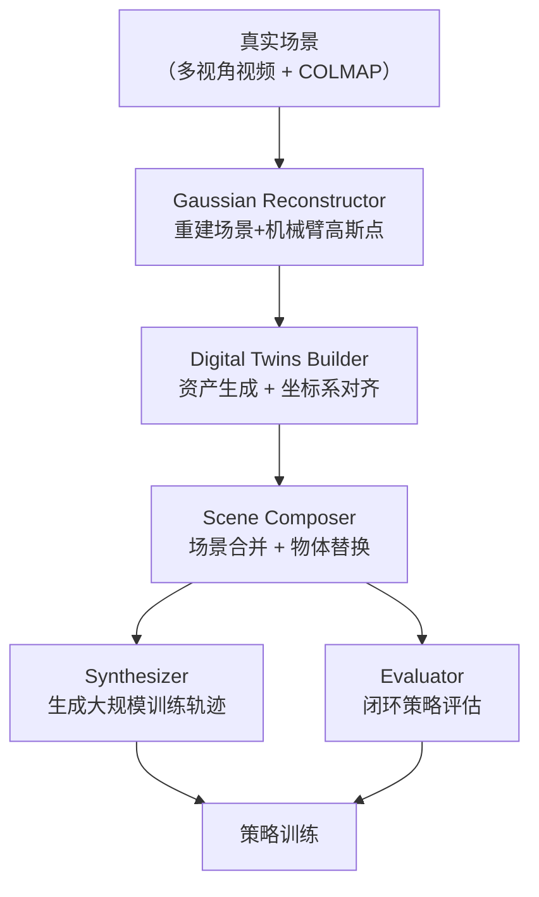

# RoboGSim：Real2Sim2Real 高斯泼溅机器人仿真器 深度精读

> **论文标题**: RoboGSim: A Real2Sim2Real Robotic Gaussian Splatting Simulator
> **作者**: Xinhai Li, Jialin Li, Ziheng Zhang, Rui Zhang, Fan Jia, Tiancai Wang, Haoqiang Fan, Kuo-Kun Tseng, Ruiping Wang
> **机构**: 哈尔滨工业大学（深圳）、中科院计算所、MEGVII Technology、浙江大学
> **发表**: arXiv:2411.11839（2024年11月）
> **项目页**: https://robogsim.github.io
> **引用量**: ~76（Google Scholar，2026年9月）

**标签**: `#Real2Sim` `#3DGS` `#数据合成` `#数字孪生` `#闭环评估` `#机器人操作` `#MEGVII`

**知识链接**：
- [SIMPLER：仿真评估真实机器人操作策略](./149_SIMPLER_仿真评估真实机器人操作策略) — 同方向奠基工作，RoboGSim 的评估器模块与之对标
- [real2sim-eval：高斯泼溅软体仿真评估](./151_real2sim_eval_高斯泼溅软体仿真评估) — 同期 3DGS 路线，专注软体物体
- [PolaRiS：可扩展的真实到仿真评估](./152_PolaRiS_可扩展的真实到仿真评估) — 后续工作，2DGS + 协同训练
- [SimFoundry：单视频重建可交互仿真场景](./132_SimFoundry_单视频重建可交互仿真场景) — 类似的单视频重建路线，NVIDIA 出品

---

## 贯穿全文的例子

> **场景**：一台机械臂要学会把环形套圈套进立柱（ring-on-rod 任务）。人工采集真实数据需要 40 小时的遥操作——摄像机架好、操作员上手、一条条录。RoboGSim 的目标是：扫描真实场景一次，在高斯重建的仿真里自动生成海量训练数据，把采集时间从 40 小时压缩到 4 小时，同时在同一套系统里直接做闭环策略评估。"合成器"和"评估器"共用一个仿真平台，不需要在两个系统之间来回倒腾数据。

---

## 一、问题：数据采集和评估是两个独立的瓶颈

### 1.1 为什么数据采集难规模化

具身智能的学习范式是：大量示教数据 → BC 预训练 → （可选）RL 微调。数据量直接决定策略泛化能力，但真实机器人数据采集有三道墙：

**时间墙**：一条高质量遥操作轨迹需要 1–3 分钟，含重置场景。1000 条数据 ≈ 30–50 小时人工操作，还不算失误重录。

**场景墙**：要泛化到新物体、新背景、新灯光，就要在每种设置下重新采集。在 10 种场景变体下各采 200 条 = 2000 条真实数据，代价翻倍。

**安全墙**：大量重复操作会磨损设备，且调试过程中的撞击、碰撞都发生在真实硬件上。

### 1.2 为什么现有仿真数据质量不够

既有解决方案是"在仿真里采数据"。问题在于：

- 传统仿真（MuJoCo、Isaac Sim）渲染风格化，和真实图像差距大
- 物体网格手工建模，不能快速复制真实物体外观
- 仿真里的策略直接拿去真实机器人，成功率通常大幅下降

NeRF/3DGS 出现后，视觉保真度问题有了解法。但已有工作要么只做"重建+渲染"（静态场景），要么只做"物理仿真"（无高保真渲染），没有把两者真正整合进一个机器人可以闭环操作的系统。

### 1.3 RoboGSim 的核心主张

> 把高斯重建（负责视觉）和物理仿真（负责碰撞/力学）绑定在同一个框架里，让机械臂在高斯场中"看见"并"操作"物体，合成器和评估器共享这个平台。

---

## 二、系统设计：四个模块

### 2.1 Gaussian Reconstructor：动态机械臂的高斯建模

静态场景用标准 3DGS 重建即可。难点是**机械臂是运动的**——直接重建会把多帧里不同位姿的机械臂混在一起，产生模糊的高斯点。

RoboGSim 的解法分两步：

**关节点云分割**：从多帧视频里用分割算法把每个关节的点云独立提取出来。

**MDH 运动学驱动**：建立改进 D-H（Modified Denavit-Hartenberg）参数模型，把每个关节的高斯点绑定到对应的运动学链节上。给定关节角 $\theta$，每个关节的变换矩阵 $T_i(\theta_i)$ 由 MDH 参数决定：

$$
T_i(\theta_i) = \begin{bmatrix} R_i(\theta_i) & p_i(\theta_i) \\ 0 & 1 \end{bmatrix}
$$

**这个公式在做什么**：描述第 $i$ 个关节坐标系相对于第 $i-1$ 个关节坐标系的齐次变换——旋转部分 $R_i$ 和平移部分 $p_i$ 都是关节角 $\theta_i$ 的函数。

::: details 📐 公式详解

| 子表达式 | 它是谁 | 它在干嘛 |
|---------|--------|---------|
| $R_i(\theta_i)$ | **旋转矩阵** | 描述关节 $i$ 绕其旋转轴转过角度 $\theta_i$ 后的姿态；对旋转关节，$\theta_i$ 是变量，其他 MDH 参数固定 |
| $p_i(\theta_i)$ | **平移向量** | 描述关节 $i$ 原点相对于关节 $i-1$ 原点的位置；由 MDH 的连杆长度和偏移量决定 |
| $T_i$ | **齐次变换矩阵** | 把关节 $i$ 坐标系下的点变换到关节 $i-1$ 坐标系；链式相乘 $T_1 T_2 \cdots T_n$ 得到末端执行器的全局位姿 |

**为什么用 MDH 而不是直接存每帧位姿**：MDH 参数是紧凑的物理描述（4 个参数/关节），一旦标定完成，任意关节角配置下的每个链节位姿都能精确计算，而不需要为每个姿态单独拍一套照片重建。这让机械臂的高斯点可以像骨骼蒙皮一样随关节角实时更新。
:::

关节 $i$ 的每个高斯基元（均值 $\mu$，协方差 $\Sigma$）随关节运动更新为：

$$
\mu' = R_i \mu + p_i, \quad \Sigma' = R_i \Sigma R_i^\top
$$

**这个公式在做什么**：把高斯基元从关节局部坐标系变换到世界坐标系——均值做刚体变换，协方差（描述高斯椭球的形状和朝向）做旋转变换。

::: details 📐 公式详解

| 子表达式 | 它是谁 | 它在干嘛 |
|---------|--------|---------|
| $\mu' = R_i \mu + p_i$ | **均值的刚体变换** | 高斯基元的中心点在世界坐标系中的新位置；$R_i$ 旋转，$p_i$ 平移 |
| $\Sigma' = R_i \Sigma R_i^\top$ | **协方差的旋转变换** | 高斯椭球的形状和朝向跟着关节旋转；注意只有旋转，没有缩放或剪切——高斯形状保持不变，只是朝向变了 |

**为什么协方差用 $R \Sigma R^\top$ 而不是 $R \Sigma$**：协方差矩阵描述的是一个椭球的形状，它是一个二阶张量，在坐标系变换下应满足 $\Sigma' = R \Sigma R^\top$（二次型变换）。直接左乘 $R$ 会破坏协方差矩阵的对称正定性，导致渲染出错。
:::

### 2.2 Digital Twins Builder：三空间坐标系对齐

要让机械臂在高斯场中操作物体，必须打通三个坐标系：**真实世界**（相机坐标系）、**物理仿真**（Isaac Sim 坐标系）、**高斯场**（3DGS 坐标系）。

**资产生成**：
- 真实物体：多视角拍照 + COLMAP 重建 + 转为 3DGS
- 无真实样品的物体：用 Wonder3D（单图转多视角生成网格）转为几何一致 3DGS

**布局对齐（Real2Sim）**：在 Isaac Sim 里按俯视图、正视图、侧视图三个角度截图，与真实场景分割图比对，调整仿真中各物体的位置和朝向，直到三视图投影对齐。

**Sim2GS 关键点对齐**：建立稀疏关键点集（机械臂各关节中心），在 Isaac Sim 中读取这些点的位姿，用加权平均变换矩阵把 Isaac Sim 的位姿投影到 3DGS 坐标系：

$$
T_{\text{sim} \to \text{gs}} = \left(\sum_k w_k\right)^{-1} \sum_k w_k T_k
$$

**这个公式在做什么**：通过多个关键点的对应关系，加权估计从 Isaac Sim 坐标系到 3DGS 坐标系的变换矩阵。

::: details 📐 公式详解

| 子表达式 | 它是谁 | 它在干嘛 |
|---------|--------|---------|
| $T_k$ | **第 $k$ 个关键点对对应的变换估计** | 用第 $k$ 对关键点的对应关系（Isaac Sim 位置 vs 3DGS 位置）单独估计一个变换矩阵 |
| $w_k$ | **权重** | 通常用关键点匹配置信度或距离的倒数；匹配更可靠的点对贡献更大 |
| $\sum_k w_k T_k / \sum_k w_k$ | **加权平均** | 把多个点对给出的变换估计融合成一个稳定的全局变换 |

**为什么需要多个关键点**：单个点对只能约束平移，两个点对才能约束旋转，多个点对可以做最小二乘拟合，降低单个匹配误差的影响。
:::

### 2.3 Scene Composer：场景合成

有了数字孪生，就可以合成新场景变体：新物体、新背景、新视角。

核心操作是把一个物体的高斯基元集 $\mathcal{G}_{\text{obj}}$ 插入到场景高斯场 $\mathcal{G}_{\text{scene}}$ 中，并按目标位姿 $(R_{\text{target}}, p_{\text{target}})$ 变换：

$$
\mathcal{G}_{\text{new}} = \mathcal{G}_{\text{scene}} \cup \{(\mu', \Sigma', c) : (\mu, \Sigma, c) \in \mathcal{G}_{\text{obj}}\}
$$

其中 $\mu' = R_{\text{target}}\mu + p_{\text{target}}$，$\Sigma' = R_{\text{target}}\Sigma R_{\text{target}}^\top$。

**这个公式在做什么**：把目标物体的每个高斯基元按目标位姿变换后，并入场景高斯集合，形成新的合成场景。颜色/不透明度 $c$ 不变，只改变几何位置和朝向。

### 2.4 Interactive Engine：合成器 + 评估器

同一个框架承担两个角色：

**作为合成器**：Isaac Sim 生成轨迹（关节角序列），驱动 3DGS 渲染每一帧；新视角（如腕部相机视角）只需重新设置虚拟相机，无需重采集数据。合成数据集包含真实机械臂轨迹 + 高斯渲染图像，可直接用于 BC 训练。

**作为评估器**：策略网络输入 3DGS 渲染的图像，输出关节角动作；Isaac Sim 接收动作、更新物理状态（碰撞检测、物体位置）；3DGS 用新状态重新渲染下一帧。这个闭环让策略在视觉逼真的仿真中做真实的操作决策，而不需要真实机器人参与。

---

## 三、实验结果

### 3.1 重建质量

在新姿态视角合成任务上：

| 指标 | RoboGSim |
|------|---------|
| PSNR | 31.3 dB |
| SSIM | 0.79 |
| 渲染帧率 | 10 FPS |
| 像素偏差 | 7.37 px |

PSNR 31.3 dB 在机器人场景的神经渲染中属于较好水平，说明重建质量足以支撑策略训练的视觉输入。

### 3.2 数据合成效率

在环形套圈（ring-on-rod）任务上，对比真实数据和合成数据：

| 项目 | 真实数据 | 合成数据 |
|------|---------|---------|
| 采集时间 | 40 小时 | **4 小时** |
| 抓取成功率 | 90% | 40% |
| 放置成功率 | 70% | 50% |

合成数据训练的策略成功率约为真实数据的 50–60%，存在明显差距。论文认为主要原因是渲染细节（光照反射、接触边缘）与真实仍有差异，扩大合成数据规模可进一步弥合。

### 3.3 评估器验证

闭环仿真评估结果与在真实机器人上的推理结果高度吻合：仿真里成功的策略，在真机上也成功；仿真里失败的策略（如动作太激进导致碰撞），在真机上也失败。且仿真评估完全避免了真实硬件上的碰撞风险。

---

## 四、局限性

**仅支持刚体**：高斯泼溅假设物体是刚体，软体（布料、绳索）的形变无法用刚体变换正确建模。real2sim-eval 后续专门处理软体。

**光照统一性不足**：高斯场捕获的是某种特定光照下的外观，换光照后渲染质量下降。论文提到了针对弱纹理、低光照、反光表面的专项优化，但未完全解决。

**几何一致网格生成**：用 Wonder3D 从单图生成的网格，几何精度有限，影响基于网格的物理仿真（碰撞形状不准）。

**渲染速度**：10 FPS 在闭环评估场景下尚可，但对于需要实时控制（≥30 Hz）的任务还不够快。

---

## 五、定位

RoboGSim 是国内团队（MEGVII 主导）在 Real2Sim2Real 方向的代表性工作。它的最大特点是**把合成器和评估器统一**在一个框架内——大多数同类工作要么做合成数据，要么做仿真评估，两者兼顾的并不多。引用量约 76，在同期同类工作中表现较好。

和 SIMPLER 对比：SIMPLER 专注于真实策略的仿真评估，视觉保真度用绿幕方案实现；RoboGSim 用 3DGS 实现更高的视觉保真度，同时覆盖了数据合成这个 SIMPLER 没有涉及的方向。

---

## 延伸阅读

- **149_SIMPLER** — 视觉匹配 + 系统辨识的评估框架，奠基工作
- **151_real2sim_eval** — 同期 3DGS 路线，专注软体形变物体
- **132_SimFoundry** — NVIDIA 的类似工作：单段视频重建可交互场景，支持更多物理交互类型
