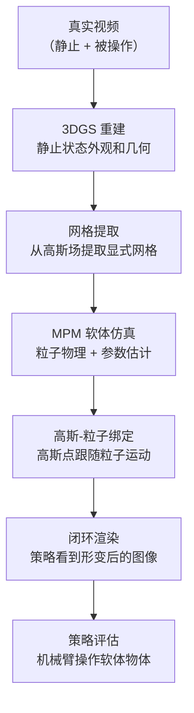

# real2sim-eval：高斯泼溅软体交互仿真评估 深度精读

> **论文标题**: Real-to-Sim Robot Policy Evaluation with Gaussian Splatting Simulation of Soft-Body Interactions
> **作者**: Kaifeng Zhang ★, Shuo Sha ★, Hanxiao Jiang, Matthew Loper, Hyunjong Song, Guangyan Cai, Zhuo Xu, Xiaochen Hu, Changxi Zheng, Yunzhu Li
> **机构**: 哥伦比亚大学、SceniX Inc.、Google DeepMind（★ 并列第一作者）
> **发表**: arXiv:2511.04665（2024年11月）
> **项目页**: https://real2sim-eval.github.io
> **代码**: https://github.com/kywind/real2sim-eval
> **引用量**: ~32（Google Scholar，2026年9月）

**标签**: `#Real2Sim` `#3DGS` `#软体仿真` `#数字孪生` `#策略评估` `#机器人操作` `#Columbia`

**知识链接**：
- [SIMPLER：仿真评估真实机器人操作策略](./149_SIMPLER_仿真评估真实机器人操作策略) — 奠基工作，real2sim-eval 在软体方向对其扩展
- [RoboGSim：Real2Sim2Real 高斯泼溅仿真器](./150_RoboGSim_Real2Sim2Real高斯泼溅仿真器) — 同期 3DGS 路线，专注刚体数据合成
- [PolaRiS：可扩展的真实到仿真评估](./152_PolaRiS_可扩展的真实到仿真评估) — 后续工作，2DGS + 协同训练
- [R2S-Eval：VLM 偏好评估](./153_R2S_Eval_VLM偏好评估) — Kaifeng Zhang 的后续工作，机构换到清华

---

## 贯穿全文的例子

> **场景**：一台机械臂要把一个毛绒玩具（plush toy）装进袋子。这个任务在 SIMPLER 这类只处理刚体的框架里根本做不了——毛绒玩具会形变，它被抓起来的形状、放进袋子时的形状和桌面上静止的形状完全不同。real2sim-eval 的目标是：从真实视频里重建毛绒玩具的软体数字孪生，在仿真里准确模拟它被操作时的形变，然后在这个软体仿真里评估策略，使评估结果和真实机器人上的结果一致。

---

## 一、问题：软体物体是 Real2Sim 的盲区

### 1.1 刚体假设的极限

SIMPLER 等已有工作把 Real2Sim 策略评估推进到了刚体操作任务上，并取得了很强的真实-仿真相关性。但真实家庭和工业环境中有大量软体物体：

- **布料类**：衣物折叠、桌布铺展
- **绳缆类**：线缆整理、绳结操作
- **填充物类**：毛绒玩具、枕头、海绵块
- **食品类**：面团、果冻、软质食品

这些物体在操作过程中会持续形变，不能用刚体变换建模。把软体任务硬塞进刚体仿真，仿真里物体直接穿透或静止不动——和真实情况的差距根本无法弥合，评估结果毫无参考价值。

### 1.2 软体仿真的技术难点

软体物体的 Real2Sim 面临三个独立难题：

**形状重建**：从 RGB 视频里重建软体物体的三维几何，而软体物体没有固定形状——静止、被抓、被压时形状各不相同。标准的多视角重建假设静态物体，直接失效。

**物理参数估计**：弹性模量、泊松比、阻尼系数等材料参数无法直接测量，而这些参数决定了物体被操作时的形变行为。参数估计错了，仿真里的形变和真实完全不同。

**渲染-物理耦合**：软体物体的视觉外观（毛绒玩具的绒毛、布料的褶皱）与几何形变紧密耦合，形变了外观也要跟着变，不能简单地把纹理贴到网格上。

### 1.3 real2sim-eval 的核心主张

> 用 3D Gaussian Splatting 解决视觉重建，用基于粒子的软体仿真（MPM）解决物理建模，把两者通过显式几何耦合在一起——高斯点绑定到仿真粒子上，粒子运动直接驱动高斯渲染。

---

## 二、方法：高斯-粒子耦合的软体数字孪生

### 2.1 静止状态重建：3DGS

首先对物体在静止状态下进行标准 3DGS 重建，得到高斯基元集合 $\mathcal{G} = \{(\mu_i, \Sigma_i, c_i, \alpha_i)\}$，其中 $\mu_i$ 是均值（三维位置），$\Sigma_i$ 是协方差（形状/朝向），$c_i$ 是颜色，$\alpha_i$ 是不透明度。

这一步和标准 3DGS 完全相同，利用多视角视频用光度损失优化高斯参数。关键在于：3DGS 得到的是一个**连续的隐式表示**，直接支持任意视角渲染，但不包含物理信息。

### 2.2 网格提取：从高斯场到显式几何

软体仿真需要显式的网格（顶点 + 面），而 3DGS 给的是一堆高斯点。论文用以下流程提取网格：

1. 把高斯场体素化（每个体素存储高斯密度的累积不透明度）
2. 用 Marching Cubes 算法在密度等值面上提取三角网格
3. 用 Laplacian 平滑去除噪声三角形

提取出的网格作为软体仿真的初始几何，同时作为高斯点与仿真粒子之间的桥梁。

### 2.3 软体物理：MPM 材料点法

论文用**物质点法（Material Point Method，MPM）**模拟软体形变。MPM 是一种混合欧拉-拉格朗日方法：

- **粒子（拉格朗日）**：携带质量、速度、形变梯度等物理状态，随物体运动
- **网格（欧拉）**：作为临时的计算载体，用于力的积分和碰撞检测
- **粒子↔网格传输**：每步用样条插值把粒子状态投影到网格，计算完再投影回粒子

形变梯度 $\mathbf{F}$ 描述了物体从参考构型到当前构型的局部变形：

$$
\mathbf{F} = \frac{\partial \mathbf{x}}{\partial \mathbf{X}}
$$

**这个公式在做什么**：定义形变梯度——描述参考构型中的无穷小体元在当前构型中如何被拉伸、压缩、剪切。

::: details 📐 公式详解

| 子表达式 | 它是谁 | 它在干嘛 |
|---------|--------|---------|
| $\mathbf{X}$ | **参考构型坐标** | 物体未形变时（初始状态）的材料点位置，是固定的标签 |
| $\mathbf{x}$ | **当前构型坐标** | 该材料点在当前时刻的实际位置，随仿真变化 |
| $\partial \mathbf{x} / \partial \mathbf{X}$ | **形变梯度** | 3×3 矩阵，描述参考构型中一个无穷小体元在当前构型中的线性近似变形 |

**直觉**：$\mathbf{F} = \mathbf{I}$（单位矩阵）代表无形变；$\det(\mathbf{F}) > 1$ 代表体积膨胀；$\det(\mathbf{F}) < 1$ 代表体积压缩；非对称的 $\mathbf{F}$ 代表有剪切。

**为什么 MPM 需要跟踪 $\mathbf{F}$**：弹性势能（决定恢复力）依赖形变梯度。对于超弹性材料（如毛绒玩具的填充物），应力张量 $\mathbf{P} = \partial \Psi / \partial \mathbf{F}$（$\Psi$ 是弹性势能密度），需要实时计算 $\mathbf{F}$ 才能算出恢复力。
:::

弹性势能用 **Neo-Hookean 模型**：

$$
\Psi(\mathbf{F}) = \frac{\mu}{2}(\text{tr}(\mathbf{F}^\top \mathbf{F}) - 3) - \mu \ln J + \frac{\lambda}{2}(\ln J)^2
$$

**这个公式在做什么**：定义材料的弹性势能密度——这是从形变梯度 $\mathbf{F}$ 到"存储了多少弹性能量"的映射，决定了物体被压缩/拉伸时产生多大的恢复力。

::: details 📐 公式详解

| 子表达式 | 它是谁 | 它在干嘛 |
|---------|--------|---------|
| $\mu$ | **剪切模量** | 材料抵抗剪切形变的能力；越大越"硬"、越难被剪切 |
| $\lambda$ | **拉梅第一参数** | 控制体积变化的惩罚；越大材料越不可压缩 |
| $\text{tr}(\mathbf{F}^\top \mathbf{F})$ | **形变的 Frobenius 范数平方** | 衡量总形变量，包括拉伸和压缩 |
| $J = \det(\mathbf{F})$ | **体积比** | $J > 1$ 表示体积膨胀，$J < 1$ 表示压缩 |
| $\frac{\mu}{2}(\text{tr}(\cdot) - 3)$ | **偏斜形变惩罚** | 惩罚形状改变（剪切、拉伸），$\mathbf{F}=\mathbf{I}$ 时为零 |
| $-\mu \ln J + \frac{\lambda}{2}(\ln J)^2$ | **体积变化惩罚** | 两项合力：体积变化越大惩罚越大，$J=1$（无体积变化）时为零 |

**设计意图**：Neo-Hookean 是最简单的能正确处理"大形变"的超弹性模型。相比线性弹性（只对小形变准确），它在物体被大幅压缩或拉伸时仍能给出物理合理的恢复力，适合毛绒玩具、软泡沫等大形变场景。

**参数的物理意义**：$\mu$ 和 $\lambda$ 是用户需要估计的材料参数。$\mu$ 对应杨氏模量和泊松比的组合：$\mu = E / (2(1+\nu))$，$\lambda = E\nu / ((1+\nu)(1-2\nu))$。论文用差分进化算法从真实形变视频中估计这两个参数。
:::

### 2.4 物理参数估计

$\mu$ 和 $\lambda$ 无法直接测量，需要从真实形变视频中反演。论文的方案是：

1. 在真实场景中用手指轻推物体，录制 RGB 视频（约 30 帧）
2. 用光流估计物体表面的运动场
3. 用 MPM 仿真同样的推操作，生成仿真表面运动场
4. 最小化真实和仿真运动场之间的差距，用差分进化（Differential Evolution）搜索最优 $(\mu, \lambda)$：

$$
(\mu^*, \lambda^*) = \arg\min_{\mu, \lambda} \sum_t \|\mathbf{v}_t^{\text{real}} - \mathbf{v}_t^{\text{sim}}(\mu, \lambda)\|^2
$$

**这个公式在做什么**：在时间序列上，最小化真实光流 $\mathbf{v}_t^{\text{real}}$ 和仿真运动场 $\mathbf{v}_t^{\text{sim}}$ 之间的均方差，从而反演材料参数。

::: details 📐 公式详解

| 子表达式 | 它是谁 | 它在干嘛 |
|---------|--------|---------|
| $\mathbf{v}_t^{\text{real}}$ | **真实光流** | 第 $t$ 帧到第 $t+1$ 帧之间，图像平面上物体表面各点的像素位移向量场 |
| $\mathbf{v}_t^{\text{sim}}(\mu, \lambda)$ | **仿真投影运动场** | 给定 $(\mu, \lambda)$ 时，MPM 仿真产生的粒子运动投影到图像平面上的运动向量场 |
| $\sum_t \|\cdot\|^2$ | **时序累积误差** | 对所有帧求和，把短视频中的完整形变过程都用上，而不是只靠一帧 |

**为什么用差分进化而不是梯度下降**：MPM 仿真对 $\mu, \lambda$ 不可微（接触事件等离散性），无法用反向传播求梯度。差分进化是一种无梯度全局搜索算法，对非凸问题有较好的全局性，适合只有 2 个参数的低维搜索。
:::

### 2.5 高斯-粒子绑定：形变驱动渲染

这是整个框架的关键耦合点。目标是：MPM 粒子运动时，绑定在粒子上的高斯点跟随运动，从而渲染出形变后的正确外观。

每个高斯基元 $(\mu_i, \Sigma_i)$ 绑定到最近的 $k$ 个 MPM 粒子。粒子运动后，高斯基元的位置和形状按粒子局部变形更新：

$$
\mu_i' = \sum_{j \in \mathcal{N}_i} w_{ij} \left( \mathbf{F}_j (\mu_i - \bar{\mathbf{x}}_j) + \mathbf{x}_j' \right)
$$

**这个公式在做什么**：把高斯基元的位置从参考构型映射到当前构型——用周围粒子的形变梯度对其进行局部线性插值，然后加上粒子的平移。

::: details 📐 公式详解

| 子表达式 | 它是谁 | 它在干嘛 |
|---------|--------|---------|
| $\mathcal{N}_i$ | **邻近粒子集** | 与高斯基元 $i$ 距离最近的 $k$ 个 MPM 粒子（通常 $k=4$） |
| $w_{ij}$ | **插值权重** | 通常用距离倒数归一化：$w_{ij} \propto 1/\|\mu_i - \bar{\mathbf{x}}_j\|$；权重之和为 1 |
| $\bar{\mathbf{x}}_j$ | **粒子 $j$ 的参考位置** | 初始状态下粒子 $j$ 的坐标，用于计算高斯基元相对于粒子的局部偏移 |
| $\mathbf{F}_j$ | **粒子 $j$ 的形变梯度** | MPM 为每个粒子实时维护的形变梯度，描述该粒子局部的线性形变 |
| $\mathbf{F}_j(\mu_i - \bar{\mathbf{x}}_j)$ | **局部形变后的偏移** | 把高斯基元相对于粒子的初始偏移量，按粒子的局部形变变换 |
| $\mathbf{x}_j'$ | **粒子 $j$ 的当前位置** | MPM 仿真更新后的粒子位置 |

**直觉**：把每个高斯基元想象成"粘"在周围粒子上的一个小球。粒子移动、拉伸、压缩时，这个小球跟着做同样的运动和形变。多个粒子加权融合，保证在粒子密度不均匀的区域也能平滑过渡。

**为什么需要形变梯度而不只是位移**：如果只用粒子的平移来更新高斯位置，会忽略局部的拉伸和压缩——毛绒玩具被压扁时，表面的高斯点应该"扁"一些，而不只是位置变了但形状不变。形变梯度同时携带了拉伸、压缩、剪切信息。
:::

协方差同步更新：

$$
\Sigma_i' = \left(\sum_{j \in \mathcal{N}_i} w_{ij} \mathbf{F}_j\right) \Sigma_i \left(\sum_{j \in \mathcal{N}_i} w_{ij} \mathbf{F}_j\right)^\top
$$

**这个公式在做什么**：用加权平均形变梯度对高斯椭球进行形状变换，保证渲染出的"毛"随物体形变而倒伏或展开。

---

## 三、实验结果

### 3.1 测试任务

论文在三类软体任务上做评估，均为单臂 7-DoF 机械臂操作：

| 任务 | 物体类型 | 典型挑战 |
|------|---------|---------|
| Plush Packing | 毛绒玩具装袋 | 大形变、遮挡 |
| Rope Routing | 绳缆整理 | 细长软体、自接触 |
| T-Block Pushing | T 形软块推送 | 接触力、形变预测 |

### 3.2 评估相关性

在每个任务上，用多个预训练策略同时在真实机器人和 real2sim-eval 仿真中评估，计算 Pearson 相关系数和 MMRV：

| 任务 | Pearson r | MMRV |
|------|-----------|------|
| Plush Packing | 0.91 | 0.062 |
| Rope Routing | 0.87 | 0.078 |
| T-Block Pushing | 0.89 | 0.071 |
| **平均** | **0.89** | **0.070** |

和 SIMPLER 在刚体任务上的结果（r=0.924，MMRV=0.056）相比，软体任务的相关性略低，但仍在可用范围内——软体仿真本身比刚体难，能达到 r≈0.89 已经说明框架可行。

### 3.3 消融实验

**软体物理 vs 刚体假设**：把 MPM 换成刚体仿真（物体不形变），相关性从 r=0.89 下降到 r=0.52。说明软体物理建模对评估质量至关重要，不能用刚体假设凑合。

**参数估计准确性**：用手工调参（凭经验设 $\mu, \lambda$）替换差分进化估计，相关性下降约 0.08。说明参数估计质量有明显影响，但即使手工参数也能得到 r≈0.81 的可用结果。

**高斯-粒子绑定 vs 纹理贴图**：把形变驱动的高斯渲染换成把纹理贴到形变网格上，渲染质量（PSNR）下降约 2.5 dB，对评估相关性的影响相对较小（约 0.03），说明视觉精度的边际收益在达到"足够真实"后递减。

---

## 四、局限性

**参数估计依赖额外数据**：需要专门录制"轻推物体"的视频做参数估计，比 SIMPLER 的系统辨识流程复杂，增加了一步用户操作。

**计算成本高**：MPM 仿真 + 3DGS 渲染的闭环比纯物理仿真慢约 5×，单次评估试验从几秒变成几十秒，大规模评估（数百次试验）时间成本明显。

**细长柔性物体仍困难**：绳缆任务的相关性（r=0.87）略低于其他任务，因为绳缆的自接触和大曲率变形是 MPM 的已知难点，粒子分辨率不够高时容易产生穿透伪影。

**不支持接触丰富任务**：当机械臂和软体物体发生持续摩擦接触（如抓住毛绒玩具用力挤压）时，摩擦系数估计和接触法向力计算的误差会累积，影响评估精度。

---

## 五、定位

real2sim-eval 填补了 Real2Sim 策略评估在软体物体上的空白，是该方向的第一个系统性工作。它的核心贡献是三样东西的耦合：3DGS（视觉）+ MPM（物理）+ 高斯-粒子绑定（视觉-物理耦合），缺任何一个都不能正常工作。

Kaifeng Zhang（通讯作者之一）后续在清华大学的 R2S-Eval 工作中延续了真实到仿真的评估方向，但转向了 VLM 偏好评估的新思路，不再专注软体物理。

---

## 延伸阅读

- **149_SIMPLER** — 刚体任务的 Real2Sim 评估奠基工作，视觉匹配 + 系统辨识方案
- **150_RoboGSim** — 同期 3DGS 路线，专注刚体数据合成和评估统一
- **152_PolaRiS** — 后续工作，聚焦可扩展零样本评估，不专门处理软体
- **153_R2S_Eval** — Kaifeng Zhang 在清华的后续工作，VLM 偏好评估新范式
