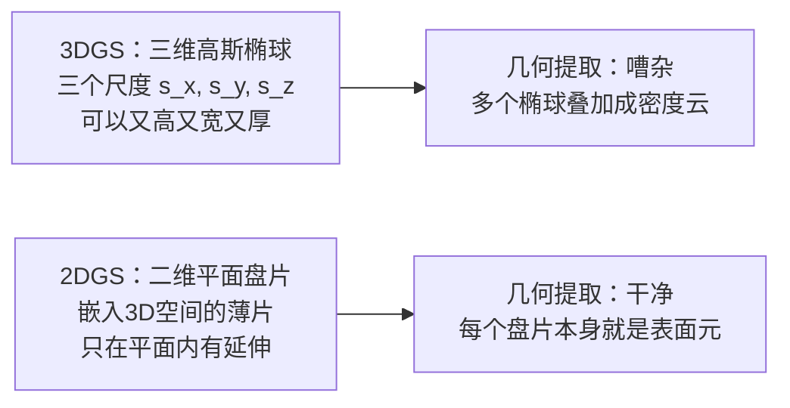

# 2DGS 深度精读：用平面盘片取代体积椭球，重建精确几何

> **论文标题**：2D Gaussian Splatting for Geometrically Accurate Radiance Fields
> **作者**：Binbin Huang, Zehao Yu, Anpei Chen, Andreas Geiger, Shenghua Gao
> **机构**：ShanghaiTech University, University of Tübingen
> **发表**：SIGGRAPH 2024（ACM TOG）
> **arXiv**：2403.17888

**知识链接**：
- [3D Gaussian Splatting：用一堆椭球把真实场景搬进电脑](/前置知识/007a_前置知识_3D_Gaussian_Splatting三维场景重建) — 2DGS 是 3DGS 的直接改进，必须先理解 3DGS 的渲染原理
- [NeuS：用符号距离场把"模糊密度"变成精确表面](/前置知识/013a_前置知识_NeuS_符号距离场隐式表面重建) — 另一条几何优先的路线，对比来看两者的取舍
- [SuGaR：让 3D 高斯贴上表面，快速提取可编辑网格](./153_SuGaR_表面对齐高斯泼溅网格重建) — 同期的另一篇 3DGS 几何改进，思路不同

---

> **一句话**：把 3DGS 里的三维体积高斯椭球换成二维平面高斯盘片。盘片天然就是一个表面片元，无法表示体积，因此重建出的几何天然准确，提取出的网格干净。渲染速度和训练时间和 3DGS 接近。
>
> **为什么要读**：3DGS 渲染效果极好，但几何质量差——因为三维高斯是体积元，不是表面元。2DGS 用一个简洁的几何改动（把 3D 椭球换成 2D 盘片）解决了这个根本问题。如果你需要从 3DGS 重建中提取高质量网格（用于物理仿真、碰撞检测、资产导出），2DGS 是目前最干净的解决方案之一。

---

## 贯穿全文的例子

> **场景**：用 50 张多视角照片重建一个陶瓷茶壶。渲染目标是新视角合成（看起来像真的），几何目标是提取一个可以放进仿真器做碰撞检测的三角面网格。本文会反复用这个茶壶来解释每个设计决策。

---

## 一、3DGS 的几何问题：体积元无法表示表面

要理解 2DGS，先要搞清楚为什么 [3DGS](/前置知识/007a_前置知识_3D_Gaussian_Splatting三维场景重建) 的几何质量差。

3DGS 把场景表示为一堆**三维高斯椭球**，每个椭球有三个方向上的尺度（$s_x, s_y, s_z$）。训练时，优化器只在乎"渲染出来的像素颜色对不对"，不在乎每个椭球的形状是什么。优化结果是：

- 椭球可以又大又胖，一个椭球横跨一块大平面
- 多个椭球叠在一起凑出颜色，形成"密度云"而非薄层
- 从不同视角看，同一个表面点对应的高斯贡献不同，几何信号不一致

茶壶例子：杯壁是厚约 1mm 的薄陶瓷，但 3DGS 优化后，杯壁区域会有一堆交叉重叠的椭球，提取出来的等值面粗糙且有噪声。更根本的问题是：**三维椭球本质上就不是表面元——它在三个方向上都有延伸，天然和"薄层表面"这个概念矛盾。**

---

## 二、核心思路：把 3D 椭球换成 2D 平面盘片

2DGS 的核心洞察只有一句话：**既然要表示表面，就直接用表面片元来表示。**

具体做法是把 3DGS 里的三维高斯椭球换成**二维平面高斯盘片**（2D oriented planar Gaussian disk）。

每个 2D 高斯盘片由以下参数描述：

| 参数 | 含义 |
|------|------|
| 中心位置 $\mathbf{p}$ | 盘片在 3D 空间中的锚点 |
| 两个切向量 $\mathbf{t}_u, \mathbf{t}_v$ | 定义盘片所在平面的方向 |
| 2D 协方差 $\Sigma_{2D}$ | 控制盘片的形状和大小（椭圆形） |
| 法向量 $\mathbf{n} = \mathbf{t}_u \times \mathbf{t}_v$ | 盘片的法线，自动由切向量决定 |
| 不透明度 $\alpha$ | 这片盘片有多实 |
| 颜色（球谐函数系数） | 视角相关外观 |

关键约束：**盘片只在平面内延伸，法线方向厚度为零。** 这意味着无论从哪个视角看这个盘片，它的几何（朝哪、在哪）都是唯一确定的。而 3DGS 的三维椭球从不同视角看会有不同的"有效厚度"，这正是多视角几何不一致的根源。

茶壶例子：杯壁的一小块区域对应一个盘片，这个盘片就贴在杯壁表面上，法线垂直于杯面。从任何视角看这块区域，都是同一个盘片提供贡献，几何完全一致。

---

## 三、透视正确的光线-盘片求交

把三维椭球投影到屏幕（Splatting）是 3DGS 渲染的核心步骤：把每个椭球投影成一个屏幕空间的二维高斯，然后按深度排序混合。这套方法对三维椭球工作得很好，但对二维平面盘片会出问题。

**问题在哪**：把一个平面盘片"投影"到屏幕，在透视变换下会产生形状畸变——盘片的边缘离相机更近，实际上会显得更大。如果直接用 3DGS 的投影公式，这种畸变会让几何信号出错，优化器无法准确学出盘片的位置和朝向。

2DGS 的解法是**不做投影，改做光线-盘片求交（ray-splat intersection）**：

1. 对屏幕上每个像素，发出一条从相机出发的射线
2. 计算射线和盘片所在平面的交点
3. 在交点处评估二维高斯函数（这个点在盘片上有多"中心"）
4. 用这个高斯值乘以不透明度，得到这个盘片对这个像素的贡献

这个过程和投影的区别：**投影是把盘片压扁到屏幕上再采样，求交是找到屏幕像素对应的盘片上的精确点再采样。** 求交方法在透视变换下是精确的，不产生畸变。

代价是计算量略高：每个像素要和多个盘片做求交，但现代 GPU 的并行计算能力使这个开销在可接受范围内，整体仍能实时渲染。

---

## 四、深度失真损失（Depth Distortion Loss）

光线-盘片求交解决了每个盘片几何精确的问题，但还有一个问题：**沿同一条射线可能有多个盘片都有贡献，如果这些盘片分散在射线的不同深度上，表面还是不薄。**

想象茶壶侧面的一个像素：理想情况下只有一个盘片贡献（恰好在杯壁上），但优化过程中可能出现多个盘片叠在不同深度，一起"凑出"正确的颜色——渲染结果对，但几何错。

深度失真损失（Depth Distortion Loss）专门惩罚这种情况：

$$\mathcal{L}_{dd} = \sum_{i,j} w_i w_j |z_i - z_j|$$

**这个 loss 在做什么**：对同一条射线上所有有贡献的盘片两两配对，如果两个盘片都有较大权重（$w_i, w_j$ 都大）且深度差距大（$|z_i - z_j|$ 大），就给一个大惩罚，迫使多个盘片向同一个深度汇聚。

::: details 📐 公式详解
| 子表达式 | 它是谁 | 它在干嘛 |
|---------|--------|---------|
| $w_i$ | **盘片 $i$ 的贡献权重** | 这个盘片对这个像素贡献了多少颜色（不透明度 × 遮挡） |
| $w_j$ | **盘片 $j$ 的贡献权重** | 同上，另一个盘片 |
| $\|z_i - z_j\|$ | **深度差** | 两个盘片在射线方向上分离了多远 |
| $\sum_{i,j}$ | **两两配对求和** | 所有有贡献的盘片对都被惩罚 |

**用人话读**："别让多个有分量的盘片散布在射线的不同深度——要么贡献大就靠拢，要么就让后面的盘片贡献变小。"

**为什么需要两两配对而不是简单地惩罚盘片数量**：只惩罚盘片数量会让优化器把贡献压给单个盘片，但不能确保这个盘片在正确深度。两两配对的乘积 $w_i w_j$ 天然地只惩罚"两个盘片都显著且分散"的情况。
:::

---

## 五、法线一致性损失（Normal Consistency Loss）

深度失真损失保证了表面是薄的，但还需要保证表面是平滑的。法线一致性损失（Normal Consistency Loss）解决这个问题：

从渲染出的深度图，可以通过有限差分计算每个像素处的**深度法线**（depth-derived normal）——相邻像素的深度变化方向暗示了表面的朝向。这个深度法线可以和各个盘片的法向量直接比较。

$$\mathcal{L}_{nc} = \sum_i w_i (1 - \mathbf{n}_i^\top \mathbf{n}_{depth})$$

**这个 loss 在做什么**：让每个盘片的法线朝向和深度图暗示的表面朝向对齐——盘片贡献越大（$w_i$ 越大），对齐要求越严格。

::: details 📐 公式详解
| 子表达式 | 它是谁 | 它在干嘛 |
|---------|--------|---------|
| $\mathbf{n}_i$ | **盘片 $i$ 的法向量** | 这个盘片说"表面朝这个方向" |
| $\mathbf{n}_{depth}$ | **深度法线** | 深度图说"这个像素的表面朝这个方向" |
| $1 - \mathbf{n}_i^\top \mathbf{n}_{depth}$ | **法线偏差** | 两个法线方向的余弦距离，0=完全对齐，2=完全相反 |
| $w_i$ | **盘片贡献权重** | 只惩罚有实质贡献的盘片 |

**用人话读**："盘片的法向量要和深度图暗示的表面朝向保持一致，贡献越大的盘片对齐要求越高。"

**为什么用深度法线而不是直接约束相邻盘片的法线一致**：深度法线是渲染出来的整体信号，已经融合了多个盘片的贡献，能反映真实表面走向；直接约束相邻盘片只能处理显式邻居，无法处理不相连区域的平滑性。
:::

---

## 六、完整训练目标

三个损失合并：

$$\mathcal{L} = \mathcal{L}_{render} + \lambda_1 \mathcal{L}_{dd} + \lambda_2 \mathcal{L}_{nc}$$

**渲染损失** $\mathcal{L}_{render}$（L1 + D-SSIM）保证新视角合成质量。**深度失真损失**让表面变薄。**法线一致性损失**让表面变平滑。三者共同优化，盘片逐渐从随机初始化收敛到贴着物体表面、方向正确的配置。

训练流程和 3DGS 完全相同（SfM 点云初始化 → 梯度下降 → 周期性的密化和剪枝），只是每个高斯换成了 2D 盘片，渲染器换成了光线-盘片求交，并加了两个辅助损失。

---

## 七、结果与对比

2DGS 在多个数据集（DTU、Tanks & Temples）上和同期方法做了系统对比：

**几何质量**：在 DTU 的 Chamfer 距离指标（衡量重建网格和真实扫描的偏差）上，2DGS 优于 3DGS 和多种基于 NeRF 的方法，接近 NeuS 类的神经 SDF 方法。

**渲染质量**：PSNR 和 SSIM 指标上，2DGS 和 3DGS 相近，没有因为几何约束牺牲多少渲染质量。

**速度**：训练和实时渲染速度接近 3DGS，远快于 NeuS（不需要每次渲染都查询一个大型神经网络）。

---

## 八、局限性

**非平面几何**：盘片是平面片元，对高度弯曲的表面（球面、复杂曲面）需要用很多小盘片才能近似，效率低于体积高斯。3DGS 的三维椭球可以用少量大椭球覆盖大块平滑区域，2DGS 盘片无法做到这一点。

**透明与半透明物体**：烟雾、玻璃、毛发这类需要半透明体积表示的内容，盘片的"薄片"假设反而是约束，效果不如 3DGS。

**SfM 初始化依赖**：和 3DGS 一样，初始化点云质量很大程度上决定了最终重建效果，纹理稀少的区域（纯白桌面、镜面）初始化稀疏，难以收敛到正确几何。

---

## 和 NeuS / SuGaR 的对比

| | 2DGS | SuGaR | NeuS |
|---|------|-------|------|
| 表示方式 | 2D 平面高斯盘片 | 3D 高斯 + 表面对齐正则化 | 神经 SDF |
| 几何精度 | 高 | 中等偏高 | 高 |
| 渲染速度 | 实时 | 实时 | 慢 |
| 训练时间 | 几十分钟 | 几十分钟 | 数小时 |
| 网格编辑性 | 一般（需额外步骤） | 好（高斯绑定到网格） | 一般 |
| 半透明场景 | 差 | 差 | 中等 |

2DGS 和 SuGaR 思路完全不同：2DGS 在高斯的定义层面做改动（换成 2D 盘片），几何精度更高但灵活性稍差；SuGaR 保留 3D 高斯的表示，用正则化推动它们贴向表面，然后用泊松重建提取网格，输出更适合后续编辑。

