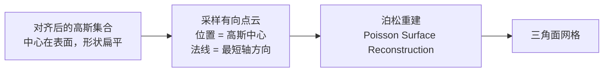
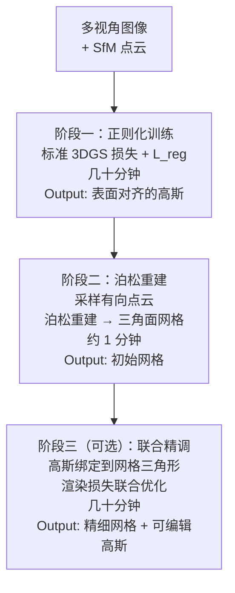

# SuGaR 深度精读：让 3D 高斯"贴"上表面，快速提取可编辑网格

> **论文标题**：SuGaR: Surface-Aligned Gaussian Splatting for Efficient 3D Mesh Reconstruction and High-Quality Mesh Rendering
> **作者**：Antoine Guédon, Vincent Lepetit
> **机构**：École des Ponts ParisTech
> **发表**：CVPR 2024
> **arXiv**：2311.12775

**知识链接**：
- [3D Gaussian Splatting：用一堆椭球把真实场景搬进电脑](/前置知识/007a_前置知识_3D_Gaussian_Splatting三维场景重建) — SuGaR 是建立在 3DGS 基础上的改进，必须先理解 3DGS
- [NeuS：用符号距离场把"模糊密度"变成精确表面](/前置知识/013a_前置知识_NeuS_符号距离场隐式表面重建) — SuGaR 旨在以 3DGS 的速度接近 NeuS 的几何质量
- [2DGS：用平面盘片取代体积椭球，重建精确几何](./152_2DGS_2D高斯泼溅精确几何重建) — 同期的另一篇 3DGS 几何改进，思路完全不同

---

> **一句话**：在 3DGS 训练时加一个正则化损失，把所有高斯推向场景表面（扁平化、贴合等值面）；然后从这些已对齐的高斯里采样有向点云，用泊松重建（Poisson Reconstruction）提取三角面网格；最后把高斯绑定到网格三角形上，实现可编辑的高质量渲染。整个过程几分钟内完成，而传统神经 SDF 方法需要数小时。
>
> **为什么要读**：3DGS 的速度优势众所周知，但一直没有好的方法从中提取干净的 mesh。SuGaR 提供了一条实用路径：不改变 3DGS 的渲染机制，只加一个正则化项，就能让高斯自然靠向表面；然后用经典的泊松重建把它们变成网格，输出可以直接在 Blender/Unity 里编辑、绑骨骼、做动画的标准三角面模型。

---

## 贯穿全文的例子

> **场景**：用多视角照片重建一座桌上的小雕像。目标是得到一个三角面网格，可以在 Blender 里雕刻细节、绑骨骼让它动起来，并且保留高质量的外观渲染。本文会反复用这个雕像来解释 SuGaR 的每个阶段。

---

## 一、从 3DGS 提取网格为什么难

用 3DGS 重建出一个场景之后，里面有几百万个高斯椭球，每个椭球有位置、方向、尺度和颜色（球谐函数）。这些椭球是"用来渲染的"，不是"用来表示表面的"——优化器只关心渲染出来的颜色对不对，不关心椭球在几何上是否排列成了一个干净的表面。

标准 3DGS 训练完之后，高斯的分布状态通常是：

- 一部分高斯确实贴在表面附近（渲染需要它们）
- 一部分高斯漂浮在物体内部或空中（用来填补颜色）
- 高斯的朝向和形状随机，不保证法线和真实表面对齐

从这堆混乱的高斯里提取一个干净的三角面网格，就像从一堆随机散落的树叶里拼出一张地图——信息在那里，但没有结构可以直接利用。

SuGaR 的解法分三步：**先把高斯推向表面（正则化），再从对齐的高斯提取网格（泊松重建），最后把高斯绑定到网格三角形上（可编辑渲染）**。

---

## 二、阶段一：正则化——把高斯推向表面

这是 SuGaR 最核心的贡献。想法直接：**在 3DGS 的渲染损失上加一个正则化项，惩罚不贴合表面的高斯。**

**先建立一个"场景密度函数"**。3DGS 里，空间中任意一点 $\mathbf{x}$ 的密度可以用所有高斯的加权和来定义：

$$\rho(\mathbf{x}) = \sum_i o_i \cdot \exp\!\left(-\frac{1}{2}(\mathbf{x} - \boldsymbol{\mu}_i)^\top \boldsymbol{\Sigma}_i^{-1} (\mathbf{x} - \boldsymbol{\mu}_i)\right)$$

**这个公式在做什么**：在空间中的任意一点评估"这里有多实"——每个高斯在自己的中心附近贡献大（指数衰减），越远贡献越小，所有高斯的贡献加在一起就是该点的总密度。

::: details 📐 公式详解
| 子表达式 | 它是谁 | 它在干嘛 |
|---------|--------|---------|
| $o_i$ | **高斯 $i$ 的不透明度** | 这个高斯有多实——0 是透明，1 是不透明 |
| $\boldsymbol{\mu}_i$ | **高斯 $i$ 的中心位置** | 这个高斯在三维空间的锚点 |
| $\boldsymbol{\Sigma}_i$ | **高斯 $i$ 的协方差矩阵** | 决定椭球的形状和方向 |
| $\exp(-\frac{1}{2}\Delta^\top \Sigma^{-1}\Delta)$ | **马氏距离衰减** | 离中心越远贡献越小，以椭球形状为等值线 |
| $\sum_i$ | **所有高斯叠加** | 把场景里所有高斯的贡献加在一起 |

**用人话读**："在某个点，每个高斯根据'这个点离我多远'贡献一些密度，全部加起来就是这个点的总密度。"
:::

**理想的表面对齐高斯是什么样的**：一个高斯如果完美贴在场景表面，它应该是扁平的（沿法线方向尺度很小），并且它的中心正好落在密度场的某条等值面上。

SuGaR 的正则化项基于这个观察：

$$\mathcal{L}_{reg} = \sum_i \left| \rho(\boldsymbol{\mu}_i) - \rho^* \right|$$

**这个 loss 在做什么**：对每个高斯，计算它自身中心处的场景密度值，要求这个值接近一个目标密度 $\rho^*$——强迫高斯的中心落在密度等值面（即场景表面）上。

::: details 📐 公式详解
| 子表达式 | 它是谁 | 它在干嘛 |
|---------|--------|---------|
| $\rho(\boldsymbol{\mu}_i)$ | **高斯中心处的密度** | 高斯 $i$ 的中心落在密度场的哪条等值线上 |
| $\rho^*$ | **目标密度值** | 一个预设的常数，对应"表面处的密度应该是多少" |
| $\|\cdot\|$ | **绝对值偏差** | 偏离目标越远，惩罚越大 |
| $\sum_i$ | **对所有高斯求和** | 每个高斯都要贴近表面等值面 |

**用人话读**："每个高斯的中心要落在表面上——落在密度场的'表面等值线'上，太深太浅都要被惩罚。"

**为什么这个正则化能让高斯扁平化**：高斯要同时满足"中心在表面"和"渲染颜色对"两个目标。渲染颜色需要高斯覆盖表面区域，但表面是薄的二维结构——一个厚实的三维椭球如果中心在表面，它的体积大部分在表面内部，不能有效地渲染表面外侧的外观。优化器发现把高斯压扁成沿表面的薄片更容易同时满足两个目标，所以高斯自然变扁。
:::

---

## 三、阶段二：泊松重建——从对齐的高斯提取网格

正则化训练完之后，高斯已经贴合表面。现在要从这些高斯里提取出三角面网格。

**直接的方法**：对密度场 $\rho(\mathbf{x})$ 找等值面（Marching Cubes），就像 NeuS 对神经 SDF 做的那样。但这需要在整个三维空间的密集格点上评估 $\rho$，计算量极大，且分辨率受格点精度限制。

**SuGaR 的方法**：跳过密度场，直接从已经对齐的高斯采样有向点云（oriented point cloud），然后用**泊松重建**（Poisson Surface Reconstruction）把点云变成网格。

采样方法很简单：
- 每个高斯的**中心位置** $\boldsymbol{\mu}_i$ 作为采样点（已经在表面上）
- 每个高斯的**最短轴方向**作为该点的法向量（高斯已经是扁片，最短轴就是法线方向）

**泊松重建是什么**：给定一组带法向量的散点，泊松重建在全局求解一个隐函数（Indicator Function），它的梯度场和输入的法向量场最接近，然后提取这个函数的零值面作为网格。整个过程是解一个线性方程组，速度极快（秒级），不需要梯度下降。

对比 Marching Cubes on Neural SDF：
- Marching Cubes 需要在密集格点上查询神经网络，格点越密越慢
- 泊松重建从点云直接算，和格点分辨率无关，处理几百万个点也只需要几秒

雕像例子：正则化训练完之后，雕像表面覆盖着几十万个扁平高斯，采样出几十万个有向点，泊松重建在 10 秒内输出一个干净的三角面网格。

---

## 四、阶段三（可选）：高斯绑定——可编辑的渲染

提取网格后，SuGaR 做了一件其他方法没做的事：**把每个高斯绑定到最近的网格三角形上，然后同时优化高斯和网格。**

绑定方法：把高斯的位置、方向、尺度用网格三角形的局部坐标系来参数化。高斯不再有独立的全局坐标，而是"挂在"一个三角形上，三角形移动高斯跟着移动。

这有两个实际用途：

**1. 联合精调（Joint Refinement）**：绑定完之后，继续用渲染损失联合优化高斯参数和网格顶点坐标。泊松重建的网格是近似的（点云有噪声），联合精调可以让网格几何更精确，同时恢复被网格近似损失的一些渲染质量。

**2. 可编辑渲染（Editable Rendering）**：用户在 Blender 里移动网格顶点、绑骨骼做动画、雕刻细节——所有对网格的修改都会自动带动绑定的高斯一起运动。网格变形的地方，渲染外观也跟着变形，不需要重新训练。

这个特性对游戏开发、影视制作、机器人仿真等场景特别有价值：美术师可以用熟悉的工具编辑 3D 模型，同时保留高质量的神经渲染外观。

---

## 五、三阶段训练流程

全程时间：**30–60 分钟**（视场景复杂度），对比 NeuS/VolSDF 的数小时，速度快一个数量级。

---

## 六、结果与对比

**几何质量**：在 Tanks & Temples 等数据集上，SuGaR 的网格质量接近 NeuS，优于直接从 3DGS 密度场提取的网格。

**渲染质量**：用绑定高斯渲染的新视角合成，PSNR 指标优于 NeuS 等神经 SDF 方法（因为高斯表示的外观建模能力更强），接近原始 3DGS。

**可编辑性**：这是 SuGaR 独有的贡献。现有方法要么有好网格但渲染质量差（NeuS 提取的网格做纹理烘焙），要么有好渲染但网格不可编辑（原始 3DGS）。SuGaR 同时得到可编辑的标准网格和高质量的高斯渲染。

---

## 七、局限性

**对 3DGS 质量的依赖**：正则化的效果取决于 3DGS 能否把高斯大致放到正确位置。纹理稀少的区域（纯色平面、镜面）3DGS 本身就不稳定，正则化无法拯救一个根本没有几何信号的区域。

**泊松重建假设封闭表面**：泊松重建对有开口的表面（薄板的边缘、敞开的容器内壁）会产生伪几何来"封闭"表面。如果场景里有明显的开口结构，需要后处理去掉这些伪几何。

**正则化强度超参数**：$\mathcal{L}_{reg}$ 的权重需要调整——太强会损害渲染质量（高斯被强制贴面，无法自由优化外观），太弱表面对齐不充分（泊松重建点云不干净）。不同场景可能需要不同权重。

**和 2DGS 的根本区别**：SuGaR 是一个两步流程（先 3DGS 正则化，再泊松提取），网格是后处理的结果；2DGS 直接改了高斯的定义，几何精度天然比 SuGaR 高，但 SuGaR 的高斯绑定特性（可编辑渲染）是 2DGS 没有的。

