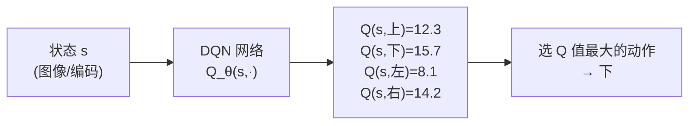
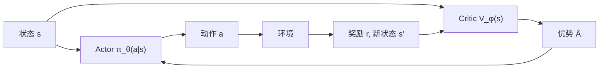
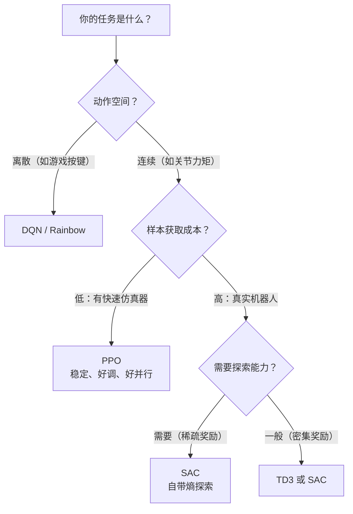
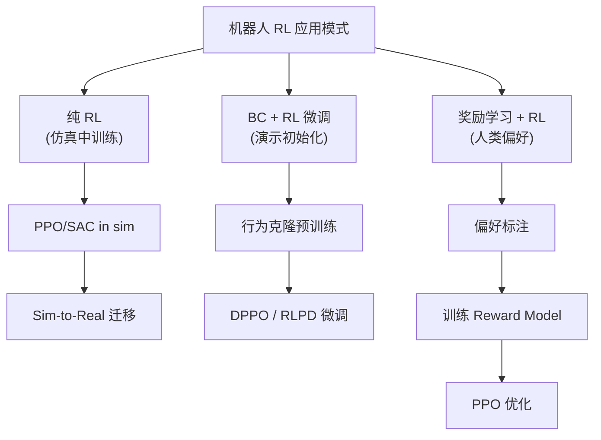

# 深度强化学习方法综述：从 DQN 到 PPO/SAC

> **综述范围**：深度强化学习（Deep RL）核心算法族的演化脉络  
> **关键词**：Value-based、Policy Gradient、Actor-Critic、Off-policy、On-policy  
> **适用读者**：有基础数学能力，想系统理解 Deep RL 算法的小白到进阶读者

## 相关阅读

- [策略梯度与 PPO](/前置知识/000a_前置知识_策略梯度与PPO) — 本文第 5~6 节的详细推导版本
- [行为克隆与 RL 微调范式](/前置知识/000d_前置知识_行为克隆与RL微调范式) — 为什么先 BC 再 RL
- [机器人模仿学习综述](./S02_机器人模仿学习综述) — 模仿学习如何与 RL 结合
- [扩散模型在决策与控制中的应用](./S05_扩散模型在决策与控制中的应用综述) — 扩散策略的 RL 微调

---

## 贯穿全文的例子：迷宫中的小机器人

为了让抽象概念落地，我们用一个贯穿全文的例子：

> **场景**：一个 5×5 网格迷宫，机器人从左上角 (0,0) 出发，目标是到达右下角 (4,4)。
> - **状态 $s$**：机器人当前格子坐标，如 $(2,3)$
> - **动作 $a$**：上、下、左、右 四个方向
> - **奖励 $r$**：每走一步 $r=-1$（鼓励尽快到达），到达终点 $r=+100$
> - **折扣 $\gamma = 0.9$**：未来奖励打折

后面每个算法，我们都会回到这个例子看看它具体怎么工作。

---

## 1. 引言：为什么需要深度强化学习

### 1.1 强化学习的核心问题

强化学习解决的是一个直觉上很自然的问题：**一个智能体通过反复试错，学会在环境中做出好的决策**。

想象你教一只小狗坐下：
- 你不需要告诉它每块肌肉怎么动（不是监督学习）
- 你只需要在它做对时给零食、做错时不给（奖励信号）
- 小狗通过反复尝试，发现"听到'坐下'→屁股着地→有零食"这个模式

强化学习做的就是这件事，只不过"小狗"换成了神经网络。

### 1.2 为什么要"深度"

经典强化学习（如 Q-learning）用一张表格存储每个（状态，动作）对的价值。在我们的迷宫例子中：

- 5×5 网格 × 4 个动作 = 100 个格子需要记录 → 表格完全可以胜任

但如果状态是一张 84×84 的灰度图像（如 Atari 游戏画面）：

- 可能的状态数 = $256^{84 \times 84} \approx 10^{17000}$ → 表格装不下！

**深度神经网络**充当函数逼近器：用有限的参数表示无限大的状态空间到价值/动作的映射。

---

## 2. 问题形式化：MDP

强化学习的数学框架是**马尔可夫决策过程（MDP）**，定义为五元组 $(S, A, P, R, \gamma)$：

$$
\text{MDP} = (S, A, P, R, \gamma)
$$

**逐项解释**：

| 符号 | 含义 | 迷宫例子 |
|------|------|----------|
| $S$ | 状态空间（所有可能的状态） | 25 个格子坐标 |
| $A$ | 动作空间（所有可能的动作） | {上, 下, 左, 右} |
| $P(s'\|s,a)$ | 转移概率：在 $s$ 执行 $a$ 后到达 $s'$ 的概率 | 执行"右"有 90% 概率到右边格子，10% 概率滑到其他方向 |
| $R(s,a)$ | 奖励函数：执行动作后获得的即时反馈 | 每步 $-1$，到终点 $+100$ |
| $\gamma$ | 折扣因子：衡量"未来奖励值多少钱" | $0.9$：明天的 1 块钱 = 今天的 0.9 块 |

### 2.1 目标：最大化累积折扣回报

智能体的目标是找到策略 $\pi^*$，使得从任意状态出发的**累积折扣回报**最大：

$$
\pi^* = \arg\max_\pi \; \mathbb{E}_\pi \left[\sum_{t=0}^{\infty} \gamma^t R(s_t, a_t)\right]
$$

**逐项拆解**：
- $\pi$ — 策略，即"在什么状态下做什么动作"的规则
- $\mathbb{E}_\pi[\cdot]$ — 按策略 $\pi$ 行动时的期望值（因为环境可能有随机性）
- $\sum_{t=0}^{\infty} \gamma^t R(s_t, a_t)$ — 所有未来奖励的折扣求和
- $\arg\max_\pi$ — 找到让这个期望最大的那个策略

**代入迷宫数字**：假设最优路径长度是 8 步到达终点：

$$
\text{回报} = \underbrace{(-1) + 0.9 \times (-1) + 0.9^2 \times (-1) + \cdots + 0.9^7 \times (-1)}_{\text{7 步的负惩罚}} + 0.9^8 \times 100
$$

$$
= -\frac{1 - 0.9^8}{1 - 0.9} + 0.9^8 \times 100 \approx -5.7 + 43.0 = 37.3
$$

如果走了 20 步才到：回报 ≈ $-8.8 + 0.9^{20} \times 100 \approx -8.8 + 12.2 = 3.4$。所以越快到达终点，回报越高。

### 2.2 值函数：状态值与动作值

为了找到最优策略，我们需要评估"一个状态有多好"和"一个动作有多好"。

**状态值函数** $V^\pi(s)$：从状态 $s$ 出发，按策略 $\pi$ 行动，能拿到多少回报？

$$
V^\pi(s) = \mathbb{E}_\pi\left[\sum_{t=0}^{\infty} \gamma^t R(s_t, a_t) \;\middle|\; s_0 = s\right]
$$

**迷宫例子**：$V^\pi((4,3)) \approx 0.9 \times 100 - 1 = 89$（离终点一步之遥，值很高）；$V^\pi((0,0)) \approx 37.3$（需要走 8 步）。

**动作值函数** $Q^\pi(s,a)$：在状态 $s$ 执行动作 $a$，之后再按策略 $\pi$ 行动，能拿到多少回报？

$$
Q^\pi(s,a) = \mathbb{E}_\pi\left[\sum_{t=0}^{\infty} \gamma^t R(s_t, a_t) \;\middle|\; s_0 = s, a_0 = a\right]
$$

**迷宫例子**：在 $(3,4)$ 位置执行"下"（到达终点）的 $Q$ 值：$Q((3,4), \text{下}) = -1 + 0.9 \times 100 = 89$。执行"上"（远离终点）的 $Q$ 值要低很多。

**核心关系**：$V^\pi(s) = \sum_a \pi(a|s) \cdot Q^\pi(s,a)$，即状态值 = 所有动作的 Q 值按策略概率加权。

### 2.3 优势函数

**优势函数** $A^\pi(s,a)$：这个动作比"平均水平"好多少？

$$
A^\pi(s,a) = Q^\pi(s,a) - V^\pi(s)
$$

- $A > 0$：这个动作比平均好 → 应该增加其概率
- $A < 0$：这个动作比平均差 → 应该降低其概率
- $A = 0$：和平均一样

**迷宫例子**：在 $(2,2)$ 位置，假设 $V((2,2)) = 20$：
- 执行"右"（朝终点方向）：$Q = 25$，所以 $A = 25 - 20 = +5$（好动作）
- 执行"左"（远离终点）：$Q = 10$，所以 $A = 10 - 20 = -10$（坏动作）

优势函数在后面的 PPO 中非常关键——它告诉策略梯度"应该鼓励哪些动作、惩罚哪些动作"。

---

## 3. Value-Based 方法：让 Q 表格变成神经网络

### 3.1 经典 Q-Learning 回顾

在表格时代，Q-learning 的更新规则是：

$$
Q(s,a) \leftarrow Q(s,a) + \alpha \left[r + \gamma \max_{a'} Q(s', a') - Q(s,a)\right]
$$

**逐项解释**：
- $\alpha$ — 学习率（如 0.1），控制每次更新多少
- $r + \gamma \max_{a'} Q(s', a')$ — **TD 目标**：实际拿到的奖励 + 下一个状态的最优估计值
- $Q(s,a)$ — 当前估计
- 括号内的差值叫 **TD 误差**：目标值与当前值的差距

**迷宫数值例子**：

机器人在 $(2,2)$，执行"右"，到达 $(2,3)$，获得 $r=-1$。
- 当前估计：$Q((2,2), \text{右}) = 15$
- 下一状态最优值：$\max_a Q((2,3), a) = 22$
- TD 目标：$-1 + 0.9 \times 22 = 18.8$
- TD 误差：$18.8 - 15 = 3.8$
- 更新：$Q((2,2), \text{右}) \leftarrow 15 + 0.1 \times 3.8 = 15.38$

每次交互一步，Q 值就朝真实值移动一点点。经过成千上万次更新，表格收敛到最优 $Q^*$。

### 3.2 DQN：用神经网络替代 Q 表格（2015）

当状态是图像时，表格不可行。DQN（Deep Q-Network）的核心思想：**用一个神经网络 $Q_\theta(s,a)$ 来近似整张 Q 表格**。

输入一张游戏画面 $s$，网络输出所有动作的 Q 值：

$$
Q_\theta(s, \cdot) : \text{84×84 图像} \to [Q(s, \text{上}), Q(s, \text{下}), Q(s, \text{左}), Q(s, \text{右})]
$$

但直接用神经网络做 Q-learning 训练会崩溃，原因有二：

**问题 1：数据相关性**。相邻帧的 $(s,a,r,s')$ 高度相关（$s$ 和 $s'$ 几乎一样），梯度方向来回震荡。

**解决：经验回放（Experience Replay）**。把所有交互数据 $(s_t, a_t, r_t, s_{t+1})$ 扔进一个大缓冲区 $\mathcal{D}$（如存 100 万条），训练时随机抽取一个 mini-batch（如 32 条），打破时序相关性。

**问题 2：目标漂移**。训练目标 $r + \gamma \max_{a'} Q_\theta(s', a')$ 本身也在变（因为 $\theta$ 在更新），相当于"你追一个也在跑的目标"。

**解决：目标网络（Target Network）**。维护一份延迟更新的参数 $\theta^-$（每 10000 步才同步一次），用它算 TD 目标：

$$
L(\theta) = \mathbb{E}_{(s,a,r,s') \sim \mathcal{D}}\left[\left(r + \gamma \max_{a'} Q_{\theta^-}(s', a') - Q_\theta(s, a)\right)^2\right]
$$

**逐项拆解**：
- $\mathbb{E}_{(s,a,r,s') \sim \mathcal{D}}$ — 从回放缓冲区随机采样
- $r + \gamma \max_{a'} Q_{\theta^-}(s', a')$ — TD 目标（用旧网络算，比较稳定）
- $Q_\theta(s, a)$ — 当前网络的预测
- 整体是一个 MSE 损失：让预测靠近目标

**迷宫例子（假设用 one-hot 编码状态）**：
- 网络输入：25 维 one-hot（表示在哪个格子）
- 网络输出：4 维向量（上/下/左/右的 Q 值）
- 训练：从缓冲区采 32 条经验，计算 MSE loss，反向传播更新

### 3.3 DQN 的改进家族

DQN 之后出现了一系列改进，每个都解决一个具体问题：

#### Double DQN（2016）：解决 Q 值过估计

**问题**：$\max_{a'} Q_{\theta^-}(s', a')$ 天然会过估计——当估计有噪声时，取 max 会偏向高估的那个。

**类比**：你问 5 个人"你觉得自己数学几分？"然后取最高分当代表 → 一定偏高。

**解决**：把"选动作"和"评估动作"分开：

$$
y = r + \gamma \, Q_{\theta^-}\!\left(s', \;\underbrace{\arg\max_{a'} Q_\theta(s', a')}_{\text{用当前网络选动作}}\right)
$$

用当前网络 $\theta$ 选出最好的动作，但用目标网络 $\theta^-$ 评估这个动作值多少 → 减少过估计。

#### Dueling DQN（2016）：分离"状态好不好"和"动作好不好"

网络输出分成两支：

$$
Q_\theta(s, a) = V_\theta(s) + A_\theta(s, a) - \frac{1}{|A|}\sum_{a'} A_\theta(s, a')
$$

- $V_\theta(s)$：这个状态本身值多少
- $A_\theta(s, a)$：这个动作比平均好多少

**为什么有用**：在很多状态下，无论做什么动作结果差不多（比如你在开阔道路上，左右偏一点都行）。Dueling 让网络可以专注学习"这个状态本身好不好"，不需要为每个动作分别学。

#### Rainbow（2018）：六合一

Rainbow 把 6 项改进组合起来：Double DQN + Dueling + Prioritized Replay + Multi-step + Distributional RL + Noisy Nets。单独每项改进提升有限，组合起来效果翻倍。

| 改进 | 解决的问题 |
|------|-----------|
| Double | 过估计 |
| Dueling | 状态/动作价值分离 |
| Prioritized Replay | 重要经验多学几次 |
| Multi-step | 减少偏差（用 n 步回报） |
| Distributional (C51) | 学价值分布而非均值 |
| Noisy Nets | 更聪明的探索 |

### 3.4 Value-Based 方法的局限

DQN 系列有两个根本限制：

1. **只能处理离散动作**：$\max_{a'} Q(s', a')$ 需要遍历所有动作。如果动作是连续的（如机器人关节力矩 $\in [-1, 1]^7$），无法枚举。
2. **只能学确定性策略**：总是选 Q 值最大的动作，无法输出"70% 概率走右、30% 概率走下"这样的随机策略。

→ 需要 **Policy Gradient** 方法。

---

## 4. Policy Gradient：直接优化策略

### 4.1 核心思想

Policy Gradient 方法换了一个角度：**不再估计 Q 值，而是直接参数化策略并优化它**。

策略 $\pi_\theta(a|s)$ 是一个神经网络：输入状态 $s$，输出每个动作的概率分布。

**迷宫例子**：
- 输入：当前位置 $(2,2)$ 的 one-hot 编码
- 输出：softmax 概率 $[\text{上}:0.1, \text{下}:0.3, \text{左}:0.1, \text{右}:0.5]$
- 按概率采样一个动作执行

### 4.2 REINFORCE 算法

REINFORCE 的更新规则：

$$
\nabla_\theta J(\theta) = \mathbb{E}_{\tau \sim \pi_\theta}\left[\sum_{t=0}^{T} \nabla_\theta \log \pi_\theta(a_t|s_t) \cdot G_t\right]
$$

**一句话**：如果一个动作带来了高回报，就增加这个动作的概率；如果带来了低回报，就降低它。

**逐项拆解**：
- $\tau \sim \pi_\theta$ — 用当前策略收集一整条轨迹 $\tau = (s_0, a_0, r_0, s_1, a_1, r_1, ...)$
- $\nabla_\theta \log \pi_\theta(a_t|s_t)$ — "增加动作 $a_t$ 概率"的梯度方向
- $G_t = \sum_{k=t}^{T} \gamma^{k-t} r_k$ — 从时刻 $t$ 开始的累积折扣回报
- 乘积的含义：用 $G_t$ 作为权重，$G_t$ 越大，越用力"推"策略往这个动作走

**关键直觉**：$\log \pi_\theta(a|s)$ 的梯度指向"增加动作 $a$ 概率"的方向。乘以正的 $G_t$ = 加强这个动作；乘以负的 $G_t$ = 削弱这个动作。

**代入迷宫数字**：

在 $(2,2)$ 执行了"右"，之后走了 6 步到达终点：
- $G_t = -1 + 0.9 \times (-1) + ... + 0.9^5 \times 100 \approx 55.1$（正值，说明这是好的选择）
- 梯度方向：增加 $\pi_\theta(\text{右}|(2,2))$ 的概率

另一次在 $(2,2)$ 执行了"左"，走了 20 步才到终点：
- $G_t \approx 3.4$（也是正值，但很小）
- 梯度方向：只很轻微地增加 $\pi_\theta(\text{左}|(2,2))$

经过很多次采样，"右"获得的平均 $G_t$ 远高于"左"，所以策略逐渐偏向"右"。

### 4.3 方差问题与基线

REINFORCE 有一个严重问题：**方差极大**。

**类比**：你想评价一家餐厅好不好，随机去吃了一次——可能碰巧点到了最好/最差的菜，结论很不稳定。你需要去很多次才能得到可靠评价。

$G_t$ 的方差来源于：
- 环境的随机性
- 策略本身的随机性
- 后续所有奖励的累加放大了噪声

**解决：引入基线（Baseline）**

$$
\nabla_\theta J(\theta) = \mathbb{E}\left[\sum_{t} \nabla_\theta \log \pi_\theta(a_t|s_t) \cdot (G_t - b(s_t))\right]
$$

- $b(s_t)$：基线，通常用 $V(s_t)$ 的估计（"这个状态平均能拿多少回报"）
- $G_t - b(s_t)$：就是优势的蒙特卡洛估计！
- 数学上可以证明：减去基线不改变梯度期望，但大幅降低方差

**迷宫数字**：假设 $V((2,2)) = 30$
- 走"右"得到 $G_t = 55.1$ → 优势 $= 55.1 - 30 = +25.1$（明确的正信号）
- 走"左"得到 $G_t = 3.4$ → 优势 $= 3.4 - 30 = -26.6$（明确的负信号）
- 有了基线，好/坏动作的区分更清晰

这就引出了 **Actor-Critic** 框架：Actor 是策略网络，Critic 是价值网络（提供基线）。

### 4.4 GAE：平衡偏差与方差

如何估计优势 $A_t$ 有多种方式，Schulman 提出的 **GAE**（Generalized Advantage Estimation）是一种优雅的折中方案。

首先定义 **TD 误差**（一步优势估计）：

$$
\delta_t = r_t + \gamma V(s_{t+1}) - V(s_t)
$$

**一句话**：实际拿到的 $r_t + \gamma V(s_{t+1})$ vs 之前预期的 $V(s_t)$，差值就是"惊喜/失望程度"。

然后 GAE 对多步 TD 误差做指数加权平均：

$$
\hat{A}_t^{\text{GAE}(\gamma,\lambda)} = \sum_{l=0}^{\infty} (\gamma\lambda)^l \delta_{t+l}
$$

**逐项拆解**：
- $l$ — 往未来看多少步
- $(\gamma\lambda)^l$ — 越远的 TD 误差权重越低（指数衰减）
- $\lambda \in [0, 1]$ — 控制看多远

**$\lambda$ 的两个极端**：
- $\lambda = 0$：$\hat{A}_t = \delta_t = r_t + \gamma V(s_{t+1}) - V(s_t)$ — 只看一步，偏差高（依赖 $V$ 准确）、方差低
- $\lambda = 1$：$\hat{A}_t = G_t - V(s_t)$ — 看到底，偏差低（不依赖 $V$）、方差高

实践中 $\lambda = 0.95$ 是常见选择。

**迷宫数字例子**（$\lambda=0.95$，$\gamma=0.9$）：

在 $(2,2)$ 执行"右"后的轨迹：$(2,2) \to (2,3) \to (2,4) \to (3,4) \to (4,4)$

假设 $V(2,2)=30, V(2,3)=35, V(2,4)=50, V(3,4)=89, V(4,4)=100$：
- $\delta_0 = -1 + 0.9 \times 35 - 30 = 0.5$
- $\delta_1 = -1 + 0.9 \times 50 - 35 = 9.0$
- $\delta_2 = -1 + 0.9 \times 89 - 50 = 29.1$
- $\delta_3 = -1 + 0.9 \times 100 - 89 = 0$（到终点了）

$$
\hat{A}_0 = 0.5 + 0.855 \times 9.0 + 0.855^2 \times 29.1 + 0.855^3 \times 0 \approx 0.5 + 7.7 + 21.3 = 29.5
$$

很大的正优势，确认"右"是好动作。

更多细节请参考 [策略梯度与 PPO 前置知识](/前置知识/000a_前置知识_策略梯度与PPO)。

---

## 5. Actor-Critic 方法

### 5.1 框架概述

Actor-Critic 同时维护两个网络：

- **Actor（演员）**$\pi_\theta(a|s)$：策略网络，决定做什么动作
- **Critic（评论家）**$V_\phi(s)$：价值网络，评估当前状态有多好

两者相互配合：Critic 的评估为 Actor 提供低方差的优势估计，Actor 的行为为 Critic 提供训练数据。

### 5.2 TRPO：保守更新（2015）

REINFORCE 和基础 Actor-Critic 有个问题：**学习率太大会崩，太小则学不动**。Schulman 的 TRPO 引入了一个优雅的解决方案——**信赖域（Trust Region）**。

核心思想：每次更新策略时，限制新旧策略之间的"距离"不超过 $\delta$：

$$
\max_\theta \;\mathbb{E}\left[\frac{\pi_\theta(a|s)}{\pi_{\theta_{\text{old}}}(a|s)} \hat{A}(s,a)\right] \quad \text{s.t.} \quad \mathbb{E}\left[D_{\text{KL}}(\pi_{\theta_{\text{old}}} \| \pi_\theta)\right] \leq \delta
$$

**逐项拆解**：
- $\frac{\pi_\theta(a|s)}{\pi_{\theta_{\text{old}}}(a|s)}$ — 重要性采样比值（importance ratio）：新策略和旧策略对同一动作的概率之比
- $\hat{A}(s,a)$ — GAE 优势估计
- $D_{\text{KL}}$ — KL 散度，衡量两个概率分布有多不同
- 约束 $\leq \delta$：不允许策略跳太远

**类比**：你站在山上想往高处走（最大化目标），但不允许一步跨出安全圈（$\delta$），因为圈外的地形你看不清，可能是悬崖。

**问题**：TRPO 需要计算 Fisher 信息矩阵和共轭梯度法求解约束优化，实现复杂、计算量大。

### 5.3 PPO：用 Clip 替代约束（2017）

PPO（Proximal Policy Optimization）是 TRPO 的简化版，用一个巧妙的 **clip 技巧**替代 KL 约束，实现简单、效果相当。

定义概率比值：

$$
r_t(\theta) = \frac{\pi_\theta(a_t|s_t)}{\pi_{\theta_{\text{old}}}(a_t|s_t)}
$$

PPO 的 Clip 目标：

$$
L^{\text{CLIP}}(\theta) = \mathbb{E}\left[\min\left(r_t(\theta)\hat{A}_t, \;\text{clip}(r_t(\theta), 1-\epsilon, 1+\epsilon)\hat{A}_t\right)\right]
$$

**这是整个现代 RL 最重要的公式之一，让我们掰碎了看：**

**$r_t(\theta)$ 的含义**：

| $r_t$ 的值 | 含义 |
|------------|------|
| $r_t = 1$ | 新旧策略对这个动作的概率完全一样 |
| $r_t = 1.5$ | 新策略把这个动作的概率提高了 50% |
| $r_t = 0.5$ | 新策略把这个动作的概率降低了 50% |

**clip 函数的作用**：

$\text{clip}(r, 0.8, 1.2)$ 把 $r$ 限制在 $[0.8, 1.2]$ 范围内（$\epsilon=0.2$ 时）：
- $r=1.5 \to 1.2$（太高了，截断）
- $r=0.3 \to 0.8$（太低了，截断）
- $r=1.1 \to 1.1$（在范围内，不动）

**min 的巧妙之处**：

分两种情况讨论：

**情况 1：$\hat{A}_t > 0$（这是好动作，要鼓励）**

我们想增加 $r_t$（提高这个动作的概率），但：
- 如果 $r_t$ 已经超过 $1+\epsilon$，clip 后变成 $1+\epsilon$，$\min$ 选 clip 项 → 梯度为 0，不再鼓励
- 效果：**已经鼓励够了就停手**

**情况 2：$\hat{A}_t < 0$（这是坏动作，要惩罚）**

我们想降低 $r_t$（减小这个动作的概率），但：
- 如果 $r_t$ 已经低于 $1-\epsilon$，clip 后变成 $1-\epsilon$，$\min$ 选 clip 项 → 梯度为 0，不再惩罚
- 效果：**已经惩罚够了就停手**

**代入完整数字**（$\epsilon = 0.2$）：

| 场景 | $r_t$ | $\hat{A}_t$ | 未裁剪项 | 裁剪项 | 取 min | 含义 |
|------|--------|-------------|----------|--------|--------|------|
| 好动作，适度鼓励 | 1.1 | +10 | 11 | 11 | 11 | 正常梯度 |
| 好动作，过度鼓励 | 1.5 | +10 | 15 | 12 | **12** | 限制住了 |
| 坏动作，适度惩罚 | 0.9 | -10 | -9 | -9 | -9 | 正常梯度 |
| 坏动作，过度惩罚 | 0.3 | -10 | -3 | -8 | **-8** | 限制住了 |

PPO 因为实现简单、效果好、超参数不敏感，成为目前使用最广泛的 on-policy RL 算法。OpenAI Five（Dota）、ChatGPT 的 RLHF、机器人运动控制都用 PPO。

更完整的 PPO 推导见 [策略梯度与 PPO 前置知识](/前置知识/000a_前置知识_策略梯度与PPO)。

---

## 6. Off-Policy Actor-Critic：连续动作空间

PPO 是 on-policy 的——每次更新后旧数据必须丢弃（因为策略变了，旧数据的重要性权重不再准确）。这导致**样本效率低**：真实机器人每条轨迹都很贵，扔掉太浪费。

Off-policy 方法可以**复用历史数据**，极大提升样本效率。

### 6.1 DDPG（2016）：确定性策略 + 经验回放

DDPG 处理连续动作空间的思路：不再输出概率分布，而是**直接输出一个确定的动作值**。

- **Actor**：$\mu_\theta(s) \to a$（输出确定的连续动作，如力矩 0.73）
- **Critic**：$Q_\phi(s, a) \to \text{标量值}$（评估这个动作值多少分）

**策略梯度**：沿着"让 Critic 给更高分"的方向更新 Actor：

$$
\nabla_\theta J = \mathbb{E}\left[\nabla_a Q_\phi(s,a)\big|_{a=\mu_\theta(s)} \cdot \nabla_\theta \mu_\theta(s)\right]
$$

**逐项拆解**：
- $\nabla_a Q_\phi(s,a)\big|_{a=\mu_\theta(s)}$ — "Q 值对动作 $a$ 的梯度"，即 Critic 告诉 Actor "动作往哪个方向调能涨分"
- $\nabla_\theta \mu_\theta(s)$ — "Actor 参数对输出动作的梯度"，即 Actor 的链式法则
- 两者相乘通过链式法则，得到"Actor 参数往哪调能让 Q 值最大"

**迷宫例子改造（连续版）**：假设动作不再是上下左右，而是连续的 2D 速度向量 $(v_x, v_y) \in [-1,1]^2$：
- Actor 输出 $(0.8, 0.3)$（大致向右偏下）
- Critic 给分 25.7
- Critic 梯度告诉 Actor："$v_x$ 再大一点分会更高"
- Actor 更新后输出 $(0.85, 0.3)$

**探索**：确定性策略本身不探索，训练时对动作加 Ornstein-Uhlenbeck 噪声：$a = \mu_\theta(s) + \mathcal{N}$

**问题**：DDPG 非常脆弱，Critic 的过估计会导致 Actor 被"忽悠"——Actor 找到一个 Critic 误以为很好的动作（实际不好），然后一路偏下去。

### 6.2 TD3（2018）：三招治 DDPG

TD3（Twin Delayed DDPG）用三个改进解决 DDPG 的不稳定：

**招数 1：双 Q 网络（Twin）**

维护两个独立的 Critic $Q_{\phi_1}$、$Q_{\phi_2}$，取小的那个作为目标：

$$
y = r + \gamma \min_{i=1,2} Q_{\phi_i^-}(s', \mu_{\theta^-}(s') + \epsilon)
$$

**直觉**：两个评委打分，取低分 → 保守估计，避免过于乐观。

**招数 2：延迟 Actor 更新（Delayed）**

Critic 更新 2 次才让 Actor 更新 1 次 → 确保 Actor 拿到的 Q 值梯度是相对准确的。

**招数 3：目标动作平滑（Target Policy Smoothing）**

在目标动作上加剪裁的噪声：$\epsilon \sim \text{clip}(\mathcal{N}(0, 0.2), -0.5, 0.5)$

**直觉**：让 Critic 不过度拟合某个精确动作值，而是对附近的动作都给出平滑的评分。

### 6.3 SAC：最大熵 RL（2018）

SAC（Soft Actor-Critic）引入一个核心创新：**在最大化回报的同时最大化策略的熵**。

目标函数：

$$
J(\pi) = \sum_{t=0}^{T} \mathbb{E}\left[r(s_t, a_t) + \alpha \, \mathcal{H}(\pi(\cdot|s_t))\right]
$$

**逐项拆解**：
- $r(s_t, a_t)$ — 常规的环境奖励
- $\mathcal{H}(\pi(\cdot|s_t)) = -\sum_a \pi(a|s_t) \log \pi(a|s_t)$ — 策略的熵，衡量"有多随机"
- $\alpha$ — 温度参数，平衡奖励和熵的权重（可自动调节）
- 整体含义：既要拿高分（回报），又要保持多样性（熵）

**为什么要最大熵？三个好处**：

1. **更好的探索**：高熵策略不会过早收敛到一个动作，持续尝试不同方向
2. **更鲁棒**：如果多条路径都还不错，策略会保留所有可能而非赌一条 → 对环境变化更稳健
3. **避免局部最优**：高熵阻止策略坍缩到某个确定性动作

**迷宫例子**：

假设从 $(2,2)$ 出发有两条等长路径到终点（绕左或绕右都是 8 步）：
- 不加熵的策略：随机收敛到一条，另一条概率趋近 0
- SAC 策略：两条路径各保持 50% 概率（因为放弃一条会降低熵）
- 好处：如果其中一条路突然被堵了，SAC 策略立刻有备选方案

**代入数字展示温度 $\alpha$ 的效果**：

假设两个动作的 Q 值分别是 $Q_1 = 10, Q_2 = 9$（差距很小）：

| $\alpha$ | $\pi(a_1)$ | $\pi(a_2)$ | 行为 |
|----------|-----------|-----------|------|
| 0（无熵） | 1.0 | 0.0 | 确定性选 $a_1$ |
| 0.5 | 0.73 | 0.27 | 偏向 $a_1$ 但保持随机 |
| 2.0 | 0.56 | 0.44 | 几乎均匀（熵主导） |
| $\infty$ | 0.50 | 0.50 | 完全随机 |

SAC 的 $\alpha$ 会自动调节：任务初期需要探索 → $\alpha$ 大；后期需要精确执行 → $\alpha$ 自然减小。

**SAC 在机器人中的地位**：

SAC 是目前连续控制任务的**默认选择**，原因：
- Off-policy → 样本高效（真实机器人数据贵）
- 随机策略 → 自带探索能力
- 对超参数不敏感 → 工程上省心
- 在机器人操控、灵巧手、行走等任务上都是最强 baseline 之一

---

## 7. 算法全景对比

回到我们的核心问题：面对一个新的 RL 任务，应该选哪个算法？

### 7.1 对比表

| 维度 | DQN 系列 | PPO | SAC | TD3 |
|------|----------|-----|-----|-----|
| 动作空间 | 离散 | 连续/离散 | 连续 | 连续 |
| On/Off-policy | Off | On | Off | Off |
| 样本效率 | 中 | 低 | 高 | 高 |
| 训练稳定性 | 中 | **高** | 高 | 中高 |
| 超参数敏感度 | 中 | **低** | 低 | 中 |
| 多模态策略 | ❌ | ✅（随机） | ✅（随机+高熵） | ❌（确定性） |
| 计算开销 | 低 | 中 | 中 | 中 |

### 7.2 选择决策树

### 7.3 迷宫例子中的对比

回到我们 5×5 迷宫（离散动作），用不同算法的体验：

| 算法 | 适用否 | 收敛速度 | 特点 |
|------|--------|----------|------|
| Q-learning（表格） | ✅ | 最快 | 25×4=100 个值，几百步收敛 |
| DQN | ✅（但大材小用） | 中 | 状态空间小，不需要神经网络 |
| PPO | ✅ | 慢 | on-policy 要扔数据，浪费 |
| SAC | ❌ | — | 设计给连续动作用的 |

结论：**简单离散任务用表格 Q-learning 最好**。DQN 是给"状态空间太大无法枚举"的场景准备的（如 Atari 画面）。

如果把迷宫改造为**连续动作版**（速度向量）+ **100×100 网格** + **随机起终点**：

| 算法 | 适用否 | 特点 |
|------|--------|------|
| PPO | ✅ | 稳定但需要大量样本（可用并行环境弥补） |
| SAC | ✅ | 样本高效，自动探索 |
| TD3 | ✅ | 需要仔细调噪声参数 |

---

## 8. 深度 RL 的核心挑战

### 8.1 样本效率

这是 Deep RL 最大的痛点。PPO 训练 Dota 用了 **10000 年等量的游戏经验**（并行仿真器的好处），在真实机器人上不可能。

| 方法 | 1M 步后性能 | 10M 步后性能 |
|------|------------|-------------|
| PPO | 低 | 高 |
| SAC | 中高 | 高 |
| Model-based | 高 | 高 |

解决方向：
- Off-policy 方法（SAC）：复用旧数据
- Model-based RL（Dreamer）：学一个世界模型，在"想象"中练习
- 预训练 + 微调：先用模仿学习获得初始策略，再用 RL 微调（见 [行为克隆与 RL 微调范式](/前置知识/000d_前置知识_行为克隆与RL微调范式)）

### 8.2 探索问题

在稀疏奖励环境中（如我们的迷宫只有到达终点才给 $+100$，中间全是 $0$），随机探索几乎不可能发现终点。

**迷宫数字**：随机策略走 $T$ 步到达 $(4,4)$ 的概率约 $\frac{1}{4^8} \approx 0.000015$ → 需要约 65000 次尝试才能成功一次。

解决方案：
- **好奇心驱动（RND）**：对"新奇"状态给内在奖励
- **HER（Hindsight Experience Replay）**：失败轨迹也有用——把实际到达的状态当作"目标"重新标注
- **课程学习**：先从简单任务开始，逐渐增加难度

### 8.3 稳定性与可复现性

Deep RL 的实验结果**出了名地不稳定**——换个随机种子性能可能差 2 倍。Henderson et al. (2018) 的著名论文指出：

- 同一算法、同一超参数，5 个种子的性能方差可能比不同算法之间的差异还大
- 很多"SOTA"论文的优势可能只是种子选的好

**工程建议**：
- 至少跑 5 个种子取均值
- 报告标准差/置信区间
- PPO 是最"安全"的选择（方差相对小）

---

## 9. 在机器人中的应用

Deep RL 在机器人中的三大应用模式：

### 9.1 纯仿真训练 + Sim-to-Real

在仿真器中用 PPO/SAC 从零训练，再迁移到真实硬件。

代表：OpenAI Rubik's Cube、ANYmal 四足行走、灵巧手操控

详见 [Sim-to-Real 迁移综述](./S04_Sim_to_Real迁移综述)。

### 9.2 模仿学习 + RL 微调

先用人类演示做行为克隆（快速获得能用的策略），再用 RL 让策略超越人类。

代表：[DPPO](./001_DPPO_扩散策略策略优化)、[AGILE](./002_AGILE_人形机器人RL工作流)

详见 [行为克隆与 RL 微调范式](/前置知识/000d_前置知识_行为克隆与RL微调范式)。

### 9.3 奖励学习 + RL

用人类偏好或演示学习奖励函数，再用标准 RL 优化。

代表：RLHF（ChatGPT）、preference-based RL for robots

---

## 10. 总结与学习路径

### 10.1 核心脉络一览

| 年份 | 算法 | 核心贡献 |
|------|------|----------|
| 2013 | DQN | 神经网络 + 经验回放 + 目标网络 |
| 2015 | TRPO | 信赖域约束保证单调改进 |
| 2016 | A3C | 并行训练加速 |
| 2016 | DDPG | 连续动作的确定性策略 |
| 2017 | **PPO** | Clip 替代 KL 约束，简单好用 |
| 2018 | TD3 | 双 Q + 延迟更新修复 DDPG |
| 2018 | **SAC** | 最大熵框架，自带探索 |
| 2020+ | Dreamer | 世界模型 + 想象中规划 |

### 10.2 推荐学习路径

1. **入门**：理解 MDP + Q-learning → 读本文第 2-3 节
2. **核心**：掌握 PPO → 读 [策略梯度与 PPO 前置知识](/前置知识/000a_前置知识_策略梯度与PPO)
3. **进阶**：理解 SAC → 实现一个简单环境上的 SAC
4. **应用**：了解 RL 在机器人中的实际用法 → 读 [AGILE 精读](./002_AGILE_人形机器人RL工作流)
5. **前沿**：扩散策略如何与 RL 结合 → 读 [扩散模型在决策与控制中的应用](./S05_扩散模型在决策与控制中的应用综述)

---

## 延伸阅读

- [策略梯度与 PPO 前置知识](/前置知识/000a_前置知识_策略梯度与PPO) — PPO 的完整推导
- [行为克隆与 RL 微调范式](/前置知识/000d_前置知识_行为克隆与RL微调范式) — 模仿学习 + RL 的结合
- [Sim-to-Real 迁移综述](./S04_Sim_to_Real迁移综述) — 仿真训练如何落地真实机器人
- [DPPO 精读](./001_DPPO_扩散策略策略优化) — PPO 微调扩散策略的最新工作
- Mnih et al., "Human-level control through deep reinforcement learning" (Nature, 2015)
- Schulman et al., "Proximal Policy Optimization Algorithms" (2017)
- Haarnoja et al., "Soft Actor-Critic" (ICML, 2018)
- Henderson et al., "Deep Reinforcement Learning that Matters" (AAAI, 2018)
