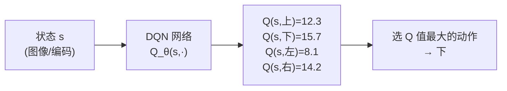
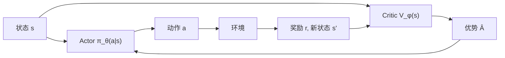
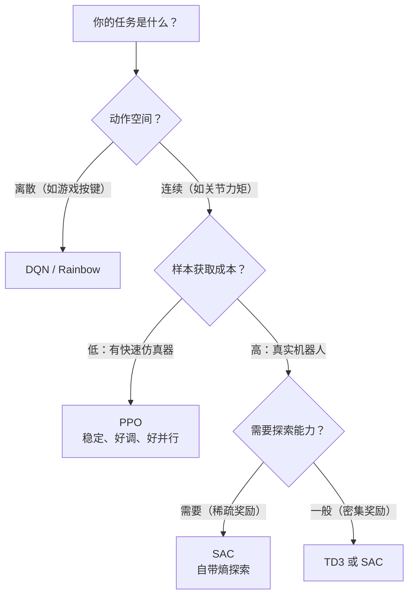
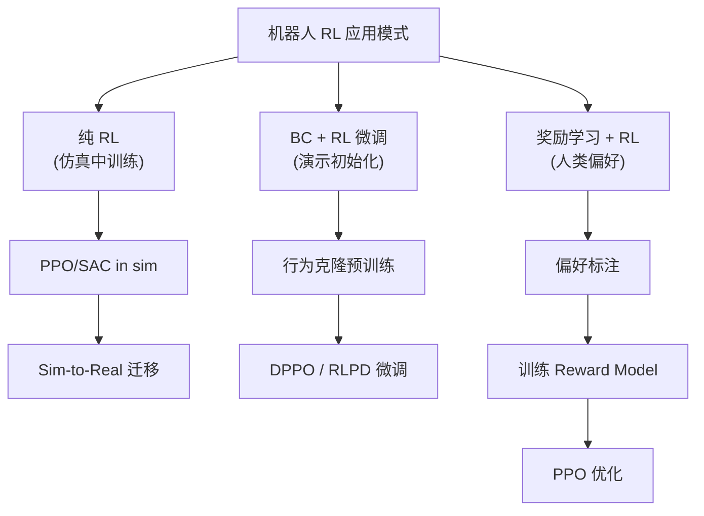

# 深度强化学习方法综述：从 DQN 到 PPO/SAC

> **综述范围**：深度强化学习（Deep RL）核心算法族的演化脉络  
> **关键词**：Value-based、Policy Gradient、Actor-Critic、Off-policy、On-policy  
> **适用读者**：有基础数学能力，想系统理解 Deep RL 算法的小白到进阶读者

## 相关阅读

- [策略梯度与 PPO](/前置知识/000a_前置知识_策略梯度与PPO) — 本文第 5~6 节的详细推导版本
- [行为克隆与 RL 微调范式](/前置知识/000d_前置知识_行为克隆与RL微调范式) — 为什么先 BC 再 RL
- [机器人模仿学习综述](./S02_机器人模仿学习综述) — 模仿学习如何与 RL 结合
- [扩散模型在决策与控制中的应用](./S05_扩散模型在决策与控制中的应用综述) — 扩散策略的 RL 微调

---

## 贯穿全文的例子：迷宫中的小机器人

为了让抽象概念落地，我们用一个贯穿全文的例子：

> **场景**：一个 5×5 网格迷宫，机器人从左上角 (0,0) 出发，目标是到达右下角 (4,4)。
> - **状态 $s$**：机器人当前格子坐标，如 $(2,3)$
> - **动作 $a$**：上、下、左、右 四个方向
> - **奖励 $r$**：每走一步 $r=-1$（鼓励尽快到达），到达终点 $r=+100$
> - **折扣 $\gamma = 0.9$**：未来奖励打折

后面每个算法，我们都会回到这个例子看看它具体怎么工作。

---

## 1. 引言：为什么需要深度强化学习

### 1.1 强化学习的核心问题

强化学习解决的是一个直觉上很自然的问题：**一个智能体通过反复试错，学会在环境中做出好的决策**。

想象你教一只小狗坐下：
- 你不需要告诉它每块肌肉怎么动（不是监督学习）
- 你只需要在它做对时给零食、做错时不给（奖励信号）
- 小狗通过反复尝试，发现"听到'坐下'→屁股着地→有零食"这个模式

强化学习做的就是这件事，只不过"小狗"换成了神经网络。

### 1.2 为什么要"深度"

经典强化学习（如 Q-learning）用一张表格存储每个（状态，动作）对的价值。在我们的迷宫例子中：

- 5×5 网格 × 4 个动作 = 100 个格子需要记录 → 表格完全可以胜任

但如果状态是一张 84×84 的灰度图像（如 Atari 游戏画面）：

- 可能的状态数 = $256^{84 \times 84} \approx 10^{17000}$ → 表格装不下！

**深度神经网络**充当函数逼近器：用有限的参数表示无限大的状态空间到价值/动作的映射。

---

## 2. 问题形式化：MDP

强化学习的数学框架是**马尔可夫决策过程（MDP）**，定义为五元组 $(S, A, P, R, \gamma)$：

$$
\text{MDP} = (S, A, P, R, \gamma)
$$

**这个公式在做什么**：把"强化学习问题"压缩成五个记号，之后任何算法的输入都可以对照这五项去理解。

::: details 📐 公式详解（点击展开）

| 子表达式 | 它是谁 | 它在干嘛（迷宫例子） |
|---------|--------|---------|
| $S$ | **舞台** | 状态空间，所有可能的状态。迷宫里是 25 个格子坐标 |
| $A$ | **可选动作清单** | 动作空间。迷宫里是 {上, 下, 左, 右} |
| $P(s'\|s,a)$ | **世界规则** | 转移概率：执行 $a$ 后落到 $s'$ 的概率。迷宫里执行"右"有 90% 概率到右边格子，10% 会滑到别处 |
| $R(s,a)$ | **计分员** | 奖励函数，每步给的即时反馈。迷宫里每步 $-1$，到终点 $+100$ |
| $\gamma$ | **未来打折系数** | 折扣因子，衡量"未来奖励值多少钱"。迷宫里 $0.9$ 表示明天的 1 块钱只值今天的 0.9 块 |

**用人话读**："一个 MDP 就是'在哪、能做什么、做了会怎样、给不给奖励、未来打几折'这五件事的打包。"

**为什么是这个形式**：这五项恰好穷尽了"决策问题"所需的全部信息——少一项就无法定义"最优策略"是什么；多一项则是冗余（比如显式时间步可以被状态吸收）。
:::

### 2.1 目标：最大化累积折扣回报

智能体的目标是找到策略 $\pi^*$，使得从任意状态出发的**累积折扣回报**最大：

$$
\pi^* = \arg\max_\pi \; \mathbb{E}_\pi \left[\sum_{t=0}^{\infty} \gamma^t R(s_t, a_t)\right]
$$

**这个公式在做什么**：定义"最优策略"到底是什么——它是能让"未来所有折扣奖励加起来的期望"最大的那个决策规则。

::: details 📐 公式详解（点击展开）

| 子表达式 | 它是谁 | 它在干嘛 |
|---------|--------|---------|
| $\pi$ | **决策规则** | "在什么状态下做什么动作"的映射，是我们要找的对象 |
| $\sum_{t=0}^{\infty} \gamma^t R(s_t, a_t)$ | **打折后的总收益** | 把每一步的即时奖励按 $\gamma^t$ 打折后累加，越远的奖励权重越小 |
| $\mathbb{E}_\pi[\cdot]$ | **公平考试** | 因为环境和策略都可能有随机性，同一个策略跑多次结果会不同，取期望消掉这种随机性 |
| $\arg\max_\pi$ | **挑冠军** | 在所有可能的策略里，挑出使上面期望值最大的那一个 |

**用人话读**："在所有决策规则里，找出那个能让未来所有打折奖励加起来的期望值最大的规则。"

**为什么要打折（$\gamma^t$）**：一是数学上保证无穷级数收敛（否则永续奖励可能是无穷大，无法比较优劣）；二是直觉上"越早拿到的奖励越确定、越值钱"。
:::

**代入迷宫数字**：假设最优路径长度是 8 步到达终点：

$$
\text{回报} = \underbrace{(-1) + 0.9 \times (-1) + 0.9^2 \times (-1) + \cdots + 0.9^7 \times (-1)}_{\text{7 步的负惩罚}} + 0.9^8 \times 100
$$

**这个公式在做什么**：把上面抽象的求和公式代入迷宫的具体数字，算出走 8 步到达终点这条轨迹的真实回报是多少。

::: details 📐 公式详解（点击展开）

| 子表达式 | 它是谁 | 它在干嘛 |
|---------|--------|---------|
| $(-1) + 0.9\times(-1) + \cdots + 0.9^7\times(-1)$ | **走路的代价** | 前 7 步每步 $-1$ 的惩罚，按 $\gamma^t$ 逐步打折后累加 |
| $0.9^8 \times 100$ | **到达的奖赏** | 第 8 步到达终点拿到的 $+100$，打了 8 次折 |

**用人话读**："走 8 步到终点的总回报 = 7 步的负惩罚打折累加，再加上第 8 步到达时打折后的 100 分奖励。"

**为什么这样代入**：验证公式在具体轨迹上的行为——奖励越靠后拿到，打的折越多，这正是为什么"更快到达"能拿到更高回报。
:::

$$
= -\frac{1 - 0.9^8}{1 - 0.9} + 0.9^8 \times 100 \approx -5.7 + 43.0 = 37.3
$$

**这个公式在做什么**：用等比数列求和公式把上一步的累加简化成闭式表达式，算出最终数值。

::: details 📐 公式详解（点击展开）

| 子表达式 | 它是谁 | 它在干嘛 |
|---------|--------|---------|
| $-\frac{1-0.9^8}{1-0.9}$ | **惩罚项的闭式解** | 等比数列求和公式，把 7 步 $-1$ 的打折累加压缩成一个分式 |
| $0.9^8 \times 100$ | **奖励项的数值** | 到达终点时打折后的实际得分，约 $43.0$ |
| $\approx -5.7 + 43.0 = 37.3$ | **最终回报** | 两项相加，得到走 8 步到达终点的总回报 |

**用人话读**："惩罚项约扣 5.7 分，奖励项约得 43 分，两者相加最终回报是 37.3 分。"

**为什么要算这个数**：给"回报"这个抽象概念一个具体的参照值，后面对比"20 步到达"时能直观看出差距。
:::

如果走了 20 步才到：回报 ≈ $-8.8 + 0.9^{20} \times 100 \approx -8.8 + 12.2 = 3.4$。所以越快到达终点，回报越高。

### 2.2 值函数：状态值与动作值

为了找到最优策略，我们需要评估"一个状态有多好"和"一个动作有多好"。

**状态值函数** $V^\pi(s)$：从状态 $s$ 出发，按策略 $\pi$ 行动，能拿到多少回报？

$$
V^\pi(s) = \mathbb{E}_\pi\left[\sum_{t=0}^{\infty} \gamma^t R(s_t, a_t) \;\middle|\; s_0 = s\right]
$$

**这个公式在做什么**：给每个状态打一个分——"如果我现在站在这里，按策略 $\pi$ 一直走下去，平均能拿多少总回报"。

::: details 📐 公式详解（点击展开）

| 子表达式 | 它是谁 | 它在干嘛 |
|---------|--------|---------|
| $V^\pi(s)$ | **状态体检分** | 给状态 $s$ 打的分数，越高说明站在这个位置越"有前途" |
| $\sum_{t=0}^{\infty}\gamma^t R(s_t,a_t)$ | **未来总收益** | 与前面 $\pi^*$ 公式里的求和完全一样，衡量从此刻起的打折累积奖励 |
| $s_0 = s$ | **起跑线** | 强制轨迹从状态 $s$ 出发，这是和 $\pi^*$ 公式的唯一区别——那里没固定起点，这里固定了 |
| $\mathbb{E}_\pi[\cdot\mid s_0=s]$ | **条件下的平均** | 在"从 $s$ 出发、按 $\pi$ 决策"这个条件下取期望 |

**用人话读**："状态 $s$ 的价值，就是从这里出发按策略 $\pi$ 一直走下去，平均能拿到的打折总回报。"

**为什么要单独定义 $V$**：$\pi^*$ 的定义只关心"整体平均值"，但训练时我们需要知道"每个具体状态好不好"才能给每一步反馈——$V^\pi(s)$ 就是把整体目标拆到每个状态上的工具。
:::

**迷宫例子**：$V^\pi((4,3)) \approx 0.9 \times 100 - 1 = 89$（离终点一步之遥，值很高）；$V^\pi((0,0)) \approx 37.3$（需要走 8 步）。

**动作值函数** $Q^\pi(s,a)$：在状态 $s$ 执行动作 $a$，之后再按策略 $\pi$ 行动，能拿到多少回报？

$$
Q^\pi(s,a) = \mathbb{E}_\pi\left[\sum_{t=0}^{\infty} \gamma^t R(s_t, a_t) \;\middle|\; s_0 = s, a_0 = a\right]
$$

**这个公式在做什么**：比 $V(s)$ 更细一级——不仅固定起点状态，还固定第一步具体做哪个动作，评估"在 $s$ 做 $a$ 这个组合"值多少分。

::: details 📐 公式详解（点击展开）

| 子表达式 | 它是谁 | 它在干嘛 |
|---------|--------|---------|
| $Q^\pi(s,a)$ | **动作体检分** | 给"在状态 $s$ 执行动作 $a$"这个组合打的分数 |
| $s_0=s,\,a_0=a$ | **锁定第一步** | 强制轨迹第一步固定为 $(s,a)$，第一步之后仍按 $\pi$ 决策 |
| $\sum_{t=0}^{\infty}\gamma^t R(s_t,a_t)$ | **未来总收益** | 和 $V^\pi(s)$ 里一样的打折累积奖励 |

**用人话读**："$Q$ 值回答的问题是：如果我现在在 $s$，非要做动作 $a$（哪怕它不是策略首选），之后再按 $\pi$ 走，总共能拿多少分。"

**为什么 $Q$ 比 $V$ 多一个参数 $a$**：$V$ 只能告诉你"这个位置好不好"，但没法直接比较"这个位置的不同动作哪个更好"——$Q$ 把动作也纳入评分，才能回答"该往哪走"这个决策问题。
:::

**核心关系**：$V^\pi(s) = \sum_a \pi(a|s) \cdot Q^\pi(s,a)$，即状态值 = 所有动作的 Q 值按策略概率加权。

### 2.3 优势函数

**优势函数** $A^\pi(s,a)$：这个动作比"平均水平"好多少？

$$
A^\pi(s,a) = Q^\pi(s,a) - V^\pi(s)
$$

**这个公式在做什么**：算出"这个具体动作"比"这个状态下的平均水平"好多少，是后面策略梯度、PPO 里用来判断"该鼓励还是惩罚"的核心信号。

::: details 📐 公式详解（点击展开）

| 子表达式 | 它是谁 | 它在干嘛 |
|---------|--------|---------|
| $Q^\pi(s,a)$ | **这一个动作的分数** | 具体选了 $a$ 之后能拿多少分 |
| $V^\pi(s)$ | **平均水平线** | 不管选哪个动作，这个状态平均能拿多少分（按策略概率加权后的均值） |
| $A^\pi(s,a)$ | **超出平均的部分** | 两者相减，正数=比平均好，负数=比平均差 |

**用人话读**："这个动作的优势，就是它的得分减去这个状态下所有动作的平均得分。"

**为什么要减去 $V(s)$ 而不是直接用 $Q$**：直接用 $Q$ 做训练信号时，即使所有动作都不错（$Q$ 值都是正的），梯度也会一股劲地把所有动作概率都往上推，无法区分谁更好；减去平均水平后，只有"高于平均"的动作才会被鼓励，这大幅降低了梯度估计的方差（第 4.3 节会展开）。
:::

**迷宫例子**：在 $(2,2)$ 位置，假设 $V((2,2)) = 20$：
- 执行"右"（朝终点方向）：$Q = 25$，所以 $A = 25 - 20 = +5$（好动作）
- 执行"左"（远离终点）：$Q = 10$，所以 $A = 10 - 20 = -10$（坏动作）

优势函数在后面的 PPO 中非常关键——它告诉策略梯度"应该鼓励哪些动作、惩罚哪些动作"。

---

## 3. Value-Based 方法：让 Q 表格变成神经网络

### 3.1 经典 Q-Learning 回顾

在表格时代，Q-learning 的更新规则是：

$$
Q(s,a) \leftarrow Q(s,a) + \alpha \left[r + \gamma \max_{a'} Q(s', a') - Q(s,a)\right]
$$

**这个公式在做什么**：让 $Q(s,a)$ 的估计值朝着"更靠谱的目标"挪一点点，每交互一步就更新一次，最终收敛到真实的 $Q^*$。

::: details 📐 公式详解（点击展开）

| 子表达式 | 它是谁 | 它在干嘛 |
|---------|--------|---------|
| $Q(s,a)$（左侧） | **更新后的估计** | 挪动之后的新数值 |
| $r + \gamma\max_{a'}Q(s',a')$ | **TD 目标** | 实际拿到的奖励 + 下一状态能拿到的最优估计值，被当作"更靠谱的参考答案" |
| $Q(s,a)$（右侧减法里的） | **当前估计** | 挪动之前的旧数值 |
| $\big[\text{TD 目标} - Q(s,a)\big]$ | **TD 误差** | 目标和当前估计的差距，也叫"惊讶程度" |
| $\alpha$ | **步子大小** | 学习率，决定每次朝目标挪多远，太大会震荡、太小学得慢 |

**用人话读**："当前估计和'实际奖励+下一步最优估计'之间有多少差距，就朝这个差距的方向挪一小步（挪多少由学习率决定）。"

**为什么用 $\max_{a'}$ 而不是按策略采样**：Q-learning 是 off-policy 的，它假设"之后会一直选最优动作"，所以直接取下一状态所有动作里最大的 $Q$ 值作为参考，这样学到的是最优策略对应的 $Q^*$，而不是当前行为策略的 $Q^\pi$。
:::

**迷宫数值例子**：

机器人在 $(2,2)$，执行"右"，到达 $(2,3)$，获得 $r=-1$。
- 当前估计：$Q((2,2), \text{右}) = 15$
- 下一状态最优值：$\max_a Q((2,3), a) = 22$
- TD 目标：$-1 + 0.9 \times 22 = 18.8$
- TD 误差：$18.8 - 15 = 3.8$
- 更新：$Q((2,2), \text{右}) \leftarrow 15 + 0.1 \times 3.8 = 15.38$

每次交互一步，Q 值就朝真实值移动一点点。经过成千上万次更新，表格收敛到最优 $Q^*$。

### 3.2 DQN：用神经网络替代 Q 表格（2015）

当状态是图像时，表格不可行。DQN（Deep Q-Network）的核心思想：**用一个神经网络 $Q_\theta(s,a)$ 来近似整张 Q 表格**。

输入一张游戏画面 $s$，网络输出所有动作的 Q 值：

$$
Q_\theta(s, \cdot) : \text{84×84 图像} \to [Q(s, \text{上}), Q(s, \text{下}), Q(s, \text{左}), Q(s, \text{右})]
$$

**这个公式在做什么**：说明 DQN（Deep Q-Network，深度 Q 网络——用神经网络逼近整张 Q 表格的方法）的输入输出形态——一张图像进去，四个动作的 Q 值一次性全部出来。

::: details 📐 公式详解（点击展开）

| 子表达式 | 它是谁 | 它在干嘛 |
|---------|--------|---------|
| $Q_\theta$ | **可训练的打分网络** | 参数为 $\theta$ 的神经网络，替代了原来存不下的 Q 表格 |
| $\text{84×84 图像}$ | **网络输入** | 一帧游戏画面，作为当前状态 $s$ 的表示 |
| $[Q(s,\text{上}),\dots,Q(s,\text{右})]$ | **网络输出** | 一次前向传播同时给出所有候选动作的 Q 值，不需要为每个动作单独跑一次网络 |

**用人话读**："把一张游戏画面丢进网络，网络一次性吐出'上下左右'这四个动作各自的打分。"

**为什么要一次性输出所有动作的 Q 值**：如果要对每个动作单独输入网络算一次 $Q(s,a)$，动作多时开销成倍增加；把动作维度放在输出端，一次前向传播就能拿到 $\max_{a'}Q(s',a')$ 需要的全部信息，训练和推理都更高效。
:::

但直接用神经网络做 Q-learning 训练会崩溃，原因有二：

**问题 1：数据相关性**。相邻帧的 $(s,a,r,s')$ 高度相关（$s$ 和 $s'$ 几乎一样），梯度方向来回震荡。

**解决：经验回放（Experience Replay）**。把所有交互数据 $(s_t, a_t, r_t, s_{t+1})$ 扔进一个大缓冲区 $\mathcal{D}$（如存 100 万条），训练时随机抽取一个 mini-batch（如 32 条），打破时序相关性。

**问题 2：目标漂移**。训练目标 $r + \gamma \max_{a'} Q_\theta(s', a')$ 本身也在变（因为 $\theta$ 在更新），相当于"你追一个也在跑的目标"。

**解决：目标网络（Target Network）**。维护一份延迟更新的参数 $\theta^-$（每 10000 步才同步一次），用它算 TD 目标：

$$
L(\theta) = \mathbb{E}_{(s,a,r,s') \sim \mathcal{D}}\left[\left(r + \gamma \max_{a'} Q_{\theta^-}(s', a') - Q_\theta(s, a)\right)^2\right]
$$

**这个公式在做什么**：把表格版 Q-learning 的更新规则改写成一个可以用梯度下降优化的损失函数，用经验回放和目标网络解决神经网络训练不稳定的问题。

::: details 📐 公式详解（点击展开）

| 子表达式 | 它是谁 | 它在干嘛 |
|---------|--------|---------|
| $\mathcal{D}$ | **经验回放缓冲区** | 存了过去几十万条 $(s,a,r,s')$ 交互记录的大仓库 |
| $\mathbb{E}_{(s,a,r,s')\sim\mathcal{D}}$ | **随机抽样考试** | 训练时从 $\mathcal{D}$ 里随机抽一个 mini-batch（如 32 条），打破相邻帧之间的时序相关性 |
| $r+\gamma\max_{a'}Q_{\theta^-}(s',a')$ | **稳定的靶子** | TD 目标，用延迟更新的目标网络参数 $\theta^-$ 算出来，短期内基本不变 |
| $Q_\theta(s,a)$ | **当前网络的猜测** | 用正在训练、每步都在变的参数 $\theta$ 算出的预测值 |
| $(\cdot)^2$ | **偏差惩罚** | 均方误差，猜测和靶子差得越多惩罚越大 |

**用人话读**："从回放缓冲区随机抽一批过去的经验，让当前网络的预测去逼近'用旧网络算出的、比较稳定的目标值'，用均方误差衡量差距。"

**为什么要用 $\theta^-$ 而不是 $\theta$ 算目标**：如果目标和预测用同一套参数，目标会随着每次梯度更新同步漂移，相当于"追一个也在跑的靶子"，训练容易发散；固定一份延迟更新的 $\theta^-$（如每 10000 步同步一次）能让目标短期稳定，训练更容易收敛。
:::

**迷宫例子（假设用 one-hot 编码状态）**：
- 网络输入：25 维 one-hot（表示在哪个格子）
- 网络输出：4 维向量（上/下/左/右的 Q 值）
- 训练：从缓冲区采 32 条经验，计算 MSE loss，反向传播更新

```mermaid
flowchart LR
    A["状态 s<br/>(图像/编码)"] --> B["DQN 网络<br/>Q_θ(s,·)"]
    B --> C["Q(s,上)=12.3<br/>Q(s,下)=15.7<br/>Q(s,左)=8.1<br/>Q(s,右)=14.2"]
    C --> D["选 Q 值最大的动作<br/>→ 下"]
```

### 3.3 DQN 的改进家族

DQN 之后出现了一系列改进，每个都解决一个具体问题：

#### Double DQN（2016）：解决 Q 值过估计

**问题**：$\max_{a'} Q_{\theta^-}(s', a')$ 天然会过估计——当估计有噪声时，取 max 会偏向高估的那个。

**类比**：你问 5 个人"你觉得自己数学几分？"然后取最高分当代表 → 一定偏高。

**解决**：把"选动作"和"评估动作"分开：

$$
y = r + \gamma \, Q_{\theta^-}\!\left(s', \;\underbrace{\arg\max_{a'} Q_\theta(s', a')}_{\text{用当前网络选动作}}\right)
$$

**这个公式在做什么**：把"选哪个动作最好"和"这个动作到底值多少分"这两件事分给两个不同的网络做，减少 Q 值的系统性过估计。

::: details 📐 公式详解（点击展开）

| 子表达式 | 它是谁 | 它在干嘛 |
|---------|--------|---------|
| $\arg\max_{a'}Q_\theta(s',a')$ | **提名委员** | 用当前网络 $\theta$ 在下一状态里挑出它认为最好的动作 |
| $Q_{\theta^-}(s',\cdot)$ | **独立评委** | 用另一套（目标）网络 $\theta^-$ 给这个被提名的动作打分 |
| $y$ | **最终目标值** | 把评委打的分加上即时奖励 $r$，作为新的 TD 目标 |

**用人话读**："先让一个网络提名'下一步该做哪个动作'，再让另一个网络单独给这个被提名的动作打分，而不是让同一个网络又选又打分。"

**为什么这样能减少过估计**：如果选动作和打分用同一个有噪声的网络，噪声会让"恰好被高估的那个动作"更容易被 $\arg\max$ 选中，导致系统性偏高；换成两个独立（或至少不完全同步）的网络后，提名和打分的噪声不再强相关，高估的偏差会被大幅抵消。
:::

#### Dueling DQN（2016）：分离"状态好不好"和"动作好不好"

网络输出分成两支：

$$
Q_\theta(s, a) = V_\theta(s) + A_\theta(s, a) - \frac{1}{|A|}\sum_{a'} A_\theta(s, a')
$$

**这个公式在做什么**：把网络拆成两支分别学"状态本身好不好"和"这个动作比其他动作好多少"，再重新拼回 Q 值，让"状态好坏"不需要为每个动作单独学一遍。

::: details 📐 公式详解（点击展开）

| 子表达式 | 它是谁 | 它在干嘛 |
|---------|--------|---------|
| $V_\theta(s)$ | **状态基础分** | 这个状态本身的价值，和具体选哪个动作无关 |
| $A_\theta(s,a)$ | **动作加分/减分** | 这个动作相对于该状态平均水平的偏移量 |
| $\frac{1}{\lvert A\rvert}\sum_{a'}A_\theta(s,a')$ | **归零校正项** | 减去所有动作的平均优势，强制让 $A_\theta$ 的均值为 0，避免 $V$ 和 $A$ 的分解不唯一 |

**用人话读**："一个动作的 Q 值 = 这个状态的基础分 + 这个动作比平均水平多出来的部分（减去平均值做校正）。"

**为什么要减去平均优势项**：如果不做这个归零校正，$V_\theta(s)+A_\theta(s,a)$ 存在无穷多种拆法都能拼出同一个 Q 值（比如把 $V$ 加 10、把所有 $A$ 都减 10 结果不变），网络学不出唯一确定的 $V$ 和 $A$；强制 $A$ 的均值为零后，$V_\theta(s)$ 就被唯一确定为"该状态下所有动作 Q 值的平均"，两支网络才各自学到了有意义的东西。
:::

**为什么有用**：在很多状态下，无论做什么动作结果差不多（比如你在开阔道路上，左右偏一点都行）。Dueling 让网络可以专注学习"这个状态本身好不好"，不需要为每个动作分别学。

#### Rainbow（2018）：六合一

Rainbow 把 6 项改进组合起来：Double DQN + Dueling + Prioritized Replay + Multi-step + Distributional RL + Noisy Nets。单独每项改进提升有限，组合起来效果翻倍。

| 改进 | 解决的问题 |
|------|-----------|
| Double | 过估计 |
| Dueling | 状态/动作价值分离 |
| Prioritized Replay | 重要经验多学几次 |
| Multi-step | 减少偏差（用 n 步回报） |
| Distributional (C51) | 学价值分布而非均值 |
| Noisy Nets | 更聪明的探索 |

### 3.4 Value-Based 方法的局限

DQN 系列有两个根本限制：

1. **只能处理离散动作**：$\max_{a'} Q(s', a')$ 需要遍历所有动作。如果动作是连续的（如机器人关节力矩 $\in [-1, 1]^7$），无法枚举。
2. **只能学确定性策略**：总是选 Q 值最大的动作，无法输出"70% 概率走右、30% 概率走下"这样的随机策略。

→ 需要 **Policy Gradient** 方法。

---

## 4. Policy Gradient：直接优化策略

### 4.1 核心思想

Policy Gradient 方法换了一个角度：**不再估计 Q 值，而是直接参数化策略并优化它**。

策略 $\pi_\theta(a|s)$ 是一个神经网络：输入状态 $s$，输出每个动作的概率分布。

**迷宫例子**：
- 输入：当前位置 $(2,2)$ 的 one-hot 编码
- 输出：softmax 概率 $[\text{上}:0.1, \text{下}:0.3, \text{左}:0.1, \text{右}:0.5]$
- 按概率采样一个动作执行

### 4.2 REINFORCE 算法

REINFORCE 的更新规则：

$$
\nabla_\theta J(\theta) = \mathbb{E}_{\tau \sim \pi_\theta}\left[\sum_{t=0}^{T} \nabla_\theta \log \pi_\theta(a_t|s_t) \cdot G_t\right]
$$

**这个公式在做什么**：告诉网络参数 $\theta$ 该往哪个方向调——如果一个动作带来了高回报，就增加它的概率；带来了低回报，就降低它。

::: details 📐 公式详解（点击展开）

| 子表达式 | 它是谁 | 它在干嘛 |
|---------|--------|---------|
| $\tau \sim \pi_\theta$ | **一次完整试跑** | 用当前策略收集一整条轨迹 $\tau=(s_0,a_0,r_0,s_1,\dots)$ |
| $\nabla_\theta\log\pi_\theta(a_t\|s_t)$ | **提概率的方向盘** | 沿这个方向调 $\theta$，会让策略更倾向于在 $s_t$ 选择 $a_t$ |
| $G_t=\sum_{k=t}^T\gamma^{k-t}r_k$ | **这个动作事后的算总账** | 从时刻 $t$ 往后数，实际拿到的打折累积回报 |
| $\nabla_\theta\log\pi_\theta(a_t\|s_t)\cdot G_t$ | **加权推力** | 用 $G_t$ 当权重去缩放"提概率方向"——$G_t$ 越大推得越用力 |
| $\mathbb{E}_{\tau\sim\pi_\theta}\big[\sum_t(\cdot)\big]$ | **多次试跑取平均** | 对采集到的多条轨迹、每条轨迹的每个时间步都做上述加权，取平均得到最终梯度 |

**用人话读**："把每一步'该往哪调概率'的方向，按这一步实际算总账拿到的回报大小去加权，回报越高推得越用力，加起来就是整体的更新方向。"

**为什么用 $\log\pi_\theta$ 而不是直接用 $\pi_\theta$**：策略梯度定理推导中，对期望求梯度时用到恒等式 $\nabla_\theta\pi_\theta=\pi_\theta\nabla_\theta\log\pi_\theta$，这样才能把梯度写成"用 $\pi_\theta$ 采样、再乘以 $\log$ 梯度"的形式，从而可以用蒙特卡洛采样估计——这正是策略梯度方法能落地的关键技巧，完整推导见 [策略梯度与 PPO 前置知识](/前置知识/000a_前置知识_策略梯度与PPO)。
:::

**代入迷宫数字**：

在 $(2,2)$ 执行了"右"，之后走了 6 步到达终点：
- $G_t = -1 + 0.9 \times (-1) + ... + 0.9^5 \times 100 \approx 55.1$（正值，说明这是好的选择）
- 梯度方向：增加 $\pi_\theta(\text{右}|(2,2))$ 的概率

另一次在 $(2,2)$ 执行了"左"，走了 20 步才到终点：
- $G_t \approx 3.4$（也是正值，但很小）
- 梯度方向：只很轻微地增加 $\pi_\theta(\text{左}|(2,2))$

经过很多次采样，"右"获得的平均 $G_t$ 远高于"左"，所以策略逐渐偏向"右"。

### 4.3 方差问题与基线

REINFORCE 有一个严重问题：**方差极大**。

**类比**：你想评价一家餐厅好不好，随机去吃了一次——可能碰巧点到了最好/最差的菜，结论很不稳定。你需要去很多次才能得到可靠评价。

$G_t$ 的方差来源于：
- 环境的随机性
- 策略本身的随机性
- 后续所有奖励的累加放大了噪声

**解决：引入基线（Baseline）**

$$
\nabla_\theta J(\theta) = \mathbb{E}\left[\sum_{t} \nabla_\theta \log \pi_\theta(a_t|s_t) \cdot (G_t - b(s_t))\right]
$$

**这个公式在做什么**：在原来的 REINFORCE 梯度里，把权重从"绝对回报 $G_t$"换成"相对回报 $G_t - b(s_t)$"，在不改变梯度期望的前提下大幅降低方差。

::: details 📐 公式详解（点击展开）

| 子表达式 | 它是谁 | 它在干嘛 |
|---------|--------|---------|
| $G_t$ | **绝对总账** | 和前面 REINFORCE 公式里一样的累积折扣回报 |
| $b(s_t)$ | **参照基准** | 通常用 $V(s_t)$ 的估计，代表"这个状态平均能拿多少分" |
| $G_t - b(s_t)$ | **相对好坏** | 这次实际拿到的回报，比这个状态的平均水平高出/低出多少 |
| $\nabla_\theta\log\pi_\theta(a_t\|s_t)\cdot(G_t-b(s_t))$ | **降噪后的加权推力** | 用"相对好坏"而不是"绝对总账"去缩放提概率方向 |

**用人话读**："不再用这次拿到的绝对回报去加权，而是用'这次比平时好多少'去加权，方向不变但信号更干净。"

**为什么减去基线不改变梯度期望，却能降方差**：数学上可以证明 $\mathbb{E}\big[\nabla_\theta\log\pi_\theta(a_t|s_t)\cdot b(s_t)\big]=0$（只要 $b$ 不依赖动作 $a_t$），所以减去它不会引入偏差；但 $G_t$ 本身波动很大（不同轨迹差异巨大），减去一个与它高度相关的 $b(s_t)$ 后，剩余的 $G_t-b(s_t)$ 波动幅度显著变小，梯度估计的方差随之下降。
:::

**迷宫数字**：假设 $V((2,2)) = 30$
- 走"右"得到 $G_t = 55.1$ → 优势 $= 55.1 - 30 = +25.1$（明确的正信号）
- 走"左"得到 $G_t = 3.4$ → 优势 $= 3.4 - 30 = -26.6$（明确的负信号）
- 有了基线，好/坏动作的区分更清晰

这就引出了 **Actor-Critic** 框架：Actor 是策略网络，Critic 是价值网络（提供基线）。

### 4.4 GAE：平衡偏差与方差

如何估计优势 $A_t$ 有多种方式，Schulman 提出的 **GAE**（Generalized Advantage Estimation）是一种优雅的折中方案。

首先定义 **TD 误差**（一步优势估计）：

$$
\delta_t = r_t + \gamma V(s_{t+1}) - V(s_t)
$$

**这个公式在做什么**：算一步"惊喜/失望程度"——走了一步之后，实际情况比之前预期的好还是差。

::: details 📐 公式详解（点击展开）

| 子表达式 | 它是谁 | 它在干嘛 |
|---------|--------|---------|
| $r_t + \gamma V(s_{t+1})$ | **走一步后的新预期** | 实际拿到的即时奖励，加上走到新状态后 Critic 给出的估值 |
| $V(s_t)$ | **走之前的旧预期** | 站在原地时 Critic 对这个状态的估值 |
| $\delta_t$ | **一步的惊喜值** | 新预期减旧预期，正值="比预期更好"，负值="比预期更差" |

**用人话读**："走了一步之后，把'拿到的奖励+新位置的估值'和'原来位置的估值'相减，就是这一步带来的惊喜或失望。"

**为什么这就是最简单的优势估计**：$\delta_t$ 本质上是 $A(s_t,a_t)=Q(s_t,a_t)-V(s_t)$ 的一个近似——用 $r_t+\gamma V(s_{t+1})$ 去估计 $Q(s_t,a_t)$，只往前看一步，所以噪声小（低方差）但依赖 $V$ 估计准不准（有偏差），这正是 GAE 要解决的权衡问题。
:::

然后 GAE 对多步 TD 误差做指数加权平均：

$$
\hat{A}_t^{\text{GAE}(\gamma,\lambda)} = \sum_{l=0}^{\infty} (\gamma\lambda)^l \delta_{t+l}
$$

**这个公式在做什么**：把"只看一步"（$\delta_t$，低方差高偏差）和"看到底"（蒙特卡洛，低偏差高方差）之间做一个可调节的折中，用一个参数 $\lambda$ 控制往未来看多远。

::: details 📐 公式详解（点击展开）

| 子表达式 | 它是谁 | 它在干嘛 |
|---------|--------|---------|
| $\delta_{t+l}$ | **第 $l$ 步之后的惊喜值** | 未来第 $t+l$ 步的一步 TD 误差 |
| $l$ | **往前看的步数** | 从 0 开始，理论上一直加到无穷远（实践中到轨迹结束） |
| $(\gamma\lambda)^l$ | **指数衰减权重** | 越远的 $\delta$ 权重越小，$\gamma\lambda$ 是每多看一步的折扣率 |
| $\lambda\in[0,1]$ | **偏差-方差调节旋钮** | 控制衰减速度，间接控制"看多远"，是 GAE 的核心超参数 |
| $\hat A_t^{\text{GAE}}$ | **最终优势估计** | 所有未来 $\delta$ 按权重加总的结果，作为 $A(s_t,a_t)$ 的估计值 |

**用人话读**："把从现在起的每一步'惊喜值'按越远越不可信的权重加起来，就是这一步动作的优势估计，$\lambda$ 决定这个权重衰减得有多快。"

**为什么 $\lambda$ 的两个极端分别对应一步 TD 和蒙特卡洛**：当 $\lambda=0$ 时只有 $l=0$ 那一项权重非零，退化成 $\delta_t$（只看一步，依赖 $V$ 准不准，偏差高方差低）；当 $\lambda=1$ 时权重变成纯 $\gamma^l$，展开后正好等于 $G_t-V(s_t)$（看到轨迹结束，不依赖 $V$，偏差低方差高）——中间取值就是两者的加权混合，实践中 $\lambda=0.95$ 通常是较好的折中点。
:::

**$\lambda$ 的两个极端**：
- $\lambda = 0$：$\hat{A}_t = \delta_t = r_t + \gamma V(s_{t+1}) - V(s_t)$ — 只看一步，偏差高（依赖 $V$ 准确）、方差低
- $\lambda = 1$：$\hat{A}_t = G_t - V(s_t)$ — 看到底，偏差低（不依赖 $V$）、方差高

实践中 $\lambda = 0.95$ 是常见选择。

**迷宫数字例子**（$\lambda=0.95$，$\gamma=0.9$）：

在 $(2,2)$ 执行"右"后的轨迹：$(2,2) \to (2,3) \to (2,4) \to (3,4) \to (4,4)$

假设 $V(2,2)=30, V(2,3)=35, V(2,4)=50, V(3,4)=89, V(4,4)=100$：
- $\delta_0 = -1 + 0.9 \times 35 - 30 = 0.5$
- $\delta_1 = -1 + 0.9 \times 50 - 35 = 9.0$
- $\delta_2 = -1 + 0.9 \times 89 - 50 = 29.1$
- $\delta_3 = -1 + 0.9 \times 100 - 89 = 0$（到终点了）

$$
\hat{A}_0 = 0.5 + 0.855 \times 9.0 + 0.855^2 \times 29.1 + 0.855^3 \times 0 \approx 0.5 + 7.7 + 21.3 = 29.5
$$

**这个公式在做什么**：把上面算出的四个 $\delta$ 值代入 GAE 公式，算出"在 $(2,2)$ 执行右"这个动作的具体优势数值。

::: details 📐 公式详解（点击展开）

| 子表达式 | 它是谁 | 它在干嘛 |
|---------|--------|---------|
| $0.5$（即 $(\gamma\lambda)^0\delta_0$） | **当下这一步的惊喜** | 权重为 1（$l=0$），直接取 $\delta_0=0.5$ |
| $0.855\times9.0$ | **下一步的惊喜，打了一次折** | $\gamma\lambda=0.9\times0.95=0.855$，乘以 $\delta_1=9.0$ |
| $0.855^2\times29.1$ | **再下一步的惊喜，打两次折** | 权重 $0.855^2\approx0.731$，乘以 $\delta_2=29.1$，是最大的一项，因为这一步的惊喜值本身很大 |
| $0.855^3\times 0$ | **到达终点那一步** | $\delta_3=0$（到终点后没有更多惊喜），这一项贡献为 0 |

**用人话读**："把四步的惊喜值按越远越打折的权重加起来，算出总优势约 29.5。"

**为什么这个数值远大于单步 $\delta_0=0.5$**：因为往后几步（尤其是接近终点那一步）的惊喜值都很大且正，GAE 把它们也纳入了考虑（只是打了折），所以能捕捉到"这条路径整体上比预期好很多"，而不只是第一步的微小惊喜。
:::

很大的正优势，确认"右"是好动作。

更多细节请参考 [策略梯度与 PPO 前置知识](/前置知识/000a_前置知识_策略梯度与PPO)。

---

## 5. Actor-Critic 方法

### 5.1 框架概述

Actor-Critic 同时维护两个网络：

- **Actor（演员）**$\pi_\theta(a|s)$：策略网络，决定做什么动作
- **Critic（评论家）**$V_\phi(s)$：价值网络，评估当前状态有多好

两者相互配合：Critic 的评估为 Actor 提供低方差的优势估计，Actor 的行为为 Critic 提供训练数据。

```mermaid
flowchart LR
    S["状态 s"] --> Actor["Actor π_θ(a|s)"]
    S --> Critic["Critic V_φ(s)"]
    Actor --> A["动作 a"]
    A --> Env["环境"]
    Env --> R["奖励 r, 新状态 s'"]
    R --> Critic
    Critic --> Adv["优势 Â"]
    Adv --> Actor
```

### 5.2 TRPO：保守更新（2015）

REINFORCE 和基础 Actor-Critic 有个问题：**学习率太大会崩，太小则学不动**。Schulman 的 TRPO 引入了一个优雅的解决方案——**信赖域（Trust Region）**。

核心思想：每次更新策略时，限制新旧策略之间的"距离"不超过 $\delta$：

$$
\max_\theta \;\mathbb{E}\left[\frac{\pi_\theta(a|s)}{\pi_{\theta_{\text{old}}}(a|s)} \hat{A}(s,a)\right] \quad \text{s.t.} \quad \mathbb{E}\left[D_{\text{KL}}(\pi_{\theta_{\text{old}}} \| \pi_\theta)\right] \leq \delta
$$

**这个公式在做什么**：在"用旧策略的数据评估新策略"的同时，给新旧策略之间的差异加一个硬性上限，防止一步更新太猛导致策略崩溃。

::: details 📐 公式详解（点击展开）

| 子表达式 | 它是谁 | 它在干嘛 |
|---------|--------|---------|
| $\frac{\pi_\theta(a\|s)}{\pi_{\theta_{\text{old}}}(a\|s)}$ | **重要性采样比值** | 新策略和旧策略对同一动作的概率之比，用来修正"拿旧数据评估新策略"带来的偏差 |
| $\hat{A}(s,a)$ | **动作打分器** | GAE 给出的优势估计，告诉我们这个动作比平均好多少 |
| $\max_\theta\mathbb{E}[\cdot]$ | **优化目标** | 想让"新旧概率比 × 优势"的期望尽可能大，也就是让新策略更偏向好动作 |
| $D_{\text{KL}}(\pi_{\theta_{\text{old}}}\|\pi_\theta)$ | **距离尺** | KL 散度，衡量新旧策略这两个概率分布差多远 |
| $\text{s.t. }\mathbb{E}[D_{\text{KL}}]\le\delta$ | **安全圈约束** | 强制这个距离不能超过 $\delta$，即"信赖域" |

**用人话读**："在'新旧策略差距不能超过 $\delta$'这个安全约束下，找一个新策略，使得用重要性采样比值加权后的优势期望最大。"

**为什么需要重要性采样比值**：$\hat A(s,a)$ 是用旧策略 $\pi_{\theta_{\text{old}}}$ 收集数据算出来的，但目标函数要评估的是新策略 $\pi_\theta$ 的表现；比值项相当于把"旧策略下的样本"重新加权，修正成"新策略下期望值"的无偏估计。

**为什么需要 KL 约束**：如果没有约束，$\arg\max$ 可能找到一个让比值项无限大但实际上偏离旧策略太远的 $\theta$，导致重要性采样的方差爆炸、评估完全失真；限制 KL 距离能保证新旧策略"足够接近"，重要性采样的近似才靠得住。
:::

**类比**：你站在山上想往高处走（最大化目标），但不允许一步跨出安全圈（$\delta$），因为圈外的地形你看不清，可能是悬崖。

**问题**：TRPO 需要计算 Fisher 信息矩阵和共轭梯度法求解约束优化，实现复杂、计算量大。

### 5.3 PPO：用 Clip 替代约束（2017）

PPO（Proximal Policy Optimization）是 TRPO 的简化版，用一个巧妙的 **clip 技巧**替代 KL 约束，实现简单、效果相当。

定义概率比值：

$$
r_t(\theta) = \frac{\pi_\theta(a_t|s_t)}{\pi_{\theta_{\text{old}}}(a_t|s_t)}
$$

**这个公式在做什么**：定义一个单一数字，衡量"新策略比旧策略更喜欢这个动作多少倍"，作为后面 clip 操作的对象。

::: details 📐 公式详解（点击展开）

| 子表达式 | 它是谁 | 它在干嘛 |
|---------|--------|---------|
| $\pi_\theta(a_t\|s_t)$ | **新策略的态度** | 更新后的策略选这个动作的概率 |
| $\pi_{\theta_{\text{old}}}(a_t\|s_t)$ | **旧策略的态度** | 采集数据时那个策略选这个动作的概率 |
| $r_t(\theta)$ | **喜好变化倍数** | 两者相除，$>1$ 说明新策略更喜欢这个动作，$<1$ 说明更不喜欢 |

**用人话读**："新策略选这个动作的概率除以旧策略选它的概率，就是这个动作'受欢迎程度'的变化倍数。"

**为什么用比值而不是差值**：概率天然在 $[0,1]$ 之间，用比值可以自然地表达"相对变化幅度"（如"提高了 50%"），并且这正是 TRPO 里重要性采样比值的记法，方便直接套用后面的 clip 机制。
:::

PPO 的 Clip 目标：

$$
L^{\text{CLIP}}(\theta) = \mathbb{E}\left[\min\left(r_t(\theta)\hat{A}_t, \;\text{clip}(r_t(\theta), 1-\epsilon, 1+\epsilon)\hat{A}_t\right)\right]
$$

**这个公式在做什么**：用一个廉价的 clip 操作代替 TRPO 昂贵的 KL 约束优化，让策略更新自动"限速"，是 PPO 真正拿去做梯度上升的目标函数。

::: details 📐 公式详解（点击展开）

**这是整个现代 RL 最重要的公式之一，让我们掰碎了看：**

**$r_t(\theta)$ 的含义**：

| $r_t$ 的值 | 含义 |
|------------|------|
| $r_t = 1$ | 新旧策略对这个动作的概率完全一样 |
| $r_t = 1.5$ | 新策略把这个动作的概率提高了 50% |
| $r_t = 0.5$ | 新策略把这个动作的概率降低了 50% |

**clip 函数的作用**：

$\text{clip}(r, 0.8, 1.2)$ 把 $r$ 限制在 $[0.8, 1.2]$ 范围内（$\epsilon=0.2$ 时）：
- $r=1.5 \to 1.2$（太高了，截断）
- $r=0.3 \to 0.8$（太低了，截断）
- $r=1.1 \to 1.1$（在范围内，不动）

**min 的巧妙之处**：

分两种情况讨论：

**情况 1：$\hat{A}_t > 0$（这是好动作，要鼓励）**

我们想增加 $r_t$（提高这个动作的概率），但：
- 如果 $r_t$ 已经超过 $1+\epsilon$，clip 后变成 $1+\epsilon$，$\min$ 选 clip 项 → 梯度为 0，不再鼓励
- 效果：**已经鼓励够了就停手**

**情况 2：$\hat{A}_t < 0$（这是坏动作，要惩罚）**

我们想降低 $r_t$（减小这个动作的概率），但：
- 如果 $r_t$ 已经低于 $1-\epsilon$，clip 后变成 $1-\epsilon$，$\min$ 选 clip 项 → 梯度为 0，不再惩罚
- 效果：**已经惩罚够了就停手**

**代入完整数字**（$\epsilon = 0.2$）：

| 场景 | $r_t$ | $\hat{A}_t$ | 未裁剪项 | 裁剪项 | 取 min | 含义 |
|------|--------|-------------|----------|--------|--------|------|
| 好动作，适度鼓励 | 1.1 | +10 | 11 | 11 | 11 | 正常梯度 |
| 好动作，过度鼓励 | 1.5 | +10 | 15 | 12 | **12** | 限制住了 |
| 坏动作，适度惩罚 | 0.9 | -10 | -9 | -9 | -9 | 正常梯度 |
| 坏动作，过度惩罚 | 0.3 | -10 | -3 | -8 | **-8** | 限制住了 |

**用人话读**："算出新旧策略对这个动作喜好程度的比值，乘以这个动作的好坏分；但如果比值想跑出 $[1-\epsilon,1+\epsilon]$ 太远，就不再给更多奖励——好动作鼓励到位就停手，坏动作惩罚到位也停手。"

**为什么是这个形式**：这是 TRPO 用 KL 散度做硬约束的简化版——用一个几乎零成本的 clip 操作代替昂贵的约束优化，效果相近但实现简单得多。
:::

PPO 因为实现简单、效果好、超参数不敏感，成为目前使用最广泛的 on-policy RL 算法。OpenAI Five（Dota）、ChatGPT 的 RLHF、机器人运动控制都用 PPO。

更完整的 PPO 推导见 [策略梯度与 PPO 前置知识](/前置知识/000a_前置知识_策略梯度与PPO)。

---

## 6. Off-Policy Actor-Critic：连续动作空间

PPO 是 on-policy 的——每次更新后旧数据必须丢弃（因为策略变了，旧数据的重要性权重不再准确）。这导致**样本效率低**：真实机器人每条轨迹都很贵，扔掉太浪费。

Off-policy 方法可以**复用历史数据**，极大提升样本效率。

> **术语澄清：本节的 Critic 全部是 $Q(s,a)$，不是 $V(s)$**
>
> DDPG、TD3、SAC 三个算法的 Critic 统一是 $Q_\phi(s,a)$——输入状态和动作，输出这个"状态-动作对"的价值。这不是随意的写法约定，而是被 Actor 更新的方式决定的：Actor 需要一个关于动作可求梯度的信号（$\nabla_a Q$，见下文 6.1 节），告诉它"动作往哪个方向调能涨分"；而 $V(s)$ 已经把动作积掉了（$V(s)=\mathbb{E}_{a\sim\pi}[Q(s,a)]$，关系式详见 [Q 函数与 Value 函数](/前置知识/000o_前置知识_Q函数与Value函数) 第三节），单独一个 $V(s)$ 回答不了"这个状态下哪个动作更好"，Actor 拿不到更新方向。所以只要是走**端到端确定性/随机策略梯度**这条路线的在线 off-policy 方法，Critic 必须是 Q，没有例外。
>
> 用 $V(s)$ 做 Critic 主体（或用 $V(s)$ 替换 TD bootstrap 目标）的做法出现在**离线 RL**里，代表是 IQL（见 [离线强化学习基础](/前置知识/000s_前置知识_离线强化学习基础) 第 3.3 节）——目的是让 TD 目标不查询数据外的动作，规避离线场景特有的**外推误差**（Extrapolation Error，policy 被 Q 网络对未见动作的过度乐观估计带偏）。这是离线场景下为了规避风险专门做的妥协，不是标准 actor-critic 的默认选择；本节讨论的 DDPG/TD3/SAC 都是在线算法，持续交互能不断纠正被高估的动作，用 Q 是默认且没有争议的选择。

### 6.1 DDPG（2016）：确定性策略 + 经验回放

DDPG 处理连续动作空间的思路：不再输出概率分布，而是**直接输出一个确定的动作值**。

- **Actor**：$\mu_\theta(s) \to a$（输出确定的连续动作，如力矩 0.73）
- **Critic**：$Q_\phi(s, a) \to \text{标量值}$（评估这个动作值多少分）

**策略梯度**：沿着"让 Critic 给更高分"的方向更新 Actor：

$$
\nabla_\theta J = \mathbb{E}\left[\nabla_a Q_\phi(s,a)\big|_{a=\mu_\theta(s)} \cdot \nabla_\theta \mu_\theta(s)\right]
$$

**这个公式在做什么**：告诉 Actor 网络的参数该往哪个方向调，才能让 Critic 给出的打分变得更高——这是连续动作空间下"直接对着分数爬坡"的梯度公式。

::: details 📐 公式详解（点击展开）

| 子表达式 | 它是谁 | 它在干嘛 |
|---------|--------|---------|
| $Q_\phi(s,a)$ | **打分裁判** | Critic 网络，给任意 $(s,a)$ 组合打分 |
| $\nabla_a Q_\phi(s,a)\big\|_{a=\mu_\theta(s)}$ | **裁判的提示** | Q 值对动作 $a$ 的梯度，在 Actor 当前输出的动作处求值，告诉"动作往哪个方向调能涨分" |
| $\mu_\theta(s)$ | **Actor 的确定性输出** | 给定状态 $s$，Actor 直接输出的具体动作值（不是概率分布） |
| $\nabla_\theta\mu_\theta(s)$ | **Actor 自己的链式法则** | 参数 $\theta$ 变化如何影响输出动作，是普通反向传播的一部分 |
| 两者相乘 | **拼起来的完整梯度** | 链式法则：Q 值对参数的梯度 = Q 值对动作的梯度 × 动作对参数的梯度 |

**用人话读**："Critic 告诉你'动作往哪调能涨分'，Actor 自己知道'参数怎么调能改变动作'，把这两条链式法则拼起来，就知道参数该往哪调。"

**为什么能这样直接求梯度**：因为 Actor 输出的是确定性动作（不是概率分布），$Q_\phi(s,\mu_\theta(s))$ 是关于 $\theta$ 的一个可微函数，可以直接用链式法则求梯度，而不需要像策略梯度定理那样绕过"对期望求梯度"的困难——这是确定性策略相比随机策略的一个计算优势，代价是失去了自带探索能力。
:::

**迷宫例子改造（连续版）**：假设动作不再是上下左右，而是连续的 2D 速度向量 $(v_x, v_y) \in [-1,1]^2$：
- Actor 输出 $(0.8, 0.3)$（大致向右偏下）
- Critic 给分 25.7
- Critic 梯度告诉 Actor："$v_x$ 再大一点分会更高"
- Actor 更新后输出 $(0.85, 0.3)$

**探索**：确定性策略本身不探索，训练时对动作加 Ornstein-Uhlenbeck 噪声：$a = \mu_\theta(s) + \mathcal{N}$

**问题**：DDPG 非常脆弱，Critic 的过估计会导致 Actor 被"忽悠"——Actor 找到一个 Critic 误以为很好的动作（实际不好），然后一路偏下去。

### 6.2 TD3（2018）：三招治 DDPG

TD3（Twin Delayed DDPG）用三个改进解决 DDPG 的不稳定：

**招数 1：双 Q 网络（Twin）**

维护两个独立的 Critic $Q_{\phi_1}$、$Q_{\phi_2}$，取小的那个作为目标：

$$
y = r + \gamma \min_{i=1,2} Q_{\phi_i^-}(s', \mu_{\theta^-}(s') + \epsilon)
$$

**这个公式在做什么**：用两个独立训练的 Critic 分别打分，取较低的那个作为 TD 目标，从根源上压低 DDPG 容易出现的 Q 值过估计。

::: details 📐 公式详解（点击展开）

| 子表达式 | 它是谁 | 它在干嘛 |
|---------|--------|---------|
| $Q_{\phi_1^-}, Q_{\phi_2^-}$ | **两个独立评委** | 两套参数不同的目标 Critic 网络，各自对同一个动作打分 |
| $\mu_{\theta^-}(s')+\epsilon$ | **加了噪声的目标动作** | 目标 Actor 给出的动作，再加一点裁剪噪声（第三招会展开原因） |
| $\min_{i=1,2}(\cdot)$ | **取保守分** | 两个评委的打分谁低听谁的 |
| $y$ | **TD 目标** | 即时奖励加上这个保守打分，作为训练 Critic 的靶子 |

**用人话读**："让两个独立的评委分别给下一步的动作打分，取较低的那个分数作为目标，宁可低估也不高估。"

**为什么取 $\min$ 而不是取平均**：Q 值过估计的根源是"噪声偏向让 $\max$/较大值被选中"，两个独立网络的噪声大概率不完全一致，取 $\min$ 能系统性地压低任何一个网络单独出现的乐观偏差，比取平均更能对抗过估计。
:::

**招数 2：延迟 Actor 更新（Delayed）**

Critic 更新 2 次才让 Actor 更新 1 次 → 确保 Actor 拿到的 Q 值梯度是相对准确的。

**招数 3：目标动作平滑（Target Policy Smoothing）**

在目标动作上加剪裁的噪声：$\epsilon \sim \text{clip}(\mathcal{N}(0, 0.2), -0.5, 0.5)$

**直觉**：让 Critic 不过度拟合某个精确动作值，而是对附近的动作都给出平滑的评分。

### 6.3 SAC：最大熵 RL（2018）

SAC（Soft Actor-Critic）引入一个核心创新：**在最大化回报的同时最大化策略的熵**。

目标函数：

$$
J(\pi) = \sum_{t=0}^{T} \mathbb{E}\left[r(s_t, a_t) + \alpha \, \mathcal{H}(\pi(\cdot|s_t))\right]
$$

**这个公式在做什么**：在原来"只追求高回报"的目标里加一项"鼓励策略保持随机性"的奖励，让策略在拿高分的同时不轻易放弃其他还不错的选择。

::: details 📐 公式详解（点击展开）

| 子表达式 | 它是谁 | 它在干嘛 |
|---------|--------|---------|
| $r(s_t,a_t)$ | **常规打分** | 和标准 RL 一样的环境即时奖励 |
| $\mathcal{H}(\pi(\cdot\|s_t)) = -\sum_a\pi(a\|s_t)\log\pi(a\|s_t)$ | **随机性度量** | 策略的熵，策略越"平均分配概率给多个动作"熵越大，越"孤注一掷选一个动作"熵越小 |
| $\alpha$ | **多样性权重** | 温度参数，决定"保持随机"这件事相对于"拿高分"有多重要，可以自动调节 |
| $r(s_t,a_t)+\alpha\mathcal{H}(\pi(\cdot\|s_t))$ | **软化后的单步目标** | 每一步不仅看奖励，还要看这一步策略的多样性 |

**用人话读**："每一步不仅要拿到环境给的奖励，还要额外奖励'策略保持多样性/随机性'这件事，两者按温度 $\alpha$ 加权相加。"

**为什么要主动鼓励随机性**：完全确定性的策略一旦收敛到某个次优解就很难跳出来；保留熵意味着策略会持续给"次优但还不错"的动作分配概率，既保留了探索能力，也让策略在环境发生变化时有备选方案（后面迷宫例子会具体展示）。
:::

**为什么要最大熵？三个好处**：

1. **更好的探索**：高熵策略不会过早收敛到一个动作，持续尝试不同方向
2. **更鲁棒**：如果多条路径都还不错，策略会保留所有可能而非赌一条 → 对环境变化更稳健
3. **避免局部最优**：高熵阻止策略坍缩到某个确定性动作

**迷宫例子**：

假设从 $(2,2)$ 出发有两条等长路径到终点（绕左或绕右都是 8 步）：
- 不加熵的策略：随机收敛到一条，另一条概率趋近 0
- SAC 策略：两条路径各保持 50% 概率（因为放弃一条会降低熵）
- 好处：如果其中一条路突然被堵了，SAC 策略立刻有备选方案

**代入数字展示温度 $\alpha$ 的效果**：

假设两个动作的 Q 值分别是 $Q_1 = 10, Q_2 = 9$（差距很小）：

| $\alpha$ | $\pi(a_1)$ | $\pi(a_2)$ | 行为 |
|----------|-----------|-----------|------|
| 0（无熵） | 1.0 | 0.0 | 确定性选 $a_1$ |
| 0.5 | 0.73 | 0.27 | 偏向 $a_1$ 但保持随机 |
| 2.0 | 0.56 | 0.44 | 几乎均匀（熵主导） |
| $\infty$ | 0.50 | 0.50 | 完全随机 |

SAC 的 $\alpha$ 会自动调节：任务初期需要探索 → $\alpha$ 大；后期需要精确执行 → $\alpha$ 自然减小。

**SAC 在机器人中的地位**：

SAC 是目前连续控制任务的**默认选择**，原因：
- Off-policy → 样本高效（真实机器人数据贵）
- 随机策略 → 自带探索能力
- 对超参数不敏感 → 工程上省心
- 在机器人操控、灵巧手、行走等任务上都是最强 baseline 之一

---

## 7. 算法全景对比

回到我们的核心问题：面对一个新的 RL 任务，应该选哪个算法？

### 7.1 对比表

| 维度 | DQN 系列 | PPO | SAC | TD3 |
|------|----------|-----|-----|-----|
| 动作空间 | 离散 | 连续/离散 | 连续 | 连续 |
| On/Off-policy | Off | On | Off | Off |
| 样本效率 | 中 | 低 | 高 | 高 |
| 训练稳定性 | 中 | **高** | 高 | 中高 |
| 超参数敏感度 | 中 | **低** | 低 | 中 |
| 多模态策略 | ❌ | ✅（随机） | ✅（随机+高熵） | ❌（确定性） |
| 计算开销 | 低 | 中 | 中 | 中 |

### 7.2 选择决策树

```mermaid
flowchart TD
    A["你的任务是什么？"] --> B{"动作空间？"}
    B -->|"离散（如游戏按键）"| C["DQN / Rainbow"]
    B -->|"连续（如关节力矩）"| D{"样本获取成本？"}
    D -->|"低：有快速仿真器"| E["PPO<br/>稳定、好调、好并行"]
    D -->|"高：真实机器人"| F{"需要探索能力？"}
    F -->|"需要（稀疏奖励）"| G["SAC<br/>自带熵探索"]
    F -->|"一般（密集奖励）"| H["TD3 或 SAC"]
```

### 7.3 迷宫例子中的对比

回到我们 5×5 迷宫（离散动作），用不同算法的体验：

| 算法 | 适用否 | 收敛速度 | 特点 |
|------|--------|----------|------|
| Q-learning（表格） | ✅ | 最快 | 25×4=100 个值，几百步收敛 |
| DQN | ✅（但大材小用） | 中 | 状态空间小，不需要神经网络 |
| PPO | ✅ | 慢 | on-policy 要扔数据，浪费 |
| SAC | ❌ | — | 设计给连续动作用的 |

结论：**简单离散任务用表格 Q-learning 最好**。DQN 是给"状态空间太大无法枚举"的场景准备的（如 Atari 画面）。

如果把迷宫改造为**连续动作版**（速度向量）+ **100×100 网格** + **随机起终点**：

| 算法 | 适用否 | 特点 |
|------|--------|------|
| PPO | ✅ | 稳定但需要大量样本（可用并行环境弥补） |
| SAC | ✅ | 样本高效，自动探索 |
| TD3 | ✅ | 需要仔细调噪声参数 |

---

## 8. 深度 RL 的核心挑战

### 8.1 样本效率

这是 Deep RL 最大的痛点。PPO 训练 Dota 用了 **10000 年等量的游戏经验**（并行仿真器的好处），在真实机器人上不可能。

| 方法 | 1M 步后性能 | 10M 步后性能 |
|------|------------|-------------|
| PPO | 低 | 高 |
| SAC | 中高 | 高 |
| Model-based | 高 | 高 |

解决方向：
- Off-policy 方法（SAC）：复用旧数据
- Model-based RL（Dreamer）：学一个世界模型，在"想象"中练习
- 预训练 + 微调：先用模仿学习获得初始策略，再用 RL 微调（见 [行为克隆与 RL 微调范式](/前置知识/000d_前置知识_行为克隆与RL微调范式)）

### 8.2 探索问题

在稀疏奖励环境中（如我们的迷宫只有到达终点才给 $+100$，中间全是 $0$），随机探索几乎不可能发现终点。

**迷宫数字**：随机策略走 $T$ 步到达 $(4,4)$ 的概率约 $\frac{1}{4^8} \approx 0.000015$ → 需要约 65000 次尝试才能成功一次。

解决方案：
- **好奇心驱动（RND）**：对"新奇"状态给内在奖励
- **HER（Hindsight Experience Replay）**：失败轨迹也有用——把实际到达的状态当作"目标"重新标注
- **课程学习**：先从简单任务开始，逐渐增加难度

### 8.3 稳定性与可复现性

Deep RL 的实验结果**出了名地不稳定**——换个随机种子性能可能差 2 倍。Henderson et al. (2018) 的著名论文指出：

- 同一算法、同一超参数，5 个种子的性能方差可能比不同算法之间的差异还大
- 很多"SOTA"论文的优势可能只是种子选的好

**工程建议**：
- 至少跑 5 个种子取均值
- 报告标准差/置信区间
- PPO 是最"安全"的选择（方差相对小）

---

## 9. 在机器人中的应用

Deep RL 在机器人中的三大应用模式：

### 9.1 纯仿真训练 + Sim-to-Real

在仿真器中用 PPO/SAC 从零训练，再迁移到真实硬件。

代表：OpenAI Rubik's Cube、ANYmal 四足行走、灵巧手操控

详见 [Sim-to-Real 迁移综述](./S04_Sim_to_Real迁移综述)。

### 9.2 模仿学习 + RL 微调

先用人类演示做行为克隆（快速获得能用的策略），再用 RL 让策略超越人类。

代表：[DPPO](./001_DPPO_扩散策略策略优化)、[AGILE](./002_AGILE_人形机器人RL工作流)

详见 [行为克隆与 RL 微调范式](/前置知识/000d_前置知识_行为克隆与RL微调范式)。

### 9.3 奖励学习 + RL

用人类偏好或演示学习奖励函数，再用标准 RL 优化。

代表：RLHF（ChatGPT）、preference-based RL for robots

```mermaid
flowchart TD
    A["机器人 RL 应用模式"] --> B["纯 RL<br/>(仿真中训练)"]
    A --> C["BC + RL 微调<br/>(演示初始化)"]
    A --> D["奖励学习 + RL<br/>(人类偏好)"]
    B --> B1["PPO/SAC in sim"]
    B1 --> B2["Sim-to-Real 迁移"]
    C --> C1["行为克隆预训练"]
    C1 --> C2["DPPO / RLPD 微调"]
    D --> D1["偏好标注"]
    D1 --> D2["训练 Reward Model"]
    D2 --> D3["PPO 优化"]
```

---

## 10. 总结与学习路径

### 10.1 核心脉络一览

| 年份 | 算法 | 核心贡献 |
|------|------|----------|
| 2013 | DQN | 神经网络 + 经验回放 + 目标网络 |
| 2015 | TRPO | 信赖域约束保证单调改进 |
| 2016 | A3C | 并行训练加速 |
| 2016 | DDPG | 连续动作的确定性策略 |
| 2017 | **PPO** | Clip 替代 KL 约束，简单好用 |
| 2018 | TD3 | 双 Q + 延迟更新修复 DDPG |
| 2018 | **SAC** | 最大熵框架，自带探索 |
| 2020+ | Dreamer | 世界模型 + 想象中规划 |

### 10.2 推荐学习路径

1. **入门**：理解 MDP + Q-learning → 读本文第 2-3 节
2. **核心**：掌握 PPO → 读 [策略梯度与 PPO 前置知识](/前置知识/000a_前置知识_策略梯度与PPO)
3. **进阶**：理解 SAC → 实现一个简单环境上的 SAC
4. **应用**：了解 RL 在机器人中的实际用法 → 读 [AGILE 精读](./002_AGILE_人形机器人RL工作流)
5. **前沿**：扩散策略如何与 RL 结合 → 读 [扩散模型在决策与控制中的应用](./S05_扩散模型在决策与控制中的应用综述)

---

## 延伸阅读

- [策略梯度与 PPO 前置知识](/前置知识/000a_前置知识_策略梯度与PPO) — PPO 的完整推导
- [行为克隆与 RL 微调范式](/前置知识/000d_前置知识_行为克隆与RL微调范式) — 模仿学习 + RL 的结合
- [Sim-to-Real 迁移综述](./S04_Sim_to_Real迁移综述) — 仿真训练如何落地真实机器人
- [DPPO 精读](./001_DPPO_扩散策略策略优化) — PPO 微调扩散策略的最新工作
- Mnih et al., "Human-level control through deep reinforcement learning" (Nature, 2015)
- Schulman et al., "Proximal Policy Optimization Algorithms" (2017)
- Haarnoja et al., "Soft Actor-Critic" (ICML, 2018)
- Henderson et al., "Deep Reinforcement Learning that Matters" (AAAI, 2018)
