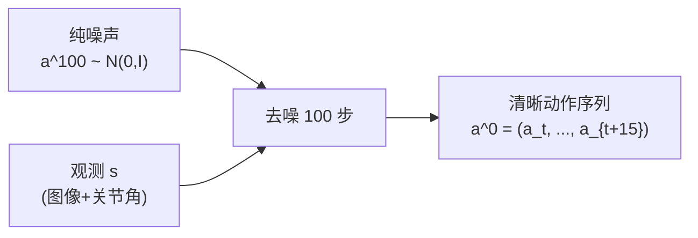
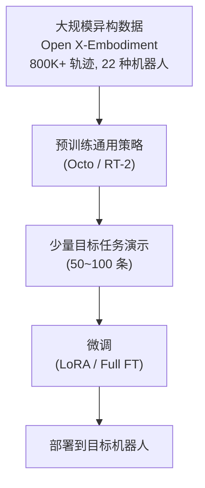
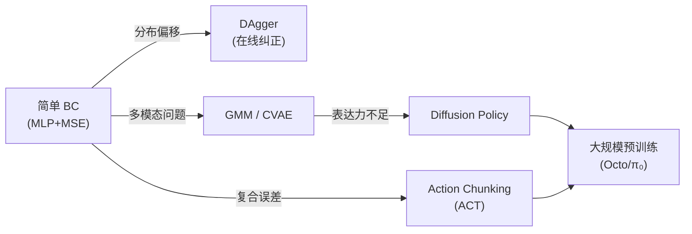

# 机器人模仿学习综述：从行为克隆到扩散策略

> **综述范围**：模仿学习（Imitation Learning）在机器人操控中的方法演进  
> **关键词**：Behavior Cloning、DAgger、Action Chunking、Diffusion Policy、多模态分布  
> **适用读者**：想系统了解"如何让机器人从人类演示中学会操作"的小白到进阶读者

## 相关阅读

- [行为克隆与 RL 微调范式](/前置知识/000d_前置知识_行为克隆与RL微调范式) — BC 的优缺点与 RL 微调动机
- [Diffusion Policy](/前置知识/000c_前置知识_Diffusion_Policy) — 扩散模型作策略的完整讲解
- [扩散模型 DDPM](/前置知识/000b_前置知识_扩散模型DDPM) — 扩散模型基础
- [深度强化学习方法综述](./S01_深度强化学习方法综述) — RL 如何和 IL 配合
- [VLA 模型综述](./S03_视觉语言动作模型VLA综述) — 大规模 IL 的最新路线

---

## 贯穿全文的例子：教机器人抓杯子

为了让概念落地，全文使用一个具体场景：

> **场景**：一个 7 自由度机械臂，桌面上有一个杯子，任务是抓起杯子放到盘子里。
> - **观测 $s$**：腕部相机 RGB 图像 (128×128×3) + 7 个关节角度
> - **动作 $a$**：7 个关节角度增量 + 1 个夹爪开合 = 8 维连续向量
> - **演示数据**：人类用遥操作手柄控制机械臂完成抓放，录制了 50 条成功轨迹
> - **每条轨迹**：约 150 个时间步（5 秒 × 30Hz）

后面每种方法，我们都看它如何处理这个抓杯子任务。

---

## 1. 引言：模仿学习在做什么

### 1.1 核心思想

模仿学习的哲学非常直觉：**看别人怎么做，然后照着做**。

对比三种让机器人学会技能的方式：

| 方式 | 类比 | 需要什么 | 困难 |
|------|------|----------|------|
| 手工编程 | 写详细食谱 | 完整的环境模型 | 环境稍有变化就失效 |
| 强化学习 | 自己反复试错 | 奖励信号 | 效率低，奖励难设计 |
| **模仿学习** | **看师傅示范** | **演示数据** | 分布偏移、多模态 |

模仿学习的优势很明显：
- 不需要设计奖励函数（机器人操控中极难设计）
- 可以直接利用人类遥操作数据
- 比 RL 快得多（不需要百万次试错）

### 1.2 问题定义

给定专家演示数据集：

$$
\mathcal{D} = \{(s_1, a_1), (s_2, a_2), ..., (s_N, a_N)\}
$$

目标是学习策略 $\pi_\theta(a|s)$，使其行为与专家接近。

**抓杯子例子**：
- $\mathcal{D}$ = 50 条轨迹 × 150 步 = 7500 个 (观测, 动作) 对
- $s_i$ = 一帧图像 + 7 个关节角
- $a_i$ = 8 维动作向量（关节增量 + 夹爪）
- 目标：学一个网络 $\pi_\theta$，输入新的观测，输出合理的动作

---

## 2. 行为克隆（Behavior Cloning）

### 2.1 最简单的方案

行为克隆把模仿学习变成了监督学习：

$$
\theta^* = \arg\min_\theta \frac{1}{N}\sum_{i=1}^{N} \|\pi_\theta(s_i) - a_i\|^2
$$

**一句话**：让网络的输出尽可能接近专家的动作，用 MSE 损失训练。

**抓杯子的训练过程**：
1. 从 7500 个样本中随机抽 batch_size=64 条
2. 把图像过 ResNet 提特征，和关节角拼接
3. 通过 MLP 输出 8 维动作预测
4. 计算预测和真实动作的 MSE
5. 反向传播更新参数
6. 重复直到 loss 不再下降

**这就完了？** 如果一切顺利，是的。但现实中有一个致命问题……

### 2.2 分布偏移：为什么 BC 会失败

**核心问题**：训练时策略只见过专家轨迹上的状态；部署时一旦出现小偏差，就进入"没见过的状态"，预测可能很糟糕，导致更大偏差，恶性循环。

这就是**分布偏移（Distribution Shift）**，也叫**复合误差（Compounding Error）**。

**抓杯子的具体例子**：

假设专家每次都精确地从杯子正上方接近。BC 策略训练时只看到了"手在杯子正上方"的状态。

部署时，如果机器人的第一步有微小偏差（比如手偏左了 2mm）：
- 此时的观测（手在杯子左上方 2mm）专家数据中从没出现过
- 网络在这个状态的输出是"随机猜测"
- 假设它猜的方向又偏了 3mm → 总偏差 5mm
- 下一步状态更陌生 → 偏差更大
- 几步后手可能已经偏离杯子 5cm → 任务失败

**误差增长的数学**：

如果策略每步有 $\epsilon$ 的错误概率偏离正确轨迹，在时域长度 $T$ 的任务中：

$$
\text{总错误} = O(T^2 \cdot \epsilon)
$$

注意是 $T^2$ 而非 $T$！因为偏差会累积导致后续每步的错误概率也增加。

**数字代入**：$T=150$ 步，$\epsilon=0.01$（1%的单步错误率）：
- 线性增长的话：$150 \times 0.01 = 1.5$（可以接受）
- 二次增长的话：$150^2 \times 0.01 = 225$（灾难性失败）

### 2.3 缓解分布偏移的实用技巧

虽然 BC 有理论缺陷，但实践中通过工程手段可以大幅缓解：

**数据增强**：对训练观测施加随机扰动
- 图像：随机裁剪、颜色抖动、模糊
- 状态：给关节角加少量噪声
- 效果：让策略见到更多"偏差后的状态"

**更多更多样的演示**：
- 50 条 → 200 条
- 不同的抓取角度、不同的杯子位置
- 效果：扩大专家数据的状态覆盖范围

**Action Chunking**（下面详细讲）：一次预测多步 → 减少闭环反馈导致的误差传播

---

## 3. DAgger：在线查询专家

### 3.1 核心思想

Ross et al. (2011) 提出 DAgger（Dataset Aggregation）直接解决分布偏移：

**关键洞察**：问题在于策略访问的状态分布 $d_{\pi_\theta}$ 和训练数据的状态分布 $d_{\pi^*}$ 不匹配。那就**在策略自己访问的状态上收集专家标注**！

算法流程：

$$
\text{for } i = 1, 2, 3, ...: \quad \mathcal{D}_{i+1} = \mathcal{D}_i \cup \{(s, \pi^*(s)) : s \sim d_{\pi_\theta}\}
$$

1. 用当前策略 $\pi_\theta$ 执行任务，收集经过的状态序列
2. 把这些状态拿给专家，让专家标注"在这个状态你会怎么做"
3. 把新的 (状态, 专家动作) 对加入数据集
4. 重新训练策略
5. 重复

**抓杯子的 DAgger**：
1. 让当前（还不太好的）策略试着抓杯子，走了偏了（手偏到左边 3cm）
2. 把这个"偏了的状态"给人类操作员看："现在手在这个位置，你会怎么操作？"
3. 人类标注："向右下方移动回到杯子上方"
4. 这条纠正数据加入训练集
5. 策略重新训练后学会了"偏了该怎么纠正"

### 3.2 理论保证

DAgger 将误差从 $O(T^2 \epsilon)$ 降到 $O(T \epsilon)$：

$$
\text{DAgger 总错误} = O(T \cdot \epsilon)
$$

经过足够多轮迭代后，策略在自己访问的状态上都有了专家标注，分布偏移消失。

### 3.3 实际困难

DAgger 理论漂亮但实践中有严重限制：

| 问题 | 为什么难 |
|------|----------|
| 需要专家在线 | 人类必须实时响应标注请求 |
| 标注成本高 | 机器人任务中每次标注需要人类理解当前 3D 场景 |
| 不安全 | 让一个不好的策略在真实机器人上运行可能损坏硬件 |
| 反应时间 | 30Hz 控制频率下人类来不及标注 |

所以现代做法倾向于：**收集更多高质量离线演示 + 用更强的模型架构直接做 BC**。

---

## 4. 多模态问题：同一个状态，多种合理动作

### 4.1 问题描述

在机器人操控中，面对同一个观测，可能有多种完全合理的动作方案。

**抓杯子例子**：

杯子在桌子中间，机器人手在正上方 20cm 处。合理的动作至少有：
- 方案 A：直接向下伸手，从上方抓
- 方案 B：先向左平移 5cm 到把手位置，再从侧面抓
- 方案 C：先向右平移到杯子边缘，从另一侧抓

三种方案都能完成任务，演示数据中三种都有。

**MSE 损失会怎样？**

如果用简单的均值回归（MSE），模型学到的是这些方案的**平均值**：

$$
\hat{a} = \frac{1}{3}(a_A + a_B + a_C)
$$

- $a_A$ = 向下，$a_B$ = 向左下，$a_C$ = 向右下
- 平均值 ≈ 向下但不够远 → **哪个方案都不是，可能撞到杯子！**

这就是**模式平均（Mode Averaging）**问题。

### 4.2 多模态建模方法对比

| 方法 | 原理 | 表达力 | 训练难度 | 推理速度 |
|------|------|--------|----------|----------|
| MSE 回归 | 学均值 | ❌ 单模态 | 最简单 | 最快 |
| 高斯混合 (GMM) | K 个高斯加权 | 中（需要定 K） | 简单 | 快 |
| CVAE | 潜变量控制模式 | 高 | 中 | 快 |
| 扩散模型 | 迭代去噪 | **极高** | 中 | 慢 |
| 能量模型 (EBM) | 定义能量面 | 高 | 难 | 慢 |

### 4.3 CVAE 方案（ACT 使用）

CVAE（条件变分自编码器）是 ACT 论文的核心：用一个**潜变量 $z$** 来选择"走哪个模式"。

训练时的结构：

$$
z \sim q_\phi(z | s, a_{1:H}) \quad \text{(Encoder: 从真实动作推断用了哪个模式)}
$$

$$
\hat{a}_{1:H} = f_\theta(s, z) \quad \text{(Decoder: 根据观测和模式生成动作)}
$$

训练损失：

$$
\mathcal{L} = \underbrace{\mathbb{E}_{z \sim q_\phi}\left[\|a_{1:H} - f_\theta(s, z)\|^2\right]}_{\text{重建项：动作要接近}} + \underbrace{\beta \cdot D_{\text{KL}}(q_\phi(z|s, a) \| p(z))}_{\text{正则项：z 要接近标准正态}}
$$

**逐项拆解**：
- 重建项：Decoder 输出的动作应该和真实动作接近（标准 MSE）
- KL 项：Encoder 学到的 $z$ 分布不应偏离先验 $p(z)=\mathcal{N}(0,I)$ 太远
- $\beta$：平衡两项的权重（$\beta$ 太大 → $z$ 无信息、退化成普通 MSE；$\beta$ 太小 → $z$ 空间不规整）

**推理时怎么用**：
- 没有 Encoder（不知道真实动作）
- 直接从先验采样 $z \sim \mathcal{N}(0, I)$
- 不同的 $z$ → 不同的模式 → 不同的动作序列

**抓杯子例子**：
- $z = (-1.2, 0.5)$ → 模型生成方案 A（从上方抓）
- $z = (0.8, -0.3)$ → 模型生成方案 B（从左侧抓）
- $z = (0.1, 1.5)$ → 模型生成方案 C（从右侧抓）

每次推理随机采一个 $z$，就能生成一种连贯的抓取方案，不会产生"平均值"的问题。

### 4.4 扩散模型方案（Diffusion Policy）

[Diffusion Policy](/前置知识/000c_前置知识_Diffusion_Policy) 用另一种方式处理多模态：通过**迭代去噪**从噪声中"雕刻"出动作。

核心思路：
1. 从纯噪声 $a^K \sim \mathcal{N}(0, I)$ 开始
2. 网络预测"这个噪声应该去掉多少"
3. 去掉一点噪声，得到稍微清晰一点的动作
4. 重复 $K$ 次，最终得到清晰的动作序列

**为什么能处理多模态？**

不同的初始噪声 $a^K$ 会被去噪到不同的模式：
- 初始噪声偏左 → 去噪后得到"从左侧抓"
- 初始噪声偏右 → 去噪后得到"从右侧抓"
- 扩散模型自然地学到了数据中所有模式的位置和形状

详见 [扩散模型 DDPM](/前置知识/000b_前置知识_扩散模型DDPM) 和 [Diffusion Policy](/前置知识/000c_前置知识_Diffusion_Policy)。

---

## 5. Action Chunking：一次预测多步

### 5.1 动机

传统 BC 每步预测一个动作 $a_t = \pi(s_t)$，然后立即执行并获取新观测 $s_{t+1}$，再预测下一步。这是**闭环执行**。

问题：预测频率 = 执行频率 = 30Hz，意味着策略每 33ms 就做一次决策，**每次决策的小误差都会通过闭环反馈传播到下一步**。

**类比**：你开车时如果每 0.1 秒都微调方向盘，手抖一下就会被放大 → 车子左右摇摆。如果你每次制定"未来 2 秒的方向盘计划"，小的手抖就被平滑掉了。

### 5.2 Action Chunking 机制

Action Chunking 让策略一次预测未来 $H$ 步动作的**整个序列**：

$$
(a_t, a_{t+1}, ..., a_{t+H-1}) = \pi_\theta(s_t)
$$

然后执行这 $H$ 步（或者滑动窗口执行）。

**关键参数**：$H$ 是 chunk 大小（如 $H = 50$ 步 ≈ 1.7 秒的动作）

**好处**：
- 有效决策频率从 30Hz 降到 $30/H$ Hz → 复合误差从 $O(T^2)$ 降为 $O((T/H)^2)$
- 输出的动作序列本身就是时间上连贯的
- 可以表达需要多步才能完成的运动基元（如"伸手→张开夹爪→闭合夹爪"是一个整体）

**抓杯子数字对比**（$T=150$ 步，$\epsilon=0.01$）：
- 单步 BC：有效错误 ∝ $150^2 \times 0.01 = 225$
- Chunk $H=50$：有效决策点只有 3 个，错误 ∝ $3^2 \times 0.01 = 0.09$

差距巨大！

### 5.3 时间集成（Temporal Ensembling）

ACT 使用滑动窗口执行：每步都生成新的 $H$ 步预测，同一时刻可能有多个 chunk 的预测覆盖。用指数加权平均融合：

$$
a_t^{\text{exec}} = \frac{\sum_{k=0}^{K} w_k \cdot a_t^{(k)}}{\sum_{k=0}^{K} w_k}, \quad w_k = \exp(-m \cdot k)
$$

**逐项拆解**：
- $a_t^{(k)}$ — 第 $k$ 个最近的 chunk 对时刻 $t$ 的预测
- $w_k = \exp(-m \cdot k)$ — 越新的 chunk 权重越大（$m$ 控制衰减速度）
- 效果：最终执行的动作是多次预测的加权平均，更平滑、更稳定

**抓杯子例子**：

时刻 $t=80$ 时，同时有来自这些 chunk 的预测：
- $k=0$：时刻 80 生成的 chunk，预测 $a_{80} = [0.02, -0.01, ...]$（最新，权重 $w_0=1$）
- $k=1$：时刻 79 生成的 chunk，预测 $a_{80} = [0.025, -0.008, ...]$（权重 $w_1=0.7$）
- $k=2$：时刻 78 生成的 chunk，预测 $a_{80} = [0.018, -0.012, ...]$（权重 $w_2=0.49$）

加权平均后得到平滑的执行动作。

---

## 6. Diffusion Policy 详解

### 6.1 为什么扩散模型适合做策略

Diffusion Policy (Chi et al., 2023) 把[扩散模型](/前置知识/000b_前置知识_扩散模型DDPM)引入机器人策略，核心优势：

1. **极强多模态表达**：任意复杂的动作分布都能学
2. **训练稳定**：不需要对抗训练，loss 单调下降
3. **自然结合 Action Chunking**：生成 $H$ 步动作序列 = 生成一个 $H \times d_a$ 的"信号"
4. **条件生成**：观测作为条件输入，完美匹配策略的框架

### 6.2 训练过程

给一条专家动作序列 $a_{0:H}$：

1. 采样噪声等级 $k \sim \text{Uniform}\{1, ..., K\}$
2. 加噪：$a^k = \sqrt{\bar{\alpha}_k} \cdot a_{0:H} + \sqrt{1-\bar{\alpha}_k} \cdot \epsilon$，其中 $\epsilon \sim \mathcal{N}(0,I)$
3. 网络预测噪声：$\hat{\epsilon} = \epsilon_\theta(a^k, s, k)$
4. 损失：$\mathcal{L} = \|\epsilon - \hat{\epsilon}\|^2$

**一句话**：对动作加噪声，训练网络把噪声认出来。

**逐项拆解**：
- $\bar{\alpha}_k$ — 噪声调度：$k=1$ 时几乎无噪声，$k=K$ 时纯噪声
- $\sqrt{\bar{\alpha}_k} \cdot a_{0:H}$ — 保留的原始信号部分
- $\sqrt{1-\bar{\alpha}_k} \cdot \epsilon$ — 添加的噪声部分
- $\epsilon_\theta(a^k, s, k)$ — 去噪网络，输入有噪声的动作 + 当前观测 + 噪声等级，输出预测的噪声

**抓杯子数字（$K=100$, $H=16$ 步, $d_a=8$）**：
- 输出维度：$16 \times 8 = 128$ 维的动作序列
- $k=1$：$a^1 \approx 0.999 \cdot a_{0:H} + 0.045 \cdot \epsilon$（几乎是原始动作）
- $k=50$：$a^{50} \approx 0.1 \cdot a_{0:H} + 0.995 \cdot \epsilon$（几乎是噪声）
- $k=100$：$a^{100} \approx 0 \cdot a_{0:H} + 1 \cdot \epsilon$（纯噪声）

### 6.3 推理过程

从纯噪声开始，逐步去噪恢复出动作序列：

$$
a^{k-1} = \frac{1}{\sqrt{\alpha_k}}\left(a^k - \frac{1-\alpha_k}{\sqrt{1-\bar{\alpha}_k}} \epsilon_\theta(a^k, s, k)\right) + \sigma_k z
$$

其中 $z \sim \mathcal{N}(0, I)$。

**一句话**：每步用网络预测噪声 → 从当前信号中减去噪声 → 加一点随机性 → 重复。

**抓杯子推理过程（$K=100$）**：
- 步骤 100：纯噪声 $a^{100}$（128 维随机数）
- 步骤 99：稍微有结构了，但还看不出动作模式
- 步骤 50：能看到大致走向（向杯子方向移动）
- 步骤 10：动作很清晰了，细节在微调
- 步骤 0：最终输出 16 步平滑动作序列

### 6.4 实验效果

Diffusion Policy 在 11 个操控任务上的对比（Chi et al., 2023）：

| 方法 | 模型 | 平均成功率 | 多模态 |
|------|------|-----------|--------|
| BC-MLP (MSE) | MLP | 47% | ❌ |
| BC-GMM | MLP + GMM head | 56% | ⚠️ |
| ACT (CVAE) | Transformer + CVAE | 73% | ✅ |
| IBC (EBM) | 能量模型 | 62% | ✅ |
| **Diffusion Policy (CNN)** | **1D U-Net** | **83%** | **✅✅** |

为什么 Diffusion Policy 赢这么多？核心在于它对**复杂多模态分布的拟合能力**远超其他方法，不会遗漏任何模式。

更详细的技术细节请参考 [Diffusion Policy 前置知识](/前置知识/000c_前置知识_Diffusion_Policy)。

---

## 7. 观测与表征

### 7.1 观测选择

机器人策略需要什么输入信息？

| 观测类型 | 维度 | 优点 | 缺点 |
|----------|------|------|------|
| 关节角度 | ~7D | 精确、低维 | 不知道环境状况 |
| RGB 图像 | ~128×128×3 | 信息丰富 | 高维、对光照敏感 |
| 深度图 | ~128×128×1 | 对光照鲁棒 | 缺少颜色/纹理 |
| 点云 | ~N×3 | 3D 几何精确 | 稀疏、处理复杂 |
| 多视角 | 多个图像 | 减少遮挡 | 需要多相机 |

**实践建议**：
- 最少需要：**腕部相机 RGB + 关节角度**
- 推荐：加一个第三人称相机（提供全局视角）
- Diffusion Policy 论文推荐使用 2 个观测步（当前帧 + 上一帧）

### 7.2 视觉编码器

图像需要经过编码器压缩为低维特征：

| 编码器 | 参数量 | 特点 | 代表工作 |
|--------|--------|------|----------|
| ResNet-18 | 11M | 简单可靠 | Diffusion Policy |
| ViT-B | 86M | 全局注意力 | Octo |
| R3M | — | 机器人专用预训练 | 各类下游任务 |
| CLIP ViT | 300M+ | 语言对齐 | VLA 模型 |

**关键发现**：即使使用视觉输入，**联合本体感觉（关节角度）几乎总能提升性能**。因为当前关节位置是生成下一步动作的直接基础。

---

## 8. 大规模模仿学习

### 8.1 数据收集

| 方式 | 数据量/小时 | 质量 | 成本 |
|------|-------------|------|------|
| 运动学教学 | 10 条/h | 最高 | 最高 |
| 手柄遥操 | 30 条/h | 高 | 中 |
| VR 遥操 | 50 条/h | 中高 | 中 |
| 手部追踪 | 100 条/h | 中 | 低 |

**50 条 vs 500 条的影响**：研究发现在大多数任务上，50 条高质量演示的性能 > 500 条低质量演示。**数据多样性（不同抓取角度、不同物体位置）** 比单纯数量更重要。

### 8.2 预训练 + 微调范式

受 NLP 大模型启发，机器人模仿学习也走向"通用预训练 + 任务微调"：

代表工作：
- **Octo**（2024）：开源通用策略，在 800K 轨迹上预训练，少量数据微调
- **π₀**（2024）：VLM + Flow Matching，跨 7 种机器人

详见 [VLA 模型综述](./S03_视觉语言动作模型VLA综述)。

---

## 9. 模仿学习 + RL 微调

### 9.1 动机

纯模仿学习的天花板是演示质量——策略最多和人类操作者一样好。如果想**超越人类**（更快、更精确、更稳定），需要引入 RL 微调。

**抓杯子例子**：
- 人类演示：平均 5 秒完成，成功率 95%
- BC 策略：平均 5.5 秒完成，成功率 85%（受分布偏移影响）
- BC + RL 微调：平均 3.5 秒完成，成功率 98%（RL 优化了速度和精度）

### 9.2 微调路线

| 方法 | 策略类型 | 微调方式 | 适用场景 |
|------|----------|----------|----------|
| PPO 微调 | 高斯策略 | 标准 PPO | 简单分布 |
| DPPO | 扩散策略 | 逐步 PPO | 复杂多模态 |
| RLPD | 任意 | 混合离线+在线数据 | 有离线数据 |
| IDQL | 扩散策略 | Q 值引导 | 纯离线 |

详见 [DPPO 精读](./001_DPPO_扩散策略策略优化) 和 [行为克隆与 RL 微调范式](/前置知识/000d_前置知识_行为克隆与RL微调范式)。

---

## 10. 总结与方法选择

### 10.1 发展脉络

### 10.2 方法选择指南

| 你的情况 | 推荐方法 |
|----------|----------|
| 简单任务 + 少量演示（<50条） | ACT（CVAE + Chunking） |
| 复杂多模态任务 | Diffusion Policy |
| 有大规模预训练数据 | Octo 微调 |
| 需要语言条件 | VLA（RT-2 / OpenVLA） |
| 需要超越演示 | BC 预训练 + RL 微调 |

---

## 延伸阅读

- [Diffusion Policy 前置知识](/前置知识/000c_前置知识_Diffusion_Policy) — 扩散策略的详细技术
- [行为克隆与 RL 微调](/前置知识/000d_前置知识_行为克隆与RL微调范式) — 为什么先 BC 再 RL
- [VLA 综述](./S03_视觉语言动作模型VLA综述) — 大模型路线
- [Sim-to-Real 综述](./S04_Sim_to_Real迁移综述) — 仿真中的 IL 如何迁移
- Zhao et al., "Learning Fine-Grained Bimanual Manipulation" (RSS, 2023) — ACT
- Chi et al., "Diffusion Policy" (RSS, 2023)
- Open X-Embodiment Collaboration (2024) — 大规模多机器人数据集
