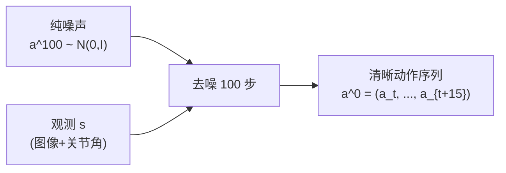
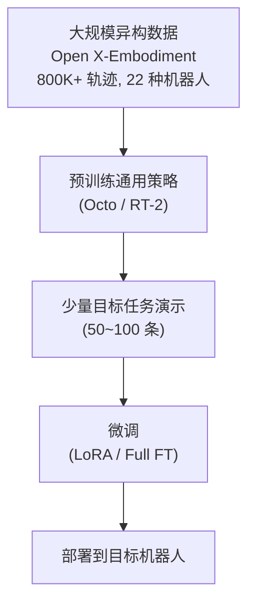
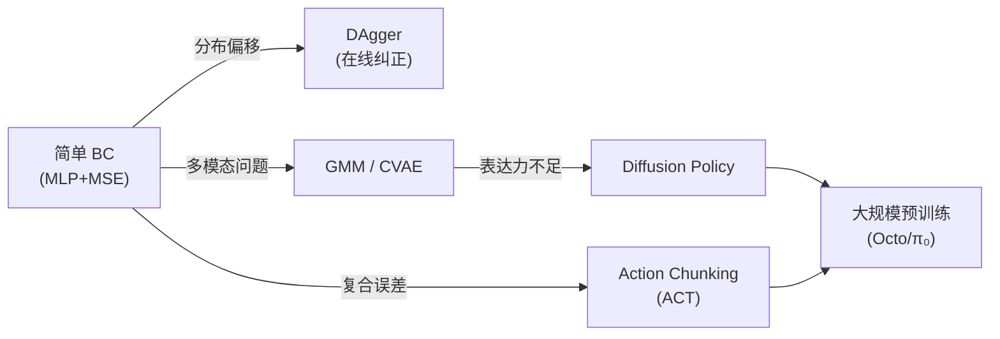

# 机器人模仿学习综述：从行为克隆到扩散策略

> **综述范围**：模仿学习（Imitation Learning）在机器人操控中的方法演进  
> **关键词**：Behavior Cloning、DAgger、Action Chunking、Diffusion Policy、多模态分布  
> **适用读者**：想系统了解"如何让机器人从人类演示中学会操作"的小白到进阶读者

## 相关阅读

- [行为克隆与 RL 微调范式](/前置知识/000d_前置知识_行为克隆与RL微调范式) — BC 的优缺点与 RL 微调动机
- [Diffusion Policy](/前置知识/000c_前置知识_Diffusion_Policy) — 扩散模型作策略的完整讲解
- [扩散模型 DDPM](/前置知识/000b_前置知识_扩散模型DDPM) — 扩散模型基础
- [深度强化学习方法综述](./S01_深度强化学习方法综述) — RL 如何和 IL 配合
- [VLA 模型综述](./S03_视觉语言动作模型VLA综述) — 大规模 IL 的最新路线

---

## 贯穿全文的例子：教机器人抓杯子

为了让概念落地，全文使用一个具体场景：

> **场景**：一个 7 自由度机械臂，桌面上有一个杯子，任务是抓起杯子放到盘子里。
> - **观测 $s$**：腕部相机 RGB 图像 (128×128×3) + 7 个关节角度
> - **动作 $a$**：7 个关节角度增量 + 1 个夹爪开合 = 8 维连续向量
> - **演示数据**：人类用遥操作手柄控制机械臂完成抓放，录制了 50 条成功轨迹
> - **每条轨迹**：约 150 个时间步（5 秒 × 30Hz）

后面每种方法，我们都看它如何处理这个抓杯子任务。

---

## 1. 引言：模仿学习在做什么

### 1.1 核心思想

模仿学习的哲学非常直觉：**看别人怎么做，然后照着做**。

对比三种让机器人学会技能的方式：

| 方式 | 类比 | 需要什么 | 困难 |
|------|------|----------|------|
| 手工编程 | 写详细食谱 | 完整的环境模型 | 环境稍有变化就失效 |
| 强化学习 | 自己反复试错 | 奖励信号 | 效率低，奖励难设计 |
| **模仿学习** | **看师傅示范** | **演示数据** | 分布偏移、多模态 |

模仿学习的优势很明显：
- 不需要设计奖励函数（机器人操控中极难设计）
- 可以直接利用人类遥操作数据
- 比 RL 快得多（不需要百万次试错）

### 1.2 问题定义

给定专家演示数据集：

$$
\mathcal{D} = \{(s_1, a_1), (s_2, a_2), ..., (s_N, a_N)\}
$$

**这个公式在做什么**：把"人类演示了很多次操作"这件事，整理成一份机器能读的清单——每一条记录就是"看到了什么状态，专家做了什么动作"。

::: details 📐 公式详解（点击展开）

| 子表达式 | 它是谁 | 它在干嘛 |
|---------|--------|---------|
| $(s_i, a_i)$ | **一条观测-动作记录** | 第 $i$ 个时间步的观测和专家在那一刻做出的动作，配成一对 |
| $s_1, s_2, ..., s_N$ | **专家看到的所有场景** | 演示过程中依次出现的状态（如相机画面 + 关节角） |
| $a_1, a_2, ..., a_N$ | **专家做出的所有动作** | 对应每个状态，专家实际执行的动作 |
| $\mathcal{D}$ | **整份教材** | 把所有 (状态,动作) 对打包成的数据集，后面所有训练都从这里取数据 |

**用人话读**："把人类演示时每一刻看到的画面和做的动作都记下来，配成一对一对的，攒成一份数据集。"

**为什么是这个形式**：模仿学习要靠"看过的例子"学会怎么做，所以第一步必须先把"看到了什么、对应做了什么"这种配对关系整理成结构化数据，才能喂给后面的监督学习算法。
:::

目标是学习策略 $\pi_\theta(a|s)$，使其行为与专家接近。

**抓杯子例子**：
- $\mathcal{D}$ = 50 条轨迹 × 150 步 = 7500 个 (观测, 动作) 对
- $s_i$ = 一帧图像 + 7 个关节角
- $a_i$ = 8 维动作向量（关节增量 + 夹爪）
- 目标：学一个网络 $\pi_\theta$，输入新的观测，输出合理的动作

---

## 2. 行为克隆（Behavior Cloning）

### 2.1 最简单的方案

行为克隆把模仿学习变成了监督学习：

$$
\theta^* = \arg\min_\theta \frac{1}{N}\sum_{i=1}^{N} \|\pi_\theta(s_i) - a_i\|^2
$$

**这个公式在做什么**：找一组网络参数，让网络看到专家看过的每个状态时，输出的动作尽可能接近专家当时的真实动作——本质就是一个回归问题。

::: details 📐 公式详解（点击展开）

| 子表达式 | 它是谁 | 它在干嘛 |
|---------|--------|---------|
| $\pi_\theta(s_i)$ | **学生的猜测** | 网络看到状态 $s_i$，输出的预测动作 |
| $a_i$ | **标准答案** | 专家在状态 $s_i$ 时实际做的动作 |
| $\|\pi_\theta(s_i)-a_i\|^2$ | **单条错题扣分** | 猜测和标准答案之间的欧氏距离平方，差得越远扣分越多 |
| $\frac{1}{N}\sum_{i=1}^N$ | **全班平均分** | 把 $N$ 条样本的扣分加总再除以 $N$，得到平均误差 |
| $\arg\min_\theta$ | **最优学生** | 在所有可能的参数里，找出让平均误差最小的那一组 |

**用人话读**："让网络看遍所有专家演示过的场景，尽量让自己输出的动作和专家当时做的动作差距最小。"

**为什么是这个形式**：这就是最朴素的监督学习——把"模仿"直接等价成"回归到专家动作"，用 MSE 损失是因为动作是连续向量，MSE 是回归任务里最简单直接的度量方式。
:::

**抓杯子的训练过程**：
1. 从 7500 个样本中随机抽 batch_size=64 条
2. 把图像过 ResNet 提特征，和关节角拼接
3. 通过 MLP 输出 8 维动作预测
4. 计算预测和真实动作的 MSE
5. 反向传播更新参数
6. 重复直到 loss 不再下降

**这就完了？** 如果一切顺利，是的。但现实中有一个致命问题……

### 2.2 分布偏移：为什么 BC 会失败

**核心问题**：训练时策略只见过专家轨迹上的状态；部署时一旦出现小偏差，就进入"没见过的状态"，预测可能很糟糕，导致更大偏差，恶性循环。

这就是**分布偏移（Distribution Shift）**，也叫**复合误差（Compounding Error）**。

**抓杯子的具体例子**：

假设专家每次都精确地从杯子正上方接近。BC 策略训练时只看到了"手在杯子正上方"的状态。

部署时，如果机器人的第一步有微小偏差（比如手偏左了 2mm）：
- 此时的观测（手在杯子左上方 2mm）专家数据中从没出现过
- 网络在这个状态的输出是"随机猜测"
- 假设它猜的方向又偏了 3mm → 总偏差 5mm
- 下一步状态更陌生 → 偏差更大
- 几步后手可能已经偏离杯子 5cm → 任务失败

**误差增长的数学**：

如果策略每步有 $\epsilon$ 的错误概率偏离正确轨迹，在时域长度 $T$ 的任务中：

$$
\text{总错误} = O(T^2 \cdot \epsilon)
$$

**这个公式在做什么**：说明 BC 策略的误差不是随时间线性增长，而是随时间**平方**增长——这是分布偏移最致命的数学后果。

::: details 📐 公式详解（点击展开）

| 子表达式 | 它是谁 | 它在干嘛 |
|---------|--------|---------|
| $\epsilon$ | **单步犯错率** | 策略在"没见过的状态"下瞎猜、偏离正确轨迹的概率 |
| $T$ | **任务长度** | 完成任务需要走的总步数 |
| $T^2 \cdot \epsilon$ | **雪球效应的账单** | 犯错次数不仅随 $T$ 累积，"陌生状态"本身也在随 $T$ 增多，两个效应叠加成平方项 |
| $O(\cdot)$ | **量级标记** | 只关心误差随 $T$、$\epsilon$ 增长的"阶数"，不追求精确系数 |

**用人话读**："任务越长，误差不是简单地按步数累加，而是按步数的平方在滚雪球式恶化。"

**为什么是 $T^2$ 而不是 $T$**：每一步犯错都会把策略推到一个更陌生的状态，而更陌生的状态又提高了下一步犯错的概率——错误本身在放大后续犯错的概率，两层"随 $T$ 增长"的效应相乘，就得到了平方阶。
:::

注意是 $T^2$ 而非 $T$！因为偏差会累积导致后续每步的错误概率也增加。

**数字代入**：$T=150$ 步，$\epsilon=0.01$（1%的单步错误率）：
- 线性增长的话：$150 \times 0.01 = 1.5$（可以接受）
- 二次增长的话：$150^2 \times 0.01 = 225$（灾难性失败）

### 2.3 缓解分布偏移的实用技巧

虽然 BC 有理论缺陷，但实践中通过工程手段可以大幅缓解：

**数据增强**：对训练观测施加随机扰动
- 图像：随机裁剪、颜色抖动、模糊
- 状态：给关节角加少量噪声
- 效果：让策略见到更多"偏差后的状态"

**更多更多样的演示**：
- 50 条 → 200 条
- 不同的抓取角度、不同的杯子位置
- 效果：扩大专家数据的状态覆盖范围

**Action Chunking**（下面详细讲）：一次预测多步 → 减少闭环反馈导致的误差传播

---

## 3. DAgger：在线查询专家

### 3.1 核心思想

Ross et al. (2011) 提出 DAgger（Dataset Aggregation）直接解决分布偏移：

**关键洞察**：问题在于策略访问的状态分布 $d_{\pi_\theta}$ 和训练数据的状态分布 $d_{\pi^*}$ 不匹配。那就**在策略自己访问的状态上收集专家标注**！

算法流程：

$$
\text{for } i = 1, 2, 3, ...: \quad \mathcal{D}_{i+1} = \mathcal{D}_i \cup \{(s, \pi^*(s)) : s \sim d_{\pi_\theta}\}
$$

**这个公式在做什么**：每一轮都让当前策略自己去"闯"，把它闯出来的新状态交给专家重新标注，再把标注结果并入训练集——不断扩充数据集，直到策略访问的状态都被专家教过怎么处理。

::: details 📐 公式详解（点击展开）

| 子表达式 | 它是谁 | 它在干嘛 |
|---------|--------|---------|
| $s \sim d_{\pi_\theta}$ | **策略自己撞见的场景** | 用当前（还不完美的）策略执行任务，实际经过的状态分布 |
| $\pi^*(s)$ | **专家的现场指导** | 请专家看着这个状态，给出"在这里应该怎么做"的标注动作 |
| $\{(s,\pi^*(s)):s\sim d_{\pi_\theta}\}$ | **本轮新增的教材** | 把策略闯出来的状态和专家的纠正动作打包成新的训练样本 |
| $\mathcal{D}_i \cup (\cdot)$ | **教材累加** | 新样本不是替换旧数据，而是并入之前所有轮次积累的数据集 |
| $\text{for } i=1,2,3,...$ | **反复迭代** | 每一轮都重新收集、重新训练，持续多轮直到策略稳定 |

**用人话读**："让当前策略自己去跑，把它走过的（可能偏了的）路都记下来，找专家给这些路标上'正确该怎么做'，再把这些新标注加进训练数据里，重新训练，一轮一轮重复。"

**为什么是这个形式**：BC 失败的根源是训练数据的状态分布 $d_{\pi^*}$ 和策略实际访问的状态分布 $d_{\pi_\theta}$ 不一致。DAgger 直接在策略自己访问的状态 $d_{\pi_\theta}$ 上收集专家标注，让训练分布逐渐逼近部署时的真实分布，从根源上消除分布偏移。
:::

1. 用当前策略 $\pi_\theta$ 执行任务，收集经过的状态序列
2. 把这些状态拿给专家，让专家标注"在这个状态你会怎么做"
3. 把新的 (状态, 专家动作) 对加入数据集
4. 重新训练策略
5. 重复

**抓杯子的 DAgger**：
1. 让当前（还不太好的）策略试着抓杯子，走了偏了（手偏到左边 3cm）
2. 把这个"偏了的状态"给人类操作员看："现在手在这个位置，你会怎么操作？"
3. 人类标注："向右下方移动回到杯子上方"
4. 这条纠正数据加入训练集
5. 策略重新训练后学会了"偏了该怎么纠正"

### 3.2 理论保证

DAgger 将误差从 $O(T^2 \epsilon)$ 降到 $O(T \epsilon)$：

$$
\text{DAgger 总错误} = O(T \cdot \epsilon)
$$

**这个公式在做什么**：证明经过在线纠正之后，误差重新变回和任务长度**线性**相关，不再是 BC 的平方雪球效应。

::: details 📐 公式详解（点击展开）

| 子表达式 | 它是谁 | 它在干嘛 |
|---------|--------|---------|
| $\epsilon$ | **单步犯错率** | 和 BC 里含义相同，策略犯错的概率 |
| $T$ | **任务长度** | 完成任务需要走的步数 |
| $T \cdot \epsilon$ | **线性账单** | 误差只是简单随步数累加，不再有"陌生状态引发更多陌生状态"的放大效应 |

**用人话读**："经过在线纠正训练之后，误差只是随任务步数简单累加，不会再像 BC 那样越滚越大。"

**为什么能从 $T^2$ 降到 $T$**：因为 DAgger 让策略访问过的每一个状态最终都有了专家的正确示范，"陌生状态"这个雪球效应的引信被拆掉了——犯错不会再连锁触发更多的陌生状态，剩下的误差只是"单步犯错概率乘以步数"这种最基本的线性累积。
:::

经过足够多轮迭代后，策略在自己访问的状态上都有了专家标注，分布偏移消失。

### 3.3 实际困难

DAgger 理论漂亮但实践中有严重限制：

| 问题 | 为什么难 |
|------|----------|
| 需要专家在线 | 人类必须实时响应标注请求 |
| 标注成本高 | 机器人任务中每次标注需要人类理解当前 3D 场景 |
| 不安全 | 让一个不好的策略在真实机器人上运行可能损坏硬件 |
| 反应时间 | 30Hz 控制频率下人类来不及标注 |

所以现代做法倾向于：**收集更多高质量离线演示 + 用更强的模型架构直接做 BC**。

---

## 4. 多模态问题：同一个状态，多种合理动作

### 4.1 问题描述

在机器人操控中，面对同一个观测，可能有多种完全合理的动作方案。

**抓杯子例子**：

杯子在桌子中间，机器人手在正上方 20cm 处。合理的动作至少有：
- 方案 A：直接向下伸手，从上方抓
- 方案 B：先向左平移 5cm 到把手位置，再从侧面抓
- 方案 C：先向右平移到杯子边缘，从另一侧抓

三种方案都能完成任务，演示数据中三种都有。

**MSE 损失会怎样？**

如果用简单的均值回归（MSE），模型学到的是这些方案的**平均值**：

$$
\hat{a} = \frac{1}{3}(a_A + a_B + a_C)
$$

**这个公式在做什么**：展示 MSE 回归在多模态数据上会做什么——它不会学到"三种方案里选一种"，而是把三种方案硬生生揉成一个谁都不像的"平均动作"。

::: details 📐 公式详解（点击展开）

| 子表达式 | 它是谁 | 它在干嘛 |
|---------|--------|---------|
| $a_A, a_B, a_C$ | **三个各自合理的方案** | 演示数据中三种真实存在、各自都能完成任务的动作 |
| $\frac{1}{3}(a_A+a_B+a_C)$ | **和稀泥的折中方案** | MSE 损失的最优解——让预测值到三个目标的距离平方和最小，数学上正是三者的算术平均 |
| $\hat{a}$ | **网络实际输出的动作** | 训练收敛后网络对这个状态给出的预测 |

**用人话读**："模型没有学会'选一种方案去做'，而是把三种方案的动作数值直接平均，输出一个哪种方案都不是的四不像动作。"

**为什么会是平均值（不是巧合）**：MSE 损失 $\mathbb{E}[\|\hat a - a\|^2]$ 对 $\hat a$ 求导并令导数为零，最优解正是所有观测到的目标动作的算术平均——这是均方误差的数学性质决定的，只要数据本身多模态，MSE 回归就必然产生这种"和稀泥"的结果。
:::

这就是**模式平均（Mode Averaging）**问题。

### 4.2 多模态建模方法对比

| 方法 | 原理 | 表达力 | 训练难度 | 推理速度 |
|------|------|--------|----------|----------|
| MSE 回归 | 学均值 | ❌ 单模态 | 最简单 | 最快 |
| 高斯混合 (GMM) | K 个高斯加权 | 中（需要定 K） | 简单 | 快 |
| CVAE | 潜变量控制模式 | 高 | 中 | 快 |
| 扩散模型 | 迭代去噪 | **极高** | 中 | 慢 |
| 能量模型 (EBM) | 定义能量面 | 高 | 难 | 慢 |

### 4.3 CVAE 方案（ACT 使用）

CVAE（条件变分自编码器）是 ACT 论文的核心：用一个**潜变量 $z$** 来选择"走哪个模式"。

训练时的结构：

$$
z \sim q_\phi(z | s, a_{1:H}) \quad \text{(Encoder: 从真实动作推断用了哪个模式)}
$$

**这个公式在做什么**：训练时"偷看"一眼真实动作序列，反推出"专家当时用的是哪种模式"，把这个模式压缩成一个低维向量 $z$。

::: details 📐 公式详解（点击展开）

| 子表达式 | 它是谁 | 它在干嘛 |
|---------|--------|---------|
| $s, a_{1:H}$ | **完整的作案证据** | 当前观测 $s$ 和专家实际执行的整段动作序列 $a_{1:H}$ |
| $q_\phi(z\mid s, a_{1:H})$ | **侦探（Encoder）** | 看完观测和真实动作后，推断"这属于哪种模式"，输出一个分布 |
| $z \sim q_\phi(\cdot)$ | **推断出的模式编号** | 从侦探给出的分布里采样一个具体的潜变量，代表这条演示用的是"方案 A / B / C 里的哪一种" |

**用人话读**："训练时先看一眼专家实际怎么做的，从这段真实动作里反推出'这是哪种抓取模式'，压缩成一个向量 $z$。"

**为什么需要 Encoder"偷看"真实动作**：如果不看真实动作，网络无法知道这条演示到底属于哪个模式；只有在训练阶段允许"偷看"答案来推断模式，才能让 Decoder 学会"给定模式后应该生成什么样的动作"，推理时再改为随机采样模式（见下文）。
:::

$$
\hat{a}_{1:H} = f_\theta(s, z) \quad \text{(Decoder: 根据观测和模式生成动作)}
$$

**这个公式在做什么**：把观测和 Encoder 推断出的模式一起交给 Decoder，让它生成一段具体的动作序列。

::: details 📐 公式详解（点击展开）

| 子表达式 | 它是谁 | 它在干嘛 |
|---------|--------|---------|
| $s$ | **当前场景** | 机器人当前看到的观测 |
| $z$ | **选定的模式** | 上一步 Encoder 推断出的模式向量，决定"走哪种方案" |
| $f_\theta(s,z)$ | **执行者（Decoder）** | 根据场景和指定模式，生成一段具体、连贯的动作序列 |
| $\hat{a}_{1:H}$ | **生成的动作序列** | Decoder 的输出，理想情况下应该和专家在这个模式下的真实动作一致 |

**用人话读**："把当前场景和'该走哪种方案'的信息一起喂给 Decoder，它就会生成一整段对应这个方案的动作。"

**为什么要把 $z$ 和 $s$ 一起输入**：只给 $s$ 不够——同一个 $s$ 对应多种合理动作，必须靠 $z$ 告诉 Decoder "这次要走哪一种"，Decoder 才能输出单一、连贯的动作序列，而不是又把多种模式混在一起。
:::

训练损失：

$$
\mathcal{L} = \underbrace{\mathbb{E}_{z \sim q_\phi}\left[\|a_{1:H} - f_\theta(s, z)\|^2\right]}_{\text{重建项：动作要接近}} + \underbrace{\beta \cdot D_{\text{KL}}(q_\phi(z|s, a) \| p(z))}_{\text{正则项：z 要接近标准正态}}
$$

**这个公式在做什么**：同时优化两个目标——让 Decoder 生成的动作尽量接近真实动作，又让 Encoder 推断出的模式分布不要跑得离标准正态太远，两者平衡才能让 $z$ 空间既有信息量又方便随机采样。

::: details 📐 公式详解（点击展开）

| 子表达式 | 它是谁 | 它在干嘛 |
|---------|--------|---------|
| $\mathbb{E}_{z\sim q_\phi}[\|a_{1:H}-f_\theta(s,z)\|^2]$ | **重建考核** | Decoder 根据 Encoder 给出的 $z$ 生成的动作，和真实动作的 MSE 误差 |
| $D_{\text{KL}}(q_\phi(z\mid s,a)\|p(z))$ | **规整度检查** | Encoder 推断出的模式分布，和标准正态先验 $p(z)=\mathcal{N}(0,I)$ 差多少 |
| $\beta$ | **调节旋钮** | 控制"规整度检查"这一项的权重，决定重建精度和 $z$ 空间规整性之间怎么取舍 |
| $\mathcal{L}$ | **总训练目标** | 重建项和 KL 项加权相加，一次反向传播同时优化 Encoder 和 Decoder |

**用人话读**："既要让 Decoder 根据推断出的模式还原出真实动作，又要让 Encoder 推断出的模式分布不能离标准正态太远，两个要求加起来就是总损失。"

**为什么两项会"打架"、需要 $\beta$ 平衡**：重建项想让 $z$ 携带尽可能多的信息（这样 Decoder 才能精确重建）；KL 项想让 $z$ 的分布逼近标准正态（这样推理时才能安全地从 $\mathcal{N}(0,I)$ 随机采样出合理的 $z$）。$\beta$ 太大 → $z$ 被压得没有信息、退化成和 $z$ 无关的普通 MSE 回归；$\beta$ 太小 → $z$ 空间乱七八糟，推理时随机采样出来的 $z$ 可能对应不到任何有效模式。
:::

**推理时怎么用**：
- 没有 Encoder（不知道真实动作）
- 直接从先验采样 $z \sim \mathcal{N}(0, I)$
- 不同的 $z$ → 不同的模式 → 不同的动作序列

**抓杯子例子**：
- $z = (-1.2, 0.5)$ → 模型生成方案 A（从上方抓）
- $z = (0.8, -0.3)$ → 模型生成方案 B（从左侧抓）
- $z = (0.1, 1.5)$ → 模型生成方案 C（从右侧抓）

每次推理随机采一个 $z$，就能生成一种连贯的抓取方案，不会产生"平均值"的问题。

### 4.4 扩散模型方案（Diffusion Policy）

[Diffusion Policy](/前置知识/000c_前置知识_Diffusion_Policy) 用另一种方式处理多模态：通过**迭代去噪**从噪声中"雕刻"出动作。

核心思路：
1. 从纯噪声 $a^K \sim \mathcal{N}(0, I)$ 开始
2. 网络预测"这个噪声应该去掉多少"
3. 去掉一点噪声，得到稍微清晰一点的动作
4. 重复 $K$ 次，最终得到清晰的动作序列

**为什么能处理多模态？**

不同的初始噪声 $a^K$ 会被去噪到不同的模式：
- 初始噪声偏左 → 去噪后得到"从左侧抓"
- 初始噪声偏右 → 去噪后得到"从右侧抓"
- 扩散模型自然地学到了数据中所有模式的位置和形状

详见 [扩散模型 DDPM](/前置知识/000b_前置知识_扩散模型DDPM) 和 [Diffusion Policy](/前置知识/000c_前置知识_Diffusion_Policy)。

---

## 5. Action Chunking：一次预测多步

### 5.1 动机

传统 BC 每步预测一个动作 $a_t = \pi(s_t)$，然后立即执行并获取新观测 $s_{t+1}$，再预测下一步。这是**闭环执行**。

问题：预测频率 = 执行频率 = 30Hz，意味着策略每 33ms 就做一次决策，**每次决策的小误差都会通过闭环反馈传播到下一步**。

**类比**：你开车时如果每 0.1 秒都微调方向盘，手抖一下就会被放大 → 车子左右摇摆。如果你每次制定"未来 2 秒的方向盘计划"，小的手抖就被平滑掉了。

### 5.2 Action Chunking 机制

Action Chunking 让策略一次预测未来 $H$ 步动作的**整个序列**：

$$
(a_t, a_{t+1}, ..., a_{t+H-1}) = \pi_\theta(s_t)
$$

**这个公式在做什么**：策略网络看一次当前观测，就把接下来 $H$ 步的动作全部规划好，而不是每一步都单独决策一次。

::: details 📐 公式详解（点击展开）

| 子表达式 | 它是谁 | 它在干嘛 |
|---------|--------|---------|
| $s_t$ | **决策那一刻的观测** | 只在时刻 $t$ 看一次的当前状态 |
| $\pi_\theta(s_t)$ | **规划者** | 网络输入这一次观测，直接输出一整段未来动作规划 |
| $(a_t, a_{t+1}, ..., a_{t+H-1})$ | **一整段动作计划** | 未来连续 $H$ 步的动作序列，一次性全部生成 |

**用人话读**："只看一次当前画面，就把接下来 $H$ 步该怎么动全部想好，而不是走一步看一步。"

**为什么是这个形式**：传统 BC 每步都独立决策，每次决策的小误差都会通过闭环反馈传播到下一步；一次性输出整段动作序列，把决策频率从"每步一次"降到"每 $H$ 步一次"，减少了误差累积的次数，也让输出的动作天然具有时间上的连贯性。
:::

然后执行这 $H$ 步（或者滑动窗口执行）。

**关键参数**：$H$ 是 chunk 大小（如 $H = 50$ 步 ≈ 1.7 秒的动作）

**好处**：
- 有效决策频率从 30Hz 降到 $30/H$ Hz → 复合误差从 $O(T^2)$ 降为 $O((T/H)^2)$
- 输出的动作序列本身就是时间上连贯的
- 可以表达需要多步才能完成的运动基元（如"伸手→张开夹爪→闭合夹爪"是一个整体）

**抓杯子数字对比**（$T=150$ 步，$\epsilon=0.01$）：
- 单步 BC：有效错误 ∝ $150^2 \times 0.01 = 225$
- Chunk $H=50$：有效决策点只有 3 个，错误 ∝ $3^2 \times 0.01 = 0.09$

差距巨大！

### 5.3 时间集成（Temporal Ensembling）

ACT 使用滑动窗口执行：每步都生成新的 $H$ 步预测，同一时刻可能有多个 chunk 的预测覆盖。用指数加权平均融合：

$$
a_t^{\text{exec}} = \frac{\sum_{k=0}^{K} w_k \cdot a_t^{(k)}}{\sum_{k=0}^{K} w_k}, \quad w_k = \exp(-m \cdot k)
$$

**这个公式在做什么**：同一时刻 $t$ 会被多个不同时间生成的 chunk 预测到，把这些重叠的预测按"越新的 chunk 越可信"的原则加权平均，得到最终真正执行的动作。

::: details 📐 公式详解（点击展开）

| 子表达式 | 它是谁 | 它在干嘛 |
|---------|--------|---------|
| $a_t^{(k)}$ | **第 $k$ 个候选意见** | 第 $k$ 个最近生成的 chunk，对时刻 $t$ 这一步给出的预测动作 |
| $w_k = \exp(-m\cdot k)$ | **信任度打分** | $k=0$（最新的 chunk）权重最大，$k$ 越大（越旧的 chunk）权重指数衰减 |
| $\sum_k w_k \cdot a_t^{(k)}$ | **加权投票总分** | 把所有候选意见按信任度加权求和 |
| $\sum_k w_k$ | **归一化分母** | 保证最终结果是一个合法的加权平均（权重和为 1） |
| $a_t^{\text{exec}}$ | **最终拍板的动作** | 融合了多个 chunk 意见后，真正发给机器人执行的动作 |

**用人话读**："时刻 $t$ 同时收到好几个不同时间生成的预测，把最新的预测给最大话语权，旧的预测权重指数衰减，加权平均后才是真正执行的动作。"

**为什么用指数衰减而不是简单平均**：越新生成的 chunk 是基于更新、更准确的观测算出来的，理应更可信；简单平均会让过时的预测拖后腿，指数加权既融合了多次预测（起到平滑抖动的作用），又保证新信息占主导。
:::

**抓杯子例子**：

时刻 $t=80$ 时，同时有来自这些 chunk 的预测：
- $k=0$：时刻 80 生成的 chunk，预测 $a_{80} = [0.02, -0.01, ...]$（最新，权重 $w_0=1$）
- $k=1$：时刻 79 生成的 chunk，预测 $a_{80} = [0.025, -0.008, ...]$（权重 $w_1=0.7$）
- $k=2$：时刻 78 生成的 chunk，预测 $a_{80} = [0.018, -0.012, ...]$（权重 $w_2=0.49$）

加权平均后得到平滑的执行动作。

---

## 6. Diffusion Policy 详解

### 6.1 为什么扩散模型适合做策略

Diffusion Policy (Chi et al., 2023) 把[扩散模型](/前置知识/000b_前置知识_扩散模型DDPM)引入机器人策略，核心优势：

1. **极强多模态表达**：任意复杂的动作分布都能学
2. **训练稳定**：不需要对抗训练，loss 单调下降
3. **自然结合 Action Chunking**：生成 $H$ 步动作序列 = 生成一个 $H \times d_a$ 的"信号"
4. **条件生成**：观测作为条件输入，完美匹配策略的框架

### 6.2 训练过程

给一条专家动作序列 $a_{0:H}$：

1. 采样噪声等级 $k \sim \text{Uniform}\{1, ..., K\}$
2. 加噪：$a^k = \sqrt{\bar{\alpha}_k} \cdot a_{0:H} + \sqrt{1-\bar{\alpha}_k} \cdot \epsilon$，其中 $\epsilon \sim \mathcal{N}(0,I)$
3. 网络预测噪声：$\hat{\epsilon} = \epsilon_\theta(a^k, s, k)$
4. 损失：$\mathcal{L} = \|\epsilon - \hat{\epsilon}\|^2$

**一句话**：对动作加噪声，训练网络把噪声认出来。

**抓杯子数字（$K=100$, $H=16$ 步, $d_a=8$）**：
- 输出维度：$16 \times 8 = 128$ 维的动作序列
- $k=1$：$a^1 \approx 0.999 \cdot a_{0:H} + 0.045 \cdot \epsilon$（几乎是原始动作）
- $k=50$：$a^{50} \approx 0.1 \cdot a_{0:H} + 0.995 \cdot \epsilon$（几乎是噪声）
- $k=100$：$a^{100} \approx 0 \cdot a_{0:H} + 1 \cdot \epsilon$（纯噪声）

### 6.3 推理过程

从纯噪声开始，逐步去噪恢复出动作序列：

$$
a^{k-1} = \frac{1}{\sqrt{\alpha_k}}\left(a^k - \frac{1-\alpha_k}{\sqrt{1-\bar{\alpha}_k}} \epsilon_\theta(a^k, s, k)\right) + \sigma_k z
$$

其中 $z \sim \mathcal{N}(0, I)$。

**这个公式在做什么**：从当前带噪声的动作 $a^k$ 出发，用网络猜出的噪声量把它"擦干净一点"，得到噪声更少的 $a^{k-1}$，一步步倒推回原始动作。

::: details 📐 公式详解（点击展开）

| 子表达式 | 它是谁 | 它在干嘛 |
|---------|--------|---------|
| $a^k$ | **当前这一步的半成品** | 还带有一定噪声的动作序列，去噪链条上的中间产物 |
| $\epsilon_\theta(a^k, s, k)$ | **去噪网络的猜测** | 网络看当前半成品、观测、噪声等级，猜出"这里面混了多少噪声" |
| $\frac{1-\alpha_k}{\sqrt{1-\bar\alpha_k}}$ | **噪声抽取比例** | 决定从 $a^k$ 里按多大比例减去猜出来的噪声 |
| $\frac{1}{\sqrt{\alpha_k}}(\cdot)$ | **信号重新放大** | 减去噪声后，把信号幅度按噪声调度重新缩放回正确尺度 |
| $\sigma_k z$ | **一点随机抖动** | 额外加入的一点随机噪声，防止去噪过程过于确定性、卡在局部模式 |
| $a^{k-1}$ | **更干净一点的半成品** | 这一步去噪后的结果，进入下一轮迭代 |

**用人话读**："每一步都让网络猜一下现在还剩多少噪声，把猜出来的噪声按比例减掉、重新缩放，再加一点点随机扰动，得到比之前更清晰的动作，反复这个过程就能从纯噪声走到最终动作。"

**为什么要加 $\sigma_k z$ 这一点随机性**：如果去噪过程完全确定性（没有这一项），从同一个初始噪声出发每次都会生成完全相同的动作，丧失了多模态采样的能力；加入适量随机噪声，让扩散模型在不同的初始噪声和中间随机扰动下能探索出数据分布里所有不同的模式（对应抓杯子例子里"从左侧抓"还是"从右侧抓"）。
:::

**一句话**：每步用网络预测噪声 → 从当前信号中减去噪声 → 加一点随机性 → 重复。

**抓杯子推理过程（$K=100$）**：
- 步骤 100：纯噪声 $a^{100}$（128 维随机数）
- 步骤 99：稍微有结构了，但还看不出动作模式
- 步骤 50：能看到大致走向（向杯子方向移动）
- 步骤 10：动作很清晰了，细节在微调
- 步骤 0：最终输出 16 步平滑动作序列

```mermaid
flowchart LR
    A["纯噪声<br/>a^100 ~ N(0,I)"] --> B["去噪 100 步"]
    B --> C["清晰动作序列<br/>a^0 = (a_t, ..., a_{t+15})"]
    D["观测 s<br/>(图像+关节角)"] --> B
```

### 6.4 实验效果

Diffusion Policy 在 11 个操控任务上的对比（Chi et al., 2023）：

| 方法 | 模型 | 平均成功率 | 多模态 |
|------|------|-----------|--------|
| BC-MLP (MSE) | MLP | 47% | ❌ |
| BC-GMM | MLP + GMM head | 56% | ⚠️ |
| ACT (CVAE) | Transformer + CVAE | 73% | ✅ |
| IBC (EBM) | 能量模型 | 62% | ✅ |
| **Diffusion Policy (CNN)** | **1D U-Net** | **83%** | **✅✅** |

为什么 Diffusion Policy 赢这么多？核心在于它对**复杂多模态分布的拟合能力**远超其他方法，不会遗漏任何模式。

更详细的技术细节请参考 [Diffusion Policy 前置知识](/前置知识/000c_前置知识_Diffusion_Policy)。

---

## 7. 观测与表征

### 7.1 观测选择

机器人策略需要什么输入信息？

| 观测类型 | 维度 | 优点 | 缺点 |
|----------|------|------|------|
| 关节角度 | ~7D | 精确、低维 | 不知道环境状况 |
| RGB 图像 | ~128×128×3 | 信息丰富 | 高维、对光照敏感 |
| 深度图 | ~128×128×1 | 对光照鲁棒 | 缺少颜色/纹理 |
| 点云 | ~N×3 | 3D 几何精确 | 稀疏、处理复杂 |
| 多视角 | 多个图像 | 减少遮挡 | 需要多相机 |

**实践建议**：
- 最少需要：**腕部相机 RGB + 关节角度**
- 推荐：加一个第三人称相机（提供全局视角）
- Diffusion Policy 论文推荐使用 2 个观测步（当前帧 + 上一帧）

### 7.2 视觉编码器

图像需要经过编码器压缩为低维特征：

| 编码器 | 参数量 | 特点 | 代表工作 |
|--------|--------|------|----------|
| ResNet-18 | 11M | 简单可靠 | Diffusion Policy |
| ViT-B | 86M | 全局注意力 | Octo |
| R3M | — | 机器人专用预训练 | 各类下游任务 |
| CLIP ViT | 300M+ | 语言对齐 | VLA 模型 |

**关键发现**：即使使用视觉输入，**联合本体感觉（关节角度）几乎总能提升性能**。因为当前关节位置是生成下一步动作的直接基础。

---

## 8. 大规模模仿学习

### 8.1 数据收集

| 方式 | 数据量/小时 | 质量 | 成本 |
|------|-------------|------|------|
| 运动学教学 | 10 条/h | 最高 | 最高 |
| 手柄遥操 | 30 条/h | 高 | 中 |
| VR 遥操 | 50 条/h | 中高 | 中 |
| 手部追踪 | 100 条/h | 中 | 低 |

**50 条 vs 500 条的影响**：研究发现在大多数任务上，50 条高质量演示的性能 > 500 条低质量演示。**数据多样性（不同抓取角度、不同物体位置）** 比单纯数量更重要。

### 8.2 预训练 + 微调范式

受 NLP 大模型启发，机器人模仿学习也走向"通用预训练 + 任务微调"：

```mermaid
flowchart TD
    A["大规模异构数据<br/>Open X-Embodiment<br/>800K+ 轨迹, 22 种机器人"] --> B["预训练通用策略<br/>(Octo / RT-2)"]
    B --> C["少量目标任务演示<br/>(50~100 条)"]
    C --> D["微调<br/>(LoRA / Full FT)"]
    D --> E["部署到目标机器人"]
```

代表工作：
- **Octo**（2024）：开源通用策略，在 800K 轨迹上预训练，少量数据微调
- **π₀**（2024）：VLM + Flow Matching，跨 7 种机器人

详见 [VLA 模型综述](./S03_视觉语言动作模型VLA综述)。

---

## 9. 模仿学习 + RL 微调

### 9.1 动机

纯模仿学习的天花板是演示质量——策略最多和人类操作者一样好。如果想**超越人类**（更快、更精确、更稳定），需要引入 RL 微调。

**抓杯子例子**：
- 人类演示：平均 5 秒完成，成功率 95%
- BC 策略：平均 5.5 秒完成，成功率 85%（受分布偏移影响）
- BC + RL 微调：平均 3.5 秒完成，成功率 98%（RL 优化了速度和精度）

### 9.2 微调路线

| 方法 | 策略类型 | 微调方式 | 适用场景 |
|------|----------|----------|----------|
| PPO 微调 | 高斯策略 | 标准 PPO | 简单分布 |
| DPPO | 扩散策略 | 逐步 PPO | 复杂多模态 |
| RLPD | 任意 | 混合离线+在线数据 | 有离线数据 |
| IDQL | 扩散策略 | Q 值引导 | 纯离线 |

详见 [DPPO 精读](./001_DPPO_扩散策略策略优化) 和 [行为克隆与 RL 微调范式](/前置知识/000d_前置知识_行为克隆与RL微调范式)。

---

## 10. 总结与方法选择

### 10.1 发展脉络

```mermaid
flowchart LR
    A["简单 BC<br/>(MLP+MSE)"] -->|"分布偏移"| B["DAgger<br/>(在线纠正)"]
    A -->|"多模态问题"| C["GMM / CVAE"]
    C -->|"表达力不足"| D["Diffusion Policy"]
    A -->|"复合误差"| E["Action Chunking<br/>(ACT)"]
    D --> F["大规模预训练<br/>(Octo/π₀)"]
    E --> F
```

### 10.2 方法选择指南

| 你的情况 | 推荐方法 |
|----------|----------|
| 简单任务 + 少量演示（<50条） | ACT（CVAE + Chunking） |
| 复杂多模态任务 | Diffusion Policy |
| 有大规模预训练数据 | Octo 微调 |
| 需要语言条件 | VLA（RT-2 / OpenVLA） |
| 需要超越演示 | BC 预训练 + RL 微调 |

---

## 延伸阅读

- [Diffusion Policy 前置知识](/前置知识/000c_前置知识_Diffusion_Policy) — 扩散策略的详细技术
- [行为克隆与 RL 微调](/前置知识/000d_前置知识_行为克隆与RL微调范式) — 为什么先 BC 再 RL
- [VLA 综述](./S03_视觉语言动作模型VLA综述) — 大模型路线
- [Sim-to-Real 综述](./S04_Sim_to_Real迁移综述) — 仿真中的 IL 如何迁移
- Zhao et al., "Learning Fine-Grained Bimanual Manipulation" (RSS, 2023) — ACT
- Chi et al., "Diffusion Policy" (RSS, 2023)
- Open X-Embodiment Collaboration (2024) — 大规模多机器人数据集
