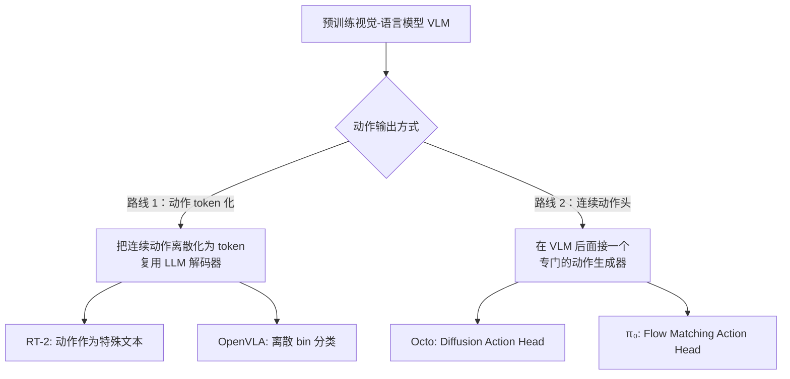
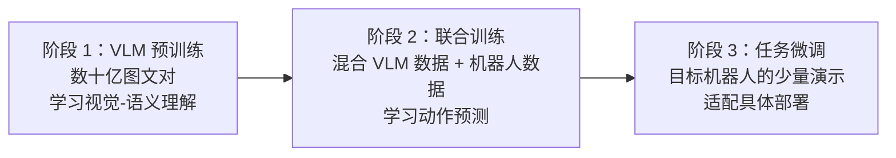
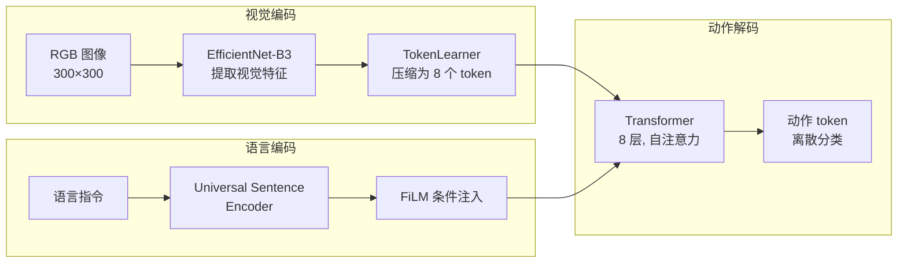
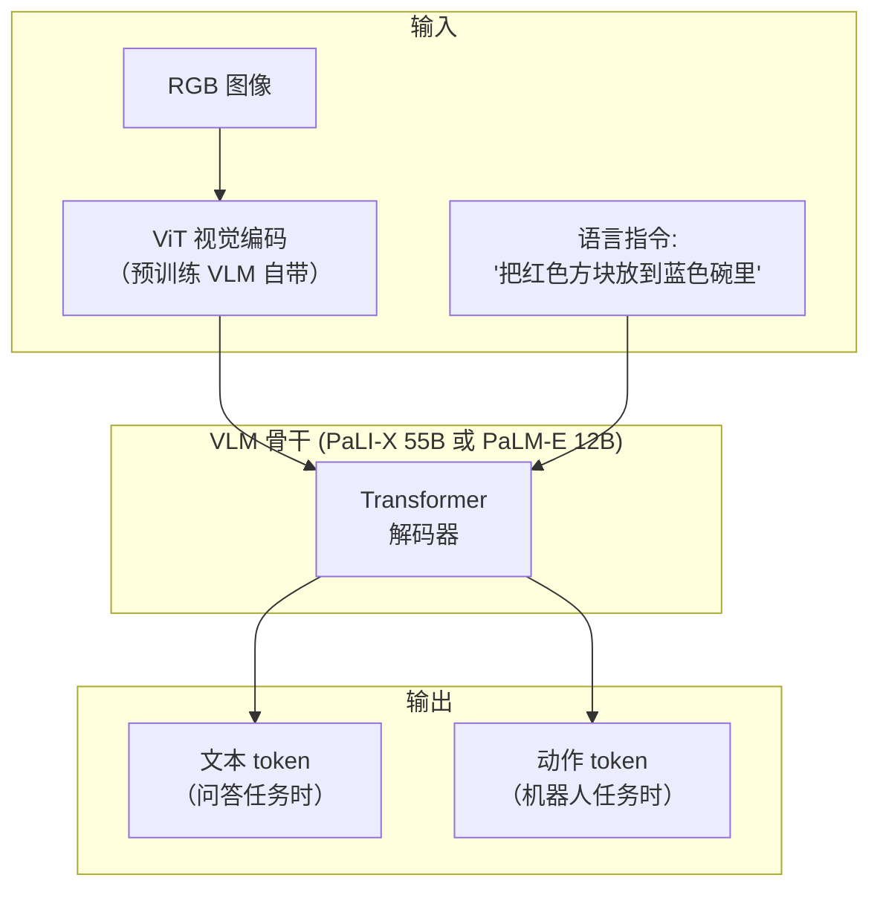
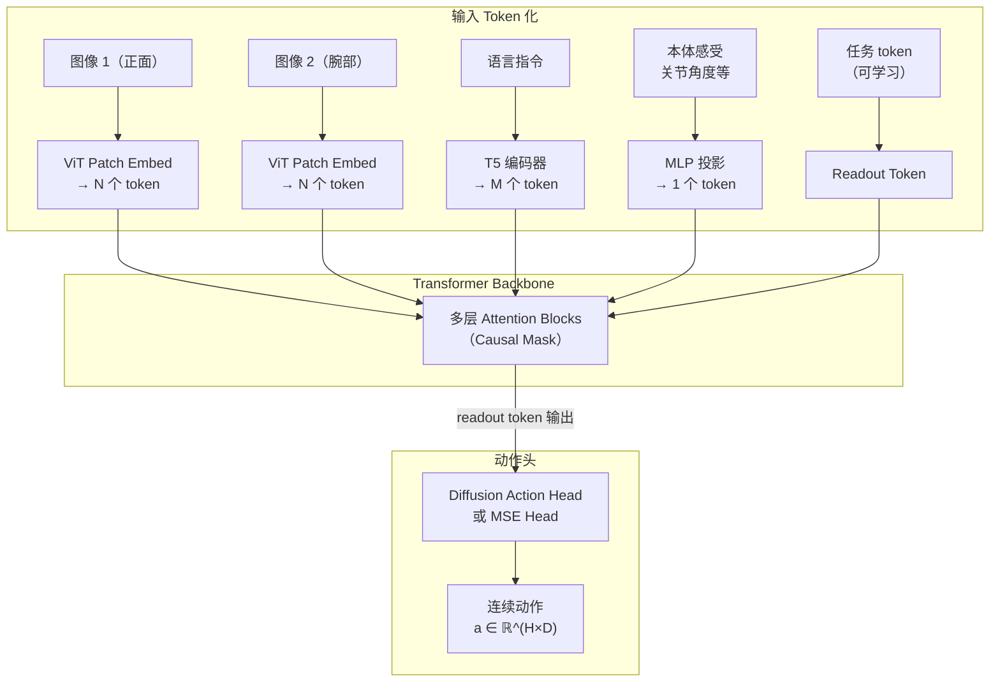
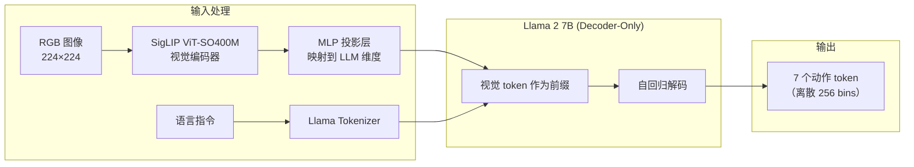
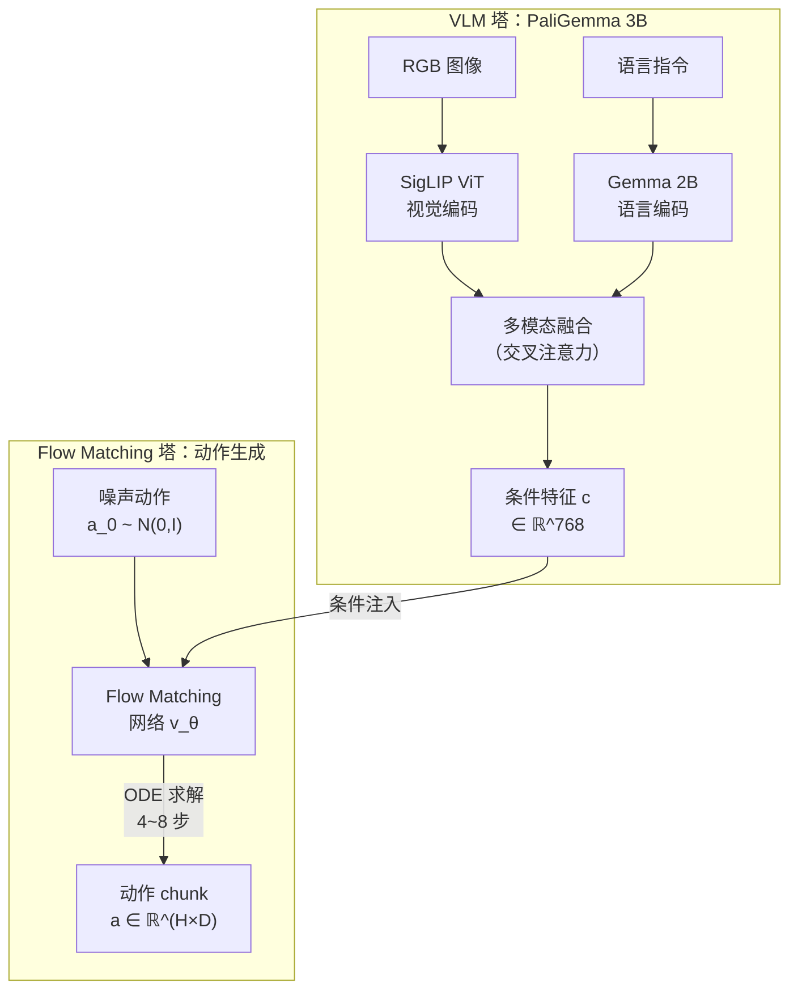
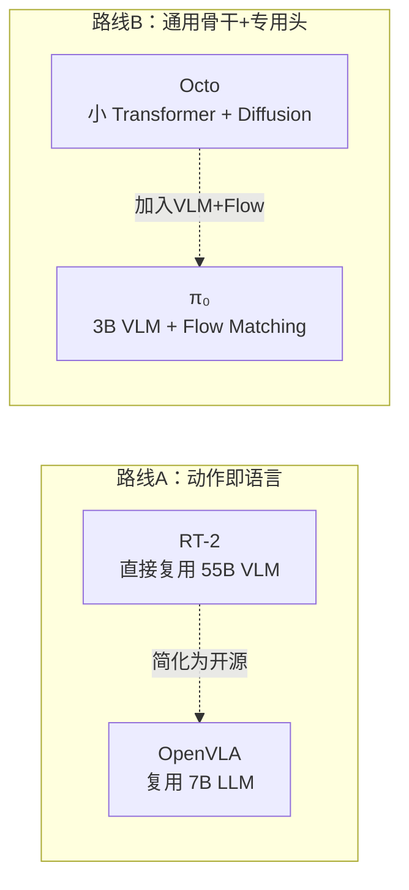
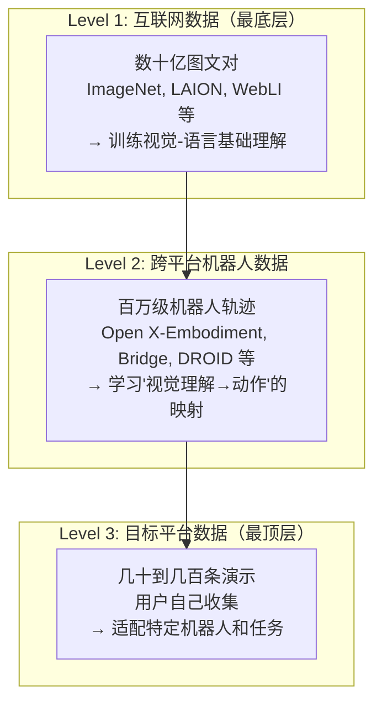

# 视觉-语言-动作模型（VLA）综述：从 RT-1 到 π₀

> **综述范围**：Vision-Language-Action Models 在机器人操控中的发展脉络与核心技术  
> **关键词**：VLA、Foundation Model、RT-1、RT-2、Octo、OpenVLA、π₀、多模态大模型、动作生成  
> **适用读者**：有基本数学素养（线代、概率）的本科生，想系统理解"大模型如何控制机器人"

---

## 相关阅读

在阅读本文前，建议先了解以下前置知识：

- [Diffusion Policy](/前置知识/000c_前置知识_Diffusion_Policy) — 扩散模型如何生成机器人动作
- [Flow Matching 与连续归一化流](/前置知识/000g_前置知识_Flow_Matching与连续归一化流) — π₀ 使用的生成框架
- [行为克隆与 RL 微调范式](/前置知识/000d_前置知识_行为克隆与RL微调范式) — 预训练→微调的基本思路
- [策略梯度与 PPO](/前置知识/000a_前置知识_策略梯度与PPO) — 强化学习基础

关联综述：

- [深度强化学习方法综述](./S01_深度强化学习方法综述) — RL 算法演化脉络
- [机器人模仿学习综述](./S02_机器人模仿学习综述) — 模仿学习的经典与现代方法
- [扩散模型在决策与控制中的应用综述](./S05_扩散模型在决策与控制中的应用综述) — 扩散策略的详细介绍

---

## 贯穿全文的例子：桌面机械臂抓取场景

为了让抽象概念落地，本文始终使用同一个具体场景：

> **场景**：一个 6 自由度桌面机械臂，末端带有平行夹爪。桌面上有若干物体。
> 用户用自然语言说：**"把红色方块放到蓝色碗里"**，机器人看到当前画面后执行动作。
>
> 具体来说：
> - **视觉输入**：一张 $256 \times 256$ 的 RGB 图像，包含红色方块、蓝色碗、绿色圆柱等物体
> - **语言指令**：`"put the red block into the blue bowl"`
> - **动作输出**：每个时间步输出 7 维向量 $a = [x, y, z, r_x, r_y, r_z, g]$
>   - $(x, y, z)$：末端执行器的目标位置（米）
>   - $(r_x, r_y, r_z)$：旋转角（弧度）
>   - $g$：夹爪开合（0=关，1=开）
> - **控制频率**：5~10 Hz（每秒做 5~10 次决策）
>
> 整个任务大约需要 30~50 步动作：先移动到方块上方 → 降下 → 闭合夹爪 → 提起 → 移动到碗上方 → 降下 → 松开。

后面每个模型架构的讲解，我们都会回到这个例子，看看它如何处理这个具体任务。

---

## 1. 引言：为什么需要 VLA

### 1.1 传统机器人学习的困境

假设你是一个机器人工程师，你的老板说："我要这个机器臂能完成 100 种不同的桌面任务。"

在传统范式下，你需要：

1. **为每个任务分别收集演示数据**（人类遥操作 50~200 次）
2. **为每个任务单独训练一个策略网络**
3. **为每个新物体重新标注、重新训练**

这意味着 100 个任务 = 100 个数据集 + 100 个模型。如果换一个新颜色的方块，模型就可能失败。这就是所谓的**"任务孤岛"问题**——每个任务是独立的孤岛，知识无法在任务之间流动。

### 1.2 大语言模型带来的启示

2022-2023 年间，ChatGPT/GPT-4 让全世界意识到了一件事：

> **只要数据够多、模型够大、预训练做得好，一个模型就能处理极其多样的任务。**

大语言模型（LLM）的成功秘诀是：
- 在互联网级别的文本上预训练 → 获得**通用语言理解和推理能力**
- 通过指令微调/RLHF → 适配到具体任务
- 输入一段文字，模型就能执行：翻译、总结、编程、数学……

这个成功范式能否迁移到机器人？**VLA 就是对这个问题的回答。**

### 1.3 VLA 的核心思想

VLA（Vision-Language-Action）模型的核心思想可以用一句话概括：

> **把机器人控制问题重新表述为：给定图像和语言指令，生成动作序列——就像给定问题文本，生成回答一样。**

三个模态的角色：

| 模态 | 作用 | 在我们的例子中 |
|------|------|---------------|
| **Vision** | 感知当前环境状态 | 看到桌面上的红色方块和蓝色碗 |
| **Language** | 指定目标任务 | "把红色方块放到蓝色碗里" |
| **Action** | 输出控制信号 | 每步输出 $[x,y,z,r_x,r_y,r_z,g]$ |

VLA 的终极愿景是：**一个模型，接受任意自然语言指令，在多种不同的机器人上完成多种任务。**

### 1.4 VLA 为什么比传统策略学习好

VLA 相比传统方法的三大优势：

**1. 预训练带来的语义理解**

传统策略网络从零学习"红色方块是什么"——需要大量标注的机器人数据。而 VLA 复用了在数十亿图文数据上训练的视觉-语言模型，**天生就理解"红色""方块""碗"**这些概念。这大大降低了机器人数据的需求量。

**2. 语言接口带来的泛化**

用户可以说"把红色方块放到蓝色碗里"、也可以说"把那个红色的东西移到蓝色容器中"、甚至说"tidy up the red object"——语言提供了一个灵活的任务规范接口，不需要为每种表述重新训练。

**3. 跨任务知识迁移**

学会了"拿起方块"和"放下物体"后，"拿起方块放到碗里"就可以组合完成。VLA 的大规模预训练让模型具备了这种**组合泛化**能力。

---

## 2. 核心技术问题：如何让大模型输出动作

VLA 面临的第一个核心问题是：**视觉-语言模型（VLM）输出的是文本 token，而机器人需要的是连续的关节角度或末端位姿。如何弥合这个鸿沟？**

这是 VLA 领域最重要的设计决策。目前有两条主要路线：



### 2.1 路线一：动作 token 化（Action Tokenization）

**核心思想**：把 7 维连续动作向量中的每个分量，量化为一个离散整数（通常 0~255），然后把这些整数当作"特殊词汇"加入语言模型的词表中。

**在我们的例子中**：

机器人要输出动作 $a = [0.35, -0.12, 0.08, 0.01, -0.02, 0.00, 1.0]$，token 化过程如下：

1. 假设每个分量的范围是 $[-1, 1]$
2. 归一化到 $[0, 1]$：$\frac{a_i - (-1)}{1 - (-1)} = \frac{a_i + 1}{2}$
3. 量化到 $[0, 255]$：$\text{round}(\frac{a_i + 1}{2} \times 255)$

代入第一个分量 $x = 0.35$：

$$
\text{token}_x = \text{round}\left(\frac{0.35 + 1}{2} \times 255\right) = \text{round}(172.1) = 172
$$

这样 7 维连续动作就变成了 7 个 token：`[172, 112, 138, 129, 126, 128, 255]`。语言模型像预测下一个词一样，逐个预测这些动作 token。

**优点**：
- 无需修改 LLM 架构，直接复用解码器
- 训练和推理都用标准的 next-token prediction

**缺点**：
- 量化带来精度损失：256 bins 在 $[-1, 1]$ 范围内的分辨率仅为 $\frac{2}{256} \approx 0.0078$
- 无法表达**多模态分布**（multimodal distribution）——当有多种合理动作时，模型被迫选一种
- 动作维度之间的相关性不能充分建模（自回归逐维生成）

### 2.2 路线二：连续动作头（Continuous Action Head）

**核心思想**：保持 VLM 骨干做视觉-语言理解，但在最后接一个专门的生成模型来输出连续动作。

这个"动作头"通常是：
- **扩散模型（Diffusion）**：如 [Diffusion Policy](/前置知识/000c_前置知识_Diffusion_Policy) 所述，从噪声逐步去噪得到动作
- **Flow Matching**：如 [Flow Matching](/前置知识/000g_前置知识_Flow_Matching与连续归一化流) 所述，学习从噪声到动作的直线流

**在我们的例子中**：

VLM 看到图像和语言指令后，输出一个条件特征向量 $c \in \mathbb{R}^{768}$（编码了"要拿红色方块"这个语义）。然后动作头接收 $c$，通过去噪/流匹配过程，生成一整块连续动作 $a_{1:H} \in \mathbb{R}^{H \times 7}$（未来 $H$ 步的动作）。

**优点**：
- 动作精度无限（浮点数输出）
- 天然支持多模态：可以同时表达"从左边绕"和"从右边绕"两种合理路径
- 可以生成 Action Chunk（一次预测多步），减少推理次数

**缺点**：
- 需要在 LLM 之后额外添加网络模块
- 去噪过程需要多步迭代（虽然 Flow Matching 只需 4~8 步）
- 训练管线更复杂

### 2.3 对比总结：离散 vs 连续

| 特性 | 动作 Token 化 | 连续动作头 |
|------|--------------|-----------|
| 精度 | 受限（~0.008/bin） | 浮点精度 |
| 多模态分布 | ❌ 难以表达 | ✅ 天然支持 |
| 推理速度 | 快（一次前向） | 较慢（多步去噪） |
| 架构复杂度 | 低（复用 LLM） | 高（额外动作头） |
| 适合任务 | 粗粒度操作 | 精细操作（插入、装配） |

> **关键洞察**：选择哪条路线取决于任务的精度需求。如果是"把方块大致放到碗里"，离散 token 够用；如果是"把 USB 插头精确插入插口"，你需要连续动作头。

---

## 3. 预训练如何帮助机器人泛化

在深入各模型架构之前，我们需要理解 VLA 成功的根本原因：**预训练带来的泛化**。

### 3.1 预训练的本质：压缩世界知识

一个在互联网数据上训练过的 VLM（如 PaLI、LLaVA、Gemma），已经"见过"数十亿张图片和相应文本描述。它从中学会了：

- **物体识别**：知道"方块"是什么样的、"碗"是什么形状
- **颜色/属性理解**：能区分红色和蓝色
- **空间关系**：理解"在…里面""在…上面""在…旁边"
- **常识推理**：碗可以装东西、方块可以被拿起来

**回到我们的例子**：当 VLA 第一次看到"把红色方块放到蓝色碗里"这个指令时，它不需要从零学习"红色""方块""碗""放"这些概念——预训练已经提供了这些知识。VLA 只需要额外学习**如何把这些语义理解转化为关节动作**。

### 3.2 预训练→机器人数据联合训练→微调

VLA 的典型训练流程是三阶段的：



**为什么不直接在机器人数据上训练？**

做一个简单的算术：
- 互联网图文数据：**数十亿**对
- 所有机器人演示数据（如 Open X-Embodiment）：**约 100 万**条
- 你自己机器人的数据：**几百到几千**条

如果从零学习视觉理解，100 万条机器人数据远远不够。但如果先在数十亿图文上学好视觉理解，再用 100 万条机器人数据学习"理解→动作"的映射，数据就够了。

### 3.3 一个类比：预训练就像通识教育

想象一个人类在学习如何操作机器人：
- **没有通识教育**：需要同时教他"红色是什么""方块是什么形状""碗能装东西""手臂怎么运动"——学习极慢
- **有通识教育**（会说中文、认识物体、理解空间）：只需要教他"看到红色方块时，手臂应该先移到方块上方…"——学习极快

VLM 预训练就是 VLA 的"通识教育"。

### 3.4 数据混合比例：一个微妙的平衡

在阶段 2 联合训练时，一个关键超参数是**机器人数据与 VLM 数据的混合比例**：

- 如果机器人数据比例太高 → **灾难性遗忘**：模型忘记了预训练学到的语义知识
- 如果机器人数据比例太低 → **动作预测不准确**：模型没学好如何输出动作

实践中，RT-2 使用了约 50% 的原始 VLM 数据 + 50% 的机器人数据混合训练。

---

## 4. RT-1：大规模数据 + Transformer 的起点

### 4.1 背景与动机

RT-1（Robotics Transformer 1，Google DeepMind，2022）是第一个证明"大数据 + Transformer 可以在真实机器人上工作"的模型。在 RT-1 之前，大多数机器人学习工作使用小规模数据（几百到几千条演示）和相对简单的网络（MLP、小 CNN）。

RT-1 的核心问题是：**如果我们给 Transformer 喂足够多的机器人数据，它能学会多少种任务？**

### 4.2 架构详解

RT-1 的架构包含三个主要组件：



**逐组件拆解**：

**1. 视觉编码：EfficientNet + TokenLearner**

输入 $300 \times 300$ RGB 图像，经过 EfficientNet-B3 提取特征图 $F \in \mathbb{R}^{9 \times 9 \times 512}$（9×9 空间分辨率，512 通道）。然后用 TokenLearner 将 $9 \times 9 = 81$ 个 spatial token 压缩为 **8 个 token**。

TokenLearner 的工作方式：学习 8 个空间注意力图，每个注意力图对所有空间位置做加权平均，得到一个紧凑的 token。

**在我们的例子中**：输入的图像包含桌面、红色方块、蓝色碗等。EfficientNet 提取出丰富的视觉特征，TokenLearner 可能让一个 token 关注红色方块区域、另一个关注蓝色碗区域、另一个关注夹爪位置等。

**2. 语言条件注入：FiLM**

语言指令 "put the red block into the blue bowl" 经过 Universal Sentence Encoder 编码为一个固定维度的向量 $l \in \mathbb{R}^{512}$。然后通过 FiLM（Feature-wise Linear Modulation）注入视觉特征：

$$
\text{FiLM}(F, l) = \gamma(l) \odot F + \beta(l)
$$

**一句话**：FiLM 让语言指令"调制"视觉特征——放大与任务相关的特征、抑制无关特征。

**逐项拆解**：
- $F$ — 视觉特征图
- $l$ — 语言编码向量
- $\gamma(l) = W_\gamma l + b_\gamma$ — 由语言生成的缩放因子
- $\beta(l) = W_\beta l + b_\beta$ — 由语言生成的偏移量
- $\odot$ — 逐元素乘法

**代入数字**：假设某个特征通道检测"红色物体"，$F_{\text{red}} = 0.8$。当语言指令包含"红色方块"时，$\gamma_{\text{red}} = 2.0, \beta_{\text{red}} = 0.1$，则 FiLM 后 $= 2.0 \times 0.8 + 0.1 = 1.7$——红色特征被放大了！如果指令是"拿绿色圆柱"，$\gamma_{\text{red}} = 0.5$，则 $= 0.5 \times 0.8 + 0.1 = 0.5$——红色特征被抑制了。

**3. Transformer 解码动作**

8 个视觉 token + 历史 6 帧（共 48 token）输入 8 层 Transformer。输出层对每个动作维度做 256-way 分类。

### 4.3 动作表示：离散化

RT-1 将 7 维动作空间（末端位置 $xyz$ + 旋转 $r_x r_y r_z$ + 夹爪 $g$）的每个维度均匀离散化为 256 个 bin。训练损失是标准的交叉熵：

$$
\mathcal{L}_{\text{RT-1}} = -\sum_{d=1}^{7} \log p_\theta(\hat{a}^{(d)} | \text{img}, \text{lang})
$$

**一句话**：对每个动作维度，模型做一个 256 类的分类任务，训练目标是让正确的 bin 概率最大。

**逐项拆解**：
- $d = 1, \ldots, 7$ — 遍历 7 个动作维度
- $\hat{a}^{(d)}$ — 第 $d$ 维动作的真实离散标签（0~255）
- $p_\theta(\hat{a}^{(d)} | \text{img}, \text{lang})$ — 模型预测第 $d$ 维为 $\hat{a}^{(d)}$ 的概率
- 求和后取负号 → 最小化负对数似然

**代入数字**：假设真实动作第一维对应 bin = 172。模型输出 256 个概率，如果 $p(172) = 0.8$，则这一项的 loss = $-\log(0.8) = 0.22$。如果 $p(172) = 0.01$（预测很差），loss = $-\log(0.01) = 4.6$——loss 很大，梯度会推动模型修正。

### 4.4 数据规模与实验结果

- **数据**：13 万条真实机器人演示（17 个月的数据收集）
- **机器人**：单一 Mobile Manipulator（带底座的7DoF手臂）
- **任务**：700+ 指令（如 "pick coke can", "move near apple"）
- **成功率**：在见过的任务上 ~97%，在新物体/新指令上 ~76%

### 4.5 RT-1 的贡献与局限

**贡献**：首次证明在真实机器人上"scaling works"——数据量从千级到十万级，性能显著提升。

**局限**：
- 仅单一机器人，无法跨平台
- 视觉编码从零训练，没有利用预训练的视觉理解
- 语言理解有限（不能处理复杂推理）
- 模型规模小（~35M 参数），知识容量受限

> **过渡**：RT-1 证明了 Transformer + 大数据的可行性。但要实现真正的泛化，需要引入预训练的大模型。这就是 RT-2 的故事。

---

## 5. RT-2：VLA 概念的奠基之作

### 5.1 核心创新：把动作当语言

RT-2（Robotics Transformer 2，Google DeepMind，2023）是 VLA 概念的真正奠基之作。它的核心创新极其简洁又大胆：

> **把机器人动作编码为文本 token，直接塞进视觉-语言模型（VLM）中一起训练。**

这意味着：模型用预测下一个词的方式来预测下一个动作。"把红色方块放到蓝色碗里"的回答不再是文本，而是一串动作数字。

### 5.2 架构详解

RT-2 直接复用了大型 VLM 作为骨干网络：



**两种骨干选择**：
- **PaLI-X**：55B 参数的视觉-语言模型（encoder-decoder）
- **PaLM-E**：12B 参数的具身多模态模型（decoder-only）

### 5.3 动作 token 化的具体实现

RT-2 使用了与 RT-1 相同的动作空间，但表达方式完全不同：

**RT-1**：动作输出层是专门的分类头  
**RT-2**：动作就是一串文本 token，与普通回答共享词表

具体来说，RT-2 在 VLM 的词表中添加了 256 个特殊 token（编号 256~511），对应动作的 256 个离散值。一个完整的输出序列看起来像：

```
输入: [图像 token] [语言: "pick up the red block"]
输出: "1 128 91 241 5 101 127"   ← 7 个数字 = 7 维动作
```

形式化地，训练目标是：

$$
\mathcal{L}_{\text{RT-2}} = -\sum_{t=1}^{T}\sum_{d=1}^{7} \log p_\theta(a_t^{(d)} | \text{img}_t, \text{lang}, a_{t,<d})
$$

**一句话**：模型被训练为自回归地预测每一步的每一维动作 token，就像 GPT 预测下一个词一样。

**逐项拆解**：
- $t = 1, \ldots, T$ — 时间步（整条轨迹）
- $d = 1, \ldots, 7$ — 动作的 7 个维度（依次预测）
- $a_t^{(d)}$ — 第 $t$ 步第 $d$ 维的真实动作 token
- $a_{t,<d}$ — 同一步中已经预测出的前几维（自回归依赖）
- $p_\theta(\cdot)$ — 模型输出的 softmax 概率

**代入我们的例子**：

模型看到桌面图像和指令"把红色方块放到蓝色碗里"后，在第一个时间步：
- 先预测 $x$ 维 token：$p(172)$ 最高 → 输出 172
- 基于已输出的 172，预测 $y$ 维 token：$p(112)$ 最高 → 输出 112
- 依次预测全部 7 维 → 得到 `172 112 138 129 126 128 255`
- 反量化为连续动作 $\approx [0.35, -0.12, 0.08, 0.01, -0.02, 0.00, 1.0]$

### 5.4 co-fine-tuning：保留语言能力

RT-2 训练时采用了**联合微调（co-fine-tuning）**策略：

- **50% 原始 VLM 数据**（图文问答、图像描述等）
- **50% 机器人数据**（图像+语言→动作 token）

这样做的目的是防止灾难性遗忘：如果 100% 用机器人数据训练，模型会很快忘记"什么是红色""什么是方块"这些语义知识。

### 5.5 令人惊喜的涌现能力

RT-2 最令人兴奋的发现是**推理能力的迁移**：

| 能力 | 例子 | 为什么 VLM 预训练能帮助 |
|------|------|------------------------|
| 符号理解 | "把方块移到 2+1=? 对应数量的物体旁边" | LLM 会算数 |
| 常识推理 | "把瓶子移到可以用来锤钉子的东西旁边"→ 选了锤子的形状物体 | LLM 有工具知识 |
| 语言组合泛化 | "把{从没见过的形容词}的物体放到{从没见过的位置}" | LLM 理解语法组合 |
| 多语言 | 用法语/德语给指令 | LLM 是多语言的 |

**在我们的例子中**：即使训练数据中没有"红色方块放到蓝色碗"这个精确组合，模型依然能完成——因为它从 VLM 预训练中理解了"红色""方块""蓝色""碗""放到…里"每个概念的含义。

### 5.6 RT-2 的局限性

尽管 RT-2 是里程碑式的工作，它仍有明显局限：

1. **模型太大**：55B 参数，推理需要多张 TPU，不适合实际部署
2. **闭源**：PaLI-X 不公开，无法复现
3. **仍然是单一机器人**：训练数据来自 Google 内部的一个机器人平台
4. **动作精度受限**：256 bins 的离散化对精细操作不够
5. **推理频率低**：大模型推理慢，难以满足高频控制需求

---

## 6. Octo：第一个开源通用机器人策略

### 6.1 动机：开源、通用、可微调

Octo（UC Berkeley 等，2024）的目标是解决 RT-2 的两大问题：**闭源**和**仅支持单一机器人**。

Octo 的设计目标：
1. **通用**：在 22+ 种不同机器人的数据上预训练
2. **开源**：代码、模型权重、数据全部公开
3. **可微调**：用户拿到预训练的 Octo，用自己的少量数据（几十到几百条演示）就能适配到新机器人

### 6.2 关键设计选择：模态灵活性

Octo 面临一个 RT-2 没有的挑战：**不同机器人的输入输出差异极大**。

| 机器人 | 观测模态 | 动作维度 | 控制频率 |
|--------|----------|----------|----------|
| Franka | 正面相机 + 腕部相机 | 7维 (末端位姿+夹爪) | 10 Hz |
| WidowX | 单相机 | 7维 | 5 Hz |
| Google Robot | 正面相机 | 7维 + 底座 | 3 Hz |
| Kuka | 双目立体 | 6维 | 20 Hz |

Octo 的解决方案：**用 token 来统一一切**。不管什么模态的输入，都先编码为 token，然后统一进入 Transformer。

### 6.3 架构详解



**关键创新点**：

**1. 统一 Token 接口**

所有观测模态（图像、语言、本体感受、目标图像）都被编码为 token 序列。不同机器人可能有不同的模态组合——有的有腕部相机，有的没有；有的有语言指令，有的用目标图像代替。Octo 的设计允许**缺失模态**：直接不输入对应的 token 即可。

**2. Readout Token（任务 token）**

Octo 在输入中插入了特殊的可学习 token（类似 BERT 的 [CLS] token）。这些 token 通过注意力机制聚合所有输入信息后，被用作动作头的条件输入。

**在我们的例子中**：Octo 接收正面相机图像 token + 语言 "把红色方块放到蓝色碗里" 的 token。这些 token 经过 Transformer 后，readout token 聚合了"看到红色方块在桌面中央、蓝色碗在右侧、当前夹爪打开"的完整语义信息。

### 6.4 扩散动作头（Diffusion Action Head）

Octo 默认使用 [Diffusion Policy](/前置知识/000c_前置知识_Diffusion_Policy) 作为动作头。它的训练目标是去噪分数匹配（DDPM 目标）：

$$
\mathcal{L}_{\text{Octo}} = \mathbb{E}_{k, \epsilon, a_0}\left[\|\epsilon_\theta(a_k, k, c) - \epsilon\|^2\right]
$$

**一句话**：给一个加了噪声的动作，让网络预测噪声是什么。训练好后，从纯噪声开始逐步去噪就能生成干净的动作。

**逐项拆解**：
- $a_0 \in \mathbb{R}^{H \times D}$ — 真实动作 chunk（未来 $H$ 步，每步 $D$ 维）。在我们的例子中 $H=4, D=7$，即一次预测未来 4 步的 7 维动作
- $k \sim \text{Uniform}(1, K)$ — 随机采样的噪声步数（总共 $K$ 步去噪）
- $\epsilon \sim \mathcal{N}(0, I)$ — 添加的标准高斯噪声
- $a_k = \sqrt{\bar\alpha_k} \cdot a_0 + \sqrt{1 - \bar\alpha_k} \cdot \epsilon$ — 加噪后的动作
- $\epsilon_\theta(a_k, k, c)$ — 网络预测的噪声，条件 $c$ 来自 readout token
- $\|\cdot\|^2$ — 均方误差

**代入数字**：
- 真实动作 chunk $a_0 = [[0.35, -0.12, 0.08, 0.01, -0.02, 0.00, 1.0], ...]$（4步×7维）
- 采样噪声步 $k = 50$（总共 $K=100$ 步），此时 $\sqrt{\bar\alpha_{50}} \approx 0.7$
- 添加噪声 $\epsilon = [[0.5, -0.3, 0.1, ...], ...]$
- 加噪后 $a_{50} = 0.7 \times a_0 + \sqrt{1-0.49} \times \epsilon = 0.7 \times a_0 + 0.71 \times \epsilon$
- 网络的目标：看到 $a_{50}$（混合了信号和噪声），准确预测出 $\epsilon$ 是什么

**推理时**：从纯噪声 $a_K \sim \mathcal{N}(0, I)$ 开始，用 DDPM 去噪 $K$ 步（或用 DDIM 加速到 10~20 步），得到动作 chunk。

### 6.5 数据：Open X-Embodiment

Octo 在 **Open X-Embodiment** 数据集上预训练——这是一个由 20+ 个实验室贡献的大规模机器人数据集合，包含：

- **800K+ 条轨迹**
- **22 种机器人平台**
- **数千种任务**
- 各种观测模态组合

### 6.6 微调策略：快速适配新机器人

Octo 的核心卖点是微调效率：

1. 加载预训练 Octo 权重
2. 准备目标机器人的 50~200 条演示
3. 冻结大部分参数，微调动作头 + 最后几层
4. 几小时内完成适配

**为什么这能工作？** 预训练的 Transformer 已经学会了通用的视觉-语言-动作映射。微调只需要调整"最后一公里"——特定机器人的运动学和动力学特性。

### 6.7 Octo 的贡献与局限

**贡献**：
- 第一个开源、可微调的通用机器人策略
- 证明了跨机器人预训练的可行性
- 设计了灵活的模态接口

**局限**：
- 模型较小（~93M 参数），语言理解能力有限
- 没有使用预训练 VLM，视觉-语义理解不如 RT-2
- 扩散头推理较慢（需要多步去噪）

---

## 7. OpenVLA：最简单的开源 VLA

### 7.1 动机：用最简单的方式做 VLA

OpenVLA（Stanford、UC Berkeley 等，2024）的设计哲学是：**能不能用最"标准"的 LLM 基础设施，最简单地实现一个 VLA？**

与 Octo 从零训练不同，OpenVLA 直接站在开源 LLM（Llama 2 7B）的肩膀上。与 RT-2 不同，它完全开源且系统地做了消融实验。

### 7.2 架构详解

OpenVLA 的架构极度简洁——本质上就是一个标准的多模态 LLM：



**各组件详解**：

**1. 视觉编码：SigLIP**

SigLIP（Sigmoid Loss for Language-Image Pre-Training）是 Google 开发的视觉-语言对比学习模型，类似 CLIP 但使用 sigmoid 损失。OpenVLA 使用其 ViT-SO400M 变体作为视觉编码器。

输入 $224 \times 224$ 图像 → 切分为 $14 \times 14 = 196$ 个 patch → 每个 patch 编码为 1152 维向量 → 通过 MLP 投影到 Llama 的隐藏维度（4096维）。

**2. 语言处理：标准 Llama Tokenizer**

语言指令直接用 Llama 2 的 BPE tokenizer 编码，无需额外处理。

**3. 动作输出：离散 token 预测**

OpenVLA 对动作的处理方式与 RT-2 类似：每维离散化为 256 bins，作为新增 token。但 OpenVLA 做了一个重要改进——**分别对每个动作维度学习离散化的边界**。

标准的均匀离散化：把 $[-1, 1]$ 均匀分成 256 份。

OpenVLA 的做法：根据训练数据中动作的实际分布，用**分位数**来确定 bin 边界。如果某个维度的动作集中在 $[-0.1, 0.1]$ 范围内，就在这个范围内分配更多的 bin，提高分辨率。

### 7.3 训练策略

OpenVLA 的训练分两阶段：

**阶段 1：视觉-语言对齐（已完成）**

使用预训练的 Prismatic-7B（SigLIP + Llama 2 + 视觉问答数据训练的多模态 LLM）作为起点。

**阶段 2：机器人数据微调**

在 Open X-Embodiment 的子集（970K 轨迹）上继续训练，让模型学会输出动作 token。

训练目标是标准的 next-token prediction：

$$
\mathcal{L}_{\text{OpenVLA}} = -\sum_{t=1}^{T}\sum_{d=1}^{7} \log p_\theta(a_t^{(d)} | v, l, a_{t,<d}, a_{<t})
$$

**一句话**：给定视觉 token $v$、语言 token $l$、以及到目前为止所有的动作 token，预测下一个动作 token 的概率。

**逐项拆解**：
- $v$ — 视觉 token 序列（SigLIP 输出的 196 个 token）
- $l$ — 语言 token 序列
- $a_{t,<d}$ — 第 $t$ 步中已预测的前 $d-1$ 维动作
- $a_{<t}$ — 前面所有时间步的动作
- $p_\theta$ — Llama 2 的 softmax 输出概率

### 7.4 OpenVLA 的关键消融实验

OpenVLA 论文系统地对比了不同设计选择：

| 变量 | 选项 A | 选项 B | 结论 |
|------|--------|--------|------|
| 视觉编码器 | CLIP | SigLIP | SigLIP 更好（空间保留更好） |
| LLM 骨干 | Llama 2 7B | Vicuna 7B | Llama 2 更稳定 |
| 离散化方式 | 均匀 256 bins | 分位数 bins | 分位数明显更好 |
| 微调方式 | Full FT | LoRA | Full FT 更好但 LoRA 也可用 |
| 历史帧数 | 1 帧 | 2+ 帧 | 单帧已够（VLM 理解力强） |

### 7.5 在我们的例子中：OpenVLA 如何工作

让我们追踪 OpenVLA 处理"把红色方块放到蓝色碗里"的完整流程：

1. **图像编码**：$224 \times 224$ 图像 → SigLIP → 196 个视觉 token（每个 4096 维）
2. **语言编码**："put the red block into the blue bowl" → Llama tokenizer → ~12 个语言 token
3. **拼接输入**：$[v_1, v_2, ..., v_{196}, l_1, l_2, ..., l_{12}]$，共 208 个 token
4. **自回归解码**：Llama 2 依次生成 7 个动作 token
5. **反量化**：7 个离散值 → 连续 7 维动作向量
6. **执行**：将动作发送给机器人控制器

整个推理过程约需 **~100ms**（7B 模型在 A100 GPU 上），满足 5~10 Hz 的控制需求。

### 7.6 OpenVLA 的贡献与局限

**贡献**：
- 证明了"最简单的 VLA"也能工作良好
- 完全开源：模型权重、训练代码、评估代码
- 系统的消融实验为后续工作提供了 baseline

**局限**：
- 仍然是离散 token，精度受限
- 7B 模型对于部署到边缘设备仍然太大
- 无法表达动作的多模态分布
- 单帧输入，缺少时序推理

---

## 8. π₀：Flow Matching 驱动的最新 VLA

### 8.1 动机：超越离散化的精度瓶颈

π₀（Physical Intelligence，2024）代表了 VLA 的最新进展。它的设计受到一个关键观察的驱动：

> **当前最成功的 VLA（如 RT-2、OpenVLA）都把动作离散化为 token，但这种表示方式天然限制了动作精度和表达能力。能不能同时利用 VLM 的语义理解能力，又保留连续动作空间的优势？**

π₀ 的答案是：**VLM 负责理解，[Flow Matching](/前置知识/000g_前置知识_Flow_Matching与连续归一化流) 负责生成动作。**

### 8.2 架构详解：双塔设计

π₀ 的架构可以理解为"VLM 大脑 + Flow Matching 手臂"的双塔设计：



**VLM 塔（PaliGemma 3B）的角色**：
- 理解图像内容（看到红色方块在哪、蓝色碗在哪）
- 理解语言指令（知道要把什么放到哪里）
- 输出一个条件特征 $c$，编码了完整的任务语义

**Flow Matching 塔的角色**：
- 接收条件特征 $c$，以此为指导
- 从高斯噪声出发，通过几步 ODE 积分生成精确的连续动作

### 8.3 Flow Matching 动作头：核心数学

π₀ 使用 [Flow Matching](/前置知识/000g_前置知识_Flow_Matching与连续归一化流) 而非 Diffusion 来生成动作。Flow Matching 的核心思想是学习一个将噪声"直线搬运"到目标分布的速度场。

训练目标：

$$
\mathcal{L}_{\text{FM}} = \mathbb{E}_{t \sim U(0,1),\; a_0 \sim \mathcal{N}(0,I),\; a_1 \sim p_{\text{data}}}\left[\|v_\theta(\phi_t(a_0, a_1), t, c) - (a_1 - a_0)\|^2\right]
$$

**一句话**：训练一个速度场网络 $v_\theta$，让它在任意中间时刻 $t$，准确预测"从噪声到目标动作应该走的方向"。

**逐项拆解**：
- $t \sim U(0,1)$ — 均匀采样时间点，$t=0$ 对应纯噪声，$t=1$ 对应目标动作
- $a_0 \sim \mathcal{N}(0, I)$ — 起点：标准高斯噪声（$H \times D$ 维）
- $a_1 \sim p_{\text{data}}$ — 终点：从数据中采样的真实动作 chunk
- $\phi_t(a_0, a_1) = (1-t) \cdot a_0 + t \cdot a_1$ — 线性插值路径上 $t$ 时刻的点
- $v_\theta(\cdot, t, c)$ — 网络预测的速度（方向 + 大小）
- $(a_1 - a_0)$ — 真实的目标速度（从 $a_0$ 到 $a_1$ 的方向）
- $c$ — VLM 提供的条件特征（包含视觉+语言信息）
- $\|\cdot\|^2$ — 均方误差

**代入数字（我们的例子）**：

假设动作 chunk 为 $H=16$ 步 × $D=7$ 维 = 112 维向量。

- 目标动作 $a_1 = [0.35, -0.12, 0.08, ...]$（16步的完整动作序列）
- 噪声 $a_0 = [1.2, -0.8, 0.3, ...]$（从 $\mathcal{N}(0,I)$ 采样）
- 采样时间 $t = 0.6$
- 插值点 $\phi_{0.6} = 0.4 \times a_0 + 0.6 \times a_1 = 0.4 \times [1.2, -0.8, ...] + 0.6 \times [0.35, -0.12, ...] = [0.69, -0.39, ...]$
- 目标速度 $(a_1 - a_0) = [0.35 - 1.2, -0.12 - (-0.8), ...] = [-0.85, 0.68, ...]$
- 网络目标：看到 $\phi_{0.6}$ 和 $t=0.6$，输出接近 $[-0.85, 0.68, ...]$ 的向量

**推理时**：从噪声 $a_0 \sim \mathcal{N}(0,I)$ 出发，用 ODE 求解器（如 Euler 法）积分：

$$
a_{t+\Delta t} = a_t + \Delta t \cdot v_\theta(a_t, t, c)
$$

只需 **4~8 步**即可从噪声到达目标动作。

**代入数字（推理）**：

用 4 步 Euler 法（$\Delta t = 0.25$）：
- $t=0$：$a_0 = [1.2, -0.8, ...]$（纯噪声）
- $t=0.25$：$a_{0.25} = a_0 + 0.25 \times v_\theta(a_0, 0, c)$
- $t=0.5$：$a_{0.5} = a_{0.25} + 0.25 \times v_\theta(a_{0.25}, 0.25, c)$
- $t=0.75$：$a_{0.75} = a_{0.5} + 0.25 \times v_\theta(a_{0.5}, 0.5, c)$
- $t=1.0$：$a_1 = a_{0.75} + 0.25 \times v_\theta(a_{0.75}, 0.75, c) \approx [0.35, -0.12, ...]$（目标动作！）

### 8.4 为什么选 Flow Matching 而非 Diffusion

| 特性 | DDPM (Diffusion) | Flow Matching |
|------|-------------------|---------------|
| 采样步数 | 20~100 步 | **4~8 步** |
| 训练目标 | 预测噪声 $\epsilon$ | 预测速度 $(a_1 - a_0)$ |
| 路径 | 复杂的 forward process | **直线** |
| 训练稳定性 | 对噪声调度敏感 | **更稳定** |
| 理论框架 | 分数匹配 | 连续归一化流 |

关键优势：**推理速度**。机器人控制需要实时性——如果动作生成需要 100 步 DDPM 去噪，可能需要 200ms+，太慢了。Flow Matching 只需 4~8 步 ODE 积分（~20-50ms），满足实时控制需求。

### 8.5 Action Chunking：一次预测多步

π₀ 不是每步只预测一个动作，而是一次预测**未来 $H$ 步的完整动作序列**（Action Chunk）：

$$
a_{1:H} = [a_1, a_2, ..., a_H] \in \mathbb{R}^{H \times D}
$$

**在我们的例子中**：$H = 16, D = 7$。模型一次输出未来 16 步（约 1.6 秒，10Hz 控制）的完整动作序列。

Action Chunking 的好处：
1. **减少推理次数**：不需要每步都调用大模型，16 步只需推理一次
2. **时序一致性**：一次生成的动作序列天然平滑、连贯
3. **处理延迟**：即使一次推理需要 100ms，执行 16 步需要 1600ms，控制频率仍然足够

### 8.6 训练数据与规模

π₀ 的训练数据来源多样：

- **7 种机器人平台**：单臂桌面机械臂、双臂机器人、灵巧手、移动操控机器人
- **10,000+ 小时**的遥操作数据
- 任务从简单的拾取放置到复杂的叠衣服、整理桌面
- 部分数据来自 ALOHA、Bridge、DROID 等开源数据集

### 8.7 在我们的例子中：π₀ 的完整推理流程

1. **图像编码**：$256 \times 256$ 图像 → SigLIP ViT → 视觉特征
2. **语言编码**："把红色方块放到蓝色碗里" → Gemma tokenizer → 语言特征
3. **多模态融合**：PaliGemma 将视觉和语言融合，输出条件特征 $c$
4. **动作生成**：
   - 采样噪声 $a_0 \sim \mathcal{N}(0, I) \in \mathbb{R}^{16 \times 7}$
   - 4 步 ODE 积分：$a_0 \xrightarrow{v_\theta} a_{0.25} \xrightarrow{v_\theta} a_{0.5} \xrightarrow{v_\theta} a_{0.75} \xrightarrow{v_\theta} a_1$
   - 输出完整的 16 步动作 chunk
5. **执行**：将前几步动作发给机器人，执行完后再预测下一个 chunk

### 8.8 π₀ 的贡献与意义

**贡献**：
- 首次将 Flow Matching 引入 VLA，实现高精度 + 快速推理
- 支持 7 种不同形态的机器人（最多样化的跨平台能力）
- 处理复杂长时序任务（如叠衣服需要几十步精确操作）
- 动作精度显著优于离散 token 方法

**意义**：π₀ 展示了 VLA 发展的新方向——不必局限于"把一切都变成 token"。VLM 做它最擅长的事（语义理解），专门的生成模型做它最擅长的事（精确连续动作生成）。

---

## 9. 全面对比：五个模型的系统比较

### 9.1 架构对比

| 模型 | 年份 | 视觉编码器 | 语言骨干 | 动作输出方式 | 参数量 |
|------|------|-----------|----------|-------------|--------|
| RT-1 | 2022 | EfficientNet-B3 | USE (冻结) | 离散分类（256 bins） | ~35M |
| RT-2 | 2023 | PaLI-X ViT | PaLM (55B) | 动作 token（共享词表） | 12B / 55B |
| Octo | 2024 | ViT（从零训练） | T5 (冻结) | Diffusion Head（连续） | ~93M |
| OpenVLA | 2024 | SigLIP ViT-SO400M | Llama 2 (7B) | 动作 token（256 bins） | 7B |
| π₀ | 2024 | SigLIP ViT | Gemma (3B) | Flow Matching Head（连续） | ~3B |

### 9.2 数据与泛化能力对比

| 模型 | 训练数据规模 | 机器人种类 | 任务数量 | 是否跨平台 | 开源 |
|------|-------------|-----------|----------|-----------|------|
| RT-1 | 130K 轨迹 | 1 种 | 700+ | ❌ | ❌ |
| RT-2 | 130K 轨迹 + VLM 数据 | 1 种 | 700+ | ❌ | ❌ |
| Octo | 800K+ 轨迹 | 22+ 种 | 数千 | ✅ | ✅ |
| OpenVLA | 970K 轨迹 | 22+ 种 | 数千 | ✅ | ✅ |
| π₀ | 10K+ 小时 | 7 种 | 数十（复杂） | ✅ | 部分 |

### 9.3 动作表示方式对比

| 模型 | 动作表示 | 精度（理论） | 多模态分布 | 推理步数 | Action Chunk |
|------|----------|-------------|-----------|---------|-------------|
| RT-1 | 离散 256 bins | ~0.008 | ❌ | 1 步 | ❌ |
| RT-2 | 离散 256 bins | ~0.008 | ❌ | 7 步（逐维） | ❌ |
| Octo | DDPM 连续 | 浮点精度 | ✅ | 10~20 步 | ✅ (H=4) |
| OpenVLA | 离散 256 bins (分位数) | ~0.008 (但自适应) | ❌ | 7 步（逐维） | ❌ |
| π₀ | Flow Matching 连续 | 浮点精度 | ✅ | **4~8 步** | ✅ (H=16) |

### 9.4 设计哲学对比



**路线 A 的哲学**："动作只是另一种语言，让 LLM 的 next-token prediction 自然处理"  
**路线 B 的哲学**："视觉-语言理解和动作生成是不同性质的问题，应该用不同的工具"

### 9.5 在我们的例子中：各模型如何完成同一任务

**任务**：把红色方块放到蓝色碗里

| 模型 | 处理方式 |
|------|---------|
| **RT-1** | 用 FiLM 让语言调制视觉特征；输出 7 个 256-way 分类 |
| **RT-2** | VLM 一次性理解图像+语言；自回归生成 7 个动作 token |
| **Octo** | 所有输入 token 化→Transformer→readout token→扩散去噪 4 步动作 |
| **OpenVLA** | 视觉 token + 语言 token → Llama 2 → 自回归生成 7 个动作 token |
| **π₀** | PaliGemma 提取条件特征 → Flow Matching 4 步 ODE → 16 步动作 chunk |

---

## 10. VLA 的关键技术组件深入

### 10.1 视觉编码：从像素到语义

VLA 中的视觉编码器需要同时满足两个需求：

1. **语义理解**：识别出"这是红色方块""那是蓝色碗"
2. **空间精度**：知道方块在图像中的精确位置（像素级）

这两个需求之间存在张力——语义理解倾向于高层特征（丢失空间细节），空间精度需要保留底层位置信息。

**主流视觉编码器对比**：

| 编码器 | 类型 | 语义能力 | 空间保留 | 常见于 |
|--------|------|---------|---------|--------|
| EfficientNet | CNN | 中 | 高 | RT-1 |
| CLIP ViT | 对比学习 | 高 | 中 | 早期 VLA |
| SigLIP ViT | 对比学习 | 高 | 高 | OpenVLA, π₀ |
| DINOv2 ViT | 自监督 | 高 | 最高 | 部分工作 |

**为什么 SigLIP 比 CLIP 更适合 VLA？**

CLIP 的训练目标是图像-文本匹配（全局语义），它的 [CLS] token 丢失了大部分空间信息。SigLIP 使用 sigmoid 而非 softmax 损失，训练更稳定，且其 patch token 保留了更好的空间位置信息——这对机器人操控至关重要。

**在我们的例子中**：红色方块在图像的左上区域（约第 3~5 行的 patch），蓝色碗在右下区域（约第 10~12 行的 patch）。视觉编码器需要保留这个位置信息，否则模型知道"要拿红色方块"却不知道它在哪里。

### 10.2 语言条件注入方式

VLA 如何将语言指令的信息传递给动作生成过程？有四种主要方式：

**1. Prefix 方式（RT-2, OpenVLA）**

语言 token 作为输入序列的前缀，与视觉 token 拼接后一起输入 Transformer：

$$
\text{input} = [\underbrace{l_1, l_2, ..., l_M}_{\text{语言 token}}, \underbrace{v_1, v_2, ..., v_N}_{\text{视觉 token}}]
$$

优点：简单，复用标准 Transformer 架构。缺点：语言和视觉之间只能通过 self-attention 交互，对长语言指令效率较低。

**2. Cross-Attention 方式（Octo）**

语言特征作为 key-value，视觉/动作特征作为 query 进行交叉注意力：

$$
\text{Attn}(Q_{\text{vision}}, K_{\text{lang}}, V_{\text{lang}}) = \text{softmax}\left(\frac{Q_{\text{vision}} K_{\text{lang}}^\top}{\sqrt{d}}\right) V_{\text{lang}}
$$

优点：语言信息可以被选择性地注入到每一层。缺点：增加了架构复杂度。

**3. FiLM 方式（RT-1）**

如前文所述，语言通过仿射变换调制视觉特征。轻量但表达能力有限。

**4. 统一序列方式（PaLM-E）**

所有模态在同一个 token 序列中用 self-attention 处理。这是 decoder-only LLM 的自然方式，也是当前的主流趋势。

### 10.3 时序建模与 Action Chunking

机器人控制是一个**时序问题**——当前的动作取决于历史观测。VLA 处理时序的方式：

**1. 帧堆叠（Frame Stacking）**

将最近 $k$ 帧图像都输入模型：

```
输入 = [图像_{t-k+1}, 图像_{t-k+2}, ..., 图像_t, 语言]
```

RT-1 使用 $k=6$。优点：简单；缺点：计算量线性增长。

**2. Action Chunking**

一次预测未来 $H$ 步动作：$a_{t:t+H} = \pi(o_t)$

这是 [ACT（Action Chunking with Transformers）](./S02_机器人模仿学习综述) 引入的重要概念。Action Chunking 的数学表达：

$$
\pi_\theta: \mathcal{O} \rightarrow \mathbb{R}^{H \times D}
$$

**一句话**：策略 $\pi_\theta$ 不是输出单步动作 $\mathbb{R}^D$，而是输出一个动作序列 $\mathbb{R}^{H \times D}$。

**为什么 Chunking 比单步预测好？**

考虑一个歧义场景：机器人可以从左边绕过障碍，也可以从右边绕过。

- **单步预测**：每步独立选择方向，可能第一步选了左边、第二步选了右边 → 动作不连贯
- **Chunk 预测**：一次性规划完整路径，要么全走左边、要么全走右边 → 时序一致

**在我们的例子中**：π₀ 用 $H=16$ 的 chunk。机器人执行"拿起红色方块"这个子动作时，16 步的 chunk 会包含完整的"下降→闭合→提起"序列，确保动作连贯。

### 10.4 微调方法：从通用到专用

预训练的 VLA 需要微调到特定的机器人和任务。常用微调策略：

**1. Full Fine-tuning**

所有参数可训练。性能最好但：
- 需要更多数据（防止过拟合）
- 计算成本高
- 可能遗忘通用知识

**2. LoRA（Low-Rank Adaptation）**

在每层权重矩阵旁添加低秩更新：

$$
W' = W + \Delta W = W + B \cdot A
$$

其中 $W \in \mathbb{R}^{d \times d}$，$B \in \mathbb{R}^{d \times r}$，$A \in \mathbb{R}^{r \times d}$，$r \ll d$。

**一句话**：不动原始权重 $W$，只训练两个小矩阵 $A, B$。参数量从 $d^2$ 降到 $2dr$。

**代入数字**：如果 $d = 4096$（Llama 2 的隐藏维度），$r = 16$（秩），则：
- 原始：$4096 \times 4096 = 16.7M$ 参数
- LoRA：$4096 \times 16 + 16 \times 4096 = 131K$ 参数（少了 128 倍！）

**3. Action Head Only**

冻结 VLM 所有参数，只训练动作解码器。适合数据极少（<50 条演示）的场景。

---

## 11. 训练范式：数据、目标、调度

### 11.1 训练数据的三级金字塔

VLA 的训练数据形成了一个金字塔结构：



每往上一层，数据量减少但相关性增加。

### 11.2 多任务学习与任务条件

VLA 在训练时需要同时学习多种不同的任务。任务通过以下方式区分：

- **语言指令**：最常见，直接告诉模型要做什么
- **目标图像**：给一张"任务完成后"的图片作为目标
- **任务 ID**：简单的 one-hot 编码（早期方法，现已少用）

多任务学习的目标函数：

$$
\mathcal{L}_{\text{multi}} = \mathbb{E}_{\tau \sim \mathcal{D}}\left[\sum_{t=1}^{|\tau|} \ell(a_t, \hat{a}_t | o_t, \text{task})\right]
$$

**一句话**：在多个任务的数据集 $\mathcal{D}$ 中随机采样轨迹 $\tau$，对每一步的动作预测计算损失。

**逐项拆解**：
- $\tau$ — 一条完整轨迹（观测-动作序列）
- $\mathcal{D}$ — 多任务混合数据集
- $|\tau|$ — 轨迹长度
- $o_t$ — 第 $t$ 步的观测（图像+语言+本体感受）
- $\hat{a}_t$ — 真实动作
- $a_t$ — 模型预测的动作
- $\ell(\cdot)$ — 损失函数（交叉熵 for token 化，MSE/Diffusion/FM loss for 连续头）
- $\text{task}$ — 任务条件（语言指令或目标图像）

### 11.3 数据增强策略

由于真实机器人数据昂贵，VLA 训练中广泛使用数据增强：

| 增强类型 | 方法 | 效果 |
|----------|------|------|
| 图像增强 | 随机裁剪、颜色抖动、模糊 | 提高视觉鲁棒性 |
| 语言增强 | 同义词替换、改述 | 提高语言泛化 |
| 动作增强 | 添加小噪声、时间偏移 | 提高控制鲁棒性 |
| 视角增强 | 随机相机位姿偏移 | 提高空间泛化 |

**在我们的例子中**：训练数据中"把红色方块放到蓝色碗里"可能被增强为：
- 图像：亮度/对比度变化、随机裁剪
- 语言："place the red cube in the blue bowl"、"move red block to blue bowl"
- 动作：在轨迹上添加 $\sigma = 0.01$ 的高斯噪声

---

## 12. 评估方法与基准

### 12.1 模拟器评估

| 基准平台 | 用途 | 机器人 | 任务类型 |
|----------|------|--------|----------|
| SIMPLER | 专为 VLA 设计 | Google Robot, WidowX 仿真 | 桌面操作 |
| CALVIN | 长时序多任务 | Franka 仿真 | 连续执行 5 个任务 |
| RLBench | 多任务操作 | Franka 仿真 | 18~100 种任务 |
| MetaWorld | 简单基准 | Sawyer 仿真 | 50 种任务 |

### 12.2 真实世界评估维度

VLA 的泛化能力需要在多个维度上评估：

**1. 物体泛化**：
- 训练时见过红色方块和蓝色碗
- 测试：紫色方块？金属碗？从未见过的物体？

**2. 空间泛化**：
- 训练时方块在桌面中央
- 测试：方块在角落？碗在不同位置？

**3. 语言泛化**：
- 训练时用"put X into Y"
- 测试："place the red thing in the blue container"？

**4. 场景泛化**：
- 训练时背景是白色
- 测试：杂乱背景？不同光照？

**5. 具身泛化（VLA 特有）**：
- 训练时用 Franka 机器人
- 测试：能否零样本迁移到 WidowX？

### 12.3 性能参考

以"桌面拾取放置"类任务为参考：

| 模型 | Google Robot 成功率 | WidowX 成功率 | 新指令泛化 |
|------|-------------------|--------------|-----------|
| RT-1 | 97% (训练任务) | N/A | ~50% |
| RT-2 (55B) | 76% (泛化场景) | N/A | ~62% |
| Octo (微调后) | ~80% | ~70% | ~55% |
| OpenVLA | ~75% | ~72% | ~60% |
| π₀ | ~85% (复杂任务) | N/A | ~70% |

> 注意：这些数字来自不同论文、不同评估设置，仅供大致参考，不能直接对比。

---

## 13. 挑战与未来方向

### 13.1 推理延迟：大模型太慢了

**问题**：机器人控制需要高频率（10~50 Hz），但 VLA 的大模型推理很慢。

| 模型规模 | 推理延迟 (A100 GPU) | 等效控制频率 |
|----------|--------------------|-----------:|
| 1B | ~30ms | ~33 Hz ✅ |
| 3B | ~50ms | ~20 Hz ✅ |
| 7B | ~100ms | ~10 Hz ⚠️ |
| 55B | ~500ms | ~2 Hz ❌ |

**当前解决方案**：
- **Action Chunking**：一次预测多步，在 chunk 执行期间不需要推理
- **模型量化**：INT4/INT8 量化减少计算量
- **投机解码（Speculative Decoding）**：用小模型草稿、大模型验证
- **蒸馏**：将大模型的知识压缩到小模型中

**在我们的例子中**：π₀ 使用 $H=16$ 的 chunk + 3B 模型 + 4 步 Flow Matching。单次推理约 50ms，但可以管 16 步（约 1.6s），有效控制频率足够。

### 13.2 动作精度：离散化的信息损失

**问题**：把连续动作量化为 256 bins 会损失精度。

**数值分析**：

假设机器人工作空间是 $0.5m \times 0.5m \times 0.3m$。如果 $x$ 轴范围 $[-0.25, 0.25]$，256 bins 的分辨率为：

$$
\Delta x = \frac{0.5}{256} \approx 0.002m = 2mm
$$

对于"把方块放到碗里"（碗口直径 ~10cm），2mm 精度足够。但对于"将 USB 插头插入接口"（公差 ~0.5mm），2mm 远远不够。

**解决方向**：
- 连续动作头（Diffusion/Flow Matching）— 已被 Octo 和 π₀ 采用
- 更多 bins（1024/4096）— 增加词表大小
- 残差离散化 — 粗 bins + 细 bins 两级预测
- 混合表示 — 粗定位用 token，精细调整用连续头

#### 精度的另一面：动作平滑性

精度不仅是"位置分辨率"的问题。即使用了连续动作头解决了离散化损失，策略输出仍可能存在**高频振荡（zigzag/jerky action）**——相邻时间步的动作来回跳变，导致关节振荡、能耗增大和机械磨损。这在 RL 策略和 BC 策略中都很常见。

针对这一问题，学界提出了逐步递进的解决方案：

**CAPS（Conditioning for Action Policy Smoothness, 2021）** 提出 action smoothness regularization，在训练目标中加入时间平滑惩罚 $\|\pi_\theta(s_t) - \pi_\theta(s_{t-1})\|^2$，直接抑制高频控制信号。这是第一个系统性地将"动作平滑"作为显式优化目标的工作。[arXiv:2012.06644](https://arxiv.org/abs/2012.06644)

**Grad-CAPS（2024）** 进一步发现 CAPS 的一阶差分无法区分"匀速变化"和"来回振荡"（两者一阶差分幅度可能相同），因此引入**动作梯度差分（二阶差分）** $\|\pi_\theta(s_t) - 2\pi_\theta(s_{t-1}) + \pi_\theta(s_{t-2})\|^2$ 来惩罚 jerk，有效消除 zigzag 模式。[arXiv:2407.04315](https://arxiv.org/abs/2407.04315)

**ACT（Action Chunking with Transformers, 2023）** 从架构层面缓解平滑性问题：一次预测整个 action sequence/chunk，chunk 内部的 self-attention 天然鼓励时间一致性；部署时 temporal aggregation 进一步平滑不同 chunk 之间的衔接。CAPS/Grad-CAPS 的正则化思想可以直接迁移到 chunk 内部，作为显式的时间连续 loss 使用。[arXiv:2304.13705](https://arxiv.org/abs/2304.13705)

> 更完整的推导和实践建议见 [动作平滑性正则化（CAPS / Grad-CAPS）](/前置知识/000i_前置知识_动作平滑性正则化CAPS)。

| 方法 | 层面 | 机制 | 解决的问题 |
|------|------|------|-----------|
| CAPS | 训练 loss | 一阶时间差分惩罚 | 抑制高频动作变化 |
| Grad-CAPS | 训练 loss | 二阶梯度差分惩罚 | 消除 zigzag/jerky 振荡 |
| ACT chunk | 架构设计 | chunk 内 attention + temporal aggregation | chunk 内时间一致 + chunk 间平滑衔接 |

### 13.3 多模态动作分布（Multimodality Problem）

**问题**：对于同一个场景和指令，可能有多种同样合理的动作。

**在我们的例子中**：拿起红色方块时，机器人可以从左边接近、也可以从右边接近、也可以从正上方接近——三种方式都能完成任务。

如果用简单的 MSE loss 训练：

$$
\mathcal{L}_{\text{MSE}} = \|a_{\text{pred}} - a_{\text{true}}\|^2
$$

模型可能学到三种方式的**平均**——一个不对应任何合理动作的"折中方案"。

**离散 token 方法**的问题：softmax 输出一个概率分布，通常只会选择概率最高的一个 bin，无法表达"从左或从右都行"这种多模态结构。

**连续生成模型**的优势：
- Diffusion/Flow Matching 可以从同一个条件生成不同的样本
- 每次采样的噪声不同 → 输出不同的动作路径
- 天然支持多模态分布

### 13.4 数据瓶颈：高质量机器人数据稀缺

**问题**：尽管有 Open X-Embodiment 等大规模数据集，高质量的机器人演示仍然极其昂贵。

**数据获取的困难**：
- 人类遥操作一条轨迹需要 30~120 秒
- 一个操作员一天能收集 200~500 条
- 数据质量参差不齐（操作失误、次优动作）
- 不同机器人的数据难以完全共享（运动学差异）

**解决方向**：
- **模拟器数据 + Sim-to-Real 迁移**：见 [Sim-to-Real 综述](./S04_Sim_to_Real迁移综述)
- **视频预训练**：用互联网上大量的人类操作视频（YouTube 等）学习视觉表示和动作先验
- **数据增强**：视角变换、物体替换、语言改述
- **自动化数据收集**：用已训练的策略自主收集数据，人类只做质量筛选
- **合成数据**：用 3D 渲染引擎生成大量训练场景

### 13.5 安全性：VLA 的不可预测行为

**问题**：大模型可能产生"幻觉"——生成看似合理但物理上不可行的动作。

**风险场景**：
- 模型预测的动作超出关节限位 → 机械损伤
- 模型忽略桌面上的障碍物 → 碰撞
- 模型误解指令 → 操作错误物体
- 分布外输入（从未见过的场景）→ 完全不合理的动作

**当前安全策略**：
- 动作裁剪：将输出限制在安全范围内
- 力反馈保护：超过阈值立即停止
- 安全包络：定义物理约束区域，动作不能超出
- 置信度估计：当模型不确定时请求人类介入

### 13.6 长时序推理：从反应式到规划式

**问题**：当前 VLA 是"反应式"的——看一帧图像，出一步（或一个 chunk 的）动作。它们缺乏**长时序规划**能力。

**在我们的例子中**："把红色方块放到蓝色碗里"虽然只有一句话，但包含多个子步骤：

1. 定位红色方块
2. 移动到方块上方
3. 降下夹爪
4. 闭合夹爪抓取
5. 提起方块
6. 移动到碗上方
7. 降下
8. 松开夹爪

当前 VLA 可以通过 Action Chunk 和时序一致性隐式处理这个序列。但对于更复杂的任务（如"整理整个桌面""做一杯咖啡"），需要显式的层级规划。

**未来方向**：
- **层级策略**：高层 VLA 做任务分解，底层 VLA 执行子任务
- **世界模型**：预测动作执行后的未来状态，在"想象中"规划
- **思维链（Chain-of-Thought）**：让 VLA 先生成文字规划，再生成动作

---

## 14. 未来展望

### 14.1 世界模型与视频生成

当前最激动人心的方向之一是用**视频生成模型作为世界模型**。核心想法：

> 如果模型能预测"执行这个动作后，世界会变成什么样"，它就能在"想象中"验证动作方案的合理性。

相关工作如 UniSim（Google）、Genie（Google DeepMind）正在探索这条路线。未来的 VLA 可能不再是"看→做"，而是"看→想象→验证→做"。

### 14.2 在线学习与自我改进

当前 VLA 是离线训练的——部署后不再学习。未来方向是让 VLA 具备在线自我改进的能力：

- **从失败中学习**：自动检测失败（物体掉落、任务超时），标注负样本
- **自我对弈**：VLA 自主尝试任务，成功的轨迹加入训练集
- **人类反馈（RLHF for Robots）**：人类观察 VLA 执行，给出"好/差"评价，用 [PPO](/前置知识/000a_前置知识_策略梯度与PPO) 优化策略
- **RL 微调**：结合 [强化学习方法](./S01_深度强化学习方法综述) 进行在线优化

### 14.3 多机器人与多智能体协作

当多个 VLA agent 需要协作完成任务时（如两个机械臂合作搬运大物体）：

- 语言可以作为智能体间的通信协议
- 共享场景表示，分布式决策
- 角色分配：一个负责操作，一个负责辅助固定

### 14.4 具身常识推理

超越简单的"指令→动作"映射，VLA 需要更深层的推理：

- "帮我收拾桌子" → 需要判断哪些是垃圾、哪些要保留
- "小心那个杯子，里面有水" → 需要推理出移动时要保持水平
- "把东西放到合适的地方" → 需要常识判断"合适"是什么意思

VLM 的预训练提供了这些常识的基础，但如何可靠地将其转化为安全的动作，仍是开放问题。

### 14.5 高效部署与边缘计算

VLA 的最终目标是部署到真实的商业机器人上。这面临：

- **成本限制**：不是每个机器人都能配一张 A100 GPU
- **延迟要求**：端到端延迟需要在 50ms 以内
- **功耗约束**：移动机器人需要电池供电

解决方案：
- 模型蒸馏（大→小）
- 量化（FP32→INT4）
- 专用芯片（如 NVIDIA Jetson、Google Edge TPU）
- 云-端协作（简单任务本地推理，复杂任务上传云端）

---

## 15. 总结：VLA 的范式转移

### 15.1 从"专才"到"通才"的演进

让我们最后回到我们的贯穿例子。在不同时代，"把红色方块放到蓝色碗里"的解决方式是截然不同的：

| 时代 | 方法 | 需要什么 | 能泛化到什么 |
|------|------|---------|-------------|
| **2018** | 单任务 BC | 200条"放方块到碗"的演示 | 仅限训练中的方块和碗 |
| **2020** | 多任务 RL | 手工奖励函数 + 数百万步训练 | 见过的任务变体 |
| **2022** | RT-1 | 13万条多任务演示 | 同一机器人的类似任务 |
| **2023** | RT-2 | VLM预训练 + 机器人数据 | 新指令组合、新物体颜色 |
| **2024** | π₀ | VLM + Flow Matching + 跨平台数据 | 新机器人、新任务类型 |

### 15.2 VLA 的核心范式对比

| 维度 | 传统范式 | VLA 范式 |
|------|----------|----------|
| 模型来源 | 从零训练 | 迁移预训练大模型 |
| 任务规范 | 奖励函数 / one-hot task ID | 自然语言指令 |
| 训练数据 | 单任务、单机器人 | 多任务、跨平台 |
| 泛化方式 | 域随机化、数据增强 | 预训练知识 + 语言泛化 |
| 动作生成 | MLP 直接回归 | Token 预测 / 生成模型 |
| 部署方式 | 特定硬件、特定任务 | 一个模型适配多场景 |

### 15.3 我们距离"通用机器人大脑"还有多远

VLA 的终极目标是实现类似 ChatGPT 之于 NLP 的突破——一个**通用机器人大脑**，能理解任意指令，控制任意机器人。

**已经实现的**：
- ✅ 多任务理解（数百种指令）
- ✅ 跨平台迁移（微调后可用于新机器人）
- ✅ 语言泛化（理解未见过的指令组合）
- ✅ 开源生态（Octo、OpenVLA 可复现）

**尚未实现的**：
- ❌ 真正的零样本跨平台（不微调直接用）
- ❌ 高精度精细操作（亚毫米级）
- ❌ 长时序复杂推理（多步规划）
- ❌ 安全可靠的实时控制（无幻觉）
- ❌ 高效边缘部署（手机芯片级算力）

VLA 正处于快速发展期。从 2022 年的 RT-1 到 2024 年的 π₀，仅两年时间就从"单机器人单场景"进化到"跨平台多模态"。如果保持这个速度，2026-2027 年我们可能会看到真正实用的通用机器人策略。

---

## 延伸阅读

### 核心论文

- Brohan et al., **"RT-1: Robotics Transformer for Real-World Control at Scale"** (2022) — 证明 Transformer + 大数据在机器人上可行
- Brohan et al., **"RT-2: Vision-Language-Action Models Transfer Web Knowledge to Robotic Control"** (2023) — VLA 概念的奠基之作
- Octo Model Team, **"Octo: An Open-Source Generalist Robot Policy"** (2024) — 第一个开源通用机器人策略
- Kim et al., **"OpenVLA: An Open-Source Vision-Language-Action Model"** (2024) — 最简单的开源 VLA
- Black et al., **"π₀: A Vision-Language-Action Flow Model for General Robot Control"** (2024) — Flow Matching 驱动的 VLA

### 相关工作

- Driess et al., **"PaLM-E: An Embodied Multimodal Language Model"** (ICML, 2023) — 最早的大规模具身多模态模型
- Collaboration et al., **"Open X-Embodiment: Robotic Learning Datasets and RT-X Models"** (2024) — 大规模跨平台机器人数据集
- Zhao et al., **"Learning Fine-Grained Bimanual Manipulation with Low-Cost Hardware (ACT)"** (RSS, 2023) — Action Chunking 的提出

### 本站相关文章

- [Diffusion Policy 详解](/前置知识/000c_前置知识_Diffusion_Policy) — 理解扩散动作头的基础
- [Flow Matching 与连续归一化流](/前置知识/000g_前置知识_Flow_Matching与连续归一化流) — 理解 π₀ 动作头的基础
- [深度强化学习方法综述](./S01_深度强化学习方法综述) — VLA 的 RL 微调基础
- [机器人模仿学习综述](./S02_机器人模仿学习综述) — VLA 的行为克隆基础
- [Sim-to-Real 迁移综述](./S04_Sim_to_Real迁移综述) — 模拟器数据如何帮助 VLA
- [扩散模型在决策与控制中的应用综述](./S05_扩散模型在决策与控制中的应用综述) — Diffusion 在机器人学习中的全景

