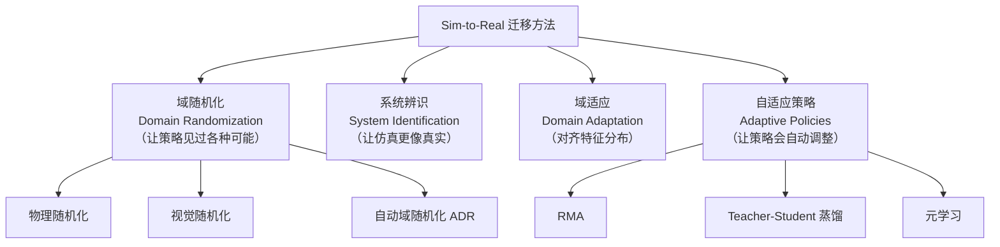
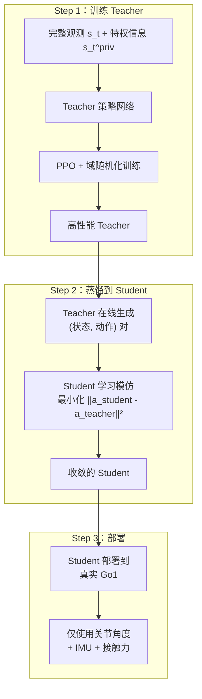
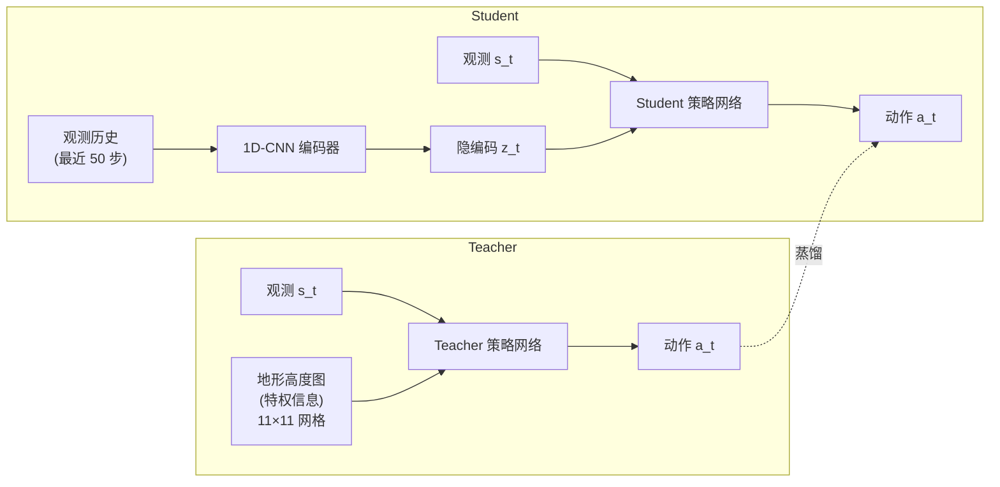
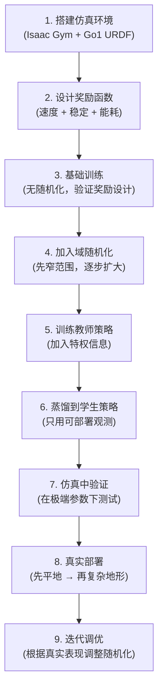

# Sim-to-Real 迁移综述：如何让仿真中训练的策略在真实世界工作

> **综述范围**：Sim-to-Real Transfer 的核心方法论、经典案例与最新进展  
> **关键词**：Domain Randomization、System Identification、Domain Adaptation、RMA、Teacher-Student、Reality Gap  
> **适用读者**：有基本数学素养（线性代数、概率论）但不了解 Sim-to-Real 领域的本科生

---

## 相关阅读

在阅读本文之前，建议先了解以下内容：

- [策略梯度与 PPO](/前置知识/000a_前置知识_策略梯度与PPO) — 本文使用的核心 RL 算法
- [深度强化学习方法综述](./S01_深度强化学习方法综述) — 仿真中常用的 RL 算法全景
- [机器人模仿学习综述](./S02_机器人模仿学习综述) — 模仿学习同样面临 sim-to-real 问题
- [行为克隆与 RL 微调范式](/前置知识/000d_前置知识_行为克隆与RL微调范式) — 先模仿再强化的范式

---

## 贯穿全文的例子：四足机器人户外行走

为了把抽象概念讲透，本文用一个**贯穿始终的具体场景**：

> **场景**：在 NVIDIA Isaac Gym 仿真器中训练一个四足机器人（对标 Unitree Go1）在草地和碎石地面上稳定行走，然后将训练好的策略**直接部署**到真实的 Unitree Go1 机器人上。

具体定义：

| 符号 | 含义 | 具体示例 |
|------|------|----------|
| $s_t$ | 状态（观测） | 12 个关节角度 + 12 个关节角速度 + 机身姿态（roll, pitch, yaw）+ 机身角速度 = 共 36 维 |
| $a_t$ | 动作 | 12 个关节的目标角度（PD 控制器的参考位置） |
| $r_t$ | 奖励 | 前进速度奖励 - 能耗惩罚 - 跌倒惩罚 |
| $\xi$ | 环境参数 | 地面摩擦系数、机器人质量、电机力矩上限、地形坡度等 |
| $\gamma$ | 折扣因子 | $0.99$（关注长远表现） |

后面每引入一个新方法，都会回到这个例子具体说明。

---

## 1. 引言：Reality Gap 是什么

### 1.1 为什么在仿真中训练

训练一个四足机器人行走策略，如果直接在真实硬件上做 [强化学习](./S01_深度强化学习方法综述)（试错学习），会遇到：

- **安全问题**：机器人跌倒可能摔坏自己或伤人
- **时间成本**：一个 episode 在真实世界需要几秒到几分钟；训练通常需要 $10^7 \sim 10^9$ 步交互
- **磨损问题**：电机、减速器的疲劳寿命有限
- **不可并行**：你只有一台机器人（或几台），仿真中可以开 4096 个并行环境

仿真的优势太明显了：Isaac Gym 在单张 RTX 3090 上可以同时跑 4096 个 Go1 环境，**一小时的 wall-clock time ≈ 数百年的仿真经验**。

### 1.2 Reality Gap 的来源

但仿真毕竟不是现实。把仿真中训练好的策略直接"复制粘贴"到真实 Go1 上，你会看到机器人在几步之内就摔倒或抖动。原因是 **Reality Gap（现实差距）**：

| 差距类型 | 仿真中的假设 | 真实世界的情况 |
|----------|-------------|---------------|
| 动力学 | 刚体碰撞、Coulomb 摩擦模型 | 柔性脚垫、地面变形、滑动摩擦非线性 |
| 执行器 | 理想力矩输出 | 电机有力矩限制、齿轮间隙、迟滞 |
| 传感器 | IMU 零噪声 | IMU 有偏置漂移、关节编码器有量化误差 |
| 延迟 | 控制频率严格 500Hz | 通信延迟 5~20ms 不等 |
| 环境 | 平坦地面 | 草地有起伏、碎石有不确定接触 |

**类比**：这就像你在完美模拟器里练了 1000 小时车技，但真实路面有坑洼、方向盘有虚位、刹车有延迟——直接上路很可能翻车。

### 1.3 解决思路总览

Sim-to-Real 的研究目标就是**跨越 Reality Gap**，核心思路有四大类：

下面逐一详细展开。

---

## 2. 域随机化（Domain Randomization）

### 2.1 核心哲学

域随机化的思想可以一句话概括：

> **如果策略在足够多样化的仿真环境中都能稳定工作，那真实世界不过是这些环境中的"又一个样本"而已。**

回到我们的例子：如果 Go1 在仿真中已经学会了在摩擦系数从 0.2（冰面）到 2.0（橡胶地）的所有地面上行走，那真实草地的摩擦系数 ≈ 0.7 对它来说没什么特别的。

### 2.2 形式化定义

训练时，每个 episode 开始前从参数分布中采样环境参数：

$$
\xi \sim p(\xi) = \mathcal{U}(\xi_{\min}, \xi_{\max})
$$

**一句话直觉**：每局游戏开始前，"上帝"摇一次骰子决定这局的物理规则是什么。

**逐项拆解**：
- $\xi$ — 环境参数向量，包含摩擦、质量、延迟等所有可随机化的参数
- $p(\xi)$ — 参数的先验分布，通常取均匀分布 $\mathcal{U}$
- $\xi_{\min}, \xi_{\max}$ — 随机化的上下界，需要人工设定（或用 ADR 自动调）

**数字例子**（Go1 场景）：
- 地面摩擦：$\mu \sim \mathcal{U}(0.3, 2.0)$，真实草地 ≈ 0.7
- 机器人总质量：$m \sim \mathcal{U}(10\text{kg}, 16\text{kg})$，真实 Go1 ≈ 12kg
- 控制延迟：$\tau \sim \mathcal{U}(0\text{ms}, 40\text{ms})$，真实 ≈ 10ms

策略的训练目标是**在所有可能环境上的期望回报最大化**：

$$
J(\theta) = \mathbb{E}_{\xi \sim p(\xi)} \left[ \mathbb{E}_{\tau \sim \pi_\theta} \left[ \sum_{t=0}^{T} \gamma^t r(s_t, a_t) \;\middle|\; \xi \right] \right]
$$

**一句话直觉**：策略的"成绩"不是在某一个环境里的得分，而是在所有可能环境上的**平均**得分。

**逐项拆解**：
- $\theta$ — 策略网络的参数（要优化的对象）
- $\mathbb{E}_{\xi \sim p(\xi)}$ — 对所有可能的环境参数取期望（"平均化"环境）
- $\mathbb{E}_{\tau \sim \pi_\theta}$ — 对策略产生的轨迹取期望
- $\sum_{t=0}^T \gamma^t r(s_t,a_t)$ — 折扣累积回报
- 条件 $|\;\xi$ — 在给定环境参数 $\xi$ 下

**数字例子**：假设只有两种环境——草地（$\xi_1$, 概率 0.5）和碎石（$\xi_2$, 概率 0.5）。策略在草地上跑 100 步不摔得 50 分，在碎石上跑 60 步摔倒得 20 分，则 $J(\theta) = 0.5 \times 50 + 0.5 \times 20 = 35$。

### 2.3 物理参数随机化（详细展开）

这是 sim-to-real 中**最重要也最常用**的技术。下面列出 Go1 行走任务中典型的随机化参数：

| 参数类别 | 具体参数 | 随机化范围 | 为什么要随机化 |
|----------|----------|-----------|---------------|
| 质量属性 | 机身质量 | $\pm 30\%$ | 携带不同负载 |
| 质量属性 | 腿部连杆质量 | $\pm 20\%$ | 制造公差 |
| 质量属性 | 质心位置偏移 | $\pm 3$cm | 负载放置不对称 |
| 摩擦 | 脚-地面摩擦系数 | $[0.3, 2.0]$ | 不同地面材质 |
| 摩擦 | 关节摩擦（阻尼） | $\pm 50\%$ | 润滑程度不同 |
| 执行器 | 电机力矩上限 | $\pm 20\%$ | 电池电量影响 |
| 执行器 | PD 增益 | $\pm 30\%$ | 控制器参数匹配 |
| 延迟 | 观测延迟 | $[0, 30]$ms | 通信与计算延迟 |
| 延迟 | 动作延迟 | $[0, 20]$ms | 指令执行延迟 |
| 噪声 | IMU 噪声 | 加性高斯 $\sigma=0.05$ | 传感器噪声 |
| 噪声 | 关节角度噪声 | 加性高斯 $\sigma=0.01$rad | 编码器精度 |
| 地形 | 坡度 | $[0°, 15°]$ | 实际部署地形 |
| 外力 | 随机推力 | $[0, 30]$N，持续 0.1~0.5s | 意外碰撞 |

#### 参数选择的关键原则

域随机化的**参数选择**是这一方法成功与否的关键。以下是实践中总结的原则：

1. **覆盖真实值**：随机化范围必须包含真实世界的值。如果真实摩擦是 0.7 但你只随机化 $[1.0, 2.0]$，策略到真实世界必然失败。

2. **不要太宽**：范围过大会导致训练困难。想象让策略同时适应冰面（$\mu=0.1$）和橡胶垫（$\mu=3.0$）——最优步态完全不同，策略只能学到一个"两头不讨好"的折衷。

3. **重要参数优先**：对任务影响最大的参数优先保证覆盖。对 Go1 行走来说：地面摩擦 > 机身质量 > 电机力矩 > 传感器噪声。

4. **逐步扩大**：先用较窄的范围训练出基础策略，再逐步扩大范围（这就是 ADR 的思想）。

5. **相关性要考虑**：有些参数组合在真实世界中不会出现（如极轻质量 + 极高力矩），可以用联合分布约束。

### 2.4 视觉随机化

如果策略的输入包含相机图像（如 Go1 上的 RealSense 深度相机），则需要对渲染进行随机化：

| 随机化对象 | 方法 | 效果 |
|-----------|------|------|
| 光照 | 随机光源位置/强度/色温 | 鲁棒于户外光照变化 |
| 纹理 | 地面纹理随机替换（草地/沥青/瓷砖/随机花纹） | 不依赖特定纹理 |
| 相机参数 | 焦距、畸变系数随机 | 适应不同相机 |
| 背景 | 随机背景图/颜色 | 忽略无关背景 |
| 物体颜色 | 机器人/地面颜色随机 | 不依赖特定颜色 |
| 干扰物 | 随机添加不相关物体 | 忽略视觉干扰 |

**实用技巧**：对于 Go1 行走任务，如果只用本体感觉（关节角度 + IMU），则不需要视觉随机化。视觉随机化主要用于需要相机输入的高级任务（如地形感知、物体识别）。

**OpenAI Rubik's Cube 的极端做法**：他们把桌面纹理换成完全随机的噪声图、把魔方颜色随机化、把光照变成彩虹色——策略在这种"地狱模式"训练后，对现实中正常的视觉变化完全免疫。

### 2.5 自动域随机化（ADR）

#### 动机

手动设定随机化范围有两个问题：
1. **太窄**：可能覆盖不到真实世界
2. **太宽**：训练困难，策略学不会

ADR（Automatic Domain Randomization）让范围**自动生长**：从窄范围开始，策略表现好就扩大，表现差就缩小。

#### 算法

$$
\xi_{\text{bound}}^{(k+1)} = \begin{cases}
\xi_{\text{bound}}^{(k)} + \Delta & \text{if } \bar{R}^{(k)} > \tau_{\text{up}} \\
\xi_{\text{bound}}^{(k)} - \Delta & \text{if } \bar{R}^{(k)} < \tau_{\text{down}} \\
\xi_{\text{bound}}^{(k)} & \text{otherwise}
\end{cases}
$$

**一句话直觉**：策略"考试"成绩好就给它出更难的题，成绩差就适当降低难度。

**逐项拆解**：
- $\xi_{\text{bound}}^{(k)}$ — 第 $k$ 轮的随机化边界（上界或下界）
- $\bar{R}^{(k)}$ — 策略在最近一批 episode 中的平均表现（如成功率或平均回报）
- $\tau_{\text{up}}$ — 扩大范围的阈值（如成功率 > 80%）
- $\tau_{\text{down}}$ — 缩小范围的阈值（如成功率 < 20%）
- $\Delta$ — 每次调整的步长（如摩擦系数 ±0.05）

**数字例子**（Go1 地面摩擦）：
- 初始范围：$\mu \in [0.5, 1.5]$
- 训练 1000 episodes 后成功率 = 85% > $\tau_{\text{up}} = 0.8$
- 扩大范围：$\mu \in [0.45, 1.55]$
- 继续训练...成功率 = 90% > 0.8 → 扩大到 $[0.4, 1.6]$
- ...最终范围可能稳定在 $[0.2, 2.5]$

#### ADR 的优势

1. **无需人工调参**：不再纠结"摩擦应该随机化 ±30% 还是 ±50%"
2. **课程学习效果**：从简单到难，训练更稳定
3. **自动发现关键参数**：某些参数范围增长很快（对迁移重要），某些几乎不增长（对迁移不重要）

---

## 3. 系统辨识（System Identification）

### 3.1 核心思想

域随机化的哲学是"让策略适应一切"，系统辨识的哲学是**"让仿真更像真实"**。

如果仿真器能完美复现真实世界的物理，那根本不需要其他 sim-to-real 技术——仿真中训练的策略直接就能在真实世界工作。

### 3.2 经典系统辨识

**目标**：找到一组环境参数 $\xi^*$，使仿真器的行为尽可能逼近真实系统。

$$
\xi^* = \arg\min_\xi \sum_{i=1}^{N} \left\| f_{\text{sim}}(s_i, a_i; \xi) - s_{i+1}^{\text{real}} \right\|^2
$$

**一句话直觉**：调整仿真器的旋钮（参数），让仿真器的预测和真实测量尽量吻合。

**逐项拆解**：
- $\xi^*$ — 最优仿真参数（要找的东西）
- $f_{\text{sim}}(s_i, a_i; \xi)$ — 仿真器在参数 $\xi$ 下，从状态 $s_i$ 执行动作 $a_i$ 后预测的下一状态
- $s_{i+1}^{\text{real}}$ — 真实系统中实际观察到的下一状态
- $N$ — 收集的数据点数量
- $\|\cdot\|^2$ — L2 范数，衡量偏差大小

**数字例子**（Go1 场景）：
- 在真实 Go1 上执行一段预定义的动作序列（如让四条腿依次抬起）
- 记录每个时刻的关节角度 $s_t^{\text{real}}$
- 在仿真中执行相同的动作序列，尝试不同的参数 $\xi$（如摩擦=0.5、0.6、0.7...）
- 找到使仿真轨迹最接近真实轨迹的参数

**流程**：

### 3.3 可微仿真（Differentiable Simulation）

传统系统辨识需要用黑盒优化（如 CMA-ES、贝叶斯优化），效率较低。**可微仿真器**（如 Brax、DiffTaichi、Warp）让仿真过程对参数可导：

$$
\nabla_\xi \mathcal{L} = \nabla_\xi \sum_{t=0}^{T} \left\| s_t^{\text{sim}}(\xi) - s_t^{\text{real}} \right\|^2
$$

**一句话直觉**：有了梯度信息，调参就像有了导航——知道该往哪个方向调以及调多少。

**逐项拆解**：
- $\nabla_\xi$ — 对仿真参数 $\xi$ 求梯度
- $s_t^{\text{sim}}(\xi)$ — 仿真状态是参数 $\xi$ 的函数（可微分）
- 整个式子告诉我们：当前参数 $\xi$ 应该往哪个方向变化才能减小仿真与真实的偏差

**优势**：传统辨识可能需要 1000 次仿真试验才能找到好参数，可微仿真可能只需要 10~50 步梯度下降。

### 3.4 在线系统辨识

环境参数可能**随时间变化**（如 Go1 在行走过程中从水泥路走到草地），静态辨识不够用。在线辨识持续更新参数估计：

- 使用滑动窗口的最近观测数据
- 用 RNN/LSTM 将观测历史映射到隐式参数估计
- 检测到参数突变时快速响应

### 3.5 辨识 + 随机化的结合

实践中最有效的方案往往是**两者结合**：

1. 先做系统辨识，得到粗略估计 $\hat{\xi}$（如 Go1 的腿部质量 ≈ 0.8kg）
2. 以 $\hat{\xi}$ 为**中心**做域随机化：$\xi \sim \mathcal{U}(\hat{\xi} - \delta, \hat{\xi} + \delta)$
3. 随机化范围可以比"盲猜"时窄很多（$\delta$ 更小），训练更容易

**直觉**：系统辨识给了一个"大概对"的起点，域随机化在这个起点周围做"保险"。

---

## 4. 域适应（Domain Adaptation）

### 4.1 动机

域随机化和系统辨识都是在**仿真侧**做文章。域适应则是让策略的**特征表示**在仿真和真实之间对齐——即使输入看起来不同，提取出的"有用信息"应该相同。

### 4.2 对抗域适应

核心思想借鉴 GAN：训练一个判别器 $D_\phi$ 判断特征来自仿真还是真实，同时训练特征提取器 $E_\theta$ 欺骗判别器。

$$
\min_\theta \max_\phi \; \mathbb{E}_{x \sim p_{\text{sim}}}[\log D_\phi(E_\theta(x))] + \mathbb{E}_{x \sim p_{\text{real}}}[\log(1 - D_\phi(E_\theta(x)))]
$$

**一句话直觉**：强迫特征提取器产生的特征"看不出是来自仿真还是真实"——如果判别器都分不清，说明特征已经域无关了。

**逐项拆解**：
- $E_\theta(x)$ — 特征提取器，输入图像 $x$，输出特征向量
- $D_\phi(\cdot)$ — 域判别器，输出"是仿真图像的概率"
- $p_{\text{sim}}$ — 仿真图像分布
- $p_{\text{real}}$ — 真实图像分布
- $\min_\theta$ — 特征提取器想让判别器**犯错**
- $\max_\phi$ — 判别器想**正确区分**

**Go1 例子**：
- 仿真中渲染的 Go1 行走画面（卡通感、简单光照）
- 真实的 Go1 行走画面（复杂光照、真实纹理）
- 对抗训练后，从两种图像提取的特征在同一空间中混合——策略看到任一种图像都能正确反应

### 4.3 图像翻译（Sim-to-Real Image Translation）

另一种思路：不改特征，改图像本身。用 GAN 把仿真图像"翻译"成看起来真实的图像：

- **CycleGAN**：无配对数据的风格迁移（仿真 → 真实风格）
- **RL-CycleGAN**：保证翻译后的图像保留了策略需要的信息（物体位置等）

### 4.4 表征学习

学习对域变化鲁棒的高层表征：

- **对比学习**：仿真和真实的"同一场景"靠近，不同场景远离
- **预训练编码器**（CLIP、DINOv2）：在海量数据上预训练的特征天然对域变化鲁棒
- **深度图/点云**：这些几何表示的 sim-real gap 天然比 RGB 小很多

**实用建议**：对 Go1 行走，如果需要视觉输入做地形感知，**优先用深度图**（Intel RealSense D435i 的深度数据 sim-real gap 很小），而非 RGB 图像。

---

## 5. 自适应策略（Adaptive Policies）

前面三种方法有一个共同的局限：它们假设策略是"固定"的——训练完就不变了。但真实世界是**动态变化**的：Go1 走着走着，从草地走上了碎石，脚下的摩擦突然变了。

自适应策略的核心思想是：**让策略在部署时能根据当前环境自动调整行为**。

### 5.1 条件策略（Conditioned Policy）

最直接的想法：把环境参数 $\xi$ 作为额外输入喂给策略。

$$
a_t = \pi_\theta(s_t, \xi)
$$

**问题**：部署时我们不知道真实的 $\xi$！（我们不知道脚下碎石的精确摩擦系数）

**解决方案**：不给真实 $\xi$，给一个**从观测历史推断出来的估计** $\hat{\xi}$ 或者隐式编码 $z$。

### 5.2 RMA：Rapid Motor Adaptation（重点）

RMA（Kumar et al., RSS 2021）是 sim-to-real 领域的**里程碑工作**，首次实现了四足机器人在未知地形上的即时自适应。它的核心是**两阶段训练**。

#### 第一阶段：训练带特权信息的"教师"策略

在仿真中，我们知道所有环境参数 $\xi$（摩擦、质量、地形等），这是部署时没有的"特权信息"（privileged information）。

$$
\pi_{\text{teacher}}(a_t | s_t, e_t)
$$

其中 $e_t = g(\xi)$ 是环境参数的编码（一个低维向量）。

**训练过程**：
- 用 [PPO](/前置知识/000a_前置知识_策略梯度与PPO) 训练教师策略
- 教师可以"作弊"——它知道脚下的摩擦、机器人的精确质量等
- 因为有了特权信息，教师策略学得又快又好

**Go1 例子**：教师策略知道当前走的是摩擦=0.5 的碎石地+机身质量偏重 2kg。它可以据此选择更稳的步态（步幅更小、脚抬更高）。

#### 第二阶段：训练适应模块（Adaptation Module）

部署时没有特权信息 $e_t$，我们需要一个模块从**可观测的历史**中推断出等价信息。

$$
\hat{e}_t = \mu_\phi(s_{t-H:t}, a_{t-H:t-1})
$$

**一句话直觉**：通过回顾最近 H 步的"行为结果"来推断当前的环境性质。

**逐项拆解**：
- $\hat{e}_t$ — 推断出来的环境编码（替代真实 $e_t$）
- $\mu_\phi$ — 适应模块（通常是一个 1D-CNN 或 MLP），参数为 $\phi$
- $s_{t-H:t}$ — 最近 $H$ 步的状态序列（如过去 50 步 = 0.1 秒 × 50 = 5 秒的历史）
- $a_{t-H:t-1}$ — 对应的动作序列

**训练方法**：
- 在仿真中用教师策略收集数据
- 监督学习：让适应模块的输出 $\hat{e}_t$ 逼近真实环境编码 $e_t$

$$
\mathcal{L}_{\text{adapt}} = \mathbb{E}\left[\left\| \mu_\phi(s_{t-H:t}, a_{t-H:t-1}) - e_t \right\|^2 \right]
$$

**一句话直觉**：教适应模块"看过去几步的行为就能猜出环境参数"。

**数字例子**：
- 假设 Go1 走在低摩擦地面上，最近 50 步中它的脚频繁打滑（表现为：关节速度命令大但实际位移小）
- 适应模块学会了"看到频繁打滑的模式 → 输出低摩擦对应的编码 $\hat{e}_t$"
- 策略收到低摩擦编码后 → 切换到更保守的步态

#### RMA 完整流程

#### 为什么 RMA 如此成功

1. **信息论保证**：教师策略已经证明了"有了正确的 $e_t$ 就够了"，所以问题简化为如何推断 $e_t$
2. **因果可辨识**：环境参数会因果地影响观测（低摩擦 → 打滑 → 关节角度变化异常），所以从历史确实能推断参数
3. **在线适应**：不需要停下来辨识，走着就能适应（延迟 ≈ H 步 ≈ 0.1~0.5 秒）

### 5.3 Teacher-Student 蒸馏（重点）

Teacher-Student 是另一个在 sim-to-real 中极其重要的范式，与 RMA 密切相关但思路略有不同。

#### 核心问题

在仿真中，我们往往有**部署时无法获取的信息**：

| 仿真中可用（特权信息） | 部署时不可用 |
|----------------------|-------------|
| 完整地形高度图 | 只有脚下接触反馈 |
| 精确物体位置 | 只有嘈杂的相机图像 |
| 真实摩擦系数 | 无法直接测量 |
| 未来地形变化 | 无法预知 |

**Teacher-Student 思路**：先训练一个有特权信息的"教师"，再把教师的"知识"蒸馏到只用可部署信息的"学生"。

#### 训练流程

**Step 1：训练 Teacher（使用特权信息）**

$$
\pi_{\text{teacher}}(a_t | s_t, s_t^{\text{priv}})
$$

- $s_t$ — 部署时也能获取的观测（关节角度、IMU）
- $s_t^{\text{priv}}$ — 特权信息（如前方 1m 的地形高度图、精确摩擦系数）
- 用 PPO + 域随机化训练

**Go1 例子**：教师能"看见"前方地形的高度图（$20 \times 20$ 的网格，每格 5cm 分辨率），知道前面有个 10cm 的台阶。因此它提前抬高前脚。

**Step 2：训练 Student（只用可部署观测）**

学生策略只能使用部署时真正有的观测：

$$
\pi_{\text{student}}(a_t | s_t, h_t)
$$

其中 $h_t$ 是观测历史（替代特权信息）。

**蒸馏损失**：

$$
\mathcal{L}_{\text{distill}} = \mathbb{E}\left[\left\| \pi_{\text{student}}(s_t, h_t) - \pi_{\text{teacher}}(s_t, s_t^{\text{priv}}) \right\|^2 \right]
$$

**一句话直觉**：让学生模仿教师的输出——即使学生看不到完整地形，也要学会做出和"能看见地形的教师"一样的决策。

**逐项拆解**：
- $\pi_{\text{student}}(s_t, h_t)$ — 学生输出的动作（基于有限观测）
- $\pi_{\text{teacher}}(s_t, s_t^{\text{priv}})$ — 教师输出的动作（基于完整信息）
- $\|\cdot\|^2$ — 均方误差，让两者尽量一致

**数字例子**：
- 教师看见前方有台阶 → 输出"右前腿抬高 15cm"
- 学生看不见台阶，但回顾历史发现"上一步右前脚触地反力异常"→ 也输出"右前腿抬高 15cm"
- 损失 = $\|15 - 15\|^2 = 0$（完美模仿）

#### 为什么不直接训练学生策略？

你可能会问：既然最终用的是学生，为什么不直接用学生的观测训练？

答案是**训练效率**：
- 教师有完整信息，学习速度快（几小时）
- 直接训练学生（缺少关键信息），收敛极慢或根本学不到好策略
- 蒸馏相当于给学生一个"标准答案"来学习，比自己探索快得多

**类比**：就像学开车——教练坐旁边能看到仪表盘上的所有信息（教师），学生只能看前方路况；教练先演示正确操作，学生模仿教练的行为，比自己瞎摸索快得多。

#### Teacher-Student 完整流程

#### 蒸馏中的细节技巧

1. **DAgger 式数据收集**：不只用教师的轨迹，也让学生自己行动（学生犯错时教师纠正），避免分布偏移

2. **隐表征蒸馏**：不只蒸馏最终动作，还蒸馏中间层特征：
$$
\mathcal{L} = \alpha \|\hat{a} - a^*\|^2 + \beta \|z_{\text{student}} - z_{\text{teacher}}\|^2
$$

3. **联合训练**：某些方法中 Teacher 和 Student 交替训练，教师也在学生的状态分布下收集数据

### 5.4 RMA vs Teacher-Student：关系与区别

| 维度 | RMA | Teacher-Student |
|------|-----|-----------------|
| 教师输入 | $s_t$ + 环境参数编码 $e_t$ | $s_t$ + 特权观测 $s_t^{\text{priv}}$ |
| 学生学什么 | 学习推断环境编码 $\hat{e}_t$ | 学习直接模仿教师的动作 |
| 适应机制 | 显式估计环境参数 → 条件策略 | 隐式地从历史中提取等价信息 |
| 蒸馏什么 | 蒸馏环境编码 | 蒸馏动作（或动作+特征） |
| 用于 | 参数化环境变化（摩擦、质量） | 需要额外传感器信息（地形图） |
| 典型应用 | RMA（四足适应） | ANYmal（地形穿越） |

**它们经常组合使用**：例如 ANYmal 的训练同时用了 Teacher-Student 蒸馏（地形感知）和 RMA 式隐式适应（物理参数推断）。

### 5.5 元学习（Meta-Learning）

元学习（如 MAML）的思路是：训练策略的**初始参数**，使其能用极少量真实数据快速适应。

$$
\theta^* = \arg\min_\theta \sum_{i=1}^{N} \mathcal{L}_i\left(\theta - \alpha \nabla_\theta \mathcal{L}_i(\theta)\right)
$$

**一句话直觉**：找一个"万能起点"，从这个起点出发只需几步梯度下降就能适应任何新环境。

**逐项拆解**：
- $\theta^*$ — 最优的初始参数（元参数）
- $\mathcal{L}_i$ — 第 $i$ 个任务/环境的损失
- $\alpha \nabla_\theta \mathcal{L}_i(\theta)$ — 在第 $i$ 个任务上做一步梯度下降（内循环）
- 外层优化目标："内循环适应后的性能最好"

**Go1 例子**：
- 仿真中创建 100 种不同地形（任务）
- 元学习找到一个 $\theta^*$，从这个参数出发只需在真实 Go1 上走 10 步就能适应当前地形
- 实际效果：类似"给机器人一小段真实经验就能调好"

**局限**：元学习在部署时需要**在线梯度计算**，对硬件要求高；实际中 RMA 和 Teacher-Student 更受欢迎。

---

## 6. 仿真器选择

### 6.1 主流仿真器对比

选择仿真器是 sim-to-real 工程中的第一个决策。以下从多个维度对比：

| 仿真器 | GPU 并行 | 接触精度 | 可微分 | 渲染质量 | 典型用例 | 开源 |
|--------|---------|---------|--------|---------|---------|------|
| **Isaac Gym / Isaac Lab** | ✅ 4096+ | 中等 | 部分 | 基础 | 四足/灵巧手运动控制 | ✅ |
| **MuJoCo** | ❌（单线程快） | 高 | ❌ | 基础 | 精密操控、学术研究 | ✅ |
| **PyBullet** | ❌ | 中等 | ❌ | 基础 | 教学、快速原型 | ✅ |
| **SAPIEN** | 部分 | 中高 | ❌ | 中高 | 关节物体操控 | ✅ |
| **Genesis** | ✅ | 高 | ✅ | 中等 | 系统辨识、可微训练 | ✅ |
| **Brax** | ✅ (JAX) | 低 | ✅ | 无 | 快速迭代、进化策略 | ✅ |
| **Isaac Sim (Omniverse)** | ✅ | 中等 | 部分 | **照片级** | 视觉策略、数字孪生 | 免费 |

### 6.2 Go1 行走任务的仿真器选择

对于我们的 Go1 行走场景，推荐选择：

**首选：Isaac Gym / Isaac Lab**
- GPU 并行 4096 个 Go1 环境 → PPO 训练约 20 分钟收敛
- 接触模型足够好，配合域随机化可以跨越 sim-real gap
- NVIDIA 官方提供 Go1 URDF 模型
- 社区资源丰富（legged_gym、walk-these-ways 等开源代码）

**如果需要视觉输入：Isaac Sim（Omniverse）**
- 照片级渲染 → 减小视觉 sim-real gap
- 支持 RealSense 相机仿真
- 但速度比 Isaac Gym 慢 10~100 倍

**如果需要精确接触模型：MuJoCo**
- 接触力计算更精确
- 但无 GPU 并行，训练时间 10~100 倍

### 6.3 GPU 并行仿真的革命

GPU 并行仿真是近几年 sim-to-real 的**最大推动力**：

$$
\text{训练时间} \approx \frac{\text{需要的总交互步数}}{\text{并行环境数} \times \text{仿真步频率}}
$$

**数字例子**：
- 训练 Go1 行走需要约 $5 \times 10^8$ 步交互
- 单环境 MuJoCo（1000 Hz）：$5 \times 10^8 / 1000 = 500000$ 秒 ≈ **5.8 天**
- Isaac Gym 4096 并行环境（每环境 1000 Hz）：$5 \times 10^8 / (4096 \times 1000) \approx 122$ 秒 ≈ **2 分钟**（加上网络更新约 20~30 分钟总训练时间）

这意味着研究者可以在一天内**迭代数十次实验**，大大加速域随机化参数调优。

---

## 7. 经典案例研究

### 7.1 OpenAI — 用灵巧手解魔方（2019）

这是 sim-to-real 领域最具里程碑意义的工作之一。

**任务**：用一只 Shadow Dexterous Hand（24 自由度）将魔方旋转到目标状态。

**方法栈**：
- RL 算法：PPO（大规模分布式）
- Sim-to-Real：**域随机化 + ADR**
- 观测：RGB 相机（指尖位姿通过视觉估计）

**随机化范围（部分）**：

| 参数 | 随机化方式 |
|------|-----------|
| 魔方尺寸 | $\pm 15\%$ |
| 手指摩擦 | $[0.5, 2.0]$ |
| 关节阻尼 | $\pm 50\%$ |
| 重力方向 | 倾斜 ±15° |
| 视觉外观 | 完全随机纹理 + 随机光照 |
| 随机力 | 随机推魔方/手指 |
| 动作延迟 | $[0, 150]$ms |

**关键数据**：
- 训练时间：约 **13000 年**的仿真经验
- 域随机化参数：**数百个**维度同时随机化
- ADR 自动将范围扩大到比人工设定宽 **3~5 倍**
- 结果：仿真直接迁移到真实手，不需要任何真实数据

**教训**：
1. 足够大的随机化范围 + 足够大的策略网络 → 可以覆盖巨大的 reality gap
2. ADR 自动课程极大减少人工调参
3. 但训练成本巨大（千核集群训练数月）

### 7.2 ANYmal — 四足机器人穿越复杂地形（ETH Zurich, 2022）

**任务**：让 ANYmal 四足机器人在野外复杂地形（台阶、斜坡、碎石、间隙）上稳定行走。

**方法栈**：
- RL 算法：PPO
- Sim-to-Real：**域随机化 + Teacher-Student 蒸馏 + RMA 式适应**
- 仿真器：Isaac Gym

**Teacher-Student 具体设计**：

- Teacher 输入：当前关节状态 + 前方 $11 \times 11$ 地形高度图（仅在仿真中可用）
- Student 输入：当前关节状态 + 最近 50 步历史（部署时可用）
- 学生的 1D-CNN 编码器从历史中**隐式推断地形信息**

**结果**：
- 学生策略成功在从未见过的真实地形上行走
- 即使地形突变（从平地到台阶），0.5 秒内自动适应
- 论文中地形包括：楼梯、碎石路、斜坡、间隙

### 7.3 Unitree Go1 — Walk These Ways（2023）

这个工作与我们的贯穿例子高度相关。

**任务**：训练 Unitree Go1 执行多种步态（走、跑、跳），并允许用户在线调节步态参数。

**方法**：
- PPO + 大规模域随机化（Isaac Gym 4096 并行环境）
- 条件策略：用户可以实时调节步长、步频、步高
- 隐式适应：编码器从历史观测推断地面属性

**训练细节**：
- 随机化 20+ 物理参数
- 训练 3000 个 epoch ≈ 20~30 分钟（单 GPU）
- 直接部署到真实 Go1，无需任何真实数据

**成功关键**：
1. 奖励设计精细（不只是速度奖励，还有步态对称性、能耗、平滑性）
2. 域随机化覆盖了部署时遇到的所有变化
3. 策略网络够大（256×256 MLP）能记住所有情况

### 7.4 灵巧操控 — IsaacGymEnvs（2022-2024）

Isaac Gym 官方示例中的灵巧手操控：

- **任务**：用五指手（Allegro Hand 或 Shadow Hand）旋转方块到目标姿态
- **方法**：PPO + 域随机化 + ADR
- **训练时间**：3~4 小时（单 GPU，4096 并行环境）
- **随机化**：手指摩擦、物体质量/尺寸、关节间隙、重力抖动

---

## 8. 最佳实践：一个完整的 Sim-to-Real 工作流

### 8.1 从零开始的推荐流程

假设你现在有一台 Unitree Go1，想训练它在户外草地/碎石上行走。推荐的完整流程如下：

### 8.2 奖励函数设计

好的奖励函数是 sim-to-real 成功的基础。以下是 Go1 行走的典型奖励组合：

$$
r_t = w_v \cdot r_{\text{vel}} + w_s \cdot r_{\text{stable}} + w_e \cdot r_{\text{energy}} + w_p \cdot r_{\text{penalty}}
$$

| 奖励分量 | 公式 | 权重 | 含义 |
|----------|------|------|------|
| 前进速度 | $r_{\text{vel}} = \min(v_x / v_{\text{target}}, 1.0)$ | $w_v = 2.0$ | 鼓励按目标速度前进 |
| 姿态稳定 | $r_{\text{stable}} = -\|[\text{roll}, \text{pitch}]\|^2$ | $w_s = 0.5$ | 身体保持水平 |
| 能耗 | $r_{\text{energy}} = -\sum_j |\tau_j \cdot \dot{q}_j|$ | $w_e = 0.01$ | 减少电机功耗 |
| 关节加速度 | $r_{\text{smooth}} = -\|\ddot{q}\|^2$ | $w_{\text{sm}} = 0.001$ | 动作平滑 |
| 跌倒惩罚 | $r_{\text{fall}} = -100 \cdot \mathbb{1}[\text{fell}]$ | — | 不允许跌倒 |
| 脚部打滑 | $r_{\text{slip}} = -\sum_i \|v_{\text{foot}_i}\| \cdot c_i$ | $w_{\text{sl}} = 0.1$ | 脚触地时不应有水平速度 |

**关键技巧**：
- 不要只奖励速度，否则策略会学到"摔着前进"
- 能耗惩罚让策略偏好真实世界也高效的步态
- 动作平滑性惩罚避免高频抖动（对真实电机有害）

### 8.3 域随机化参数选择策略

这是实践中最常被问到的问题：**如何选择随机化什么、随机化多少？**

**第一步：识别 sim-real gap 的主要来源**

在真实 Go1 上跑一段固定轨迹，对比仿真：
- 哪些状态变量偏差最大？（如脚底滑动 → 摩擦是关键参数）
- 哪些时刻偏差最大？（如着地瞬间 → 接触模型是关键）

**第二步：从保守范围开始**

| 参数 | 初始范围 | 理由 |
|------|---------|------|
| 摩擦 | $[0.5, 1.5]$ | 大多数地面在此范围 |
| 质量 | $[-10\%, +30\%]$ | 允许背负载 |
| 延迟 | $[0, 20]$ms | 实测通常 5~15ms |
| PD 增益 | $[-20\%, +20\%]$ | 控制器参数不确定性 |

**第三步：迭代扩大**

1. 在当前范围训练策略
2. 部署到真实 Go1 观察失败模式
3. 失败与哪个参数相关？→ 扩大该参数范围
4. 重复

**第四步（进阶）：使用 ADR 自动化**

如果有足够算力，用 ADR 自动搜索范围。设定性能阈值（如"80% 的 episode 不跌倒"），让算法自动决定范围。

### 8.4 常见失败模式与解决方案

| 现象 | 可能原因 | 解决方案 |
|------|---------|---------|
| 在真实中立刻跌倒 | 延迟未随机化 | 加入 $[0, 40]$ms 观测/动作延迟 |
| 步态高频抖动 | 动作太激进 | 加动作平滑惩罚、降低动作频率 |
| 特定地面失败 | 摩擦范围不够 | 扩大摩擦随机化范围 |
| 能跑但不自然 | 奖励设计问题 | 加入步态对称性/能耗奖励 |
| 负重后失败 | 质量随机化不够 | 扩大质量范围、加质心偏移 |
| 转弯时失稳 | 只训练了直行 | 加入方向命令随机化 |

### 8.5 实用部署检查清单

- [ ] 确认控制频率一致（仿真 50Hz → 真实也是 50Hz）
- [ ] 确认观测坐标系一致（IMU 的轴定义）
- [ ] 确认动作含义一致（绝对角度 vs 角度增量）
- [ ] 确认延迟补偿（如果仿真中有随机延迟，部署时不需要额外补偿）
- [ ] 先在平坦安全地面测试
- [ ] 配备急停按钮
- [ ] 录制部署数据用于后续分析

---

## 9. 方法对比总结

### 9.1 四种方法的全面对比

| 维度 | 域随机化 | 系统辨识 | 域适应 | 自适应策略（RMA/T-S） |
|------|---------|---------|--------|---------------------|
| 核心思想 | 暴力覆盖所有可能 | 让仿真逼近真实 | 对齐特征分布 | 策略在线自适应 |
| 是否需要真实数据 | ❌ | ✅（少量） | ✅（无标注） | ❌ |
| 计算成本 | 中高（大范围训练慢） | 低 | 中 | 高（两阶段训练） |
| 适应能力 | 静态（训练后固定） | 静态 | 静态 | **动态**（在线） |
| 保守程度 | 高（折衷策略） | 低（精确对齐） | 中 | 低（按需适应） |
| 实现难度 | ⭐⭐ | ⭐⭐⭐ | ⭐⭐⭐⭐ | ⭐⭐⭐ |
| 最佳场景 | 运动控制 | 精密操控 | 视觉策略 | 未知/变化环境 |

### 9.2 场景推荐方案

| 应用场景 | 推荐方法组合 | 理由 |
|---------|-------------|------|
| Go1 户外行走 | 域随机化 + RMA + PPO | 地形多变需在线适应 |
| 灵巧手操控 | 大规模域随机化 + ADR + PPO | 接触复杂但环境较固定 |
| 视觉导航 | 视觉随机化 + 预训练编码器 + 少量 real 微调 | 视觉 gap 大 |
| 工业装配 | 系统辨识 + 窄域随机化 + 力控 | 精度要求高 |
| 长时序操控 | Teacher-Student + 层次化策略 | 信息不对称 |

### 9.3 方法组合的协同效应

在实际项目中，**很少只用一种方法**。以我们的 Go1 场景为例，最终方案通常是：

$$
\underbrace{\text{域随机化}}_{\text{基础鲁棒性}} + \underbrace{\text{Teacher-Student}}_{\text{利用特权信息}} + \underbrace{\text{RMA 适应}}_{\text{在线调整}} + \underbrace{\text{系统辨识}}_{\text{缩小初始 gap}}
$$

---

## 10. 未来方向

### 10.1 Real-to-Sim-to-Real

**先从真实世界重建高保真数字孪生，再在其中训练**：

- 用 NeRF / 3D Gaussian Splatting 重建视觉场景
- 用可微仿真辨识物理参数
- 在重建的"数字孪生"中训练策略
- 重新部署到真实世界

**进展**：RoboCasa、MimicGen 等工作已经在探索自动生成逼真训练环境。

### 10.2 基础模型减小域差距

预训练基础模型提供了天然的域不变表征：

- **视觉基础模型**（CLIP、DINOv2、SAM）：其特征在仿真和真实图像上高度一致，无需额外域适应
- **语言条件策略**：用自然语言描述任务，语义层面不存在域差距
- **跨具身迁移**：预训练在多种机器人上的策略可能天然更鲁棒

### 10.3 混合训练范式

不再追求"纯仿真"训练：
- 仿真中学基础运动能力（10 分钟仿真训练）
- 真实世界中用少量数据微调适配（10 分钟真实交互）
- 在线持续自适应（部署中学习）

**代表工作**：Hybrid RL、Sim-and-Real（同时在仿真和真实中训练）。

### 10.4 LLM/VLM 辅助的 Sim-to-Real

大语言模型可以帮助：
- **自动设计奖励函数**（如 Eureka）：LLM 根据任务描述生成奖励代码
- **自动选择域随机化参数**：LLM 根据任务和机器人描述推荐关键参数
- **故障诊断**：根据部署视频分析失败原因并建议调整

### 10.5 仿真精度持续提升

- **神经接触模型**：用数据驱动的模型替代传统接触方程
- **柔性体/绳索/布料**：传统仿真器难以处理的材料
- **多物理场耦合**：流体-固体交互（如水中行走）
- **可微仿真 + 大规模并行**：同时享受梯度信息和海量数据

### 10.6 从单任务到通用运动智能

当前 sim-to-real 主要是**单任务**的（训练一个"行走"策略）。未来方向：
- 训练一个通用的"运动基础模型"，在仿真中学会各种运动技能
- 部署时通过指令切换技能
- 持续在真实世界中学习新技能并反馈到仿真

---

## 11. 总结

Sim-to-Real 迁移是让 RL 策略在真实机器人上工作的关键桥梁。回顾我们的 Go1 例子：

1. **Reality Gap 客观存在**：仿真摩擦、延迟、噪声都与真实不同
2. **域随机化**是最常用的"保底"方案：训练时加够随机化，真实世界就是"又一个样本"
3. **RMA/Teacher-Student** 提供在线适应能力：策略可以根据运行时观测自动调整
4. **系统辨识 + 窄范围随机化**是精确方案的基础
5. **GPU 并行仿真**（Isaac Gym）让整个流程在 30 分钟内完成
6. **实践中多种方法组合**效果最好

对于想开始 sim-to-real 研究的同学，建议的学习路径：

1. 先学 [PPO](/前置知识/000a_前置知识_策略梯度与PPO) 和 [深度 RL 基础](./S01_深度强化学习方法综述)
2. 跑通 Isaac Gym 的 locomotion 示例（legged_gym）
3. 在仿真中加入域随机化，观察策略鲁棒性变化
4. 实现 Teacher-Student 蒸馏
5. 如果有真实机器人 → 部署并迭代

---

## 延伸阅读

### 奠基性论文

- Tobin et al., *"Domain Randomization for Transferring Deep Neural Networks from Simulation to the Real World"* (IROS, 2017) — 视觉域随机化开山之作
- Peng et al., *"Sim-to-Real Transfer of Robotic Control with Dynamics Randomization"* (ICRA, 2018) — 物理参数随机化先驱
- OpenAI, *"Solving Rubik's Cube with a Robot Hand"* (2019) — ADR + 大规模域随机化的极致应用

### 自适应策略

- Kumar et al., *"RMA: Rapid Motor Adaptation for Legged Robots"* (RSS, 2021) — RMA 原始论文
- Lee et al., *"Learning Quadrupedal Locomotion over Challenging Terrain"* (Science Robotics, 2020) — ANYmal Teacher-Student
- Miki et al., *"Learning Robust Perceptive Locomotion for Quadrupedal Robots in the Wild"* (Science Robotics, 2022) — ANYmal 野外部署

### 仿真器与工程实践

- Makoviychuk et al., *"Isaac Gym: High Performance GPU-Based Physics Simulation for Robot Learning"* (NeurIPS, 2021)
- Rudin et al., *"Learning to Walk in Minutes Using Massively Parallel Deep Reinforcement Learning"* (CoRL, 2022) — legged_gym
- Margolis et al., *"Walk These Ways: Tuning Robot Control for Generalization"* (CoRL, 2023) — Go1 多步态

### 前沿方向

- Ma et al., *"Eureka: Human-Level Reward Design via Coding Large Language Models"* (ICLR, 2024) — LLM 辅助奖励设计
- Torne et al., *"Reconciling Reality through Simulation: A Real-to-Sim-to-Real Approach"* (CoRR, 2024)
- He et al., *"Learning Human-to-Robot Handovers from Point Clouds"* (CVPR, 2022) — 点云减小视觉域差距

---

## 附录：关键公式速查

| 方法 | 核心公式 | 含义 |
|------|---------|------|
| 域随机化目标 | $J(\theta) = \mathbb{E}_{\xi \sim p(\xi)}[\mathbb{E}_\pi[\sum \gamma^t r_t \mid \xi]]$ | 在所有环境参数上最大化平均回报 |
| ADR 范围更新 | $\xi_{\text{bound}}^{(k+1)} = \xi_{\text{bound}}^{(k)} \pm \Delta$ | 表现好扩大、表现差缩小 |
| 系统辨识 | $\xi^* = \arg\min_\xi \sum \|f_{\text{sim}}(\cdot;\xi) - f_{\text{real}}\|^2$ | 找最匹配真实的仿真参数 |
| 对抗域适应 | $\min_\theta \max_\phi [\log D + \log(1-D)]$ | 让特征域无关 |
| RMA 适应模块 | $\hat{e}_t = \mu_\phi(s_{t-H:t}, a_{t-H:t-1})$ | 从历史推断环境编码 |
| Teacher-Student | $\mathcal{L} = \|\pi_{\text{student}} - \pi_{\text{teacher}}\|^2$ | 学生模仿教师动作 |
| 元学习 (MAML) | $\theta^* = \arg\min_\theta \sum_i \mathcal{L}_i(\theta - \alpha\nabla\mathcal{L}_i)$ | 找到可快速适应的初始参数 |
