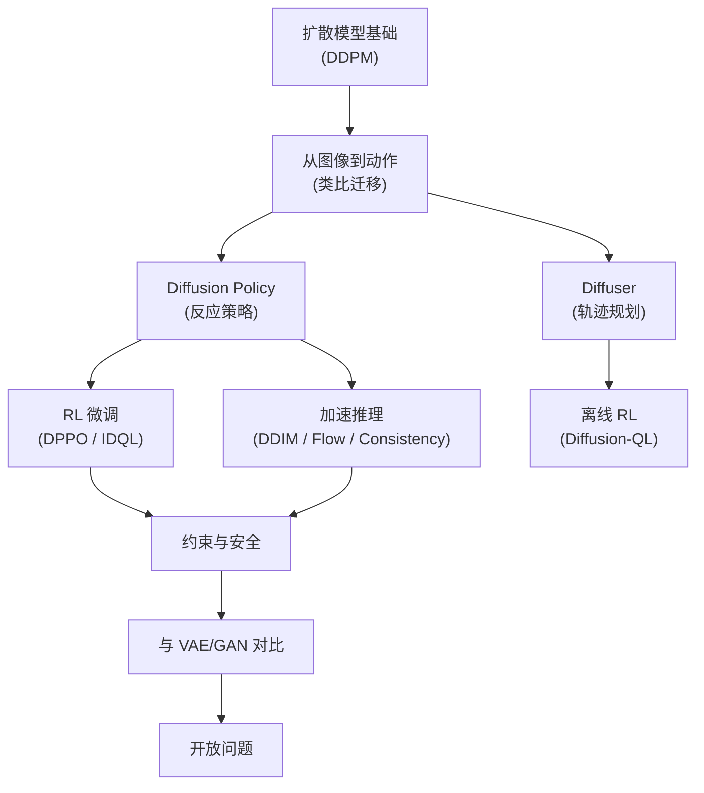
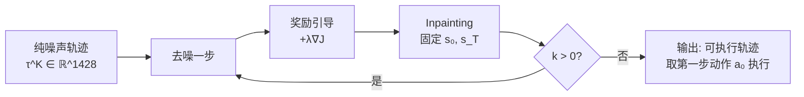
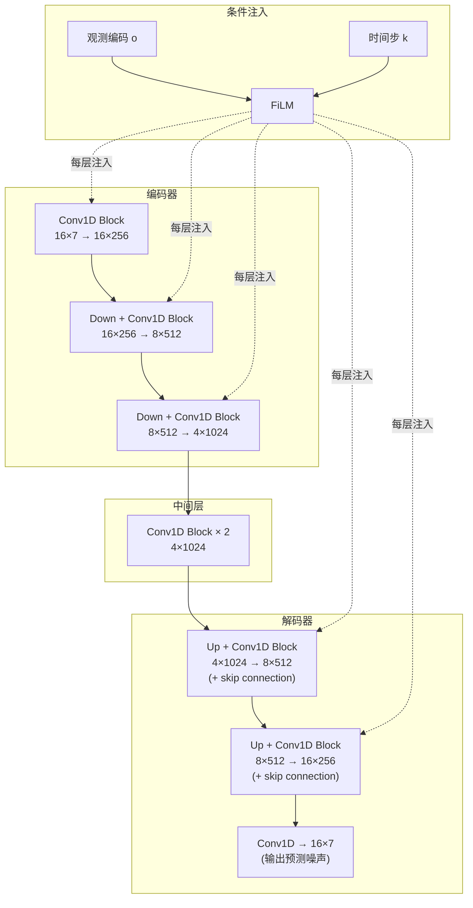
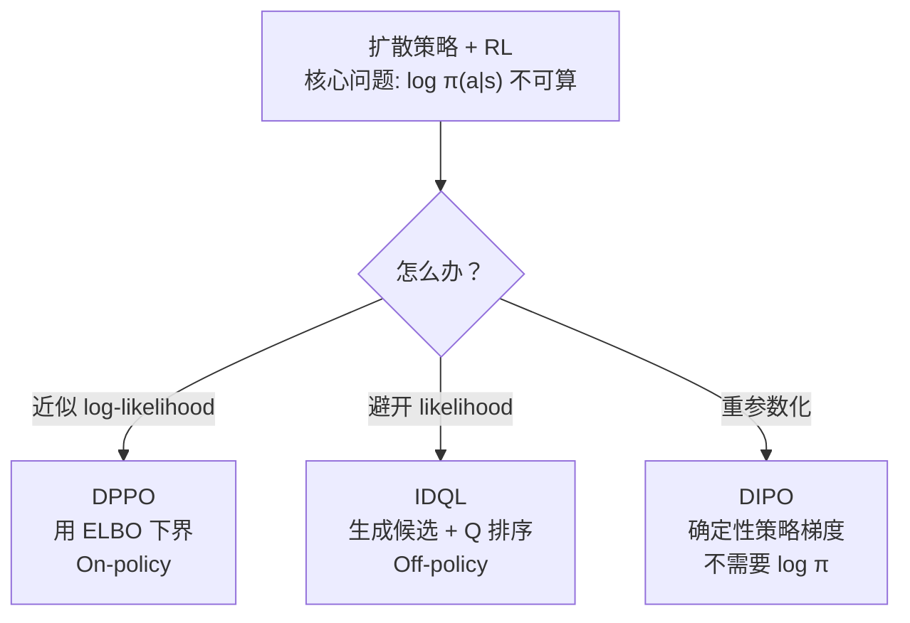
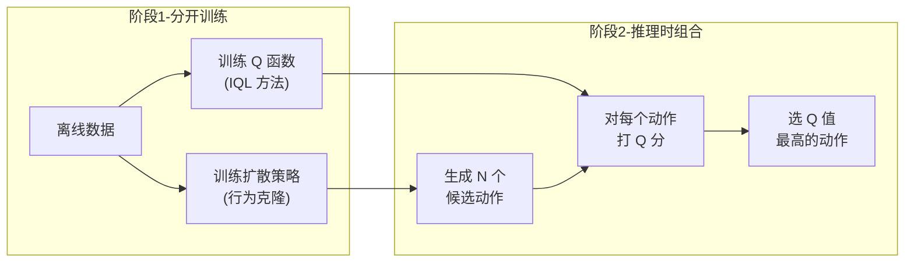
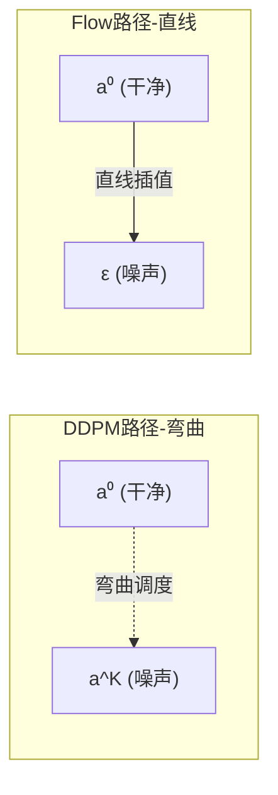
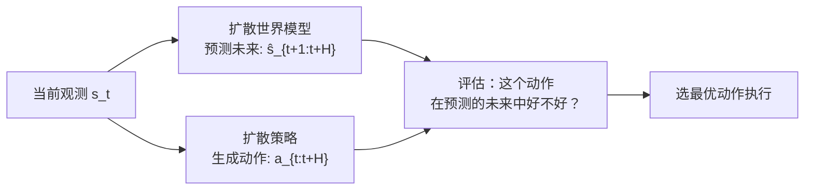
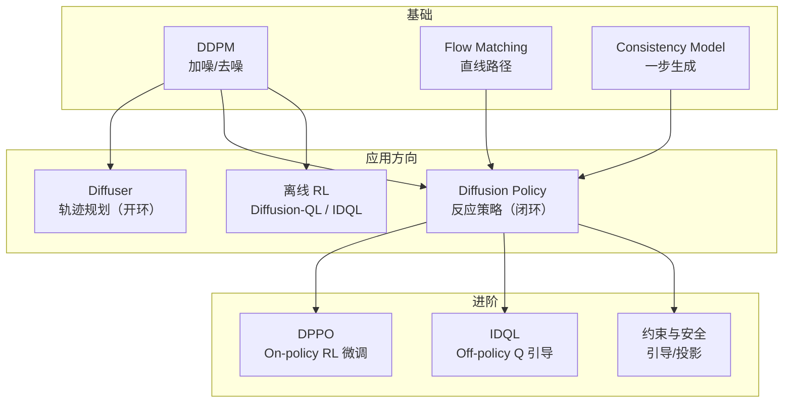
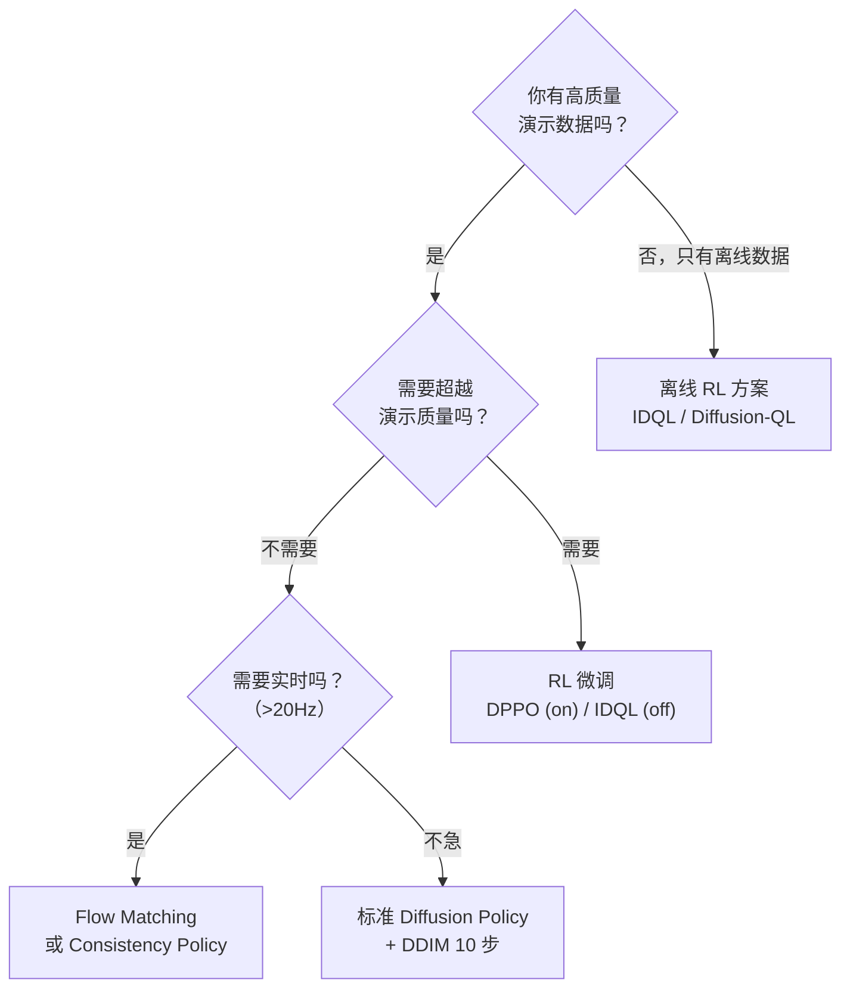

# 扩散模型在决策与控制中的应用综述

> **综述范围**：Diffusion Models 从图像生成迁移到序列决策与机器人控制的完整技术脉络  
> **关键词**：DDPM、Diffuser、Diffusion Policy、DPPO、IDQL、Flow Matching、Consistency Policy  
> **适用读者**：有基本概率论知识（知道高斯分布、条件概率），但不了解扩散模型的本科生

---

## 相关阅读

在开始之前，建议先了解（或随时回来查阅）以下内容：

**前置知识：**
- [扩散模型 DDPM](/前置知识/000b_前置知识_扩散模型DDPM) — 前向加噪 / 逆向去噪的完整数学推导
- [Diffusion Policy](/前置知识/000c_前置知识_Diffusion_Policy) — 将扩散模型用于机器人策略的核心方法
- [为什么扩散策略难以 RL 微调](/前置知识/000f_前置知识_为什么扩散策略难以RL微调) — log-likelihood 不可计算带来的挑战
- [Flow Matching 与连续归一化流](/前置知识/000g_前置知识_Flow_Matching与连续归一化流) — 比 DDPM 更快的替代方案
- [Consistency Model 与一步生成](/前置知识/000h_前置知识_Consistency_Model与一步生成) — 极速推理的蒸馏方法

**关联综述与精读：**
- [深度强化学习方法综述](./S01_深度强化学习方法综述) — PPO / SAC 等基础 RL 算法
- [DPPO：扩散策略策略优化](./001_DPPO_扩散策略策略优化) — 对扩散策略做 PPO 微调的详细方法
- [IDQL：隐式扩散 Q 学习](./005_IDQL_隐式扩散Q学习) — 离线 RL + 扩散策略的两阶段方案

---

## 贯穿全文的例子：7 自由度机械臂抓杯子

为了让抽象概念落地，本文全程使用一个具体场景：

> **场景**：一个 7 自由度（7-DOF）机械臂要从桌面拿起一个水杯，放到旁边的架子上。桌面和架子之间有一个障碍物（比如一个花瓶）。
>
> **关键特点**：在演示数据中，人类操作员有时**从左侧绕过**花瓶、有时**从右侧绕过**——这就是一个典型的**多模态（multi-modal）动作分布**。
>
> **具体数字**：
> - 状态 $s$：7 个关节角度 + 7 个关节角速度 + 末端位姿（3D 位置 + 四元数）= 7+7+7 = 21 维
> - 动作 $a$：7 个关节的目标速度命令 = 7 维
> - 动作块（action chunk）：一次生成未来 16 步动作 → 输出维度 = $16 \times 7 = 112$ 维
> - 演示数据：100 条轨迹，约 50 条走左边、50 条走右边

后面每引入一个新概念，我们都会回到这个例子来看它具体怎么工作。

---

## 1. 引言：为什么扩散模型适合控制

### 1.1 机器人策略学习的核心痛点

机器人策略学习的目标是：给定当前观测 $s$，输出一个动作 $a$。看起来简单，但有一个致命问题——**动作分布是多模态的**。

回到我们的例子：当机械臂处于"刚抓起杯子、还没绕过花瓶"这个状态时，正确的动作有两种（走左或走右）。如果我们用最简单的方法——**均方误差回归**（MSE loss）来训练一个策略网络：

$$
\mathcal{L}_{\text{MSE}} = \|a_{\text{pred}} - a_{\text{demo}}\|^2
$$

网络学到的会是什么？**两种动作的平均值**——直直地撞向花瓶！这就是"模式平均"（mode averaging）问题。

### 1.2 为什么传统方法不行

| 方法 | 思路 | 问题 |
|------|------|------|
| MSE 回归 | 输出单个动作 | 模式平均，多模态崩塌 |
| 混合高斯（GMM） | 输出 K 个高斯分量 | K 需要预设，高维空间中分量数爆炸 |
| CVAE（如 ACT） | 用潜变量 $z$ 切换模态 | 潜空间维度有限，复杂分布仍可能 mode collapse |
| 能量模型（EBM） | 学习能量函数 | 训练不稳定，采样需要 MCMC |

### 1.3 扩散模型的三个关键优势

1. **天然多模态**：扩散模型通过逐步去噪从噪声中"雕刻"出样本，不同的初始噪声自然走向不同的模态——左绕或右绕
2. **训练稳定**：损失函数就是简单的 MSE 去噪（"预测噪声"），不像 GAN 有对抗训练的不稳定性
3. **灵活条件化**：观测、目标、安全约束都可以优雅地作为条件注入

### 1.4 本文路线图

---

## 2. 从图像生成到动作生成：一张类比表

扩散模型在图像生成中已经大获成功（Stable Diffusion、DALL-E 3、Midjourney）。将它迁移到机器人控制，核心数学完全不变，只是"生成什么"和"条件是什么"变了。

| 维度 | 图像生成（Stable Diffusion） | 动作生成（Diffusion Policy） |
|------|------|------|
| **生成目标** | 像素图 $x \in \mathbb{R}^{512 \times 512 \times 3}$ | 动作块 $a_{0:H} \in \mathbb{R}^{H \times d_a}$（如 $16 \times 7 = 112$ 维） |
| **条件输入** | 文本描述 "a cat on a beach" | 观测 $o$：关节角 + 摄像头图像 |
| **噪声空间** | 高维像素空间（或 VAE 潜空间） | 动作序列空间（112 维） |
| **去噪网络** | 2D U-Net | 1D Temporal U-Net 或 Transformer |
| **引导机制** | Classifier-Free Guidance（文本对齐） | 奖励引导 / 约束引导 |
| **多样性** | 同一提示词生成不同图片 | 同一观测生成左绕 / 右绕两种轨迹 |
| **生成后处理** | 无 | 只执行前几步，然后重新生成（闭环） |
| **实时性要求** | 几秒可以接受 | 需要 10~50 Hz（20~100ms 内出结果） |

**关键直觉**：在图像生成中，同一个文本提示可以生成很多不同的图片（多样性是优点）。在机器人控制中，同一个观测可以对应多种合理动作（多模态是现实），扩散模型天然能处理这个。

### 2.1 用我们的例子理解

在图像生成中：
- 输入："一只猫在沙滩上"
- 输出：512×512 的图片（不同噪声种子 → 不同猫的姿态/背景）

在我们的机械臂例子中：
- 输入：当前 21 维状态（手臂在起始位置，杯子在桌上）
- 输出：112 维动作块（未来 16 步的关节速度命令）
- 不同噪声种子 → 有的走左边、有的走右边

---

## 3. DDPM 基础回顾：训练和推理的完整数值例子

> 如果你已经读过 [DDPM 前置知识](/前置知识/000b_前置知识_扩散模型DDPM)，这一节是快速复习 + 数值例子。如果没读过，这一节给你最核心的直觉。

### 3.1 前向过程：逐步加噪

DDPM 的前向过程非常简单：从干净数据 $a^0$ 出发，每一步加一点高斯噪声，直到变成纯噪声。

$$
q(a^k | a^{k-1}) = \mathcal{N}(a^k; \sqrt{1-\beta_k} \cdot a^{k-1}, \beta_k I)
$$

**一句话直觉**：每一步把数据"搅浑"一点点，$\beta_k$ 控制搅浑的程度。

**逐项拆解**：
- $a^k$：第 $k$ 步的噪声版本（$k=0$ 是干净数据，$k=K$ 是纯噪声）
- $\sqrt{1-\beta_k}$：对上一步的数据做一点缩放（让信号衰减）
- $\beta_k$：噪声调度参数，通常从 $\beta_1=0.0001$ 线性增长到 $\beta_K=0.02$
- $I$：单位矩阵，噪声是各维度独立的

**代入数字（我们的机械臂例子）**：

假设我们只看动作的第一个维度（关节 1 的速度），干净动作值 $a^0 = 0.5$ rad/s。

- $k=1$：$\beta_1 = 0.0001$，$a^1 = \sqrt{0.9999} \cdot 0.5 + \sqrt{0.0001} \cdot \epsilon \approx 0.4999 + 0.01 \cdot \epsilon$
  - 几乎没变化，$a^1 \approx 0.5$
- $k=50$：$\bar{\alpha}_{50} \approx 0.95$，$a^{50} = \sqrt{0.95} \cdot 0.5 + \sqrt{0.05} \cdot \epsilon \approx 0.487 + 0.224 \cdot \epsilon$
  - 开始有明显噪声
- $k=100$：$\bar{\alpha}_{100} \approx 0.01$，$a^{100} = \sqrt{0.01} \cdot 0.5 + \sqrt{0.99} \cdot \epsilon \approx 0.05 + 0.995 \cdot \epsilon$
  - 几乎是纯噪声，原始信号只剩 5%

其中 $\bar{\alpha}_k = \prod_{i=1}^k (1-\beta_i)$ 是累积信号保留比例。

**一步跳转公式**（训练时用，不用逐步加噪）：

$$
q(a^k | a^0) = \mathcal{N}(a^k; \sqrt{\bar{\alpha}_k} \cdot a^0, (1-\bar{\alpha}_k) I)
$$

**为什么这样设计**：如果训练时每次都要从 $a^0$ 逐步走到 $a^k$，太慢了。这个公式让我们直接"跳"到任意 $k$ 步。

### 3.2 逆向过程：逐步去噪

逆向过程是"从噪声恢复数据"，由一个神经网络 $\epsilon_\theta$ 来执行：

$$
p_\theta(a^{k-1} | a^k) = \mathcal{N}(a^{k-1}; \mu_\theta(a^k, k), \sigma_k^2 I)
$$

其中均值为：

$$
\mu_\theta(a^k, k) = \frac{1}{\sqrt{\alpha_k}} \left( a^k - \frac{\beta_k}{\sqrt{1-\bar{\alpha}_k}} \epsilon_\theta(a^k, k) \right)
$$

**一句话直觉**：网络预测"当前数据中混入了多少噪声"，然后减去这些噪声。

**逐项拆解**：
- $\epsilon_\theta(a^k, k)$：神经网络的输出，预测混入的噪声
- $\frac{1}{\sqrt{\alpha_k}}$：补偿前向过程中的缩放
- $\frac{\beta_k}{\sqrt{1-\bar{\alpha}_k}}$：根据噪声调度决定减去多少噪声
- $\sigma_k^2$：每步还会加一点新噪声（保持随机性）

**代入数字**：

从纯噪声 $a^{100} = -1.2$（一个随机值）开始，假设网络完美预测 $\epsilon_\theta = -1.7$（这就是混进去的噪声）：

$$
\mu_\theta = \frac{1}{\sqrt{0.9998}} \left( -1.2 - \frac{0.02}{\sqrt{0.99}} \cdot (-1.7) \right) = 1.0002 \times (-1.2 + 0.0342) = -1.166
$$

每一步只微微修正一点点，经过 100 步逐渐恢复到干净动作 $a^0 \approx 0.5$。

### 3.3 训练目标：预测噪声

$$
\mathcal{L}_{\text{DDPM}} = \mathbb{E}_{k \sim U[1,K],\; \epsilon \sim \mathcal{N}(0,I),\; a^0 \sim \mathcal{D}} \left[ \| \epsilon - \epsilon_\theta(\sqrt{\bar{\alpha}_k} a^0 + \sqrt{1-\bar{\alpha}_k} \epsilon, \; k) \|^2 \right]
$$

**一句话直觉**：随机选一步 $k$，给干净数据加噪到第 $k$ 步，让网络猜"加了什么噪声"。猜对了就训好了。

**逐项拆解**：
- $k \sim U[1,K]$：随机选一个时间步
- $\epsilon \sim \mathcal{N}(0,I)$：从标准正态分布采样一个噪声
- $\sqrt{\bar{\alpha}_k} a^0 + \sqrt{1-\bar{\alpha}_k} \epsilon$：用一步跳转公式构造第 $k$ 步的噪声数据
- $\epsilon_\theta(\cdot, k)$：网络预测的噪声
- $\|\cdot\|^2$：均方误差

**代入数字（机械臂训练）**：

1. 从演示数据取一个动作块 $a^0 \in \mathbb{R}^{112}$（16 步 × 7 维）
2. 随机选 $k = 37$，对应 $\bar{\alpha}_{37} = 0.82$
3. 采样噪声 $\epsilon \in \mathbb{R}^{112}$
4. 构造输入：$a^{37} = \sqrt{0.82} \cdot a^0 + \sqrt{0.18} \cdot \epsilon = 0.906 \cdot a^0 + 0.424 \cdot \epsilon$
5. 网络预测 $\hat{\epsilon} = \epsilon_\theta(a^{37}, 37)$
6. 损失 = $\|\epsilon - \hat{\epsilon}\|^2$（112 维向量的 MSE）

**为什么这样设计**：
- 为什么预测噪声而不是直接预测 $a^0$？数学上等价，但预测噪声时梯度更稳定（实验验证）
- 为什么随机选 $k$？这样一个 batch 里同时学习"不同噪声程度下的去噪"，网络需要对所有 $k$ 都工作

### 3.4 用我们的例子理解多模态

**关键问题**：为什么扩散模型能学到"左绕"和"右绕"两种轨迹，而不会像 MSE 那样取平均？

**答案**：在训练阶段，网络只需要学会"从噪声中恢复数据"。左绕的轨迹和右绕的轨迹分别存在于数据集中，网络学会了两种模式的去噪方向。在生成阶段，**不同的初始噪声种子会导致去噪过程走向不同的模态**。

想象噪声空间中有两个"盆地"：
- 初始噪声在左半区 → 去噪逐渐走向"左绕"轨迹
- 初始噪声在右半区 → 去噪逐渐走向"右绕"轨迹

这就是为什么扩散模型天然支持多模态——它学到的是整个数据分布，不是一个点估计。

---

## 4. Diffuser：扩散模型作为轨迹规划器

### 4.1 核心思想（Janner et al., 2022）

Diffuser 是第一个将扩散模型用于序列决策的工作。它的核心洞察非常直接：

> **把一整条轨迹当作"一张图片"来生成。**

具体来说，一条轨迹 $\tau$ 包含所有状态和动作：

$$
\tau = \begin{bmatrix} s_0 & a_0 \\ s_1 & a_1 \\ \vdots & \vdots \\ s_T & a_T \end{bmatrix} \in \mathbb{R}^{(T+1) \times (d_s + d_a)}
$$

**在我们的例子中**：$d_s = 21$，$d_a = 7$，$T = 50$ 步，所以一条轨迹是 $51 \times 28 = 1428$ 维的向量。Diffuser 把这个 1428 维向量当作"扩散模型要生成的东西"。

### 4.2 引导规划（Guided Planning）

生成轨迹时，我们不只是要"像数据集"的轨迹，还要"好的"轨迹。Diffuser 借鉴了图像生成中的 classifier guidance：

$$
\nabla_\tau \log p(\tau | \text{high reward}) \approx \nabla_\tau \log p(\tau) + \lambda \nabla_\tau J(\tau)
$$

**一句话直觉**：在去噪的每一步，除了正常去噪（让轨迹像训练数据），还额外推一把（让轨迹回报更高）。

**逐项拆解**：
- $\nabla_\tau \log p(\tau)$：正常去噪方向（由扩散模型给出）
- $J(\tau) = \sum_{t=0}^T r(s_t, a_t)$：轨迹总回报
- $\lambda$：引导强度，控制"多大程度追求高回报"
- $\nabla_\tau J(\tau)$：回报对轨迹的梯度，指向回报增大的方向

**实际操作（每一步去噪）**：

$$
\tau^{k-1} = \underbrace{\text{denoise}(\tau^k)}_{\text{正常去噪}} + \underbrace{\alpha \nabla_\tau J(\tau^k)}_{\text{奖励引导}}
$$

**在我们的例子中**：假设奖励函数是"越快放好杯子越好、不能碰花瓶"。那么 $\nabla_\tau J$ 会把轨迹推向更快的路径，同时推离花瓶。

### 4.3 约束通过 Inpainting 施加

Diffuser 用"inpainting"（修复画）的方式处理约束，非常优雅：

- **起始约束**：每步去噪后，把轨迹的第一个状态 $s_0$ 强制替换为当前实际状态
- **目标约束**：把最后一个状态 $s_T$ 强制替换为目标位置
- **中间约束**：比如要求 $t=25$ 时经过某个中间点

### 4.4 Diffuser 的局限

| 问题 | 说明 |
|------|------|
| 维度太高 | 生成 state+action 轨迹，如 1428 维 |
| 开环规划 | 生成完整轨迹后按顺序执行，不考虑执行偏差 |
| 速度慢 | 100 步去噪 × 大维度 → 无法实时 |
| 需要奖励函数 | 引导需要可微分的奖励函数 |

这些局限催生了下一个重要工作——**Diffusion Policy**。

---

## 5. Diffusion Policy：扩散模型作为反应式策略

> 详细推导请参阅 [Diffusion Policy 前置知识](/前置知识/000c_前置知识_Diffusion_Policy)，本节聚焦核心架构和设计决策。

### 5.1 关键改进（Chi et al., 2023）

Diffusion Policy 做了一个关键简化：**只生成动作序列，不生成状态**。观测作为条件注入。

$$
a_{t:t+H_a} \sim p_\theta(a_{t:t+H_a} \mid o_{t-H_o+1:t})
$$

**一句话直觉**：给定最近几步观测，生成未来 $H_a$ 步的动作（一个"动作块"）。

**逐项拆解**：
- $a_{t:t+H_a}$：从当前到未来 $H_a$ 步的动作序列（如 $H_a = 16$，每个 7 维）
- $o_{t-H_o+1:t}$：最近 $H_o$ 步的观测（如 $H_o = 2$，提供时序上下文）
- $p_\theta$：由扩散模型参数化的条件分布

**在我们的例子中**：
- 输入：最近 2 帧的关节角度 + 摄像头图像
- 输出：未来 16 步的 7 维关节速度命令（共 112 维）
- 执行：只执行前 8 步（$H_e = 8$），然后重新观测并生成新的动作块

### 5.2 与 Diffuser 的对比

| 维度 | Diffuser | Diffusion Policy |
|------|----------|------------------|
| 生成内容 | 完整轨迹（state + action） | 只有动作块 |
| 输出维度 | $\sim$1000+ | $\sim$100 |
| 条件化 | Inpainting（固定 $s_0$） | 直接把观测注入网络 |
| 执行方式 | 开环（生成完就执行） | 闭环（每几步重新生成） |
| 需要奖励？ | 是（用于引导） | 否（纯模仿学习） |
| 实时性 | 差 | 中（仍需多步去噪，但维度低） |

### 5.3 CNN 架构：1D Temporal U-Net（详细）

Diffusion Policy 的主力架构是一个 **1D 时序 U-Net**，设计灵感来自图像生成的 2D U-Net，但做了关键适配。

#### 输入输出

$$
\epsilon_\theta(a^k, o, k) : \mathbb{R}^{H_a \times d_a} \to \mathbb{R}^{H_a \times d_a}
$$

- **输入**：当前噪声动作序列 $a^k \in \mathbb{R}^{16 \times 7}$（在我们例子中）
- **条件**：观测编码 $o$（由单独的视觉编码器处理）+ 扩散时间步 $k$
- **输出**：预测的噪声 $\hat{\epsilon} \in \mathbb{R}^{16 \times 7}$（和输入维度完全相同）

#### FiLM 条件注入

条件（观测 + 时间步）通过 **FiLM（Feature-wise Linear Modulation）** 注入：

$$
\text{FiLM}(h, c) = \gamma(c) \odot h + \beta(c)
$$

**一句话直觉**：根据条件 $c$ 对特征 $h$ 做"缩放 + 偏移"——条件不是拼接到输入中，而是调制中间特征。

**逐项拆解**：
- $h$：U-Net 中间层的特征图（每个时间步一个向量）
- $c$：条件向量（观测编码和时间步编码拼接后的向量）
- $\gamma(c)$：一个小 MLP 输出的缩放因子
- $\beta(c)$：一个小 MLP 输出的偏移量
- $\odot$：逐元素乘法

**为什么用 FiLM 而不是简单拼接**：FiLM 在每一层都注入条件信息，比只在输入层拼接更有效。图像生成中的 U-Net 也是用类似机制（AdaGN/AdaLN）注入时间步信息。

#### U-Net 的具体结构

**关键设计决策**：

1. **不做空间下采样到 1**：保持时间分辨率。图像 U-Net 会把 512→256→128→…→1，但动作序列的每个时间步都重要，不能丢失
2. **1D 卷积**：沿时间轴卷积，每次看相邻几步的动作（局部时序关系）
3. **Skip connections**：编码器特征直接传给对应层的解码器，保留细节
4. **群归一化（GroupNorm）**：比 BatchNorm 稳定，适合小 batch

#### 数字例子：前向传播

以我们的 7-DOF 机械臂为例（$H_a=16$，$d_a=7$）：

1. **输入**：噪声动作 $a^k \in \mathbb{R}^{16 \times 7}$
2. **编码器第一层**：$\text{Conv1D}(7, 256, \text{kernel}=5, \text{pad}=2)$ → 输出 $\mathbb{R}^{16 \times 256}$
3. **下采样**：stride-2 Conv1D → $\mathbb{R}^{8 \times 512}$
4. **继续下采样**：→ $\mathbb{R}^{4 \times 1024}$
5. **中间层**：两个残差块，维度不变 $\mathbb{R}^{4 \times 1024}$
6. **解码器上采样**：转置卷积 → $\mathbb{R}^{8 \times 512}$，加上 skip → $\mathbb{R}^{8 \times 512}$
7. **继续上采样**：→ $\mathbb{R}^{16 \times 256}$
8. **输出层**：$\text{Conv1D}(256, 7, \text{kernel}=1)$ → $\mathbb{R}^{16 \times 7}$（预测噪声）

**参数量**：约 25M 参数（与 ResNet-18 相当）

### 5.4 Transformer 架构（替代方案）

对于更长的动作序列或需要处理多模态观测的场景，Chi et al. 也提供了 Transformer 架构：

$$
\epsilon_\theta(a^k, o, k) = \text{TransformerDecoder}(\text{tokens}(a^k), \text{cross-attn}(o, k))
$$

- 动作序列的每一步变为一个 token
- 观测通过 cross-attention 注入（类比 GPT 中的 encoder-decoder attention）
- 时间步 $k$ 用正弦位置编码

### 5.5 观测条件化的设计选择

观测的处理方式对策略性能影响巨大：

| 设计选择 | 做法 | 适用场景 |
|----------|------|----------|
| 观测窗口 $H_o$ | 使用最近 2~3 帧观测 | 需要速度/加速度信息时 |
| 视觉编码器 | ResNet-18 预训练后 frozen/fine-tune | 有摄像头输入时 |
| 本体感觉 | 关节角度直接作为向量输入 | 总是需要 |
| 多模态融合 | 图像特征 + 本体感觉拼接后作为条件 | 多传感器 |

**在我们的例子中**：
- 观测 = {摄像头图像经 ResNet-18 编码得到 512 维向量} + {21 维状态向量}
- 拼接后得到 533 维条件向量
- 这个条件向量通过 FiLM 注入 U-Net 的每一层

### 5.6 Action Chunking + 时序集成

**Action Chunking**：一次生成 $H_a = 16$ 步动作，但只执行 $H_e = 8$ 步。为什么？

1. **时间一致性**：如果每步都重新生成，可能在左绕/右绕之间反复切换（因为噪声种子每次不同）
2. **前瞻规划**：生成 16 步让网络"想远一点"，即使只执行 8 步

**时序集成（Temporal Ensembling）**：在重叠区域，新旧动作块的预测用指数加权平均融合：

$$
a_t^{\text{exec}} = w \cdot a_t^{\text{new}} + (1-w) \cdot a_t^{\text{old}}, \quad w = e^{-\lambda \cdot \Delta t}
$$

这让动作过渡平滑，不会有跳变。

### 5.7 实验结果

Chi et al. 在 11 个机器人操控任务上的结果（含仿真和真机）：

| 方法 | 平均成功率 | 多模态能力 | 推理速度 |
|------|-----------|-----------|----------|
| BC-MLP (MSE) | 47% | ❌ 模式平均 | ★★★★★ |
| BC-GMM (混合高斯) | 56% | ⚠️ 有限 | ★★★★ |
| ACT (CVAE) | 73% | ✅ 可以 | ★★★★ |
| IBC (能量模型) | 62% | ✅ 可以 | ★★★ |
| **Diffusion Policy (U-Net)** | **83%** | ✅✅ 强 | ★★ |

**在多模态任务上差距最大**：比如 Push-T 任务中有多种合理的推块路径，Diffusion Policy 比 MSE 回归高出 40+ 百分点。

---

## 6. RL 微调扩散策略

### 6.1 动机

纯模仿学习（行为克隆）有天花板——策略最多和演示者一样好。如果演示者本身不完美（比如人类操作员有时动作不够平滑），策略也会学到这些缺陷。

**RL 微调可以让策略超越演示**。但对扩散策略做 RL 面临一个特殊的数学挑战。

> 详细讨论见 [为什么扩散策略难以 RL 微调](/前置知识/000f_前置知识_为什么扩散策略难以RL微调)。

### 6.2 核心难题：log-likelihood 不可精确计算

标准 [PPO/SAC 等策略梯度方法](./S01_深度强化学习方法综述) 需要计算：

$$
\nabla_\theta J = \mathbb{E}\left[ \nabla_\theta \log \pi_\theta(a|s) \cdot A(s,a) \right]
$$

对于高斯策略，$\log \pi_\theta(a|s)$ 有解析形式。但对于扩散策略：

$$
\pi_\theta(a|s) = \int p(a^K) \prod_{k=1}^K p_\theta(a^{k-1}|a^k, s) \, da^{1:K}
$$

这个积分**无法精确计算**（需要对所有可能的去噪路径积分）。

**在我们的例子中**：要算"在这个状态下，网络输出这个 112 维动作块的概率是多少"——需要积分掉所有 100 步中间状态，每步都是 112 维高斯，这是不可行的。

### 6.3 三种应对策略

### 6.4 DPPO：Diffusion Policy Policy Optimization（详细）

> 完整精读见 [DPPO 精读](./001_DPPO_扩散策略策略优化)。

DPPO（Ren et al., 2024）的核心思路极其巧妙：**把扩散的 K 步去噪视为"K 个子策略的链"，对每个子策略分别应用 PPO**。

#### 步骤 1：将扩散过程拆解为子策略

每一步去噪可以看作一个"子策略"：

$$
\pi_\theta^{(k)}(a^{k-1} | a^k, s) = \mathcal{N}(a^{k-1};\; \mu_\theta(a^k, s, k),\; \sigma_k^2 I)
$$

**一句话直觉**：第 $k$ 步子策略接收"当前噪声版本 $a^k$"，输出"稍微去噪后的版本 $a^{k-1}$"。

**逐项拆解**：
- $\pi_\theta^{(k)}$：第 $k$ 步的子策略（条件高斯分布）
- $a^k$：当前噪声动作（这一步的"状态"）
- $a^{k-1}$：去噪后的动作（这一步的"动作"）
- $\mu_\theta(a^k, s, k)$：U-Net 输出的均值（去噪方向）
- $\sigma_k^2$：固定的方差（DDPM 中有公式给出）

#### 步骤 2：用 ELBO 近似 log-likelihood

整体策略的对数概率用变分下界（ELBO）近似：

$$
\log \pi_\theta(a|s) \geq \underbrace{\sum_{k=1}^{K} \log \pi_\theta^{(k)}(a^{k-1}|a^k, s)}_{\text{每步子策略的 log-prob 之和}} + \text{const}
$$

**一句话直觉**：虽然不能精确算整体 log-prob，但可以算每一步的 log-prob（因为每步是高斯），加起来作为下界。

**代入数字**：假设 $K=20$ 步去噪，每步的 log-prob 是 $\log \mathcal{N}(\cdot)$（有解析形式），加起来就是 20 个数的和。

#### 步骤 3：对每步子策略计算 PPO ratio

[PPO](/前置知识/000a_前置知识_策略梯度与PPO) 需要计算新旧策略的概率比：

$$
r^{(k)} = \frac{\pi_\theta^{(k)}(a^{k-1}|a^k, s)}{\pi_{\theta_{\text{old}}}^{(k)}(a^{k-1}|a^k, s)}
$$

**一句话直觉**：新策略在这一步的"去噪方向"和旧策略比，变化了多少？

**代入数字**：
- 旧策略第 $k$ 步输出均值 $\mu_{\text{old}} = 0.3$，新策略输出 $\mu_{\text{new}} = 0.35$
- $\sigma_k = 0.1$
- 实际执行的 $a^{k-1} = 0.32$
- $r^{(k)} = \frac{\mathcal{N}(0.32; 0.35, 0.01)}{\mathcal{N}(0.32; 0.3, 0.01)} = \frac{\exp(-(0.32-0.35)^2/0.02)}{\exp(-(0.32-0.3)^2/0.02)} = \frac{\exp(-0.045)}{\exp(-0.02)} = \exp(-0.025) \approx 0.975$

#### 步骤 4：应用 PPO clip 目标

$$
L_k^{\text{CLIP}} = \min\left( r^{(k)} \hat{A},\; \text{clip}(r^{(k)}, 1-\epsilon, 1+\epsilon) \hat{A} \right)
$$

总损失是所有步的平均：

$$
L^{\text{DPPO}} = \frac{1}{K} \sum_{k=1}^K L_k^{\text{CLIP}}
$$

**为什么这样设计**：
- 每步子策略是高斯分布 → log-prob 和 ratio 都有解析形式 ✓
- PPO clip 限制每步更新幅度 → 训练稳定 ✓
- 分步更新允许"去噪过程的早期步和晚期步学不同东西" ✓

#### DPPO 的三种变体

| 变体 | 做法 | 效果 |
|------|------|------|
| DPPO-d（default） | 对每步算独立的 ratio 和 clip | 最稳定 |
| DPPO-g（global） | 把所有步的 ratio 乘起来得到全局 ratio | 更接近标准 PPO |
| DPPO-s（sum） | 对 log-ratio 求和 | DPPO-d 和 DPPO-g 的折中 |

实验表明 **DPPO-d** 通常最好——因为它允许不同去噪步有不同的更新幅度。

### 6.5 IDQL：Implicit Diffusion Q-Learning

> 完整精读见 [IDQL 精读](./005_IDQL_隐式扩散Q学习)。

[IDQL](/论文综述/005_IDQL_隐式扩散Q学习)（Hansen-Estruch et al., 2023）采用完全不同的策略——**不改扩散模型本身，而是用 Q 值来"挑选"好动作**。

#### 两阶段方法

#### 核心公式

生成 $N$ 个候选动作后，用 Q 值做加权采样：

$$
a^* = \arg\max_{a_i \sim \pi_\theta(\cdot|s),\; i=1,...,N} Q_\phi(s, a_i)
$$

或者用 softmax 加权：

$$
w_i = \frac{\exp(Q_\phi(s, a_i) / \beta)}{\sum_j \exp(Q_\phi(s, a_j) / \beta)}, \quad a^* = \sum_i w_i a_i
$$

**一句话直觉**：让扩散模型自由生成多种可能的动作（左绕、右绕都生成），然后用 Q 值评判哪个更好。

**在我们的例子中**：
1. 扩散模型生成 32 个候选动作块（有些走左，有些走右）
2. Q 函数对每个打分（也许今天左边有障碍，所以走右分数高）
3. 选分数最高的那个执行

**为什么巧妙**：扩散模型和 Q 函数完全分开训练，避免了"把 RL 梯度传到扩散过程中"的数学困难。

### 6.6 RL + Diffusion 方法总览

| 方法 | 路线 | On/Off-policy | 需要 log π？ | 特点 |
|------|------|---------------|-------------|------|
| [DPPO](./001_DPPO_扩散策略策略优化) | PPO + ELBO 近似 | On-policy | 是（近似） | 稳定、通用、可微调 |
| [IDQL](./005_IDQL_隐式扩散Q学习) | Q 值引导选择 | Off-policy | 否 | 数据高效、分离训练 |
| DIPO | 确定性策略梯度 | Off-policy | 否 | 把噪声视为输入的确定性映射 |
| Diffusion-QL | Q-weighted BC | Off-policy | 否 | 简单但偏保守 |
| SRPO | Score 重参数化 | On-policy | 否 | 理论优雅，实现复杂 |

---

## 7. 加速推理：从 100 步到 1 步

### 7.1 问题：扩散策略太慢

标准 DDPM 需要 50~100 步去噪，每步需要一次完整的 U-Net 前向传播。对于需要 **10~50 Hz 控制频率**的机器人来说：

- 100 步 × 5ms/步 = 500ms → **2 Hz**，远远不够
- 我们的 7-DOF 机械臂通常需要 20 Hz（50ms 内出动作）

所以加速推理是扩散策略走向实用的关键。

### 7.2 DDIM：确定性加速采样

DDIM（Song et al., 2020）把随机扩散过程变为**确定性 ODE**，允许"跳步"采样。

$$
a^{k-1} = \sqrt{\bar{\alpha}_{k-1}} \cdot \underbrace{\hat{a}_0}_{\text{预测的干净动作}} + \sqrt{1-\bar{\alpha}_{k-1}} \cdot \underbrace{\frac{a^k - \sqrt{\bar{\alpha}_k}\hat{a}_0}{\sqrt{1-\bar{\alpha}_k}}}_{\text{方向指向噪声}}
$$

**一句话直觉**：每一步不是"微微去一点噪"，而是先预测最终结果 $\hat{a}_0$，然后沿着一条确定性轨迹大步跳过去。

**逐项拆解**：
- $\hat{a}_0 = \frac{a^k - \sqrt{1-\bar{\alpha}_k}\epsilon_\theta(a^k, k)}{\sqrt{\bar{\alpha}_k}}$：网络预测噪声后，反推出干净数据的估计
- $\sqrt{\bar{\alpha}_{k-1}} \cdot \hat{a}_0$：从干净数据出发，正向加噪到 $k-1$ 步应该在的位置
- 第二项：修正项，保持轨迹在正确的"概率流"上

**为什么可以跳步**：DDPM 每步只能走"相邻"的噪声水平（$k \to k-1$），但 DDIM 是 ODE，可以从 $k=100$ 直接跳到 $k=90$，甚至 $k=50$。

**代入数字**：
- 原来：100 步去噪，每步 5ms → 500ms
- 用 DDIM 10 步跳采样：只在 $k = 100, 90, 80, ..., 10$ 处计算 → 50ms
- 质量损失：通常不超过 5%（对简单任务几乎无损）

### 7.3 Flow Matching：为什么比 DDPM 快

> 详细数学见 [Flow Matching 前置知识](/前置知识/000g_前置知识_Flow_Matching与连续归一化流)。

Flow Matching 是一种从根本上不同于 DDPM 的方法。DDPM 的"弯曲路径"是历史原因造成的，Flow Matching 用最短的**直线路径**连接噪声和数据。

#### DDPM vs Flow Matching 的路径对比

$$
\text{DDPM: } a_t = \sqrt{\bar{\alpha}_t} \cdot a_0 + \sqrt{1-\bar{\alpha}_t} \cdot \epsilon \quad (\text{弯曲的余弦/线性调度})
$$

$$
\text{Flow Matching: } a_t = (1-t) \cdot a_0 + t \cdot \epsilon \quad (\text{最短直线})
$$

#### 训练目标

$$
\mathcal{L}_{\text{FM}} = \mathbb{E}_{t \sim U[0,1],\; a_0,\; \epsilon} \left[ \| v_\theta(a_t, t, s) - \underbrace{(\epsilon - a_0)}_{\text{速度场目标}} \|^2 \right]
$$

**一句话直觉**：网络不再预测"噪声"，而是预测"从数据到噪声的速度"——沿直线方向走多快。

**逐项拆解**：
- $v_\theta(a_t, t, s)$：网络输出的速度场（velocity field）
- $a_t = (1-t) a_0 + t \epsilon$：时刻 $t$ 的中间状态（简单线性插值）
- $\epsilon - a_0$：从数据到噪声的方向向量（真实速度）
- $t \sim U[0,1]$：连续时间（不再是离散步数）

**代入数字（我们的例子）**：
- $a_0 = [0.5, -0.3, 0.8, ...]$（干净动作块第一维度的值）
- $\epsilon = [1.2, 0.7, -0.5, ...]$（采样的噪声）
- $t = 0.3$：$a_t = 0.7 \times [0.5, ...] + 0.3 \times [1.2, ...] = [0.71, ...]$
- 速度目标：$\epsilon - a_0 = [0.7, 1.0, -1.3, ...]$
- 网络要学会预测这个速度

#### 为什么 Flow Matching 更快？

| 原因 | 解释 |
|------|------|
| **路径更短** | 直线是两点间最短路径，ODE 求解器需要更少步数 |
| **曲率更低** | DDPM 路径有弯曲，ODE 求解器在弯曲处需要更小步长 |
| **误差累积更少** | 步数少 → 每步的数值误差累积更少 |
| **连续时间** | 不受离散步数限制，可以自适应步长 |

**实际效果**：Flow Matching 通常只需 **4~10 步** ODE 求解即可达到 DDPM 100 步的质量。

在我们的例子中：
- DDPM 100 步：500ms → 2 Hz ❌
- Flow Matching 5 步：25ms → 40 Hz ✓ 足够实时控制

### 7.4 Consistency Model / Consistency Policy：一步生成

> 详细推导见 [Consistency Model 前置知识](/前置知识/000h_前置知识_Consistency_Model与一步生成)。

Consistency Model（Song et al., 2023）的核心思想更加激进：**训练模型使得从噪声轨迹上任意一点都能直接映射到干净样本**。

#### 自一致性约束

$$
f_\theta(a^k, k) = f_\theta(a^{k'}, k') \quad \forall k, k' \in [0, K]
$$

只要 $a^k$ 和 $a^{k'}$ 在同一条 ODE 轨迹上（都对应同一个 $a^0$），网络的输出应该一致。

**一句话直觉**：不管你从噪声轨迹的哪个位置"跳"，都应该跳到同一个干净数据。

**逐项拆解**：
- $f_\theta$：Consistency 函数，输入任意噪声水平的数据，直接输出干净数据
- 约束的含义：同一条 ODE 轨迹上的所有点，$f_\theta$ 的输出必须一致

#### Consistency Distillation（蒸馏）

实际训练时，从已训练好的 Diffusion Policy（teacher）蒸馏：

$$
\mathcal{L}_{\text{CD}} = d\left( f_\theta(a^{k+1}, k+1), \; f_{\theta^-}(\hat{a}^k, k) \right)
$$

其中 $\hat{a}^k$ 是用 teacher 模型从 $a^{k+1}$ 做一步去噪得到的结果，$\theta^-$ 是 EMA 参数。

**代入数字**：
- Teacher（标准 Diffusion Policy）：100 步去噪，质量很好但慢
- Student（Consistency Policy）：训练后 1~4 步就能生成
- 蒸馏过程：取 teacher ODE 轨迹上的相邻两点，强制 student 对这两点的输出一致

#### Consistency Policy 的性能

$$
\text{理想: } f_\theta(a^K, K) \approx a^0 \quad (\text{一步直达})
$$

实际中 2~4 步就足够好：

| 步数 | 质量（vs 100步 DDPM） | 速度 |
|------|----------------------|------|
| 1 步 | ~90% | 100x |
| 2 步 | ~95% | 50x |
| 4 步 | ~99% | 25x |

**在我们的例子中**：
- 1 步推理：5ms → 200 Hz → 对机械臂绰绰有余
- 但质量有损（可能偶尔在模态切换时不够平滑）
- 实际部署通常用 2~4 步：10~20ms → 50~100 Hz

### 7.5 推理速度对比总表

| 方法 | 推理步数 | 单次延迟（估算） | 控制频率 | 质量 |
|------|----------|-----------------|----------|------|
| DDPM（标准） | 100 | 500ms | 2 Hz | ★★★★★ |
| DDIM（跳步） | 10~20 | 50~100ms | 10~20 Hz | ★★★★ |
| Flow Matching | 4~10 | 20~50ms | 20~50 Hz | ★★★★★ |
| Consistency Model | 1~4 | 5~20ms | 50~200 Hz | ★★★★ |

**结论**：对于大多数机器人控制任务（20 Hz 足够），**Flow Matching 或 Consistency 2~4 步** 是当前最佳实践。

---

## 8. 离线 RL 中的扩散模型

### 8.1 离线 RL 的挑战

离线 RL 的场景：只有一批固定的历史数据（可能来自不同质量的策略），不能和环境交互，要从中学到好策略。

核心挑战是**分布外动作（OOD action）**——如果学到的策略生成了数据集中从未见过的动作，Q 函数对这些动作的估值可能严重高估。

扩散模型的天然优势：**它只能生成数据分布内的样本**。用扩散模型作为策略，天然避免了 OOD 问题。

### 8.2 Diffusion-QL

Wang et al. (2023) 将 Q-learning 与扩散模型直接结合：

$$
\mathcal{L}_{\text{DQL}} = \mathbb{E}\left[ \underbrace{\|\epsilon - \epsilon_\theta(a^k, s, k)\|^2}_{\text{去噪损失（行为克隆）}} - \underbrace{\alpha \cdot Q_\phi(s, \hat{a}_0)}_{\text{Q 值引导（策略改进）}} \right]
$$

**一句话直觉**：扩散模型在学习模仿数据的同时，还要让生成的动作得到高 Q 值。

**逐项拆解**：
- 第一项：标准 DDPM 去噪损失——让扩散模型学会数据分布
- 第二项：Q 函数给出的"这个动作有多好"的信号
- $\alpha$：权衡模仿 vs 改进的超参数
- $\hat{a}_0$：从当前噪声 $a^k$ 一步预测的干净动作估计

**在我们的例子中**：
- 离线数据：100 条轨迹（左绕 50 条，右绕 50 条），质量参差不齐
- 去噪损失让模型学会两种路径
- Q 值引导让模型偏好更快/更平滑的路径
- $\alpha$ 控制"多大程度偏离数据"——太大会 OOD，太小没改进

### 8.3 IDQL 在离线 RL 中的应用

[IDQL](./005_IDQL_隐式扩散Q学习) 的两阶段方法天然适合离线 RL：

1. **阶段 1**：用 IQL（Implicit Q-Learning）学 Q 函数——IQL 专门为离线 RL 设计，不需要对 OOD 动作求 max
2. **阶段 2**：扩散模型学习数据分布（纯行为克隆）
3. **推理时**：生成候选 → Q 排序 → 选最好的

优势：两部分完全独立训练，不会相互干扰。

### 8.4 Decision Diffuser

类似 Decision Transformer（用 return-to-go 条件化），但用扩散模型替代自回归 Transformer：

$$
\tau \sim p_\theta(\tau | R_{\text{target}})
$$

- 条件 $R_{\text{target}}$：目标累积回报
- 生成完整轨迹
- 用 classifier-free guidance 控制回报水平

**在我们的例子中**：
- 设定 $R_{\text{target}} = 100$（希望又快又安全）
- Diffusion 生成一条满足这个回报的轨迹
- 相比 Diffuser 的优势：不需要单独的奖励模型，回报直接作为条件

---

## 9. 约束与安全

机器人控制不是自由生成——必须满足物理约束和安全要求。

### 9.1 硬约束

| 约束类型 | 例子（我们的场景） | 处理方式 |
|----------|-------------------|----------|
| 关节限位 | 关节角不超过 ±170° | 每步投影到可行域 |
| 碰撞避免 | 不能碰到花瓶 | 梯度引导远离障碍 |
| 速度限制 | 关节速度 ≤ 2 rad/s | 输出 clip |
| 目标到达 | 最终必须把杯子放好 | Inpainting 固定终状态 |

#### 投影法

每步去噪后，将动作投影到约束集合 $\mathcal{C}$：

$$
a^{k-1}_{\text{proj}} = \text{Proj}_{\mathcal{C}}(a^{k-1})
$$

**代入数字**：如果去噪后第 3 个关节的速度是 $2.5$ rad/s，限制为 $\pm 2$，则投影为 $2.0$ rad/s。

优点：简单直接。缺点：可能破坏去噪过程的一致性（特别是复杂约束时）。

#### 引导法

用约束违反程度的梯度作为引导：

$$
a^{k-1} = \text{denoise}(a^k) - \lambda \nabla_a C(a)
$$

其中 $C(a)$ 是约束违反的度量（如碰撞穿透深度）。

**在我们的例子中**：$C(a)$ 可以是"末端轨迹到花瓶中心的距离如果小于安全半径，就有正值"。梯度 $\nabla_a C$ 把动作推离花瓶。

### 9.2 软约束与偏好

$$
p(a|s, \text{safe}) \propto p(a|s) \cdot \exp(\lambda \cdot \text{safety\_score}(a))
$$

**一句话直觉**：在扩散生成的分布基础上，用安全分数做重要性加权——安全的动作概率变高，危险的变低。

**在我们的例子中**：
- 扩散模型生成了"从左绕"和"从右绕"两种轨迹
- 如果当前花瓶偏左，safety_score 给"右绕"更高分
- 最终采样时更倾向选择"右绕"

### 9.3 可控生成（类比 ControlNet）

类比图像生成中的 ControlNet（用轮廓图控制生成），机器人场景可以控制：

- **末端轨迹形状**：指定末端执行器经过的路径点
- **运动速度曲线**：指定加减速 profile
- **协作约束**：双臂不碰撞
- **力约束**：接触力不超限
- **语言指令**：用 CLIP 编码指令作为条件（"从左边绕过去"）

---

## 10. 与 VAE / GAN 对比

### 10.1 全面对比表

| 维度 | MSE 回归 | CVAE（如 ACT） | GAN | Diffusion Policy | Flow Matching |
|------|----------|---------------|-----|------------------|---------------|
| **多模态能力** | ❌ 模式平均 | ✅ 受限于 $z$ 维度 | ⚠️ mode collapse | ✅✅ 完全覆盖 | ✅✅ 完全覆盖 |
| **训练稳定性** | ★★★★★ | ★★★★ | ★★ | ★★★★ | ★★★★★ |
| **推理速度** | ★★★★★ | ★★★★★ | ★★★★★ | ★★（需加速） | ★★★★ |
| **Log-likelihood** | 有解析形式 | 有 ELBO | 无 | 无解析形式 | 有（ODE） |
| **RL 微调兼容** | ★★★★★ | ★★★★ | ★★ | ★★★（需要 DPPO） | ★★★★★ |
| **高维扩展性** | ★★★ | ★★★ | ★★ | ★★★★★ | ★★★★★ |
| **实现复杂度** | ★★★★★ | ★★★★ | ★★★ | ★★★ | ★★★★ |

### 10.2 VAE（CVAE）vs Diffusion：深入对比

**CVAE（如 ACT）的做法**：

$$
a = \text{Decoder}(z, s), \quad z \sim q_\phi(z|a, s) \text{ (训练时)} \text{ 或 } z \sim \mathcal{N}(0, I) \text{ (推理时)}
$$

- 潜变量 $z$ 负责"选择模态"（左绕 vs 右绕）
- 解码器负责"生成具体动作"
- 问题：$z$ 维度通常很低（8~32 维），如果数据有很多模态，可能不够用

**Diffusion Policy 的做法**：

- 不需要显式的潜变量
- 多模态通过"不同初始噪声种子走向不同模态"自然实现
- 112 维的噪声空间远大于 CVAE 的 8 维潜空间 → 表达力强得多

**在我们的例子中**：
- CVAE：$z$ 的某个方向编码"左/右"，但如果还有"快/慢"、"高/低"等变化，8 维 $z$ 可能不够
- Diffusion：112 维噪声空间，可以轻松表达所有这些变化

### 10.3 GAN 为什么不适合策略学习

| 问题 | 说明 |
|------|------|
| Mode collapse | 生成器可能只学一种绕法 |
| 训练不稳定 | Generator/Discriminator 博弈难平衡 |
| 无法引导 | 没有明确的"去噪路径"可以施加梯度 |
| 无法评估 | 没有 likelihood，RL 微调困难 |

### 10.4 Normalizing Flow vs Diffusion vs Flow Matching

- **Normalizing Flow**：提供精确 log-likelihood → RL 微调方便，但网络结构受限（必须可逆），表达力通常弱于 Diffusion
- **Diffusion**：表达力最强，但无精确 log-likelihood，推理慢
- **Flow Matching**：**融合两者优势**——用 ODE 描述从噪声到数据的流，既有精确 log-likelihood（通过 ODE 变换公式），又有和 Diffusion 相当的表达力，还更快

---

## 11. 开放问题与未来方向

### 11.1 实时性：边缘部署

即使用 Flow Matching（4~10 步），在算力受限的机器人端侧（如 NVIDIA Jetson）仍可能不够快：

- **模型蒸馏**：Consistency Model 蒸馏 + 量化（INT8/FP16）
- **硬件加速**：TensorRT 优化、专用 NPU
- **自适应步数**：简单场景少步（直行→2步），复杂场景多步（绕障碍→8步）

**在我们的例子中**：机械臂直行阶段用 2 步，绕花瓶阶段用 6 步。

### 11.2 长时序规划

当前方法处理的主要是短时序（几十步，约 1~3 秒）。但真实任务往往是长序列（几百步，数十秒）：

- **层次化扩散**：高层扩散生成子目标序列，低层扩散生成到每个子目标的动作
- **时间抽象**：不同粒度的 diffusion（1 Hz 生成路标，20 Hz 生成动作）

**在我们的例子中**：
- 高层："接近杯子 → 抓取 → 抬起 → 绕障碍 → 放到架子"（5 个子目标）
- 低层：每个子目标间用 Diffusion Policy 生成具体动作

### 11.3 多智能体协作

多个机器人协作时（如双臂协作搬运），如何建模联合动作分布？

| 方法 | 做法 | 挑战 |
|------|------|------|
| 联合生成 | 一次生成所有机器人的动作 | 维度太高 |
| 条件生成链 | A 先生成，B 条件于 A | 有顺序偏见 |
| 通信 + 独立 | 每个机器人独立扩散，中间通信 | 协调性差 |
| 交替去噪 | A 去噪一步 → B 去噪一步 → 交替 | 有趣，待验证 |

### 11.4 与世界模型结合

扩散模型不仅能生成动作，还能生成"未来会发生什么"（世界模型）：

- **视频扩散作为世界模型**：UniSim、Genie 等用视频扩散预测未来帧
- **想象中的规划**：在世界模型中"想象"执行轨迹，评估不同策略
- **闭环组合**：扩散世界模型（预测） + 扩散策略（决策）

### 11.5 理论理解的缺口

- **为什么扩散比其他生成模型效果好？** 目前主要是实验验证，理论解释不足
- **去噪步数 vs 策略质量** 的精确关系？多少步"够了"？
- **泛化理论**：扩散策略对 OOD 观测的泛化行为
- **与最优控制的关系**：扩散去噪过程是否等价于某种最优控制？

### 11.6 与大模型结合

- **视觉-语言-动作模型（VLA）**：用预训练大模型处理视觉和语言理解，扩散模型生成底层动作
- **分层架构**：LLM 做高层任务规划 → 扩散策略做底层运动控制
- **预训练扩散策略**：在大量多机器人数据上预训练通用扩散策略，下游 fine-tune

---

## 12. 全文总结

### 12.1 一张图看全景

### 12.2 核心 Take-aways

1. **多模态是扩散策略的核心优势**：回到我们的例子——左绕和右绕共存，扩散模型自然处理，不需要手动设计
2. **训练简单 = MSE 去噪**：不管任务多复杂，训练目标永远是 $\|\epsilon - \epsilon_\theta\|^2$
3. **推理速度已不是瓶颈**：Flow Matching 5 步即可实时，Consistency 1~2 步更快
4. **RL 微调通路已打通**：DPPO 和 IDQL 分别从 on-policy 和 off-policy 方向解决
5. **条件化灵活**：观测、目标、约束、语言指令都可以优雅注入
6. **Trade-off 仍存在**：表达力 vs 推理速度，但正在被 Flow Matching / Consistency 大幅改善

### 12.3 "应该用哪个？" 决策树

### 12.4 用我们的例子做最终回顾

回到 7-DOF 机械臂抓杯子的例子，一个完整的系统可能这样搭建：

1. **数据收集**：人类遥操作 100 条演示，有左绕有右绕
2. **训练 Diffusion Policy**：1D U-Net，FiLM 条件注入，$H_a=16$，$H_e=8$
3. **加速**：用 Flow Matching 替代 DDPM，5 步推理，40Hz 控制
4. **微调（可选）**：用 DPPO 做 on-policy 微调，让动作更平滑高效
5. **安全约束**：碰撞避免引导 + 关节限位投影
6. **部署**：每 50ms 生成一个 16 步动作块，执行前 8 步后重新生成

**最终效果**：
- 面对花瓶在左 → 自动选择右绕
- 面对花瓶在右 → 自动选择左绕
- 面对无障碍 → 直行（最快路径）
- 每种情况都有平滑、自然的轨迹

---

## 延伸阅读

### 原始论文

| 论文 | 会议/年份 | 贡献 |
|------|-----------|------|
| Janner et al., "Planning with Diffusion for Flexible Behavior Synthesis" | ICML 2022 | Diffuser：首个扩散+决策 |
| Chi et al., "Diffusion Policy: Visuomotor Policy Learning via Action Space Diffusion" | RSS 2023 | Diffusion Policy：闭环策略 |
| Ren et al., "Diffusion Policy Policy Optimization" | NeurIPS 2024 | DPPO：On-policy 微调 |
| Hansen-Estruch et al., "IDQL: Implicit Q-Learning as an Actor-Critic Method with Diffusion Policies" | 2023 | IDQL：Off-policy |
| Wang et al., "Diffusion Policies as an Expressive Policy Class for Offline RL" | ICLR 2023 | Diffusion-QL |
| Song et al., "Consistency Models" | ICML 2023 | 一步生成 |
| Lipman et al., "Flow Matching for Generative Modeling" | ICLR 2023 | Flow Matching |
| Prasad et al., "Consistency Policy: Accelerated Visuomotor Policies via Consistency Distillation" | RSS 2024 | Consistency Policy |

### 本站相关文章

- [DDPM 基础](/前置知识/000b_前置知识_扩散模型DDPM) — 前向/逆向过程的完整数学
- [Diffusion Policy 详解](/前置知识/000c_前置知识_Diffusion_Policy) — 架构和训练的深入讨论
- [为什么扩散策略难以 RL 微调](/前置知识/000f_前置知识_为什么扩散策略难以RL微调) — 数学障碍的详细分析
- [Flow Matching](/前置知识/000g_前置知识_Flow_Matching与连续归一化流) — ODE 视角的推导
- [Consistency Model](/前置知识/000h_前置知识_Consistency_Model与一步生成) — 蒸馏和自一致性训练
- [深度强化学习综述](./S01_深度强化学习方法综述) — PPO/SAC 等基础算法
- [DPPO 精读](./001_DPPO_扩散策略策略优化) — 逐步应用 PPO 的完整推导
- [IDQL 精读](./005_IDQL_隐式扩散Q学习) — 两阶段方法的工程细节
