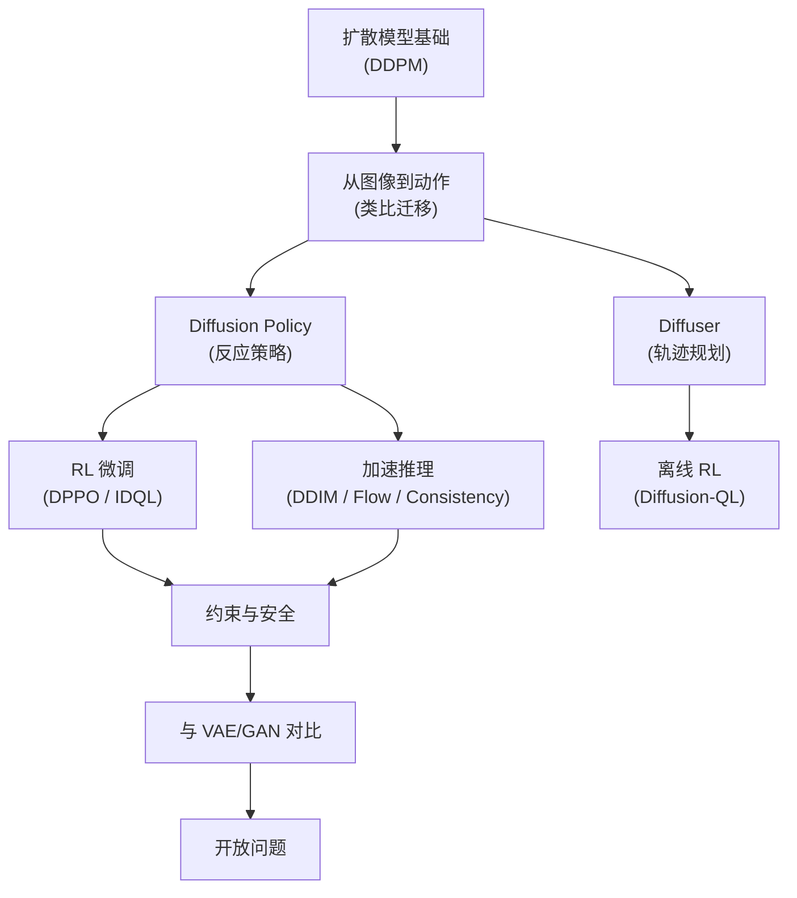
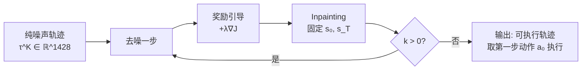
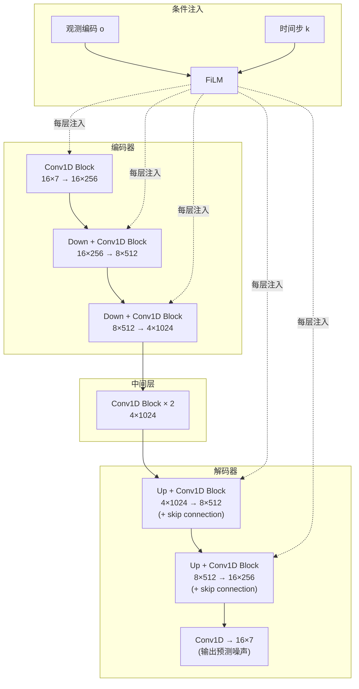
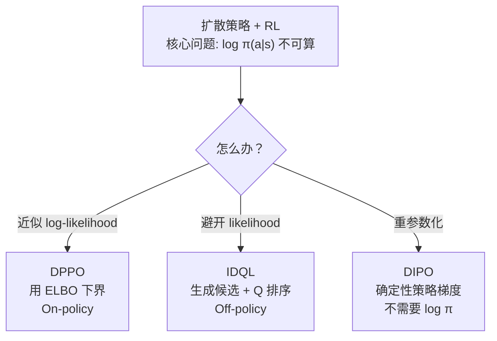
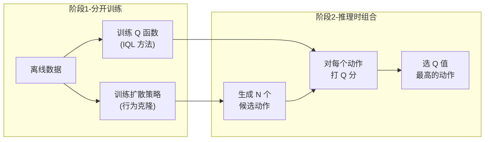
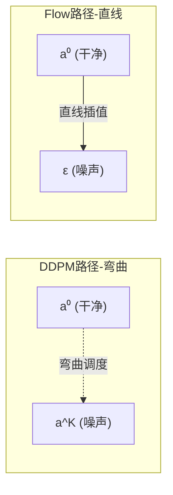
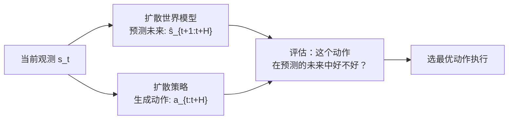
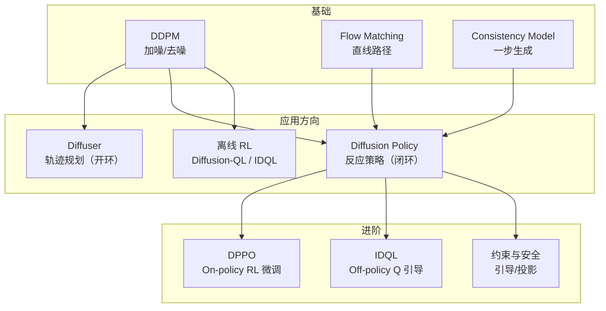
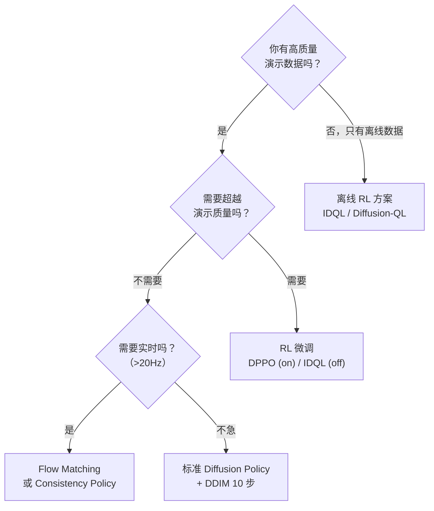

# 扩散模型在决策与控制中的应用综述

> **综述范围**：Diffusion Models 从图像生成迁移到序列决策与机器人控制的完整技术脉络  
> **关键词**：DDPM、Diffuser、Diffusion Policy、DPPO、IDQL、Flow Matching、Consistency Policy  
> **适用读者**：有基本概率论知识（知道高斯分布、条件概率），但不了解扩散模型的本科生

---

## 相关阅读

在开始之前，建议先了解（或随时回来查阅）以下内容：

**前置知识：**
- [扩散模型 DDPM](/前置知识/000b_前置知识_扩散模型DDPM) — 前向加噪 / 逆向去噪的完整数学推导
- [Diffusion Policy](/前置知识/000c_前置知识_Diffusion_Policy) — 将扩散模型用于机器人策略的核心方法
- [为什么扩散策略难以 RL 微调](/前置知识/000f_前置知识_为什么扩散策略难以RL微调) — log-likelihood 不可计算带来的挑战
- [Flow Matching 与连续归一化流](/前置知识/000g_前置知识_Flow_Matching与连续归一化流) — 比 DDPM 更快的替代方案
- [Consistency Model 与一步生成](/前置知识/000h_前置知识_Consistency_Model与一步生成) — 极速推理的蒸馏方法

**关联综述与精读：**
- [深度强化学习方法综述](./S01_深度强化学习方法综述) — PPO / SAC 等基础 RL 算法
- [DPPO：扩散策略策略优化](./001_DPPO_扩散策略策略优化) — 对扩散策略做 PPO 微调的详细方法
- [IDQL：隐式扩散 Q 学习](./005_IDQL_隐式扩散Q学习) — 离线 RL + 扩散策略的两阶段方案
- [VLA 模型的 RL 后训练综述](./S06_VLA模型的RL后训练综述) — 非扩散路线（自回归 VLA + PPO/GRPO）的 RL 后训练全景
- [VLA On-Policy RL 方法综述](./S12_VLA_On_Policy_RL方法综述) — PPO、GRPO 及其变体在 VLA 上的全景对比，DPPO 在其中的定位

---

## 贯穿全文的例子：7 自由度机械臂抓杯子

为了让抽象概念落地，本文全程使用一个具体场景：

> **场景**：一个 7 自由度（7-DOF）机械臂要从桌面拿起一个水杯，放到旁边的架子上。桌面和架子之间有一个障碍物（比如一个花瓶）。
>
> **关键特点**：在演示数据中，人类操作员有时**从左侧绕过**花瓶、有时**从右侧绕过**——这就是一个典型的**多模态（multi-modal）动作分布**。
>
> **具体数字**：
> - 状态 $s$：7 个关节角度 + 7 个关节角速度 + 末端位姿（3D 位置 + 四元数）= 7+7+7 = 21 维
> - 动作 $a$：7 个关节的目标速度命令 = 7 维
> - 动作块（action chunk）：一次生成未来 16 步动作 → 输出维度 = $16 \times 7 = 112$ 维
> - 演示数据：100 条轨迹，约 50 条走左边、50 条走右边

后面每引入一个新概念，我们都会回到这个例子来看它具体怎么工作。

---

## 1. 引言：为什么扩散模型适合控制

### 1.1 机器人策略学习的核心痛点

机器人策略学习的目标是：给定当前观测 $s$，输出一个动作 $a$。看起来简单，但有一个致命问题——**动作分布是多模态的**。

回到我们的例子：当机械臂处于"刚抓起杯子、还没绕过花瓶"这个状态时，正确的动作有两种（走左或走右）。如果我们用最简单的方法——**均方误差回归**（MSE loss）来训练一个策略网络：

$$
\mathcal{L}_{\text{MSE}} = \|a_{\text{pred}} - a_{\text{demo}}\|^2
$$

**这个公式在做什么**：让网络输出的动作尽量贴近演示动作——距离越小 loss 越低。但如果数据里同一个状态有多种正确动作，网络会学到它们的平均值。

::: details 📐 公式详解（点击展开）

| 子表达式 | 它是谁 | 它在干嘛 |
|---------|--------|---------|
| $a_{\text{pred}}$ | **策略网络的输出** | 给定观测 $s$，网络猜"该做什么动作" |
| $a_{\text{demo}}$ | **专家的示范答案** | 人类操作员在相同状态下做的动作 |
| $\|\cdot\|^2$ | **评分规则** | 预测和示范之间的欧氏距离平方——差得越远惩罚越大 |

**用人话读**："网络猜的动作和专家做的动作差多少？差距的平方就是 loss。"

**为什么这个形式会导致模式平均**：MSE 的最优解是所有目标值的**条件期望**（数学定理）。如果同一状态对应"左绕"和"右绕"两种动作，条件期望就是两者的中间值——直直撞向花瓶。
:::

网络学到的会是什么？**两种动作的平均值**——直直地撞向花瓶！这就是"模式平均"（mode averaging）问题。

### 1.2 为什么传统方法不行

| 方法 | 思路 | 问题 |
|------|------|------|
| MSE 回归 | 输出单个动作 | 模式平均，多模态崩塌 |
| 混合高斯模型（Gaussian Mixture Model, GMM——用多个高斯分布叠加表示更复杂的分布） | 输出 K 个高斯分量 | K 需要预设，高维空间中分量数爆炸 |
| 条件变分自编码器（Conditional VAE, CVAE，如 [ACT](/工程实践/ACT_Decoder架构详解)） | 用潜变量 $z$ 切换模态 | 潜空间维度有限，复杂分布仍可能 mode collapse |
| 能量模型（Energy-Based Model, EBM） | 学习能量函数 | 训练不稳定，采样需要马尔可夫链蒙特卡洛（Markov Chain Monte Carlo, MCMC——一类通过构造马尔可夫链来从复杂分布中采样的方法） |

### 1.3 扩散模型的三个关键优势

1. **天然多模态**：扩散模型通过逐步去噪从噪声中"雕刻"出样本，不同的初始噪声自然走向不同的模态——左绕或右绕
2. **训练稳定**：损失函数就是简单的 MSE 去噪（"预测噪声"），不像 GAN 有对抗训练的不稳定性
3. **灵活条件化**：观测、目标、安全约束都可以优雅地作为条件注入

### 1.4 本文路线图

```mermaid
flowchart TD
    A["扩散模型基础<br/>(DDPM)"] --> B["从图像到动作<br/>(类比迁移)"]
    B --> C["Diffuser<br/>(轨迹规划)"]
    B --> D["Diffusion Policy<br/>(反应策略)"]
    D --> E["RL 微调<br/>(DPPO / IDQL)"]
    D --> F["加速推理<br/>(DDIM / Flow / Consistency)"]
    C --> G["离线 RL<br/>(Diffusion-QL)"]
    E --> H["约束与安全"]
    F --> H
    H --> I["与 VAE/GAN 对比"]
    I --> J["开放问题"]
```

---

## 2. 从图像生成到动作生成：一张类比表

扩散模型在图像生成中已经大获成功（Stable Diffusion、DALL-E 3、Midjourney）。将它迁移到机器人控制，核心数学完全不变，只是"生成什么"和"条件是什么"变了。

| 维度 | 图像生成（Stable Diffusion） | 动作生成（Diffusion Policy） |
|------|------|------|
| **生成目标** | 像素图 $x \in \mathbb{R}^{512 \times 512 \times 3}$ | 动作块 $a_{0:H} \in \mathbb{R}^{H \times d_a}$（如 $16 \times 7 = 112$ 维） |
| **条件输入** | 文本描述 "a cat on a beach" | 观测 $o$：关节角 + 摄像头图像 |
| **噪声空间** | 高维像素空间（或 VAE 潜空间） | 动作序列空间（112 维） |
| **去噪网络** | 2D U-Net | 1D Temporal U-Net 或 Transformer |
| **引导机制** | Classifier-Free Guidance（文本对齐） | 奖励引导 / 约束引导 |
| **多样性** | 同一提示词生成不同图片 | 同一观测生成左绕 / 右绕两种轨迹 |
| **生成后处理** | 无 | 只执行前几步，然后重新生成（闭环） |
| **实时性要求** | 几秒可以接受 | 需要 10~50 Hz（20~100ms 内出结果） |

**关键直觉**：在图像生成中，同一个文本提示可以生成很多不同的图片（多样性是优点）。在机器人控制中，同一个观测可以对应多种合理动作（多模态是现实），扩散模型天然能处理这个。

### 2.1 用我们的例子理解

在图像生成中：
- 输入："一只猫在沙滩上"
- 输出：512×512 的图片（不同噪声种子 → 不同猫的姿态/背景）

在我们的机械臂例子中：
- 输入：当前 21 维状态（手臂在起始位置，杯子在桌上）
- 输出：112 维动作块（未来 16 步的关节速度命令）
- 不同噪声种子 → 有的走左边、有的走右边

---

## 3. DDPM 基础回顾：把机械臂例子接到去噪链上

> 完整的前向加噪、逆向去噪、噪声调度推导见 [扩散模型 DDPM 前置知识](/前置知识/000b_前置知识_扩散模型DDPM)。这一节不重复那套推导，只用我们的机械臂例子把结论落地。

### 3.1 前向：把干净动作一步步弄脏

DDPM 的前向过程逐步给干净动作 $a^0$ 加高斯噪声，直到变成纯噪声。它的核心结论是**一步跳转公式**：$a^k=\sqrt{\bar\alpha_k}\,a^0+\sqrt{1-\bar\alpha_k}\,\epsilon$——$\bar\alpha_k$ 是前 $k$ 步的累积信号保留率，$k$ 越大数据份额越少、噪声份额越多。完整推导（包括为什么系数是 $\sqrt{1-\beta_k}$、为什么能"一步跳过去"）见 [DDPM 前置知识·第二部分](/前置知识/000b_前置知识_扩散模型DDPM)。

**代入我们的机械臂例子**：只看关节 1 的速度，干净值 $a^0=0.5$ rad/s。

| 步数 $k$ | $\bar\alpha_k$ | 结果 |
|---|---|---|
| $k=1$ | $\approx0.9999$ | $a^1\approx0.4999+0.01\epsilon$，几乎没变化 |
| $k=50$ | $\approx0.95$ | $a^{50}\approx0.487+0.224\epsilon$，开始有明显噪声 |
| $k=100$ | $\approx0.01$ | $a^{100}\approx0.05+0.995\epsilon$，几乎是纯噪声，原始信号只剩 5% |

### 3.2 逆向：网络怎么把噪声"变回"动作

逆向过程由网络 $\epsilon_\theta$ 预测每一步混入的噪声，再用固定公式换算成去噪均值 $\mu_\theta(a^k,k)=\frac{1}{\sqrt{\alpha_k}}\big(a^k-\frac{\beta_k}{\sqrt{1-\bar\alpha_k}}\epsilon_\theta(a^k,k)\big)$——完整的高斯假设依据、为什么预测噪声比预测均值更好训，见 [DDPM 前置知识·第三部分](/前置知识/000b_前置知识_扩散模型DDPM)。

**代入数字**：从纯噪声 $a^{100}=-1.2$ 出发，网络预测 $\epsilon_\theta=-1.7$，代入公式算出 $\mu_\theta\approx-1.166$——每一步只微调一点点，经过 100 步才逐渐恢复到 $a^0\approx0.5$。

### 3.3 训练目标：一个 MSE 搞定一切

DDPM 的训练就是标准回归：随机选一步 $k$，给干净动作加噪，让网络猜出混入的噪声，损失是 $\|\epsilon-\epsilon_\theta(a^k,k)\|^2$（完整公式讲解见 [DDPM 前置知识·3.4 训练算法](/前置知识/000b_前置知识_扩散模型DDPM)）。

**代入机械臂训练的具体数字**：动作块 $a^0\in\mathbb{R}^{112}$（16 步 × 7 维），随机选 $k=37$（$\bar\alpha_{37}=0.82$），构造 $a^{37}=0.906\cdot a^0+0.424\cdot\epsilon$，网络预测 $\hat\epsilon=\epsilon_\theta(a^{37},37)$，损失 $=\|\epsilon-\hat\epsilon\|^2$（112 维 MSE）。不需要对抗训练、不需要额外的 ELBO 推导，一个 loss 函数搞定。

### 3.4 用我们的例子理解多模态

**关键问题**：为什么扩散模型能学到"左绕"和"右绕"两种轨迹，而不会像 MSE 那样取平均？

**答案**：在训练阶段，网络只需要学会"从噪声中恢复数据"。左绕的轨迹和右绕的轨迹分别存在于数据集中，网络学会了两种模式的去噪方向。在生成阶段，**不同的初始噪声种子会导致去噪过程走向不同的模态**。

想象噪声空间中有两个"盆地"：
- 初始噪声在左半区 → 去噪逐渐走向"左绕"轨迹
- 初始噪声在右半区 → 去噪逐渐走向"右绕"轨迹

这就是为什么扩散模型天然支持多模态——它学到的是整个数据分布，不是一个点估计。

---

## 4. Diffuser：扩散模型作为轨迹规划器

### 4.1 核心思想（Janner et al., 2022）

Diffuser 是第一个将扩散模型用于序列决策的工作。它的核心洞察非常直接：

> **把一整条轨迹当作"一张图片"来生成。**

具体来说，一条轨迹 $\tau$ 包含所有状态和动作：

$$
\tau = \begin{bmatrix} s_0 & a_0 \\ s_1 & a_1 \\ \vdots & \vdots \\ s_T & a_T \end{bmatrix} \in \mathbb{R}^{(T+1) \times (d_s + d_a)}
$$

**这个公式在做什么**：把一整条机器人轨迹——所有时间步的状态和动作——排成一个大矩阵，当作"一张高维图片"来处理。

::: details 📐 公式详解（点击展开）

| 子表达式 | 它是谁 | 它在干嘛 |
|---------|--------|---------|
| $s_t$ | **第 $t$ 步的状态** | 机器人关节角度、末端位置等，$d_s$ 维 |
| $a_t$ | **第 $t$ 步的动作** | 机器人执行的关节速度命令，$d_a$ 维 |
| $\mathbb{R}^{(T+1) \times (d_s + d_a)}$ | **轨迹的总维度** | 把 $T+1$ 个时间步、每步 $d_s+d_a$ 维排成一个矩阵 |

**用人话读**："一条轨迹就是把每一步的状态和动作拼在一起，排成一个大表格。扩散模型要生成的就是这整个表格。"

**为什么这样做**：把轨迹当作"图像"来生成，就可以直接复用图像扩散模型的框架——去噪 U-Net 在"时间步维度"做卷积，就像在图像的空间维度做卷积一样。
:::

**在我们的例子中**：$d_s = 21$，$d_a = 7$，$T = 50$ 步，所以一条轨迹是 $51 \times 28 = 1428$ 维的向量。Diffuser 把这个 1428 维向量当作"扩散模型要生成的东西"。

### 4.2 引导规划（Guided Planning）

生成轨迹时，我们不只是要"像数据集"的轨迹，还要"好的"轨迹。Diffuser 借鉴了图像生成中的 classifier guidance：

$$
\nabla_\tau \log p(\tau | \text{high reward}) \approx \nabla_\tau \log p(\tau) + \lambda \nabla_\tau J(\tau)
$$

**这个公式在做什么**：在去噪的每一步，除了正常去噪方向（让轨迹像训练数据），还额外推一把（让轨迹回报更高）——两股力合在一起引导生成。

::: details 📐 公式详解（点击展开）

| 子表达式 | 它是谁 | 它在干嘛 |
|---------|--------|---------|
| $\nabla_\tau \log p(\tau)$ | **正常去噪力** | 由扩散模型给出的方向——把轨迹拉向"像训练数据"的方向 |
| $\nabla_\tau J(\tau)$ | **奖励引力** | 回报函数对轨迹的梯度——指向"让回报变高"的方向 |
| $\lambda$ | **引导强度旋钮** | 控制"多大程度追求高回报"vs"多大程度贴合数据" |
| 两项相加 | **合力** | 生成的轨迹既像训练数据、又比训练数据回报更高 |

**用人话读**："去噪时不只是让轨迹长得像数据，还额外推它往回报更高的方向走。推力大小由 λ 控制。"

**为什么能这样做**：数学上等价于从后验分布 $p(\tau | \text{high reward}) \propto p(\tau) \cdot e^{\lambda J(\tau)}$ 采样——贝叶斯法则的梯度形式。
:::

**实际操作（每一步去噪）**：

$$
\tau^{k-1} = \underbrace{\text{denoise}(\tau^k)}_{\text{正常去噪}} + \underbrace{\alpha \nabla_\tau J(\tau^k)}_{\text{奖励引导}}
$$

**这个公式在做什么**：每步去噪 = 正常去噪（让轨迹像数据）+ 额外推一把（让轨迹回报更高），两股力叠加。

::: details 📐 公式详解（点击展开）

| 子表达式 | 它是谁 | 它在干嘛 |
|---------|--------|---------|
| $\text{denoise}(\tau^k)$ | **扩散模型的常规输出** | 根据训练数据分布，把轨迹去噪一步 |
| $\alpha \nabla_\tau J(\tau^k)$ | **奖励梯度推力** | 计算"沿哪个方向修改轨迹能让总回报增大"，乘以步长 $\alpha$ |
| $\tau^{k-1}$ | **修正后的轨迹** | 常规去噪结果 + 奖励推力 = 既像数据又高回报 |

**用人话读**："先正常去噪一步，再往回报增大的方向推一把，就得到下一步的轨迹。"

**为什么分两步**：正常去噪保证轨迹物理合理（不会飞出工作空间），奖励引导保证轨迹质量好（快速完成任务）。两者缺一不可。
:::

**在我们的例子中**：假设奖励函数是"越快放好杯子越好、不能碰花瓶"。那么 $\nabla_\tau J$ 会把轨迹推向更快的路径，同时推离花瓶。

### 4.3 约束通过 Inpainting 施加

Diffuser 用"inpainting"（修复画）的方式处理约束，非常优雅：

- **起始约束**：每步去噪后，把轨迹的第一个状态 $s_0$ 强制替换为当前实际状态
- **目标约束**：把最后一个状态 $s_T$ 强制替换为目标位置
- **中间约束**：比如要求 $t=25$ 时经过某个中间点

```mermaid
flowchart LR
    A["纯噪声轨迹<br/>τ^K ∈ ℝ^1428"] --> B["去噪一步"]
    B --> C["奖励引导<br/>+λ∇J"]
    C --> D["Inpainting<br/>固定 s₀, s_T"]
    D --> E{k > 0?}
    E -->|是| B
    E -->|否| F["输出: 可执行轨迹<br/>取第一步动作 a₀ 执行"]
```

### 4.4 Diffuser 的局限

| 问题 | 说明 |
|------|------|
| 维度太高 | 生成 state+action 轨迹，如 1428 维 |
| 开环规划 | 生成完整轨迹后按顺序执行，不考虑执行偏差 |
| 速度慢 | 100 步去噪 × 大维度 → 无法实时 |
| 需要奖励函数 | 引导需要可微分的奖励函数 |

这些局限催生了下一个重要工作——**Diffusion Policy**。

---

## 5. Diffusion Policy：扩散模型作为反应式策略

> 详细推导请参阅 [Diffusion Policy 前置知识](/前置知识/000c_前置知识_Diffusion_Policy)，本节聚焦核心架构和设计决策。

### 5.1 关键改进（Chi et al., 2023）

Diffusion Policy 做了一个关键简化：**只生成动作序列，不生成状态**。观测作为条件注入。

$$
a_{t:t+H_a} \sim p_\theta(a_{t:t+H_a} \mid o_{t-H_o+1:t})
$$

**这个公式在做什么**：给定最近几步观测，用扩散模型生成未来 $H_a$ 步的动作块——这就是 Diffusion Policy 的策略定义。

::: details 📐 公式详解（点击展开）

| 子表达式 | 它是谁 | 它在干嘛 |
|---------|--------|---------|
| $a_{t:t+H_a}$ | **输出的动作块** | 未来 $H_a$ 步的动作序列（如 16 步 × 7 维 = 112 维向量） |
| $o_{t-H_o+1:t}$ | **观测窗口** | 最近 $H_o$ 步的观测（提供速度/加速度的时序信息） |
| $p_\theta$ | **策略分布** | 由扩散模型参数化——通过多步去噪从高斯噪声中"雕刻"出动作 |

**用人话读**："看最近几帧的状态，生成接下来 16 步的连续动作序列。"

**和 Diffuser 的关键区别**：只生成动作，不生成状态。观测作为条件注入网络，而非通过 inpainting 约束。
:::

**在我们的例子中**：
- 输入：最近 2 帧的关节角度 + 摄像头图像
- 输出：未来 16 步的 7 维关节速度命令（共 112 维）
- 执行：只执行前 8 步（$H_e = 8$），然后重新观测并生成新的动作块

### 5.2 与 Diffuser 的对比

| 维度 | Diffuser | Diffusion Policy |
|------|----------|------------------|
| 生成内容 | 完整轨迹（state + action） | 只有动作块 |
| 输出维度 | $\sim$1000+ | $\sim$100 |
| 条件化 | Inpainting（固定 $s_0$） | 直接把观测注入网络 |
| 执行方式 | 开环（生成完就执行） | 闭环（每几步重新生成） |
| 需要奖励？ | 是（用于引导） | 否（纯模仿学习） |
| 实时性 | 差 | 中（仍需多步去噪，但维度低） |

### 5.3 CNN 架构：1D Temporal U-Net（详细）

Diffusion Policy 的主力架构是一个 **1D 时序 U-Net**，设计灵感来自图像生成的 2D U-Net，但做了关键适配。

#### 输入输出

去噪网络的签名是 $\epsilon_\theta(a^k, o, k): \mathbb{R}^{H_a\times d_a}\to\mathbb{R}^{H_a\times d_a}$——输入含噪动作序列、观测编码、时间步，输出与输入同形状的噪声预测（预测的是"加在动作上的噪声"，自然和动作维度一致）。在我们的例子中，$a^k\in\mathbb{R}^{16\times7}$，输出的噪声估计 $\hat\epsilon\in\mathbb{R}^{16\times7}$ 维度完全相同。

#### FiLM 条件注入

条件（观测 + 时间步）通过 **FiLM（Feature-wise Linear Modulation，特征级线性调制）** 注入：$\text{FiLM}(h,c)=\gamma(c)\odot h+\beta(c)$——用两个小 MLP 从条件 $c$ 算出缩放 $\gamma(c)$ 和偏移 $\beta(c)$，对网络中间层特征 $h$ 做逐元素调制。这和 [AdaLayerNorm 前置知识](/前置知识/001f_前置知识_AdaLayerNorm条件化归一化) 里的 $\text{AdaLN}(x,c)=(1+\gamma_c)\cdot\text{LN}(x)+\beta_c$ 是同一套思路——只是 FiLM 不先做标准化，直接对特征缩放偏移，AdaLN 是"先标准化再调制"的特化版本。

**为什么 FiLM 比输入拼接好**：FiLM 在网络每一层都重新注入条件，信息传递更直接；拼接只在输入端注入一次，深层可能"遗忘"条件。

#### U-Net 的具体结构

```mermaid
flowchart TD
    subgraph 编码器
        E1["Conv1D Block<br/>16×7 → 16×256"] --> E2["Down + Conv1D Block<br/>16×256 → 8×512"]
        E2 --> E3["Down + Conv1D Block<br/>8×512 → 4×1024"]
    end
    subgraph 中间层
        E3 --> M["Conv1D Block × 2<br/>4×1024"]
    end
    subgraph 解码器
        M --> D1["Up + Conv1D Block<br/>4×1024 → 8×512<br/>(+ skip connection)"]
        D1 --> D2["Up + Conv1D Block<br/>8×512 → 16×256<br/>(+ skip connection)"]
        D2 --> D3["Conv1D → 16×7<br/>(输出预测噪声)"]
    end
    subgraph 条件注入
        OBS["观测编码 o"] --> FILM["FiLM"]
        K["时间步 k"] --> FILM
        FILM -.->|每层注入| E1
        FILM -.->|每层注入| E2
        FILM -.->|每层注入| E3
        FILM -.->|每层注入| D1
        FILM -.->|每层注入| D2
    end
```

**关键设计决策**：

1. **不做空间下采样到 1**：保持时间分辨率。图像 U-Net 会把 512→256→128→…→1，但动作序列的每个时间步都重要，不能丢失
2. **1D 卷积**：沿时间轴卷积，每次看相邻几步的动作（局部时序关系）
3. **Skip connections**：编码器特征直接传给对应层的解码器，保留细节
4. **群归一化（GroupNorm）**：比 BatchNorm 稳定，适合小 batch

#### 数字例子：前向传播

以我们的 7-DOF 机械臂为例（$H_a=16$，$d_a=7$）：

1. **输入**：噪声动作 $a^k \in \mathbb{R}^{16 \times 7}$
2. **编码器第一层**：$\text{Conv1D}(7, 256, \text{kernel}=5, \text{pad}=2)$ → 输出 $\mathbb{R}^{16 \times 256}$
3. **下采样**：stride-2 Conv1D → $\mathbb{R}^{8 \times 512}$
4. **继续下采样**：→ $\mathbb{R}^{4 \times 1024}$
5. **中间层**：两个残差块，维度不变 $\mathbb{R}^{4 \times 1024}$
6. **解码器上采样**：转置卷积 → $\mathbb{R}^{8 \times 512}$，加上 skip → $\mathbb{R}^{8 \times 512}$
7. **继续上采样**：→ $\mathbb{R}^{16 \times 256}$
8. **输出层**：$\text{Conv1D}(256, 7, \text{kernel}=1)$ → $\mathbb{R}^{16 \times 7}$（预测噪声）

**参数量**：约 25M 参数（与 ResNet-18 相当）

### 5.4 Transformer 架构（替代方案）

对于更长的动作序列或需要处理多模态观测的场景，Chi et al. 也提供了 Transformer 架构：

$$
\epsilon_\theta(a^k, o, k) = \text{TransformerDecoder}(\text{tokens}(a^k), \text{cross-attn}(o, k))
$$

**这个公式在做什么**：用 Transformer Decoder 架构实现去噪网络——动作序列的每步变成 token，观测通过 cross-attention 注入条件。

::: details 📐 公式详解（点击展开）

| 子表达式 | 它是谁 | 它在干嘛 |
|---------|--------|---------|
| $\text{tokens}(a^k)$ | **动作 token 序列** | 把 $H_a$ 步含噪动作各自变成一个 token，做 self-attention |
| $\text{cross-attn}(o, k)$ | **条件注入** | 观测编码和时间步通过 cross-attention 传递给动作 token |
| $\text{TransformerDecoder}$ | **网络骨干** | 多层 Transformer，每层：self-attn → cross-attn → FFN |

**用人话读**："把含噪动作序列切成 token，每个 token 通过 self-attention 互相看、通过 cross-attention 看观测，最终输出噪声预测。"

**为什么用 Transformer 而非 U-Net**：长序列时 Transformer 的全局注意力优于 U-Net 的局部卷积；多模态观测时 cross-attention 比 FiLM 更灵活。
:::

时间步 $k$ 在这个架构里用正弦位置编码注入，和动作 token 的位置编码共享同一套机制。

### 5.5 观测条件化的设计选择

观测的处理方式对策略性能影响巨大：

| 设计选择 | 做法 | 适用场景 |
|----------|------|----------|
| 观测窗口 $H_o$ | 使用最近 2~3 帧观测 | 需要速度/加速度信息时 |
| 视觉编码器 | ResNet-18 预训练后 frozen/fine-tune | 有摄像头输入时 |
| 本体感觉 | 关节角度直接作为向量输入 | 总是需要 |
| 多模态融合 | 图像特征 + 本体感觉拼接后作为条件 | 多传感器 |

**在我们的例子中**：
- 观测 = {摄像头图像经 ResNet-18 编码得到 512 维向量} + {21 维状态向量}
- 拼接后得到 533 维条件向量
- 这个条件向量通过 FiLM 注入 U-Net 的每一层

### 5.6 Action Chunking + 时序集成

**Action Chunking**：一次生成 $H_a = 16$ 步动作，但只执行 $H_e = 8$ 步。为什么？

1. **时间一致性**：如果每步都重新生成，可能在左绕/右绕之间反复切换（因为噪声种子每次不同）
2. **前瞻规划**：生成 16 步让网络"想远一点"，即使只执行 8 步

**时序集成（Temporal Ensembling）**：在新旧动作块重叠的时间步，用指数衰减权重 $w=e^{-\lambda\Delta t}$ 把新旧预测混合成 $a_t^{\text{exec}}=w\cdot a_t^{\text{new}}+(1-w)\cdot a_t^{\text{old}}$——$\Delta t$ 越小（预测越新）权重越大，避免新旧块切换时动作跳变。完整的动机推导（为什么全执行/滑动窗口不够、时序集成怎么同时保留纠错能力和平滑性）见 [Diffusion Policy 前置知识](/前置知识/000c_前置知识_Diffusion_Policy)。

### 5.7 实验结果

Chi et al. 在 11 个机器人操控任务上的结果（含仿真和真机）：

| 方法 | 平均成功率 | 多模态能力 | 推理速度 |
|------|-----------|-----------|----------|
| BC-MLP (MSE) | 47% | ❌ 模式平均 | ★★★★★ |
| BC-GMM (混合高斯) | 56% | ⚠️ 有限 | ★★★★ |
| [ACT](/工程实践/ACT_Decoder架构详解) (CVAE) | 73% | ✅ 可以 | ★★★★ |
| IBC (能量模型) | 62% | ✅ 可以 | ★★★ |
| **Diffusion Policy (U-Net)** | **83%** | ✅✅ 强 | ★★ |

**在多模态任务上差距最大**：比如 Push-T 任务中有多种合理的推块路径，Diffusion Policy 比 MSE 回归高出 40+ 百分点。

---

## 6. RL 微调扩散策略

### 6.1 动机

纯模仿学习（行为克隆）有天花板——策略最多和演示者一样好。如果演示者本身不完美（比如人类操作员有时动作不够平滑），策略也会学到这些缺陷。

**RL 微调可以让策略超越演示**。但对扩散策略做 RL 面临一个特殊的数学挑战。

> 详细讨论见 [为什么扩散策略难以 RL 微调](/前置知识/000f_前置知识_为什么扩散策略难以RL微调)。

### 6.2 核心难题：log-likelihood 不可精确计算

标准 [PPO/SAC 等策略梯度方法](./S01_深度强化学习方法综述) 需要计算 $\nabla_\theta J = \mathbb{E}[\nabla_\theta \log \pi_\theta(a|s) \cdot A(s,a)]$——用"这个动作有多好"（优势 $A$）加权"让它更可能发生"的梯度方向。这个标准公式的完整讲解见 [策略梯度与 PPO 前置知识](/前置知识/000a_前置知识_策略梯度与PPO)。

问题出在 $\log \pi_\theta(a|s)$ 这个数字本身：对高斯策略它有解析式，但扩散策略的动作 $a^0$ 是从纯噪声 $a^K$ 经过 $K$ 步随机去噪走出来的，按概率论的边际化规则，必须把所有能走到 $a^0$ 的中间路径概率都积起来：

$$
\pi_\theta(a|s) = \int p(a^K) \prod_{k=1}^K p_\theta(a^{k-1}|a^k, s) \, da^{1:K}
$$

**这个公式在做什么**：扩散策略的概率 = 对所有可能的去噪中间路径积分——这就是为什么它算不出来。

::: details 📐 公式详解（点击展开）

| 子表达式 | 它是谁 | 它在干嘛 |
|---------|--------|---------|
| $p(a^K)$ | **噪声起点** | 标准正态分布——去噪的起点 |
| $\prod_{k=1}^K p_\theta(a^{k-1}\|a^k, s)$ | **去噪链** | $K$ 步去噪，每步是一个条件高斯——从纯噪声逐步走到干净动作 |
| $\int \cdot \, da^{1:K}$ | **路径积分** | 对所有可能的中间状态 $a^1,...,a^K$ 积分——这是个天文数字维度的积分 |
| $\pi_\theta(a\|s)$ | **策略概率** | "在状态 $s$ 下输出动作 $a$ 的概率是多少" |

**用人话读**："扩散策略输出某个动作的概率 = 从噪声出发、经过 K 步去噪、最终到达这个动作的所有路径的概率之和。"

**为什么不可行**：$K=100$ 步，每步中间状态是 112 维。积分空间是 $100 \times 112 = 11200$ 维——没有任何数值积分方法能处理这个维度。这个障碍的完整背景（为什么可微性不是瓶颈、为什么连近似都很难）见 [为什么扩散策略难以 RL 微调](/前置知识/000f_前置知识_为什么扩散策略难以RL微调)。
:::

**在我们的例子中**：要算"在这个状态下，网络输出这个 112 维动作块的概率是多少"——需要积分掉所有 100 步中间状态，每步都是 112 维高斯，这是不可行的。

### 6.3 三种应对策略

```mermaid
flowchart TD
    A["扩散策略 + RL<br/>核心问题: log π(a|s) 不可算"] --> B{"怎么办？"}
    B -->|"近似 log-likelihood"| C["DPPO<br/>用 ELBO 下界<br/>On-policy"]
    B -->|"避开 likelihood"| D["IDQL<br/>生成候选 + Q 排序<br/>Off-policy"]
    B -->|"重参数化"| E["DIPO<br/>确定性策略梯度<br/>不需要 log π"]
```

### 6.4 DPPO：Diffusion Policy Policy Optimization（详细）

> 完整精读见 [DPPO 精读](./001_DPPO_扩散策略策略优化)。

DPPO（Ren et al., 2024）的核心思路极其巧妙：**把扩散的 K 步去噪视为"K 个子策略的链"，对每个子策略分别应用 PPO**——绕开 6.2 节那个算不出来的高维积分。

**关键 insight**：单独一步去噪 $\pi_\theta^{(k)}(a^{k-1}|a^k,s)=\mathcal N(a^{k-1};\mu_\theta(a^k,s,k),\sigma_k^2 I)$ 是一个高斯分布，所以每步的 $\log\pi^{(k)}$ 有解析式。DPPO 用所有步的 log-prob 之和 $\sum_k \log\pi_\theta^{(k)}$ 作为整体 $\log\pi_\theta(a|s)$ 的一个变分下界（ELBO）代替算不出来的精确值，对每一步分别算 PPO 概率比 $r^{(k)}=\pi_\theta^{(k)}/\pi_{\theta_{\text{old}}}^{(k)}$，再对每步做标准的 PPO clip：

$$
L^{\text{DPPO}} = \frac{1}{K}\sum_{k=1}^K \min\left( r^{(k)} \hat{A},\; \text{clip}(r^{(k)}, 1-\epsilon, 1+\epsilon) \hat{A} \right)
$$

**这个公式在做什么**：对去噪链上每一步都做一次标准 PPO clip（限制这一步的更新幅度），再把 $K$ 步的结果平均，作为 DPPO 真正拿去梯度更新的总损失。

::: details 📐 公式详解（点击展开）

| 子表达式 | 它是谁 | 它在干嘛 |
|---------|--------|---------|
| $r^{(k)}\hat A$ | **单步自由更新目标** | 第 $k$ 步的概率比 × 优势——不加限制时这一步的更新方向和幅度 |
| $\text{clip}(r^{(k)},1-\epsilon,1+\epsilon)\hat A$ | **单步限速版本** | 把第 $k$ 步的概率比强制卡在安全区间内再乘优势 |
| $\min(\cdot,\cdot)$ | **每步各自的安全选择** | 每一步去噪都单独取较保守的那个，不是对整条链只做一次 clip |
| $\frac{1}{K}\sum_{k=1}^K(\cdot)$ | **摊平权重** | 把 $K$ 步的 clip 目标加起来除以步数，让损失量级不随去噪步数变化，方便和标准 PPO 对齐超参 |

**用人话读**："去噪链上每一步都单独做一次 PPO clip，然后把所有步的结果取平均，就是 DPPO 的总损失。"

**为什么要对每步单独 clip 而不是对整条链算一次**：不同去噪步的重要性不同（早期步决定全局方向，晚期步决定细节），分别 clip 才能让它们有不同的更新节奏——这正是 DPPO 相比"把整条链当一个动作硬算 PPO"的关键改进。完整的推导链条（子策略定义、ELBO 近似、概率比数值例子）见 [DPPO 精读](./001_DPPO_扩散策略策略优化)。
:::

#### DPPO 的三种变体

| 变体 | 做法 | 效果 |
|------|------|------|
| DPPO-d（default） | 对每步算独立的 ratio 和 clip | 最稳定 |
| DPPO-g（global） | 把所有步的 ratio 乘起来得到全局 ratio | 更接近标准 PPO |
| DPPO-s（sum） | 对 log-ratio 求和 | DPPO-d 和 DPPO-g 的折中 |

实验表明 **DPPO-d** 通常最好——因为它允许不同去噪步有不同的更新幅度。

### 6.5 IDQL：Implicit Diffusion Q-Learning

> 完整精读见 [IDQL 精读](./005_IDQL_隐式扩散Q学习)。

[IDQL](/论文综述/005_IDQL_隐式扩散Q学习)（Hansen-Estruch et al., 2023）采用完全不同的策略——**不改扩散模型本身，而是用 Q 值来"挑选"好动作**。

#### 两阶段方法

```mermaid
flowchart LR
    subgraph 阶段1-分开训练
        A["离线数据"] --> B["训练扩散策略<br/>(行为克隆)"]
        A --> C["训练 Q 函数<br/>(IQL 方法)"]
    end
    subgraph 阶段2-推理时组合
        B --> D["生成 N 个<br/>候选动作"]
        C --> E["对每个动作<br/>打 Q 分"]
        D --> E
        E --> F["选 Q 值<br/>最高的动作"]
    end
```

#### 核心公式

生成 $N$ 个候选动作后，用 Q 值做加权采样：

$$
a^* = \arg\max_{a_i \sim \pi_\theta(\cdot|s),\; i=1,...,N} Q_\phi(s, a_i)
$$

**这个公式在做什么**：让扩散模型随便生成一堆候选动作，再用训好的 Q 函数当"评委"，直接选出打分最高的那个——完全不碰扩散模型内部的梯度。

::: details 📐 公式详解（点击展开）

| 子表达式 | 它是谁 | 它在干嘛 |
|---------|--------|---------|
| $a_i \sim \pi_\theta(\cdot\|s)$ | **候选选手们** | 扩散模型在状态 $s$ 下自由采样出的 $N$ 个候选动作，左绕右绕都可能出现 |
| $Q_\phi(s, a_i)$ | **评委打分** | 训好的 Q 函数给每个候选动作打一个"这个动作有多好"的分 |
| $\arg\max_{a_i}$ | **选冠军** | 在 $N$ 个候选里挑出分数最高的那个，作为最终执行的动作 |

**用人话读**："先让扩散模型随便生成 N 个可能的动作，再让 Q 函数从里面挑一个分最高的执行。"

**为什么这样设计**：扩散模型只管学会数据里所有的模态（不管好坏），Q 函数只管打分，两者训练时完全不交叉——避免了把 RL 的梯度硬塞进扩散去噪过程里的数学困难。
:::

也可以不用硬选最大值，而是用 softmax 做加权融合：

$$
w_i = \frac{\exp(Q_\phi(s, a_i) / \beta)}{\sum_j \exp(Q_\phi(s, a_j) / \beta)}, \quad a^* = \sum_i w_i a_i
$$

**这个公式在做什么**：不是"赢家通吃"选一个动作，而是按 Q 值给每个候选动作分配权重，加权平均得到最终动作——分数越高的候选权重越大。

::: details 📐 公式详解（点击展开）

| 子表达式 | 它是谁 | 它在干嘛 |
|---------|--------|---------|
| $\exp(Q_\phi(s,a_i)/\beta)$ | **打分放大器** | 把 Q 值通过指数函数放大差距，分数高的候选被放大得更多 |
| $\sum_j \exp(Q_\phi(s,a_j)/\beta)$ | **归一化分母** | 把所有候选的放大分数加起来，用来把权重压缩到 0~1 之间 |
| $w_i$ | **候选的投票权** | 每个候选动作最终占的权重，Q 值越高权重越大 |
| $\beta$ | **温度旋钮** | $\beta$ 越小，权重越集中在最高分候选上（接近 arg max）；$\beta$ 越大，权重越平均（接近简单平均） |
| $a^* = \sum_i w_i a_i$ | **加权融合结果** | 把所有候选动作按权重加权求和，得到最终执行的动作 |

**用人话读**："给每个候选动作按 Q 值算一个权重，Q 值越高权重越大，再把候选动作按权重加权平均，就是最终动作。"

**为什么比直接 arg max 更好**：arg max 只认最高分的那一个，对 Q 函数的估计误差很敏感；softmax 加权更平滑，即使 Q 函数打分有噪声，最终结果也不会因为某个候选偶然打分虚高而被带偏。
:::

**在我们的例子中**：
1. 扩散模型生成 32 个候选动作块（有些走左，有些走右）
2. Q 函数对每个打分（也许今天左边有障碍，所以走右分数高）
3. 选分数最高的那个执行（或用 softmax 加权融合）

### 6.6 RL + Diffusion 方法总览

| 方法 | 路线 | On/Off-policy | 需要 log π？ | 特点 |
|------|------|---------------|-------------|------|
| [DPPO](./001_DPPO_扩散策略策略优化) | [PPO](/前置知识/000a_前置知识_策略梯度与PPO) + ELBO 近似 | On-policy | 是（近似） | 稳定、通用、可微调，更多 On-policy 变体对比见 [VLA On-Policy RL 方法综述](./S12_VLA_On_Policy_RL方法综述) |
| [IDQL](./005_IDQL_隐式扩散Q学习) | Q 值引导选择 | Off-policy | 否 | 数据高效、分离训练 |
| [DIPO](./003_Online_DPRL_综述_扩散策略与在线RL#2.1-family-1:-action-gradient-动作梯度法) | 确定性策略梯度 | Off-policy | 否 | 把噪声视为输入的确定性映射，详见综述中的 Action-Gradient 家族 |
| [Diffusion-QL](#8.2-diffusion-ql) | Q-weighted BC | Off-policy | 否 | 简单但偏保守，本文第 8.2 节详细展开 |
| SRPO（Score 重参数化，一种扩散 RL 方法，与 [SRPO：自参考策略优化](./011_SRPO_自参考策略优化) 是同名不同工作，注意区分） | Score 重参数化 | On-policy | 否 | 理论优雅，实现复杂 |

---

## 7. 加速推理：从 100 步到 1 步

### 7.1 问题：扩散策略太慢

标准 DDPM 需要 50~100 步去噪，每步需要一次完整的 U-Net 前向传播。对于需要 **10~50 Hz 控制频率**的机器人来说：

- 100 步 × 5ms/步 = 500ms → **2 Hz**，远远不够
- 我们的 7-DOF 机械臂通常需要 20 Hz（50ms 内出动作）

所以加速推理是扩散策略走向实用的关键。

### 7.2 DDIM：确定性加速采样

DDIM（Song et al., 2020）把随机扩散过程改写成**确定性 ODE**（常微分方程）：网络先猜出"一步到位的干净动作" $\hat a_0$，再按目标步该有的噪声比例重新定位，这样就能从 $k=100$ 直接跳到 $k=90$ 甚至更远，而不必逐步走完所有相邻步。完整公式拆解（终点猜测、重新定位、噪声方向三部分怎么拼起来）见 [DDPM 前置知识·第四部分](/前置知识/000b_前置知识_扩散模型DDPM)。

**代入数字**：原来 100 步去噪、每步 5ms 需要 500ms；用 DDIM 跳采样只在 $k=100,90,80,\ldots,10$ 十个点上计算，降到 50ms，质量损失通常不超过 5%。

### 7.3 Flow Matching：为什么比 DDPM 快

> 完整训练目标公式讲解见 [Flow Matching 前置知识](/前置知识/000g_前置知识_Flow_Matching与连续归一化流)，本综述第 2 章"连续生成头 VLA"部分（见 [S17 综述](./S17_连续生成头VLA模型综述)）也讲过同一个公式，这里不重复详解。

DDPM 的中间状态 $a_t=\sqrt{\bar\alpha_t}a_0+\sqrt{1-\bar\alpha_t}\epsilon$ 沿着噪声调度 $\bar\alpha_t$ 走的是一条弯曲路径；Flow Matching 把它换成最简单的线性插值 $a_t=(1-t)a_0+t\epsilon$——两点间最短的直线路径。训练目标是让速度场 $v_\theta(a_t,t,s)$ 预测直线方向 $\epsilon-a_0$：

```mermaid
flowchart LR
    subgraph DDPM路径-弯曲
        A1["a⁰ (干净)"] -.->|"弯曲调度"| B1["a^K (噪声)"]
    end
    subgraph Flow路径-直线
        A2["a⁰ (干净)"] -->|"直线插值"| B2["ε (噪声)"]
    end
```

**为什么直线路径更快**：直线是最优传输路径，ODE 求解器沿直线走不需要小步长修正弯曲；DDPM 的弯曲路径需要更小步长才能不偏离，累积误差也更大。实际效果：Flow Matching 通常只需 **4~10 步** ODE 求解即可达到 DDPM 100 步的质量。

在我们的例子中：DDPM 100 步 = 500ms → 2 Hz（不够实时）；Flow Matching 5 步 = 25ms → 40 Hz（足够实时控制）。

### 7.4 Consistency Model / Consistency Policy：一步生成

> 完整的自一致性约束推导、蒸馏公式见 [Consistency Model 前置知识](/前置知识/000h_前置知识_Consistency_Model与一步生成) 及其配套的 [公式推导详解](/前置知识/000h2_前置知识_Consistency_Model公式推导详解)。

Consistency Model（Song et al., 2023）的核心思想：**重新训练一个新网络 $f_\theta$，直接学"任意噪声水平 → 干净动作"这一个映射**，不需要中间去噪步骤。理想情况下 $f_\theta(a^K,K)\approx a^0$——一步到位。训练方式是从已训练好的 Diffusion Policy（teacher）蒸馏：强制学生网络对"教师去噪一步前后的两个点"给出一致的答案，链式传递下去就能逼近"任意两点都一致"的目标。

实际中 2~4 步就足够好：

| 步数 | 质量（vs 100步 DDPM） | 速度 |
|------|----------------------|------|
| 1 步 | ~90% | 100x |
| 2 步 | ~95% | 50x |
| 4 步 | ~99% | 25x |

**在我们的例子中**：1 步推理 5ms → 200 Hz，对机械臂绰绰有余，但模态切换处可能不够平滑；实际部署通常用 2~4 步（10~20ms → 50~100 Hz）作为质量和速度的平衡点。

### 7.5 推理速度对比总表

| 方法 | 推理步数 | 单次延迟（估算） | 控制频率 | 质量 |
|------|----------|-----------------|----------|------|
| DDPM（标准） | 100 | 500ms | 2 Hz | ★★★★★ |
| DDIM（跳步） | 10~20 | 50~100ms | 10~20 Hz | ★★★★ |
| Flow Matching | 4~10 | 20~50ms | 20~50 Hz | ★★★★★ |
| Consistency Model | 1~4 | 5~20ms | 50~200 Hz | ★★★★ |

**结论**：对于大多数机器人控制任务（20 Hz 足够），**Flow Matching 或 Consistency 2~4 步** 是当前最佳实践。

---

## 8. 离线 RL 中的扩散模型

### 8.1 离线 RL 的挑战

离线 RL 的场景：只有一批固定的历史数据（可能来自不同质量的策略），不能和环境交互，要从中学到好策略。

核心挑战是**分布外动作（OOD action）**——如果学到的策略生成了数据集中从未见过的动作，Q 函数对这些动作的估值可能严重高估。

扩散模型的天然优势：**它只能生成数据分布内的样本**。用扩散模型作为策略，天然避免了 OOD 问题。

### 8.2 Diffusion-QL

Wang et al. (2023) 将 Q-learning 与扩散模型直接结合：

$$
\mathcal{L}_{\text{DQL}} = \mathbb{E}\left[ \underbrace{\|\epsilon - \epsilon_\theta(a^k, s, k)\|^2}_{\text{去噪损失（行为克隆）}} - \underbrace{\alpha \cdot Q_\phi(s, \hat{a}_0)}_{\text{Q 值引导（策略改进）}} \right]
$$

**这个公式在做什么**：扩散模型同时追两个目标——(1) 学会模仿数据（去噪损失），(2) 让生成的动作得到高 Q 值（策略改进）。两项对抗/协作。

::: details 📐 公式详解（点击展开）

| 子表达式 | 它是谁 | 它在干嘛 |
|---------|--------|---------|
| $\|\epsilon - \epsilon_\theta(\cdot)\|^2$ | **行为克隆力** | 让扩散模型学会数据分布——"不要忘了数据长什么样" |
| $-\alpha \cdot Q_\phi(s, \hat{a}_0)$ | **策略改进力** | 让生成的动作得到更高 Q 值——"在数据基础上往更好的方向偏" |
| $\alpha$ | **平衡旋钮** | 控制"多大程度偏离数据"。太大→OOD 风险；太小→没有改进 |
| $\hat{a}_0$ | **网络对干净动作的估计** | 从当前噪声 $a^k$ 一步预测出来的干净动作 |

**用人话读**："去噪损失拉模型贴近数据分布，Q 值项推模型往高回报方向偏。α 控制两股力的平衡。"

**为什么适合离线 RL**：去噪损失天然约束模型不要生成数据集外的动作（避免 OOD），Q 值项在数据分布内挑选更好的动作。
:::

**在我们的例子中**：
- 离线数据：100 条轨迹（左绕 50 条，右绕 50 条），质量参差不齐
- 去噪损失让模型学会两种路径
- Q 值引导让模型偏好更快/更平滑的路径
- $\alpha$ 控制"多大程度偏离数据"——太大会 OOD，太小没改进

### 8.3 IDQL 在离线 RL 中的应用

[IDQL](./005_IDQL_隐式扩散Q学习) 的两阶段方法天然适合离线 RL：

1. **阶段 1**：用隐式 Q 学习（Implicit Q-Learning, IQL）学 Q 函数——IQL 专门为离线 RL 设计，不需要对分布外（Out-Of-Distribution, OOD——数据集里从未出现过的状态或动作）动作求 max
2. **阶段 2**：扩散模型学习数据分布（纯行为克隆）
3. **推理时**：生成候选 → Q 排序 → 选最好的

优势：两部分完全独立训练，不会相互干扰。

### 8.4 Decision Diffuser

类似 Decision Transformer（用 return-to-go 条件化），但用扩散模型替代自回归 Transformer：

$$
\tau \sim p_\theta(\tau | R_{\text{target}})
$$

**这个公式在做什么**：给定目标回报 $R_{\text{target}}$，用扩散模型生成一条能达到该回报水平的完整轨迹——回报值直接作为生成条件。

::: details 📐 公式详解（点击展开）

| 子表达式 | 它是谁 | 它在干嘛 |
|---------|--------|---------|
| $\tau$ | **生成的轨迹** | 包含所有状态和动作的完整序列 |
| $p_\theta$ | **条件扩散模型** | 用扩散过程学到的轨迹分布，可以按条件生成 |
| $R_{\text{target}}$ | **目标回报条件** | 告诉模型"我要一条总回报为 $R$ 的轨迹" |
| $\sim$ | **采样** | 从条件分布中采样一条轨迹 |

**用人话读**："告诉扩散模型'我要回报 100 分的轨迹'，它就生成一条满足这个目标的轨迹。"

**和 Diffuser 的区别**：Diffuser 用奖励梯度做引导（需要可微奖励函数），Decision Diffuser 直接把回报当条件输入（更简单，但需要训练数据覆盖目标回报水平）。
:::

**在我们的例子中**：
- 设定 $R_{\text{target}} = 100$（希望又快又安全）
- Diffusion 生成一条满足这个回报的轨迹
- 相比 Diffuser 的优势：不需要单独的奖励模型，回报直接作为条件

---

## 9. 约束与安全

机器人控制不是自由生成——必须满足物理约束和安全要求。

### 9.1 硬约束

| 约束类型 | 例子（我们的场景） | 处理方式 |
|----------|-------------------|----------|
| 关节限位 | 关节角不超过 ±170° | 每步投影到可行域 |
| 碰撞避免 | 不能碰到花瓶 | 梯度引导远离障碍 |
| 速度限制 | 关节速度 ≤ 2 rad/s | 输出 clip |
| 目标到达 | 最终必须把杯子放好 | Inpainting 固定终状态 |

#### 投影法

每步去噪后，将动作投影到约束集合 $\mathcal{C}$：

$$
a^{k-1}_{\text{proj}} = \text{Proj}_{\mathcal{C}}(a^{k-1})
$$

**这个公式在做什么**：去噪出来的动作如果超出了允许范围，就强行把它拉回到最近的合法值——简单粗暴但立即见效。

::: details 📐 公式详解（点击展开）

| 子表达式 | 它是谁 | 它在干嘛 |
|---------|--------|---------|
| $a^{k-1}$ | **去噪原始输出** | 扩散模型这一步正常去噪算出来的动作，可能违反约束 |
| $\mathcal{C}$ | **合法范围** | 所有满足约束的动作组成的集合，比如关节角度、速度的允许区间 |
| $\text{Proj}_{\mathcal{C}}(\cdot)$ | **拉回操作** | 找到 $\mathcal{C}$ 中离 $a^{k-1}$ 最近的点，把违规的动作"拽"回合法范围内 |

**用人话读**："去噪算出来的动作如果超标，就找一个离它最近的合法值顶替上去。"

**为什么是这个形式**：投影是最直接的约束满足方式，不需要修改扩散模型本身，只需要在每步去噪之后加一个后处理，实现简单，代价是可能打乱去噪轨迹的连续性。
:::

**代入数字**：如果去噪后第 3 个关节的速度是 $2.5$ rad/s，限制为 $\pm 2$，则投影为 $2.0$ rad/s。

优点：简单直接。缺点：可能破坏去噪过程的一致性（特别是复杂约束时）。

#### 引导法

用约束违反程度的梯度作为引导：

$$
a^{k-1} = \text{denoise}(a^k) - \lambda \nabla_a C(a)
$$

**这个公式在做什么**：不是事后硬拉回合法范围，而是在去噪的同时，顺着"减少违规程度"的方向轻轻推一把——让约束满足和去噪过程融合在一起。

::: details 📐 公式详解（点击展开）

| 子表达式 | 它是谁 | 它在干嘛 |
|---------|--------|---------|
| $\text{denoise}(a^k)$ | **正常去噪结果** | 不考虑约束时，扩散模型这一步本来该输出的动作 |
| $C(a)$ | **违规程度打分** | 衡量当前动作违反约束的严重程度，比如碰撞穿透深度，越大表示越危险 |
| $\nabla_a C(a)$ | **危险上升方向** | 指向"违规程度增长最快"的方向，沿着这个方向的反方向走就能减少违规 |
| $\lambda \nabla_a C(a)$ | **推离力度** | 用系数 $\lambda$ 控制"往安全方向推多用力" |

**用人话读**："正常去噪得到一个动作，再顺着'让违规程度下降'的方向轻轻推一下，就得到修正后的动作。"

**为什么是这个形式**：和第 4 节 Diffuser 的奖励引导（在去噪方向上叠加梯度）思路一致——把约束满足变成一个可微分的梯度信号，不需要事后硬投影，能更平滑地融入去噪轨迹。
:::

其中 $C(a)$ 是约束违反的度量（如碰撞穿透深度）。

**在我们的例子中**：$C(a)$ 可以是"末端轨迹到花瓶中心的距离如果小于安全半径，就有正值"。梯度 $\nabla_a C$ 把动作推离花瓶。

### 9.2 软约束与偏好

$$
p(a|s, \text{safe}) \propto p(a|s) \cdot \exp(\lambda \cdot \text{safety\_score}(a))
$$

**这个公式在做什么**：不强行卡死约束，而是在原本的动作分布上，用安全分数做"加权"——越安全的动作被采样到的概率越高，但危险动作也没被完全禁止。

::: details 📐 公式详解（点击展开）

| 子表达式 | 它是谁 | 它在干嘛 |
|---------|--------|---------|
| $p(a\|s)$ | **原始分布** | 扩散模型本来学到的、不考虑安全的动作分布 |
| $\text{safety\_score}(a)$ | **安全评分** | 给动作 $a$ 打一个"有多安全"的分数，越安全分数越高 |
| $\exp(\lambda \cdot \text{safety\_score}(a))$ | **加权乘子** | 把安全分数指数放大成一个正数权重，分数越高权重越大 |
| $\lambda$ | **重视程度旋钮** | 控制"安全性影响概率的力度"，$\lambda$ 越大，不安全的动作被压得越狠 |
| $\propto$ | **重新归一化** | 乘出来的结果还要除以一个归一化常数才是合法概率分布，但相对大小关系已经确定 |

**用人话读**："原来的动作分布不变，只是给每个动作按'有多安全'重新加权——越危险的动作概率被压得越低。"

**为什么是这个形式**：这正是贝叶斯规则里"似然 × 先验"的结构——把"安全"看成一个观测事件，$\exp(\lambda \cdot \text{safety\_score}(a))$ 就是"观测到安全"这一条件下的似然，用指数形式保证权重恒为正且和原分布做乘积后仍是合法的（未归一化）概率。
:::

**在我们的例子中**：
- 扩散模型生成了"从左绕"和"从右绕"两种轨迹
- 如果当前花瓶偏左，safety_score 给"右绕"更高分
- 最终采样时更倾向选择"右绕"

### 9.3 可控生成（类比 ControlNet）

类比图像生成中的 ControlNet（用轮廓图控制生成），机器人场景可以控制：

- **末端轨迹形状**：指定末端执行器经过的路径点
- **运动速度曲线**：指定加减速 profile
- **协作约束**：双臂不碰撞
- **力约束**：接触力不超限
- **语言指令**：用 CLIP 编码指令作为条件（"从左边绕过去"）

---

## 10. 与 VAE / GAN 对比

### 10.1 全面对比表

| 维度 | MSE 回归 | CVAE（如 [ACT](/工程实践/ACT_Decoder架构详解)） | GAN | Diffusion Policy | Flow Matching |
|------|----------|---------------|-----|------------------|---------------|
| **多模态能力** | ❌ 模式平均 | ✅ 受限于 $z$ 维度 | ⚠️ mode collapse | ✅✅ 完全覆盖 | ✅✅ 完全覆盖 |
| **训练稳定性** | ★★★★★ | ★★★★ | ★★ | ★★★★ | ★★★★★ |
| **推理速度** | ★★★★★ | ★★★★★ | ★★★★★ | ★★（需加速） | ★★★★ |
| **Log-likelihood** | 有解析形式 | 有 ELBO | 无 | 无解析形式 | 有（ODE） |
| **RL 微调兼容** | ★★★★★ | ★★★★ | ★★ | ★★★（需要 DPPO） | ★★★★★ |
| **高维扩展性** | ★★★ | ★★★ | ★★ | ★★★★★ | ★★★★★ |
| **实现复杂度** | ★★★★★ | ★★★★ | ★★★ | ★★★ | ★★★★ |

### 10.2 VAE（CVAE）vs Diffusion：深入对比

**CVAE（如 [ACT](/工程实践/ACT_Decoder架构详解)）的做法**：

$$
a = \text{Decoder}(z, s), \quad z \sim q_\phi(z|a, s) \text{ (训练时)} \text{ 或 } z \sim \mathcal{N}(0, I) \text{ (推理时)}
$$

**这个公式在做什么**：把"生成哪个模态"和"生成具体动作细节"拆成两步——先采样一个低维潜变量 $z$ 决定走哪条路（左绕/右绕），再让解码器根据 $z$ 和状态 $s$ 生成完整动作。

::: details 📐 公式详解（点击展开）

| 子表达式 | 它是谁 | 它在干嘛 |
|---------|--------|---------|
| $z$ | **模态选择开关** | 一个低维随机变量，决定"这次生成走哪种模式"（比如左绕还是右绕） |
| $q_\phi(z\|a,s)$ | **训练时的编码器** | 训练阶段，从真实的 (动作, 状态) 对里反推出对应的 $z$ 应该是什么，让 $z$ 和具体模态对应起来 |
| $\mathcal{N}(0,I)$ | **推理时的默认分布** | 推理阶段不知道真实动作，直接从标准正态分布里随机采一个 $z$，靠它决定生成哪个模态 |
| $\text{Decoder}(z,s)$ | **具体动作生成器** | 拿到模态选择 $z$ 和当前状态 $s$，一次性直接解码出完整的动作序列 |

**用人话读**："训练时让 $z$ 学会记住每条演示走的是哪种模态，推理时随机抽一个 $z$，解码器就照着这个模态生成一整段动作。"

**为什么是这个形式**：这是变分自编码器（VAE）的标准结构——用一个低维潜变量压缩"多模态选择"这部分不确定性，解码器只需要在给定模态后做一次确定性映射，训练和推理都只需要一次前向传播，非常快。
:::

**CVAE 的局限**：$z$ 维度通常很低（8~32 维），如果数据里存在很多种模态，这个瓶颈可能不够用。

**Diffusion Policy 的做法**：

- 不需要显式的潜变量
- 多模态通过"不同初始噪声种子走向不同模态"自然实现
- 112 维的噪声空间远大于 CVAE 的 8 维潜空间 → 表达力强得多

**在我们的例子中**：
- CVAE：$z$ 的某个方向编码"左/右"，但如果还有"快/慢"、"高/低"等变化，8 维 $z$ 可能不够
- Diffusion：112 维噪声空间，可以轻松表达所有这些变化

### 10.3 GAN 为什么不适合策略学习

| 问题 | 说明 |
|------|------|
| Mode collapse | 生成器可能只学一种绕法 |
| 训练不稳定 | Generator/Discriminator 博弈难平衡 |
| 无法引导 | 没有明确的"去噪路径"可以施加梯度 |
| 无法评估 | 没有 likelihood，RL 微调困难 |

### 10.4 Normalizing Flow vs Diffusion vs Flow Matching

- **Normalizing Flow**：提供精确 log-likelihood → RL 微调方便，但网络结构受限（必须可逆），表达力通常弱于 Diffusion
- **Diffusion**：表达力最强，但无精确 log-likelihood，推理慢
- **Flow Matching**：**融合两者优势**——用 ODE 描述从噪声到数据的流，既有精确 log-likelihood（通过 ODE 变换公式），又有和 Diffusion 相当的表达力，还更快

---

## 11. 开放问题与未来方向

### 11.1 实时性：边缘部署

即使用 Flow Matching（4~10 步），在算力受限的机器人端侧（如 NVIDIA Jetson）仍可能不够快：

- **模型蒸馏**：Consistency Model 蒸馏 + 量化（INT8/FP16）
- **硬件加速**：TensorRT 优化、专用 NPU
- **自适应步数**：简单场景少步（直行→2步），复杂场景多步（绕障碍→8步）

**在我们的例子中**：机械臂直行阶段用 2 步，绕花瓶阶段用 6 步。

### 11.2 长时序规划

当前方法处理的主要是短时序（几十步，约 1~3 秒）。但真实任务往往是长序列（几百步，数十秒）：

- **层次化扩散**：高层扩散生成子目标序列，低层扩散生成到每个子目标的动作
- **时间抽象**：不同粒度的 diffusion（1 Hz 生成路标，20 Hz 生成动作）

**在我们的例子中**：
- 高层："接近杯子 → 抓取 → 抬起 → 绕障碍 → 放到架子"（5 个子目标）
- 低层：每个子目标间用 Diffusion Policy 生成具体动作

### 11.3 多智能体协作

多个机器人协作时（如双臂协作搬运），如何建模联合动作分布？

| 方法 | 做法 | 挑战 |
|------|------|------|
| 联合生成 | 一次生成所有机器人的动作 | 维度太高 |
| 条件生成链 | A 先生成，B 条件于 A | 有顺序偏见 |
| 通信 + 独立 | 每个机器人独立扩散，中间通信 | 协调性差 |
| 交替去噪 | A 去噪一步 → B 去噪一步 → 交替 | 有趣，待验证 |

### 11.4 与世界模型结合

扩散模型不仅能生成动作，还能生成"未来会发生什么"（世界模型）：

- **视频扩散作为世界模型**：UniSim、Genie 等用视频扩散预测未来帧
- **想象中的规划**：在世界模型中"想象"执行轨迹，评估不同策略
- **闭环组合**：扩散世界模型（预测） + 扩散策略（决策）

```mermaid
flowchart LR
    S["当前观测 s_t"] --> WM["扩散世界模型<br/>预测未来: ŝ_{t+1:t+H}"]
    S --> DP["扩散策略<br/>生成动作: a_{t:t+H}"]
    WM --> Eval["评估：这个动作<br/>在预测的未来中好不好？"]
    DP --> Eval
    Eval --> Select["选最优动作执行"]
```

### 11.5 理论理解的缺口

- **为什么扩散比其他生成模型效果好？** 目前主要是实验验证，理论解释不足
- **去噪步数 vs 策略质量** 的精确关系？多少步"够了"？
- **泛化理论**：扩散策略对 OOD 观测的泛化行为
- **与最优控制的关系**：扩散去噪过程是否等价于某种最优控制？

### 11.6 与大模型结合

- **[视觉-语言-动作模型（VLA）](./S03_视觉语言动作模型VLA综述)**：用预训练大模型处理视觉和语言理解，扩散模型生成底层动作
- **分层架构**：LLM 做高层任务规划 → 扩散策略做底层运动控制
- **预训练扩散策略**：在大量多机器人数据上预训练通用扩散策略，下游 fine-tune

---

## 12. 全文总结

### 12.1 一张图看全景

```mermaid
flowchart TD
    subgraph 基础
        DDPM["DDPM<br/>加噪/去噪"]
        FM["Flow Matching<br/>直线路径"]
        CM["Consistency Model<br/>一步生成"]
    end
    subgraph 应用方向
        Diffuser["Diffuser<br/>轨迹规划（开环）"]
        DP["Diffusion Policy<br/>反应策略（闭环）"]
        Offline["离线 RL<br/>Diffusion-QL / IDQL"]
    end
    subgraph 进阶
        DPPO["DPPO<br/>On-policy RL 微调"]
        IDQL["IDQL<br/>Off-policy Q 引导"]
        Safety["约束与安全<br/>引导/投影"]
    end
    DDPM --> Diffuser
    DDPM --> DP
    DDPM --> Offline
    FM --> DP
    CM --> DP
    DP --> DPPO
    DP --> IDQL
    DP --> Safety
```

### 12.2 核心 Take-aways

1. **多模态是扩散策略的核心优势**：回到我们的例子——左绕和右绕共存，扩散模型自然处理，不需要手动设计
2. **训练简单 = MSE 去噪**：不管任务多复杂，训练目标永远是 $\|\epsilon - \epsilon_\theta\|^2$
3. **推理速度已不是瓶颈**：Flow Matching 5 步即可实时，Consistency 1~2 步更快
4. **RL 微调通路已打通**：DPPO 和 IDQL 分别从 on-policy 和 off-policy 方向解决
5. **条件化灵活**：观测、目标、约束、语言指令都可以优雅注入
6. **Trade-off 仍存在**：表达力 vs 推理速度，但正在被 Flow Matching / Consistency 大幅改善

### 12.3 "应该用哪个？" 决策树

```mermaid
flowchart TD
    Q1{"你有高质量<br/>演示数据吗？"}
    Q1 -->|"是"| Q2{"需要超越<br/>演示质量吗？"}
    Q1 -->|"否，只有离线数据"| OFF["离线 RL 方案<br/>IDQL / Diffusion-QL"]
    Q2 -->|"不需要"| Q3{"需要实时吗？<br/>（>20Hz）"}
    Q2 -->|"需要"| RL["RL 微调<br/>DPPO (on) / IDQL (off)"]
    Q3 -->|"是"| FAST["Flow Matching<br/>或 Consistency Policy"]
    Q3 -->|"不急"| STD["标准 Diffusion Policy<br/>+ DDIM 10 步"]
```

### 12.4 用我们的例子做最终回顾

回到 7-DOF 机械臂抓杯子的例子，一个完整的系统可能这样搭建：

1. **数据收集**：人类遥操作 100 条演示，有左绕有右绕
2. **训练 Diffusion Policy**：1D U-Net，FiLM 条件注入，$H_a=16$，$H_e=8$
3. **加速**：用 Flow Matching 替代 DDPM，5 步推理，40Hz 控制
4. **微调（可选）**：用 DPPO 做 on-policy 微调，让动作更平滑高效
5. **安全约束**：碰撞避免引导 + 关节限位投影
6. **部署**：每 50ms 生成一个 16 步动作块，执行前 8 步后重新生成

**最终效果**：
- 面对花瓶在左 → 自动选择右绕
- 面对花瓶在右 → 自动选择左绕
- 面对无障碍 → 直行（最快路径）
- 每种情况都有平滑、自然的轨迹

---

## 延伸阅读

### 原始论文

| 论文 | 会议/年份 | 贡献 |
|------|-----------|------|
| Janner et al., "Planning with Diffusion for Flexible Behavior Synthesis" | ICML 2022 | Diffuser：首个扩散+决策 |
| Chi et al., "Diffusion Policy: Visuomotor Policy Learning via Action Space Diffusion" | RSS 2023 | Diffusion Policy：闭环策略 |
| Ren et al., "Diffusion Policy Policy Optimization" | NeurIPS 2024 | DPPO：On-policy 微调 |
| Hansen-Estruch et al., "IDQL: Implicit Q-Learning as an Actor-Critic Method with Diffusion Policies" | 2023 | IDQL：Off-policy |
| Wang et al., "Diffusion Policies as an Expressive Policy Class for Offline RL" | ICLR 2023 | Diffusion-QL |
| Song et al., "Consistency Models" | ICML 2023 | 一步生成 |
| Lipman et al., "Flow Matching for Generative Modeling" | ICLR 2023 | Flow Matching |
| Prasad et al., "Consistency Policy: Accelerated Visuomotor Policies via Consistency Distillation" | RSS 2024 | Consistency Policy |

### 本站相关文章

- [DDPM 基础](/前置知识/000b_前置知识_扩散模型DDPM) — 前向/逆向过程的完整数学
- [Diffusion Policy 详解](/前置知识/000c_前置知识_Diffusion_Policy) — 架构和训练的深入讨论
- [为什么扩散策略难以 RL 微调](/前置知识/000f_前置知识_为什么扩散策略难以RL微调) — 数学障碍的详细分析
- [Flow Matching](/前置知识/000g_前置知识_Flow_Matching与连续归一化流) — ODE 视角的推导
- [Consistency Model](/前置知识/000h_前置知识_Consistency_Model与一步生成) — 蒸馏和自一致性训练
- [深度强化学习综述](./S01_深度强化学习方法综述) — PPO/SAC 等基础算法
- [DPPO 精读](./001_DPPO_扩散策略策略优化) — 逐步应用 PPO 的完整推导
- [IDQL 精读](./005_IDQL_隐式扩散Q学习) — 两阶段方法的工程细节
- [VLA 模型的 RL 后训练综述](./S06_VLA模型的RL后训练综述) — 自回归 VLA + PPO/GRPO 的非扩散路线
- [VLA On-Policy RL 方法综述](./S12_VLA_On_Policy_RL方法综述) — PPO、GRPO 及其变体的全景对比，DPPO 在其中的定位
