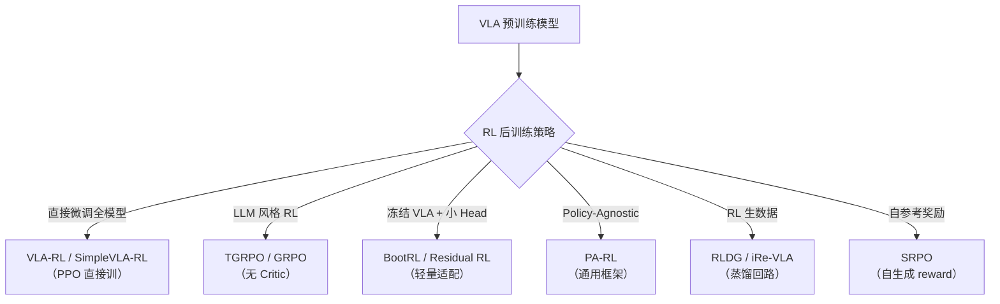
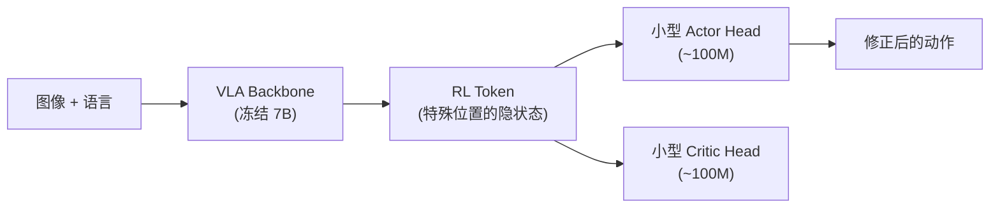
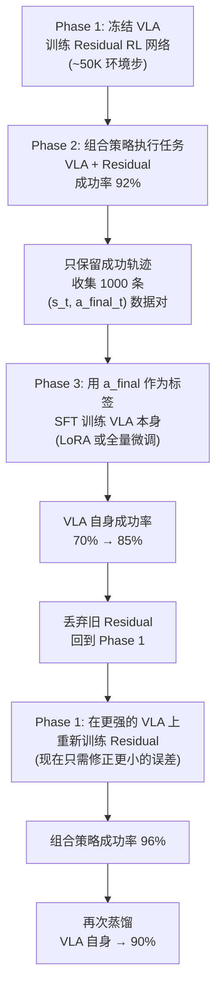
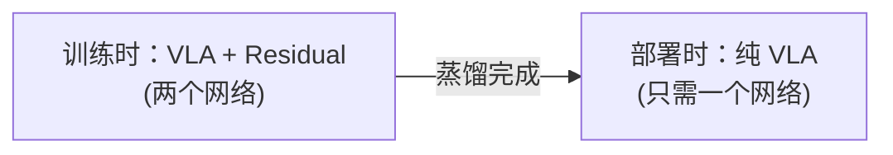
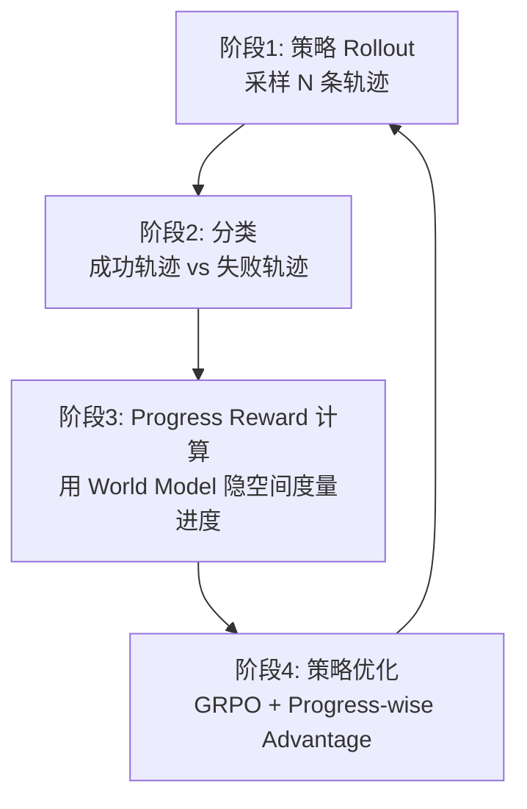
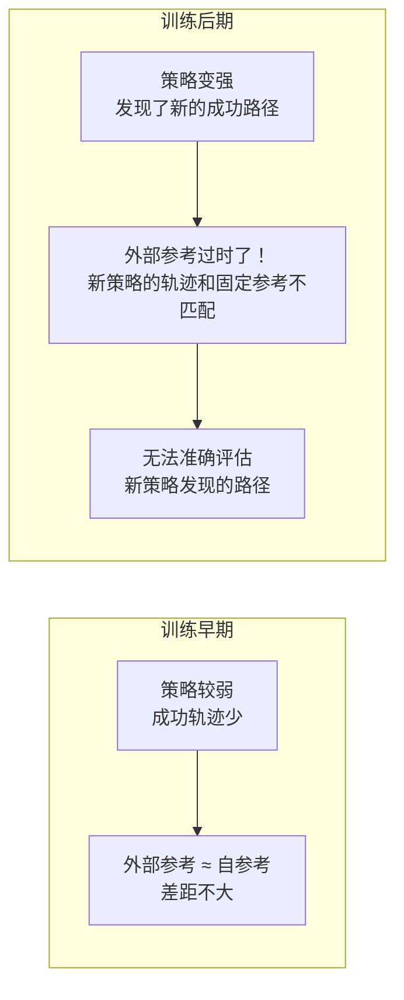
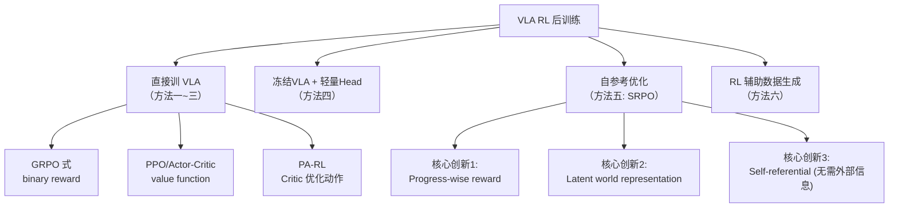
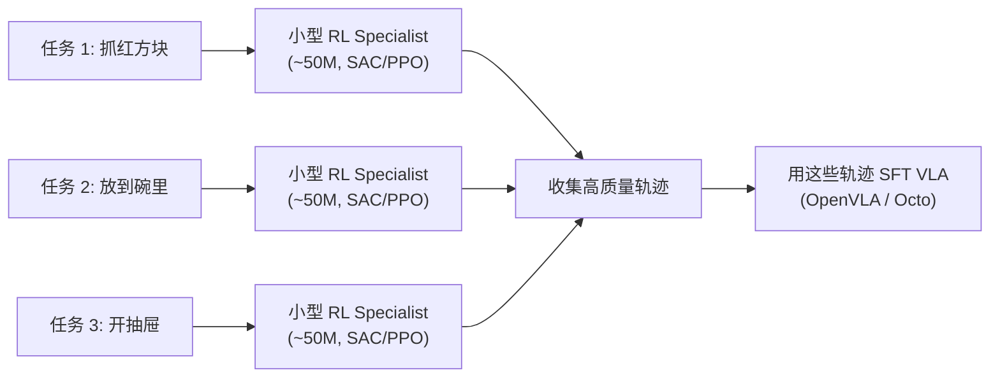
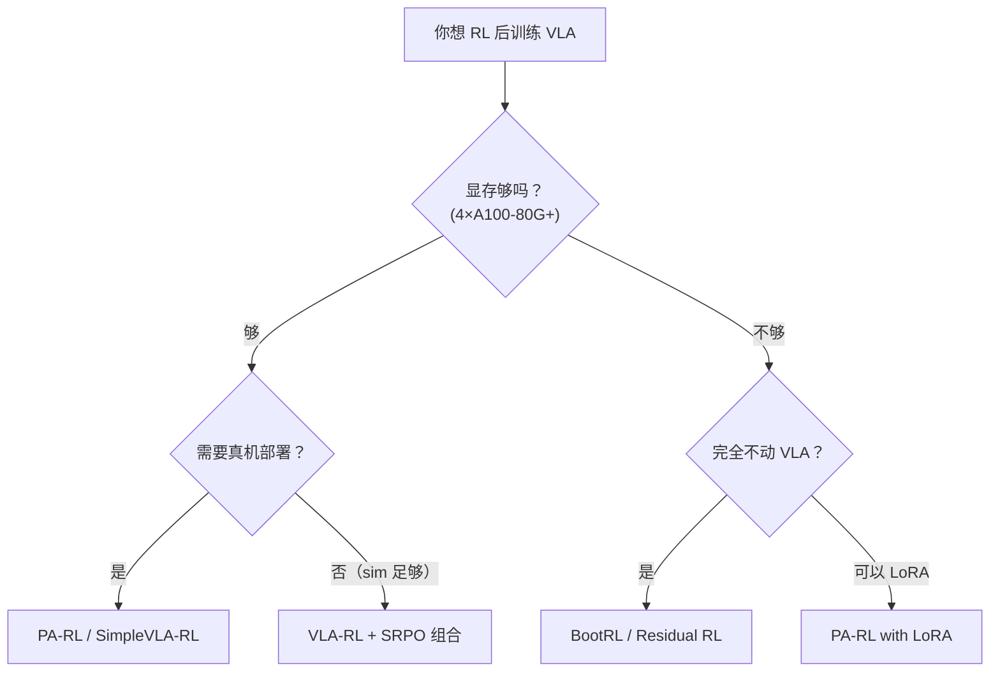

# VLA 模型的 RL 后训练综述：不止扩散，从自回归到 Residual 的全景图

> **综述范围**：Vision-Language-Action 模型接强化学习进行后训练的各类方法（重点覆盖非扩散路线）
> **关键词**：VLA、RL Post-Training、PPO、GRPO、Actor-Critic、自回归策略、Flow Matching、Residual RL
> **适用读者**：了解基本 RL 概念，想系统理解"VLA 预训练后如何用 RL 继续提升"

---

## 相关阅读

在阅读本文前，建议先了解以下前置知识：

- [策略梯度与 PPO](/前置知识/000a_前置知识_策略梯度与PPO) — 理解 clip 机制和 advantage 估计
- [行为克隆与 RL 微调范式](/前置知识/000d_前置知识_行为克隆与RL微调范式) — 预训练→微调的基本思路
- [Flow Matching 与连续归一化流](/前置知识/000g_前置知识_Flow_Matching与连续归一化流) — π₀ 等模型使用的生成框架
- [KL 散度与策略约束](/前置知识/000j_前置知识_KL散度与策略约束) — 理解为什么 RL 微调需要 KL penalty
- [SAC (Soft Actor-Critic)](/前置知识/000k_前置知识_SAC_Soft_Actor_Critic) — Residual RL 常用的训练算法
- [动作 Token 化与自回归策略](/前置知识/000l_前置知识_动作Token化与自回归策略) — 自回归 VLA 的动作表示核心

关联文章：

- [视觉-语言-动作模型 VLA 综述](./S03_视觉语言动作模型VLA综述) — VLA 架构的完整介绍
- [DPPO：扩散策略策略优化](./001_DPPO_扩散策略策略优化) — 扩散策略 + PPO 的经典方案
- [Online DPRL 综述：扩散策略与在线 RL](./003_Online_DPRL_综述_扩散策略与在线RL) — 扩散策略 RL 的四大家族
- [深度强化学习方法综述](./S01_深度强化学习方法综述) — RL 算法演化脉络

---

## 贯穿全文的例子：桌面机械臂抓取场景

> **场景**：一个 7B 参数的 VLA 模型（如 OpenVLA），经过大规模数据预训练 + SFT 后，在 LIBERO 仿真环境中执行 40 个桌面操作任务。
>
> 具体来说：
> - **输入**：一张 $256 \times 256$ RGB 图像 + 语言指令（如 "pick up the butter and put it in the basket"）
> - **输出**：7 维动作向量 $a = [\Delta x, \Delta y, \Delta z, \Delta r_x, \Delta r_y, \Delta r_z, g]$（末端增量 + 夹爪）
> - **动作表示**：离散化为 256 bins 的自回归 token 序列（7 个 token）
> - **问题**：SFT 后成功率约 70-80%，但面对 OOD 扰动（物体位置变化、光照变化）性能骤降
> - **目标**：通过 RL 后训练把成功率提到 90%+ 并增强鲁棒性
>
> 后面每个方法的讲解，我们都会回到这个例子来说明它具体怎么操作。

---

## 一、为什么 VLA 需要 RL 后训练

### 1.1 SFT 的天花板

VLA 模型（如 OpenVLA、π₀）的标准训练流程是：

1. 大规模视觉-语言预训练（学会"看"和"理解语言"）
2. 在机器人数据上做 SFT（学会"执行动作"）

但 SFT 有三个根本性限制：

| 限制 | 原因 | 后果 |
|------|------|------|
| 数据覆盖不足 | 示教数据只包含有限的状态-动作对 | OOD 状态下策略崩溃 |
| 模仿噪声 | 人类示教本身有抖动、不一致 | 策略学到了"坏习惯" |
| 缺乏闭环反馈 | BC 不知道动作执行后环境会怎样 | 无法纠正小偏差，误差累积 |

**核心矛盾**：SFT 让模型学会了"大致怎么做"，但缺少"做得对不对、怎么做得更好"的信号。RL 恰好提供这个信号——**奖励**。

### 1.2 VLA 做 RL 和传统 RL 有何不同

传统 RL（如训练 Atari 的 DQN）是从零开始学。VLA 的 RL 是**后训练**——在已经会做任务的基础上继续优化。这带来几个独特挑战：

1. **模型巨大**：7B 参数的 VLA 做 PPO 需要同时维护 Actor 和 Critic（共 14B+ 参数），显存爆炸
2. **奖励稀疏**：机器人任务通常只有最终 success/fail 的二值奖励，中间没信号
3. **采样昂贵**：物理仿真或真实环境的交互比生成文本慢几个数量级
4. **灾难性遗忘**：RL 微调太猛会把预训练学到的泛化能力搞丢

### 1.3 本文的覆盖范围

[DPPO](./001_DPPO_扩散策略策略优化) 和 [Online DPRL 综述](./003_Online_DPRL_综述_扩散策略与在线RL) 已经详细覆盖了**扩散策略** + RL 的路线。本文聚焦于**非扩散**（或不限于扩散）的 VLA RL 后训练方法，特别是：

- **自回归 VLA**（动作 token 化）+ PPO/GRPO
- **通用 Actor-Critic 框架**（不限策略类型）
- **Residual RL**（在 VLA 输出上叠加小型 RL 修正网络）
- **RL Token / Actor-Critic Head**（冻结 VLA 只训练小 head）
- **RL 辅助数据生成**（RL 生数据，蒸馏回 VLA）



---

## 二、方法一：直接用 PPO 训练自回归 VLA

### 代表作：VLA-RL（arXiv 2505.18719, 2025）

> **论文**: Towards Masterful and General Robotic Manipulation with Scalable Reinforcement Learning
> **核心贡献**: 第一个系统性地展示 PPO 可以直接训练 7B 自回归 VLA 模型（OpenVLA）并显著超越 SFT

#### 2.1 核心思路

VLA-RL 的出发点非常直接：既然 LLM 的 RLHF 用 PPO 微调 GPT 效果这么好，那 VLA（本质上也是 LLM）能不能也直接上 PPO？

答案是**可以**，但需要解决几个工程问题。

**关键洞察**：自回归 VLA 输出的是离散动作 token。每个 token 有明确的 $\log \pi(a_i | s, a_{<i})$，这和 LLM 的 next-token prediction 完全一样！所以 PPO 可以直接用，不需要像扩散策略那样绕过似然不可算的问题。（详细原理见 [动作 Token 化与自回归策略](/前置知识/000l_前置知识_动作Token化与自回归策略)。）

#### 2.2 算法细节

**策略表示**：

$$
\pi_\theta(\mathbf{a}|\mathbf{s}, l) = \prod_{i=1}^{7} \pi_\theta(a_i | \mathbf{s}, l, a_{<i})
$$

其中 $\mathbf{s}$ 是图像观测，$l$ 是语言指令，$a_i$ 是第 $i$ 维动作的离散 token（0~255）。

**一句话**：VLA 把 7 维连续动作量化为 7 个 token，像说 7 个"词"一样逐个输出。每个 token 的概率都是 softmax 分类。

**轨迹级 RL**：

VLA-RL 把整条轨迹看作一个"生成序列"，用 trajectory-level 的 sparse reward（成功 = +1，失败 = 0）作为信号：

$$
J(\theta) = \mathbb{E}_{\tau \sim \pi_\theta}\left[R(\tau)\right]
$$

其中 $R(\tau)$ 是整条轨迹的累积奖励（通常是 0/1 的 success/fail）。

**PPO 目标函数**（和 RLHF 完全一样的形式）：

$$
L^{\text{CLIP}}(\theta) = \mathbb{E}_t\left[\min\left(r_t(\theta)\hat{A}_t, \; \text{clip}(r_t(\theta), 1-\epsilon, 1+\epsilon)\hat{A}_t\right)\right]
$$

这里 $r_t(\theta) = \frac{\pi_\theta(a_t|s_t, a_{<t})}{\pi_{\theta_{\text{old}}}(a_t|s_t, a_{<t})}$ 是 token 级别的概率比。

**在我们的例子中**：

机器人执行 "pick up the butter" 任务，一条轨迹有 30 步，每步 7 个 token = 210 个 token 决策。如果最终成功抓起了黄油，$R(\tau) = 1$；如果 30 步后没拿起来，$R(\tau) = 0$。PPO 把这个 binary 信号通过 GAE 分摊到每个 token 上。

#### 2.3 工程上的关键设计

VLA-RL 能跑起来靠几个关键 trick：

| 设计 | 作用 |
|------|------|
| **Shared Actor-Critic backbone** | Actor 和 Critic 共享 VLA 的 transformer 骨干，只在最后一层分叉 → 省 45% 显存 |
| **VLA warm-up** | 先用 SFT 目标热身几步再开 RL，避免 Critic 初期乱估值导致策略崩溃 |
| **Minimal PPO epochs** | 每批数据只做 1-2 个 PPO epoch（而非 LLM-RLHF 常用的 4），减少过拟合 |
| **KL penalty** | 加 [KL 散度](/前置知识/000j_前置知识_KL散度与策略约束)约束 $\beta \cdot D_{\text{KL}}(\pi_\theta \| \pi_{\text{ref}})$ 防止偏离预训练太远 |

#### 2.4 实验结果

在 LIBERO 40 个任务上：
- OpenVLA (SFT only): ~72% 平均成功率
- OpenVLA + VLA-RL (PPO): **76.5%**，超越最强 SFT baseline 4.5%
- 甚至匹配了 π₀-FAST（一个商业级专门设计的 VLA）的性能

**重要结论**：对于自回归 VLA，PPO 是一个简单、有效、可扩展的 RL 后训练方案。

---

### 代表作：SimpleVLA-RL（ICLR 2026, arXiv 2509.09674）

> **论文**: SimpleVLA-RL: Scaling VLA Training via Reinforcement Learning
> **核心贡献**: 基于 veRL 框架构建高效 VLA RL 训练系统，发现了"pushcut"现象

#### 2.5 核心思路

SimpleVLA-RL 解决的是**工程可扩展性**问题：如何高效地在多个仿真环境中并行采样、训练 7B VLA？

它基于 veRL（一个高效的 LLM RL 训练框架）构建，添加了 VLA 特有的优化：

1. **VLA-specific trajectory sampling**：动态调整每条轨迹的采样长度（因为机器人任务长度变化大）
2. **Scalable parallelization**：多环境渲染 + 异步数据收集
3. **Optimized loss computation**：对 action token 和 non-action token 做不同处理

#### 2.6 "Pushcut" 现象

一个有趣的发现：RL 训练过程中，VLA 会**自发发现**训练数据中从未出现过的策略模式。

**在我们的例子中**：
- SFT 数据中，人类总是先抓起物体再放——一个保守的两阶段策略
- RL 训练后，模型有时学会直接"推"物体到目标位置（push + cut 的组合动作），这在示教数据中根本没有！

这说明 RL 不仅能优化已有策略，还能**发现全新的行为模式**——这是 SFT 永远做不到的。

#### 2.7 与 VLA-RL 的异同

| 维度 | VLA-RL | SimpleVLA-RL |
|------|--------|--------------|
| 算法 | PPO | PPO（基于 veRL） |
| 重点 | 算法设计 + 训练技巧 | 系统工程 + 可扩展性 |
| 模型 | OpenVLA-7B | 多种 VLA 架构 |
| 发现 | PPO > GRPO/DPO | "pushcut" 现象 |
| 真实世界 | 仿真为主 | 仿真 + 真实验证 |

---

## 三、方法二：GRPO / 无 Critic 路线

### 代表作：TGRPO（arXiv 2506.08440, 2025）

> **论文**: Fine-tuning Vision-Language-Action Model via Trajectory-wise Group Relative Policy Optimization
> **核心贡献**: 把 DeepSeek-R1 风格的 GRPO 适配到机器人轨迹层面，无需训练 Critic

#### 3.1 动机：为什么不想要 Critic

PPO 需要一个 Critic（价值网络）来估计 $V(s)$，进而算 advantage $\hat{A}_t = R_t - V(s_t)$。对于 7B 的 VLA：

- Critic 也要 7B 参数（或共享骨干），显存翻倍
- Critic 的 value estimation 在稀疏奖励下极不稳定
- 训练 Critic 本身就是一个难题（尤其是视觉输入 + 长 horizon）

GRPO 的核心想法：**用同一个策略的多次 rollout 互相比较，代替 Critic 的价值估计**。

#### 3.2 标准 GRPO（LLM 风格）

在 DeepSeek-R1 / LLM 对齐中，GRPO 的做法是：

1. 对同一个 prompt，采样 $G$ 个回复 $\{o_1, \ldots, o_G\}$
2. 每个回复获得一个奖励 $r_i$
3. 归一化 advantage：$\hat{A}_i = \frac{r_i - \text{mean}(\{r_j\})}{\text{std}(\{r_j\})}$
4. 用 PPO-style 的 clip loss 更新策略

**核心公式**：

$$
\hat{A}_i = \frac{r_i - \mu_G}{\sigma_G}
$$

**一句话**：不需要 Critic，只需要"和同伴比"——比平均好就是正 advantage，比平均差就是负 advantage。

#### 3.3 TGRPO：从 Token 级到 Trajectory 级

直接把 LLM 的 GRPO 搬到 VLA 会有问题：

- LLM 的一个"回复"是完整的——奖励在生成结束时给出
- VLA 的一个"轨迹"可能有 30-50 步，每步 7 个 token，奖励只在最后一步

TGRPO 的适配方案：

$$
\hat{A}^{\text{traj}}_i = \frac{R(\tau_i) - \mu_G}{\sigma_G}
$$

然后把轨迹级 advantage 分配给轨迹内的每个 action token：

$$
L(\theta) = -\frac{1}{|\mathcal{B}|}\sum_{\tau \in \mathcal{B}} \sum_{t=1}^{T} \sum_{i=1}^{7} \min\left(r_{t,i}(\theta)\hat{A}^{\text{traj}}, \; \text{clip}(\cdot)\hat{A}^{\text{traj}}\right)
$$

**在我们的例子中**：
- 对 "pick up butter" 这个指令，同时从 VLA rollout 出 8 条轨迹
- 其中 5 条成功（$R=1$），3 条失败（$R=0$）
- $\mu = 5/8 = 0.625$, $\sigma \approx 0.48$
- 成功轨迹的 advantage: $(1 - 0.625)/0.48 \approx +0.78$（奖励，做得好）
- 失败轨迹的 advantage: $(0 - 0.625)/0.48 \approx -1.30$（惩罚，做得差）

#### 3.4 GRPO vs PPO 的实际效果

来自 "What Can RL Bring to VLA Generalization?"（arXiv 2505.19789）的实验结论：

> PPO 在 VLA 上**显著优于** GRPO 和 DPO。

为什么？因为机器人任务的 reward 往往非常 sparse（只有最终 0/1），导致 group 内大部分轨迹都失败（advantage 全是负的），学习信号极弱。而 PPO 的 Critic 可以通过 temporal difference 把信号更好地传播到中间步。

| 方法 | 优点 | 缺点 |
|------|------|------|
| PPO | advantage 估计更精细，适合 sparse reward | 需要 Critic，显存大 |
| GRPO | 无 Critic，省显存，实现简单 | sparse reward 下学习信号弱 |
| DPO | 完全 offline，不需要环境交互 | 只能用已有数据，无法探索新策略 |

**实践建议**：
- 如果显存够（A100 80G × 4+），优先用 PPO
- 如果显存紧张或任务 reward 较 dense，可以试 GRPO
- DPO 适合快速迭代原型，但上限低

---

## 四、方法三：Policy-Agnostic RL（PA-RL）

### 代表作：PA-RL（ICLR 2025, arXiv 2412.06685）

> **论文**: Policy-Agnostic RL: Offline RL and Online RL Fine-Tuning of Any Class and Backbone
> **核心贡献**: 第一个在真实机器人上直接用 RL 微调 OpenVLA-7B 的工作；适用于任意策略架构

#### 4.1 核心思路：用监督学习替代策略改进

PA-RL 的关键洞察：**我们不需要让梯度穿过策略网络来做 policy improvement——只要能找到"好动作"，然后让策略模仿这些好动作就行**。

具体来说，PA-RL 用 Actor-Critic 框架，但 policy improvement step 不是梯度上升，而是：

1. **Critic 学习**：学一个 $Q(s, a)$ 函数
2. **动作优化**：找到使 $Q$ 值最大的动作 $a^* = \arg\max_a Q(s, a)$（同时约束离 data 不能太远）
3. **策略蒸馏**：用监督学习让策略模仿 $a^*$

$$
L_{\text{PA-RL}}(\theta) = \mathbb{E}_{s \sim \mathcal{D}}\left[\left\|\pi_\theta(s) - a^*\right\|^2\right]
$$

其中 $a^*$ 是通过 Critic 优化得到的"改进动作"。

**一句话**：不管你的策略是什么架构（扩散、自回归、Flow），我都可以先用 Critic 找到好动作，然后让你的策略用监督学习去模仿这些好动作。

#### 4.2 为什么这很重要

传统的 Actor-Critic 方法需要把 policy gradient 反传回策略网络。但不同策略架构的梯度路径完全不同：

- **自回归策略**：梯度通过 token 的离散采样（需要 REINFORCE / Gumbel-Softmax）
- **扩散策略**：梯度需要穿过 $K$ 步去噪链
- **Flow Matching**：梯度通过 ODE 求解器

PA-RL 绕过了所有这些复杂性：**策略只需要能做前向推理（生成动作）和监督训练（模仿动作）**。任何能做 SFT 的模型都能用 PA-RL。

#### 4.3 在我们的例子中

对 OpenVLA-7B 做 PA-RL fine-tuning：

1. **收集数据**：用当前策略 $\pi_\theta$ 在环境中执行，得到 $(s_t, a_t, r_t, s_{t+1})$ 数据
2. **训练 Critic**：一个相对小的网络（不需要 7B），学 $Q(s, a)$
3. **优化动作**：对每个 $s_t$，在当前动作附近搜索使 $Q$ 值更高的 $a^*_t$
4. **SFT 回策略**：用 $(s_t, a^*_t)$ 作为"改进后的示教"，对 OpenVLA 做一轮 SFT

这个过程可以迭代：新策略 → 新数据 → 更好的 Critic → 更好的动作 → 更好的策略……

#### 4.4 真实世界验证

PA-RL 是**第一个**在真实机器人上直接 RL 微调 7B VLA 的工作：
- 样本效率比 from-scratch RL 高 2 倍
- 在 sim 中达到 SOTA
- 在 real robot 上验证了 OpenVLA 的 RL 微调可行性

---

## 五、方法四：冻结 VLA + 轻量 RL Head

### 代表作：BootRL（arXiv 2604.23073, 2025）

> **论文**: Bootstrapping Online RL with Vision-Language-Action Models
> **核心贡献**: 提出 "RL Token" 概念，冻结 VLA 主干只训练一个小型 Actor-Critic Head

#### 5.1 核心动机

直接 RL 训练 7B VLA 的问题：
- 显存巨大（Actor + Critic 共 14B+）
- 训练不稳定（大模型微调容易灾难性遗忘）
- 采样效率低（大模型推理慢 → rollout 慢）

BootRL 的思路：**不动 VLA 的 7B 参数，只在它的输出上接一个小网络做 RL**。

#### 5.2 "RL Token" 机制



具体做法：

1. 在 VLA 的输入序列中添加一个特殊的 **RL token**
2. VLA 前向传播后，这个 RL token 位置的隐状态 $h_{\text{RL}} \in \mathbb{R}^{d}$ 包含了丰富的任务相关信息
3. 在 $h_{\text{RL}}$ 上接两个小型 MLP：
   - Actor Head: $a = f_{\text{actor}}(h_{\text{RL}})$，输出连续动作
   - Critic Head: $V = f_{\text{critic}}(h_{\text{RL}})$，输出 value 估计
4. 用标准 PPO 训练这两个小 Head，VLA 骨干完全冻结

**关键设计**：输出的动作还会与 VLA 原本预测的动作做一个 **anchoring**（锚定），防止小 Head 输出和 VLA 的预训练知识偏差太大：

$$
a_{\text{final}} = a_{\text{VLA}} + \alpha \cdot \Delta a_{\text{RL-head}}
$$

**在我们的例子中**：
- VLA 看到图像和 "pick up the butter"，通过 7B 前向传播
- RL token 位置获得一个 4096 维的特征向量（编码了"黄油在哪里""当前手臂位置""该怎么抓"等所有信息）
- 小型 Actor（3 层 MLP, ~50M 参数）在这个特征上输出一个微调量
- 最终动作 = VLA 的原始预测 + Actor Head 的修正

#### 5.3 优势

| 维度 | 直接训 VLA | BootRL |
|------|-----------|--------|
| 训练参数量 | 7B | ~100M |
| 显存需求 | 4×A100-80G | 1×A100-40G |
| 推理速度 | 慢（大模型） | 中（大模型前向+小Head） |
| 遗忘风险 | 高 | 极低（VLA 冻结） |
| 泛化保持 | 需要 KL 约束 | 天然保持 |

---

### 代表作：Residual RL for VLA（arXiv 2511.00091, 2025）

> **论文**: Self-Improving Vision-Language-Action Models with Data Generation via Residual RL
> **核心贡献**: 在 VLA 策略上叠加 residual RL 网络，用 RL 生成数据再蒸馏回 VLA

#### 5.4 Residual RL 是什么：从零讲起

##### 5.4.1 问题的出发点

假设你有一个 VLA 模型（比如 OpenVLA-7B），它经过 SFT 后在 "pick up butter" 任务上成功率 70%。这意味着：

- 10 次尝试中大约有 7 次成功、3 次失败
- 失败的原因通常不是"方向完全错"，而是**精度不够**——比如夹爪差了 2mm 没夹住、移动轨迹稍微歪了碰到了旁边的物体

换句话说，VLA 的输出**大方向是对的，但细节有误差**。这个误差来自：
- 动作 token 量化精度有限（256 bins → 分辨率 ~0.008）
- SFT 数据中人类示教本身有抖动
- 模型没有闭环纠错能力

##### 5.4.2 Residual Policy Learning 的核心思想

既然 VLA 的输出"大致对但不够精确"，那我们不需要从零训练一个完整的策略——只需要训练一个**小型修正网络**，专门负责补偿 VLA 的误差。

这就是 Residual Policy Learning（最早由 Silver et al., 2018 提出）：

$$
a_{\text{final}} = \underbrace{a_{\text{base}}}_{\text{VLA 输出（冻结）}} + \underbrace{\Delta a}_{\text{Residual 网络输出（可训练）}}
$$

**逐项拆解**：
- $a_{\text{base}} \in \mathbb{R}^7$：VLA 模型看到当前图像和语言指令后输出的 7 维动作（$\Delta x, \Delta y, \Delta z, \Delta r_x, \Delta r_y, \Delta r_z, g$）
- $\Delta a \in \mathbb{R}^7$：Residual 网络输出的修正量，**每个维度通常很小**（被 clip 在 $[-0.05, 0.05]$ 范围内）
- $a_{\text{final}} \in \mathbb{R}^7$：最终发给机器人执行的动作

**类比**：
- VLA 像是 GPS 导航告诉你"前方 500 米后左转"——大方向正确
- Residual 网络像是你握方向盘的微调——根据实际路况（路面坑洼、前车位置）做 ±3° 的方向盘修正
- GPS 不需要修改（VLA 冻结），你只需要学会微调方向盘（训练 Residual 网络）

##### 5.4.3 Residual 网络长什么样

Residual 网络是一个非常小的 MLP（多层感知机），典型结构：

```
输入: 当前状态观测 s ∈ ℝ^d (可以是图像特征 + 机器人关节状态)
     ↓
Linear(d, 256) → ReLU
     ↓
Linear(256, 256) → ReLU
     ↓
Linear(256, 7) → Tanh × scale
     ↓
输出: Δa ∈ ℝ^7 (每维 clip 到 [-0.05, 0.05])
```

参数量估算（假设输入 $d = 512$）：
- 第一层：$512 \times 256 + 256 = 131,328$
- 第二层：$256 \times 256 + 256 = 65,792$
- 第三层：$256 \times 7 + 7 = 1,799$
- **总计：~200K 参数**（约 0.2M，对比 VLA 的 7B 是 35000 倍的差距）

**为什么这么小就够用？** 因为它不需要理解"什么是黄油""夹爪应该去哪"——这些高层语义理解已经由 VLA 完成了。Residual 网络只需要做**最后一公里的精度修正**。

##### 5.4.4 Residual 网络怎么训练：用 RL

这个小网络用标准的强化学习算法训练（通常用 [SAC](/前置知识/000k_前置知识_SAC_Soft_Actor_Critic) 或 PPO），训练过程如下：

**状态**：$s_t$ = 当前观测（图像特征 + 机器人本体感知）

**动作**：$\Delta a_t$ = Residual 网络输出的修正量

**环境交互**：
1. VLA 前向传播 → 得到 $a_{\text{base}}$
2. Residual 网络前向传播 → 得到 $\Delta a$
3. 执行 $a_{\text{final}} = a_{\text{base}} + \Delta a$
4. 环境返回 $(s_{t+1}, r_t)$

**奖励设计**（典型）：
- 任务成功：$r = +10$
- 每步惩罚（鼓励快速完成）：$r = -0.01$
- 可选的距离奖励：$r = -\|p_{\text{gripper}} - p_{\text{target}}\|$

**关键约束**：Residual 的输出必须被 clip，防止它"喧宾夺主"：

$$
\Delta a = \text{clip}\Big(\pi_{\text{res}}(s), -\delta, +\delta\Big), \quad \delta = 0.05
$$

**为什么要 clip？** 如果不限制 Residual 的输出范围：
- 它可能学到完全忽略 VLA 的输出（$\Delta a$ 很大，直接覆盖 $a_{\text{base}}$）
- 这样就退化成了"从零训练一个 RL 策略"，失去了利用 VLA 预训练知识的优势
- clip 保证 Residual 只做"微调"，VLA 的大方向知识被保留

##### 5.4.5 为什么组合后成功率能从 70% 跳到 92%

这里需要理解**误差的本质**。VLA 成功率 70% 意味着 30% 的失败案例中：

- 大约 20% 是"差一点就成功"——夹爪位置偏了 2-5mm，或者角度差了几度
- 大约 8% 是"中间某步偏了导致后续全错"——累积误差
- 大约 2% 是"方向完全错"——理解错了指令

Residual RL 能修复前两类（共 28%），但修不了第三类（方向完全错，修正量太小）。

**代入数字的具体例子**：

假设某次 VLA 输出的动作是 $a_{\text{base}} = [0.35, -0.12, 0.08, 0.01, -0.02, 0.00, 0.0]$（向右移动、稍微下降、夹爪关闭），但黄油的实际位置需要动作 $a^* = [0.37, -0.10, 0.06, 0.01, -0.02, 0.00, 0.0]$。

误差向量：$a^* - a_{\text{base}} = [+0.02, +0.02, -0.02, 0, 0, 0, 0]$

这个误差每个维度都在 $[-0.05, 0.05]$ 范围内！所以 Residual 网络只需要学会输出 $\Delta a \approx [+0.02, +0.02, -0.02, 0, 0, 0, 0]$ 就能纠正这次错误。

经过 RL 训练后，Residual 网络学会了：
- 如果夹爪看起来偏左了 → 输出 $\Delta x > 0$
- 如果高度太高了 → 输出 $\Delta z < 0$
- 如果角度对了 → 输出 $\Delta r \approx 0$

这些纠正模式覆盖了大部分"差一点就成功"的情况，所以组合策略的成功率从 70% 跳到 92%。

#### 5.5 Self-Improving 循环：让 VLA 自己变强

这篇论文的独特之处是把 Residual RL 和 data generation 结合成一个**自我提升循环**。

##### 5.5.1 为什么不能一直依赖 Residual 网络

虽然 VLA + Residual 组合后效果好，但部署时有缺陷：
- 需要同时运行 VLA 和 Residual 两个网络（推理成本增加）
- Residual 网络是在特定环境中训的，换个环境可能不 work
- VLA 本身没变强，没有从 Residual 的"纠错经验"中学到东西

**理想状态**：把 Residual 的纠错知识"内化"到 VLA 自身，部署时只需要纯 VLA。

##### 5.5.2 Self-Improving 循环详解



**Phase 1 详细说明**：
- 冻结 VLA 的所有 7B 参数
- 用 SAC（Soft Actor-Critic）训练 Residual 网络
- 典型训练量：50K-100K 环境步（在仿真中 ~1-2 小时）
- 因为 Residual 只有 ~0.2M 参数，训练非常快

**Phase 2 详细说明**：
- 用 $a_{\text{final}} = a_{\text{VLA}} + \Delta a_{\text{res}}$ 在环境中执行
- 关键：**只保留成功的轨迹**（失败的扔掉）
- 保存的数据格式：$(s_t, a_{\text{final},t})$——注意标签是**组合后的动作**，不是 VLA 原始输出
- 收集约 1000 条完整的成功轨迹（每条约 30-50 步 → 总共 30K-50K 个数据对）

**Phase 3 详细说明**：
- 用这些数据对 VLA 做 SFT
- 目标函数：$L = \sum_t \|\pi_{\text{VLA}}(s_t) - a_{\text{final},t}\|^2$（连续动作）或交叉熵（token化动作）
- VLA 在学什么？它在学习"加上 Residual 修正后的更精确动作"
- 相当于把 Residual 的纠错能力"蒸馏"进了 VLA 的权重里

**为什么迭代有效？**
- Round 1：VLA(70%) + Res → 92%，蒸馏后 VLA → 85%
- Round 2：VLA(85%) + Res → 96%，蒸馏后 VLA → 90%
- Round 3：VLA(90%) + Res → 98%，蒸馏后 VLA → 94%

每一轮：
1. VLA 起点更高 → Residual 只需修正更小的误差 → 组合策略更强
2. 组合策略更强 → 收集的数据质量更高 → 蒸馏效果更好
3. 这是一个**正反馈循环**，类似 AlphaGo 的 self-play

##### 5.5.3 为什么蒸馏后 VLA 的成功率比组合策略低

你可能注意到：组合策略 92% → 蒸馏后 VLA 只有 85%，为什么不是 92%？

原因是 **SFT 的模仿损失不是完美的**：
- VLA 的架构限制（token 量化、自回归误差累积）意味着它无法完美复现 $a_{\text{final}}$
- 有些轨迹的成功依赖于 Residual 在**特定状态**下的精确修正，这些精确的条件反射 SFT 学不到
- 数据量有限（1000 条），可能没覆盖所有边界情况

但关键点是：**VLA 从 70% → 85% 的提升是稳固的**，这个提升不需要 Residual 网络在部署时存在。

##### 5.5.4 最终部署架构

经过 3-5 轮 Self-Improving 循环后，VLA 本身成功率可达 90%+。此时：



- **推理开销**：和原始 VLA 完全一样（没有额外网络）
- **泛化能力**：保留 VLA 的预训练泛化（Residual 的知识被内化了）
- **精度**：比原始 SFT 的 VLA 高 20%+

---

## 六、方法五：SRPO——自参考策略优化

### 代表作：SRPO（CVPR 2026, arXiv 2511.15605）

> **论文**: Self-Referential Policy Optimization for Vision-Language-Action Models
> **核心贡献**: 不需要外部奖励模型或人工 reward shaping，用模型自己的成功经验给失败尝试打分
> **关键技术**: 利用预训练 World Model（V-JEPA 2）的隐空间表示来度量轨迹间的行为相似性

#### 6.1 核心问题：稀疏奖励下 GRPO 不够用

##### 6.1.1 GRPO 的根本困境

回顾 GRPO 的工作方式：对同一个任务采样一组（group）轨迹，每条轨迹得到一个 outcome reward（成功=1，失败=0），然后在组内归一化得到 advantage。

GRPO 式方法（包括 VLA-RL、SimpleVLA-RL、RIPT-VLA 等）面临的最大问题：**如果 8 条 rollout 里 7 条都失败了，advantage 的信息量极低**。你只知道"第 3 条成功了所以奖励它"，但不知道其他 7 条到底哪里做错了。

**在我们的例子中**：假设机器人执行 "pick up the butter" 任务，8 次尝试中：
- 第 3 次：手臂移到黄油上方 → 下降 → 夹住 → 成功！奖励 = 1
- 第 1 次：手臂移到黄油上方 → 下降 → 差了 2mm 没夹住 → 失败。奖励 = 0
- 第 5 次：手臂一开始就朝错误方向移动 → 碰到杯子 → 失败。奖励 = 0

在 GRPO 看来，第 1 次和第 5 次**得到完全相同的奖励**（都是 0），但我们人类一眼就能看出第 1 次其实"几乎成功了"——它的大部分动作都是正确的，只是最后差了一点点。这种**"功亏一篑"的信息被完全丢弃了**。

##### 6.1.2 现有解决方案的问题

为了解决稀疏奖励问题，已有一些工作尝试手工设计 dense reward：

| 方法 | 做法 | 问题 |
|------|------|------|
| TGRPO | 手动把任务分成多个阶段，每完成一个阶段给分 | 需要人工定义每个任务的阶段，无法扩展到新任务 |
| VLA-RL | 使用 PPO + 手工 reward shaping | 需要针对每个任务设计 reward function |
| Pixel-level progress | 用最终帧和当前帧的像素距离 | 对光照、视角变化极度敏感，无法捕捉语义进度 |

**核心矛盾**：我们需要 dense reward 来加速训练，但手工设计 dense reward 本身就违背了"自主学习"的初衷。

##### 6.1.3 SRPO 的核心思想

SRPO 提出了一个优雅的解决方案：**用成功轨迹作为"自参考"，度量失败轨迹在每一步离成功有多远**。

核心直觉：
- 一个 batch 里总有一些轨迹成功了——这些成功轨迹本身就是"答案"
- 失败轨迹的某些片段可能和成功轨迹的某些片段很像——说明至少那一段做对了
- 我们可以用这种"和成功的相似度"作为 dense reward，而**完全不需要外部信息**

#### 6.2 算法流程：从采样到优化的完整 Pipeline

SRPO 的完整训练流程可以分为四个阶段：



##### 6.2.1 阶段一：策略 Rollout

对于当前策略 $\pi_\theta$，在环境中执行 $M$ 条轨迹。每条轨迹 $\tau_i$ 是一系列观测-动作对：

$$
\tau_i = \{(o_0^{(i)}, a_0^{(i)}), (o_1^{(i)}, a_1^{(i)}), \ldots, (o_T^{(i)}, a_T^{(i)})\}
$$

其中 $o_t$ 是第三人称相机图像，$a_t$ 是机器人末端执行器的 7 维动作指令，$T$ 是轨迹长度。

每条轨迹在结束时获得一个 binary outcome reward：

$$
R_i = \begin{cases} 1 & \text{如果任务成功完成} \\ 0 & \text{否则} \end{cases}
$$

**在我们的例子中**：8 条轨迹执行 "pick up the butter"，结果是 [0, 0, 1, 0, 0, 0, 1, 0]——只有第 3 条和第 7 条成功。

##### 6.2.2 阶段二：构建 Rollout Reference Set

将成功轨迹收集为**参考集**（Reference Set）：

$$
\mathcal{S} = \{o_{0:T}^{(i)} \;;\; R(z_{0:T}^{(i)}, l) = 1, \forall i\}
$$

在我们的例子中，$\mathcal{S}$ 包含第 3 条和第 7 条轨迹的观测序列。

##### 6.2.3 阶段三：用 World Model 隐空间计算 Progress Reward

这是 SRPO 最核心的创新。具体分为三步：

**Step 1：编码所有轨迹到隐空间**

SRPO 使用一个预训练的 World Model（具体用的是 [V-JEPA 2](https://arxiv.org/abs/2506.09985)，一个在大规模机器人视频数据上自监督预训练的模型）作为编码器 $\mathcal{W}$：

$$
h_i = \mathcal{W}(o_{0:T}^{(i)})
$$

**为什么用 V-JEPA 2 而不是普通图像编码器（如 ImageBind）？**
- V-JEPA 2 在**隐空间**学习视频动态，它的表征捕捉的是"物理世界中发生了什么"（物体运动、接触关系等）
- 普通视觉编码器只关注"图像长什么样"（纹理、颜色等），对光照变化、视角扰动敏感
- 论文实验证明：V-JEPA 2 的隐空间表征在 Spearman 相关性上达到 0.998，远超像素级方法（0.125）和 ImageBind（0.957）

**Step 2：对成功轨迹做聚类**

用 DBSCAN 算法对成功轨迹的隐空间表征进行聚类：

$$
C = \text{DBSCAN}(\mathcal{S})
$$

**为什么要聚类？** 两个原因：
1. **一个任务可以有多种成功策略**：比如"把碗放到架子上"，可以从左边拿也可以从右边拿。失败轨迹应该和**最接近的那种成功策略**比较，而不是和随便一条成功轨迹比较
2. **鲁棒性**：单条成功轨迹可能有噪声片段（比如夹爪短暂偏移后纠正回来）。用聚类中心代替单条轨迹，能得到更"原型化"的参考标准

**Step 3：计算每条失败轨迹的 Progress Reward**

对于失败轨迹 $i$ 的隐空间表征 $h_i$，计算它到最近聚类中心的 L2 距离：

$$
d_i = \min\left(\{\|h_i - h_j\|_2 \;;\; h_j \in C\}\right)
$$

然后将距离转换为 $[0, 1]$ 范围内的奖励：

$$
g_i = \begin{cases} 1.0 & \text{成功轨迹} \\ \phi\left(\alpha \cdot \frac{d_i - \bar{d}}{\sigma_d}\right) & \text{失败轨迹} \end{cases}
$$

**逐项拆解**：
- $\phi(\cdot)$：sigmoid 激活函数，将输出映射到 $(0, 1)$
- $\alpha = 0.8$：缩放系数（论文通过超参搜索确定，$\alpha=0.8$ 最优）
- $\bar{d}$：所有失败轨迹距离的均值（用于归一化）
- $\sigma_d$：所有失败轨迹距离的标准差（用于归一化）
- **归一化的含义**：$\frac{d_i - \bar{d}}{\sigma_d}$ 是标准化后的距离，负值表示"比平均更接近成功"，正值表示"比平均更远离成功"

**代入数字的例子**：

假设 8 条轨迹中，2 条成功、6 条失败。6 条失败轨迹到最近成功聚类中心的距离分别为：

| 失败轨迹 | 距离 $d_i$ | 归一化 | sigmoid 输出 | 解释 |
|----------|-----------|--------|-------------|------|
| 第 1 条（差 2mm 没夹住） | 0.12 | -1.5 | 0.83 | 非常接近成功！ |
| 第 2 条（碰到旁边杯子） | 0.35 | -0.02 | 0.50 | 中等 |
| 第 4 条（方向对但太慢超时） | 0.28 | -0.47 | 0.60 | 还不错 |
| 第 5 条（朝错误方向移动） | 0.72 | 2.3 | 0.09 | 很差 |
| 第 6 条（抖动不稳定） | 0.55 | 1.2 | 0.23 | 较差 |
| 第 8 条（卡住没动） | 0.61 | 1.6 | 0.17 | 很差 |

**关键观察**：第 1 条（差 2mm 没夹住）获得了 0.83 的高奖励——SRPO 识别出它"几乎成功了"，而传统 GRPO 只会给它 0！

##### 6.2.4 阶段四：策略优化（GRPO + Progress Advantage）

有了 progress reward $g_i$ 后，SRPO 沿用 GRPO 的策略优化框架，但 advantage 计算使用的是 progress reward 而非 binary reward：

**Advantage 计算**：

$$
\hat{A}_i = \frac{g_i - \mu_g}{\sigma_g}
$$

其中 $\mu_g$ 和 $\sigma_g$ 是当前 group 内所有轨迹 $g_i$ 的均值和标准差。

**对比传统 GRPO**：
- GRPO 用 binary reward：$g_i \in \{0, 1\}$ → 如果 8 条中只有 1 条成功，advantage 只有两个值
- SRPO 用 progress reward：$g_i \in (0, 1)$ → 每条轨迹都有不同的 advantage 值，梯度信号更丰富

**策略更新**使用 clipped surrogate objective（和 [PPO](/前置知识/000a_前置知识_策略梯度与PPO) 相同）：

$$
\mathcal{L}_{t,i}^{\text{CLIP}}(\theta) = \min\left(r_{i,t}(\theta) \hat{A}_i, \; \text{clip}(r_{i,t}(\theta), 1-\epsilon, 1+\epsilon) \hat{A}_i\right)
$$

其中概率比值 $r_{i,t}(\theta) = \frac{\pi_\theta(a_t^{(i)}|o_t^{(i)}, l)}{\pi_{\theta_{old}}(a_t^{(i)}|o_t^{(i)}, l)}$。

**完整 SRPO 目标函数**：

$$
\mathcal{L}^{\text{SRPO}}(\theta) = \mathbb{E}_{t,i}\left[\mathcal{L}_{t,i}^{\text{CLIP}}(\theta)\right] + \beta \cdot D_{\text{KL}}(\pi_\theta \| \pi_{\text{ref}})
$$

**逐项拆解**：
- $\mathcal{L}_{t,i}^{\text{CLIP}}$：PPO 的 clipped surrogate，防止策略更新太大
- $D_{\text{KL}}(\pi_\theta \| \pi_{\text{ref}})$：[KL 散度](/前置知识/000j_前置知识_KL散度与策略约束)正则项，防止策略偏离 SFT 模型太远
- $\beta$：KL 惩罚系数，控制探索与保守性的平衡

**一个重要的设计选择**：SRPO 使用**轨迹级别**的 reward（整条轨迹一个分数），而非 step-level 的 reward。论文引用 Sutton 的"bitter lesson"观点——过于细粒度的手工 reward 反而会导致策略收敛到次优解。

#### 6.3 为什么叫"自参考"：和现有方法的本质区别

##### 6.3.1 "自参考"的含义

关键点：**不需要外部 reward model 或手工设计的 reward function**。奖励信号完全来自模型自身同一 batch 中的成功经验。

- "自参考" = 用自己的成功当标准
- 和 LLM 领域的 Self-Play / Self-Reward 类似，但用的是轨迹空间的距离而不是语言评分

##### 6.3.2 和"外部参考"方法的对比

论文做了一个关键消融实验：如果不用 batch 内的成功轨迹，而是用**50 条预先收集的专家轨迹**作为参考会怎样？

结果：
- 初期训练速度和 SRPO 差不多（因为 progress reward 本身就比 sparse reward 好）
- 但**后期性能会遇到瓶颈**，需要 1.4 倍的训练步数才能收敛，且最终性能更低

**为什么固定参考会有问题？**



核心洞察：**随着策略变强，它会发现原始专家数据中没有的新策略**（比如从左边抓而不是从右边抓）。固定的外部参考无法为这些新路径提供有意义的 progress 信号。而"自参考"会随着策略的进化而进化——因为参考集就是当前 batch 中的成功轨迹，它们反映的是**当前策略能做到的最好水平**。

##### 6.3.3 SRPO 促进了探索多样性

论文的 Figure 6 展示了一个重要发现：SRPO 训练后的策略在动作空间中的分布比 full-shot SFT 更加**分散和多样**：
- SFT 策略只会模仿训练数据中看到过的动作路径
- SRPO 策略会探索训练数据中从未出现过的新路径，包括新的抓取位置和接近角度

这说明 progress reward 不仅加速了训练，还鼓励了策略**超越人类示教的限制**进行创造性探索。

#### 6.4 Latent World Representation：为什么不用像素？

这是 SRPO 的另一个关键技术贡献。为什么不直接用原始像素或通用视觉模型来度量轨迹相似性？

##### 6.4.1 三种 reward 信号的对比

| 方法 | 表示方式 | Spearman 相关 | 单调性 | MMD | 问题 |
|------|---------|-------------|--------|-----|------|
| Pixel-level（RLVR） | 最终帧与当前帧的 L1 距离 | 0.125 | 0.498 | 0.274 | 对光照/视角极敏感，只关注最后一帧 |
| ImageBind | 通用视觉嵌入的相似度 | 0.957 | 0.837 | 0.356 | 缺乏物理理解，reward 曲线锯齿状抖动 |
| **SRPO (V-JEPA 2)** | World Model 隐空间距离 | **0.998** | **0.992** | **0.615** | ✅ 捕捉物理进度，平滑单调 |

##### 6.4.2 V-JEPA 2 隐空间的优势

V-JEPA 2 是一个在大规模视频数据上通过自监督（Joint-Embedding Predictive Architecture）预训练的模型。它学到的表征有三个关键特性：

1. **捕捉物理动态**：它的隐空间编码的不是"图像长什么样"，而是"物理世界中发生了什么变化"。所以对光照变化、背景干扰等无关因素是不敏感的
2. **跨环境迁移性强**：因为是在大规模多样数据上预训练的，不需要对特定任务做 fine-tuning 就能直接使用
3. **轨迹级建模**：V-JEPA 2 的编码器接受一段视频序列作为输入，输出是对整段视频动态的压缩表征——天然适合做轨迹比较

**实际使用方式**：对于每条轨迹的观测序列 $o_{0:T}$，使用滑动窗口方式编码：
- 窗口 [0, 10] → 嵌入 $h_1$
- 窗口 [1, 11] → 嵌入 $h_2$
- ...
- 窗口 [1, T-1] → 嵌入 $h_{T-10}$

这样得到一个嵌入序列，代表轨迹在不同时间点的累积进度。

##### 6.4.3 为什么不用像素级 World Model 生成参考轨迹

论文还讨论了另一个可能的方案：用像素级 World Model（如 Cosmos-Predict2-14B）根据语言指令**生成**参考轨迹视频，然后用生成的视频作为参考。

这个方案的问题：
- 在 zero-shot 设置下，生成的视频场景一致性很差（物体会消失/变形）
- 如果做 task-specific fine-tuning，成本很高，且需要大量专家数据——这和 SRPO 的"无需外部监督"理念矛盾
- SRPO 使用隐空间表征更轻量、更泛化

#### 6.5 实验效果：详细分析

##### 6.5.1 主实验：LIBERO Benchmark

SRPO 在 LIBERO benchmark 的 4 个子集上都取得了 SOTA：

| 模型 | 输入 | Spatial | Object | Goal | Long | **平均** |
|------|------|---------|--------|------|------|--------|
| OpenVLA*-One (SFT baseline) | T+I | 63.6 | 54.9 | 59.6 | 17.3 | 48.9 |
| SimpleVLA-RL (GRPO) | T+I | 98.2 | 98.7 | 98.8 | 91.7 | 96.9 |
| RIPT-VLA (GRPO) | T+W+P+I | 99.0 | 98.6 | 98.6 | 93.8 | 97.5 |
| RLinf (GRPO) | T+W+P+I | 99.4 | 99.8 | 98.8 | 94.0 | 98.0 |
| **SRPO (Online)** | **T+I** | **98.8** | **100.0** | **99.4** | **98.6** | **99.2** |

**关键发现**：
1. SRPO 只用第三人称图像 + 语言指令（T+I），就超过了使用额外腕部摄像头（W）和本体感知（P）的方法
2. 在最难的 LIBERO-Long 上提升最大：从 17.3% → 98.6%（绝对提升 81.3%！），而其他 RL 方法在 Long 上也只有 91-94%
3. 这说明 progress reward 对**长程任务**帮助最大——因为长程任务中 sparse reward 的问题最严重

##### 6.5.2 训练效率：SRPO vs GRPO

SRPO 在 4 个子集上达到峰值性能所需的 RL 步数：
- Spatial：79 步
- Object：59 步
- Goal：103 步
- Long：219 步

对比 GRPO，SRPO 在 LIBERO-Long 上的收敛速度快约 **2-3 倍**。原因直观：GRPO 把 7/8 的失败轨迹当废数据丢掉，SRPO 从每条轨迹中都能提取学习信号。

##### 6.5.3 泛化性：LIBERO-Plus

LIBERO-Plus 包含 7 种扰动维度（相机变化、机器人初始位置、语言变体、光照、背景、噪声、布局）：

- One-shot SFT baseline → 平均 19.4%
- + Online SRPO → 平均 **59.6%**（提升 40.2%，相对提升 207%）
- 甚至超过了 Full-shot SFT baseline（51.1%）

**这说明什么？** SRPO 的在线探索发现了比专家演示更多样的轨迹，这种多样性自然带来了更好的泛化。

##### 6.5.4 真实机器人验证

在 X-ARM 7 机器人上 5 个任务的测试（使用 offline RL 变体，AWR + SRPO reward）：

| 任务 | π₀ (SFT) | π₀ + SRPO | π₀-FAST (SFT) | π₀-FAST + SRPO |
|------|----------|-----------|---------------|----------------|
| 放苹果到盘子 | 中 | 高 | 中 | 高 |
| 放梨到盘子 | 中 | 高 | 中 | 高 |
| 叠毛巾 | 低 | 中 | 低 | 中高 |
| 擦白板 | 中 | 高 | 中 | 高 |
| 选扑克牌 | 低 | 中 | 低 | 中 |

两种 VLA 架构（扩散式 π₀ 和自回归式 π₀-FAST）都有显著提升，平均分别提升 +66.8% 和 +86.7%。

#### 6.6 SRPO 的局限性与适用条件

1. **需要 batch 中有成功轨迹**：如果任务太难，当前策略一条都成功不了，那"自参考"就没有参考对象了。论文的解决方案是从 One-shot SFT 出发（至少有一定成功率）
2. **需要预训练的 World Model**：V-JEPA 2 是一个大型视频理解模型，需要 GPU 跑推理来编码轨迹（但不需要 fine-tune，只做前向推理）
3. **轨迹级 reward**：SRPO 给整条轨迹一个分数，而非每步一个分数。这对"整体接近成功但某一步出了关键错误"的情况可能不够精细
4. **目前主要在仿真验证**：真实机器人实验用的是 offline RL（AWR），还没有做真机 online RL（因为安全和 reset 成本）

#### 6.7 SRPO 在整个方法谱系中的定位



SRPO 本质上还是 GRPO 的框架（group-based optimization + clipped surrogate），但它**用更好的 reward signal 替换了 binary reward**。可以把 SRPO 看作是对 GRPO 式方法的一个正交改进——任何使用 GRPO 的方法都可以用 SRPO 的 reward 来替换原始 reward。

---

## 七、方法六：RL 辅助数据生成（间接 RL）

### 代表作：RLDG（RSS 2025, arXiv 2412.09858）

> **论文**: RLDG: Robotic Generalist Policy Distillation via Reinforcement Learning
> **核心贡献**: 不直接用 RL 训 VLA，而是用 RL 训 specialist → 生成数据 → 蒸馏回 VLA

#### 7.1 核心思路

RLDG 的哲学是：**VLA 太大太贵不适合直接跑 RL，那就让小模型跑 RL，再把 RL 学到的知识通过数据传递给 VLA**。



#### 7.2 为什么不直接用人类演示

| 数据来源 | 质量 | 数量 | 成本 | 多样性 |
|----------|------|------|------|--------|
| 人类遥操作 | 中等（手抖、不一致） | 少（100条/小时） | 高 | 低 |
| RL specialist | 高（优化后的策略） | 无限（自动执行） | 低（仿真免费） | 高（探索多种路径） |

RL specialist 训练好之后可以无限量生成数据——而且这些数据来自**优化过的策略**，质量比人类示教更高。

#### 7.3 实验效果

- 对 OpenVLA 和 Octo 都有效
- 比用人类演示 fine-tune 高 20-40% 成功率
- RL specialist 在窄任务上极强，蒸馏后 VLA 在**多任务**上都变强（知识迁移）
- 真实机器人验证通过

#### 7.4 局限性

- 需要可仿真的环境（RL specialist 训练需要大量交互）
- 每个任务需要单独训 specialist
- 不是"端到端 RL"，而是间接的 data pipeline

---

### 代表作：iRe-VLA（arXiv 2501.16664, 2025）

> **论文**: Improving Vision-Language-Action Model with Online Reinforcement Learning
> **核心贡献**: 迭代式 RL + SFT 交替训练，用 RL 探索新状态，用 SFT 稳定学习

#### 7.5 RL 和 SFT 的互补性

iRe-VLA 观察到：

- **纯 RL** 训 VLA：探索能力强，但训练不稳定（尤其是大模型）
- **纯 SFT**：稳定，但无法超越数据上限

解决方案：**交替进行**。

$$
\theta^{(k+1)} = \text{SFT}\Big(\theta^{(k)}, \; \mathcal{D}_{\text{RL}}^{(k)} \cup \mathcal{D}_{\text{demo}}\Big)
$$

其中 $\mathcal{D}_{\text{RL}}^{(k)}$ 是第 $k$ 轮 RL 探索收集的成功轨迹。

**在我们的例子中**：
- Round 1：用 $\pi^{(0)}$（SFT 初始化）做 RL 探索 → 收集到一些新的成功轨迹
- Round 1 SFT：把这些新轨迹和原始 demo 一起 SFT → 得到 $\pi^{(1)}$
- Round 2：用 $\pi^{(1)}$ 做 RL 探索 → 因为起点更好，探索到更多成功轨迹
- Round 2 SFT：$\pi^{(1)}$ → $\pi^{(2)}$ ……

这和 Residual RL for VLA 的 Self-Improving 循环异曲同工，区别在于 iRe-VLA 是让 VLA 自身做 RL 探索（而不是靠 Residual 网络）。

---

## 八、方法七：Robustness-Aware RL Post-Training

### 代表作：RAPT（arXiv 2511.01331, 2025）

> **论文**: Robustness-Aware Reinforcement Post-Training for Vision-Language-Action Models
> **核心贡献**: 在 RL 训练中显式优化鲁棒性，而不仅仅是最大化平均 reward

#### 8.1 问题：RL 只优化 reward 够不够

标准的 RL 后训练（PPO/GRPO）只关心一件事：让成功率最高。但实际部署时：

- 物体位置有随机偏差
- 光照条件变化
- 摄像头可能有轻微角度偏移

一个在标准条件下 99% 成功的策略，在扰动条件下可能骤降到 50%。

#### 8.2 RAPT 的做法

在 RL 训练的 rollout 阶段引入**环境扰动**：

$$
J_{\text{robust}}(\theta) = \mathbb{E}_{\xi \sim P(\xi)}\left[\mathbb{E}_{\tau \sim \pi_\theta(\cdot|\xi)}\left[R(\tau)\right]\right]
$$

其中 $\xi$ 是环境扰动参数（物体位置噪声、光照变化等）。

**一句话**：不仅要在标准环境下做得好，还要在各种扰动下都做得好。

这和 Domain Randomization 在 RL 训练中的应用类似，但 RAPT 会根据策略当前的薄弱环节**自适应地调整扰动分布**（类似对抗训练 / Curriculum Learning）。

---

## 九、方法对比总结

### 9.1 全景对比表

| 方法 | 论文 | RL 算法 | 策略类型 | 需要 Critic | 训练参数量 | 真实机器人 | 核心亮点 |
|------|------|---------|----------|-------------|-----------|-----------|----------|
| **VLA-RL** | 2505.18719 | PPO | 自回归 token | ✅ (共享) | 全量 7B | ❌ sim | PPO 直接训 VLA 可行 |
| **SimpleVLA-RL** | 2509.09674 | PPO | 自回归 token | ✅ | 全量 | ✅ | 工程框架 + pushcut |
| **TGRPO** | 2506.08440 | GRPO | 自回归 token | ❌ | 全量 | ❌ sim | 无 Critic 省显存 |
| **PA-RL** | 2412.06685 | Actor-Critic (SL) | 任意 | ✅ (独立小网络) | 全量 or LoRA | ✅ | 策略无关，首个真机 RL |
| **BootRL** | 2604.23073 | PPO | RL Token + Head | ✅ (小 Head) | ~100M | ❌ sim | 冻结 VLA，轻量级 |
| **Residual RL** | 2511.00091 | SAC/PPO | 连续 residual | ✅ (小网络) | ~10M res | ❌ sim | 自我提升循环 |
| **SRPO** | 2511.15605 | PPO + self-ref | 自回归 token | ❌ (自参考) | 全量 | ❌ sim | 自生成 dense reward |
| **RLDG** | 2412.09858 | specialist SAC | 间接 | N/A | specialist 小 | ✅ | RL 生数据蒸馏 |
| **iRe-VLA** | 2501.16664 | Online RL + SFT | 自回归 token | ✅ | 全量 | ❌ sim | 迭代 RL/SFT 交替 |
| **RAPT** | 2511.01331 | PPO | 自回归 token | ✅ | 全量 | ❌ sim | 鲁棒性显式优化 |

### 9.2 选型指南



**决策核心因素**：

1. **显存预算**：全量 PPO 需要 4×80G，GRPO 省一半，BootRL/Residual 省 90%
2. **奖励信号**：sparse 用 SRPO 或 PPO；如果有 dense reward 用啥都行
3. **是否需要真实部署**：PA-RL 和 SimpleVLA-RL 有真机验证
4. **是否在意泛化保持**：BootRL（冻结 VLA）最安全；VLA-RL/SRPO 需要 KL 约束

---

## 十、关键实验发现汇总

### 10.1 PPO vs GRPO vs DPO（来自 RLVLA 实证研究）

"What Can RL Bring to VLA Generalization?"（arXiv 2505.19789）是一篇重要的实证研究，系统比较了不同 RL 算法在 VLA 上的表现：

| 算法 | 语义泛化 | 执行鲁棒性 | 视觉鲁棒性 | 训练稳定性 |
|------|----------|-----------|-----------|-----------|
| SFT (baseline) | 中 | 中 | 中 | — |
| DPO | 略好 | 略好 | 持平 | 高 |
| GRPO | 较好 | 较好 | 持平 | 中 |
| **PPO** | **显著好** | **显著好** | **持平** | 中-高 |

**关键结论**：

1. **PPO 在 VLA 上全面优于 GRPO 和 DPO**——这和 LLM 领域 GRPO 火爆的现象不同
2. **原因**：机器人的 sparse binary reward + 长 horizon 让 GRPO 的 group-relative baseline 噪声太大
3. **PPO 的 Shared Actor-Critic 设计**节省 45% 显存、加速 53% 训练
4. **VLA warm-up**（先用 SFT loss 热身再开 RL）对收敛至关重要

### 10.2 RL 后训练对 VLA 各维度泛化的影响

| 泛化维度 | SFT only | + RL (PPO) | 说明 |
|----------|----------|------------|------|
| **语义泛化** | 63% | **82%** | 对新的语言描述（同义词）的理解力 |
| **执行鲁棒性** | 70% | **88%** | 物体位置/姿态轻微变化时的成功率 |
| **视觉鲁棒性** | 55% | 56% | 光照/背景变化（RL 帮助不大） |
| **组合泛化** | 45% | **65%** | "从没见过的任务组合" |

**重要发现**：RL 后训练**显著提升语义理解和执行精度**，但对纯视觉扰动帮助有限。如果需要视觉鲁棒性，应该结合 Domain Randomization 或 RAPT。

---

## 十一、开放问题与未来方向

### 11.1 当前未解决的核心难题

1. **Sample Efficiency**：即使有好的初始化，VLA 的 RL 仍需数万甚至数十万条轨迹。在真实世界中这意味着数百小时的机器人运行时间。
2. **Reward Design**：binary success/fail 信息量太少。SRPO 的自参考是一个方向，但是否有更通用的 reward shaping？
3. **跨任务 RL**：目前大部分工作还是单任务 RL fine-tuning。如何让 RL 同时提升 VLA 在 100 个任务上的能力而不互相干扰？
4. **Sim-to-Real Gap**：仿真中 RL 效果好不代表真机好。PA-RL 和 SimpleVLA-RL 开始涉足真机，但大规模验证还很少。
5. **安全约束**：RL 探索可能让机器人做出危险动作（碰撞、过大力）。如何在保证安全的前提下探索？

### 11.2 值得关注的新方向

- **World Model + RL**（如 IRL-VLA, arXiv 2508.06571）：用 world model 在"想象中"做 RL，不需要真实交互
- **Offline RL 后训练**（如 arXiv 2509.04063）：在离线数据上做 RL，避免交互成本
- **Continual RL**（如 arXiv 2603.11653）：VLA 部署后持续学习新任务，不遗忘旧任务
- **异步 RL 加速**（如 RLinf-VLA, arXiv 2510.06710）：系统级优化让 VLA+RL 训练效率提升数倍

---

## 十二、延伸阅读

### 核心论文列表

| # | 论文 | arXiv | 方法类型 | 关键词 |
|---|------|-------|----------|--------|
| 1 | VLA-RL: Towards Masterful and General Robotic Manipulation | 2505.18719 | PPO 直训 | 自回归 VLA + PPO |
| 2 | SimpleVLA-RL: Scaling VLA Training via RL | 2509.09674 | PPO 系统框架 | veRL, pushcut |
| 3 | What Can RL Bring to VLA Generalization? | 2505.19789 | 实证比较 | PPO > GRPO > DPO |
| 4 | TGRPO: Trajectory-wise Group Relative Policy Optimization | 2506.08440 | GRPO 变体 | 无 Critic |
| 5 | PA-RL: Policy-Agnostic RL | 2412.06685 | Actor-Critic (SL) | 策略无关，真机 |
| 6 | Bootstrapping Online RL with VLA Models | 2604.23073 | RL Token | 冻结 VLA |
| 7 | Self-Improving VLA with Residual RL | 2511.00091 | Residual RL | 自我提升 |
| 8 | SRPO: Self-Referential Policy Optimization | 2511.15605 | 自参考 reward | dense reward |
| 9 | RLDG: Robotic Generalist Policy Distillation | 2412.09858 | RL 生数据 | specialist 蒸馏 |
| 10 | iRe-VLA: Improving VLA with Online RL | 2501.16664 | 迭代 RL+SFT | 交替训练 |
| 11 | RAPT: Robustness-Aware RL Post-Training | 2511.01331 | 鲁棒 RL | 对抗扰动 |
| 12 | BORA: Bridging Offline RL and Online Residual Adaptation | 2605.30226 | Offline-to-Online | 灵巧操作 |

### 相关综述与前置知识

- [策略梯度与 PPO](/前置知识/000a_前置知识_策略梯度与PPO) — PPO 的详细推导
- [行为克隆与 RL 微调范式](/前置知识/000d_前置知识_行为克隆与RL微调范式) — BC → RL 的完整 pipeline
- [VLA 综述](./S03_视觉语言动作模型VLA综述) — VLA 架构的完整介绍
- [DPPO 精读](./001_DPPO_扩散策略策略优化) — 扩散策略 + RL 的经典方案（对比参考）
- [Online DPRL 综述](./003_Online_DPRL_综述_扩散策略与在线RL) — 扩散策略 RL 的四大家族
