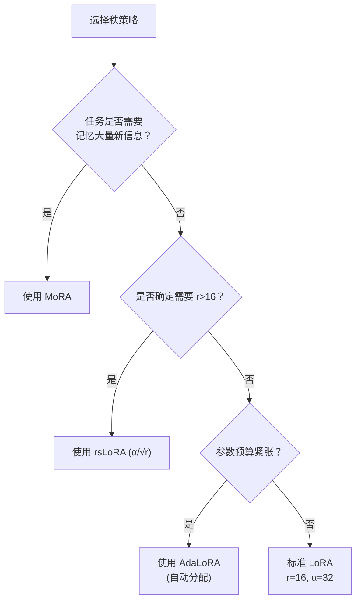

# LoRA 系列方法全景综述：从低秩适配到参数高效微调的完整进化图谱

> **一句话**：LoRA (Low-Rank Adaptation) 自 2022 年提出以来，已发展成一个庞大的研究方向。本综述系统梳理 LoRA 及其 15+ 种改进变体，从初始化、缩放、秩分配、显存优化、正则化、合并等多个维度构建完整的知识图谱。

**前置阅读**：
- [矩阵的秩与低秩近似](/前置知识/000z_前置知识_矩阵的秩与低秩近似) — 理解"秩"是什么，为什么低秩矩阵可以用小矩阵表示
- [LoRA 低秩适配基础](/前置知识/000x_前置知识_LoRA低秩适配基础) — LoRA 的数学基础
- [参数高效微调(PEFT)概览](/前置知识/000y_前置知识_参数高效微调PEFT概览) — PEFT 方法全景

---

## 一、引言：为什么 LoRA 成为了 PEFT 的事实标准？

自 2022 年 Hu et al. 提出 LoRA 以来，它已经成为大模型微调的**事实标准**方法。截至 2024 年底：
- Hugging Face PEFT 库下载量超过 1000 万次
- 超过 200 篇论文提出了 LoRA 的变体或改进
- 几乎所有主流开源模型（LLaMA、Mistral、Qwen 等）都提供 LoRA 微调支持

**LoRA 成功的核心原因**：

| 维度 | LoRA 的优势 |
|------|------------|
| **简洁** | 核心思想一句话说清：$\Delta W = BA$ |
| **有效** | 接近全参数微调效果 |
| **高效** | 参数量 <1%，显存大幅减少 |
| **推理零开销** | 合并后与原始模型完全相同 |
| **可组合** | 多个 LoRA 可切换/合并 |
| **易实现** | 不需要修改模型架构 |

---

## 二、LoRA 进化图谱

```mermaid
flowchart TB
    LoRA["LoRA (2022)<br/>低秩分解 ΔW=BA"]
    
    LoRA --> Efficiency["显存优化方向"]
    LoRA --> Effectiveness["效果提升方向"]
    LoRA --> Scale["秩与缩放方向"]
    LoRA --> Init["初始化方向"]
    LoRA --> Application["应用方向"]
    
    Efficiency --> QLoRA["QLoRA (2023)<br/>4-bit量化+LoRA"]
    Efficiency --> LoRAFA["LoRA-FA (2023)<br/>冻结A矩阵"]
    Efficiency --> GaLore["GaLore (2024)<br/>梯度低秩投影"]
    Efficiency --> VeRA["VeRA (2024)<br/>只训练缩放向量"]
    
    Effectiveness --> DoRA["DoRA (2024)<br/>方向+幅度分解"]
    Effectiveness --> LoRAPlus["LoRA+ (2024)<br/>不同学习率"]
    Effectiveness --> Dropout["LoRA+Dropout (2024)<br/>Hidden Dropout"]
    
    Scale --> AdaLoRA["AdaLoRA (2023)<br/>自适应秩"]
    Scale --> rsLoRA["rsLoRA (2024)<br/>√r缩放"]
    Scale --> DyLoRA["DyLoRA (2023)<br/>动态秩训练"]
    Scale --> MoRA["MoRA (2024)<br/>高秩更新"]
    
    Init --> PiSSA["PiSSA (2024)<br/>SVD主成分初始化"]
    
    Application --> Merge["LoRA Merge<br/>多适配器合并"]
    Application --> VLA["VLA适配<br/>机器人应用"]
    Application --> RL["RL后训练<br/>强化学习微调"]
```



---

## 三、按改进维度分类详解

### 3.1 显存优化方向

这一类方法关注的是：**如何在更少的显存下训练 LoRA？**

| 方法 | 核心创新 | 显存节省来源 | 效果损失 |
|------|---------|------------|---------|
| [QLoRA](./056_QLoRA_量化低秩适配) | NF4 量化基础模型 | 模型参数从 FP16→4bit | 几乎无 |
| [LoRA-FA](./060_LoRA_FA_冻结A矩阵) | 冻结 A 矩阵 | 不存 $x$ 的激活值 | <0.5% |
| [GaLore](./061_GaLore_梯度低秩投影训练) | 梯度低秩投影 | 优化器状态从 $O(dk)$→$O(r^2)$ | ~0.3% |
| [VeRA](./063_VeRA_向量化秩一适配) | 冻结 A+B，只训练缩放向量 | 可训练参数极少 | 1~2% |

**实际显存对比**（LLaMA-7B, batch=4, seq=2048）：

| 方法 | 总显存 | 相对标准 LoRA |
|------|--------|-------------|
| 全参数 (FP16) | ~84 GB | 5.6x |
| 标准 LoRA (FP16) | ~18 GB | 1x |
| QLoRA (4-bit) | ~6 GB | 0.33x |
| QLoRA + LoRA-FA | ~5 GB | 0.28x |
| GaLore | ~15 GB | 0.83x |

**选择建议**：
- 单卡消费级 GPU (24GB)：QLoRA
- 单卡 A100 (40/80GB)：标准 LoRA 或 QLoRA
- 预训练场景：GaLore
- 极端多任务存储限制：VeRA

---

### 3.2 效果提升方向

这一类方法关注的是：**如何让 LoRA 的效果更接近或超越全参数微调？**

| 方法 | 核心创新 | 原理 | 提升幅度 |
|------|---------|------|---------|
| [DoRA](./059_DoRA_权重分解低秩适配) | 方向-幅度分解 | 解耦方向和幅度的学习 | +1~2% |
| [LoRA+](./058_LoRAPlus_不同学习率适配) | B 的学习率 > A 的学习率 | 修复训练动力学不对称 | +0.2~0.3 |
| [HiddenKey](./064_LoRA_Dropout_防过拟合) | Hidden层Dropout | 专为 LoRA 设计的正则化 | +1~6%（小数据） |

**何时使用**：
- **DoRA**：几乎总是推荐（增加极少参数但效果一致性好）
- **LoRA+**：几乎总是推荐（只改学习率，零开销）
- **HiddenKey Dropout**：数据量少于 5000 条时推荐

**三者可以叠加使用**：DoRA + LoRA+ + HiddenKey = 当前最强单适配器配置。

---

### 3.3 秩与缩放方向

这一类方法解决的是：**如何选择和利用最优的秩 $r$？**

| 方法 | 解决的问题 | 方案 |
|------|-----------|------|
| [AdaLoRA](./057_AdaLoRA_自适应秩分配) | 不同层需要不同 $r$ | SVD参数化+重要性裁剪 |
| [rsLoRA](./062_rsLoRA_秩稳定缩放) | 大 $r$ 效果饱和 | $\alpha/\sqrt{r}$ 替代 $\alpha/r$ |
| [DyLoRA](./069_DyLoRA_动态秩训练) | 不确定最优 $r$ | 随机秩训练，推理时灵活选择 |
| [MoRA](./065_MoRA_高秩更新适配) | 低秩限制表达能力 | 方阵映射实现高秩更新 |

**决策树**：



---

### 3.4 初始化方向

| 方法 | 初始化 A | 初始化 B | 效果 |
|------|---------|---------|------|
| 标准 LoRA | 随机 | 零 | 基线 |
| [PiSSA](./066_PiSSA_主成分初始化LoRA) | SVD 右奇异向量 | SVD 左奇异向量 | +0.3~1% |
| OLoRA | 正交随机 | 正交随机 | +0.1~0.3% |
| LoRA-GA | 基于梯度 SVD | 基于梯度 SVD | +0.2~0.5% |

**推荐**：PiSSA 在大多数场景下一致优于标准初始化，且 Hugging Face PEFT 已原生支持。

---

### 3.5 应用方向

| 应用 | 关键论文 | 特殊考虑 |
|------|---------|---------|
| [VLA 适配](./067_LoRA_VLA_机器人视觉语言动作模型适配) | OpenVLA, Pi0 | 动作头全参数，LLM 骨架 LoRA |
| [多适配器合并](./068_LoRA_Merge_多适配器合并) | TIES, DARE, LoraHub | 方向冲突处理 |
| RL 后训练 | VLA-RL, RIPT | 小 $r$ + 低学习率 |
| 持续学习 | LifeLong RFT | 每任务独立 LoRA，冻结旧的 |
| 联邦学习 | FedLoRA | 只传输 LoRA 参数 |

---

## 四、方法间的兼容性矩阵

不同改进方法之间是否可以组合？

| 组合 | QLoRA | DoRA | LoRA+ | rsLoRA | PiSSA | LoRA-FA | VeRA | AdaLoRA | MoRA |
|------|-------|------|-------|--------|-------|---------|------|---------|------|
| **QLoRA** | - | ✅ | ✅ | ✅ | ✅ | ✅ | ❌ | ⚠️ | ❌ |
| **DoRA** | ✅ | - | ✅ | ✅ | ✅ | ⚠️ | ❌ | ⚠️ | ❌ |
| **LoRA+** | ✅ | ✅ | - | ✅ | ✅ | ❌ | ❌ | ✅ | ❌ |
| **rsLoRA** | ✅ | ✅ | ✅ | - | ✅ | ✅ | ❌ | ⚠️ | ❌ |
| **PiSSA** | ✅ | ✅ | ✅ | ✅ | - | ❌ | ❌ | ❌ | ❌ |
| **HiddenKey** | ✅ | ✅ | ✅ | ✅ | ✅ | ✅ | ✅ | ✅ | ✅ |

✅ = 完全兼容  ⚠️ = 需要小心调整  ❌ = 不兼容（设计冲突）

---

## 五、当前（2024-2025）推荐配置

### 5.1 通用最强配置

```python
# 2024-2025 年的"最强单 LoRA"配置
from peft import LoraConfig

config = LoraConfig(
    r=32,
    lora_alpha=32,
    use_rslora=True,           # rsLoRA 缩放
    init_lora_weights="pissa", # PiSSA 初始化
    target_modules="all-linear",
    lora_dropout=0.05,         # 轻度 HiddenKey Dropout
)

# 搭配 LoRA+ 学习率
optimizer_params = [
    {'params': lora_A_params, 'lr': 2e-4},
    {'params': lora_B_params, 'lr': 2e-4 * 16},
]
```

### 5.2 极致省显存配置

```python
# 显存极致节省：QLoRA + LoRA-FA 思路
from transformers import BitsAndBytesConfig

bnb_config = BitsAndBytesConfig(
    load_in_4bit=True,
    bnb_4bit_quant_type="nf4",
    bnb_4bit_compute_dtype=torch.bfloat16,
    bnb_4bit_use_double_quant=True,
)

config = LoraConfig(
    r=16,
    lora_alpha=16,
    use_rslora=True,
    target_modules="all-linear",
)
```

### 5.3 机器人/VLA 配置

```python
# VLA 模型适配
config = LoraConfig(
    r=32,
    lora_alpha=32,
    target_modules=[
        "q_proj", "k_proj", "v_proj", "o_proj",
        "gate_proj", "up_proj", "down_proj",
    ],
    modules_to_save=["action_head"],  # 动作头全参数
    lora_dropout=0.0,
    use_rslora=True,
)
```

---

## 六、LoRA 研究的未解决问题

### 6.1 理论问题

1. **最优秩的理论界**：给定任务和数据量，能否从理论上推导出最优 $r$？
2. **LoRA 的泛化理论**：为什么低秩约束有正则化效果？PAC-Bayes bound 是多少？
3. **合并的理论极限**：$N$ 个 LoRA 合并后的最优保持率是多少？

### 6.2 工程问题

1. **自动配置**：自动为任务选择最优 $r$、目标模块、学习率
2. **训练中动态调秩**：根据 loss landscape 自动增减秩
3. **异构 LoRA**：不同层使用不同类型的 PEFT（有些用 LoRA，有些用 Adapter）

### 6.3 应用问题

1. **LoRA 与安全对齐的交互**：LoRA 是否会绕过安全训练？
2. **持续学习**：如何无限制地添加新 LoRA 而不降低旧任务性能？
3. **多模态 LoRA**：视觉和语言部分是否需要不同的 LoRA 策略？

---

## 七、时间线总结

| 时间 | 方法 | 关键贡献 | 精读链接 | 需要的前置知识 |
|------|------|---------|---------|--------------|
| 2022.06 | **LoRA** | 开创性工作，低秩适配 | [精读](./055_LoRA_低秩适配微调大模型) | [矩阵的秩与低秩近似](/前置知识/000z_前置知识_矩阵的秩与低秩近似)、[PEFT 概览](/前置知识/000y_前置知识_参数高效微调PEFT概览) |
| 2023.01 | **AdaLoRA** | 自适应秩分配 | [精读](./057_AdaLoRA_自适应秩分配) | [LoRA 基础](/前置知识/000x_前置知识_LoRA低秩适配基础)、[矩阵的秩](/前置知识/000z_前置知识_矩阵的秩与低秩近似) |
| 2023.03 | **DyLoRA** | 动态秩训练 | [精读](./069_DyLoRA_动态秩训练) | [LoRA 基础](/前置知识/000x_前置知识_LoRA低秩适配基础) |
| 2023.05 | **QLoRA** | 4-bit量化+LoRA，民主化微调 | [精读](./056_QLoRA_量化低秩适配) | [LoRA 基础](/前置知识/000x_前置知识_LoRA低秩适配基础) |
| 2023.06 | **LoRA-FA** | 冻结A，节省激活显存 | [精读](./060_LoRA_FA_冻结A矩阵) | [LoRA 基础](/前置知识/000x_前置知识_LoRA低秩适配基础) |
| 2023.10 | **LoRA Merge/TIES** | 多适配器合并 | [精读](./068_LoRA_Merge_多适配器合并) | [LoRA 基础](/前置知识/000x_前置知识_LoRA低秩适配基础)、[矩阵的秩](/前置知识/000z_前置知识_矩阵的秩与低秩近似) |
| 2024.01 | **DoRA** | 方向-幅度分解 | [精读](./059_DoRA_权重分解低秩适配) | [LoRA 基础](/前置知识/000x_前置知识_LoRA低秩适配基础) |
| 2024.02 | **LoRA+** | 不同学习率 | [精读](./058_LoRAPlus_不同学习率适配) | [LoRA 基础](/前置知识/000x_前置知识_LoRA低秩适配基础) |
| 2024.02 | **GaLore** | 梯度低秩投影 | [精读](./061_GaLore_梯度低秩投影训练) | [LoRA 基础](/前置知识/000x_前置知识_LoRA低秩适配基础)、[矩阵的秩](/前置知识/000z_前置知识_矩阵的秩与低秩近似) |
| 2024.03 | **VeRA** | 只训练缩放向量 | [精读](./063_VeRA_向量化秩一适配) | [LoRA 基础](/前置知识/000x_前置知识_LoRA低秩适配基础)、[LoRA-FA](./060_LoRA_FA_冻结A矩阵) |
| 2024.04 | **rsLoRA** | 秩稳定缩放 | [精读](./062_rsLoRA_秩稳定缩放) | [LoRA 基础](/前置知识/000x_前置知识_LoRA低秩适配基础)、[矩阵的秩](/前置知识/000z_前置知识_矩阵的秩与低秩近似) |
| 2024.05 | **MoRA** | 高秩更新 | [精读](./065_MoRA_高秩更新适配) | [LoRA 基础](/前置知识/000x_前置知识_LoRA低秩适配基础)、[矩阵的秩](/前置知识/000z_前置知识_矩阵的秩与低秩近似) |
| 2024.06 | **PiSSA** | SVD 主成分初始化 | [精读](./066_PiSSA_主成分初始化LoRA) | [LoRA 基础](/前置知识/000x_前置知识_LoRA低秩适配基础)、[矩阵的秩](/前置知识/000z_前置知识_矩阵的秩与低秩近似) |
| 2024.07 | **HiddenKey** | LoRA 专用正则化 | [精读](./064_LoRA_Dropout_防过拟合) | [LoRA 基础](/前置知识/000x_前置知识_LoRA低秩适配基础) |
| 2024-25 | **VLA+LoRA** | 机器人大模型适配 | [精读](./067_LoRA_VLA_机器人视觉语言动作模型适配) | [LoRA 基础](/前置知识/000x_前置知识_LoRA低秩适配基础)、[VLA 综述](/论文综述/S03_视觉语言动作模型VLA综述) |
| 2023-24 | **LoraHub** | 无梯度组合多 LoRA 跨任务泛化 | [精读](./070_LoRAHub_组合多LoRA适配器) | [LoRA 基础](/前置知识/000x_前置知识_LoRA低秩适配基础)、[LoRA Merge](./068_LoRA_Merge_多适配器合并) |

---

## 八、结论

LoRA 从一个简洁的想法——$\Delta W = BA$——发展成了一个完整的研究方向。它的成功验证了一个深刻的洞察：

> **大模型的参数空间是极度冗余的。适配到特定任务只需要在一个极低维的子空间中做调整。**

这个洞察不仅催生了 LoRA 系列方法，还深刻影响了我们对大模型训练和部署的理解。

未来，LoRA 的发展可能会沿着以下方向继续：
1. **更自动化**：无需人工调参的自适应 LoRA
2. **更高效**：训练和推理开销进一步压缩
3. **更通用**：从 NLP 到多模态到机器人的统一方案
4. **更理论化**：建立完整的理论框架

---

## 延伸阅读

### 前置知识
- [矩阵的秩与低秩近似](/前置知识/000z_前置知识_矩阵的秩与低秩近似) — 理解"秩"是什么、为什么低秩可以压缩
- [LoRA 低秩适配基础](/前置知识/000x_前置知识_LoRA低秩适配基础) — LoRA 的数学原理
- [参数高效微调(PEFT)概览](/前置知识/000y_前置知识_参数高效微调PEFT概览) — PEFT 方法全景

### 论文精读
- [LoRA 原始论文](./055_LoRA_低秩适配微调大模型)
- [QLoRA](./056_QLoRA_量化低秩适配)
- [AdaLoRA](./057_AdaLoRA_自适应秩分配)
- [LoRA+](./058_LoRAPlus_不同学习率适配)
- [DoRA](./059_DoRA_权重分解低秩适配)
- [LoRA-FA](./060_LoRA_FA_冻结A矩阵)
- [GaLore](./061_GaLore_梯度低秩投影训练)
- [rsLoRA](./062_rsLoRA_秩稳定缩放)
- [VeRA](./063_VeRA_向量化秩一适配)
- [LoRA+Dropout](./064_LoRA_Dropout_防过拟合)
- [MoRA](./065_MoRA_高秩更新适配)
- [PiSSA](./066_PiSSA_主成分初始化LoRA)
- [LoRA 在 VLA 中的应用](./067_LoRA_VLA_机器人视觉语言动作模型适配)
- [LoRA Merge](./068_LoRA_Merge_多适配器合并)
- [DyLoRA](./069_DyLoRA_动态秩训练)
